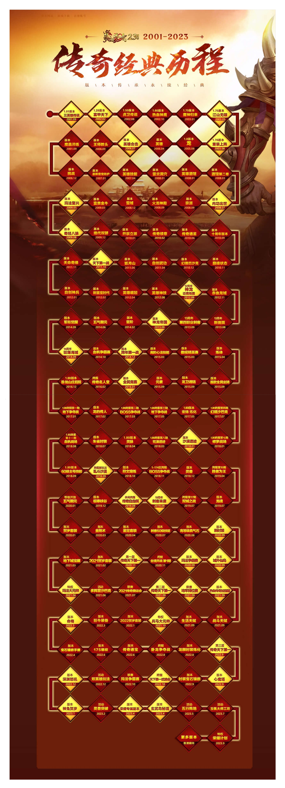

# Mir 2 Chinese

传奇已经 20 多年的历史，传奇经历了哪些版本，老玩家还记得吗？从 01 年盛大把传奇引入国内，一直到现在传奇依然有很多玩家，那么我们继续上一期讲解传奇都经历了那些版本，传奇的每个版本都什么改动或者特色。

先看一张传奇版本更新历史，从 2001 年 9 月至 2023 年 9 月，其实盛大传奇官服一直都在更新，后期甚至每个月都有新的玩法，这也是为什么这么多年传奇官服依然有人在玩的原因。

## 2001.09（1.01 版本）三英雄传说

今天我们先从传奇第一个版本说起，传奇2001年9月正式开启公测，热血传奇三英传说，为什么不念全呢？版本明明是三英雄传说，这个经历过的玩家都应该明白为什么要这样念，就像那个时期的骷髅洞，明明叫兽人古墓。传言则是说屏幕太小了挡住了一个字，应该叫半兽人古墓才对，那往后面的沃玛自然洞穴又算什么呢？这个时期的玩家对于所有的一切都是那么的新鲜，甚至挖肉都是别人教的。这个版本的所有玩家都在疯狂的熟悉地图，练级攒金币，只为了尽早能穿上22级的衣服。

## 2002.02（1.28 版本）富甲天下

赌场的开放，人人都是百万富翁可能是秉着先让一部分人富起来的原因，没过几日比奇客栈二楼（进入赌场的入口）就开始装修了，这也是我第一次看见金条这个道具，这个时期的玩家不再为了升级的药钱而发愁，很快第一批超级玩家诞生了。他们的标志就是身上挂着零星的祖玛装备，当时网吧里的一个大哥，收了一个阎罗手套就什么事也不干，站在安全区让别人看，那叫一个满足。

## 2002.08（1.50 版本）虎卫传说

随着白日门的开放更多的玩家涌向了这片未知的领地，级玩家在这里连一只怪也打不过，团队意识首次变得这么强烈，迫切的需要一个行会，需要人来组织才有可能打得过金刚血魔，版本既然叫虎卫传说那为什么不提虎卫这个版本？你但凡敢带虎卫去任何地图，那绝对会被别人招走，后半夜更是有无数的法师死在自己虎卫的手里，因为那个时候宝宝叛变是真的叛变，一不留神一刀就死。

## 2002.10（1.60 版本）热血神鹰

其实算是中间的一个过渡版本，也就是在这个时候猪洞7层的桃园之门悄悄开放了，各种提升属性的药水，原来在这里可以合成嗜血魔剑，还有虹魔和魔血套的出现弥补了战士升级带药亏钱和法师脆皮容易被秒的问题，装备属性的增强，加上官方下调赤月怪物的伤害，圣战法神天尊不再是千金难求的装备了。

## 2003.01（1.70 版本）魔神归来

随着封魔谷的开放，游戏资源的80%倾向这里，这是也是小编最喜欢的一个版本，如果你去过老版的封魔谷就会知道，骷髅精灵会喊话好好练功，沃玛教主也会警告你小心这里的一切事物，这次更新了树妖、虹魔猪卫、龙虾，还有最终boss虹魔教主。城外900勇士成了低级法师的摇钱树，歧路的尽头总有一场架等着你去打，无数的玩家在霸者大厅买药的时候被偷袭，没金币的玩家甚至会卖掉穿戴的装备买药也要往里闯，只因为这里面超高的装备爆率，这个版本迅速普及了沃玛套同时产出的祖玛装备也不少，打宝的同时经验可观，这里的每一张地图几乎24小时都有人在打，中小行会迅速崛起，他们都在想着同一件事，有朝一日自己也可以带领行会成员去赤月的深处搅他个天翻地覆此时。这个版本中多一点攻击或防御属性，都能展现的淋漓尽致。

## 2003.03（1.72 版本）婚姻系统

这也是一个过渡的版本，这个版本甚至没能被官方记录，类似于这样的小更新还有很多，从这里开始，盛大传奇官方没有记录的版本就不再提了，此次更新了师徒、声望、勋章系统，还加入了呼声最高的婚姻系统，封魔谷的2楼进入同心小径挑战虹魔猪卫就有几率爆出求婚戒指。

## 2003.05（1.75 版本）江山无限

2003年5月盛大传奇苍月岛开放，这里的风景增加了更多的元素，海边、码头。裁决、骨玉、龙纹剑再也不是终极武器了，三张新地图两个大boss，还有一句广为流传的谣言，就是此次更新的全部内容。当年这个版本想要拿上终极武器毕业，难度并不是牛魔王，而是牛魔5层下6层这里，一整个行会被团灭，在这里的事每天都在上演。

## 2003.08（1.76 版本）重装上阵

还记得当年在传奇官网看新衣服的图片，无时无刻不在幻想着有朝一日能穿上天魔，无数人的青春也停留在了这个版本，这个版本也是盛大传奇人气最鼎盛的时候，六大重装引得玩家无尽的杀戮，幻境最后的疯狂更是将贪婪这一面暴露无遗，传奇历史上最有名的bug大部分也都来自这个版本，这也是拖更时间最长的一个版本，与之相匹配的外挂更是数不胜数，更有chuanshen888这样的免费挂机平台，甚至不需要登录游戏，所有的一切都以数据的形式展现，在这里玩家的等级被彻底拉开。

## 2005.08（1.80版本）龙

两年磨一剑，在2005年8月正式更新，更新了以魔龙全境为主题的系列地图、怪物、装备和技能，腰带和鞋的出现使得法师带得起黑铁头盔，道士的防御更是高得离谱，魔龙教主带着他所有的宝物在最后一层等你，想挑战魔龙教主先想办法通过魔龙东西关吧，这种不许吃药的设定当年在比打1.50的赤月难度不相上下，现在提起来人们好像都知道要走魔龙东关，为什么没人去魔龙西关呢？现如今再进官服去西关会有一个莫名其妙的NPC告诉你，这里已经被封印了，就这样整个魔龙少了一张地图，其实最早期的魔龙西关是可以进去的。如果我没记错的话西关里是可以飞随机的，细心的大佬这个时候会给提示魔龙还少过一张图呢。我知道你们想说魔龙殿，但它早已淹没在历史的长河中了。

3个月后盛大宣布永久免费并引入元宝系统，属于传奇的氪金时代正式开启，元宝兑换灵符可以闯天关挑战魔王岭，元宝申请锻造金刚石，海量经验和道具。金刚石还可以在苍月岛的武器店内合成所有玩家梦寐以求的屠龙，这个时期每天3块钱是必花的（4*3=12金刚石），锻造结束后12颗金刚石一起领取100万以上的经验+地下组队券和祝福油，想拿屠龙的大佬们1:6收金刚石。地下宫殿24小时有人打架，组队卷供不应求，经验等于白嫖的，就这样打了些日子玩家发现魔龙已经不出装备了。取而代之的是各种藏宝图，闯天关魔王岭开宝箱也全都是藏宝图，首饰4张连号合成，衣服则需要8张才能合成，且都需要大量的金刚石。就是在这个时间段传奇私服也开始疯狂的有那种合成版本，什么雷霆2合1+2+3+4的魔龙装备，这个版本可玩的东西实在是太多了。

## 2006.04 英雄

也是从这天起，热血传奇正式分裂成了两个游戏，进而演变成了合击版与单职业的争论。盛大官服玩家普遍接受了英雄的存在，练英雄真的像养孩子一样，看着他一天天的成长那种喜悦是油然而生的。当你完完整整的把英雄之路的任务完成之后，你也许就会有一样的感慨。英雄在22级之前只要是跟随状态所有的怪物都不会主动攻击英雄，英雄获得经验为主号当前获得经验的8%到12%，而英雄一旦死亡则会掉落大量的经验，原版英雄之路的任务就算你每一步都氪金，高低也要一个月才能完成。要求等级40以上，去苍月岛仓库里面找神秘人领取任务。

## 2006.07 英雄合计

大范围高伤害、门槛苛刻，技能华丽这是小编对初代合击版本的总结，其实自从公布了英雄版本之后就已经有合击技能的消息了，奈何各种bug的原因一直在推迟，越是这样就越容易引发关注。合击除了道道以外，其实就是补充一个大的伤害，让对手来不及反应或保护调的不够高而直接被秒杀。那为啥非得除了道道合击呢？因为噬魂沼泽基本上就是个秒人的技能，估计盛大都不记得削弱过多少次了，即使在今天的传奇官服和传奇私服噬魂沼泽依然是所有合击中最有用的。

## 2006.09 王师教头

盛大在这一版本中是要把魔龙装备普及化，起初这个NPC不叫金牌尊者，更不在庄园内。这个版本非常好理解，就像拼夕夕拉人头术一样，奖励一档比一档丰厚，只要账号满35级就可以申请成为王师教头。这个时候再收徒弟的话，徒弟每个相对应的等级都可以领取各种各样的奖励，最终50级时可以领取战神、圣魔、真魂随机一件。师傅在徒弟47-50级之间，每1级可以领取1件魔龙装备。并且可以获得徒弟35级之后升级过程中5%的经验，直到46级。与此同时还有金牌账号，热血勇士等玩法，一个字就是氪。不过那个年代金牌账号是有可能不亏本的，递交30个白金积分就可以成为白金角色，递交30个热血积分就可以成为热血勇士，都是每一级有随机的奖励，不过白金角色60级的奖励是开天、震天、玄天指定一把。这两个积分闯天关、穆安岭有几率出，而一张白金积分卖几百块钱还是很轻松的。

## 2006.09 魔晶淬炼

这时候包裹右下角会有这么一个按钮，这套系统就是所谓的魔晶淬炼，主要的玩法有两种，1、直接合成魔龙装备，需要从商铺购买魔龙冰晶+一个魔王岭出的弩牌，和新地图小怪有几率出的火云石碎片，就有几率直接可以合成魔龙装备。如果失败的话弩牌会消失，火云石碎片掉持久，魔龙冰晶大概率也会消失。2、淬炼魔龙系列装备；除去腰带和鞋，如果淬炼成功的话雷霆就会变成奔雷，烈焰会变成怒焰，光芒会变成极光。材料方面需要一件魔龙装备，加上新地图boss有几率掉出的火云石，再加上任意一件雷泽、幻魔、起源封印装备即可进行淬炼。这个淬炼成功的几率非常大，但给予的属性却是完全随机的，火云石也是有持久的，如果持久消耗殆尽则需要从商铺里购买火云晶石来修复。持久看似是费力不讨好的玩法，随机的属性明明弱爆了为什么还有那么多人去淬炼？正是因为属性完全随机，毕竟0-9的奔雷戒指也是出过的，更何况淬炼项链有可能得到幸运的属性。试想一下，一条运2攻6的奔雷项链，高低也能卖几千块。补充一个冷知识，火云石没持久先别着急花钱买晶石，装备上火云石后使用火云石碎片就可以修复。

## 2006.12 挑战

玩家们自发组织的单挑赛无非就是盟重大密室，虽然规则上不允许吃药，可真吃一瓶小太阳谁又能看出来呢。为了响应玩家们的喜好，盛大在06年底更新了此次版本，挑战和交易一样，挑战双方需要面对面压上对赌的装备或金币，双方点下确认后会被传送至困惑殿堂一样的地图内，和大密室的玩法一样，但盛大官方的设定只限于不能吃药，看似公平合理的玩法可玩家们绝对不会买账的。官方的这张图完全不允许观战，只能PK的双方在这张地图里面操作，再加上初期的各种bug，真正有恩怨的双方是一定会去大密室预约一场架的。这里初期的一个bug就是你残血的情况下猛喝十几瓶金疮药，然后点挑战确定进地图后，因为你的血量还不满所以会一直涨到满为止。这个时候千万不要想着操作的事，免Shift追着对面砍就行了，但那个年代挑战功能用的最多的却是跑图，官服从公测至今也没有开放过任何一个NPC可以直接跨地图传送。在盟重双方点挑战，不压任何物品传送进单挑地图后小退，再上线时你会发现你站在白日门，其他几个大城挑战小退也会传送到一些城市，但全部都是跨地图的。

## 2007.01 最新密保防护

游戏登录器更新了新的密宝登录界面和反外挂程序，但依然没有卵用，最离谱的是我绑着密宝的账号都能给我盗的干干净净。

## 2007.04 英雄技能

这是一次非常大胆的更新，出现了只有英雄才能学习的3大技能，战士的开天斩、法师的分身术、道士召唤月灵（注意这3个技能是只有英雄才能学的），现在很多传奇私服中已经将开天斩作为战士的主号技能了，召唤月灵分身术就更不要说了。但盛大官方到今天为止主号也没有这些技能，那为什么说这次更新非常大胆呢？其实早就有消息说英雄迎来三大神技，只是伤方面一直在做调整，在正式更新至全服务器前只在21区江山如画测试，测试阶段去21区你就会看到所有的人都在骂盛大。

## 2008.01 雷炎洞穴

闪电、熔岩极度危险的生命禁区，时间追溯到半兽人入侵的年代，三龙卫率领援军通过雪山时不幸惊动了火龙，引发了史无前例的雪山大崩塌，从此阻隔了人类回归家园的道路，而雪山火龙则在这场大崩塌之后被深埋在地下，坠入到了一个神秘的未知领域，它庞大无比的身躯将地壳砸出一个巨型的坑洞，滚热的熔岩从皲裂的地缝中奔涌而出，伴随着狂暴的飓风形成一道道足以劈天裂地的闪电，在这个奔涌着神秘力量的地下深血中受伤的火龙得以休养生息，一晃就是数百年这便是雷岩洞穴的前身。直到数百年后的某一天，一位无名英雄在历练时无意闯出了这个充满极度危险的生命禁区，雷岩洞穴的秘密便公之于众。这张地图一共有两层，可以说非常的小，一层的boss是狂热火蜥蜴，伤害高的看不懂，二层的boss就是雷岩蛛王，再加上地形有自然伤害，那个时候不管是天上的雷还是地上的火，被击中的瞬间就能损失一大格生命值。装备更新了一个特殊属性“吸收伤害”，三职业全新套装狂雷、逆火、通云。伴随着雷岩洞穴的开放，也将逐渐揭开神秘的面纱。

## 2008.01 英雄酒馆

若干年前酒馆曾是名将最怀念的地方，当年骁勇善战的他们常聚集在那里共同切磋战绩，若干年后一座酒馆又悄然出现在了盟众，相传只要你有足够的自信和实力就能从那里招募到一位名将英雄祥天、晨星、影月。说白了这个版本就是让玩家可以重新选择英雄的职业，没错在酒馆英雄这个版本出现之前英雄的选择是终身的，想要更换英雄的职业就只能重新练号。而酒馆英雄这个版本只需要花费元宝购买烧酒灌倒祥天，就可以给你战、法、道三职业的三个副将英雄，可以随意选定一个作为主将英雄使用，不需要前期因为选错英雄职业再懊恼不已了。

## 2008.03 酒馆第二卷

这第二卷的正式版本名叫酒剑江湖，顾名思义就是以“酒”作为主题展开的一系列改动。包括酿酒、夺酒、饮酒英雄与酒等玩法。先说酿酒，就像我讲过祝福油怎么喝一样，酿酒自古以来也流传有制酒六绝，秫稻必备、曲蘖必时、湛炽必洁、水泉必香、陶器必良、火齐必得，其中诸多变数。击杀某些怪物或boss有几率随机掉落酿酒的原材料，其中任何一种都可以按你的意愿当做酿酒的主料或辅料，但是怎样搭配才能酿成好酒就要经过一些尝试了，和普通品质的原料相比品质更高的精致原料自然也可以酿出高品质的好酒。而药材则是酿造高品质药酒的必备材料，是影响药酒效果的关键。5种药材对应着玛法大陆的5大boss，击杀它们为你的酒增加一种风味，而酒曲的获得则是在酿酒成功后有一定几率获得相应的酒曲，在酿造特定种类的酒时加上特定的酒曲可以提高酒的品质，最后再来说酒器，酿造普通酒的器皿用陶土酒坛就可以，而对一些特殊的药酒来说则对装酒的瓶子也有一定的要求，例如只能用青花酒瓶。当你准备好这些材料后找到酒馆老板娘，选择酿酒或配制药酒，放入相应的材料，等待一段时间后即可取回酿好的酒。

夺酒是什么呢？那就要说到影响酒品质的重要因素水，前面说通过打怪可以得到酿酒的原材料，但酿造高品质酒所需要的泉水则是爆不出来的，相比清水而言也更容易酿造出高品质的酒，当年盛产泉水的酒泉近乎干涸，人们几经寻觅才找到了仅存的几口泉眼，并且他们的喷发时间也不确定，泉眼的争夺从酿酒系统出现至今从未停止过，每天泉水喷发的时间也必有一场恶仗。

说到饮酒，一坛好酒若无细细品尝则断无功成之力，以这瓶护骨酒为例，容量就是它可以饮用的次数，品质标志着酒的好坏，好酒会在临时属性抵御合击伤害，酒量增长方面更有优势。酒精度便是酒的烈性程度，饮用高酒精度的酒可以让你的酒量增长得更多，酒量值与药力值均为状态面板显示，HP与MP之间的槽便是醉酒度的提示。在酒精的作用下可激发超乎平常倍数的潜能，抵御合击的伤害，刹那间扭转战局。最后英雄也能饮酒，当酒以日积月累聚集在英雄的体内，可以激发英雄与生俱来的先天属性。

## 2008.07 内功出世

什么是内功？内功护体是面对任何攻击的伤害都会得到一定量的减免，同时随着你内功心法等级的提升所减免的伤害值也会越来越多。一旦你学习了内功当可拈花飞叶，强人于无形之中，你打出的所有伤害都会得到提升，同时随着你内功心法等级的提升攻击威力也会越来越强。当你学习内功之后，会对技能的领悟能力有一个质的突破，可以领悟更高等级的技能，如果学习了技能防御书籍，也就是静置技能，在受到这些技能攻击的同时便可以从容的防御，减免掉一定的伤害值。随着你内功心法等级的提升所减免的伤害值会越来越多。玛法大陆上怀有内功的怪物有很多，只不过你没有学习内功的时候是无法观察到的，只要学习了内功就能发现某些怪物的名字变成了紫色，消灭它们就会获得它们体内蕴含的力量。你的内功经验也会得到增长。

2008年9月宗派，这是一个大佬消费小弟得力的版本。但前提是必须通过特定的渠道注册新的账号才行。当年官服的宣传语“开宗立派广交天下朋友”，实际情况却是你花钱都入不了大佬们的宗。我先简单阐述一下这到底是个什么样的玩法。首先只要是40级以上的玩家，都可以在比奇皇宫创建属于自己的宗派，成为宗主。而通过特定渠道注册的账号包裹里会有一张入宗令，与宗主面对面申请加入宗派成为宗派传人，成功后宗主所获得的所有经验将以100%传授于你，直到你满51级为止自动脱离宗派。听上去挺美好的，但你去哪找袁大头的宗主呢，宗主快速获得经验的办法就是氪金。

## 2008.09 火龙神殿

终于有了一个具有挑战性的boss，这是一个团队下的副本。要求组内成员不得少于6人，此次更新了三职业的新装备，炎龙、雷龙、青龙套装。随之而来的还有三把属性逆天的武器，战士的炎龙刃、法师的雷龙杖、以及道士的青龙刺，至于玩法吗。一周之内只能下5次火龙神殿，而火龙神殿则有两种地图，普通的火龙地图10万金币，高级火龙地图则需要火龙凭证。高级火龙地图的boss必爆一颗龙魂，且有机会出火龙角、火龙筋、火龙鳞和主宰灵玉，还有可能直接掉落火龙装备。这里再说个冷知识：火龙神殿的地图和天关的设定一样，当玩家从这张地图回城再进来时那必然不是同一张图(30区逍遥都知道吧？就是那个运6战神链、准3攻9夏普尔手的区，当年落日战神还是谁来着死在了火龙神殿里，掉了一只手镯，他死亡掉落物品的这张图是无论如何也不可能再进去了。于是找到GM要求补偿，但是GM以装备属性过于高而拒绝了，最终在超能力的帮助下补偿了一只准3攻8的夏普尔手)。当你集齐了7颗龙珠，递交龙魂时选择经验的成长会得到4500万经验，选择内功的成长会得到500万内功，
选择神兵利器会给予一把炎龙之刃，三职业通用属性相当。可以选择爱的表达可以对你心爱之人吐露心声，用系统红字发送全服。选择伉俪情深将对你的配偶吐露心声，用系统红字发送全服。最后选择战友义气则可以对朋友吐露心声。一般人都会选择神兵利器，这就是为什么以前盛大老区的炎龙之刃多的原因。

## 2008.12 雪域

法师的崛起，先让你打个5分钟再还手，这个版本的法师就是有这样的勇气。随着雪域地图的开放，玩家们的内功等级一路飙升，单论打怪效率哪有职业能超得过法师呢。这里所有的怪物
都蕴含大量的内功经验，法师的内功等级迅速崛起，以至于非氪金玩家打的大佬满街跑，当然在这之后
所有的一切都重新做过调整，包括各种任务的奖励和消耗灵符的修炼，都可以使内功等级追得上天天刷雪域的法师们了。

## 2009.03 富贵金牛

我愿称之为史上最方便的练功师，练英雄的技能是真的很方便，当然这里是氪金大佬每天必玩的项目。现如今的商铺里已经没有相应的道具出售了。天雷弹和霹雳弹每个道具可以使用5次售价5元，也就是说一块钱一次。放到道具栏下方鼠标指向富贵兽就可以使用，每打中一次随机获得牛气值，对应屏幕上方的天赐宝箱。牛气值每满一次即可开启宝箱。

## 2009.05 玛法复兴

是不是对这个版本没什么印象，那我要说他另一个名字连击风暴是不是就恍然大悟了。没错，此次更新之后加入了连击系统。何为连击系统呢？就是把技能连接起来释放。连击的每一招都可以单独学习和使用，学会两招以上就可以自由组合成连击，而每个职业的连击技能有4种，英雄连击则只能使用其中的3招，小编也不知道现在的版本有没有开放第四招，反正那个时候是只能打3招，人物面板上方会有4个格子，分别可以选择使用连招的第几式，且对应的暴击几率不同，这种玩法可以说大大增加了游戏的参与感。

## 2009.08 奇经八脉

5条奇经分别是神冲、二百、夹脊、涌泉、八风每个穴位都暗藏神技，打通穴位即可触发全新技能，奇经的第一个穴位神冲穴对应的第一个技能是斗转星移，它是被动技能无需设置快捷键，可抵御大额伤害，利用内力吸收分摊所有的伤害，然后催动内力进行恢复，减少自身的生命值损失。第二个穴位二百穴还没有开放，所以不知道对应什么技能。说到这个其他穴位，想打通他们就得使用道具金针了，以前商铺里是有卖金针的，而boss则会随机掉落金针碎片，金针也是有等级之分的，需要一步步往更高级合成，随着下一次版本更新估计这套系统就永远烂在这里了。

## 2009.12 绝代双骄

双英雄时代来临这个版本就是酒馆英雄2.0，只不过之前是只能召唤一个英雄来作战，而此次更新之后出现了召唤副将英雄的选项，主将副将两个英雄可以是同一职业，也可以区分开来，主将英雄收回后可以立刻召唤副将英雄继续战斗，这也意味着又需要给副将英雄再收购一套装备，盛大官服的氪金之路似乎永远走不到终点。

## 2010.01 开宗立派

和之前的宗派系统大同小异，不过这次宗派系统有了一个像行会一样的列表，可以实时看到弟子们的信息，说白了官服也是需要有人气的，需要新鲜血液的加入，而前期升级麻烦后期才是氪金的重头，为了可持续性的节奏而虞罢了。

## 2010.02 传奇序章

开区确实非常火爆。

## 2010.06 传奇通鉴

屌丝逆袭成为高富帅，又或者陪伴了你很久的一把刀难道你不想看看他的隐藏属性吗。传奇的策划把握住了人性的贪婪，鉴定系统的加入无异于和赌博一样。官方给出的说法是神秘属性解读出来有可能是非常好的属性，如麻痹特效、护身特效、重生特效、传送特效等，可使你的普通装备获得特戒属性。首先神秘属性的获得分为两种，一是在鉴定师这里对装备进行鉴定的时候有几率获得神秘属性，二是挖宝的时候挖出的宝物带有神秘属性，这个挖宝又是什么鬼？这是类似于梦幻中挖藏宝图一样的玩法，需要准备两种道具，1是灵媒、2是铲子，灵媒初期可以在除魔任务中获得，当然结合上面的装备鉴定也是可以将某件物品鉴定出灵媒，至于铲子5000金币可以买新手铲，但毛也挖不到，只有元宝购买的铲子才有可能挖出一些垃圾道具。官方给出的说法是灵媒具有一定的品质，使用高品质的灵媒和质量好的铲子才能挖的出宝物，如果你坚持不懈且运气够好还能挖到天龙装备甚至特戒。

## 2010.09 十周年版本

现在很多传奇私服的客户端都是用的这个版本的客户端，这一章节对未来的传奇影响巨大。小编亲历了它的毁灭，也因为这件事让YY这个聊天工具一战成名，早在十周年庆典来临之前，玩家们已经发现无法通过递交头像申请攻城了。玩家们被迫更新了一次版本，可并没有新的玩法道具加入，直到28日上午10点盟重土城全境地图改为战斗模式，被击杀后不会掉落物品，整个盟重瞬间刷满怪物，所有的人都措手不及，面对来袭的各路敌人手拿大刀的卫士也刷满了土城四周，中午12点开始各大教主对盟重发起了袭击，下午1点巨大的冰山如海市蜃楼般突然出现，下午2点月灵神兽及所有的召唤物倾刻间全部叛变，下午4点卧龙守将们迷失了心智开始向玛法勇士们发起进攻，晚6点盟重突然地动山摇，泉水倾刻间喷涌而出穿过城墙直漫土城。与此同时火龙突然觉醒，土城内生灵涂炭。晚7点怪物们被逐一击破勇士们刚刚得到喘息的机会，传奇版植物大战僵尸开始上演，矿洞的僵尸们奔涌而出，排着队攻击食人花。晚8点镖车出现，晚9点群魔逃出，9点28分沙巴克城轰然倒塌，9点28分对应着01年9月28日，1区到148区百万官服玩家共同见证了沙巴克的消失。

10年以来，在沙巴克旧址上进行的最后一战，因此被命名为沙巴克终极之战。为争夺10年来最终极的荣耀，无数行会家族倾巢而出，群雄逐鹿，堪称玛法世界大战。而在这场终极较量中每个服务器占领沙巴克时间最长的城主，将会获得永久性道具城主战袍一件。这是每组服务器只有一件的装备，只有沙巴克终极之战的最终获胜者才能终身享有，此役之后沙巴克旧址将永久关闭，而英雄的功勋将永远铭刻在玛法史册之上。此战之后沙巴克就被修复成了现在的样子，这给那些没有经历过的人留下满脸疑惑。那个时期的传奇私服如果用官服的客户端登录，你需要先更新百区才能正常游玩，否则你的盟重就是乱码。

## 2010.11 巅峰状态

巅峰状态是“巅峰战神状态”和”巅峰勇士状态”的统称。获得这两种状态之后，玩家的攻击力大幅提，在攻击的过程中有几率对敌人造成额外的高额伤害，只有排行榜前100的玩家才有资格获得巅峰战神状态。说白了这就是提升攻击属性的buff，想要获得此buff那就得不停的消费，每消费1元宝即可获得一个挑战点，每天可在庄园NPC绝世高手处使用，挑战点兑换巅峰令牌称号，有效期24小时。

## 2010.12 幻境沙巴克

沙巴克消失浩浩荡荡的重建计划正在紧张的进行中。就在玛法子年纷纷揣测沙巴克何时迎来真正的重生时，一座若隐若无酷似沙巴克却又透出神秘与众不同的幻境沙巴克惊现玛法大陆。这里有着完全不同的攻城玩法。简单说就是砍倒旗帜占领据点，获得各种buff加成。比如传送、召唤龙卫、使用投石机火攻等，这越来越像真正的攻城了。

## 2011.04 自创武功

简单来说就是可以给进入龙神境界的技能起一个名字，但不是想叫什么就可以随便写的。

## 2011.06 狐月山

狐月山的开放使得脚本工作室大量涌入，这里可以爆出卖元宝的各种材料和完成任务所需的道具。但最有趣的玩法还是胡月山的宝藏，由于这里是不能飞随机的，公屏会全服提示某某坐标，到达该坐标后会进入像困惑殿堂一样的房间，满地的装备道具就是捡不起来。这就是让你等着人进来打一架的地方，只有强者才能支配这些宝藏。

## 2011.10 天下第一

传奇有史以来首次全区全服的跨服行会争霸战，天下第一战之远征沙巴克。百个大区，千余行会的全情投入必将造就一场无比辉煌的史诗大战。5000万荣耀点的奖励投入更是创造了玛法历史之最，踏破重重难关的冠军行会加冕天下第一行会耀眼王冠的同时，还能享受诸多特权。天下第一战袍全体行会成员的特殊称号，光荣的战绩也将录入玛法史册。主赛区为1-129区，全部服务器分为16大组，先进行首轮预选赛，每小组的前两名晋级下一轮分组，预选赛结束后将进入共计5轮的淘汰赛，从而决出最后的冠军行会。因为游戏版本及开服时间的限制，130-154区将成为独立的特别赛区不参与活动。总冠军的争夺这场声势浩大的天下第一战，不管玩不玩官服的人貌似都知道。简单说一下规则和玩法，首先因为是跨服攻城战，所以有一个中央服务器，所有申请天下第一跨服站的行会成员都可以将原区数据带入到中央服务器内，中央服爆出的所有东西与原区无关。所有的玩家都不在意数据问题所以打的也就更奔放了。平常一两个行会攻城都人山人海的，这全服几千个行会是什么样呢？其实是类似于幻境沙巴克一样，虽然是正规地图打可还是有占据据点的玩法。当有一个行会占领了开阳、玉衡或摇光据点后，行会成员可以从盟政土城安全区直接传送至该据点周围，当一个行会占领天枢或天权据点时行会成员可以从该据点传送至皇宫，但传送有一定的时间和人数限制，预选赛为期15天，每个分组赛区最终占领沙巴克天数最多的两个行会晋级 1/4半决赛。每轮比赛分别进行三天，晋级资格同上。而从1/4半决赛开始，取消据点变为了真正的攻城战，注意所有比赛时间内，皇宫均是未被占领的状态。

## 2011.11 天命奇缘

无数官服玩家想要骂娘的版本，这次版本更新的时间是2011年11月11日，骂娘的原因不是因为砍传奇的都是大老爷们根本就没有妹子，本来生活就已经够苦了玩个游戏还要被嘲讽。骂娘的主要原因是因为奖励给的确实很丰富，但规则是系统每天会在在线的玩家中随机抽取一部分幸运儿，给这些玩家送出奇缘任务，获得奇缘的玩家游戏的界面会出现缘字按钮，玩家只需要按照系统的提示找到你的有缘人，并完成相关的任务即可获得奇缘奖励。这个时候工作室脚本账号的威力就显现出来了，由于在线时间长，基本上每天都能收到奇缘任务。但给匹配的玩家全是脚本账号，导致天命奇缘这个任务没办法完成。

## 2012.01 自创神兵

每一位玛法勇士都可以前往盟众铁匠铺二楼，找到铸剑师为自己的兵器重铸。但并不是所有的武器都可以进行铸造，可以铸造的武器会显示最高可铸造的钢纹，如果没有提示则该装备不能进行铸造，每一把可以进行铸造的神兵一开始都要进行百炼钢的铸造，每铸造成功一次为一炼。铸造到100炼之后剑身会出现一定的纹路，称为钢纹，钢纹的种类和品质实在太多了，增加的属性也不一样，这全都是用钱堆出来的。每个装备炼钢属性和钢纹属性都是可以被转移，如果你搞到了一把更好的刀可以把以前的钢纹转移过来。只要找到铸剑师，提供相应的材料就可以。当你手中的刀锻造成玄武纹之后又一个乐趣来了，这就是神兵改名，可以自定义武器的名字。而这把刀锻造到神雕纹之后就可以改变它的外形了，想把开天变成八荒也是可以的。武器钢纹等级高的玩家攻击钢纹低的玩家时有几率将对方的武器直接击断，击断后武器属于磨损状态不发挥作用，需要到武器店2楼的铸剑台里修复，武器被击断时会有全幅红字提示的。最后说一下升级武器，钢纹需要火山赤铜和钢钉，钢钉有一些特定的boss出，而火山赤铜几乎只能氪金获得，锻造武器是一个无底洞，因为高级钢纹所需材料的数量根本不是一个上班族能供养起的。

细心的玩家肯定也发现了很多东西没有提到，如幻境的开放与关闭，藏宝阁的玩法与套路，圣诞节的礼物，历年除夕夜的年兽，卧龙山庄的宝藏和任务，英雄忠诚度，主号荣誉值等等这些话题。

## References

* [传奇经典历程：2001 - 2023](https://actmir2.web.sdo.com/project/myWay/index.html)
* [热血传奇发展 历代版本编年史](https://www.21cq.com/gonggao/794.html)
