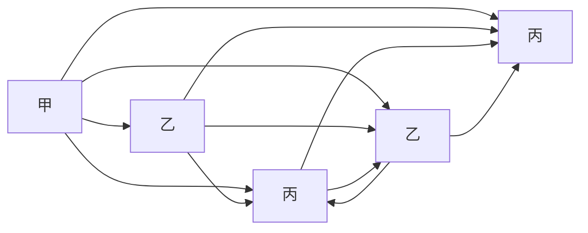

总主编 单 壤 熊 斌

# 奥数 教程

·第六版·

教辅资料站

电子教辅 试卷练习

知识总结 备课资源

—— 扫码关注获取更多学习资料 ——

七年级

本册主编 单 增

text_image

二维码扫一扫
免费
750分钟
合师微视频

总主编 单 壤 熊 斌

# 奥数 教程

·第六版·

七年级

本册主编

单 壤

参编者

张新华 顾继玲

视频讲解

上海市市北初级中学工作组

尤文奕 章炯毅

管君阳 徐捷

华东师范大学出版社

著名数学家、中国科学院院士、原中国数学奥林匹克委员会主席王元先生致青少年数学爱好者

## 致读者

《奥数教程》的出版已有十五个年头了. 在这个过程中, 包含了作者和编辑的辛勤劳作, 更多的是让我们感到欣慰: 这套书, 曾荣获了第十届全国教育图书展的优秀畅销书奖; 香港现代教育研究社出版了她的繁体字版和网络版, 成为香港的畅销图书之一, 并因此获得了版权输出奖; 据北京开卷图书市场研究所的监控销售数据, 近几年《奥数教程》的销量名列同类书前茅. 《奥数教程》在网络上非常畅销, 特别是一年级, 长期居当当网同类书的榜首, 评论数超 1.8 万条, 好评率超过 98%. 这些成绩的取得与作者们精到的创作, 广大读者的支持、呵护是分不开的.

为了使《奥数教程》更健康、更成熟地发展，为了使学生的学习生活更主动、更有效，不断提高图书的质量，我们差不多两三年修订一次，现在已经是第六版了。应广大读者的要求，方便读者自学，我们为本书配了“学习手册”和“能力测试”。把本书习题的详细解答放入“学习手册”，并加入竞赛热点精讲。全新的“能力测试”针对本书每讲，精选了一小时的习题量，帮助读者轻松巩固所学知识。

根据奥数题难度大的特点,我们特意请了奥赛名师,为《奥数教程》1—9年级中每一道例题精心录制了讲解视频,读者朋友可按照图书封底上提示的流程,利用手机或平板电脑扫描例题旁的二维码,即可免费观看.由于视频的录制、审核、上线、更新的工作量较大,在不耽误读者朋友们学习进度的情况下,视频将逐步上线,在2014年11月30日前全部上线.为了解决部分读者不方便用手机看视频,读者朋友可以到http://www.hdsdjf.com/download.aspx下载视频的压缩包,加“华师教辅ECNUP”微信平台(扫封底左下角的二维码或直接添加微信号chinastar01),回复“奥数密码”即可.

十年前，我们开展了“有奖订正”和“巧解共享”两项活动，得到了读者的支持与配合，不少读者纷纷来信、来电提出订正意见和更好的解法。比如，广州市戴炽文老师、漳州市江晗同学、南京市单川同学等提供了一些巧妙解法，经作者确认后，已收入第六版图书中，并署上姓名。这是对我们的鼓励，更是对我们的鞭策。我们计划继续开展下列活动，希望有更多的读者朋友乐于参与。

## 一、有奖订正

2014年8月到2016年8月期间，欢迎读者朋友对《奥数教程》（第六版，共12册），提出改正意见，我们将对“纠错能手”给予奖励.

## 二、巧解共享

欢迎读者朋友对《奥数教程》中例题与习题,提供更巧妙的解法.我们将选择有新意的、合适的解法在网上公布,以与其他读者朋友共享.读者朋友也可以把巧妙的解法录制成微视频,通过“华师教辅ECNUP”微信平台发送给我们,与大家分享与交流.凡被采用者,我们将署上提供者的姓名,并支付相应的稿酬.

我们衷心祝愿《奥数教程》永远成为您的好朋友.

华东师范大学出版社

## 前言

据说在很多国家,特别是美国,孩子们害怕数学,把数学作为“不受欢迎的学科”.但在中国,情况很不相同,很多少年儿童喜爱数学,数学成绩也都很好.的确,数学是中国人擅长的学科,如果在美国的中小学,你见到几个中国学生,那么全班数学的前几名就非他们莫属.

在数(shǔ)数(shù)阶段,中国儿童就显出优势.

中国人能用一只手表示1\~10，而很多国家非用两只手不可.

中国人早就有位数的概念,而且采用最方便的十进制(不少国家至今还有12进制,60进制的残余).

中国文字都是单音节,易于背诵,例如乘法表,学生很快就能掌握,再“傻”的人也都知道“不管三七二十一”.但外国人,一学乘法,头就大了.不信,请你用英语背一下乘法表,真是佶屈聱牙,难以成诵.

圆周率 $\pi=3.14159\cdots$ . 背到小数后五位, 中国人花一两分钟就够了. 可是俄国人为了背这几个数字, 专门写了一首诗, 第一句三个单词, 第二句一个……要背 $\pi$ 先背诗, 这在我们看来简直是自找麻烦, 可他们还作为记忆的妙法.

四则运算应用题及其算术解法,也是中国数学的一大特色.从很古的时候开始,中国人就编了很多应用题,或联系实际,或饶有兴趣,解法简洁优雅,机敏而又多种多样,有助于提高学生的学习兴趣,启迪学生智慧.例如:

“一百个和尚一百个馒头，大和尚一个人吃三个，小和尚三个人吃一个，问有几个大和尚，几个小和尚？”

外国人多半只会列方程解. 中国却有多种算术解法, 如将每个大和尚“变”成 9 个小和尚, 100 个馒头表明小和尚是 300 个, 多出 200 个和尚, 是由于每个大和尚变小和尚, 多变出 8 个, 从而 $200 \div 8 = 25$ 即是大和尚人数. 小和尚自然是 75 人, 或将一个大和尚与 3 个小和尚编成一组, 平均每人吃一个馒头. 恰好与总体的平均数相等. 所以大和尚与小和尚这样编组后不多不少, 即大和尚是 $100 \div (3 + 1) = 25$ 人.

中国人善于计算,尤其善于心算.古代还有人会用手指计算(所谓“掐指一算”).同时,中国很早就有计算的器械,如算筹、算盘.后者可以说是计算机的雏形.

在数学的入门阶段——算术的学习中,我国的优势显然,所以数学往往是我国聪明的孩子喜爱的学科.

几何推理,在我国古代并不发达(但关于几何图形的计算,我国有不少论著),比希腊人稍逊一筹.但是,中国人善于向别人学习.目前我国中学生的几何水平,在世界上遥遥领先.曾有一个外国教育代表团来到我国一个初中班,他们认为所教的几何内容太深,学生不可能接受,但听课之后,不得不承认这些内容中国的学生不但能够理解,而且掌握得很好.

我国数学教育成绩显著. 在国际数学竞赛中, 我国选手获得众多奖牌, 就是最有力的证明. 从 1986 年我国正式派队参加国际数学奥林匹克以来, 中国队已经获得了 14 次团体冠军, 可谓是成绩骄人. 当代著名数学家陈省身先生曾对此特别赞赏. 他说: “今年一件值得庆祝的事, 是中国在国际数学竞赛中获得第一……去年也是第一名.” (陈省身 1990 年 10 月在台湾成功大学的讲演“怎样把中国建为数学大国”)

陈省身先生还预言：“中国将在21世纪成为数学大国。”

成为数学大国,当然不是一件容易的事,不可能一蹴而就,它需要坚持不懈的努力.我们编写这套丛书,目的就是:(1)进一步普及数学知识,使数学为更多的青少年喜爱,帮助他们取得好的成绩;(2)使喜爱数学的同学得到更好的发展,通过这套丛书,学到更多的知识和方法.

“天下大事，必作于细。”我们希望，而且相信，这套丛书的出版，在使我国成为数学大国的努力中，能起到一点作用。本丛书初版于2000年，现根据课程改革的要求对各册再作不同程度的修订。

著名数学家、中国科学院院士、原中国数学奥林匹克委员会主席王元先生担任本丛书顾问，并为青少年数学爱好者题词，我们表示衷心的感谢。还要感谢华东师大出版社及倪明、孔令志先生，没有他们，这套丛书不会是现在这个样子。

单 增 熊 斌

2014年5月

text_image

微信公众号
教辅资料站

## 目录

第 1 讲 有理数的加减 / 1

第 2 讲 有理数的巧算 / 7

第 3 讲 绝对值 / 13

第 4 讲 一元一次方程 / 20

第 5 讲 一次方程组 / 26

第 6 讲 一次方程组的应用 / 34

第 7 讲 列方程(组)解应用题 / 40

第 $\delta$ 讲 一次不等式(组)/48

第 9 讲 整式的乘除 / 57

第 10 讲 线段 / 62

第 11 讲 角 / 72

第 12 讲 三角形内角和 / 81

第 13 讲 平行 / 89

第 14 讲 “设而不求” / 97

第 15 讲 待定系数 / 102

第 16 讲 综合除法和余数定理 / 108

第 17 讲 代数式的化简与求值 / 115

第 18 讲 推理问题 / 121

第 19 讲 面积 / 127

第20讲 整除 / 139

第21讲 奇数和偶数 / 143

第22讲 质数和合数 / 149

第23讲 约数的个数 / 153

第24讲 进位制 / 158

第25讲 同余 / 163

第26讲 二元一次不定方程 / 168

第27讲 加法原理和乘法原理 / 175

第28讲 抽屉原理 / 181

参考答案 / 187

(详细解答见《奥数教程学习手册》)

## 第 1 讲 有理数的加减

有理数的加减法,是有理数最基本的运算,必须熟练掌握.

有理数加法法则为: 同号两数相加, 取相同的符号, 并把绝对值相加. 异号两数相加, 绝对值相等时和为 0; 绝对值不等时, 取绝对值较大的数的符号, 并用较大的绝对值减去较小的绝对值. 一个数与零相加, 仍得这个数.

加法的运算规律有：

加法交换律： $a+b=b+a$

加法结合律： $(a+b)+c=a+(b+c)$ .

有理数减法法则为:减去一个数,等于加上这个数的相反数.

在运算时应理解有理数的加法和减法可以相互转化.

【例 1】 计算：

(1) $\left(-\frac{1}{3}\right)+\left(-\frac{2}{3}\right)$ ;

(2) $(-10.8)+(+10.7)$ ;

(3) $(-6)+0;$

(4) $52\frac{4}{7}+\left(-52\frac{4}{7}\right).$

解 (1) $\left(-\frac{1}{3}\right)+\left(-\frac{2}{3}\right)$ （同号相加）

$=-\left(\frac{1}{3}+\frac{2}{3}\right)$ （取相同的符号，并把绝对值相加）

$$
= - 1.
$$

(2) $(-10.8)+(+10.7)$ (异号相加)

$= -(10.8 - 10.7)$ （取绝对值大的数的符号，并用较大的绝对值减去较小的绝对值）

$$
= - 0. 1.
$$

(3) $(-6)+0$ (0与任何数相加,仍得这个数)

$$
= - 6.
$$

(4) $52 \frac{4}{7} + \left(-52 \frac{4}{7}\right)$ （互为相反数的两数相加，和为0）

$$
= 0.
$$

说明 对有理数进行加法运算时,应当先判断这两个数是同号还是异号,然后判断结果是正号还是负号,最后判断是算绝对值的和还是绝对值的差.

【例 2】 计算：

(1) $6 - (-3)$ ;

(2) 0 - (-2);

(3) $(-7)-(-5)$ ;

(4) $(-2)-0.$

解 (1) $6-(-3)=6+3=9.$

(2) $0-(-2)=0+2=2.$

(3) $(-7)-(-5)=(-7)+5=-2.$

(4) $(-2)-0=-2.$

说明 减去一个数,等于加上这个数的相反数.

【例 3】 计算：

(1) $(+59.8)-\left(-\frac{2}{5}\right)+(-12.8)+\frac{63}{5};$

(2) $(-2)+\left(-2\frac{3}{8}\right)-3-8\frac{1}{4}+\left(+3\frac{1}{3}\right).$

解 （1） 原式 = $\left[(+59.8)+(-12.8)\right]+\left(\frac{2}{5}+\frac{63}{5}\right)$

$$
= 4 7 + 1 3 = 6 0.
$$

$$
\begin{array}{l} = (- 2) + \left(- \frac {8 5}{8}\right) + \left(+ \frac {1}{3}\right) \\ = - \frac {1 0 1}{8} + \frac {1}{3} \\ = - \frac {2 9 5}{2 4}. \\ \end{array}
$$

(2) 原式 = $(-2)+\left[-2\frac{3}{8}\right)+\left(-8\frac{1}{4}\right]+\left[-3\right)+\left(+3\frac{1}{3}\right]$

说明 这是一组加减混合运算的问题,注意合理运用加减运算法则和运算规律,进行计算.能够“凑整”与“抵消”的,应注意“凑整”与“抵消”.

【例 4】 计算：

(1) $\left(-\frac{3}{4}\right)+\left(31\frac{2}{5}\right)+\left(-\frac{1}{4}\right)+\left(-31\frac{2}{5}\right)$ ;

(2) $\left(+7\frac{2}{7}\right)+\left(-4\frac{2}{5}\right)+\left(2\frac{5}{7}\right)+\left(-5\frac{3}{5}\right).$

$$
\begin{array}{l} = - 1 + 0 \\ = - 1. \\ \end{array}
$$

解 （1）原式 = $\left[-\frac{3}{4}\right]+\left(-\frac{1}{4}\right]+\left(31\frac{2}{5}\right)+\left(-31\frac{2}{5}\right]$

(2) 原式= $\left[\left(+7\frac{2}{7}\right)+\left(2\frac{5}{7}\right)\right]+\left[\left(-4\frac{2}{5}\right)+\left(-5\frac{3}{5}\right)\right]$

$$
\begin{array}{l} = 1 0 + \left[ - \left(4 \frac {2}{5} + 5 \frac {3}{5}\right) \right] \\ = 1 0 - 1 0 = 0. \\ \end{array}
$$

【例 5】 在数 $\frac{2}{10}$ ， $\frac{3}{10}$ ， $\frac{4}{10}$ ， $\frac{5}{10}$ ， $\frac{6}{10}$ ， $\frac{7}{10}$ ， $\frac{8}{10}$ ， $\frac{9}{10}$ 的前面分别添加“+”或“-”，使它们的和为1.你能想出多少种方法？

分析 这 8 个有理数的分母都是 10, 只要 2, 3, 4, 5, 6, 7, 8, 9
这 8 个整数的代数和为 10 即可, 而 $2 + 3 + \cdots + 9 = 44$ , 所以添加“+”或“-”后, 正数的和应为 $27\left(=\frac{1}{2}(44+10)\right)$ .

解 方法很多. 如:

$$
\begin{array}{l} \frac {2}{1 0} + \frac {3}{1 0} + \frac {4}{1 0} + \frac {5}{1 0} + \frac {6}{1 0} + \frac {7}{1 0} - \frac {8}{1 0} - \frac {9}{1 0} = 1, \\ - \frac {2}{1 0} + \frac {3}{1 0} + \frac {4}{1 0} + \frac {5}{1 0} - \frac {6}{1 0} + \frac {7}{1 0} + \frac {8}{1 0} - \frac {9}{1 0} = 1, \\ \frac {2}{1 0} - \frac {3}{1 0} + \frac {4}{1 0} - \frac {5}{1 0} + \frac {6}{1 0} + \frac {7}{1 0} + \frac {8}{1 0} - \frac {9}{1 0} = 1, \\ \frac {2}{1 0} - \frac {3}{1 0} + \frac {4}{1 0} + \frac {5}{1 0} - \frac {6}{1 0} + \frac {7}{1 0} - \frac {8}{1 0} + \frac {9}{1 0} = 1, \\ \frac {2}{1 0} + \frac {3}{1 0} - \frac {4}{1 0} + \frac {5}{1 0} - \frac {6}{1 0} - \frac {7}{1 0} + \frac {8}{1 0} + \frac {9}{1 0} = 1 \text {等}. \\ \end{array}
$$

说明 这是一道开放性问题,答案不唯一,你能否再找出一些方法呢?试一试.

【例 6】一个水井,水面比井口低 3 米.一只蜗牛从水面沿着井壁往井口爬.第一次往上爬了 0.5 米后又往下滑了 0.1 米.第二次往上爬了 0.42 米,却又下滑了 0.15 米.第三次往上爬了 0.7 米,却又下滑了 0.15 米.第四次往上爬了 0.75 米,却又下滑了 0.1 米.第五次往上爬

了 0.55 米, 没有下滑. 第六次又往上爬了 0.48 米. 问蜗牛有没有爬出井口?

解 因为

$$
\begin{array}{l} 0. 5 - 0. 1 + 0. 4 2 - 0. 1 5 + 0. 7 - 0. 1 5 \\ + 0. 7 5 - 0. 1 + 0. 5 5 + 0. 4 8 = 2. 9 <   3, \\ \end{array}
$$

所以，蜗牛没有爬出井口。

说明 将往上爬的距离用正数表示,下滑的距离用负数表示.这道题就是求0.5,-0.1,0.42,-0.15,0.7,-0.15,0.75,-0.1,0.55,0.48的代数和,然后再看一看这个和是否等于或大于3.

## 读一读

## 有理数

如果你刚学有理数,或许你会问:

为什么将形如 $\frac{m}{n}(m, n \text{ 是整数}, n \neq 0)$ 的数叫做有理数？既然有有理数，那么是不是还有无理数呢？

通常给一个事物起一个名称,都是有道理的.例如负数的负就有亏欠、负债的意义,也表示其意义与正数的正恰好相反.而有理数之所以叫做有理数却是毫无道理的.它源自于翻译中的失误.

19 世纪,西方科学传入中国时,我国数学家李善兰(1811\~1882)在译英国 De Morgan 的《代数学》时将 rational function 与 irrational function 译为有比例式与无比例式. 这表明李善兰对这两个名称的理解是完全正确的,译名也是确当的. 因为 ratio 就是比的意思. 后来他译 Euclid《原本》时,又将 rational number 与 irrational number 译为有等几何、无等几何. 等即有公度(《九章算术》称最大公约数为等数). 有等几何即有公度的量. 这也与原义吻合. 但十多年后另一位数学家华蘅芳(1833\~1902)译 Wallace《代数学》时却将 rational 与 irrational 误译为有理、无理,与原意不符,然而却广为流传. 这本书后来又流入日本,日本也沿用了华蘅芳的译名. 现在中、日两国都用了不正确的译名,习以为常.

有理数是能表示成 $\frac{m}{n}(m,n$ 为整数， $n\neq0)$ 的数.不能表示成 $\frac{m}{n}$ 的数就是无理数了.这样的数是存在的.古希腊人早就发现面积为2的正方形,边长是一个无理数.

## 练习题

① 计算：

(1) $3.2 + (-4.2)$ ;  
(2) $\left(-\frac{2}{5}\right)+\left(-\frac{3}{5}\right)$ ;

(3) $(-382.4)+(+382.4)$ ;  
(4) $0 + (-24.1)$ ;  
(5) $\left(-\frac{1}{3}\right)+\left(-\frac{1}{6}\right).$

② 计算：

(1) $(-3)-(-5)$ ;  
(2) $(-7)-5;$  
(3) 0 - 4.2;  
(4) $(-4.2)-0;$  
(5) $(-20)-3-(-30)-5;$  
(6) 0 - 3 - (-4) - 5 - (-6).

③ 计算：

(1) $-0.2+(-0.3)-(-0.4)+(-0.5)$ ;  
(2) $10-(-8)+(-6)-(-4)+(-2)$ ;  
(3) $\frac{1}{3}-\left(-\frac{1}{2}\right)-\frac{1}{6};$  
(4) $0-\left(-\frac{1}{5}\right)+\frac{1}{2}-\frac{1}{10}.$

④ 潜水艇原来在水下 200 米处. 若它下潜 50 米, 接着又上浮 130 米, 问这时潜水艇在水下多少米处?

⑤ 数轴上点 A 表示 -5，将 A 点向左移动 3 个单位后又向右移动 8 个单位，求此时 A 点表示的数是多少？

⑥ 判断题：

(1) 若两个数的和为负数, 则这两个数都是负数. ()  
(2) 若两个数的差为正数, 则这两个数都是正数. ()  
(3) 减去一个数,等于加上这个数的相反数. ()  
(4) 零减去一个有理数, 差必为负数. ()  
(5) 如果两个数互为相反数, 则它们的差为 0. ()

⑦ 计算：

(1) $(-1)+2+(-3)+4+(-5)+6+(-7)+8;$  
(2) $0-4\frac{3}{7}+\left(-\frac{3}{5}\right)-\left(-1\frac{1}{7}\right)+1\frac{3}{5}$ ;  
(3) $\left(-1\frac{3}{7}\right)+4\frac{2}{3}-\left(-2\frac{3}{7}\right)+\left(-2\frac{2}{3}\right);$  
(4) $(-3)+\left(-3\frac{5}{6}\right)-2-4\frac{1}{3}+\left(-1\frac{1}{5}\right).$

⑧ 出租车司机小王,某天下午的营运全在东西走向的人民路上.如果规

定向东为正，向西为负，这天下午他行车里程(单位：千米)如下：

$$
+ 1 5, - 2, + 5, - 1, + 1 0, - 3, - 2, + 1 2, + 4, - 5, + 6.
$$

（1）将最后一名乘客送到目的地时，小王距下午出车时的出发点多远？在什么方向？

(2) 若汽车耗油量为 0.1 升/千米, 这天下午小王共耗油多少升?

⑨ 请在数 1, 2, …, 2006, 2007 前适当添加上“+”或“-”号, 使它们的和的绝对值最小.

10 计算：

(1) $(+4)+(+6)$ ;  
(2) $\left(+\frac{1}{3}\right)+\left(-\frac{1}{2}\right)$ ;  
(3) $(-9)+(+7)$ ;  
(4) $(-8)+\left(-1\frac{1}{3}\right)$ ;  
(5) $(-2)-(+3)$ ;  
(6) $(+7)-(-2\frac{1}{4})$ ;  
(7) $(-2.5)-(+4)$ ;  
(8) $0 + (-4.3)$ ;  
(9) $0 - (-2.7)$ .

⑪ 计算：

(1) $\left(+\frac{13}{17}\right)+(-3.5)+2.5+\left(+\frac{14}{17}\right)$ ;  
(2) $\left(-\frac{1}{2}\right)+(-12)+8+(+0.5)+(+4)$ ;  
(3) $\left(-3\frac{5}{7}\right)-(-15.5)+\left(-16\frac{2}{7}\right)+\left(-5\frac{1}{2}\right)$ ;  
(4) $1-5\frac{1}{2}-(-3\frac{1}{3})- \left|2\frac{1}{3}-(-4\frac{1}{2})\right|+1-3\frac{3}{4}-(-4\frac{1}{3}).$

12 某天早晨的温度为 $5^{\circ}C$ ，到中午上升了 $7^{\circ}C$ ，晚上又下降了 $6^{\circ}C$ ，求晚上的温度.  
⑬ 要测量 A、B 两地的高度差,但又不能直接测量,找了 D、E、F、G、H 共五个中间点,测量出一些高度差,结果如下表(单位:米).

<table><tr><td>D-A</td><td>E-D</td><td>F-E</td><td>G-F</td><td>H-G</td><td>B-H</td></tr><tr><td>3.2</td><td>-4.1</td><td>-0.3</td><td>2.6</td><td>3.7</td><td>-5.4</td></tr></table>

问：A、B两地哪处高？高多少？

## 第2讲 有理数的巧算

有理数的运算与正数的运算类似,也应注意运用规律(如加法交换律、结合律,乘法交换律、结合律、分配律等)与技巧,使运算简化、便捷.

【例 1】 计算： $48\frac{3}{5}-18\frac{1}{4}-1\frac{1}{3}+0.25+3\frac{2}{3}-2\frac{1}{3}-30\frac{3}{5}$

解 原式 $= \left(-1\frac{1}{3} + 3\frac{2}{3} - 2\frac{1}{3}\right) + \left(48\frac{3}{5} - 30\frac{3}{5}\right)$

$$
\begin{array}{l} + \left(- 1 8 \frac {1}{4} + \frac {1}{4}\right) \\ = 0 + (4 8 - 3 0 - 1 8) + \left(\frac {3}{5} - \frac {3}{5}\right) + \left(- \frac {1}{4} + \frac {1}{4}\right) \\ = 0 + 0 + 0 + 0 \\ = 0. \\ \end{array}
$$

说明 在有理数加减运算中,应注意“抵消”,即两个相反的数相加,和为0(两个相同的数相减,和为0),如上面的 $\frac{3}{5}$ 与 $-\frac{3}{5}$ , $-\frac{1}{4}$ 与 $\frac{1}{4}$ .但要注意符号,不要搞错,如上面的 $-\frac{1}{3}$ 与 $-\frac{1}{3}$ 不能抵消,它们的和与 $\frac{2}{3}$ 可以抵消.

【例 2】 计算：

$$
- 2. 5 \div 0. 7 5 \times \left(- \frac {1}{5}\right) \times \left(- 1 \frac {3}{4}\right) \div (- 1. 4) \times \left(- \frac {3}{5}\right) \times \frac {2}{3}.
$$

解 原式 = -2.5 ÷ 0.75 × $\frac{1}{5}$ × $\frac{7}{4}$ ÷ $\frac{14}{10}$ × $\frac{3}{5}$ × $\frac{2}{3}$

$$
\begin{array}{l} = - \frac {1 0}{3} \times \frac {1}{5} \times \frac {7}{4} \times \frac {1 0}{1 4} \times \frac {3}{5} \times \frac {2}{3} \\ = - \frac {1}{3}. \\ \end{array}
$$

说明 在进行有理数的乘除运算时,要注意确定结果的符号:奇数个负数相乘除,结果为负;偶数个负数相乘除,结果为正.通常将小数化为分数,带分数化为假分数,把除法转化为乘法,能约分的先约分,尽量化简.

另外,要熟记一些常用的数据,如 $0.125 = \frac{1}{8}$ , $0.25 = \frac{1}{4}$ , $0.375 = \frac{3}{8}$ , $0.75 = \frac{3}{4}$ 等.

【例 3】 计算: $\frac{1 \times 2 \times 3 + 2 \times 4 \times 6 + 7 \times 14 \times 21}{1 \times 3 \times 5 + 2 \times 6 \times 10 + 7 \times 21 \times 35}$ .

解 原式 = $\frac{1 \times 2 \times 3 \times (1 + 2 \times 2 \times 2 + 7 \times 7 \times 7)}{1 \times 3 \times 5 \times (1 + 2 \times 2 \times 2 + 7 \times 7 \times 7)}$

$$
= \frac {2}{5}.
$$

说明 在进行有理数的四则运算时,若有公因数,一般可将公因数提出,然后进行运算.如本例中,分子有公因数 $1\times2\times3$ ,分母有公因数 $1\times3\times5$ ,就可以将它们提出,然后约分,以简化运算.应注意,当提出的公因数带负号时,提取后各项的符号都要改变.

【例 4】 计算: $\frac{1}{2}+\frac{1}{4}+\frac{1}{8}+\frac{1}{16}+\frac{1}{32}+\frac{1}{64}$ .

解 原式 $= \frac{1}{2} +\frac{1}{4} +\frac{1}{8} +\frac{1}{16} +\frac{1}{32} +\left(\frac{1}{64} +\frac{1}{64}\right) - \frac{1}{64}$

$$
\begin{array}{l} = \frac {1}{2} + \frac {1}{4} + \frac {1}{8} + \frac {1}{1 6} + \left(\frac {1}{3 2} + \frac {1}{3 2}\right) - \frac {1}{6 4} \\ = \frac {1}{2} + \frac {1}{4} + \frac {1}{8} + \left(\frac {1}{1 6} + \frac {1}{1 6}\right) - \frac {1}{6 4} \\ = \dots \\ = \left(\frac {1}{2} + \frac {1}{2}\right) - \frac {1}{6 4} \\ = 1 - \frac {1}{6 4} \\ = \frac {6 3}{6 4}. \\ \end{array}
$$

说明 上例中,经过观察发现算式的特点:后一项是前一项的一半.如果我们把后一项加上它本身,就可以得到前一项的值.因此,我们巧添了一个辅助数 $\frac{1}{64}$ ,使问题得以顺利解决.当然,在添加上 $\frac{1}{64}$ 后不要忘了还应减去 $\frac{1}{64}$ .

【例 5】 计算:(1) $1+2+3+4+\cdots+2001+2002$ ;

(2) $1-2+3-4+\cdots+2001-2002.$

解 （1）令 $S = 1 + 2 + \cdots + 2001 + 2002$ ，则

$$
S = 2 0 0 2 + 2 0 0 1 + \dots + 2 + 1,
$$

两式相加,得

$$
\begin{array}{l} 2 S = (1 + 2 0 0 2) + (2 + 2 0 0 1) + \dots + (2 0 0 1 + 2) + (2 0 0 2 + 1) \\ = \underbrace {2 0 0 3 + 2 0 0 3 + \cdots + 2 0 0 3 + 2 0 0 3} _ {\text {共} 2 0 0 2 \text {个}} \\ = 2 0 0 3 \times 2 0 0 2. \\ \end{array}
$$

所以 $S=\frac{2\ 003\times2\ 002}{2}=2\ 005\ 003.$

即原式 = 2 005 003.

(2) 原式 = (1 - 2) + (3 - 4) + $\cdots$ + (2 001 - 2 002)

$$
= \underbrace {(- 1) + (- 1) + \cdots + (- 1)} _ {\text {共} 1 0 0 1 \text {个}}
$$

$$
= - 1 0 0 1.
$$

说明 第(1)小题的特点是:后一项减去前一项的差都相等.这样的一列数是等差数列.即若一列数 $a_{1},a_{2},\cdots,a_{n}$ ，有 $a_{i+1}-a_{i}=d$ （常数） $(i=1,2,\cdots,n-1)$ ，则这列数称为等差数列，其中 $a_{1}$ 称为首项， $a_{n}$ 称为末项，n为项数，d为公差.等差数列的和 $a_{1}+a_{2}+\cdots+a_{n}$ 的计算公式为：

$$
\text {和} = \frac {(\text {首项} + \text {末项}) \times \text {项数}}{2}.
$$

所以，本题也可用这个计算公式计算.

有时，项数不能直接看出，可用下面的公式计算：

$$
\text {项数} = \frac {\text {末项－首项}}{\text {公差}} + 1.
$$

对第(2)小题,相邻的项两两结合,可以简化运算.这是由本题的特点所决定的.所以,在做题时,不要拿起笔就匆匆去做.应先观察一下题目的特点,根据特点下手,往往有事半功倍的效果.

【例 6】 计算： $\frac{1}{1\times2}+\frac{1}{2\times3}+\frac{1}{3\times4}+\cdots+\frac{1}{1999\times2000}$

解

$$
\begin{array}{l} = 1 + \left(- \frac {1}{2} + \frac {1}{2}\right) + \left(- \frac {1}{3} + \frac {1}{3}\right) + \dots + \left(- \frac {1}{1 9 9 9} + \frac {1}{1 9 9 9}\right) - \frac {1}{2 0 0 0} \\ = 1 - \frac {1}{2 0 0 0} = \frac {1 9 9 9}{2 0 0 0}. \\ \end{array}
$$

原式 $= \left(1 - \frac{1}{2}\right) + \left(\frac{1}{2} -\frac{1}{3}\right) + \left(\frac{1}{3} -\frac{1}{4}\right) + \dots +\left(\frac{1}{1999} -\frac{1}{2000}\right)$

说明 在做分数加减法运算时,根据特点,将其中一些分数适当拆开,使得拆开后有一些分数可以相互抵消,达到简化运算的目的,这种方法叫拆项法.本例中,我们把 $\frac{1}{n\times(n+1)}$ 拆成 $\frac{1}{n}-\frac{1}{n+1}$ ，即有

$$
\frac {1}{n \times (n + 1)} = \frac {1}{n} - \frac {1}{n + 1}.
$$

其他常用的拆项方法如：

(1) $\frac{d}{n\times(n+d)}=\frac{1}{n}-\frac{1}{n+d}\left[\text{或}\frac{1}{n\times(n+d)}=\frac{1}{d}\left(\frac{1}{n}-\frac{1}{n+d}\right)\right]$ . 它经常用于分母各因子成等差数列，且公差为 d 的情形.

(2) $\frac{1}{n\times(n+1)\times(n+2)}$

$$
= \frac {1}{2} \times \left[ \frac {1}{n \times (n + 1)} - \frac {1}{(n + 1) \times (n + 2)} \right].
$$

【例 7】2002 加上它的 $\frac{1}{2}$ 得到一个数, 再加上所得的数的 $\frac{1}{3}$ 又得到一个数, 再加上这次得数的 $\frac{1}{4}$ 又得到一个数, $\cdots$ , 依此类推, 一直加到上一次得数的 $\frac{1}{2002}$ . 最后得到的数是多少?

解 由 2002 加上它的 $\frac{1}{2}$ 得 $2002 \times \left(1 + \frac{1}{2}\right)$ ，再加上这数的 $\frac{1}{3}$ 得 $2002 \times \left(1 + \frac{1}{2}\right) \times \left(1 + \frac{1}{3}\right)$ ，依此类推，最后得到的数为

$$
\begin{array}{l} 2 0 0 2 \times \left(1 + \frac {1}{2}\right) \times \left(1 + \frac {1}{3}\right) \times \dots \times \left(1 + \frac {1}{2 0 0 2}\right) \\ = 2 0 0 2 \times \frac {3}{2} \times \frac {4}{3} \times \dots \times \frac {2 0 0 3}{2 0 0 2} \\ = 2 0 0 2 \times \frac {2 0 0 3}{2} \\ = 2 0 0 5 0 0 3. \\ \end{array}
$$

说明 在乘法运算过程中,约去同时在分子、分母出现的数,可以大大地简化计算.

## 读一读

## 苏格拉底的启发式

古希腊的哲学家苏格拉底(公元前 470? —399)喜欢用对话的方式来启发学生.

有一次他和枚农的一个小厮讨论: 已知一个边长为 2 尺的正方形(面积为 4 平方尺). 如何作一个正方形, 使它的面积是已知正方形的 2 倍.

小厮:很明显,这个正方形的边长应当是已知正方形的2倍.

苏格拉底:我们就画一个这样的正方形.

可是这里面有 4 个边长为 2 尺的正方形. 它的面积是已知正方形的 4 倍. 是不是?

小厮: 是啊. 可我们要得到的正方形, 面积应当是已知正方形的 2 倍啊!

苏格拉底: 如果我们在图中连上虚线. 这 4 条虚线围成一个什么图形?

text_image

2
2
2
2

小厮:围成一个正方形.

苏格拉底:它的面积有多大?

小厮:我不知道.

苏格拉底:这个围成的正方形中有几个相同的三角形?

小厮:有4个.

苏格拉底:左上角那个已知的(边长为2尺)的正方形中有几个同样的三角形?

小厮:有2个.

苏格拉底:4 是 2 的几倍?

小厮:2倍.

苏格拉底:这样看来,这个围成的正方形,面积是已知正方形的几倍?

小厮:当然是已知正方形的2倍了.

## 练习题

## 计算：

① $31 \frac{2}{7} - 22 \frac{6}{13} + 4 \frac{5}{7} + 11 \frac{6}{13}.$

2 $5\frac{6}{11}-3.125-7\frac{4}{7}-3\frac{4}{11}+8\frac{1}{8}-3\frac{6}{7}-2\frac{2}{11}+6\frac{3}{7}.$

③ $-\frac{7}{11} \div 2.5 \times (-0.75) \div \left(-1\frac{2}{5}\right) \div \frac{3}{11} \times \left(-\frac{8}{13}\right).$  
4 $3.825 \times \frac{1}{4} - 1.825 + 0.25 \times 3.825 + 3.825 \times \frac{1}{2}$ .  
⑤ -7.2×0.125+0.375×1.1+3.6× $\frac{1}{2}$ -3.5×0.375.  
6 $\frac{1}{2-\frac{1}{3-\frac{1}{4-\frac{1}{5}}}}$  
⑦ $1 \frac{1}{2} + 3 \frac{1}{4} + 5 \frac{1}{8} + 7 \frac{1}{16} + 9 \frac{1}{32}.$  
8 $\frac{1}{1999}+\frac{2}{1999}+\frac{3}{1999}+\cdots+\frac{1998}{1999}.$  
⑨ $(7+9+11+\cdots+101)-(5+7+9+\cdots+99)$ .  
10 9 + 99 + 999 + 9 999 + 99 999 + 999 999.  
⑪ $3^{2000}-5\times3^{1999}+6\times3^{1998}.$  
12 $(-1)^{1998}+(-1)^{1999}+(-1)^{2000}+(-1)^{2001}.$  
⑬ $\frac{1}{5 \times 9} + \frac{1}{9 \times 13} + \frac{1}{13 \times 17} + \cdots + \frac{1}{101 \times 105}.$  
14 2 002 $\frac{1}{2}$ - 2 001 $\frac{1}{3}$ + 2 000 $\frac{1}{2}$ - 1 999 $\frac{1}{3}$ + $\cdots$ + 2 $\frac{1}{2}$ - 1 $\frac{1}{3}$ .  
15 $\frac{1 \times 2 \times 3 + 2 \times 4 \times 6 + 4 \times 8 \times 12 + 7 \times 14 \times 21}{1 \times 3 \times 5 + 2 \times 6 \times 10 + 4 \times 12 \times 20 + 7 \times 21 \times 35}.$  
16 $1+2\frac{1}{6}+3\frac{1}{12}+4\frac{1}{20}+5\frac{1}{30}+6\frac{1}{42}+7\frac{1}{56}.$  
17 $1+\frac{1}{1+2}+\frac{1}{1+2+3}+\cdots+\frac{1}{1+2+3+\cdots+100}.$

text_image

微信公众号
教辅资料站

## 第3讲 绝对值

一个正数的绝对值是它本身；一个负数的绝对值是它的相反数；零的绝对值是零. 即

$$
| a | = \left\{ \begin{array}{l l} a, & a > 0, \\ 0, & a = 0, \\ - a, & a <   0. \end{array} \right.
$$

一个数的绝对值就是数轴上表示这个数的点到原点的距离. 显然, 任何数的绝对值都是非负数, 即 $\left|a\right|\geqslant0$ .

化简含绝对值的式子,关键是去绝对值符号.先根据所给的条件,确定绝对值符号内的数a的正负(即a>0、a<0还是a=0).如果已知条件没有给出其正负,应该分类讨论(即分别讨论a>0、a<0和a=0的情形).分类思想是数学中一种非常重要的思想.

【例 1】 绝对值为 10 的整数有哪些？绝对值小于 10 的整数有哪些？绝对值小于 10 的整数共有多少个？它们的和为多少？

解 绝对值为10的整数有+10和-10两个,绝对值小于10的整数有0,±1,±2, $\cdots$ ,±9,共 $2\times9+1=19$ (个),它们的和为:

$$
0 + 1 + (- 1) + 2 + (- 2) + \dots + 9 + (- 9) = 0.
$$

说明 整数是离散的,所以满足要求的只有有限多个,要是改求绝对值小于10的有理数,那就有无限多个.

【例 2】 若 $-2 \leqslant a \leqslant 0$ ，化简 $\left|a+2\right|+\left|a-2\right|$ .

解 因为 $-2 \leqslant a \leqslant 0$ ，所以 $a + 2 \geqslant 0$ ， $a - 2 \leqslant 0 - 2 < 0$ ，
因此 $\left|a+2\right|+\left|a-2\right|$

$$
\begin{array}{l} = (a + 2) - (a - 2) \\ = 4. \\ \end{array}
$$

【例 3】 若 x < 0，化简 $\frac{| |x| - 2x|}{|x - 3| - |x|}$ .

解 因为 x < 0，所以 x - 3 < 0，从而

$$
\mid x \mid = - x, \mid x - 3 \mid = - (x - 3) = 3 - x,
$$

$$
\begin{array}{l} \mid x - 3 \mid - \mid x \mid = 3 - x - (- x) = 3, \\ \mid \mid x \mid - 2 x \mid = \mid - x - 2 x \mid = \mid - 3 x \mid = - 3 x, \\ \end{array}
$$

因此，原式 $= \frac{-3x}{3} = -x.$

说明 根据所给的条件,先确定绝对值符号内的代数式的正负,然后化去绝对值符号.若有多层绝对值符号,即在一个绝对值符号内又含有绝对值符号(如本例中的分子 $\left|\left|x\right|-2x\right|$ ),通常从最内层开始,逐层向外化去绝对值符号.

【例 4】设 a < 0，且 $x \leqslant \frac{a}{|a|}$ ，试化简

$$
| x + 1 | - | x - 2 |.
$$

解 因为 a < 0, $\left|a\right| = -a$ , 所以 $\frac{a}{\left|a\right|} = \frac{a}{-a} = -1$ .

$$
x \leqslant \frac {a}{| a |}  , \quad \text {即}   x \leqslant - 1  ,
$$

所以 $x+1 \leqslant 0, x-2 < 0.$

因此 $\left|x+1\left|-|x-2\right|=-(x+1)-[-(x-2)]\right.$

$$
= - x - 1 + x - 2 = - 3.
$$

说明 绝对值符号内的数、式的正负,有时不能直接从所给条件得出应先将已知条件化为我们所需要的条件,如本例.有时条件由数轴给出,应从数轴上“读”出有用的信息.如下例.

【例 5】数 a、b 在数轴上对应的点如图 3-1 所示,试化简

  
图 3-1

解 由图 3-1, 可知 a < 0, b > 0, 而且由于 a 点离原点的距离比 b 点离原点的距离大, 因此 $a + b < 0$ . 我们有

$$
\begin{array}{l} \mid a + b \mid + \mid b - a \mid + \mid b \mid - \mid a - \mid a \mid \mid \\ = - (a + b) + (b - a) + b - | a - (- a) | \\ \end{array}
$$

$$
\begin{array}{l} = - a - b + b - a + b - (- 2 a) \\ = b. \\ \end{array}
$$

说明 本题由图 3-1, 即数轴上 a、b 两点的位置, “读”得 a < 0, b > 0, a + b < 0 等条件, 从而去掉绝对值符号, 解决问题.

【例 6】 化简 $\frac{2\mid x\mid-3x}{\mid2x- \mid5x\mid\mid}$ .

解 要去掉绝对值符号,必须讨论 x 的取值.

显然，由于分母不能为0，因此 $x\neq0$ .

当 x > 0 时，

$$
\frac {2 \mid x \mid - 3 x}{\mid 2 x - \mid 5 x \mid \mid} = \frac {2 x - 3 x}{\mid 2 x - 5 x \mid} = \frac {- x}{\mid - 3 x \mid} = \frac {- x}{3 x} = - \frac {1}{3}.
$$

当 x < 0 时，

$$
\frac {2 \mid x \mid - 3 x}{\mid 2 x - \mid 5 x \mid \mid} = \frac {- 2 x - 3 x}{\mid 2 x + 5 x \mid} = \frac {- 5 x}{\mid 7 x \mid} = \frac {- 5 x}{- 7 x} = \frac {5}{7}.
$$

说明 当题设没有给出绝对值符号中的代数式的正负时,应分类进行讨论.分类是数学的一种重要思想.绝对值问题是运用分类思想的良好素材.下面的例子中,含有两个绝对值符号,我们根据零点分段,把整个数轴分成几段进行讨论.

【例 7】 化简 $\left|x+5\right|+\left|2x-3\right|$ .

分析 化简本题的关键在于去掉两个绝对值符号. 只去掉一个绝对值符号很容易, 如 $\left|x+5\right|$ , 只要考虑 $x+5$ 的正负, 可以分为 x<-5 与 $x\geqslant-5$ 两种情况来讨论. 这里的 x=-5 是使 $x+5=0$ 的

x 值. 我们称它为 $x+5$ 的一个零点. 同理, 对于 2x-3, 也有一个零点 $x=\frac{3}{2}$ .
为了同时去掉两个绝对值符号,我们将零点-5, $\frac{3}{2}$ 标在同一数轴上.这两点把数轴分为三个部分(如图3-2所示),即 $x<-5,-5\leqslant x<\frac{3}{2},x\geqslant\frac{3}{2}$ . 我们就分这三种情况进行讨论.

text_image

-5
0
3/2
x

图 3-2

解 当 x<-5 时，

$$
\text {原式} = - (x + 5) - (2 x - 3) = - 3 x - 2.
$$

当 $-5\leqslant x<\frac{3}{2}$ 时，

$$
\text {原式} = (x + 5) - (2 x - 3) = - x + 8.
$$

当 $x\geqslant\frac{3}{2}$ 时，

$$
\text {原式} = (x + 5) + (2 x - 3) = 3 x + 2.
$$

即

$$
\text {原式} = \left\{ \begin{array}{l l} - 3 x - 2, & x <   - 5, \\ - x + 8, & - 5 \leqslant x <   \frac {3}{2}, \\ 3 x + 2, & x \geqslant \frac {3}{2}. \end{array} \right.
$$

说明 确定了讨论的范围后,原式的化简就方便多了.这种令各个绝对值内的代数式为0,找出零点,确定讨论范围的方法可称为零点分段法.这种方法在解决有多个绝对值的化简问题时,有着广泛的应用.

【例 8】 化简 $\left|\left|x-1\right|-2\right|+\left|x+1\right|$ .

解 先找零点.

由 x-1=0 得 x=1.

由 $\left|x-1\right|-2=0$ 即 $\left|x-1\right|=2$ ，得 $x-1=\pm2$ ，从而 x=-1 或 x=3 。由 $x+1=0$ 得 x=-1 。

所以零点共有-1，1，3三个.因此，我们应将数轴分成4个部分，即

$$
x <   - 1, - 1 \leqslant x <   1, 1 \leqslant x <   3, x \geqslant 3.
$$

当x<-1时，

$$
\begin{array}{l} = | - x - 1 | - x - 1 \\ = - x - 1 - x - 1 = - 2 x - 2. \\ \end{array}
$$

原式 $= |-(x-1)-2|-(x+1)$

当 $-1\leqslant x<1$ 时，

$$
\begin{array}{l} = | - x - 1 | + x + 1 \\ = x + 1 + x + 1 = 2 x + 2. \\ \end{array}
$$

原式 $= |-(x-1)-2|+x+1$

当 $1 \leqslant x < 3$ 时，

$$
\begin{array}{l} \text {原式} = | x - 1 - 2 | + x + 1 \\ = | x - 3 | + x + 1 \\ = 3 - x + x + 1 = 4. \\ \end{array}
$$

当 $x \geqslant 3$ 时，

$$
\begin{array}{l} \text {原式} = | x - 1 - 2 | + x + 1 \\ = | x - 3 | + x + 1 \\ = x - 3 + x + 1 = 2 x - 2. \\ \end{array}
$$

即

$$
\text {原式} = \left\{ \begin{array}{l l} - 2 x - 2, & x <   - 1, \\ 2 x + 2, & - 1 \leqslant x <   1, \\ 4, & 1 \leqslant x <   3, \\ 2 x - 2, & x \geqslant 3. \end{array} \right.
$$

说明 由于本例中含双重绝对值,采用零点分段法时,不要忘了考虑 $\left|\left|x-1\right|-2\right|$ 的零点.

【例 9】 若 $\left|x-1\right|$ 与 $\left|y+2\right|$ 互为相反数, 试求 $(x+y)^{2002}$ .

解 因为 $|x - 1|$ 与 $|y + 2|$ 互为相反数，所以

$$
\mid x - 1 \mid + \mid y + 2 \mid = 0.
$$

因为 $|x - 1|$ 与 $|y + 2|$ 都是非负数，所以必有

$$
x - 1 = 0, y + 2 = 0,
$$

即
x = 1, y = -2.

于是有

$$
(x + y) ^ {2 0 0 2} = (1 - 2) ^ {2 0 0 2} = (- 1) ^ {2 0 0 2} = 1.
$$

说明 若两个或两个以上的非负数的和为 0 , 则每一个非负数都为 0 . 到目前为止, 我们学过的非负数有绝对值与偶次幂(主要是平方数). 我们有:

若 $(x-a)^{2}+(y-b)^{2}=0$ ，则x-a=0且y-b=0.

若 $|x - a| + (y - b)^2 = 0$ ，则 $x - a = 0$ 且 $y - b = 0$

若 $|x - a| + |y - b| = 0$ ，则 $x - a = 0$ 且 $y - b = 0$

【例 10】 a、b 为有理数，且 $\left|a+b\right|=a-b$ ，试求 ab 的值.

解 当 $a+b \geqslant 0$ 时，由 $\left|a+b\right|=a+b=a-b$ 得 b=-b，从而 b=0.

当 $a+b<0$ 时，由 $|a+b|=-(a+b)=-a-b=a-b$ ，得
-a=a，从而a=0.

所以，不管是 $a+b \geqslant 0$ 还是 $a+b < 0$ ，a、b 中至少有一个为 0。因此，ab = 0。

## 读一读

## $\sqrt{2}$ 是无理数

由第 2 讲“读一读”,我们知道对于边长为 1 的单位正方形,如果以它的对角线为边作一个正方形,新正方形的面积是单位正方形的两倍,即面积是 2. 所以新正方形边长的平方为 2.

平方为 2 的数, 称为 2 的平方根. 其中正的一个记为 $\sqrt{2}$ (显然, $-\sqrt{2}$ 的平方也是 2).

由那个“读一读”的图, 易知 $\sqrt{2} > 1, \sqrt{2} < 2$ . 实际上

$$
\sqrt {2} = 1. 4 1 4 2 1 3 5 6 \dots
$$

是一个无理数.

怎么证明 $\sqrt{2}$ 是无理数,也就是它不是有理数,不能表示成 $\frac{m}{n}$ (m、n为正整数)的形式呢?

假设有

$$
\sqrt {2} = \frac {m}{n}, \tag {①}
$$

m、n 为正整数，且 m、n 互质，那么去分母，并且两边平方得

$$
2 n ^ {2} = m ^ {2}. \tag {②}
$$

将②的两边都分解因数,即将m、n都写成质因数的乘积,由于②的右边是平方数 $m^{2}$ ,所以右边质因数2的指数应当是偶数(包括0).同理, $n^{2}$ 的分解式中,2的指数也应当是偶数,但 $2n^{2}$ 的分解式中,2的指数是奇数(偶数加1是奇数).因此,②式两边2的指数不相等.②不可能成立,即 $\sqrt{2}$ 是无理数.

类似地,可以证明 $\sqrt{3}$ , $\sqrt{5}$ , $\sqrt{6}$ , $\sqrt{7}$ 乃至 $\sqrt{k}$ ,(k不是平方数)都是无理数.

圆周率 $\pi$ 也是无理数. 但它的证明很难.

## 练习题

① 判断下列各题是否正确.

(1) 当 b < 0 时， $|b| = -b.$ ( )

(2) 若 a 是有理数, 则 $\left|a\right|$ 一定是正数. ()

(3) 当 $\left|m\right|=m$ 时, m>0.

(4) 若 a = -b，则 $\left|a\right| = \left|b\right|$ .

(5) 若 a < b，则 $\left|a\right| < \left|b\right|$ .

(6) $a+|a|$ 一定是正数.()

② 若 -1 < x < 1，试化简 $\left|x+1\right|-\left|x-1\right|$ .

③ 若 a < 0，试化简 $\frac{2a - |3a|}{||3a|-a|}$ .

④ 绝对值小于100的整数有哪些?共多少个?它们的和是多少?

⑤ 化简 $\left|x-\frac{1}{5}\right|+\left|x+\frac{1}{5}\right|$ .

6 已知 $\left|a\right|=5\frac{2}{3},\left|b\right|=1\frac{1}{3}$ ，求 a-b 的值.

⑦ 设 a 和 b 是有理数, 若 a > b, 那么 $\left| a \right| > \left| b \right|$ 一定正确吗? 如果正确, 请你说明理由: 如果不正确, 请举出反例.

⑧ 已知有理数 a、b、c 的位置如图 3-3 所示, 化简 $\left|a+c\right|+\left|b+c\right|-\left|a+b\right|$ .

  
图 3-3

⑨ 若 $\left|a-b\right|=\left|a\right|+\left|b\right|$ ，试求 a, b 应满足的关系.

10 已知 $\left|a+b\right|+\left|a-b\right|=0$ ，化简

$$
\mid a ^ {2 0 0 5} + b ^ {2 0 0 5} \mid + \mid a ^ {2 0 0 5} - b ^ {2 0 0 5} \mid .
$$

⑪ 化简 | 2x - 3 | + | 3x - 5 | - | 5x + 1 |.

12 化简 || 2x - 4 | - 6 | + | 3x - 6 |.

⑬ 设 a 是有理数, 求 $a + |a|$ 的值.

## 第4讲 一元一次方程

代数方程在初中代数中占有很重要的地位,而一元一次方程是代数方程中最基础的部分.

一元一次方程的标准形式是

$$
a x = b (a \neq 0). \tag {①}
$$

方程①有唯一解

$$
x = \frac {b}{a}. \tag {②}
$$

任何一个一元一次方程,通过变形,总可以化为 ax = b 的形式.

【例 1】 解方程： $\frac{1}{2}\left\{x-\frac{1}{3}\left[x-\frac{1}{4}\left(x-\frac{2}{3}\right)\right]-\frac{3}{2}\right\}=x+\frac{3}{4}$

解 两边同时乘以 2, 得

$$
x - \frac {1}{3} \left[ x - \frac {1}{4} \left(x - \frac {2}{3}\right) \right] - \frac {3}{2} = 2 x + \frac {3}{2},
$$

移项合并同类项,得

$$
- \frac {1}{3} \left[ x - \frac {1}{4} \left(x - \frac {2}{3}\right) \right] = x + 3,
$$

两边同时乘以-3, 得 $x - \frac{1}{4}\left(x - \frac{2}{3}\right) = -3x - 9$ ,

移项合并同类项, 得 $-\frac{1}{4}\left(x-\frac{2}{3}\right)=-4x-9,$

两边同时乘以-4,得 $x-\frac{2}{3}=16x+36$ ,

移项合并同类项,得 $-15x=\frac{110}{3}$ ,

未知数系数化为 1, 得 $x = -\frac{22}{9}$ .

说明 本题也可由内而外,逐步去掉小、中、大括号,但其中有分数运算(正好可作为练习,加强分数运算的能力).

如果心算能力强或适当利用草稿纸,也可直接算出方程中 x 的系数与常数项. 左边 x 的系数是

$$
\frac {1}{2} \left\{1 - \frac {1}{3} \left[ 1 - \frac {1}{4} \right] \right\} = \frac {3}{8},
$$

常数项是

$$
\frac {1}{2} \left\{- \frac {1}{3} \left[ \frac {1}{4} \times \frac {2}{3} \right] - \frac {3}{2} \right\} = - \frac {7}{9}.
$$

所以原方程即

$$
- \frac {5 5}{3 6} = \frac {5}{8} x,
$$

$$
x = - \frac {2 2}{9}.
$$

【例 2】 解方程 $\frac{2x+1}{3}-\frac{x-1}{2}=1.$

解 两边同乘6得

$$
2 (2 x + 1) - 3 (x - 1) = 6,
$$

即

$$
4 x - 3 x = 6 - 2 - 3,
$$

所以

$$
x = 1.
$$

说明 倒数第二步可以采用心算.不必写出.

【例 3】 小张在解方程 3a - 2x = 15 (x 为未知数) 时, 误将 -2x 看作 +2x, 得方程的解为 x = 3. 请求出常数 a 的值和原方程的解.

解 由题意,小张解的方程实际上是: $3a+2x=15$ . 因为这个方程有一个解 x=3, 将 x=3 代入这方程, 得

$$
3 a + 2 \times 3 = 1 5,
$$

所以

$$
a = 3.
$$

原方程应为

$$
9 - 2 x = 1 5,
$$

即原方程的解应为

$$
x = - 3.
$$

说明 本题利用已知条件,先求出 a,从而得到原方程及它的解.另一种办法是由

$$
3 a - 2 x = 1 5,
$$

$$
3 a + 2 \times 3 = 1 5,
$$

相减消去 a 得

$$
6 + 2 x = 0,
$$

从而

$$
x = - 3.
$$

想一想 $3a - 2x = 15$ 与 $3a + 2x = 15$ 的解互为相反数.为什么？

【例 4】 解关于 x 的方程 $\frac{x-a}{b}-\frac{x-b}{a}=\frac{b}{a}$ 其中 $a \neq 0, b \neq 0, a \neq b.$

解 两边同时乘以 ab，得 $a(x-a)-b(x-b)=b^{2}$ ，

即 $(a-b)x+b^{2}-a^{2}=b^{2}$ ,

移项, 得 $(a-b)x=a^{2}$ ,

因为 $a \neq b$ ，即 $a - b \neq 0$ ，所以

$$
x = \frac {a ^ {2}}{a - b}.
$$

【例 5】 解关于 x 的方程 mx - 1 = nx.

解 移项整理后得 $(m-n)x=1$ ,

(1) 当 $m - n \neq 0$ 即 $m \neq n$ 时, 方程有唯一解 $x = \frac{1}{m - n}$ .  
(2) 当 m-n=0 即 m=n 时, 由于 $1 \neq 0$ , 故原方程无解.

说明 在解含参数的一元一次方程时,我们应该分类进行讨论.讨论必须完整,不能漏掉任何一种情况.下面再举两例.

【例 6】 解关于 x 的方程 $4m^{2}-x=2mx+1$ .

解 移项得 $2mx + x = 4m^{2} - 1$ ,

即 $(2m+1)x=(2m+1)(2m-1).$

(1) 当 $2m+1 \neq 0$ 即 $m \neq -\frac{1}{2}$ 时, 方程有唯一解 x = 2m - 1.

(2) 当 $2m+1=0$ 即 $m=-\frac{1}{2}$ 时，由于 $(2m+1)(2m-1)=0$ ，故方程有无数多解，解可为任意数.

【例 7】 解关于 x 的方程 $\frac{1}{3}m(x-n)=\frac{1}{4}(x+2m)$ .

解 去分母得

$$
4 m x - 4 m n = 3 x + 6 m,
$$

移项,合并同类项得

$$
(4 m - 3) x = 4 m n + 6 m.
$$

所以，(1) 当 $4m - 3 \neq 0$ ，即 $m \neq \frac{3}{4}$ 时，原方程有唯一解 $x = \frac{4mn + 6m}{4m - 3}$ .

(2) 当 4m - 3 = 0，即 $m = \frac{3}{4}$ 时，又分为两种情况：

若 $4mn + 6m = 0$ ，即 $n = -\frac{6m}{4m} = -\frac{3}{2}$ 时，方程有无数多解，解为任意数.

若 $4mn + 6m \neq 0$ ，即 $n \neq -\frac{6m}{4m} = -\frac{3}{2}$ 时，原方程无解.

综上所述，

当 $m \neq \frac{3}{4}$ ，n 为任意数时，方程有唯一解 $x = \frac{4mn + 6m}{4m - 3}$ .

当 $m=\frac{3}{4}$ ， $n=-\frac{3}{2}$ 时，方程有无数多解，解为任意数.

当 $m=\frac{3}{4},\;n\neq-\frac{3}{2}$ 时，方程无解.

【例 8】已知关于 x 的方程 $2a(x-1)=(5-a)x+3b$ 有无数多解,试求 a、b 的值.

解 移项合并得

$$
(3 a - 5) x = 3 b + 2 a.
$$

由于原方程有无数多解,所以

$$
\left\{ \begin{array}{l} 3 a - 5 = 0, \\ 3 b + 2 a = 0, \end{array} \right.
$$

解得

$$
a = \frac {5}{3}, b = - \frac {1 0}{9}.
$$

说明 例 8 是根据方程解的情况,决定参数的取值.

【例9】已知关于x的方程ax=b有两个不同的解 $x_{1}$ 和 $x_{2}$ ，求证这个方程必有无数多个解.

证明 因为 $x_{1}, x_{2}$ 都是方程 ax = b 的解, 所以 $ax_{1} = b, ax_{2} = b$ .
从而

$$
a x _ {1} = a x _ {2},
$$

即

$$
a (x _ {1} - x _ {2}) = 0.
$$

又因为 $x_{1} \neq x_{2}$ ，所以必有 a = 0。因此

$$
b = a x _ {1} = 0 \cdot x _ {1} = 0.
$$

由于 a = 0 且 b = 0 ，因此方程 ax = b 有无数多解.

又解 在 $a \neq 0$ 时, 方程 ax = b 有唯一解 $x = \frac{b}{a}$ . 现在方程 ax = b 有两个不同的解, 所以必有 a = 0. 从而 $b = ax_{1} = 0 \cdot x_{1} = 0$ .

由于 a = 0, b = 0，因此任一个数都是 ax = b 的解.

## 读一读

## 天元术

我国古代称未知数为元. 如果只有一个未知数, 这个未知数通常称为“天元”. “立天元一为……”即现在的“设 x 为……”.

在天元的旁边写上“元”字，在常数项的旁边写上“太”字或不写，这样，

$$
x + 1 3 5 = 0.
$$

就可记成

$$
\begin{array}{c} \mid \text {元} \\ \mid \equiv \vert \vert \vert \vert \vert \vert \mid \mid \mid \mid \mid \mid \mid \mid \mid \mid \mid \mid \mid \mid \mid \mid \mid \mid \mid \mid \mid \mid \mid \mid \mid \mid \mid \mid \mid \mid \mid \mid \mid \mid \mid \mid \mid \mid \mid \mid \mid \mid \mid \mid \mid \mid \mid \mid \mid \mid \mid \mid \mid \mid \mid \mid \mid \mid \mid \mid \mid \mid \mid \mid \mid \mid \mid \mid \mid \mid \mid \mid \mid \mid \mid \mid \mid \mid \mid \mid \mid \mid \mid \mid \mid \mid \mid \mid \mid \mid \mid \mid \mid \mid \mid \mid \mid \mid \mid \mid \mid \mid \mid \mid \mid \mid \mid \mid \mid \mid \mid \mid \mid \mid \mid \mid \mid \mid \mid \mid \mid \mid \mid \mid \mid \mid \mid \mid \mid \mid \mid \mid \mid \mid \mid \mid \mid \mid \mid \mid \mid \mid \mid \mid \mid \mid \mid \mid \mid \mid \mid \mid \mid \mid \mid \mid \mid \mid \mid \mid \mid \mid \mid \mid \mid \mid \mid \mid \mid \mid \mid \mid \mid \mid \mid \mid \mid \mid \mid \mid \mid \mid \mid \mid \mid \mid \mid \mid \mid \mid \mid \mid \mid \mid \mid \mid \mid \mid \mid \mid \mid \mid \mid \mid \mid \mid \mid \mid \mid \mid \mid \mid \mid \mid \mid \mid \mid \mid \mid \mid \mid \mid \mid \mid \mid \mid \mid \mid \mid \mid \mid \mid \mid \mid \mid \mid \mid \mid \mid \mid \mid \mid \mid \mid \mid \mid \mid \mid \mid \mid \mid \mid \mid \mid \mid \mid \mid \mid \mid \mid \mid \mid \mid \mid \mid \mid \mid \mid \mid \mid \mid \mid \mid \mid \mid \mid \mid \mid \mid \mid \mid \mid \mid \mid \mid \mid \mid \mid \mid \mid \mid \mid \mid \mid \mid \mid \mid \mid \mid \mid \mid \mid \mid \mid \mid \mid \mid \mid \mid \mid \mid \mid \mid \mid \mid \mid \mid \mid \mid \mid \mid \mid \mid \mid \mid \mid \mid \mid \mid \mid \mid \mid \mid \mid \mid \mid \mid \mid \mid \mid \mid \mid \mid \mid \mid \mid \mid \mid \mid \mid \mid \mid \mid \mid \mid \mid \mid \mid \mid \mid \mid \mid \mid \mid \mid \mid \mid \mid \mid \mid \mid \mid \mid \mid \mid \mid \mid \mid \mid \mid \mid \mid \mid \mid \mid \mid \mid \mid \mid \mid \mid \mid \mid \mid \mid \mid \mid \mid \mid \mid \mid \mid \mid \mid \mid \mid \mid \mid \mid \mid \mid \mid \mid \mid \mid \mid \mid \mid \mid \mid \mid \mid \mid \mid \mid \mid \mid \mid \mid \mid \mid \mid \mid \mid \mid \mid \mid \mid \mid \mid \mid \mid \mid \mid \mid \mid \mid \mid \mid \mid \mid \mid \mid \mid \mid \mid \mid \mid \mid \mid \mid \mid \mid \mid \mid \mid \mid \mid \mid \mid \mid \mid \mid \mid \mid \mid \mid \mid \mid \mid \mid \mid \mid \mid \mid \mid \mid \mid \mid \mid \mid \mid \mid \mid \mid \mid \mid \mid \mid \mid \mid \mid \mid \mid \mid \mid \mid \mid \mid \mid \mid \mid \mid \mid \mid \mid \mid \mid \mid \mid \mid \mid \mid \mid \mid \mid \mid \mid \mid \mid \mid \mid \mid \mid \mid \mid \mid \mid \mid \mid \mid \mid \mid \mid \mid \mid \mid \mid \mid \mid \mid \mid \mid \mid \mid \mid \mid \mid \mid \mid \mid \mid \mid \mid \mid \mid \mid \mid \mid \mid \mid \mid \mid \mid \mid \mid \mid \mid \mid \mid \mid \mid \mid \mid \mid \mid \mid \mid \mid \mid \mid \mid \mid \mid \mid \mid \mid \mid \mid \mid \mid \mid \mid \mid \mid \mid \mid \mid \mid \mid \mid \mid \mid \mid \mid \mid \mid \mid \mid \mid \mid \mid \mid \mid \mid \mid \mid \mid \mid \mid \mid \mid \mid \mid \mid \mid \mid \mid \mid \mid \mid \mid \mid \mid \mid \mid \mid \mid \mid \mid \mid \mid \mid \mid \mid \mid \mid \mid \mid \mid \mid \mid \mid \mid \mid \mid \mid \mid \mid \mid \mid \mid \mid \mid \mid \mid \mid \mid \mid \mid \mid \mid \mid \mid \mid \mid \mid \mid \mid \mid \mid \mid \mid \mid \mid \mid \mid \mid \mid \mid \mid \mid \mid \mid \mid \mid \mid \mid \mid \mid \mid \mid \mid \mid \mid \mid \mid \mid \mid \mid \mid \mid \mid \mid \mid \mid \mid \mid \mid \mid \mid \mid \mid \mid \mid \mid \mid \mid \mid \mid \mid \mid \mid \mid \mid \mid \mid \mid \mid \mid \mid \mid \mid \mid \mid \mid \mid \mid \mid \mid \mid \mid \mid \mid \mid \mid \mid \mid \mid \mid \mid \mid \mid \mid \mid \mid \mid \mid \mid \mid \mid \mid \mid \mid \mid \mid \mid \mid \mid \mid \mid \mid \mid \mid \mid \mid \mid \mid \mid \mid \mid \mid \mid \mid \mid \mid \mid \mid \mid \mid \mid \mid \mid \mid \mid \mid \mid \mid \mid \mid \mid \mid \mid \mid \mid \mid \mid \mid \mid \mid \mid \mid \mid \mid \mid \mid \mid \mid \mid \mid \mid \mid \mid \mid \mid \mid \mid \mid \mid \mid \mid \mid \mid \mid \mid \mid \mid \mid \mid \mid \mid \mid \mid \mid \mid \mid \mid \mid \mid \mid \mid \mid \mid \mid \mid \mid \mid \mid \mid \mid \mid \mid \mid \mid \mid \mid \mid \mid \mid \mid \mid \mid \mid \mid \mid \mid \mid \mid \mid \mid \mid \mid \mid \mid \mid \mid \mid \mid \mid \mid \mid \mid \mid \mid \mid \mid \mid \mid \mid \mid \mid \mid \mid \mid \mid \mid \mid \mid \mid \mid \mid \mid \mid \mid \mid \mid \mid \mid \mid \mid \mid \mid \mid \mid \mid \mid \mid \mid \mid \mid \mid \mid \mid \mid \mid \mid \mid \mid \mid \mid \mid \mid \mid \mid \mid \mid \mid \mid \mid \mid \mid \mid \mid \mid \mid \mid \mid \mid \mid \mid \mid \mid \mid \mid \mid \mid \mid \mid \mid \mid \mid \mid \mid \mid \mid \mid \mid \mid \mid \mid \mid \mid \mid \mid \mid \mid \mid \mid \mid \mid \mid \mid \mid \mid \mid \mid \mid \mid \mid \mid \mid \mid \mid \mid \mid \mid \mid \mid \mid \mid \mid \mid \mid \mid \mid \mid \mid \mid \mid \mid \mid \mid \mid \mid \mid \mid \mid \mid \mid \mid \mid \mid \mid \mid \mid \mid \mid \mid \mid \mid \mid \mid \mid \mid \mid \mid \mid \mid \mid \mid \mid \mid \mid \mid \mid \mid \mid \mid \mid \mid \mid \mid \mid \mid \mid \mid \mid \mid \mid \mid \mid \mid \mid \mid \mid \mid \mid \mid \mid \mid \mid \mid \mid \mid \mid \mid \mid \mid \mid \mid \mid \mid \mid \mid \mid \mid \mid \mid \mid \mid \mid \mid \mid \mid \mid \mid \mid \mid \mid \mid \mid \mid \mid \mid \mid \mid \mid \mid \mid \mid \mid \mid \mid \mid \mid \mid \mid \mid \mid \mid \mid \mid \mid \mid \mid \mid \mid \mid \mid \mid \mid \mid \mid \mid \mid \mid \mid \mid \mid \mid \mid \mid \mid \mid \mid \mid \mid \mid \mid \mid \mid \mid \mid \mid \mid \mid \mid \mid \mid \mid \mid \mid \mid \mid \mid \mid \mid \mid \mid \mid \mid \mid \mid \mid \mid \mid \mid \mid \mid \mid \mid \mid \mid \mid \mid \mid \mid \mid \mid \mid \mid \mid \mid \mid \mid \mid \mid \mid \mid \mid \mid \mid \mid \mid \mid \mid \mid \mid \mid \mid \mid \mid \mid \mid \mid \mid \mid \mid \mid \mid \mid \mid \mid \mid \mid \mid \mid \mid \mid \mid \mid \mid \mid \mid \mid \mid \mid \mid \mid \mid \mid \mid \mid \mid \mid \mid \mid \mid \mid \mid \mid \mid \mid \mid \mid \mid \mid \mid \mid \mid \mid \mid \mid \mid \mid \mid \mid \mid \mid \mid \mid \mid \mid \mid \mid \mid \mid \mid \mid \mid \mid \mid \mid \mid \mid \mid \mid \mid \mid \mid \mid \mid \mid \mid \mid \mid \mid \mid \mid \mid \mid \mid \mid \mid \mid \mid \mid \mid \mid \mid \mid \mid \mid \mid \mid \mid \mid \mid \mid \mid \mid \mid \mid \mid \mid \mid \mid \mid \mid \mid \mid \mid \mid \mid \mid \mid \mid \mid \mid \mid \mid \mid \mid \mid \mid \mid \mid \mid \mid \mid \mid \mid \mid \mid \mid \mid \mid \mid \mid \mid \mid \mid \mid \mid \mid \mid \mid \mid \mid \mid \mid \mid \mid \mid \mid \mid \mid \mid \mid \mid \mid \mid \mid \mid \mid \mid \mid \mid \mid \mid \mid \mid \mid \mid \mid \mid \mid \mid \mid \mid \mid \mid \mid \mid \mid \mid \mid \mid \mid \mid \mid \mid \mid \mid \mid \mid \mid \mid \mid \mid \mid \mid \mid \mid \mid \mid \mid \mid \mid \mid \mid \mid \mid \mid \mid \mid \mid \mid \mid \mid \mid \mid \mid \mid \mid \mid \mid \mid \mid \mid \mid \mid \mid \mid \mid \mid \mid \mid \mid \mid \mid \mid \mid \mid \mid \mid \mid \mid \mid \mid \mid \mid \mid \mid \mid \mid \mid \mid \mid \mid \mid \mid \mid \mid \mid \mid \mid \mid \mid \mid \mid \mid \mid \mid \mid \mid \mid \mid \mid \mid \mid \mid \mid \mid \mid \mid \mid \mid \mid \mid \mid \mid \mid \mid \mid \mid \mid \mid \mid \mid \mid \mid \mid \mid \mid \mid \mid \mid \mid \mid \mid \mid \mid \mid \mid \mid \mid \mid \mid \mid \mid \mid \mid \mid \mid \mid \mid \mid \mid \mid \mid \mid \mid \mid \mid \mid \mid \mid \mid \mid \mid \mid \mid \mid \mid \mid \mid \mid \mid \mid \mid \mid \mid \mid \mid \mid \mid \mid \mid \mid \mid \mid \mid \mid \mid \mid \mid \mid \mid \mid \mid \mid \mid \mid \mid \mid \mid \mid \mid \mid \mid \mid \mid \mid \mid \mid \mid \mid \mid \mid \mid \mid \mid \mid \mid \mid \mid \mid \mid \mid \mid \mid \mid \mid \mid \mid \mid \mid \mid \mid \mid \mid \mid \mid \mid \mid \mid \mid \mid \mid \mid \mid \mid \mid \mid \mid \mid \mid \mid \mid \mid \mid \mid \mid \mid \mid \mid \mid \mid \mid \mid \mid \mid \mid \mid \mid \mid \mid \mid \mid \mid \mid \mid \mid \mid \mid \mid \mid \mid \mid \mid \mid \mid \mid \mid \mid \mid \mid \mid \mid \mid \mid \mid \mid \mid \mid \mid \mid \mid \mid \mid \mid \mid \mid \mid \mid \mid \mid \mid \mid \mid \mid \mid \mid \mid \mid \mid \mid \mid \mid \mid \mid \mid \mid \mid \mid \mid \mid \mid \mid \mid \mid \mid \mid \mid \mid \mid \mid \mid \mid \mid \mid \mid \mid \mid \mid \mid \mid \mid \mid \mid \mid \mid \mid \mid \mid \mid \mid \mid \mid \mid \mid \mid \mid \mid \mid \mid \mid \mid \mid \mid \mid \mid \mid \mid \mid \mid \mid \mid \mid \mid \mid \mid \mid \mid \mid \mid \mid \mid \mid \mid \mid \mid \mid \mid \mid \mid \mid \mid \mid \mid \mid \mid \mid \mid \mid \mid \mid \mid \mid \mid \mid \mid \mid \mid \mid \mid \mid \mid \mid \mid \mid \mid \mid \mid \mid \mid \mid \mid \mid \mid \mid \mid \mid \mid \mid \mid \mid \mid \mid \mid \mid \mid \mid \mid \mid \mid \mid \mid \mid \mid \mid \mid \mid \mid \mid \mid \mid \mid \mid \mid \mid \mid \mid \mid \mid \mid \mid \mid \mid \mid \mid \mid \mid \mid \mid \mid \mid \mid \mid \mid \mid \mid \mid \mid \mid \mid \mid \mid \mid \mid \mid \mid \mid \mid \mid \mid \mid \mid \mid \mid \mid \mid \mid \mid \mid \mid \mid \mid \mid \mid \mid \mid \mid \mid \mid \mid \mid \mid \mid \mid \mid \mid \mid \mid \mid \mid \mid \mid \mid \mid \mid \mid \mid \mid \mid \mid \mid \mid \mid \mid \mid \mid \mid \mid \mid \mid \mid \mid \mid \mid \mid \mid \mid \mid \mid \mid \mid \mid \mid \mid \mid \mid \mid \mid \mid \mid \mid \mid \mid \mid \mid \mid \mid \mid \mid \mid \mid \mid \mid \mid \mid \mid \mid \mid \mid \mid \mid \mid \mid \mid \mid \mid \mid \mid \mid \mid \mid \mid \mid \mid \mid \mid \mid \mid \mid \mid \mid \mid \mid \mid \mid \mid \mid \mid \mid \mid \mid \mid \mid \mid \mid \mid \mid \mid \mid \mid \mid \mid \mid \mid \mid \mid \mid \mid \mid \mid \mid \mid \mid \mid \mid \mid \mid \mid \mid \mid \mid \mid \mid \mid \mid \mid \mid \mid \mid \mid \mid \mid \mid \mid \mid \mid \mid \mid \mid \mid \mid \mid \mid \mid \mid \mid \mid \mid \mid \mid \mid \mid \mid \mid \mid \mid \mid \mid \mid \mid \mid \mid \mid \mid \mid \mid \mid \mid \mid \mid \mid \mid \mid \mid \mid \mid \mid \mid \mid \mid \mid \mid \mid \mid \mid \mid \mid \mid \mid \mid \mid \mid \mid \mid \mid \mid \mid \mid \mid \mid \mid \mid \mid \mid \mid \mid \mid \mid \mid \mid \mid \mid \mid \mid \mid \mid \mid \mid \mid \mid \mid \mid \mid \mid \mid \mid \mid \mid \mid \mid \mid \mid \mid \mid \mid \mid \mid \mid \mid \mid \mid \mid \mid \mid \mid \mid \mid \mid \mid \mid \mid \mid \mid \mid \mid \mid \mid \mid \mid \mid \mid \mid \mid \mid \mid \mid \mid \mid \mid \mid \mid \mid \mid \mid \mid \mid \mid \mid \mid \mid \mid \mid \mid \mid \mid \mid \mid \mid \mid \mid \mid \mid \mid \mid \mid \mid \mid \mid \mid \mid \mid \mid \mid \mid \mid \mid \mid \mid \mid \mid \mid \mid \mid \mid \mid \mid \mid \mid \mid \mid \mid \mid \mid \mid \mid \mid \mid \mid \mid \mid \mid \mid \mid \mid \mid \mid \mid \mid \mid \mid \mid \mid \mid \mid \mid \mid \mid \mid \mid \mid \mid \mid \mid \mid \mid \mid \mid \mid \mid \mid \mid \mid \mid \mid \mid \mid \mid \mid \mid \mid \mid \mid \mid \mid \mid \mid \mid \mid \mid \mid \mid \mid \mid \mid \mid \mid \mid \mid \mid \mid \mid \mid \mid \mid \mid \mid \mid \mid \mid \mid \mid \mid \mid \mid \mid \mid \mid \mid \mid \mid \mid \mid \mid \mid \mid \mid \mid \mid \mid \mid \mid \mid \mid \mid \mid \mid \mid \mid \mid \mid \mid \mid \mid \mid \mid \mid \mid \mid \mid \mid \mid \mid \mid \mid \mid \mid \mid \mid \mid \mid \mid \mid \mid \mid \mid \mid \mid \mid \mid \mid \mid \mid \mid \mid \mid \mid \mid \mid \mid \mid \mid \mid \mid \mid \mid \mid \mid \mid \mid \mid \mid \mid \mid \mid \mid \mid \mid \mid \mid \mid \mid \mid \mid \mid \mid \mid \mid \mid \mid \mid \mid \mid \mid \mid \mid \mid \mid \mid \mid \mid \mid \mid \mid \mid \mid \mid \mid \mid \mid \mid \mid \mid \mid \mid \mid \mid \mid \mid \mid \mid \mid \mid \mid \mid \mid \mid \mid \mid \mid \mid \mid \mid \mid \mid \mid \mid \mid \mid \mid \mid \mid \mid \mid \mid \mid \mid \mid \mid \mid \mid \mid \mid \mid \mid \mid \mid \mid \mid \mid \mid \mid \mid \mid \mid \mid \mid \mid \mid \mid \mid \mid \mid \mid \mid \mid \mid \mid \mid \mid \mid \mid \mid \mid \mid \mid \mid \mid \mid \mid \mid \mid \mid \mid \mid \mid \mid \mid \mid \mid \mid \mid \mid \mid \mid \mid \mid \mid \mid \mid \mid \mid \mid \mid \mid \mid \mid \mid \mid \mid \mid \mid \mid \mid \mid \mid \mid \mid \mid \mid \mid \mid \mid \mid \mid \mid \mid \mid \mid \mid \mid \mid \mid \mid \mid \mid \mid \mid \mid \mid \mid \mid \mid \mid \mid \mid \mid \mid \mid \mid \mid \mid \mid \mid \mid \mid \mid \mid \mid \mid \mid \mid \mid \mid \mid \mid \mid \mid \mid \mid \mid \mid \mid \mid \mid \mid \mid \mid \mid \mid \mid \mid \mid \mid \mid \mid \mid \mid \mid \mid \mid \mid \mid \mid \mid \mid \mid \mid \mid \mid \mid \mid \mid \mid \mid \mid \mid \mid \mid \mid \mid \mid \mid \mid \mid \mid \mid \mid \mid \mid \mid \mid \mid \mid \mid \mid \mid \mid \mid \mid \mid \mid \mid \mid \mid \mid \mid \mid \mid \mid \mid \mid \mid \mid \mid \mid \mid \mid \mid \mid \mid \mid \mid \mid \mid \mid \mid \mid \mid \mid \mid \mid \mid \mid \mid \mid \mid \mid \mid \mid \mid \mid \mid \mid \mid \mid \mid \mid \mid \mid \mid \mid \mid \mid \mid \mid \mid \mid \mid \mid \mid \mid \mid \mid \mid \mid \mid \mid \mid \mid \mid \mid \mid \mid \mid \mid \mid \mid \mid \mid \mid \mid \mid \mid \mid \mid \mid \mid \mid \mid \mid \mid \mid \mid \mid \mid \mid \mid \mid \mid \mid \mid \mid \mid \mid \mid \mid \mid \mid \mid \mid \mid \mid \mid \mid \mid \mid \mid \mid \mid \mid \mid \mid \mid \mid \mid \mid \mid \mid \mid \mid \mid \mid \mid \mid \mid \mid \mid \mid \mid \mid \mid \mid \mid \mid \mid \mid \mid \mid \mid \mid \mid \mid \mid \mid \mid \mid \mid \mid \mid \mid \mid \mid \mid \mid \mid \mid \mid \mid \mid \mid \mid \mid \mid \mid \mid \mid \mid \mid \mid \mid \mid \mid \mid \mid \mid \mid \mid \mid \mid \mid \mid \mid \mid \mid \mid \mid \mid \mid \mid \mid \mid \mid \mid \mid \mid \mid \mid \mid \mid \mid \mid \mid \mid \mid \mid \mid \mid \mid \mid \mid \mid \mid \mid \mid \mid \mid \mid \mid \mid \mid \mid \mid \mid \mid \mid \mid \mid \mid \mid \mid \mid \mid \mid \mid \mid \mid \mid \mid \mid \mid \mid \mid \mid \mid \mid \mid \mid \mid \mid \mid \mid \mid \mid \mid \mid \mid \mid \mid \mid \mid \mid \mid \mid \mid \mid \mid \mid \mid \mid \mid \mid \mid \mid \mid \mid \mid \mid \mid \mid \mid \mid \mid \mid \mid \mid \mid \mid \mid \mid \mid \mid \mid \mid \mid \mid \mid \mid \mid \mid \mid \mid \mid \mid \mid \mid \mid \mid \mid \mid \mid \mid \mid \mid \mid \mid \mid \mid \mid \mid \mid \mid \mid \mid \mid \mid \mid \mid \mid \mid \mid \mid \mid \mid \mid \mid \mid \mid \mid \mid \mid \mid \mid \mid \mid \mid \mid \mid \mid \mid \mid \mid \mid \mid \mid \mid \mid \mid \mid \mid \mid \mid \mid \mid \mid \mid \mid \mid \mid \mid \mid \mid \mid \mid \mid \mid \mid \mid \mid \mid \mid \mid \mid \mid \mid \mid \mid \mid \mid \mid \mid \mid \mid \mid \mid \mid \mid \mid \mid \mid \mid \mid \mid \mid \mid \mid \mid \mid \mid \mid \mid \mid \mid \mid \mid \mid \mid \mid \mid \mid \mid \mid \mid \mid \mid \mid \mid \mid \mid \mid \mid \mid \mid \mid \mid \mid \mid \mid \mid \mid \mid \mid \mid \mid \mid \mid \mid \mid \mid \mid \mid \mid \mid \mid \mid \mid \mid \mid \mid \mid \mid \mid \mid \mid \mid \mid \mid \mid \mid \mid \mid \mid \mid \mid \mid \mid \mid \mid \mid \mid \mid \mid \mid \mid \mid \mid \mid \mid \mid \mid \mid \mid \mid \mid \mid \mid \mid \mid \mid \mid \mid \mid \mid \mid \mid \mid \mid \mid \mid \mid \mid \mid \mid \mid \mid \mid \mid \mid \mid \mid \mid \mid \mid \mid \mid \mid \mid \mid \mid \mid \mid \mid \mid \mid \mid \mid \mid \mid \mid \mid \mid \mid \mid \mid \mid \mid \mid \mid \mid \mid \mid \mid \mid \mid \mid \mid \mid \mid \mid \mid \mid \mid \mid \mid \mid \mid \mid \mid \mid \mid \mid \mid \mid \mid \mid \mid \mid \mid \mid \mid \mid \mid \mid \mid \mid \mid \mid \mid \mid \mid \mid \mid \mid \mid \mid \mid \mid \mid \mid \mid \mid \mid \mid \mid \mid \mid \mid \mid \mid \mid \mid \mid \mid \mid \mid \mid \mid \mid \mid \mid \mid \mid \mid \mid \mid \mid \mid \mid \mid \mid \mid \mid \mid \mid \mid \mid \mid \mid \mid \mid \mid \mid \mid \mid \mid \mid \mid \mid \mid \mid \mid \mid \mid \mid \mid \mid \mid \mid \mid \mid \mid \mid \mid \mid \mid \mid \mid \mid \mid \mid \mid \mid \mid \mid \mid \mid \mid \mid \mid \mid \mid \mid \mid \mid \mid \mid \mid \mid \mid \mid \mid \mid \mid \mid \mid \mid \mid \mid \mid \mid \mid \mid \mid \mid \mid \mid \mid \mid \mid \mid \mid \mid \mid \mid \mid \mid \mid \mid \mid \mid \mid \mid \mid \mid \mid \mid \mid \mid \mid \mid \mid \mid \mid \mid \mid \mid \mid \mid \mid \mid \mid \mid \mid \mid \mid \mid \mid \mid \mid \mid \mid \mid \mid \mid \mid \mid \mid \mid \mid \mid \mid \mid \mid \mid \mid \mid \mid \mid \mid \mid \mid \mid \mid \mid \mid \mid \mid \mid \mid \mid \mid \mid \mid \mid \mid \mid \mid \mid \mid \mid \mid \mid \mid \mid \mid \mid \mid \mid \mid \mid \mid \mid \mid \mid \mid \mid \mid \mid \mid \mid \mid \mid \mid \mid \mid \mid \mid \mid \mid \mid \mid \mid \mid \mid \mid \mid \mid \mid \mid \mid \mid \mid \mid \mid \mid \mid \mid \mid \mid \mid \mid \mid \mid \mid \mid \mid \mid \mid \mid \mid \mid \mid \mid \mid \mid \mid \mid \mid \mid \mid \mid \mid \mid \mid \mid \mid \mid \mid \mid \mid \mid \mid \mid \mid \mid \mid \mid \mid \mid \mid \mid \mid \mid \mid \mid \mid \mid \mid \mid \mid \mid \mid \mid \mid \mid \mid \mid \mid \mid \mid \mid \mid \mid \mid \mid \mid \mid \mid \mid \mid \mid \mid \mid \mid \mid \mid \mid \mid \mid \mid \mid \mid \mid \mid \mid \mid \mid \mid \mid \mid \mid \mid \mid \mid \mid \mid \mid \mid \mid \mid \mid \mid \mid \mid \mid \mid \mid \mid \mid \mid \mid \mid \mid \mid \mid \mid \mid \mid \mid \mid \mid \mid \mid \mid \mid \mid \mid \mid \mid \mid \mid \mid \mid \mid \mid \mid \mid \mid \mid \mid \mid \mid \mid \mid \mid \mid \mid \mid \mid \mid \mid \mid \mid \mid \mid \mid \mid \mid \mid \mid \mid \mid \mid \mid \mid \mid \mid \mid \mid \mid \mid \mid \mid \mid \mid \mid \mid \mid \mid \mid \mid \mid \mid \mid \mid \mid \mid \mid \mid \mid \mid \mid \mid \mid \mid \mid \mid \mid \mid \mid \mid \mid \mid \mid \mid \mid \mid \mid \mid \mid \mid \mid \mid \mid \mid \mid \mid \mid \mid \mid \mid \mid \mid \mid \mid \mid \mid \mid \mid \mid \mid \mid \mid \mid \mid \mid \mid \mid \mid \mid \mid \mid \mid \mid \mid \mid \mid \mid \mid \mid \mid \mid \mid \mid \mid \mid \mid \mid \mid \mid \mid \mid \mid \mid \mid \mid \mid \mid \mid \mid \mid \mid \mid \mid \mid \mid \mid \mid \mid \mid \mid \mid \mid \mid \mid \mid \mid \mid \mid \mid \mid \mid \mid \mid \mid \mid \mid \mid \mid \mid \mid \mid \mid \mid \mid \mid \mid \mid \mid \mid \mid \mid \mid \mid \mid \mid \mid \mid \mid \mid \mid \mid \mid \mid \mid \mid \mid \mid \mid \mid \mid \mid \mid \mid \mid \mid \mid \mid \mid \mid \mid
$$

其中 | 与——是算筹(计算用的小棒).

而

$$
\begin{array}{c} \equiv \text {III} \equiv \mid \equiv \text {III}. \equiv \\ - \mid \equiv \parallel \perp \circ . \perp_ {\text {元}} \\ \equiv \circ \perp \text {III}. \equiv \\ \top \end{array} \tag {②}
$$

表示

$$
6 x ^ {3} + 3 0 9 5. 4 x ^ {2} + 1 1 4 2 6 0. 6 x - 3 8 4 1 3 3. 4 = 0
$$

其中同一数位上算筹有横有竖时,横的表示5.

②是《缉古算经》(张敦仁细草)中的一道题.

## 练习题

① 解下列方程

(1) $3x + 2 = 2x - 5;$  
(2) $3(2x+1)=4(x-3);$  
(3) $\frac{1}{3}(4-3x)=\frac{1}{2}(5x-6);$  
(4) $\frac{3}{13}x+\frac{1}{23}=\frac{5}{11}x+\frac{1}{7};$

(5) $2x-\frac{2}{3}(x-2)=\frac{1}{3}\left[x-\frac{1}{2}(3x+1)\right]$ ;

(6) $\frac{1}{2}\left\{\frac{1}{2}\left[\frac{1}{2}\left(\frac{1}{2}x-2\right)-2\right]-2\right\}-2=2.$

② 解下列关于 x 的方程

(1) $4mx - 3 = 2x + 6;$  
(2) $4x + b = ax - 8;$  
(3) $9a^{2}+2x=3ax+4;$  
(4) $\frac{m}{2}(x+n)=\frac{1}{3}(x+2).$

③ 已知关于 x 的方程 $3a(x+2)=(2b-1)x+5$ 有无数多个解, 求 a 与 b 的值.

④ 已知关于 x 的方程 $3x - 3 = 2a(x + 1)$ 无解, 试求 a 的值.

⑤ 解下列关于 x 的方程

(1) $m^{2}(1-x)=mx+1;$  
(2) $\frac{x}{a}+\frac{x}{b-a}=\frac{a}{a+b}\quad(a\neq0,a^{2}\neq b^{2});$  
(3) $(mx-n)(m+n)=0;$  
(4) $\frac{x-b-c}{a}+\frac{x-c-a}{b}+\frac{x-a-b}{c}=3(ab+bc+ca\neq0).$

⑥ 已知方程 $ax + 3 = 2x - b$ 有两个不同的解, 试求 $(a + b)^{2007}$ 的值.  
⑦ 若方程 $(a+1)x^{2}-3ax+2a+17=0$ 为一元一次方程,试求它的解.  
8 求自然数 $\overline{a_{1}a_{2}\cdots a_{n}}$ ，使得 $12\times\overline{2a_{1}a_{2}\cdots a_{n}1}=21\times\overline{1a_{1}a_{2}\cdots a_{n}2}$ .

## 第5讲 一次方程组

一次方程组也称为线性方程组,它是解决许多实际问题的重要工具.解一次方程组的基本思想是“消元”.通过消元,把一次方程组转化为一个一元一次方程来求解.常用的消元法有代入消元法和加减消元法.

【例 1】 解方程组

$$
\left\{ \begin{array}{l} x + 3 y = 2, \\ 3 x - y = - 4. \end{array} \right. \tag {①}
$$

解 由①式整理得 x = 2 - 3y.
③

将③代入②得

$$
\begin{array}{l} 3 (2 - 3 y) - y = - 4, \\ - 1 0 y = - 1 0, \\ y = 1. \\ \end{array}
$$

将 y = 1 代入③得 x = -1.

所以原方程组的解为

$$
\left\{ \begin{array}{l} x = - 1, \\ y = 1. \end{array} \right.
$$

说明 本题采用了代入消元法.

【例 2】 解方程组

$$
\left\{ \begin{array}{l l} x + y + z = 3, & ① \\ 3 x + 2 y - z = 1, & ② \\ x - 3 y + 2 z = 5. & ③ \end{array} \right.
$$

解 ①+②得 $4x+3y=4,$ ④

①×2-③得 $x+5y=1,$ ⑤

⑤×4-④得
17y=0,

所以
y = 0.

将 y = 0 代入⑤得 x = 1.

将 x=1, y=0 代入①得 z=2.

所以原方程组的解为

$$
\left\{ \begin{array}{l} x = 1, \\ y = 0, \\ z = 2. \end{array} \right.
$$

说明 本例采用了加减消元法.一般地,求解一次方程组,都可以通过代入消元法或加减消元法,甚至两种方法一起使用,来解决问题.因此,这两种方法是常用的基本方法.在熟练运用这两种方法的基础上,我们也可以从题目本身的特点出发,巧妙地消元,简化解题过程.

【例 3】 解方程组

$$
\left\{ \begin{array}{l l} \frac {x}{2} = \frac {y}{3} = \frac {z}{4}, & ① \\ 5 x + 2 y - 3 z = 8. & ② \end{array} \right.
$$

解 令 $\frac{x}{2} = \frac{y}{3} = \frac{z}{4} = k$ ，即

$$
x = 2 k, y = 3 k, z = 4 k.
$$

将它们代入②得

$$
5 \times 2 k + 2 \times 3 k - 3 \times 4 k = 8,
$$

解得

$$
k = 2.
$$

所以

$$
x = 4, y = 6, z = 8,
$$

原方程组的解为

$$
\left\{ \begin{array}{l} x = 4, \\ y = 6, \\ z = 8. \end{array} \right.
$$

说明 “遇到连比,设比值为 k”, 这是非常有用的方法.

【例 4】已知方程组 $\left\{\begin{aligned}2x-3y+z=0,\\ x-2y+3z=0.\end{aligned}\right.$ (xyz≠0)

求： x:y:z.

解 把 z 看作已知数, 解关于 x, y 的方程组.

由原方程组得 $\left\{\begin{aligned}2x-3y&=-z,\\ x-2y&=-3z,\end{aligned}\right.$ ①
②

①-②×2得

$$
y = 5 z. \tag {③}
$$

将 ③ 代入 ② 得

$$
x = 7 z.
$$

所以 $x: y: z = 7: 5: 1.$

说明 本例有三个未知数,两个方程,一般不能确定 x, y, z 的值,但我们可将其中的一个未知数看作已知数,从而求出比 x:y:z.

【例 5】 解方程组

$$
\left\{ \begin{array}{l l} 2 x + 3 (5 x + 7 y) = 4, & ① \\ 5 x + 7 y = 2. & ② \end{array} \right.
$$

解 将②整体代入①, 得

$$
2 x + 3 \times 2 = 4,
$$

$$
x = - 1. \tag {③}
$$

将③代入②得
y = 1.

所以原方程的解为

$$
\left\{ \begin{array}{l} x = - 1, \\ y = 1. \end{array} \right.
$$

说明 有时可根据题目的特点,整体代入,简化运算.当然,不是所有的题目都像例5一样,直接就可以整体代入.有时,通过仔细观察,抓住原方程组的特征,将它先作一些处理,然后再整体代入.

三元方程组的一般解法是先消去一个未知数,化成二元方程组.但对于具体的方程组,可以根据情况,灵活处理.

【例 6】 解方程组

$$
\left\{ \begin{array}{l l} 5 x + 6 y - 8 z = 1 2, & ① \\ x + 4 y - z = - 1, & ② \\ 2 x + 3 y - 4 z = 5. & ③ \end{array} \right.
$$

解 由①得 $x+2(2x+3y-4z)=12.$ ④

将③整体代入④得 x = 2.

将 x = 2 代入②、③得

$$
\left\{ \begin{array}{l l} 4 y - z = - 3, & ⑤ \\ 3 y - 4 z = 1. & ⑥ \end{array} \right.
$$

⑤×4-⑥得13y=-13，故y=-1.

将 y = -1 代入⑤得 z = -1.

所以原方程组的解为

$$
\left\{ \begin{array}{l} x = 2, \\ y = - 1, \\ z = - 1. \end{array} \right.
$$

说明 整体代入法是代入法的一种,它类似于换元法.实质上,为了解一次方程组,用代入消元法和加减消元法是完全可以胜任的.如上例我们不用整体代入,而直接用①-③×2,同样可得到x=2.

【例 7】已知关于 x、y 的方程组

$$
\left\{ \begin{array}{l l} 2 x + 3 y = 6, & ① \\ a x + 6 y = 1 2. & ② \end{array} \right.
$$

问 a 为何值时, 方程组有无数多组解? a 为何值时, 只有一组解?

解 ②-①×2得

$$
(a - 4) x = 0.
$$

所以,当a-4=0,即a=4时,x可取一切数.与之相对应的 $y\left(=\frac{6-2x}{3}\right)$ 的值也是无数多个,即a=4时,原方程组有无数多组解.

当 $a-4 \neq 0$ ，即 $a \neq 4$ 时， $x = \frac{0}{a-4} = 0$ ，即 x 只能取 0，与之相对应的 y 的值为 y = 2，即当 $a \neq 4$ 时，方程组只有一组解 $\left\{\begin{aligned}x &= 0, \\ y &= 2.\end{aligned}\right.$

说明 本例的方程组中含有参数,可用代入消元法或加减消元法将方程组化为一个含参数的一元一次方程,再利用上一讲的方法分情况讨论.

【例 8】 解方程组

$$
\left\{ \begin{array}{l l} x + y = 1, & ① \\ y + z = 2, & ② \\ z + x = 3. & ③ \end{array} \right.
$$

解 ①+②+③得 $2(x+y+z)=6$ ,

即 $x + y + z = 3.$ ④

④-①得z=2，④-②得x=1，④-③得y=0.

所以原方程组的解为

$$
\left\{ \begin{array}{l} x = 1, \\ y = 0, \\ z = 2. \end{array} \right.
$$

又解 ①+③-②得

$$
2 x = 2,
$$

所以

$$
x = 1.
$$

代入①、③得 y = 0, z = 2.

【例 9】 解方程组

$$
\left\{ \begin{array}{l l} \frac {4}{x} + \frac {6}{y} = 4, & ① \\ \frac {1}{3 x} + \frac {1}{y} = \frac {1}{2}. & ② \end{array} \right.
$$

解 换元,令 $u=\frac{1}{x},v=\frac{1}{y}$ ,则方程组化为:

$$
\left\{ \begin{array}{l} 4 u + 6 v = 4, \\ \frac {1}{3} u + v = \frac {1}{2}. \end{array} \right. \tag {③}
$$

③-④×6，得2u=1，故 $u=\frac{1}{2}$ .

将 $u = \frac{1}{2}$ 代入 ④, 得 $v = \frac{1}{3}$ .

即 $\frac{1}{x}=\frac{1}{2},\frac{1}{y}=\frac{1}{3}.$

所以原方程组的解为

$$
\left\{ \begin{array}{l} x = 2, \\ y = 3. \end{array} \right.
$$

说明 通过换元,将原方程组化为一次方程组.

## 行列式

ad-bc 可以记为

$$
\left| \begin{array}{l l} a & b \\ c & d \end{array} \right| \tag {①}
$$

① 称为(二阶)行列式.例如

$$
\left| \begin{array}{c c} 1 & 3 \\ 3 & - 1 \end{array} \right| = 1 \times (- 1) - 3 \times 3 = - 1 0. \tag {②}
$$

虽然行列式只是一种记法,但在解方程组时却很方便.

如果①不为0,那么方程组

$$
\left\{ \begin{array}{l} a x + b y = e, \\ c x + d y = f \end{array} \right. \tag {③}
$$

的解是唯一确定的.用消元法可以求出它的解是

$$
\left\{ \begin{array}{l} x = \frac {d e - b f}{a d - b c}, \\ y = \frac {a f - c e}{a d - b c}. \end{array} \right. \tag {⑤}
$$

如果用行列式来写,就容易记忆:

$$
\left\{ \begin{array}{l} x = \frac {\left| \begin{array}{c c} e & b \\ f & d \end{array} \right|}{\left| \begin{array}{c c} a & b \\ c & d \end{array} \right|}, \\ y = \frac {\left| \begin{array}{c c} a & e \\ c & f \end{array} \right|}{\left| \begin{array}{c c} a & b \\ c & d \end{array} \right|}, \end{array} \right. \tag {⑦}
$$

其中分母都是“系数行列式”，即①，而x的分子是将系数行列式的第一列（方程组中x的系数）换成方程组中的常数项，y的分子是将系数行列式的第二列（方程组中y的系数）换成方程组中的常数项.

例如本节例 1, 因为

$$
\left| \begin{array}{c c} 2 & 3 \\ - 4 & - 1 \end{array} \right| = - 2 + 1 2 = 1 0,
$$

$$
\left| \begin{array}{c c} 1 & 2 \\ 3 & - 4 \end{array} \right| = - 4 - 6 = - 1 0,
$$

所以

$$
\left\{ \begin{array}{l} x = \frac {1 0}{- 1 0} = - 1, \\ y = \frac {- 1 0}{- 1 0} = 1. \end{array} \right.
$$

用二阶行列式可以解二元一次方程组. 解三元一次方程组可以用三阶行列式.

## 练习题

## 解下列一次方程组

① $\left\{\begin{aligned}3x+5y=15,\\ 2x-3y=-4.\end{aligned}\right.$  
2 $\left\{\begin{aligned}\frac{x}{3}+\frac{y}{4}&=1,\\ 2x-3y&=5.\end{aligned}\right.$  
③ $\left\{\begin{aligned}x-2y-3=0,\\ 5x+4y+8=0.\end{aligned}\right.$  
4 $\left\{\begin{aligned}x-2y+3z=0,\\ 3x+2y+5z=12,\\ 2x-4y-z=-7.\end{aligned}\right.$  
⑤ $\left\{\begin{aligned}2x-3y+4z=12,\\ x-y+3z=4,\\ 4x+y-3z=-2.\end{aligned}\right.$  
6 $\left\{\begin{aligned}x+2y+3z=15,\\ \frac{x+4z}{3}=\frac{y-3z}{4}=3.\end{aligned}\right.$  
⑦ $\left\{\begin{aligned}&2002x+2003y=6007,\\ &2003x+2002y=6008.\end{aligned}\right.$  
8 $\left\{\begin{aligned}&3(x+2)+4y-10=0,\\ &5(x-2)-6(y+2)=11.\end{aligned}\right.$  
⑨ $\left\{\begin{aligned}x+y+z&=2,\\ y+z+w&=3,\\ z+w+x&=5,\\ w+x+y&=8.\end{aligned}\right.$

10 $\left\{\begin{aligned}3x+2y+2z=5,\\ 2x+3y+2z=7,\\ 2x+2y+3z=9.\end{aligned}\right.$  
⑪ $\left\{\begin{aligned}3x-2y=3,\\ 7x-4y=7.\end{aligned}\right.$  
12 $\left\{\begin{aligned}x+y-3z=2a,\\ x-3y+z=2b,\\ -3x+y+z=2c.\end{aligned}\right.$  
⑬ $\left\{\begin{aligned}x:y:z&=1:3:5,\\ x+y+z&=18.\end{aligned}\right.$  
14 $\left\{\begin{aligned}\frac{x}{3}&=\frac{y}{2}=\frac{z}{5},\\ 2x+3y-4z=8.\end{aligned}\right.$  
⑮ $\left\{\begin{aligned}\frac{4}{3x}+\frac{3}{2y}&=7,\\ \frac{5}{x}-\frac{6}{y}&=3.\end{aligned}\right.$

## 第6讲 一次方程组的应用

本讲讨论一些与一次方程组有关的数学问题.

【例 1】设二元一次方程 $2x + y - 4 = 0$ , $x - y + 3 = 0$ , $x + 2y - k = 0$ 有公共解. 求 k 的值.

解 它们的公共解是方程组 $\left\{\begin{aligned}2x+y-4=0,\\ x-y+3=0\end{aligned}\right.$ 的解.

解这个方程组,得

$$
\left\{ \begin{array}{l} x = \frac {1}{3}, \\ y = \frac {1 0}{3}. \end{array} \right.
$$

代入 $x + 2y - k = 0$ 得: $\frac{1}{3} + 2 \times \frac{10}{3} - k = 0$ , 从而 k = 7.

说明 根据“公共解”的意义,可先解不含 k 的两个方程所组成的方程组,再把求得的解代入含 k 的方程,即可求得 k 的值.

【例 2】一个自然数减去 63 后是一个平方数; 加上 26 后, 也是一个平方数. 求这个自然数.

解 设这个自然数为 x，它加上 26 后为 $a^{2}$ ，减去 63 后为 $b^{2}$ ，其中 a、b 为正整数，即

$$
\left\{ \begin{array}{l l} x + 2 6 = a ^ {2}, & ① \\ x - 6 3 = b ^ {2}. & ② \end{array} \right.
$$

①-②得 $89 = a^{2} - b^{2}$

即 $(a+b)(a-b)=89.$ ③

显然 $a+b > a - b > 0.89$ 为质数，它的正因数只有 1 和 89，所以由③，必有

$$
\left\{ \begin{array}{l} a + b = 8 9, \\ a - b = 1. \end{array} \right.
$$

解得 $\left\{\begin{aligned}a&=45,\\ b&=44.\end{aligned}\right.$

因此， $x=45^{2}-26=2025-26=1999.$

答 这个自然数为 1999.

说明 本题是一次方程组在数论中的应用. 这种题目, 通常给出的是一个不定方程或不定方程组, 但根据整数的一些性质, 往往可以化为一次方程组来求解.

【例 3】两个自然数的和与差相乘,积为 84. 求这两个自然数.

解 设这两个数中较大的一个为 x，较小的一个为 y，依题意，有

$$
(x + y) (x - y) = 8 4.
$$

$84=2^{2}\times3\times7.(x+y)$ 与 $(x-y)$ 必定同为奇数或同为偶数(想一想,为什么?),而84是偶数,所以 $(x+y)$ 与 $(x-y)$ 同为偶数.注意 $x+y>x-y$ ,我们有

$$
\left\{ \begin{array}{l l} x + y = 2 \times 3 \times 7, \\ x - y = 2, \end{array} \right. \quad \text {或} \quad \left\{ \begin{array}{l l} x + y = 2 \times 7, \\ x - y = 2 \times 3. \end{array} \right.
$$

解这两个方程组,易得

$$
\left\{ \begin{array}{l l} x = 2 2, \\ y = 2 0, \end{array} \right. \quad \text {或} \quad \left\{ \begin{array}{l l} x = 1 0, \\ y = 4. \end{array} \right.
$$

所以，这两个数为 22，20 或 10，4.

【例 4】代数式 $ax^{2}+bx+c$ 在 x=0、1、2 时的值分别为 -2、2、8. 求 a、b、c，并求 x=-1 时，这个代数式的值.

解 由题意,有

$$
\left\{ \begin{array}{l} c = - 2, \\ a + b + c = 2, \\ 4 a + 2 b + c = 8. \end{array} \right.
$$

解得
a = 1, b = 3, c = -2.

所以，x=-1 时，这个代数式的值为

$$
1 \times (- 1) ^ {2} + 3 \times (- 1) - 2 = - 4.
$$

说明 本题是用待定系数法解题的一个例子. 用待定系数法(详见第 15 讲)解题时,往往根据题设,把问题归结为一个一次方程组.

【例 5】 已知方程组

$$
\left\{ \begin{array}{l} a x + b y = 3, \\ 5 x - c y = 1, \end{array} \right.
$$

小明正确解得 $\left\{\begin{aligned}x&=2,\\ y&=3.\end{aligned}\right.$ 而小亮粗心，把 c 给看错了，他解得 $\left\{\begin{aligned}x&=3,\\ y&=6.\end{aligned}\right.$ 试

求 a、b、c.

解 由题意,知 $\left\{\begin{aligned}x&=2,\\ y&=3\end{aligned}\right.$ 是原方程组的解,因此,将它们代入原方程组,有 $2a+3b=3,5\times2-3c=1.$

小亮只把 c 看错, 所以 x = 3, y = 6 是方程 $ax + by = 3$ 的一个解, 从而有

$$
3 a + 6 b = 3.
$$

因此,我们得方程组

$$
\left\{ \begin{array}{l} 2 a + 3 b = 3, \\ 1 0 - 3 c = 1, \\ 3 a + 6 b = 3. \end{array} \right.
$$

解得 $\left\{\begin{aligned}a&=3,\\ b&=-1,\\ c&=3.\end{aligned}\right.$

答 a、b、c 分别为 3、-1、3.

【例 6】若 $\left|x+y-4\right|$ 与 $(2x-y+7)^{2}$ 的值互为相反数, 试求 x 与 y 的值.

解 $|x + y - 4|\geqslant 0,(2x - y + 7)^{2}\geqslant 0,$

而根据已知,它们互为相反数,所以一定都是0,即

$$
\left\{ \begin{array}{l} x + y - 4 = 0, \\ 2 x - y + 7 = 0. \end{array} \right.
$$

解得
x = -1, y = 5.

说明 参看第 3 讲例 9 后面的说明.

【例 7】 $\left\{\begin{aligned}x&=-1,\\ y&=1,\\ z&=2\end{aligned}\right.$ 是关于 x、y、z 的方程

$$
\mid a x + b y + 2 \mid + (a y + c z - 1) ^ {2} + \mid b z + c x - 3 \mid = 0
$$

的一个解. 试求 a、b、c 的值.

解 由题意, 将 x = -1, y = 1, z = 2 代入原方程, 得

$$
\mid - a + b + 2 \mid + (a + 2 c - 1) ^ {2} + \mid 2 b - c - 3 \mid = 0.
$$

由于 $\left|-a+b+2\right|\geqslant0,\left(a+2c-1\right)^{2}\geqslant0,\left|2b-c-3\right|\geqslant0.$

因此必有

$$
| - a + b + 2 | = 0, (a + 2 c - 1) ^ {2} = 0, | 2 b - c - 3 | = 0.
$$

即

$$
\left\{ \begin{array}{l} - a + b + 2 = 0, \\ a + 2 c - 1 = 0, \\ 2 b - c - 3 = 0. \end{array} \right.
$$

解得

$$
a = 3, b = 1, c = - 1.
$$

【例 8】已知 $\frac{1}{3}x^{2a+3b}y^{7-a+7b}$ 与 $-\frac{2}{5}x^{10-b}y^{3a+2b}$ 是同类项, 求 a 与 b 的值.

解 由同类项的意义,得

$$
\left\{ \begin{array}{l} 2 a + 3 b = 1 0 - b, \\ 7 - a + 7 b = 3 a + 2 b. \end{array} \right.
$$

解得

$$
a = 3, b = 1.
$$

说明 本例把同类项与一次方程组结合起来了.

【例 9】已知 $xyz \neq 0$ ，且 $x + 2y + z = 0$ ， $5x + 4y - 4z = 0$ ，求 $\frac{x^{2} + 6y^{2} - 10z^{2}}{3x^{2} - 4yz + 5z^{2}}$ 的值.

解 把 z 看作常数, 解关于 x、y 的方程组

$$
\left\{ \begin{array}{l} x + 2 y + z = 0, \\ 5 x + 4 y - 4 z = 0, \end{array} \right.
$$

得

$$
\left\{ \begin{array}{l} x = 2 z, \\ y = - \frac {3}{2} z. \end{array} \right.
$$

$$
\begin{array}{l} = \frac {4 z ^ {2} + \frac {2 7}{2} z ^ {2} - 1 0 z ^ {2}}{1 2 z ^ {2} + 6 z ^ {2} + 5 z ^ {2}} \\ = \frac {1 5}{4 6}. \\ \end{array}
$$

所以 原式 $= \frac{(2z)^{2} + 6\left(-\frac{3}{2}z\right)^{2} - 10z^{2}}{3\times(2z)^{2} - 4\times\left(-\frac{3}{2}z\right)z + 5z^{2}}$

说明 已知代数式中含三个字母, 而已知含这三个字母的式子只有 2 个,一般是不能求出 $x 、 y 、 z$ 的, 但可将 $z$ 看作常数, 得到关于 $x 、 y$ 的方程, 从而将 $x 、 y$ 用 $z$ 来表示, 代入所求代数式求出值.

## 读一读

## 我国古代的方程组

我国古算书《九章算术》卷八专论“方程”. 第一题是:

“今有上禾三秉，中禾二秉，下禾一秉，实三十九斗；上禾二秉，中禾三秉，下禾一秉，实三十四斗；上禾一秉，中禾二秉，下禾三秉，实二十六斗。问上、中、下禾实一秉各几何？”

本题的解法如下：

设上、中、下禾实一秉分别为 x、y、z 斗，则

$$
\left\{ \begin{array}{l} 3 x + 2 y + z = 3 9, \\ 2 x + 3 y + z = 3 4, \\ x + 2 y + 3 z = 2 6, \end{array} \right.
$$

解得 $x=9\frac{1}{4}, y=4\frac{1}{4}, z=2\frac{3}{4}.$

我们古代省去 x、y、z，将方程组写成矩阵(长方阵)的形式(解法与近代解方程组的高斯消去法完全相同，而我国古代早已采用这种解法，真了不起):

$$
\left( \begin{array}{c c c} 3 & 2 & 1 \\ 2 & 3 & 2 \\ 1 & 1 & 3 \\ 3 9 & 3 4 & 2 6 \end{array} \right) (\text {现代的写法是} \left( \begin{array}{c c c c} 3 & 2 & 1 & 3 9 \\ 2 & 3 & 1 & 3 4 \\ 1 & 2 & 3 & 3 6 \end{array} \right))
$$

然后对矩阵的列进行变换(相当于消元),直到矩阵变为

$$
\left( \begin{array}{c c c} 0 & 0 & 4 \\ 0 & 4 & 0 \\ 4 & 0 & 4 \\ 3 7 & 1 7 & 1 1 \end{array} \right)
$$

从而得出解为 $\frac{37}{4}$ ， $\frac{17}{4}$ ， $\frac{11}{4}$ .

因为求解的过程采用长方的程式来计算,所以被称为解方程(组).

## 练习题

① 已知代数式 3ax - b，在 x = 0 时，值为 3；x = 1 时，值为 9。试求 a、b 的值。

② 已知代数式 $ax^{2} + 3x - b$ ，在 x = 1 时，值为 3；x = -2 时，值为 4。求 x = 3 时，这个代数式的值。

③ 若 $\left|3x+2y-4\right|+\left|3y-2x+5\right|=0$ ，试求 x 与 y 的值.

④ 若 $(x-3y+6)^{2}+|4x-2y-3|=0$ ，试求 x 与 y 的值.

⑤ 若两个自然数的和与差的乘积为 71, 求这两个数.

⑥ 求方程 $(2x+y)(x-2y)=7$ 的正整数解.

⑦ 若 $-7x^{2m-2}y^{m-n}$ 与 $\frac{1}{3}x^{4-m}y^{2n-1}$ 是同类项, 求 m 与 n 的值.

⑧ 已知方程 $ax + b = 11$ . 小王正确解得 x = 3. 小李由于粗心, 把 b 看作 6, 解得 x = 5. 试求 a、b 的值.

⑨ 已知关于x, y的方程 $y=ax^{2}+bx+c$ . x=1, y=-2; x=3, y=8 和 x=-1, y=-4 都是方程的解. 求 a、b、c 的值.

10 若 $(3a+2b-c)^{2}$ 与 $\left|2a+b\right|+\left|2b+c\right|$ 互为相反数, 求 a、b、c 的值.

⑪ 求方程 $(2x-y)(x-2y)=5$ 的整数解.

12 求方程 $xy = x + y$ 的正整数解.

⑬ 求方程 $m^{2}-n^{2}=60$ 的正整数解.

⑭ 已知方程组 $\left\{\begin{aligned} ax + by &= 5, \\ cx + dy &= -3 \end{aligned}\right.$ 的解为 $\left\{\begin{aligned} x &= 2, \\ y &= 1. \end{aligned}\right.$ 小明错把 b 看作 6，解得 $\left\{\begin{aligned} x &= 11, \\ y &= -1. \end{aligned}\right.$ 求 a、b、c、d 的值.

## 第7讲 列方程(组)解应用题

应用题是中学数学的重要内容,有助于培养学生理解问题、分析问题和解决问题的能力.解应用题的最主要的方法是列方程或方程组.

列方程(组)解应用题的一般步骤是:

(1) 根据题意设未知数.  
(2) 列出一些有关的代数式.  
(3) 找出等量关系,列出方程(组).  
(4) 解方程(组).  
(5) 代入检验.  
(6) 写出答案.

【例1】传说希腊数学家丢番图的墓碑上面刻着：“他的童年占去一生的 $\frac{1}{6}$ ，接着 $\frac{1}{12}$ 是少年时期，又过了 $\frac{1}{7}$ 的时光，他结婚了。5年以后，有了儿子。可是儿子命运不济，只活到父亲岁数的一半，就匆匆离去。4年后，他也因过分悲伤而离开了人世。”问丢番图活了多少岁？

解 设丢番图活了 x 岁, 根据题意, 得

$$
\frac {1}{6} x + \frac {1}{1 2} x + \frac {1}{7} x + 5 + \frac {1}{2} x + 4 = x,
$$

去分母, 得 $14x + 7x + 12x + 420 + 42x + 336 = 84x$ ,

移项,合并同类项得 9x = 756,

所以
x = 84.

答 丢番图活了 84 岁.

说明 本题按照列方程解应用题的步骤,一步一步得出结果.在找等量关系时,我们把丢番图的一生分成几个阶段,然后利用总量等于各分量之和来列出等式.

【例 2】一个两位数, 十位数字与个位数字的和是 8. 这个两位数除以十位数字与个位数字的差, 所得的商是 11, 余数是 5, 求这个两位数.

解 设这个两位数的十位数字是 x，则个位数字是 $(8-x)$ ，从而

这个两位数可以表示成 $10x+(8-x)$ . 根据题意, 得

$$
1 0 x + (8 - x) = 1 1 \times [ x - (8 - x) ] + 5,
$$

解得

$$
x = 7,
$$

所以

$$
8 - x = 1.
$$

答 这个两位数是 71.

说明 本题是一个数字问题. 在这种问题中, 经常要把一个整数用它的各位数字表示出来. 一般地, 有

$$
\overline {{a _ {1} a _ {2} a _ {3} \cdots a _ {n}}} = a _ {n} + a _ {n - 1} \times 1 0 + a _ {n - 2} \times 1 0 ^ {2} + \dots + a _ {2} \times 1 0 ^ {n - 2} + a _ {1} \times 1 0 ^ {n - 1}
$$

$(\overline{a_{1}a_{2}\cdots a_{n}}$ 表示 n 位数, $a_{1}, a_{2}, \cdots, a_{n}$ 表示它的各位数字).

【例 3】修一条公路,甲队单独修需 10 天完成,乙队单独修需要 12 天完成,丙队单独修需 15 天完成. 现在先由甲队修 2.5 天,再由乙队接着修,最后还剩下一段路,由三队合修 2 天才完成任务. 求乙队在整个修路工程中工作了几天?

解 设乙队在整个修路工程中共工作了 x 天, 由题意得

$$
\frac {2 . 5}{1 0} + \frac {x}{1 2} + 2 \times \left(\frac {1}{1 0} + \frac {1}{1 5}\right) = 1,
$$

解得

$$
x = 5.
$$

答 乙队在修路工程中共工作了 5 天.

说明 本题是一个工程问题,这类问题用到的主要关系式为:

工作量 = 工作效率 × 工作时间.

工作效率 = 工作量 ÷ 工作时间.

工作时间 = 工作量 ÷ 工作效率.

若没有给出具体的工作量,则通常把工作量看作1.

【例 4】 A、B、C 三个阀门, 同时开放, 1 小时可注满水池. 只开放 A、C 两个阀门, 1.5 小时可注满水池. 只开放 B、C 两个阀门, 2 小时可注满水池.

问: 只开放 A、B 两个阀门, 需多少时间才能注满水池?

解 设单独开放 A、B、C 三个阀门, 分别需 x、y、z 小时才能注满水池.
由题意, 得

$$
\left\{ \begin{array}{l l} \frac {1}{x} + \frac {1}{y} + \frac {1}{z} = 1, & ① \\ \frac {3}{2} \left(\frac {1}{x} + \frac {1}{z}\right) = 1, & ② \\ 2 \left(\frac {1}{y} + \frac {1}{z}\right) = 1. & ③ \end{array} \right.
$$

将 $\frac{1}{x}$ 、 $\frac{1}{y}$ 、 $\frac{1}{z}$ 视为整体，解得 $\frac{1}{x}=\frac{1}{2}$ ， $\frac{1}{y}=\frac{1}{3}$ ， $\frac{1}{z}=\frac{1}{6}$ .

所以 $\frac{1}{x}+\frac{1}{y}=\frac{5}{6},$ ④

即只开放 A、B 两个阀门，注满水池需

$$
1 \div \frac {5}{6} = \frac {6}{5} (\text {时}).
$$

答 需 $\frac{6}{5}$ 小时.

说明 （1）本题实际上也是一个工程问题.

(2) 在解方程时, 我们视 $\frac{1}{x}$ 、 $\frac{1}{y}$ 、 $\frac{1}{z}$ 为整体, 这实际上用到了换元法的思想.

(3) 由 $2 \times \textcircled{1} - \frac{2}{3} \times \textcircled{2} - \frac{1}{2} \times \textcircled{3}$ 可直接得出④及结果.

【例 5】 某班学生到 A 景点春游. 队伍从学校出发, 以每小时 4 千米的速度前进. 走到 1 千米时, 班长被派回学校取一件遗忘的东西. 他以每小时 5 千米的速度回校, 取了东西后又以同样的速度追赶队伍, 结果在距景点 1 千米的地方追上了队伍. 求学校到景点的路程.

解 设学校到景点之间的路程为 x 千米, 则从班长离开队伍到追上队伍这段时间内, 班长走了 $(x-1+1)$ 千米, 队伍走了 $(x-1-1)$ 千米. 由他们走完各自路程所用的时间相同, 得

$$
(x - 1 + 1) \div 5 = (x - 1 - 1) \div 4,
$$

解得

$$
x = 1 0.
$$

答 学校到该景点之间的路程为 10 千米.

说明 本题是一个行程问题,这类问题用到的主要关系式有:

$$
\text {路程} = \text {速度} \times \text {时间}.
$$

速度 = 路程 ÷ 时间.

时间 = 路程 ÷ 速度.

行程问题包括的问题很多,如追及和相遇,圆周运动,流水问题,上下坡问题等.这些问题除了具有行程问题的共性外,还有各自的特点.

【例6】从甲地到乙地的公路,只有上坡路和下坡路,没有平路.
一辆汽车上坡时每小时行驶20千米,下坡时每小时行驶35千米.车从甲地到乙地需9小时.从乙地到甲地需7 $\frac{1}{2}$ 小时.问甲、乙两地间的公路有多少千米?其中从甲地到乙地的上、下坡路各多少千米?

解 设从甲到乙的上坡路为 x 千米, 下坡路为 y 千米. 从乙到甲时, 上坡路为 y 千米, 下坡路为 x 千米. 由题意有

$$
\left\{ \begin{array}{l} \frac {x}{2 0} + \frac {y}{3 5} = 9, \\ \frac {x}{3 5} + \frac {y}{2 0} = 7 \frac {1}{2}. \end{array} \right.
$$

解得 $\left\{\begin{aligned}x=140(\text{千米}),\\ y=70(\text{千米}).\end{aligned}\right.$

所以甲、乙两地间的公路有 $140 + 70 = 210$ (千米).

答 甲、乙两地间的公路有 210 千米,从甲地到乙地的上、下坡路分别为 140 千米和 70 千米.

【例 7】 农场有两片试验田. 甲田的面积比总面积的一半少 7 公顷. 乙田的面积比总面积的 $\frac{1}{3}$ 多 32 公顷. 问甲田和乙田各多少公顷?

解 设这两片试验田的总面积为 x 公顷, 则甲田的面积为 $\left(\frac{1}{2}x-7\right)$ 公顷, 乙田的面积为 $\left(\frac{1}{3}x+32\right)$ 公顷. 由题意, 得

$$
\left(\frac {1}{2} x - 7\right) + \left(\frac {1}{3} x + 3 2\right) = x,
$$

解得

$$
x = 1 5 0,
$$

所以

$$
\frac {1}{2} x - 7 = 6 8,
$$

$$
\frac {1}{3} x + 3 2 = 8 2.
$$

答 甲田有 68 公顷,乙田有 82 公顷.

说明 本题采用设间接未知数的方法. 在解应用题时, 设未知数的方法有两种, 一种是设直接未知数, 即题目要求什么, 就设什么为未知数. 前面的例 1 到例 6 都是设直接未知数. 另一种是设间接未知数, 即有时设直接未知数不容易列出方程, 可以设一个与所求量相关的量为未知数, 以便列出方程.

本题也可以列方程组来解.解答如下.

解 设甲田有 x 公顷, 乙田有 y 公顷, 则由题意, 得

$$
\left\{ \begin{array}{l} x = \frac {x + y}{2} - 7, \\ y = \frac {x + y}{3} + 3 2. \end{array} \right.
$$

解得

$$
\left\{ \begin{array}{l} x = 6 8, \\ y = 8 2. \end{array} \right.
$$

答 甲田有 68 公顷,乙田有 82 公顷.

【例8】甲、乙两书架各有若干本书.如果从乙架拿5本书放到甲架上,那么甲架上的书就比乙架上剩余的书多4倍.如果从甲架拿5本书放到乙架上,那么甲架上剩余的书是乙架上的书的3倍.问原来甲架、乙架各有书多少本?

解 设原来甲架有 x 本书, 乙架有 y 本书. 根据题意, 有

$$
\left\{ \begin{array}{l} x + 5 = 5 (y - 5), \\ x - 5 = 3 (y + 5). \end{array} \right.
$$

解得

$$
\left\{ \begin{array}{l} x = 9 5, \\ y = 2 5. \end{array} \right.
$$

答 原来甲架有书 95 本, 乙架有书 25 本.

说明 （1）如从乙架上拿 5 本书到甲架，则乙架上的书少 5 本，而甲架上的书多 5 本，后一点千万别忘了.

(2)“甲架上的书比乙架上的书多4倍”相当于“甲架上的书是乙架上的书的5倍”.一般地,“a是b的k倍”与“a比b多k倍”这两句话的含义是不同的,前者相当于a=kb,后者相当于 $a=(k+1)b$ .

(3) 本题也可以设一个未知数, 列方程求解. 但列式的难度要比列方程组

大,大家不妨一试.

【例 9】 小强问叔叔多少岁了. 叔叔说: “我像你这么大时, 你才 4 岁. 你到我这么大时, 我就 40 岁了.” 问小强和叔叔今年各是多少岁?

解法一 设小强今年 x 岁, 叔叔今年 y 岁, 根据小强和叔叔的年龄差不变, 可得

$$
\left\{ \begin{array}{l} y - x = x - 4, \\ y - x = 4 0 - y. \end{array} \right.
$$

解得

$$
\left\{ \begin{array}{l} x = 1 6, \\ y = 2 8. \end{array} \right.
$$

答 小强今年16岁,叔叔今年28岁.

解法二 设两人年龄的差为 d，则小强今年 $(4+d)$ 岁，叔叔 $(4+2d)$ 岁，并且

$$
4 + 3 d = 4 0,
$$

所以 d = 12. 小强 $4 + d = 16$ 岁, 叔叔 $4 + 2d = 28$ 岁.

说明 本题是一个与年龄有关的问题. 解这类问题,关键是抓住年龄差不变这一特点来列方程(组).

【例 10】设有四个数,其中每三个数的和分别是 17、21、25、30.
求这四个数.

解法一 设这四个数分别为 x、y、z、w，则根据题意，有

$$
\left\{ \begin{array}{l} x + y + z = 1 7, \\ y + z + w = 2 1, \\ z + w + x = 2 5, \\ w + x + y = 3 0. \end{array} \right.
$$

4个方程相加再除以3得

$$
x + y + z + w = 3 1,
$$

用它分别去减上面的方程得

$$
\left\{ \begin{array}{l} x = 1 0, \\ y = 6, \\ z = 1, \\ w = 1 4. \end{array} \right.
$$

答 这四个数分别为 10、6、1、14.

解法二 设这四个数的和为 x，则这四个数分别为 $(x-17)$ ， $(x-21)$ ， $(x-25)$ ， $(x-30)$ 。从而有

$$
(x - 1 7) + (x - 2 1) + (x - 2 5) + (x - 3 0) = x.
$$

解得

$$
x = 3 1.
$$

所以 x-17=14, x-21=10, x-25=6, x-30=1.

答 这四个数分别为 14、10、6、1.

说明 在小学阶段,我们解应用题的方法主要是算术方法.进入中学后,我们用列方程(组)的方法解应用题.在一些条件不太明显或比较复杂的问题中,要列出算式,用算术法解应用题是比较困难的.而通过设未知数,往往可以直接或比较直接地把条件用等式表示出来,使数学关系更加清楚,使我们的思路更加清晰.同样地,设一个未知数比较困难时,可以多设几个未知数,使列式更加简单.一般来说,解方程(组)相对列方程(组)而言是比较容易的.例8\~例10,都可以只设一个未知数解决.但列方程的难度可能比列方程组要大一些,同学们不妨一试.

## 想一想

## 最大是多少？

华罗庚先生在一首诗文中勉励青少年：“猛攻苦战是第一，熟练生出百巧来，勤能补拙是良训，一分辛劳一分才。”现在将诗文中不同的汉字对应不同的自然数，相同的汉字对应相同的自然数，结果不同汉字所对应的自然数可以排列成一串连续的自然数。如果这28个自然数的平均值是23，问“分”字对应的自然数的最大可能值是多少？

这道题不容易,值得好好想一想.如果认真想了还解不出,可看下一节的读一读(本题是第十一届华罗庚金杯赛小学组的决赛试题).

## 练习题

① 一个两位数,个位数字比十位数字大5,而且这个两位数是它的数字和的3倍.求这个两位数.

② 甲、乙两人骑自行车同时从A地到B地，甲的速度是15千米/时，乙的

速度是 10 千米/时. 如果甲比乙先到 10 分钟, 问 A 和 B 相距多远?

③ 一项工程,甲单独做15天完工,乙单独做20天完工,丙单独做24天完工.现在先让甲、乙合做5天,剩下工程由丙一个人完成.丙需做多少天?

④ 含盐 40% 的盐水若干千克, 加清水 10 千克后, 含盐的浓度变为 10%.
问原有盐水多少千克?

⑤ 12 支篮球队进行循环赛. 规定每队赢一场得 2 分, 输一场得 1 分, 比赛弃权得 0 分. 某队参加全部 11 场比赛, 共得 17 分. 问这个队输几场, 赢几场?

⑥ 甲、乙两地相距 60 千米. 一艘轮船往返于甲、乙两地之间, 顺流时用 4 小时, 逆流时用 5 小时. 求这艘船在静水中的速度和流水的速度.

⑦ 一个两位数,如果除以个位数字,得商为9余数为6;如果除以十位数字,得商为11余数为1.求这个两位数.

⑧ 制造某种产品,1人用机器,3人靠手工,每天可制造60件;2人用机器,2人靠手工,每天可制造80件.3人用机器,1人靠手工,每天可制造多少件产品?

⑨ 用浓度分别为 25% 和 20% 的两种溶液, 配成浓度为 22% 的溶液 100 克. 问两种溶液各需取多少克?

10 甲对乙说：“我像你现在这么大时，你的年龄是我现在年龄的一半；你像我现在这么大时，我们俩的年龄和是63岁。”问甲、乙两人今年各是多少岁？

⑪ 某铁路桥长 1 000 米. 一列火车从桥上通过, 测得火车从开始上桥到完全过桥共用 1 分钟, 整列火车完全在桥上的时间为 40 秒. 求火车的长度和速度.

⑫ 甲、乙两小组人数的和是 28. 如果甲组增加 2 人, 乙组增加 6 人, 那么甲组人数与乙组人数的比是 2:1. 求原来甲、乙两组的人数.

⑬ 某人骑自行车,开始以 15 千米/时的速度前进. 在离目的地的距离比已经走过的距离少 20 千米时,改用 10 千米/时的速度前进. 这样,全程的平均速度为 12.5 千米/时. 问全程是多少千米?

14 一列客车和一列货车在平行轨道上同向行驶. 客车长 200 米, 货车长 280 米, 客车的速度与货车的速度比为 5:3. 客车从后面赶上货车. 如果两车交错的时间为 1 分钟. 求两车的速度. 如果两车在平行轨道上相向行驶, 它们交错的时间有多长?

⑮ 一个六位数的首位数字为 1. 如果把这个数字移到原来个位数字的右边, 得到一个新的六位数, 那么新得到的数是原数的 3 倍. 求原来的六位数.

16 一人步行从甲地去乙地. 第一天行若干千米. 如果自第二天起, 每一天都比前一天多走同样的路程, 10 天可以到达乙地. 如果每天都以第一天的速度步行, 15 天可以到达乙地. 如果每天都以第一种走法的最后一天的速度步行, 到达乙地需要多少天?

## 第 $\mathcal{S}$ 讲 一次不等式(组)

用不等号连结两个代数式,就成为不等式.

不等式的基本性质主要有

(1) $a-b>0\Leftrightarrow a>b;a-b<0\Leftrightarrow a<b.$  
(2) $a>b\Leftrightarrow b<a;a<b\Leftrightarrow b>a.$  
(3) a > b, b > c $\Rightarrow$ a > c.  
(4) $a>b\Leftrightarrow a+c>b+c.$  
(5) a > b, c > 0 $\Rightarrow$ ac > bc ;  
(6) a > b > 0, c > d > 0 $\Rightarrow$ ac > bd.

$$
a > b, c <   0 \Rightarrow a c <   b c.
$$

这些性质虽然简单,却是解不等式的基础.必须牢牢掌握.其中性质(5)更要特别注意.

如果不等式中只含一个未知数,而且未知数的最高次数是1,这样的不等式就称为一元一次不等式.它的一般形式是ax>b(或ax<b,ax≥b,ax≤b).其中a≠0.任意一个一元一次不等式都可以运用不等式的基本性质,化为一般形式.

能够使不等式成立的 x 的值, 称为不等式的解. 全部解组成的集合称为不等式的解集. 本讲主要讨论如何求解一次不等式(组).

【例 1】 解不等式 $\frac{x-2}{3}-x \geqslant \frac{x-1}{2}$ .

解 两边同乘以 6, 得

$$
2 (x - 2) - 6 x \geqslant 3 (x - 1),
$$

即

$$
- 4 x - 4 \geqslant 3 x - 3,
$$

移项合并得

$$
- 7 x \geqslant 1.
$$

两边同除以 -7,(注意不等号要改变方向) 得 $x \leqslant -\frac{1}{7}$ .

所以原不等式的解集为 $x \leqslant -\frac{1}{7}$ .

说明 解一次不等式与解一次方程,方法类似,只是要注意不等号的方向.在不等式的两边同时乘以或除以一个负数时,不等号的方向要改变.

一元一次不等式化为一般形式 ax < b 后, 利用不等式性质, 有

(1) a > 0 时, 解集为 $x < \frac{b}{a}$ .  
(2)a<0时,解集为 $x>\frac{b}{a}$ .  
(3) a = 0 时, 若 b > 0, 则解集包括所有数; 若 $b \leqslant 0$ , 则这个不等式无解.
对不等式 $ax \leqslant b, ax > b, ax \geqslant b$ 有类似的结论, 同学们可以自己加以总结.

【例 2】 解关于 x 的不等式

$$
2 m x + 3 <   3 x + n.
$$

解 由原不等式, 得

$$
(2 m - 3) x <   n - 3.
$$

(1) 2m-3>0，即 $m>\frac{3}{2}$ 时，解集为 $x<\frac{n-3}{2m-3}$ .  
(2) 2m-3<0，即 $m<\frac{3}{2}$ 时，解集为 $x>\frac{n-3}{2m-3}$ .  
(3) 2m-3=0，即 $m=\frac{3}{2}$ 时，又分为两种情况.

若 n-3>0，即 n>3，解集为所有数；

若 $n-3 \leqslant 0$ ，即 $n \leqslant 3$ ，原不等式无解.

说明 和方程一样,不等式中不是未知数的字母称为参数.解含参数的不等式,也应该对参数进行讨论.

【例 3】 k 为何值时,关于 x 的方程

$$
5 (x - k) = 3 x - k + 2
$$

分别有(1)正数解；(2)负数解；(3)不大于1的解？

解 由原方程得 $2x = 4k + 2, x = 2k + 1.$

(1) 方程有正数解, 即 $2k + 1 > 0$ . 因此 $k > -\frac{1}{2}$ 时, 方程有正数解.  
(2) 方程有负数解, 即 $2k+1<0$ . 因此 $k<-\frac{1}{2}$ 时, 方程有负数解.  
(3) 方程的解不大于1, 即 $2k+1 \leqslant 1$ . 因此 $k \leqslant 0$ 时, 方程有不大于1的解.

【例 4】 解不等式组

$$
\left\{ \begin{array}{l} 3 x + 2 > 2 x - 5, \\ x + 4 > \frac {x}{2} + 9. \end{array} \right.
$$

解 分别解两个不等式,得

$$
x > - 7,
$$

与

$$
x > 1 0.
$$

要使上式两式同时成立,必须 x > 10.

所以，原不等式组的解集为 x > 10.

说明 一个一元一次不等式组是由若干个一元一次不等式组成的,它的解集是各个一元一次不等式解集的公共部分.

若不等式组由两个不等式组成,先分别解出这两个不等式.这时有以下四种情况(设a<b).

(1) $\left\{\begin{aligned}x&>a,\\ x&>b\end{aligned}\right.$ 的解集为x>b.(图8-1)

text_image

a
b
x

图 8-1

text_image

a
b
x

图 8-2

(2) $\left\{\begin{aligned}x&<a,\\ x&<b\end{aligned}\right.$ 的解集为x<a.(图8-2)  
(3) $\left\{\begin{aligned}x&>a,\\ x&<b\end{aligned}\right.$ 的解集为a<x<b.(图8-3)

text_image

a
b
x

图 8-3

text_image

a
b
x

图 8-4

(4) $\left\{\begin{aligned}x&<a\\ x&>b\end{aligned}\right.$ ，无解.(图8-4)

更多个不等式构成的不等式组,可以先解各个不等式得出:

$$
\left\{ \begin{array}{l} x > a _ {1}, \\ x > a _ {2}, \\ \dots \\ x > a _ {n}, \\ x <   b _ {1}, \\ x <   b _ {2}, \\ \dots \\ x <   b _ {m}. \end{array} \right.
$$

确定上界 b，它是 $b_{1}, b_{2}, \cdots, b_{m}$ 中最小的.

确定下界 a，它是 $a_{1}, a_{2}, \cdots, a_{n}$ 中最大的.

如果 a < b，那么不等式组的解是 a < x < b.

如果 $a \geqslant b$ ，那么原不等式组无解.

【例 5】 解不等式组

$$
\left\{ \begin{array}{l} 9 x - 3 > x + 8, \\ - 3 x + 4 0 > x + 1 2, \\ \frac {x}{2} - 1 <   \frac {x}{3}, \\ \frac {2 x - 3}{3} > 1. \end{array} \right.
$$

解 由原不等式组, 得 $\left\{\begin{aligned}x&>\frac{11}{8},\\ x&<7,\\ x&<6,\\ x&>3.\end{aligned}\right.$

确定上界:由 x<7, x<6 得 x<6.

确定下界:由 $x > \frac{11}{8}$ , x > 3 得 x > 3.

所以,原不等式组的解集为 3 < x < 6.

【例 6】 解下列不等式

(1) $4x-2+\frac{1}{x-5}>\frac{1}{x-5}+3x+2;$  
(2) $\frac{7x-6}{2x+3}>2.$

解 （1）两边同时消去 $\frac{1}{x-5}$ ，得

$$
\begin{array}{l} 4 x - 2 > 3 x + 2, \\ x > 4. \\ \end{array}
$$

但是应注意到原不等式中 $x-5 \neq 0$ ，即 $x \neq 5$ 。所以，在 x > 4 中应去掉 x = 5。原不等式的解集为 x > 4 且 $x \neq 5$ 。

(2) 由原不等式得

$$
\frac {7 x - 6}{2 x + 3} - 2 > 0,
$$

通分得 $\frac{3x-12}{2x+3}>0.$

左边分子的零点是 x = 4，分母的零点是 $x = -\frac{3}{2}$ . 它们将数轴分为三段.

在 $x < -\frac{3}{2}$ 时，左边分子、分母都是负数，不等式成立.

在 $-\frac{3}{2}<x<4$ 时，左边分母为正、分子为负，不等式不成立.

在 4 < x 时，左边分母、分子都是正数，不等式成立.

即原不等式的解集是 x > 4 或 $x < -\frac{3}{2}$ .

说明 上述两个不等式,都不是一元一次不等式,但它们都可化为一元一次不等式(组)来解决.第一个不等式虽然两边可同时消去 $\frac{1}{x-5}$ ,但必须注意 $x-5\neq0$ .第二个不等式,千万要注意,不可化为: $7x-6>2(2x+3)$ ,请大家想想,为什么?

【例 7】 k 为什么数时, 方程组

$$
\left\{ \begin{array}{l} k x + 4 y = 8, \\ 3 x + 2 y = 6 \end{array} \right.
$$

的解为正数？

解 （1）当 $k \neq 6$ 时，容易解得方程组有唯一解

$$
\left\{ \begin{array}{l} x = \frac {- 4}{k - 6}, \\ y = \frac {3 (k - 4)}{k - 6}. \end{array} \right.
$$

方程组有正数解, 即 x > 0, y > 0.

x>0，即 $\frac{-4}{k-6}>0$ ，也就是k-6<0，k<6。y>0，即 $\frac{3(k-4)}{k-6}>0$ ，注意到k-6<0，上式即k-4<0，k<4。由

$$
\left\{ \begin{array}{l} k <   6, \\ k <   4. \end{array} \right.
$$

得
k < 4.

(2) 当 k = 6 时, 原方程组为 $\left\{\begin{aligned}6x + 4y &= 8, \\ 3x + 2y &= 6.\end{aligned}\right.$

显然这两个方程互相矛盾. 原方程组无解.

因此，答案是 k < 4。

【例 8】关于 x 的不等式组

$$
\left\{ \begin{array}{l} \frac {x + 4}{3} - 1 > \frac {x}{2}, \\ x + k <   0, \end{array} \right. \tag {①}
$$

解集为 x<2，求 k 的取值范围.

解 先解原不等式组.

由①得

$$
x <   2.
$$

由②得

$$
x <   - k.
$$

因为不等式组的解集为 x < 2，所以必须

$$
2 \leqslant - k,
$$

即 k 的取值范围为

$$
k \leqslant - 2.
$$

【例 9】 解关于 x 的不等式组

$$
\left\{ \begin{array}{l} a x - 4 <   8 - 3 a x, \\ (a + 2) x - 2 > 2 (1 - a) x + 4. \end{array} \right.
$$

解 原不等式组可化为

$$
\left\{ \begin{array}{l} a x <   3, \\ a x > 2. \end{array} \right. \tag {①}
$$

由②可以知道a=0时，不等式组无解。a>0时，由①、②得

$$
\frac {2}{a} <   x <   \frac {3}{a};
$$

a<0 时，由①、②得

$$
\frac {3}{a} <   x <   \frac {2}{a}.
$$

## 具体与抽象

常有人说：“数学是抽象的。”

数学的确是抽象的,但抽象的数学来源于具体的例子(具体的像).如果我们能掌握很多具体的例子,那么数学也就不难理解,不难学习了.

上一节想一想的问题可以作为一个很好的例子.

题中 28 个字，“分”出现 2 次，“是”出现 2 次，“一”出现 3 次，其他字均各出现一次.

28 个自然数的平均数是 23, 其中有 24 个是连续的自然数.

能不能先想一个具体的例子,它由二十多个连续自然数组成,并且平均数是23?

这个例子不难想出来：

25 个连续自然数

$$
1 1, 1 2, 1 3, \dots , 3 5 \tag {①}
$$

的平均数就是23.①是由23开始,向左、向右各写12个数得到的.24个连续自然数的平均数不能是23.

因为只有24个不同的字,我们去掉①中最小的11(剩下的24个仍是连续的自然数).增加1个13、1个35.这样,总和比23×26多出

$$
(1 3 - 1 1) + (3 5 - 2 3) = 1 4,
$$

如果再增加两个 $16(16 = 23 - 14 \div 2)$ ，那么 28 个数的平均数正好是 23.

所以出现 2 次的“分”可以是 35.

“分”能不能再大一些呢？

不能了.如果“分”≥36,那么这28个数的和至少是

$$
\begin{array}{l} 1 3 + 1 4 + \dots + 3 6 + 3 6 + 1 3 + 1 3 + 1 4 \\ = 2 3 \times 2 8 + (3 6 - 1 1) + (3 6 - 1 2) - (2 3 - 1 3) - (2 3 - 1 3) - (2 3 - 1 4) \\ = 2 3 \times 2 8 + 2 0, \\ \end{array}
$$

它们的平均数大于23.

因此“分”最大是35.

本题如果不熟悉具体的例子,那么解法将是很麻烦的.

## 练习题

① 解下列不等式

(1) $2(x-1)-3x>4(x+1)+5;$  
(2) $\frac{x+1}{3}-\frac{x-3}{2}>5;$  
(3) $\frac{1}{3}x-3+\frac{2x-6}{4}<-3x;$  
(4) $3x+\frac{1}{x-2}+2>x+4+\frac{1}{x-2};$  
(5) $\frac{2x-1}{3}-1\geqslant\frac{3x+2}{6}+\frac{x}{2};$  
(6) $5-\frac{x}{2}\geqslant3\frac{1}{2}-\left(\frac{4x+1}{8}-\frac{x+2}{4}\right).$

② 解下列不等式组

(1) $\left\{\begin{aligned}&2x-2>\frac{1}{2}(x-7)+1,\\ &\frac{2x-5}{3}+3<\frac{x}{5}+2;\end{aligned}\right.$  
(2) $\left\{\begin{aligned}&4x+\frac{2}{3}<\frac{x-8}{5}+2,\\ &2-\frac{x}{3}>3-\frac{x}{2};\end{aligned}\right.$  
(3) $\left\{\begin{aligned}1&<\frac{2x-5}{3}<3,\\ (x-\frac{2}{3})+5\geqslant2x-\frac{3}{2};\end{aligned}\right.$  
(4) $\left\{\begin{aligned}x-1&>-3,\\ \frac{x}{2}-1&<\frac{x}{3},\\ 3&<2(x-1)&<10;\end{aligned}\right.$  
(5) $\left\{\begin{aligned}&2x+3<9-x,\\ &6x-1<5,\\ &2-x\leqslant3x+7.\end{aligned}\right.$

③ k 为何值时,关于 x 的方程

$$
5 (x + 3 k) - 2 = 3 x - 4 k
$$

有 (1)正数解；(2)负数解.

④ 解关于 x 的不等式 $1 - \frac{2x}{a^{2}} > \frac{x}{a} + \frac{4}{a^{2}}$ .

⑤ 解关于 x 的不等式组

$$
\left\{ \begin{array}{l} a (x - 2) > x - 3, \\ 9 (a + 1) x > 9 a x + 8. \end{array} \right.
$$

6 k 为何值时,关于 x 的方程

$$
3 k (x + 2) + 2 = 5 x + 8,
$$

解不大于 3.

⑦ 证明不等式 $\frac{1}{2^{2}}+\frac{1}{3^{2}}+\cdots+\frac{1}{n^{2}}<\frac{n-1}{n}.$

## 第9讲 整式的乘除

整式的乘法和除法是整式的两种基本运算.与数的乘法和除法类似,整式的乘法也有交换律、结合律和分配律,整式的除法也可以看作是乘法的逆运算,等等.

在乘法运算规律的基础上,人们总结出了一些有用的公式——乘法公式.

【例 1】 计算 $(-x^{3}+2x^{2}-5)(2x^{2}-3x+1)$ .

解

原式 $= -2x^{5} + 3x^{4} - x^{3} + 4x^{4} - 6x^{3} + 2x^{2} - 10x^{2} + 15x - 5$

$$
= - 2 x ^ {5} + 7 x ^ {4} - 7 x ^ {3} - 8 x ^ {2} + 1 5 x - 5.
$$

说明 多项式乘以多项式时,应逐项相乘,注意不重不漏(如可先用 $-x^{3}$ 乘 $2x^{2}$ , -3x, 1,然后用 $2x^{2}$ 和-5分别乘 $2x^{2}$ , -3x, 1),再合并同类项,即可得到结果.熟练之后可以心算,按x的降幂排列,将x的各次项逐一写出,不必再分成几步.另外,观察原式和计算的结果,会发现积的最高次项和常数项恰好分别是两个因式的最高次项的乘积和两个常数项的乘积(即: $-2x^{5}=-x^{3}\cdot2x^{2}$ , -5=-5×1).比较两个代数式的同次项,特别是比较其最高次项和常数项,在数学竞赛中经常用到.如下例.

【例 2】设 $(ax^{3}-x+6)(3x^{2}+5x+b)=6x^{5}+10x^{4}-7x^{3}+13x^{2}+32x-12$ ，求a与b的值.

解 由题意,可得

$$
a \cdot 3 = 6, 6 \cdot b = - 1 2.
$$

所以
a = 2, b = -2.

说明 只需要比较最高次项系数和常数项, 不必将 $(ax^{3}-x+6)(3x^{2}+5x+b)$ 计算出来.

【例 3】 计算 $(3x^{2}+2)(5x^{4}+2x^{2}+3)-(5x^{4}+x^{2}+3)(3x^{2}+3)$ .

解

原式 $= (3x^{2} + 2)(5x^{4} + 2x^{2} + 3) - (5x^{4} + x^{2} + 3)\cdot (3x^{2} + 2 + 1)$

$$
\begin{array}{l} = (3 x ^ {2} + 2) (5 x ^ {4} + 2 x ^ {2} + 3) - (3 x ^ {2} + 2) (5 x ^ {4} + x ^ {2} + 3) - \\ (5 x ^ {4} + x ^ {2} + 3) \\ \end{array}
$$

$$
= (3 x ^ {2} + 2) \left[ (5 x ^ {4} + 2 x ^ {2} + 3) - (5 x ^ {4} + x ^ {2} + 3) \right] - (5 x ^ {4} + x ^ {2} + 3)
$$

$$
\begin{array}{l} = x ^ {2} (3 x ^ {2} + 2) - (5 x ^ {4} + x ^ {2} + 3) \\ = 3 x ^ {4} + 2 x ^ {2} - 5 x ^ {4} - x ^ {2} - 3 \\ = - 2 x ^ {4} + x ^ {2} - 3. \\ \end{array}
$$

说明 利用整式乘法的运算规律,可以简化运算.

【例 4】试证明:任何五个相邻的整数的平方和不是平方数.

证明 设五个相邻的整数分别为 n-2, n-1, n, n+1, n+2,
(其中 n 为整数), 则

$$
\begin{array}{l} (n - 2) ^ {2} + (n - 1) ^ {2} + n ^ {2} + (n + 1) ^ {2} + (n + 2) ^ {2} \\ = n ^ {2} - 4 n + 4 + n ^ {2} - 2 n + 1 + n ^ {2} + n ^ {2} + 2 n + 1 + n ^ {2} + 4 n + 4 \\ = 5 n ^ {2} + 1 0 \\ = 5 \left(n ^ {2} + 2\right). \\ \end{array}
$$

平方数的个位数字只能是0、1、4、5、6、9，所以 $n^{2}+2$ 的个位数字只能是2、3、6、7、8、1。从而 $n^{2}+2$ 不被5整除。 $5(n^{2}+2)$ 被5整除，却不被 $5^{2}$ 整除，所以它不是平方数。

【例 5】 计算

解

$$
(3 x ^ {4} - 5 x ^ {3} + x ^ {2} + 2) \div (x ^ {2} + 3).
$$

$$
\frac {3 x ^ {2} - 5 x - 8}{x ^ {2} + 3) 3 x ^ {4} - 5 x ^ {3} + x ^ {2} + 0 x + 2}
$$

$$
\begin{array}{l} \frac {3 x ^ {4} \quad + 9 x ^ {2}}{- 5 x ^ {3} - 8 x ^ {2} + 0 x} \\ \frac {- 5 x ^ {3} \quad - 1 5 x}{- 8 x ^ {2} + 1 5 x + 2} \\ \frac {- 8 x ^ {2}}{1 5 x + 2 6} - 2 4 \\ \end{array}
$$

所以，商式为 $3x^{2}-5x-8$ ，余式为 $15x+26$ .

说明 多项式的除法可以用竖式除法来计算. 计算时注意降幂排列, 缺项补 0(或空位), 同次项对齐等等.

对多项式除法,我们有带余除法,即:被除式 = 除式 × 商式 + 余式,其中余式的最高次数低于除式的最高次数.余式为0时,我们也称除式整除被除式,用“除式|被除式”表示.如 $x-1\mid x^{3}-1$ ;余式不为0时,称除式不能整除被除式;余式为常数时,我们也称余式为余数.显然,除式为一次多项式时,余式必为常数.

【例 6】 计算 $(2x+1)\div(3x-2)\times(6x-4)\div(4x+2)$ .

$$
\begin{array}{l} = (2 x + 1) \div [ 2 (2 x + 1) ] \cdot [ 2 (3 x - 2) \div (3 x - 2) ] \\ = \frac {1}{2} \times 2 \\ = 1. \\ \end{array}
$$

解 原式= $\left[(2x+1)\div(4x+2)\right]\cdot\left[(6x-4)\div(3x-2)\right]$

说明 在乘除混合运算中,有时巧用结合律,可简化运算.

根据多项式相乘的规律,人们总结出一些乘法公式,利用乘法公式进行运算,更加迅速、简便、准确,常用的乘法公式有

(1) $(a\pm b)^{2}=a^{2}\pm2ab+b^{2}.$  
(2) $(a\pm b)^{3}=a^{3}\pm3a^{2}b+3ab^{2}\pm b^{3}.$  
(3) $(a+b)(a-b)=a^{2}-b^{2}.$  
(4) $(a\pm b)(a^{2}\mp ab+b^{2})=a^{3}\pm b^{3}.$  
(5) $(a+b+c)^{2}=a^{2}+b^{2}+c^{2}+2ab+2bc+2ca.$  
(6) $(a-b)(a^{n-1}+a^{n-2}b+a^{n-3}b^{2}+\cdots+ab^{n-2}+b^{n-1})=a^{n}-b^{n}.$

熟悉上述公式,灵活运用(包括正、逆两方面的应用),可以巧解一些问题.

【例 7】 计算 $(a-b)(a+b)(a^{2}+b^{2})(a^{4}+b^{4})$ .

$$
\begin{array}{l} = (a ^ {4} - b ^ {4}) (a ^ {4} + b ^ {4}) \\ = a ^ {8} - b ^ {8}. \\ \end{array}
$$

解 原式 $= (a^{2} - b^{2})(a^{2} + b^{2})(a^{4} + b^{4})$

说明 本题可以推广为

$$
\begin{array}{l} (a - b) (a + b) (a ^ {2} + b ^ {2}) (a ^ {4} + b ^ {4}) \dots (a ^ {2 ^ {n}} + b ^ {2 ^ {n}}) \\ = (a ^ {2} - b ^ {2}) (a ^ {2} + b ^ {2}) (a ^ {4} + b ^ {4}) \dots (a ^ {2 ^ {n}} + b ^ {2 ^ {n}}) \\ \dots \\ = (a ^ {2 ^ {n}} - b ^ {2 ^ {n}}) (a ^ {2 ^ {n}} + b ^ {2 ^ {n}}) \\ = a ^ {2 ^ {n + 1}} - b ^ {2 ^ {n + 1}}. \\ \end{array}
$$

【例 8】试求 $x^{285}-x^{83}+x^{71}+x^{9}-x^{3}+x$ 被 x-1 除所得的余数.

解 $x^{285} - x^{83} + x^{71} + x^{9} - x^{3} + x$

$$
= (x ^ {2 8 5} - 1) - (x ^ {8 3} - 1) + (x ^ {7 1} - 1) + (x ^ {9} - 1) -
$$

$$
(x ^ {3} - 1) + (x - 1) + 2.
$$

由乘法公式(6)知， $x^{285}-1,x^{83}-1,x^{71}-1,x^{9}-1,x^{3}-1,x-1$ 都可被x-1整除，所以，原式被x-1除所得余数为2.

说明 $x^{285}$ 的次数太高, 采用一般的竖式除法显然不易得到结果. 在 $x^{285}$ 后面配上 $-1$ , 利用公式(6), $x - 1$ 整除 $x^{285} - 1^{285} = x^{285} - 1$ . 同样地, 在 $x^{83}$ 等的后面全部配上 $-1$ . 最后要与原式相等, 必须加上 2. 这样, 各个括号内的二项式都被 $x - 1$ 整除, 所以原式除以 $x - 1$ 后的余数即为 2.

本题用了公式(6)(从右到左. 注意每个公式都有两种用法: 既可从左到右, 也可从右到左), 使问题顺利解决.

## 读一读

## 分离系数法

整式的乘除,在只有一个变元(字母)时,也常用竖式进行,其中的字母通常省去(但要注意按降幂或升幂排列,并空出缺项的位置).这称为“分离系数法”.

如本讲例 1 可写成竖式

$$
\begin{array}{l} \begin{array}{r} - 1 + 2 + 0 - 5 \\ \times \quad 2 - 3 + 1 \\ \hline - 1 + 2 + 0 - 5 \end{array} \\ \begin{array}{c} 3 - 6 + 0 + 1 5 \\ - 2 + 4 + 0 - 1 0 \\ \hline - 2 + 7 - 7 - 8 + 1 5 - 5 \end{array} \\ \end{array}
$$

再如本讲例5可写成

$$
\begin{array}{l} \frac {3 - 5 - 8}{1 + 0 + 3) 3 - 5 + 1 + 0 + 2} \\ 3 + 0 + 9 \\ - 5 - 8 + 0 \\ - 5 + 0 - 1 5 \\ - 8 + 1 5 + 2 \\ - 8 + 0 - 2 4 \\ 1 5 + 2 6 \\ \end{array}
$$

$$
\begin{array}{l} 3 + 0 + 9 \\ - 5 - 8 + 0 \\ - 5 + 0 - 1 5 \\ - 8 + 1 5 + 2 \\ - 8 + 0 - 2 4 \\ 1 5 + 2 6 \\ \end{array}
$$

## 练习题

① 计算下列各式

(1) $(3x^{2}+2x-3)(2x-1)$ ;

(2) $(4x^{4}-6x^{2}+2)(5x^{3}-2x^{2}+x-1)$ ;  
(3) $(a+b)^{2}-(a-b)^{2}$ ;  
(4) $(a+b)^{3}-3ab(a+b)$ ;  
(5) $(a+b+c)(a^{2}+b^{2}+c^{2}-ab-bc-ca)$ ;  
(6) $(3x^{3}-4x^{2}+5x-1)\div(x^{2}+3x-1);$  
(7) $(5x^{3}-7x+1)\div(2x+1)$ ;  
(8) $(x^{3}+1)\div(x+1);$  
(9) $(a^{2}-b^{2})\div(a^{2}+2ab+b^{2})\times(a^{3}+b^{3})$ ;  
(10) $(7x^{2}+3x)\div(2x+1)\times(6x+3)\div(7x+3).$

② 用乘法公式计算下列各式的值

(1) $2000^{2}-1999\times2001;$  
(2) $(2+1)(2^{2}+1)(2^{4}+1)\cdots(2^{2^{n}}+1).$

③ 试求 $x^{128} + x^{110} - x^{32} + x^{8} + x^{2} - x$ 被 x - 1 除所得的余式.

④ 试求 $x^{111}-x^{31}+x^{13}+x^{9}-x^{3}$ 被 $x+1$ 除所得的余式.

⑤ 证明:两个连续奇数的平方差是8的倍数,并且等于这两个数的和的两倍.

⑥ 证明: 在 $a + b + c = 0$ 时, $a^{3} + b^{3} + c^{3} = 3abc$ .

⑦ 试证明：

$$
\begin{array}{l} (x + y - 2 z) ^ {3} + (y + z - 2 x) ^ {3} + (z + x - 2 y) ^ {3} \\ = 3 (x + y - 2 z) (y + z - 2 x) (z + x - 2 y). \\ \end{array}
$$

## 第10讲 线 段

线段是几何学的基本图形.用线段可以组成各种几何图形,如三角形,四边形等.因此,观察图形中的线段,发现线段和其他图形的联系,对分析图形是很重要的.

本讲介绍一些与线段有关的知识,包括两点之间线段最短,计算一些给定线段的长度.

比较线段长度的问题，常用到一条公理:两点之间线段最短.也就是在连结两点的所有线中，线段的长最短.由这条公理，我们得

到一个重要结论：三角形中两边之和大于第三边. 即在图10-1中，我们有：

$$
A B + A C > B C,
$$

$$
A B + B C > A C,
$$

$$
A C + B C > A B.
$$

text_image

A
B C

图 10-1

这个结论非常有用,如下例.

【例 1】已知 O 是 $\triangle ABC$ 中任意一点，(如图 10-2) 求证：

$$
\frac {1}{2} (A B + A C + B C) <   O A + O B + O C;
$$

证明 在 $\triangle OAB$ 中， $OA + OB > AB$ .

在 $\triangle OAC$ 中， $OA + OC > AC$ .

在 $\triangle OBC$ 中， $OB+OC>BC$ .

三式相加，得

$$
2 (O A + O B + O C) > A B + A C + B C,
$$

即

$$
\frac {1}{2} (A B + A C + B C) <   O A + O B + O C.
$$

text_image

A
O
B
C

图 10-2

【例 2】 在 $\triangle ABC$ 中，D 是 BC 中点，证明

$$
A B + A C > 2 A D. \tag {①}
$$

分析 设法构造一个三角形,三边的长分别为 AB、AC、2AD.

解 将 $\triangle ABD$ 拼到直线 $DC$ 的下方,使 $D$ 与 $D$ 重合, $B$ 与 $C$ 重合(由于

BD = DC，这是可以做到的).

由于

$$
\angle E D C = \angle A D B,
$$

$$
\angle E D C + \angle A D C = \angle A D B + \angle A D C = 1 8 0 ^ {\circ},
$$

所以 A、D、E 三点在一条直线上，

$$
A E = A D + D E = 2 A D.
$$

在 $\triangle AEC$ 中，

$$
A C + E C > A E.
$$

因为 EC = AB，所以上式即①.

text_image

A
B D C
E

图 10-3

【例 3】如图 10-4, 图中 A、B、C、D 四点是某厂的四个生产车间, 现在要厂里建一个仓库, 使仓库到 A、B、C、D 四个生产车间的距离的和最小. 问仓库应建在何处?

text_image

A
P'
P
C
D
B

图 10-4

解 如图,仓库应建在对角线 AD 与 BC 的交点 P 处. 下面证明 $PA + PB + PC + PD$ 是最小的.

设点 $P'$ 异于 P 点, 要证明

$$
P A + P B + P C + P D <   P ^ {\prime} A + P ^ {\prime} B + P ^ {\prime} C + P ^ {\prime} D.
$$

在 $\triangle P^{\prime}BC$ 中， $BC < P^{\prime}C + P^{\prime}B$ ，即

$$
P B + P C <   P ^ {\prime} C + P ^ {\prime} B.
$$

在 $\triangle P^{\prime}AD$ 中， $AD < P^{\prime}A + P^{\prime}D$ ，即

$$
P A + P D <   P ^ {\prime} A + P ^ {\prime} D.
$$

相加得 $PA + PB + PC + PD < P'A + P'B + P'C + P'D.$

所以 P 点是所求的点.

说明 “两点之间线段最短”不仅可用在三角形中,还可以用于一些最短路线问题.如下例.

【例 4】如图 10-5,一位小牧童,从 A 地出发,赶着牛群到河边饮水,然后再到 B 地,问应当怎样选择饮水的地点,才能使牛群所走的路线最短?

text_image

A
B
D
C
河
B'

图 10-5

解 我们利用“对称”的方法来解决问题.

求出 B 关于河岸线的对称点 B′. 连结 AB′, 设它与河岸线交于 C. C 点就是最好位置(图 10-5). 即牧童赶着牛群从 A 出发, 到 C 点饮水, 再到 B 地, 这条路线最短. 理由如下.

若饮水点是另一点 D，则牧童所走路线长为 $AD + BD$ .

连结 $B^{\prime}D$ ，由于 B， $B^{\prime}$ 关于河岸线对称，因此有

$$
B C = B ^ {\prime} C, B D = B ^ {\prime} D,
$$

所以 $AD + BD = AD + B'D,$

$$
A C + B C = A C + B ^ {\prime} C = A B ^ {\prime}.
$$

在 $\triangle ADB'$ 中，有 $AD+B'D>AB'$ ，所以

$$
A D + B D > A C + B C.
$$

即 C 点是所求的饮水点.

说明 解法的实质是利用对称,将问题化成求 A 点与 B' 点之间最短线.而两点之间线段最短.从而找到所求的最短路线.

【例 5】如图 10-6，C、D、E 将线段 AB 分成四部分，且 AC : CD : DE : EB = 2 : 3 : 4 : 5, M、P、Q、N 分别是 AC、CD、DE、EB 的中点，且 MN = 21. 求 PQ 的长.

text_image

M P Q N
A C D E B

图 10-6

解 设 AC = 2k. 由题意, 可得 CD = 3k, DE = 4k, EB = 5k, 且

$$
\begin{array}{l} M N = M C + C D + D E + E N \\ = \frac {1}{2} A C + C D + D E + \frac {1}{2} E B \\ = \frac {1}{2} \cdot 2 k + 3 k + 4 k + \frac {1}{2} \cdot 5 k \\ = \frac {2 1}{2} k, \\ \end{array}
$$

所以， $\frac{21}{2}k=21,k=2.$

因此，

$$
\begin{array}{l} P Q = P D + D Q \\ = \frac {1}{2} C D + \frac {1}{2} D E \\ = \frac {1}{2} \cdot 3 k + \frac {1}{2} \cdot 4 k \\ = \frac {7}{2} k = 7. \\ \end{array}
$$

答 PQ 的长为 7.

说明 利用代数解决几何问题,也是常用的方法.在计算线段的长度和角度时,经常这样做.本题的已知条件是一个连比,应当设与1对应的部分为k.

【例6】如图10-7,线段AB=2BC, $DA=\frac{3}{2}AB$ ,M是AD中点,N是AC中点.试比较MN和 $AB+NB$ 的大小.

  
图 10-7

解 由题意

$$
\begin{array}{l} M N = M A + A N \\ = \frac {1}{2} A D + \frac {1}{2} A C \\ = \frac {1}{2} \cdot \frac {3}{2} A B + \frac {1}{2} (A B + B C) \\ = \frac {3}{4} A B + \frac {1}{2} A B + \frac {1}{2} \cdot \frac {1}{2} A B \\ = \frac {3}{2} A B, \\ \end{array}
$$

$$
\begin{array}{l} A B + N B = A B + (N C - B C) \\ = A B + \frac {1}{2} A C - \frac {1}{2} A B \\ = A B + \frac {1}{2} (A B + B C) - \frac {1}{2} A B \\ = A B + \frac {1}{2} A B + \frac {1}{2} \cdot \frac {1}{2} A B - \frac {1}{2} A B \\ = \frac {5}{4} A B, \\ \end{array}
$$

所以 $MN > AB + NB.$

说明 本题的线段都与AB有关系.因此,我们把各条线段的长度都用AB来表示.这就很容易比较出线段的大小.

【例 7】如图 10-8，A、B、C 是一条公路上的三个村庄。A、B 间的路程为 100 千米，A、C 间的路程为 40 千米。在 A、B 之间设一个车站 P，设 P、C 间的路程为 x 千米。

  
图 10-8

(1) 用含 x 的代数式表示车站到三个村庄的路程之和；  
(2) 若车站到三个村庄的路程的和为 102 千米, 车站设在何处?  
(3) 要使车站到三个村庄的路程总和最小,车站应设在何处?

解 （1）车站 P 到三个村庄 A、B、C 之间的路程的和为：

$$
\begin{array}{l} P A + P B + P C = (P A + P B) + P C \\ = A B + P C \\ = A B + x \\ = (1 0 0 + x) (\text {千米}). \\ \end{array}
$$

(2) 由题意, $100 + x = 102$ , 所以 $x = 2$ , 即车站距 $C$ 村 2 千米处 (有两处, 分别在 $C$ 村的两侧).  
(3) 由于 $x \geqslant 0$ , 所以, $x = 0$ 时, $100 + x$ 的值最小. 这时, 车站恰好在 $C$ 村. 即要使车站到三个村庄的距离的和最小, 车站应设在 $C$ 村.

【例 8】 在数轴上, O 是原点, 点 A、B 分别代表数 a、b. 求线段 AB 的中点 C 所代表的数 (用 a、b 表示).

分析 分情况讨论. 设 C 代表数 c.

解 不妨设 A 在 B 的左边. 这时有 4 种情况.

(1) $\frac{1}{O}$ $\frac{1}{A}$ $\frac{1}{C}$ $\frac{1}{B}$ $\rightarrow$ x

A 在 O 点右面 (即 a > 0). 我们有

$$
O C = O A + A C,
$$

$$
O C = O B - C B,
$$

其中 OC 等表示线段 OC 的长度.

由以上二式相加利用 AC = CB 得

$$
OC = \frac{OA + OB}{2}. \tag{①}
$$

因为 OA = a, OB = b, OC = c, 所以①即

$$
c = \frac {a + b}{2}. \tag {②}
$$

(2) $\frac{1}{A}$ $\frac{1}{C}$ $\frac{1}{B}$ $\frac{1}{O}$ $\rightarrow$ x

B 在 O 的左面 (即 b < 0)，我们有

$$
C O = A O - A C,
$$

$$
C O = B O + C B,
$$

同样相加得

$$
C O = \frac {A O + B O}{2}. \tag {③}
$$

因为 AO = -a, BO = -b, CO = -c, 代入③得②.

(3) $\frac{1}{A}$ $\frac{1}{O}$ $\frac{1}{C}$ $\frac{1}{B}$ $\frac{1}{x}$

O 在 A、B 之间，C 在 O 的右面（即 a < 0 < b, c > 0），我们有

$$
O C = A C - A O,
$$

$$
O C = O B - C B.
$$

相加得

$$
OC = \frac{OB - AO}{2}. \tag{④}
$$

因为 AO = -a, OB = b, OC = c, 代入④得②.

(4) A C O B x

O 在 A、B 之间，C 在 O 的左面（即 a < 0 < b, c < 0），我们有

$$
C O = A O - A C,
$$

$$
C O = C B - O B.
$$

相加得

$$
C O = \frac {A O - O B}{2}. \tag {⑤}
$$

因为 AO = -a, OB = b, CO = -c, 代入⑤得②.

无论哪一种情况,均有

$$
c = \frac {a + b}{2}. \tag {6}
$$

说明 如果引入有向线段(参看读一读),那么以上四式①、③、④、⑤,也可统一成①.

【例9】 直线 l 上有 2009 个不同的点. 以这些点为端点的线段有 $\frac{2009 \times 2008}{2}$ 条. 这些线段至少有多少个互不相同的中点?

分析 利用上题的结论.

解 首先考虑一种特殊情况,2 009 个点在数轴上,分别表示 0, 1, …, 2 008.

这时,对于点 $\frac{s}{2}$ (即表示 $\frac{s}{2}$ 的点,s为小于 $2008\times2$ 的自然数),在s为偶数2k时,它是k-1与 $k+1$ 的中点;在s为奇数2k-1时,它是k-1与k的中点.所以中点至少有 $2008\times2-1=4015$ (个).

另一方面,点 $0, 1, \cdots, 2008$ 中任两点的中点都是形如 $\frac{s}{2}$ 的数,s 是小于 $2 \times 2008$ 的自然数.所以中点恰为 4015 个.

对于一般情况,仍可设这些点在数轴上,分别表示数 $0 < a_{1} < a_{2} < \cdots < a_{2008}$ . 这时 4015 个点

$$
\frac {a _ {1}}{2} <   \frac {a _ {2}}{2} <   \dots <   \frac {a _ {2 0 0 8}}{2} <   \frac {a _ {1} + a _ {2 0 0 8}}{2} <   \frac {a _ {2} + a _ {2 0 0 8}}{2} <   \dots <   \frac {a _ {2 0 0 7} + a _ {2 0 0 8}}{2}
$$

都是已知点中某两点的中点: $\frac{a_{k}}{2}$ 是0与 $a_{k}$ 的中点 $(k=1,2,\cdots,2008)$ , $\frac{a_{k}+a_{2008}}{2}$ 是 $a_{k}$ 与 $a_{2008}$ 的中点 $(k=1,2,\cdots,2007)$ .所以中点个数至少是
4015.

说明 另一种证法是两个点 $0 < a_{1}$ ，有一个中点 $\frac{a_{1}}{2}$ . 增加一个点 $a_{2} > a_{1}$ 后，增加两个中点 $\left(\frac{a_{1}}{2}<\right)\frac{a_{2}}{2}<\frac{a_{1}+a_{2}}{2}$ . 依此类推，每次至少增加两个中点.
最后增加 $a_{2008}$ 时，增加两个中点 $\frac{a_{2006}+a_{2008}}{2}<\frac{a_{2007}+a_{2008}}{2}$ （而且前面最大的中点 $\frac{a_{2006}+a_{2007}}{2}<\frac{a_{2006}+a_{2008}}{2}$ ）. 所以至少有 $1+2\times2007=4015$ 个中点.

一般地,对于一条直线上的 n 个点,至少有 2n-3 个中点.

## 读一读

## 数轴上的线段

如果点 A、B 在数轴上, 分别表示数 a、b, 那么线段 AB 的长就是 $\vert b-a\vert$ , 不论 A、B 与原点 O 的顺序如何, 这个结论永远是正确的.

我们也可以将 b-a 作为 AB 的长，而将 a-b 作为 BA 的长。这样线段的长就有正有负了。在从 A 到 B 的方向与数轴方向一致，也就是 b > a 时，线段 AB 的长是正的（这时 BA 的长是负的）；在从 A 到 B 的方向与数轴方向相反，也就是 b < a 时，线段 AB 的长是负的（这时 BA 的长是正的）。

这种长度可正可负的线段称为有向线段(当 A、B 重合时,“线段”AB 的长为 0).

关于有向线段,有很多结论.例如,设A、B、C为数轴上三点,则

$$
A B + B C + C A = 0, \tag {①}
$$

$$
A B \times O C + B C \times O A + C A \times O B = 0. \tag {②}
$$

证明也很简单. 设 A、B、C 表示的数为 a、b、c, 则①即

$$
(b - a) + (c - b) + (a - b) = 0. \tag {③}
$$

②即

$$
(b - a) c + (c - b) a + (a - c) b = 0. \tag {④}
$$

③显然成立.④的左边展开后,代数和为0.所以④也显然成立.

## 练习题

① 如图 10-9, P 为 $\triangle ABC$ 中任意一点. 延长 AP、BP、CP 分别交 BC、AC、AB 于 D、E、F. 求证:

$$
A D + B E + C F > \frac {1}{2} (A B + B C + C A).
$$

text_image

A
F
P
E
B
D
C

图 10-9

text_image

A
P
B
C

图 10-10

② 如图 10-10, P 为 $\triangle ABC$ 中任意一点. 证明

$$
A B + B C + C A > P A + P B + P C.
$$

③ 如图 10-11, A 点是牧马营地. 每天牧马人都要从营地出发, 赶着马群先到河边饮水, 再到草地吃草, 然后回到营地. 问: 怎样的放牧路线, 路程最短?

text_image

河
A
营地
草
地

图 10-11

text_image

A
河
B

图 10-12

④ 如图 10-12, 在 A、B 两个营地之间有一条河(假定河岸是平行的直线). 如何在河上架一座与河岸垂直的桥, 并从 A、B 分别修路到桥, 使得路的总长最短?

⑤ 如图 10-13, 已知 K、M、N、H 是线段 AB 的五等分点.

(1) 写出图中所有的线段.  
(2) 点 M 是哪些线段的中点?  
(3) 点 N 是哪些线段的一个三等分点?

  
图 10-13

  
图 10-14

⑥ 如图 10-14, 点 A、B、C、D、E 在一直线上, AB = CD, E 为 CB 的中点, 那么点 E 是否也为 AD 的中点, 为什么?

⑦ 如图 10-15, 点 C、D、E 是线段 AB 的四等分点, 点 F、G 是线段 AB 的三等分点. AB = 12cm. 求线段 CF + DF + EF 的长.

text_image

C D E
A F G B

图 10-15

⑧ 已知线段 AB = 14. 在 AB 上有 C、D、M、N 四点, 满足 AC:CD:DB = 1:2:4, AM = $\frac{1}{2}$ AC, DN = $\frac{1}{4}$ DB. 求 MN 的长度(图 10-16).

text_image

M
A C D N B

图 10-16

  
图 10-17

⑨ 如图 10-17, 已知线段 AB = CD, $CB = \frac{1}{5} AB$ , E、F 分别是线段 AB、CD 的中点, 且 EF = 12 厘米. 求 AB 的长.

10 如图 10-18, B、C 是线段 AD 上任意两点, B 在 A、C 之间. M、N 分别是 AB、CD 的中点. 已知 AD = a, MN = b. 求 BC.

  
图 10-18

⑪ 已知 P、Q 为线段 AB 上的两点，AB = 26 cm，AP = 14 cm，PQ = 13 cm. 求 BQ.

⑫ 已知 A、B、C 三点在同一条直线上，AB = 16. D 是 BC 中点，并且 AD = 12. 求 BC.

## 第11讲角

两条有公共端点的射线所组成的图形称为角. 角也是几何学的基本图形. 与角有关的基本概念有: 周角, 平角, 直角, 锐角, 钝角, 对顶角等. 在初中几何中, 角, 一般是指在 $0^{\circ} \sim 180^{\circ}$ 之间的角.

【例 1】如图 11-1, 图中共有多少个角?

解 从图中可以看出,最大的角 $\angle A_{1}OA_{7}$ 被五条射线 $OA_{2}$ , $OA_{3}$ , $OA_{4}$ , $OA_{5}$ , $OA_{6}$ 分成 6 个部分. 但如果你认为图中只有 6 个角,那就错了,漏数了许多角. 在数角的个数时,要注意不重复不遗漏. 我们可以从左至右,先数以 $OA_{1}$ 为左边的角,有 $\angle A_{1}OA_{2}$ , $\angle A_{1}OA_{3}$ , $\angle A_{1}OA_{4}$ ,

text_image

O
A₁ A₂ A₃ A₄ A₅ A₆ A₇

图 11-1

$\angle A_{1}OA_{5}, \angle A_{1}OA_{6}, \angle A_{1}OA_{7}$ ，共6个。再数以 $OA_{2}$ 为左边的角，有 $\angle A_{2}OA_{3}$ ， $\angle A_{2}OA_{4}$ ， $\angle A_{2}OA_{5}$ ， $\angle A_{2}OA_{6}$ ， $\angle A_{2}OA_{7}$ ，共5个。依此类推，以 $OA_{3}, OA_{4}, OA_{5}, OA_{6}$ 为左边的角，分别有4，3，2，1个。所以图中共有角

$$
6 + 5 + 4 + 3 + 2 + 1 = 2 1 (\text {个}).
$$

说明 数图中角的个数,和数线段一样,要不重不漏.因此,必须按照一定的规律去数.

另外,本题也可以化为数线段的问题.如图11-2,作一条直线,分别交 $OA_{1},OA_{2},\cdots,OA_{7}$ 于 $A_{1},A_{2},\cdots,A_{7}$ .每一个角都对应于 $A_{1}A_{7}$ 上的某一条线段.反过来, $A_{1}A_{7}$ 上的每一条线段又对应于某一个角.如 $\angle A_{3}OA_{5}$ ,它对应线段 $A_{3}A_{5}$ ,而线段 $A_{3}A_{5}$ 恰好对应于 $\angle A_{3}OA_{5}$ .因此,要数图中角的个数,只要数 $A_{1}A_{7}$ 上的线段数即可,而 $A_{1}A_{7}$ 上的线段有

$$
\frac {6 \times 7}{2} = 2 1 (\text {条}),
$$

因此，图中共有21个角.

text_image

O
A₁ A₂ A₃ A₄ A₅ A₆ A₇

图 11-2

text_image

O
A₁ A₂ A₃ ... A₉₉ A₁₀₀

图 11-3

用这种方法,可以计算图11-3中角的个数.作一直线与各角的边交于 $A_{1}$ ， $A_{2}$ ，…， $A_{100}$ .由数线段的公式， $A_{1}A_{100}$ 上共有线段

$$
\frac {9 9 \times 1 0 0}{2} = 4 9 5 0 (\text {条}).
$$

因此，图中共有 4 950 个角.

【例 2】一个角,它的余角的 2 倍,与它的补角的 $\frac{1}{2}$ 互补.求这个角的度数.

解 设这个角为 $x^{\circ}$ ，则它的余角为 $90^{\circ}-x^{\circ}$ ，补角为 $180^{\circ}-x^{\circ}$ ，由题意，得

$$
2 (9 0 - x) + \frac {1}{2} (1 8 0 - x) = 1 8 0,
$$

解得

$$
x = 3 6,
$$

所以，这个角是 $36^{\circ}$ .

说明 与求线段的长度类似,在求角的度数时,我们经常利用方程(组).

【例 3】如图 11-4, 从点 O 引出 6 条射线 OA, OB, OC, OD, OE, OF, 且 $\angle AOB = 100^{\circ}$ , OF 平分 $\angle BOC$ , $\angle AOE = \angle DOE$ , $\angle OF = 140^{\circ}$ . 求 $\angle COD$ 的度数.

text_image

A
O
B
F
C
E
D

图 11-4

解 $\angle EOF + \angle BOF + \angle AOE + \angle AOB = 360^{\circ}$

而

$$
\angle E O F = 1 4 0 ^ {\circ}, \angle A O B = 1 0 0 ^ {\circ},
$$

因此

$$
\angle B O F + \angle A O E = 3 6 0 ^ {\circ} - 1 4 0 ^ {\circ} - 1 0 0 ^ {\circ} = 1 2 0 ^ {\circ}.
$$

由已知条件，

$$
\angle B O F = \angle C O F, \angle A O E = \angle D O E,
$$

所以

$$
\angle E O D + \angle C O F = \angle B O F + \angle A O E = 1 2 0 ^ {\circ}.
$$

从而

$$
\angle C O D = 1 4 0 ^ {\circ} - (\angle E O D + \angle C O F) = 1 4 0 ^ {\circ} - 1 2 0 ^ {\circ} = 2 0 ^ {\circ}.
$$

答 $\angle COD$ 的度数为 $20^{\circ}$ .

说明 本题把 $\angle EOD + \angle COF$ 作为一个整体来看, 它的值可求, 从而问题得到解决(注意: $\angle EOD$ 和 $\angle COF$ 的度数是无法求出的). 在求解时, 注意利用隐含的条件: $\angle EOF$ , $\angle BOF$ , $\angle AOE$ , $\angle AOB$ 的和恰好为一个周角, 即 $360^{\circ}$ .

【例 4】已知 $\angle AOB=40^{\circ}$ . 自 O 点引射线 OC, $\angle AOC:\angle COB=$ 2:3. 求 OC 与 $\angle AOB$ 的平分线所成的角的度数.

解 分 OC 在∠AOB 的内部和外部两种情形(如图 11-5 所示, 其中 OD 是∠AOB 的平分线)讨论.

  
图 11-5

(1) OC 在 $\angle AOB$ 内部.

因为 $\angle AOC : \angle COB = 2 : 3, \angle AOB = 40^{\circ}$ ，所以

$$
\angle A O C = 4 0 ^ {\circ} \times \frac {2}{2 + 3} = 1 6 ^ {\circ}.
$$

因为 OD 平分 $\angle AOB$ ，所以

$$
\angle A O D = \frac {1}{2} \times 4 0 ^ {\circ} = 2 0 ^ {\circ}.
$$

$$
\angle C O D = \angle A O D - \angle A O C = 2 0 ^ {\circ} - 1 6 ^ {\circ} = 4 ^ {\circ}.
$$

(2) OC 在 $\angle AOB$ 外部.

因为 $\angle AOC : \angle COB = 2 : 3, \angle AOB = 40^{\circ}$ ，所以

$$
\angle C O A = 4 0 ^ {\circ} \div (3 - 2) \times 2 = 8 0 ^ {\circ}.
$$

因为

$$
\angle A O D = 2 0 ^ {\circ},
$$

所以

$$
\angle C O D = \angle C O A + \angle A O D = 8 0 ^ {\circ} + 2 0 ^ {\circ} = 1 0 0 ^ {\circ}.
$$

说明 本题有两种情况,不要漏掉一种.

【例5】已知 $\alpha$ 、 $\beta$ 都是钝角. 甲、乙、丙、丁四人计算 $\frac{1}{6} (\alpha + \beta)$ 的结果依次为 $28^{\circ}$ , $48^{\circ}$ , $88^{\circ}$ , $60^{\circ}$ , 其中只有一个结果是正确的. 请你想一想, 到底谁的结果是正确的.

解 因为 $\alpha,\beta$ 都是钝角,所以

$$
9 0 ^ {\circ} <   \alpha <   1 8 0 ^ {\circ}, 9 0 ^ {\circ} <   \beta <   1 8 0 ^ {\circ},
$$

从而 $180^{\circ}<\alpha+\beta<360^{\circ}$

$$
3 0 ^ {\circ} <   \frac {1}{6} (\alpha + \beta) <   6 0 ^ {\circ}.
$$

即 $\frac{1}{6}(\alpha+\beta)$ 的值应在 $30^{\circ}$ 与 $60^{\circ}$ 之间(不包括 $30^{\circ}$ 和 $60^{\circ}$ ). 对照甲、乙、丙、丁四人的结果, 只有乙的结果在此范围之间, 从而只有乙的结果才是正确的.

【例6】如图11-6, $\angle A_{1}OA_{11}$ 是一个平角, $\angle A_{3}OA_{2}-\angle A_{2}OA_{1}=\angle A_{4}OA_{3}-\angle A_{3}OA_{2}=\angle A_{5}OA_{4}-\angle A_{4}OA_{3}=\cdots=\angle A_{11}OA_{10}-\angle A_{10}OA_{9}=2^{\circ}$ , 求 $\angle A_{10}OA_{11}$ 的大小.

text_image

A₁
A₂
A₃
A₄
A₅
O
A₁₀
A₁₁
...

图 11-6

解 设 $\angle A_{1}OA_{2}$ ， $\angle A_{2}OA_{3}$ ， $\cdots$ ， $\angle A_{10}OA_{11}$ 的度数分别为 $a_{1}$ ， $a_{2}$ ， $\cdots$ ， $a_{10}$ ，则

$$
a _ {1} + a _ {2} + \dots + a _ {1 0} = 1 8 0, \tag {①}
$$

并且

$$
a _ {9} = a _ {1 0} - 2,
$$

$$
\begin{array}{l} a _ {8} = a _ {9} - 2 = a _ {1 0} - 2 \times 2, \\ a _ {7} = a _ {8} - 2 = a _ {1 0} - 3 \times 2, \\ a _ {1} = a _ {2} - 2 = a _ {1 0} - 9 \times 2, \\ \end{array}
$$

......

将它们代入①得

$$
1 0 a _ {1 0} - 2 \times (1 + 2 + \dots + 9) = 1 8 0,
$$

$$
a _ {1 0} = 2 7.
$$

即 $\angle A_{10}OA_{11}=27^{\circ}.$

说明 本题的 $\angle A_{1}OA_{2}$ , $\angle A_{2}OA_{3}$ , $\cdots$ , $\angle A_{10}OA_{11}$ 的度数构成等差数列,公差为2.

【例 7】两个角成对顶角, 它们的平分线在一条直线上吗?
为什么?

解 在一条直线上.

如图 11-7, 直线 AB、CD 相交于 O, ∠AOC 与 ∠BOD 成对顶角. 设 OE、OF 分别为 ∠AOC 和 ∠BOD 的平分线. 下面证明 OE、OF 在一条直线上.

text_image

A
E
O
F
C
B
D

图 11-7

因为 $\angle AOE = \frac{1}{2} \angle AOC, \angle BOF = \frac{1}{2} \angle BOD,$ 且 $\angle AOC = \angle BOD,$ 所以

$$
\angle A O E = \angle B O F.
$$

又因为 $\angle BOF + \angle FOD + \angle DOA = 180^{\circ}$ ,

所以 $\angle AOE + \angle FOD + \angle DOA = 180^{\circ}.$

即 $\angle EOF = 180^{\circ}.$

所以 OE 和 OF 在同一直线上.

说明 证明端点相同的两条射线 OE、OF 形成一条直线, 方法是证明 $\angle EOF = 180^{\circ}$ , 即 $\angle EOF$ 是平角. 这一点需要经过计算与论证来完成, 不能单

凭眼睛看.

【例 8】钟面上从 2 点到 4 点有几次时针与分针夹成 $60^{\circ}$ 的角？分别是几点几分？

natural_image

Simple analog clock face showing time with hour and minute hands (no numbers or text)

(1)

natural_image

Simple analog clock face with hour and minute hands and directional arrows indicating time (no numbers or text)

(2)

natural_image

Simple analog clock face with hour and minute hands (no numbers or text)

(3)  
图 11-8

解 共有四次时针与分针所夹的角为 $60^{\circ}$ .

(1) 第一次正好是两点整. 显然, 这时时针与分针成 $60^{\circ}$ 角. (因为钟面上每两个相邻的字之间的度数是 $30^{\circ}$ , 即 5 个小格相当于 $30^{\circ}$ ).  
(2) 第二次时针与分针的夹角为 $60^{\circ}$ , 如图 11-8(1). 设为 2 点 $x$ 分. 这时分针行 $x$ 分, 即 $x$ 小格. 而时针行 $\frac{x}{12}$ 小格 (分针行 1 周, 即 60 个小格, 时针只行 5 个小格, 所以时针速度是分钟的 $\frac{1}{12}$ ). 分针不但超过时针, 而且在时针前 10 个小格 (形成 $60^{\circ}$ ), 所以

$$
x = \frac {x}{1 2} + 1 0 + 1 0,
$$

解得 $x = 21 \frac{9}{11}$ ,

即 2 点 $21 \frac{9}{11}$ 分时, 时针与分针的夹角为 $60^{\circ}$ .

(3) 第三次时针与分针的夹角为 $60^{\circ}$ ，如图 11-8(2). 设为 3 点 y 分. 则

$$
y + 1 0 = \frac {y}{1 2} + 1 5,
$$

解得 $y = 5 \frac{5}{11}$ ,

即 3 点 $5 \frac{5}{11}$ 分时, 时针与分针的夹角为 $60^{\circ}$ .

(4) 第四次时针与分针的夹角为 $60^{\circ}$ ，如图 11-8(3). 设为 3 点 z 分，则

$$
z = 1 5 + \frac {z}{1 2} + 1 0,
$$

解得 $z = 27 \frac{3}{11}$ ,

即 3 点 $27 \frac{3}{11}$ 分时, 时针与分针的夹角为 $60^{\circ}$ .

## 读一读

## 旋转产生角

一条射线 OA, 如果绕 O 点旋转到 OB, 那么就产生一个角, 即 $\angle AOB$ .

旋转到不同的位置,就产生不同的角.

我们还可以区分两种旋转,一种是顺时针的旋转,即与钟表上的指针旋转方向相同;另一种是逆时针的旋转,即与钟表上的指针旋转方向正好相反.上图就是逆时针的旋转.

text_image

B
O
A

开汽车时,将方向盘左旋(逆时针旋转)与右旋(顺时针旋转)是完全不同的.

我们可以将逆时针旋转产生的角作为正的,而将顺时针旋转产生的角作为负的.这样一来,角也就有了正负.

## 练习题

① 判断下列命题的真假

(1) 一个钝角减去一个锐角, 所得的差一定是个锐角; ( )

(2) 一个直角减去一个锐角, 所得的差一定是个锐角; ( )

(3) 若互补两角有一条公共边, 则这两个角的平分线所组成的角一定是直角;

(4) 相等的两个角一定是对顶角； （）

(5) 如果两个相等的角有一条公共边, 那么另一条边一定在同一条直线上.

② 一个角比它的余角大 $20^{\circ}$ . 它的余角的补角是多少度?

③ 一个角,它的补角与余角的和,比它的补角与余角的差大 $60^{\circ}$ . 求这个角的余角的度数.

④ 如图 11-9, $\angle AOB = 90^{\circ}$ , $\angle AOC$ 为锐角, ON 平分 $\angle AOC$ , OM 平分 $\angle BOC$ . 求 $\angle MON$ 的度数.

text_image

B
M
O
A
N
C

图 11-9

text_image

A
E
B
C
F
O
D

图 11-10

⑤ 如图 11-10, 已知 $\angle AOB$ 和 $\angle COD$ 都是 $\angle BOC$ 的余角, OE, OF 分别为 $\angle AOB$ 和 $\angle COD$ 的角平分线. 如果 $\angle BOC = 50^{\circ}$ , 求 $\angle AOE$ , $\angle AOD$ , $\angle EOF$ 的度数.

⑥ 一个角,它的补角与它的余角的3倍的和,等于周角的 $\frac{11}{12}$ .求这个角.

⑦ 如图 11-11, 直线 AB、CD 相交于 O, OE 平分 $\angle AOC$ , $\angle BOC - \angle BOD = 20^{\circ}$ . 求 $\angle BOE$ 的度数.

text_image

A
O
E
C
B
D

图 11-11

text_image

A₁ A₂ A₃ A₄ A₅
O

(1)

text_image

A₂₀₀₀
A₁₉₉₉
...
A₃
A₂
A₁
O

(2)  
图 11-12

⑧ 如图 11-12, 图中共有多少个角?

⑨ 如图 11-13, O 是直线 AB 上一点, OD, OE 分别是 $\angle AOC$ 和 $\angle BOC$ 的平分线. 求证: $\angle DOE = 90^{\circ}$ .

10 证明:一个锐角一半的余角的2倍,减去这个锐角2倍的补角,仍等于原角.

⑪ 如图 11-14, 是一个 $3 \times 3$ 方格, 试求 $\angle1 + \angle2 + \angle3 + \angle4 + \angle5 + \angle6 + \angle7 + \angle8 + \angle9$ 的度数.

12 如图 11-15, 已知 $\angle A_{3}OA_{2}-\angle A_{2}OA_{1}=\angle A_{4}OA_{3}-\angle A_{3}OA_{2}=\angle A_{5}OA_{4}-\angle A_{4}OA_{3}=\cdots=\angle A_{8}OA_{7}-\angle A_{7}OA_{6}=\angle A_{1}OA_{8}-\angle A_{8}OA_{7}=4^{\circ}$ ，求 $\angle A_{2}OA_{3}$ 的度数.

text_image

C
D
A
O
E
B

图 11-13

text_image

A
1
4
7
2
5
8
3
6
9
C
O
B
D

图 11-14

text_image

A₁
A₂
A₃
O
A₄
A₅
A₆
A₈
A₇

图 11-15

⑬ 8 点 20 分,时针与分针所成的角是多少度?

14 在 3 点和 4 点之间(包括 3 点、4 点), 何时时针与分针成 $90^{\circ}$ ?

⑮ 两个相等的角,有公共顶点和一条公共边,另两条边所成的角是直角.
求这两个角的度数.

## 第12讲 三角形内角和

我们知道,三角形的内角和等于 $180^{\circ}$ .这是所有三角形都具有的性质.由它可以得到三角形的一个外角等于与它不相邻的两个内角的和.

【例 1】如图 12-1, 四边形 ABCD 为任意的四边形, 求它的内角和.

解 连结 AC, 四边形 ABCD 就划分成两个三角形, 即 $\triangle ABC$ 与 $\triangle ACD$ . 因此, 四边形 ABCD 的内角和就等于两个三角形内角和的和. 一个三角形的内角和为 $180^{\circ}$ , 所以, 四边形的内角和为

text_image

D
C
A
B

图 12-1

$$
1 8 0 ^ {\circ} \times 2 = 3 6 0 ^ {\circ}.
$$

说明 本题通过连结 AC，把一个四边形划分成两个三角形。这种方法可

以推广,即一般地,要求n边形的内角和,可从它的一个顶点 $A_{1}$ 出发,连结 $A_{1}A_{3}$ , $A_{1}A_{4}$ , $\cdots$ , $A_{1}A_{n-1}$ ,将这个n边形划分成n-2个三角形.因此,n边形的内角和为: $180^{\circ}\times(n-2)$ .(如图12-2)

这个式子可以作为一个公式来用. 如求 100 边形的内角和, 则由上面的公式, 得出它的内角和为:

$$
1 8 0 ^ {\circ} \times (1 0 0 - 2) = 1 7 6 4 0 ^ {\circ}.
$$

text_image

A₃
A₄
A₂
A₁
Aₙ₋₁
Aₙ

图 12-2

【例 2】 求证: 三角形的外角和等于 $360^{\circ}$ . 一般地, n 边形的外角和等于 $360^{\circ}$ .

证明 如图 12-3, $\triangle ABC$ 中, $\angle 1$ , $\angle 2$ , $\angle 3$ 为三个内角, $\angle 4$ , $\angle 5$ , $\angle 6$ 为三个外角.

我们有

$$
\angle 1 + \angle 4 = 1 8 0 ^ {\circ},
$$

$$
\angle 2 + \angle 5 = 1 8 0 ^ {\circ},
$$

$$
\angle 3 + \angle 6 = 1 8 0 ^ {\circ}.
$$

text_image

6
C
3
A
1
2
5
4
B

图 12-3

所以 $\angle4+\angle5+\angle6=3\times180^{\circ}-(\angle1+\angle2+\angle3)$

$$
\begin{array}{l} = 3 \times 1 8 0 ^ {\circ} - 1 8 0 ^ {\circ} \\ = 3 6 0 ^ {\circ}. \\ \end{array}
$$

同理, 若 $\angle\alpha_{1}, \angle\alpha_{2}, \cdots, \angle\alpha_{n}$ 是 n 边形的 n 个内角, $\angle\beta_{1}, \angle\beta_{2}, \cdots, \angle\beta_{n}$ 是它们所对应的 n 个外角, 则有

$$
\begin{array}{l} \angle \alpha_ {1} + \angle \beta_ {1} = 1 8 0 ^ {\circ}, \\ \angle \alpha_ {2} + \angle \beta_ {2} = 1 8 0 ^ {\circ}, \\ \angle \alpha_ {n} + \angle \beta_ {n} = 1 8 0 ^ {\circ}. \\ \end{array}
$$

...

所以

$$
\begin{array}{l} \angle \beta_ {1} + \angle \beta_ {2} + \dots + \angle \beta_ {n} = n \times 1 8 0 ^ {\circ} - (\angle \alpha_ {1} + \angle \alpha_ {2} + \dots + \angle \alpha_ {n}) \\ = n \times 1 8 0 ^ {\circ} - (n - 2) \times 1 8 0 ^ {\circ} \\ = 3 6 0 ^ {\circ}. \\ \end{array}
$$

【例 3】已知一个四边形的第二个内角是第一个内角的 3 倍, 第三个内角是第二个内角的一半, 第四个内角比第三个内角大 $10^{\circ}$ . 求它的第一个内角.

解 设它的第一个内角为 x，则它的第二个内角为 3x，第三个内角为 $\frac{3}{2}x$ ，第四个内角为 $\frac{3}{2}x + 10^{\circ}$ 。由四边形的内角和为 $360^{\circ}$ ，知

$$
x + 3 x + \frac {3}{2} x + \left(\frac {3}{2} x + 1 0 ^ {\circ}\right) = 3 6 0 ^ {\circ},
$$

解得

$$
x = 5 0 ^ {\circ}.
$$

答 它的第一个内角为 $50^{\circ}$ .

【例 4】 如果一个三角形中最大角是最小角的 4 倍, 求它的最小角的取值范围.

解 设 $\angle A$ 是它的最小角, $\angle C$ 是最大角, $\angle B$ 是中间的角, 则 $\angle A \leqslant \angle B \leqslant \angle C$ , 又 $\angle C = 4 \angle A$ .

由

$$
\left\{ \begin{array}{l} \angle A + \angle B + \angle C = 1 8 0 ^ {\circ}, \\ \angle C = 4 \angle A, \\ \angle A \leqslant \angle B \leqslant \angle C, \end{array} \right.
$$

可得 $\angle A + \angle A + 4\angle A \leqslant 180^{\circ}$

即 $\angle A \leqslant 30^{\circ}.$

$$
\angle A + 4 \angle A + 4 \angle A \geqslant 1 8 0 ^ {\circ},
$$

即

$$
\angle A \geqslant 2 0 ^ {\circ}.
$$

所以最小角的取值范围为 $20^{\circ} \leqslant \angle A \leqslant 30^{\circ}$ .

【例 5】如图 12-4, 在 $\triangle ABC$ 中, BD 是 $\angle ABC$ 的平分线, CD 是外角 $\angle ACE$ 的平分线.

求证: $\angle D=\frac{1}{2}\angle A.$

text_image

A
2
1
3
4
B
C
E
D

图 12-4

证明 根据三角形外角性质有

$$
\angle 3 + \angle 4 = \angle 1 + \angle 2 + \angle A.
$$

因为 BD，CD 是 $\angle ABC$ 和 $\angle ACE$ 的平分线，所以 $\angle1 = \angle2, \angle3 = \angle4.$

从而

$$
2 \angle 4 = 2 \angle 1 + \angle A,
$$

即 $\angle4=\angle1+\frac{1}{2}\angle A.$ ①

在 $\triangle BCD$ 中， $\angle4$ 是一个外角，所以

$$
\angle 4 = \angle 1 + \angle D, \tag {②}
$$

由①，②即得 $\angle D = \frac{1}{2} \angle A.$

【例 6】如图 12-5, 在七星形 ABCDEFG 中, 求 $\angle A + \angle B + \angle C + \angle D + \angle E + \angle F + \angle G$ 的度数.

解 由三角形的外角性质,得

$$
\angle 1 = \angle C + \angle F,
$$

$$
\angle 2 = \angle B + \angle E,
$$

$$
\angle 4 = \angle D + \angle G,
$$

$$
\angle 3 = \angle 4 + \angle A = \angle D + \angle G + \angle A.
$$

text_image

A
4
3
1
2
B
C
F
E
D
G

图 12-5

从而

$$
\begin{array}{l} \angle A + \angle B + \angle C + \angle D + \angle E + \angle F + \angle G \\ = \angle 1 + \angle 2 + \angle 3 \\ = 1 8 0 ^ {\circ}. \\ \end{array}
$$

说明 本题中,所求的7个角很分散,直接求它们的和很困难.因此,我们利用三角形的外角性质,把它们集中到一个三角形中,从而解决问题.

【例7】如图12-6，BE平分∠ABD，CF平分∠ACD，BE与CF相交于G.若∠BDC=140°，∠BGC=100°，求∠A的度数.

text_image

A
F
G
E
2
1
D
3
4
B
C

图 12-6

解 $\angle BGC = \angle 4 + \angle GEC,$

$$
\angle G E C = \angle A + \angle 2,
$$

所以

$$
\angle B G C = \angle 2 + \angle 4 + \angle A, \tag {①}
$$

同理

$$
\angle B D C = \angle 1 + \angle 3 + \angle B G C. \tag {②}
$$

又 BE 平分 $\angle ABD$ ，CF 平分 $\angle ACD$ ，所以

$$
\angle 1 = \angle 2, \angle 3 = \angle 4,
$$

②即

$$
\angle B D C = \angle 2 + \angle 4 + \angle B G C, \tag {③}
$$

③一①得

$$
\angle A = 2 \angle B G C - \angle B D C = 2 \times 1 0 0 ^ {\circ} - 1 4 0 ^ {\circ} = 6 0 ^ {\circ}.
$$

【例 8】如图 12-7, 已知在 $\triangle ABC$ 中, AD 是 $\angle BAC$ 的平分线, CE 垂直 AD 交 AD 于 E. 求证: $\angle ACE > \angle B$ .

text_image

A
1
2
F
E
B
D
C

图 12-7

证明 延长 CE 交 AB 于点 F. 因为 AD 是 $\angle BAC$ 的平分线, 所以 $\angle1 = \angle2$ . 又因为 CE 垂直 AD, 所以 $\angle AEC = \angle AEF = 90^{\circ}$ .

在 $\triangle AEF$ 中， $\angle AFC = 180^{\circ} - (\angle 1 + \angle AEF)$ .

在 $\triangle AEC$ 中， $\angle ACE = 180^{\circ} - (\angle 2 + \angle AEC)$ .

所以 $\angle ACE = \angle AFC.$

因为 $\angle AFC$ 是 $\triangle BCF$ 的一个外角, 所以

$$
\angle A F C = \angle B + \angle B C F > \angle B.
$$

从而 $\angle ACE > \angle B.$

说明 利用已知条件,构造∠AFC作为桥梁.一方面它等于∠ACE.另一方面,它又是△BFC的一个外角,它应大于不相邻的任一内角.从而解决问题.

【例9】如图12-8,在 $\triangle ABC$ 中, $D、E$ 是 $BC$ 边上的点, $\angle BDA=\angle BAD,\angle CEA=\angle CAE,\angle DAE=\frac{1}{3}\angle BAC.$

求 $\angle BAC$ 的度数.

text_image

A
B E D C

图 12-8

解 设 $\angle BAE, \angle EAD, \angle DAC$ 分别为 $\alpha, \beta, \gamma$ ，则

$$
\beta = \frac {1}{3} (\alpha + \beta + \gamma),
$$

即 $2\beta = \gamma + \alpha.$ ①

又 $\angle BDA = \angle BAD = \alpha + \beta,$ ②

$$
\angle C E A = \angle C A E = \beta + \gamma . \tag {③}
$$

在 $\triangle AED$ 中,内角和为 $180^{\circ}$ ,所以由②、③得

$$
(\alpha + \beta) + (\beta + \gamma) + \beta = 1 8 0 ^ {\circ}, \tag {④}
$$

结合①得

$$
5 \beta = 1 8 0 ^ {\circ},
$$

$$
\beta = 3 6 ^ {\circ},
$$

$$
\angle B A C = 3 \beta = 3 \times 3 6 ^ {\circ} = 1 0 8 ^ {\circ}.
$$

说明 本题通过设未知数,利用已知条件与三角形的内角和等于 $180^{\circ}$ ,建立方程解决问题.

## 读一读

## 等价的命题

“x=1”与“x+2=3”，这两句话，如果第一句话正确，那么第二句话也正确。并且，反过来，如果第二句话正确，那么第一句话也正确。这样的两句话，称为等价的命题。

数学中有很多等价的命题.例如

命题 1 三角形的内角和是 $180^{\circ}$ .

与

命题 2 三角形的外角等于与它不相邻的两个内角的和.

也是等价的命题.

如果两个命题是等价的,那么只要证明其中一个正确,那么另一个也一定正确.

## 练习题

① 计算 10 边形的内角和及外角和.

② 已知四边形的一个内角是 $56^{\circ}$ ，第二个内角是它的 2 倍，第三个内角比第二个内角小 $10^{\circ}$ 。求第四个内角的大小。

③ 如图 12-9, $\angle A = 80^{\circ}$ , $\angle ABC$ 的平分线和 $\angle ACB$ 的外角平分线相交于 D, 求 $\angle D$ 的大小.

natural_image

Geometric diagram of two triangles ABC and DBC sharing base BC, forming an angle at C (no labels or measurements)

图 12-9

text_image

A
E D
B C

图 12-10

④ 如图 12-10, 求 $\angle A + \angle B + \angle C + \angle D + \angle E$ 的大小.  
⑤ 如图 12-11, 求 $\angle A + \angle B + \angle C + \angle D + \angle E$ 的大小.

natural_image

Geometric diagram of a five-pointed star with labeled vertices A, B, C, D, E (no text or symbols beyond labels)

图 12-11

text_image

A
D
E
F
B
C

图 12-12

6 如图 12-12, 求 $\angle A + \angle B + \angle C + \angle D + \angle E + \angle F$ 的大小.  
⑦ 如图 12-13, 一条直线分别交 $\triangle ABC$ 的边及延长线于 D、E、F. $\angle A=20^{\circ}, \angle CED=100^{\circ}, \angle ADF=35^{\circ}.$ 求 $\angle B$ 的大小.

text_image

A
C
D
E
F
B

图 12-13

text_image

A
D
B
C

图 12-14

⑧ 如图 12-14，在 $\triangle ABC$ 中， $\angle ABC = \angle C, BD \perp AC$ 交AC于D.
求证： $\angle DBC = \frac{1}{2}\angle A.$

⑨ 如图 12-15, 在△ABC中, AD是∠BAC的平分线, BE⊥AD交AD的延长线于E. 求证: ∠ABE < ∠ACB.

text_image

A
B
D
E
C

图 12-15

text_image

A
B C E
D

图 12-16

10 如图 12-16， $\triangle ABC$ 的 $\angle C$ 的外角平分线与 BA 的延长线相交于 D.
求证： $\angle BAC > \angle B.$  
⑪ 如图 12-17, AB、CD 相交于 E, CF、BF 分别为 $\angle ACD$ 和 $\angle ABD$ 的平分线, 它们相交于 F. 求证: $\angle F = \frac{1}{2} (\angle A + \angle D)$ .

text_image

A
F
D
E
C
B

图 12-17

text_image

A
P
B
C

图 12-18

12 如图 12-18, P 为 $\triangle ABC$ 内的一点. 求证: $\angle BPC > \angle A$ .  
⑬ 一个五边形,它的第一个内角比第二个内角小 $20^{\circ}$ ,第二个内角比第三个内角小 $20^{\circ}, \cdots$ , 第四个内角比第五个内角小 $20^{\circ}$ . 求它的第三个内角.  
14 △ABC 的三个内角∠A，∠B，∠C 满足以下条件： $3\angle A > 5\angle B$ ， $3\angle C \leqslant 2\angle B$ .

(1) 试找出两组符合条件的 $\angle A, \angle B, \angle C$ 的度数；  
(2) 满足条件的三角形是什么三角形？为什么？

## 第13讲 平 行

平面上两条不相重合的直线，位置关系只有两种：相交、平行.

过直线 a 外的一点,能作也只能作一条直线与 a 平行.这称为平行公理.

【例1】如图13-1,直线a、b、c在同一平面内, $a\parallel b$ ,a与c相交于点P.试说明b与c也一定相交.

text_image

P
a
c
b

图 13-1

解 假设 b 与 c 不相交,那么 b 与 c 平行.

点 P 在直线 a 上, a 与 b 平行, 所以 P 不在直线 b 上.

过直线 b 外的一点 P，有两条直线 a、c 都与 b 平行。这与平行公理矛盾。

说明 本题采用的方法叫做“反证法”. 它是数学证明中的常用方法.

采用反证法时,首先假设要证明的结论不成立,也就是相反的结论成立.再利用已知条件与假设导出矛盾,从而说明相反的结论不成立,原来的结论成立.

在判定两直线是否平行时,除了一般的判定定理外,我们还经常用到下面两条判定定理:

(1) 若两条直线同平行于第三条直线, 则这两条直线平行.

(2) 若两条直线同垂直于第三条直线, 则这两条直线平行.

【例 2】如图 13-2, $AB \parallel CD$ , $AB \parallel EF$ , EG 平分 $\angle BED$ , $\angle B = 45^{\circ}$ , $\angle D = 30^{\circ}$ . 求 $\angle GEF$ 的大小.

text_image

A
E
C
B
G F
D

图 13-2

解 因为 $AB \parallel CD, AB \parallel EF$ ，所以

$$
E F \parallel C D,
$$

所以 $\angle FED = \angle D = 30^{\circ}.$

又因为 $AB \parallel EF$ ，所以

$$
\angle F E B = \angle B = 4 5 ^ {\circ},
$$

从而 $\angle BED = \angle FED + \angle FEB$ $= 75^{\circ}.$

因为 EG 平分 $\angle BED$ ，所以

$$
\angle B E G = \frac {1}{2} \angle B E D = 3 7. 5 ^ {\circ}.
$$

从而 $\angle GEF = \angle BEF - \angle BEG = 45^{\circ} - 37.5^{\circ}$

$$
= 7. 5 ^ {\circ}.
$$

答 $\angle GEF$ 为 $7.5^{\circ}$ .

【例 3】如图 13-3, 已知 $AB \parallel CD$ , E 在 AB 与 CD 之间, 且 $\angle B = 40^{\circ}$ , $\angle D = 20^{\circ}$ . 求 $\angle BED$ 的大小.

text_image

A
B
E
F
C
D

图 13-3

解 过 E 作 $EF \parallel AB$ ，则 $EF \parallel CD$ ，所以

$$
\angle F E B = \angle B = 4 0 ^ {\circ},
$$

$$
\angle D E F = \angle D = 2 0 ^ {\circ},
$$

从而 $\angle BED = \angle BEF + \angle DEF = 40^{\circ} + 20^{\circ} = 60^{\circ}.$

说明 本题虽然很简单,但它代表一类典型的题目.如下面几题.

(1) 如图 13-4(1), $AB \parallel CD$ . 若 E 在 AB、CD 的外面, 同样地, 可过 E 点作 $EF \parallel AB$ , 则

$$
\angle B E D = \angle F E D - \angle F E B = \angle D - \angle B.
$$

(2) 如图 13-4(2), $AB \parallel CD$ . 若 E 点在 CD 的下方, 同理可知, $\angle BED = \angle B - \angle D$ .

  
图 13-4

(3) 如图 13-4(3), $AB \parallel CD$ . 通过作图中所示的辅助线, 不难证明: $\angle B + \angle BEF + \angle DFE + \angle D = 540^{\circ}.$

(4) 如图 13-4(4), $AB \parallel CD$ . 可以用同样的方法证明:

$$
\angle B + \angle E F G + \angle D = \angle B E F + \angle D G F.
$$

解这一类问题的关键是过中间的那些点,作AB的平行线,然后利用平行线的性质来解决问题.

我们知道：

如果直线 a、b 都与 c 相交, 所成的同位角或内错角相等, 那么 $a \parallel b$ (平行线的判定定理).

如果直线 a、b 都与 c 相交, $a \parallel b$ ,那么所成同位角相等,内错角也相等(平行线的性质定理).

【例 4】如图 13-5，E 是 DF 上一点，B 是 AC 上一点， $\angle1=\angle2,\angle C=\angle D.$ 求证： $\angle A=\angle F.$

证明 因为 $\angle1=\angle2,\angle1=\angle3,$

所以

$$
\angle 3 = \angle 2,
$$

从而

$$
B D \parallel C E,
$$

text_image

D E F
2
3
1
A B C

图 13-5

$$
\angle C = \angle A B D.
$$

又因为 $\angle C = \angle D$ ，所以

$$
\angle A B D = \angle D,
$$

从而 $AB \parallel DF$ ，所以 $\angle A = \angle F$ .

说明 本题利用平行线的性质和判定定理来解题.

【例 5】如图 13-6, $AB \parallel CD$ , AE 平分 $\angle BAC$ , CE 平分 $\angle ACD$ . 求证: $AE \perp CE$ .

text_image

A
1
2
E
3
4
C
D
B

图 13-6

证明 因为 $AB \parallel CD$ ，所以

$$
\angle B A C + \angle A C D = 1 8 0 ^ {\circ}.
$$

又因为 AE 平分 $\angle BAC$ ，CE 平分 $\angle ACD$ ，所以

$$
\angle 2 = \frac {1}{2} \angle B A C, \angle 3 = \frac {1}{2} \angle A C D.
$$

从而 $\angle2+\angle3=\frac{1}{2}(\angle BAC+\angle ACD)=90^{\circ}$

$$
\angle E = 1 8 0 ^ {\circ} - (\angle 2 + \angle 3) = 9 0 ^ {\circ},
$$

即 $AE \perp CE.$

【例 6】7 条直线两两相交,试证明:在所有的交角中,至少有一个角小于 $26^{\circ}$ .

证明 在平面上任取一点 O. 过 O 点分别作这 7 条直线的平行线 $l_{1}^{\prime}$ 、 $l_{2}^{\prime}$ 、 $l_{3}^{\prime}$ 、 $l_{4}^{\prime}$ 、 $l_{5}^{\prime}$ 、 $l_{6}^{\prime}$ 、 $l_{7}^{\prime}$ . 由平行线的性质知, $l_{1}^{\prime}$ 、 $l_{2}^{\prime}$ 、 $l_{3}^{\prime}$ 、 $l_{4}^{\prime}$ 、 $l_{5}^{\prime}$ 、 $l_{6}^{\prime}$ 、 $l_{7}^{\prime}$ 之间互成的角与原来的 7 条直线 $l_{1}$ , $l_{2}$ , $\cdots$ , $l_{7}$ 之间互成的角相等.

所以我们可考察 $l_{1}^{\prime}$ 与 $l_{2}^{\prime}$ 、 $l_{2}^{\prime}$ 与 $l_{3}^{\prime}$ ，…， $l_{7}^{\prime}$ 与 $l_{1}^{\prime}$ 所成的角，由图13-7，不难发现这7个角的和为一个平角，即 $180^{\circ}$ .

假设这七个角没有一个小于 $26^{\circ}$ ，则这 7 个角的和至少为： $26^{\circ} \times 7 = 182^{\circ}$ 。这是不可能的。因此，这七个角中至少有一个小于 $26^{\circ}$ 。不妨设为 $l_{1}^{\prime}$ 与 $l_{2}^{\prime}$ 的交角小于 $26^{\circ}$ ，则原来的直线 $l_{1}$ 和 $l_{2}$ 所成的角小于 $26^{\circ}$ 。

说明 通过平移,可以把原来分散的图形集中,从而解决问题.

text_image

l₂'
l₃'
l₄'
l₁'
l₅'
l₆'
O
l₇'

图 13-7

## 读一读

## 平行公设

“过直线 a 外一点 A，至多可以作一条直线 b 与 a 平行”.

这一命题称为平行公设(公理),也称为欧几里得第五公设.它与“三角形的内角和等于 $180^{\circ}$ ”等价.

很多人试图证明平行公设,但都没有成功.有一些杰出的数学家,如罗巴切夫斯基、波耶尔、高斯等人,想到或许可以假定平行公设不成立,即“过直线a外一点A,可以作两条直线b与a平行”.这样,就产生了一种新的几何学,称为非欧几何学.

## 练习题

① 如图 13-8, $AB \parallel CD$ , BE 和 DE 相交于 E. 证明: $\angle ABE = \angle D + \angle E$ .

② 如图 13-9, $AB \parallel CD$ . 证明: $\angle B + \angle F + \angle D = \angle E + \angle G$ .

③ 如图 13-10， $\angle ABC + \angle BCD + \angle EDC = 360^{\circ}$ . 求证： $AB \parallel ED$ .

④ 如图 13-11, $AB \parallel CD$ , $\angle A = \angle C$ . 证明:

(1) AD // BC;

text_image

A
B
E
C
D

图 13-8

text_image

A
B
E
F
G
C
D

图 13-9

natural_image

Simple geometric line drawing with labeled points A, B, C, D, E forming a trapezoid-like shape (no text or symbols beyond labels)

图 13-10

natural_image

Simple geometric diagram of a parallelogram labeled with vertices A, B, C, D (no additional text or symbols)

图 13-11

(2) $\angle B=\angle D.$  
⑤ 如图 13-12, $AB \parallel CD$ , $\angle1 = \angle2$ , $\angle EFD = 70^{\circ}$ . 求 $\angle D$ .

text_image

A
E
2
1
C
F
D
B

图 13-12

text_image

A
G
P
B
C
S
Q
D
E
R
F
H

图 13-13

⑥ 如图 13-13, 已知 $AB \parallel CD \parallel EF$ , $PS \perp GH$ 交 GH 于 P. 在 $\angle FRG = 110^{\circ}$ 时, 求 $\angle PSQ$ .  
⑦ 如图 13-14, 已知 $AB \parallel CD$ , $CD \parallel EF$ , $\angle A = 105^{\circ}$ , $\angle ACE = 51^{\circ}$ . 求 $\angle E$ .

text_image

A
B
F
E
C
D

图 13-14

text_image

A
E O F
B C

图 13-15

⑧ 如图 13-15, 在 $\triangle ABC$ 中, $\angle ABC$ 与 $\angle ACB$ 的平分线相交于 $O$ . 过点 $O$ 作 $EF \parallel BC$ 分别交 $AB$ 、 $AC$ 于 $E$ 、 $F$ . 若 $\angle BOC=130^{\circ}$ , $\angle ABC: \angle ACB=3:2$ , 求 $\angle AEF$ 和 $\angle EFC$ .

⑨ 如图 13-16, $\angle ABE + \angle DEB = 180^{\circ}, \angle 1 = \angle 2.$ 求证: $\angle F = \angle G.$

text_image

A B C
1
O
F
G
2
D E

图 13-16

text_image

A
1
E
2
B C
D

图 13-17

10 如图 13-17, 已知 $DA \perp AB$ , DE 平分 $\angle ADC$ , CE 平分 $\angle BCD$ , $\angle 1 + \angle 2 = 90^{\circ}$ . 求证: $BC \perp AB$ .

⑪ 平面上有 8 条直线两两相交. 试证明在所有的交角中至少有一个角小于 $23^{\circ}$ .

## 读一读

## 欧几里得和他的《原本》

欧几里得(Euclid,公元前330?—前275)撰写的《原本》(Element)是他那个时代的数学知识的汇编,共13卷,内容涉及平面和立体几何、数论以及比例理论.后来成为最有影响与流传最广的数学著作,被译成许多国家的文字.我国明代学者徐光启在1607年与意大利传教士利玛窦合译了前6卷,并将书名译成《几何原本》(又过了250年,清代数学家李善兰才与英国人伟烈亚力将全书译完).

《原本》从最初的几条公理(公设)出发,采用演绎法,按照逻辑的顺序推出新的命题.它是演绎推理的光辉典范.它构成了历史上第一个数学公理体系.因此,欧几里得被称为几何学之父,在相当长的时期里,欧几里得成了几何学的同义词.

很多人仿照《原本》的写法. 如科学家牛顿(I. Newton, 1642—1727)的《自然哲学的数学原理》，哲学家斯宾诺莎(B. Spinoza, 1632—1677)的《伦理学》(依几何学程序证明)、《笛卡儿哲学原理:以几何学的方式证明》等.甚至我国清末的维新派领导人康有为读了《几何原本》之后,也准备用这种方法来推衍他的学说.

爱因斯坦认为西方近代科学的发展是以两个伟大的成就为基础的:一是以欧几里得几何学为代表的希腊哲学家发明的形式逻辑体系.二是文艺复兴时期证实的通过系统的实验有可能找出因果关系的重要结论(《爱因斯坦文集》第一卷,商务印书馆,1957年,第574页).

## 第14讲“设而不求”

前面我们学习过列方程(组)解应用题.有时应用题中涉及的量比较多,量与量的关系也不很明显,只根据题意直接设未知数,不容易解决问题,需要我们设一些辅助的未知数,将那些不明显的关系表示出来.而在解所列的方程(组)中,可以根据方程(组)的特点,将这些不需要求的辅助未知数消去,求出原问题的解.这种方法可以称之为“设而不求”.

【例 1】一个水池,底部装有一个常开的排水管,上部装有若干个粗细相同的进水管.打开 4 个进水管时,需要 5 小时注满水池.打开 2 个进水管时,需要 15 小时才能注满水池.现在要在 2 小时内将水池注满,至少要打开多少个进水管?

解 设每个进水管1小时的注水量为a，排水管1小时的排水量为b.设2小时注满水池需要打开x个进水管，则由题意，得

$$
\left\{ \begin{array}{l l} (4 a - b) \times 5 = (2 a - b) \times 1 5, & ① \\ (x a - b) \times 2 = (2 a - b) \times 1 5. & ② \end{array} \right.
$$

这方程组只有两个方程,却有三个未知数.在一般情况下是不能确定这三个未知数的值的.但由方程组的特点,我们可以求出x的值,而不用具体求出辅助未知数a、b的值.

由①得4a-b=6a-3b，即a=b.
③

将 ③ 代入 ② , 得 $2(ax-a)=15(2a-a)$ ,

$$
2 a x = 1 7 a.
$$

所以
x = 8.5.

水管当然不能有半个,所以至少要打开9个进水管,才能在2小时内将水池注满.

答 至少需打开 9 个进水管.

说明 本题若只设一个未知数 $x$ ，等量关系就不太明显。因此，我们又设了辅助未知数 $a$ 与 $b$ ，从而列出了含有三个未知数、两个方程的方程组。再根据这个方程组本身的特点，在不求 $a$ 与 $b$ 的情况下，求得 $x$ 的值。

【例 2】 小强上山时的速度为 3 千米/时. 到达山顶后, 沿原路下山, 下山时的速度为 5 千米/时. 求小强在整个过程中的平均速度.

解 设小强上山时的路程为 s 千米, 则上山所用的时间为 $\frac{s}{3}$ 小时. 下山的路程也是 s 千米, 下山所用的时间为 $\frac{s}{5}$ 小时. 因此, 在整个过程中, 总的路程为 2s, 总的时间为 $\frac{s}{3} + \frac{s}{5}$ , 根据平均速度的计算公式, 得

$$
\begin{array}{l} \mathrm{平均速度} = \frac {\mathrm{总路程}}{\mathrm{总时间}} = \frac {2 s}{\frac {s}{3} + \frac {s}{5}} = \frac {2 s}{\left(\frac {1}{3} + \frac {1}{5}\right) s} \\ = \frac {2}{\frac {1}{3} + \frac {1}{5}} = \frac {1 5}{4} (\text {千米 / 时}). \\ \end{array}
$$

答 小强在整个过程中的平均速度为 $\frac{15}{4}$ 千米/时.

说明 不可粗心地认为平均速度为 $\frac{3+5}{2}=4$ （千米/时）. 这种错误是由于对平均速度的概念不太清楚. 我们知道, 平均速度 = 总路程 ÷ 总时间, 而题设中并未给出这个总路程, 因此我们引入了辅助未知数 s. 在列出算式后, 我们发现 s 并不用求, 它在计算过程中自然消去了.

【例 3】 小明和小亮同时出发,从甲地往乙地. 小明走完全程的一半时,小亮才走了 16 千米. 小亮走完全程的一半时,小明已走了 25 千米. 小明走完全程时,小亮未走完的路程还有多少千米?

解 设半程长为 s 千米, 小明的速度为每小时 x 千米, 小亮的速度为每小时 y 千米. 由于在相同时间里走过的距离与速度成正比, 所以

$$
\left\{ \begin{array}{l} \frac {s}{1 6} = \frac {x}{y}, \\ \frac {2 5}{s} = \frac {x}{y}. \end{array} \right. \tag {①}
$$

由①、②得

$$
\frac {s}{1 6} = \frac {2 5}{s}
$$

即

$$
s ^ {2} = 1 6 \times 2 5 = 4 ^ {2} \times 5 ^ {2} = 2 0 ^ {2}.
$$

由 $s \geqslant 0$ ，得 s = 20.

$$
2 \times (2 0 - 1 6) = 8.
$$

答 小亮未走完的路程还有 8 千米.

【例4】 A、B、C、D、E 五个人做一项工作. 若 A、B、C、D 四人一起做, 8 天可完工. 若 B、C、D、E 四人一起做, 6 天可完工. 若 A、E 两人一起做, 12 天可完工. 若 A 一个人单独做, 多少天才能完工?

解 设总工作量为 1, A、B、C、D、E 每人每天完成的工作量分别为 a、b、c、d、e. 根据题意得

$$
\left\{ \begin{array}{l l} a + b + c + d = \frac {1}{8}, & ① \\ b + c + d + e = \frac {1}{6}, & ② \\ a + e = \frac {1}{1 2}. & ③ \end{array} \right.
$$

①-②得 $a-e=-\frac{1}{24}$ ,
④

③+④得 $2a=\frac{1}{24}$ ,

$$
a = \frac {1}{4 8}.
$$

所以，A 一人单独做，需 $\frac{1}{a}=48$ (天)才能完工.

答 A 一人单独做,需 48 天才能完工.

【例 5】如图 14-1, 在一个梯形内有两个面积分别为 10 和 12 的三角形. 已知梯形的上底长是下底长的 $\frac{2}{3}$ , 求图中阴影部分的面积.

text_image

10
12

图 14-1

解 设这个梯形的上底长为 2a，下底长为
3a. 梯形的高是面积为 10、12 的两个三角形的高的和，即为 $\frac{2 \times 10}{2a} + \frac{2 \times 12}{3a} = \frac{18}{a}$ . 梯形的面积为：

$$
\frac {1}{2} (2 a + 3 a) \times \frac {1 8}{a} = 4 5.
$$

所以,阴影部分面积为 45-10-12=23.

【例6】一个十位数字为0的三位数,恰好等于数字和的67倍.
交换个位与百位数字后得到一个新的三位数.新的数是数字和的m倍,求m的值.

解 设原三位数的百位数字为 x，个位数字为 y。由题意，得

$$
\left\{ \begin{array}{l} 1 0 0 x + y = 6 7 (x + y), \\ 1 0 0 y + x = m (x + y). \end{array} \right. \tag {①}
$$

①+②得 $101(x+y)=(67+m)(x+y)$ ,

由 $x + y > 0$ ，得 $67 + m = 101$ ，

$$
m = 3 4.
$$

答 m 的值为 34.

【例 7】设 $a_{1}, a_{2}, \cdots, a_{1999}, a_{2000}$ 都是正数，

$$
M = \left(a _ {1} + a _ {2} + \dots + a _ {1 9 9 9}\right) \left(a _ {2} + a _ {3} + \dots + a _ {2 0 0 0}\right),
$$

$$
N = (a _ {1} + a _ {2} + \dots + a _ {2 0 0 0}) (a _ {2} + a _ {3} + \dots + a _ {1 9 9 9}).
$$

试比较 M 与 N 的大小.

分析 本题粗看之下,与“设而不求”好像没有什么关系.但仔细观察本题的特点,发现不管M和N的哪一个因式,都有 $a_{2}+a_{3}+\cdots+a_{1999}$ .若用乘法展开,则项数太多,难以比较大小.而令 $a_{2}+a_{3}+\cdots+a_{1999}=x$ ,则问题可迎刃而解.

解 设 $x = a_{2} + a_{3} + \cdots + a_{1999}$ ，则

$$
M = (a _ {1} + x) (x + a _ {2 0 0 0}) = x ^ {2} + (a _ {1} + a _ {2 0 0 0}) x + a _ {1} a _ {2 0 0 0},
$$

$$
N = (a _ {1} + x + a _ {2 0 0 0}) x = x ^ {2} + (a _ {1} + a _ {2 0 0 0}) x.
$$

所以， $M-N=a_{1}a_{2000}$

由于 $a_{1}>0, a_{2000}>0$ ，故 $a_{1}a_{2000}>0$ ，即 $M-N>0$ ，亦即 $M>N$ .

答 M > N.

说明 总之,通过设一些辅助未知数,有时可以把一些不太明显的关系表示出来,不必求出这些未知数却可以得到我们想要的结果.这是我们用“设而不求”方法解决问题的一般想法.

## 练习题

① 小红上山每小时走 4 千米. 到达山顶后立即沿原路下山, 每小时走 6 千米. 求小红在整个过程中的平均速度.  
② 某船顺水航行每小时行 10 千米,逆水航行每小时行 6 千米. 这船往返过程中的平均速度是多少?  
③ 某船逆水航行. 船员不小心将一木桶掉入水中. 5 分钟后才发现, 掉转船头去追木桶. 问过了多久, 才能追上?

④ 甲杯中装水,乙杯中装酒精,水和酒精一样多.先从甲杯中倒一些水到乙杯中.然后从乙杯中倒同样多混合液到甲杯.再从甲杯中倒一些混合液到乙杯……如此进行下去,一直进行了100次.问最后甲杯中的酒精多还是乙杯中的水多?

⑤ 已知多项式 $ax^{5} + bx^{3} + cx + 3$ . x = 3 时, 值为 48. 求 x = -3 时, 这个多项式的值.

⑥ A、B、C、D 四人干一项工作. 若 A、B、C 三人合干, 10 天可完工. 若 A、C、D 三人合干, 8 天可完工. 若 B 与 D 合干, 20 天可完工. 问 D 一人独干,多少天完工?

⑦ 甲、乙、丙三个车站处于一条直线上. 乙站恰好是甲丙两站的中点, 即乙站到甲站和到丙站的距离相等. A、B 两人分别从甲、丙两站同时出发, 相向而行. A 经过乙站后再走 100 米, 与 B 第一次相遇. 然后两人又继续前进, A 走到丙站后立即返回, 后在经过乙站 300 米后又追上 B. 问甲、乙两站的距离是多少米?

⑧ 如图 14-2, 一个长方形, 被两条直线分成四个长方形. 其中三个的面积分别为 20, 25 和 30. 另一个(图中阴影部分)长方形的面积是多少?

⑨ 甲、乙、丙三种货物. 若购甲 3 件、乙 7 件、丙 1 件,共需 300 元. 若购甲 4 件、乙 10 件、丙 1 件,共需 400 元. 购甲、乙、丙各一件,共需多少元?

partition

| Row | Column 1 | Column 2 | Column 3 |
| --- | --- | --- | --- |
| 1 | 25 | 20 | — |
| 2 | — | 30 | — |

图 14-2

10 甲、乙两个杯子,分别装两种浓度不同的酒精与水的混合液16克和24克.分别从甲、乙两杯中倒出重量相等的混合液,并将甲杯中倒出的那部分混合液倒入乙杯,将乙杯中倒出的那部分混合液倒入甲杯.这时,甲、乙两杯中所含酒精的浓度恰好相等.问从甲杯中倒出的那部分混合液重多少克?

⑪ 某人八点多吃早饭,他发现钟上的分针与时针的夹角成 $25^{\circ}$ 角. 等他吃完早饭,发现钟上的时间还是八点多,两针之间的夹角还是 $25^{\circ}$ 角. 问他吃早饭用了多少时间?

⑫ 有一水库,有水流进,同时也向外放水,可使用40天.最近库区降雨,流入水库的水量增加20%.如果放水量增加10%,仍可使用40天.如果按原来的放水量放水,可使用多少天?

⑬ 已知三种混合物由三种成分 A、B 和 C 组成. 第一种仅含成分 A 和 B, 重量比为 3:5. 第二种仅含成分 B 和 C, 重量比为 1:2. 第三种仅含成分 A 与 C, 重量比为 2:3. 问以什么比例取这些混合物, 才能使所得的混合物中, A、B 和 C 这三种成分的重量比为 3:5:2?

14 小明爷爷的年龄是一个两位数. 将这个两位数的数字交换得到的数恰好是小明爸爸的年龄. 又知道他们的年龄差是小明年龄的 4 倍. 求小明的年龄.

## 第15讲 待定系数

两个 x 的多项式

$$
a _ {n} x ^ {n} + a _ {n - 1} x ^ {n - 1} + \dots + a _ {0},
$$

与

$$
b _ {n} x ^ {n} + b _ {n - 1} x ^ {n - 1} + \dots + b _ {0},
$$

如果完全相同,也就是对应系数都相等:

$$
a _ {n} = b _ {n}, a _ {n - 1} = b _ {n - 1}, \dots , a _ {0} = b _ {0},
$$

那么用任何数值代替其中的变量 x，两个多项式的值都相等，即两个多项式恒等.

反过来,如果两个多项式恒等,即用任何数值代替其中的变量x,两个多项式的值都相等,那么两个多项式的对应系数都相等.这称为多项式恒等定理.

在两个多项式恒等时,对应系数相等.如果其中一个多项式有一些系数是待定的,就可以根据所得等式,求出这些待定的系数.

【例 1】 m、n 分别是什么数时, 多项式 $x^{2} + mx + n$ 和 $(x - 2)(x + 3)$ 恒等?

解 由题设(用符号“≡”表示恒等)

$$
x ^ {2} + m x + n \equiv (x - 2) (x + 3) \equiv x ^ {2} + x - 6,
$$

比较对应项的系数,得

$$
m = 1, n = - 6.
$$

又解 分别用 0, 1 代替式中的 x, 得

$$
\left\{ \begin{array}{l} n = - 6, \\ 1 + m + n = - 4. \end{array} \right.
$$

解得 m = 1, n = -6.

说明 可以根据情况,采用以上两种解法中的一种,也可以将两种解法结合起来使用.

【例 2】 已知多项式

$$
x ^ {4} + x ^ {3} + x ^ {2} + 2 \equiv (x ^ {2} + m x + 1) (x ^ {2} + n x + 2),
$$

求 m 与 n 的值.

解 $x^{4}+x^{3}+x^{2}+2$

$$
\equiv (x ^ {2} + m x + 1) (x ^ {2} + n x + 2)
$$

$$
\equiv x ^ {4} + (m + n) x ^ {3} + (m n + 3) x ^ {2} + (2 m + n) x + 2.
$$

比较对应项的系数,得

$$
\left\{ \begin{array}{l l} m + n = 1, & ① \\ m n + 3 = 1, & ② \\ 2 m + n = 0. & ③ \end{array} \right.
$$

③—①得

$$
m = - 1,
$$

将 m = -1 代入①, 得

$$
n = 2.
$$

当 m = -1, n = 2 时，②显然成立.

所以 m = -1, n = 2.

说明 两个一次方程①、③足够定出 m、n. 第三个方程②用作检验.

【例 3】已知 $ax^{2} + bx + 1$ 与 $2x^{2} - 3x + 1$ 的积不含三次项,也不含一次项.试求 a 与 b 的值.

解 乘积中的三次项由一个因式中的二次项与另一个因式中的一次项相乘而得,即乘积中的三次项为 $(2b-3a)x^{3}$ . 同样,乘积中的一次项是 $(b-3)x$ . 根据题意,这两项的系数为零. 从而有

$$
\left\{ \begin{array}{l} 2 b - 3 a = 0, \\ b - 3 = 0. \end{array} \right.
$$

解得 $\left\{\begin{aligned}a=2,\\ b=3.\end{aligned}\right.$

说明 要得到乘积中的某一项,不一定非把整个乘积写出,只要写出所需要的项即可.

【例 4】 已知

$$
6 x ^ {2} - 7 x y - 3 y ^ {2} + 1 4 x + y + a \equiv (2 x - 3 y + b) (3 x + y + c),
$$

试确定 a、b、c 的值.

解 由题设, 得

$$
\begin{array}{l} 6 x ^ {2} - 7 x y - 3 y ^ {2} + 1 4 x + y + a \\ \equiv (2 x - 3 y + b) (3 x + y + c) \\ \equiv 6 x ^ {2} - 7 x y - 3 y ^ {2} + (3 b + 2 c) x + (b - 3 c) y + b c, \\ \end{array}
$$

比较对应项系数,得

$$
\left\{ \begin{array}{l} 3 b + 2 c = 1 4, \\ b - 3 c = 1, \\ b c = a. \end{array} \right. \tag {①}
$$

由①，②可得

$$
b = 4, c = 1.
$$

把 b = 4, c = 1 代入③, 得

$$
a = 4.
$$

所以 a = 4, b = 4, c = 1.

说明 本例所给出的多项式是二元二次多项式,和一元的多项式一样,如果两个二元多项式恒等,则它们的对应项系数全相等.从而可以通过比较对应项系数来求解.

【例 5】如果 $5x^{2}-kx+7$ 除以 5x-2 余 6, 求 k 的值及商式.

解 因为 $5x^{2} \div 5x = x$ ，所以商式的最高次项为一次，并且系数为 1. 设商式为 $x + m$ ，由题意得

$$
5 x ^ {2} - k x + 7 \equiv (5 x - 2) (x + m) + 6, \tag {①}
$$

即

$$
5 x ^ {2} - k x + 7 \equiv 5 x ^ {2} + (5 m - 2) x - 2 m + 6, \tag {②}
$$

比较对应项的系数,得

$$
\left\{ \begin{array}{l} - k = 5 m - 2, \\ 7 = - 2 m + 6. \end{array} \right. \tag {③}
$$

解得

$$
\left\{ \begin{array}{l} m = - \frac {1}{2}, \\ k = \frac {9}{2}. \end{array} \right.
$$

所以 $k=\frac{9}{2}$ ，商式为 $x-\frac{1}{2}$ .

又解 在①中令 $x=\frac{2}{5}$ 得

$$
\frac {4}{5} - \frac {2 k}{5} + 7 = 6.
$$

解得 $k = \frac{9}{2}.$

又比较①中常数项得④,解得

$$
m = - \frac {1}{2}.
$$

【例 6】将 $5x^{3}-6x^{2}+10$ 表示成

$$
a (x - 1) ^ {3} + b (x - 1) ^ {2} + c (x - 1) + d
$$

的形式.

解 由题意有

$$
\begin{array}{l} 5 x ^ {3} - 6 x ^ {2} + 1 0 \\ \equiv a (x - 1) ^ {3} + b (x - 1) ^ {2} + c (x - 1) + d \\ \equiv a x ^ {3} + (b - 3 a) x ^ {2} + (3 a - 2 b + c) x + (b + d - a - c). \\ \end{array}
$$

比较对应项系数,得

$$
\left\{ \begin{array}{l} a = 5, \\ b - 3 a = - 6, \\ 3 a - 2 b + c = 0, \\ b + d - a - c = 1 0. \end{array} \right.
$$

解得

$$
a = 5, b = 9, c = 3, d = 9.
$$

所以 $5x^{3}-6x^{2}+10$

$$
= 5 (x - 1) ^ {3} + 9 (x - 1) ^ {2} + 3 (x - 1) + 9.
$$

说明 除了用待定系数法外,我们还可以利用变量代换的方法来解本题.
解答如下:

设 y = x - 1，则 $x = y + 1$ ，代入原式，得

$$
\begin{array}{l} 5 x ^ {3} - 6 x ^ {2} + 1 0 \\ = 5 (y + 1) ^ {3} - 6 (y + 1) ^ {2} + 1 0 \\ = 5 y ^ {3} + 9 y ^ {2} + 3 y + 9 \\ = 5 (x - 1) ^ {3} + 9 (x - 1) ^ {2} + 3 (x - 1) + 9. \\ \end{array}
$$

【例 7】有一个关于 x 的三次多项式.x 分别取 0、1、-1、2 时，这个多项式的值分别为 2、2、0、6. 求这个多项式.

解 设所求的多项式为 $ax^{3} + bx^{2} + cx + d$ ，根据题意，有

$$
\left\{ \begin{array}{l} d = 2, \\ a + b + c + d = 2, \\ - a + b - c + d = 0, \\ 8 a + 4 b + 2 c + d = 6. \end{array} \right.
$$

解得

$$
a = 1, b = - 1, c = 0, d = 2.
$$

所以所求的多项式为 $x^{3}-x^{2}+2$ .

## 练习题

① p、q 为何值时,多项式 $x^{2}+px+q$ 和 $(x+2)(x-5)$ 恒等?  
② 已知多项式 $ax + b$ . x 分别为 1 和 -1 时, 这个多项式的值分别为 11 和 -3. 求 x = 3 时, 这个多项式的值.

③ 已知二次三项式 $x^{2} + px + q$ . x 分别为 0 和 1 时, 它的值分别为 2 和 9. 求这个二次三项式.

④ 关于 x 的二次三项式, x 分别为 0、1、-1 时, 这个多项式的值分别为 1、4、2. 求这个二次三项式.

⑤ 已知 $x^{3} + ax^{2} + bx + c \equiv (x - 1)^{2}(x + 1)$ . 试求 a、b、c 的值.

⑥ 如果 $x^{4}-6x^{3}+13x^{2}-12x+k\equiv(x^{2}+mx+n)^{2}$ ，求 m、n 与 k 的值.

⑦ 设 $6x^{2}-5xy-4y^{2}-11x+22y+m \equiv (2x+y+k)(3x-4y+l)$ ，求 m、k、l 的值.

⑧ 将 $3x^{2}-4x+7$ 表示成 $a(x+1)^{2}+b(x+1)+c$ 的形式.

⑨ 设 $\frac{x+4}{x^{2}+5x+6} \equiv \frac{A}{x+2} + \frac{B}{x+3}$ ，试求 A 与 B 的值.

10 设 $3x^{2}+ax+b$ 与 $2x^{2}-4x+5$ 的乘积不含三次项与一次项, 求 a、b 的值.

⑪ 设 $\frac{x^{2}}{x(x-1)(x+1)} \equiv \frac{A}{x} + \frac{B}{x-1} + \frac{C}{x+1}$ ，求 A、B、C 的值.

12 设 $\frac{x^{2}-2x+5}{(x-2)^{2}(x^{2}+1)}\equiv\frac{A}{x-2}+\frac{B}{(x-2)^{2}}+\frac{Cx+D}{x^{2}+1}$ ，求 A、B、C、D 的值.

⑬ 已知

$$
(x ^ {2} + a x + b) ^ {1 0} \equiv (x + 5) ^ {2 0} - (c x + d) ^ {2 0},
$$

求 a、b、c、d 的值.

14 已知多项式 $ax^{3} + bx^{2} + cx + d$ 被 $x^{2} + p$ 整除. 求证: ad = bc.

⑮ 已知 $x^{3}+bx^{2}+cx+d$ 的系数都是整数. 若 $bd+cd$ 为奇数, 求证: 这个多项式不能表示为两个整系数的多项式的乘积.

## 第16讲 综合除法和余数定理

综合除法和余数定理是研究多项式除法的常用工具.

【例 1】 求多项式 $3x^{2}+5x-7$ 除以 $x+2$ ，所得的商和余式.

解 先用一般的竖式除法计算

$$
\begin{array}{l} \frac {3 x - 1}{x + 2) 3 x ^ {2} + 5 x - 7} \\ \frac {3 x ^ {2} + 6 x}{- x - 7} \\ \frac {- x - 2}{- 5} \\ \end{array}
$$

所以，商式为 3x-1，余数为-5.

从运算中我们可以发现上述运算实际上是它们系数之间的运算,所以我们可以省去字母,将上面的除法用下面的简便方式来表示.

$$
- 2 \begin{array}{c c c} 3 & + 5 & - 7 \\ \hline 3 & - 1 & - 5 \end{array} \quad \text {商式为} 3 x - 1, \text {余数为} - 5.
$$

在除式为一次式 x-a 时, 可以采用这种简便的除法, 称为综合除法. 演算过程如下:

(1) 被除式按 x 的降幂排列好, 依次写出各项的系数, 遇到缺项, 必须用 “0” 补足.  
(2) 将 $(-a$ 的相反数 $)a$ 写在上述系数的左边,彼此用竖线隔开.  
(3) 将被除式的第一个系数作为第二行的第一个数. 用它乘以 $a$ , 加上第二个系数, 得到第二行的第二个数. 再把这第二个数乘以 $a$ , 加上第三个系数, 得到第二行的第三个数, $\cdots$ , 依此类推. 最后得到的数为余数, 把它用线隔开, 线外就是商式的系数.

x 的代数式常用记号 $f(x)$ 或 $g(x)$ 等表示, 例如, 用 $f(x)$ 表示代数式 $2x^{2} + x - 3$ , 可记为

$$
f (x) = 2 x ^ {2} + x - 3.
$$

这时， $f(1)$ 就表示 x=1 时，代数式 $2x^{2}+x-3$ 的值，即 $f(1)=2\times1^{2}+1-3=0$ 。同样地，有 $f(0)=2\times0^{2}+0-3=-3$ ； $f(-1)=2\times(-1)^{2}+(-1)-3=-2$ 等等。

$f(x)$ 可以代表 x 的任一个代数式. 但在同一个问题中, 不同的代数式要用不同的记号表示, 如 $f(x)$ , $g(x)$ , $q(x)$ , $r(x)$ 等.

采用上述记号,在除法中,我们有

$$
f (x) = g (x) \cdot q (x) + r (x). \tag {①}
$$

其中 $f(x)$ 表示被除式, $g(x)$ 表示除式, $q(x)$ 表示商式, $r(x)$ 表示余式, 余式 $r(x)$ 的次数小于除式 $g(x)$ 的次数.

如果 $g(x)$ 是一次式 x-a，则 $r(x)$ 的次数小于 1，因此， $r(x)$ 只能为常数 (0 或非零常数). 这时，余式也叫余数，记为 r，即有

$$
f (x) = (x - a) \cdot q (x) + r. \tag {②}
$$

在②中令 x = a 得

$$
f (a) = r.
$$

因此,我们有以下重要定理:

余数定理 多项式 $f(x)$ 除以 $(x-a)$ 所得的余数等于 $f(a)$ .

如 $f(x)=3x^{2}+5x-7$ 除以 $x+2$ 的余数为

$$
f (- 2) = 3 \times (- 2) ^ {2} + 5 \times (- 2) - 7 = - 5,
$$

这与我们前面用综合除法求得的余数相同.

又由②式,如果 $f(x)$ 能被 x-a 整除,那么必有 r=0. 反之,如果 r=0,那么 $f(x)$ 能被 x-a 整除. 因此,我们有:

因式定理 如果多项式 $f(x)$ 能被 x-a 整除, 亦即 $f(x)$ 有一个因式 x-a, 那么 $f(a)=0$ . 反之, 如果 $f(a)=0$ , 那么 x-a 必为多项式 $f(x)$ 的一个因式.

【例 2】求 $2x^{4}-3x^{3}-x^{2}+5x+6$ 除以 $(x+1)$ 所得的商式和余数.

解 用综合除法计算如下:

$$
\begin{array}{r r r r r r} - 1 & 2 & - 3 & - 1 & + 5 & + 6 \\ \hline & 2 & - 5 & 4 & 1 & 5 \end{array}
$$

所以，商式为 $2x^{3}-5x^{2}+4x+1$ ，余数为 5.

【例 3】求多项式 $f(x)=3x^{3}+5x^{2}-2x^{4}-5$ 除以 x-2 所得的商式和余数.

解 先将 $f(x)$ 按降幂排列，

$$
\begin{array}{l} f (x) = 3 x ^ {3} + 5 x ^ {2} - 2 x ^ {4} - 5 \\ = - 2 x ^ {4} + 3 x ^ {3} + 5 x ^ {2} + 0 \cdot x - 5 \\ \end{array}
$$

用综合除法,计算如下:

$$
\begin{array}{r r r r r r} 2 & - 2 & + 3 & + 5 & 0 & - 5 \\ \hline & - 2 & - 1 & 3 & 6 & 7 \end{array}
$$

所以，商式为 $-2x^{3}-x^{2}+3x+6$ ，余数为7.

说明 注意先将 $f(x)$ 按降幂排列. 如果有缺项, 应该用零补足.

【例 4】 用综合除法计算

$$
(6 x ^ {4} - 7 x ^ {3} - x ^ {2} + 8) \div (2 x + 1).
$$

解 $2x + 1 = 2\left(x + \frac{1}{2}\right)$ ，先用 $6x^{4} - 7x^{3} - x^{2} + 8$ 除以 $x + \frac{1}{2}$

$$
- \frac {1}{2} \left\lfloor \begin{array}{r r r r r} 6 & - 7 & - 1 & 0 & + 8 \\ \hline 6 & - 1 0 & 4 & - 2 & 9 \end{array} \right.
$$

所以,我们有

$$
\begin{array}{l} 6 x ^ {4} - 7 x ^ {3} - x ^ {2} + 8 \\ = \left(x + \frac {1}{2}\right) \left(6 x ^ {3} - 1 0 x ^ {2} + 4 x - 2\right) + 9 \\ = 2 \left(x + \frac {1}{2}\right) \cdot \frac {1}{2} \left(6 x ^ {3} - 1 0 x ^ {2} + 4 x - 2\right) + 9 \\ = (2 x + 1) \left(3 x ^ {3} - 5 x ^ {2} + 2 x - 1\right) + 9. \\ \end{array}
$$

因此，所求的商式为 $3x^{3}-5x^{2}+2x-1$ ，余数为 9.

说明 如果除式是一次式,但 x 的系数不为 1,即除式为 $ax + b (a \neq 0 \text{ 且 } a \neq 1)$ , 可先用 $f(x)$ 除以 $x + \frac{b}{a}$ (这时可用综合除法). 得到 $f(x) = \left(x + \frac{b}{a}\right) \cdot q(x) + r$ . 从而

$$
\begin{array}{l} f (x) = a \left(x + \frac {b}{a}\right) \cdot \frac {1}{a} \cdot q (x) + r \\ = (a x + b) \left(\frac {1}{a} \cdot q (x)\right) + r. \\ \end{array}
$$

因此所求的商式是 $\frac{1}{a}\cdot q(x)$ ，余数仍为r.

【例 5】（1）求 x-1 除 $f(x)=7x^{5}-4x^{4}-6x^{2}+5$ 所得的余数；

(2) 求 2x-2 除 $f(x)=7x^{5}-4x^{4}-6x^{2}+5$ 所得的余数.

解 （1）由余数定理,所求的余数为

$$
f (1) = 7 \times 1 ^ {5} - 4 \times 1 ^ {4} - 6 \times 1 ^ {2} + 5 = 2.
$$

(2) 由例 4 的说明, 我们知道 $f(x)$ 除以 $ax + b$ 的余数和 $f(x)$ 除以 $x + \frac{b}{a}$ 的余数是相同的, 所以, $7x^{5} - 4x^{4} - 6x^{2} + 5$ 除以 2x - 2 的余数和 $7x^{5} - 4x^{4} - 6x^{2} + 5$ 除以 x - 1 的余数相同, 于是, 所求的余数为

$$
f (1) = 7 \times 1 ^ {5} - 4 \times 1 ^ {4} - 6 \times 1 ^ {2} + 5 = 2.
$$

说明 本题也可直接用综合除法求解.

【例6】多项式 $f(x)$ 除以 $x - 1, x - 2$ ，所得的余数分别为3和5.求 $f(x)$ 除以 $(x - 1)(x - 2)$ 所得的余式.

解 根据题意,由余数定理,知

$$
f (1) = 3, f (2) = 5.
$$

设 $f(x)$ 除以 $(x-1)(x-2)$ ，所得商式为 $q(x)$ ，余式为 $cx+d$ ，（因为除式是二次的，所以余式至多是一次的），则

$$
f (x) = (x - 1) (x - 2) \cdot q (x) + (c x + d),
$$

所以，有

$$
\left\{ \begin{array}{l l} f (1) = c + d = 3, & ① \\ f (2) = 2 c + d = 5. & ② \end{array} \right.
$$

由①、②解得

$$
\left\{ \begin{array}{l} c = 2, \\ d = 1. \end{array} \right.
$$

因此,所求的余式为 $2x+1$ .

说明 本题余式 $cx + d$ 的系数是待定的, 可以利用余数定理来定出 c、d.

一般地,对于不相等的常数a、b,设 $f(x)$ 除以 $(x-a)(x-b)$ ，所得商式为 $q(x)$ ，余式为 $cx+d$ ，则

$$
f (x) = (x - a) (x - b) q (x) + (c x + d), \tag {③}
$$

所以

$$
\left\{ \begin{array}{l} f (a) = c a + d, \\ f (b) = c b + d, \end{array} \right.
$$

解得

$$
\left\{ \begin{array}{l l} c = \frac {f (a) - f (b)}{a - b}, & \\ d = \frac {a f (b) - b f (a)}{a - b}, & \end{array} \right. \tag {④}
$$

即余式为 $\frac{f(a)-f(b)}{a-b}x+\frac{af(b)-bf(a)}{a-b}.$ ⑥

【例 7】a、b 是不相等的常数. 若多项式 $f(x)$ 被 x-a 和 x-b 整除, 证明 $f(x)$ 也被 $(x-a)(x-b)$ 整除.

证明 由于 $f(x)$ 被 x-a, x-b 整除, 所以 $f(a)=0$ , $f(b)=0$ .

于是上面④、⑤中的 c、d 均为 0，③中余式为 0，即 $f(x)$ 被 $(x-a)(x-b)$ 整除.

说明 本题的结论非常有用.

【例 8】试确定 a 和 b 的值, 使 $f(x)=2x^{4}-3x^{3}+ax^{2}+5x+b$ 被 $(x+1)(x-2)$ 整除.

解 因为 $f(x)$ 被 $(x+1)(x-2)$ 整除, 所以 $f(x)$ 被 $x+1$ 和 x-2 整除. 根据因式定理, 有

$$
\begin{array}{l} f (- 1) = 2 \times (- 1) ^ {4} - 3 \times (- 1) ^ {3} + a \times (- 1) ^ {2} + 5 \times (- 1) + b \\ = a + b = 0, \\ \end{array}
$$

$$
f (2) = 2 \times 2 ^ {4} - 3 \times 2 ^ {3} + a \times 2 ^ {2} + 5 \times 2 + b
$$

$$
= 4 a + b + 1 8 = 0,
$$

即

$$
\left\{ \begin{array}{l} a + b = 0, \\ 4 a + b + 1 8 = 0. \end{array} \right.
$$

解得 a = -6, b = 6.

【例 9】证明 $a^{3}+b^{3}+c^{3}-3abc$ 有因式 $a+b+c$ .

分析 将 $a^{3}+b^{3}+c^{3}-3abc$ 看成 a 的多项式, 依降幂排列为 $a^{3}+0\cdot a^{2}-3bca+(b^{3}+c^{3})$ . 问题转化为证明 a 的一次多项式 $a+(b+c)$ 能整除这个 a 的三次多项式.

证明 用综合除法.

$$
- (b + c) \begin{array}{c c c c} 1 & 0 & - 3 b c & b ^ {3} + c ^ {3} \\ \hline 1 & - (b + c) & b ^ {2} - b c + c ^ {2} & 0 \end{array}
$$

因为 $a + b + c$ 除 $a^{3} + b^{3} + c^{3} - 3abc$ ，余数为 0，所以 $a^{3} + b^{3} + c^{3} - 3abc$ 有因式 $a + b + c$ ，并且由上面的除法

$$
a ^ {3} + b ^ {3} + c ^ {3} - 3 a b c = (a + b + c) (a ^ {2} + b ^ {2} + c ^ {2} - a b - b c - c a). \tag {①}
$$

说明 ①也是一个乘法公式.

## 练习题

① 计算 $3x^{3}-5x+6$ 除以 $(x-2)$ 所得的商式及余数.  
② 求 $2x^{3} + 5x^{2} - 4x^{4} + 8$ 除以 $x + 3$ 所得的商式及余数.  
③ 用综合除法计算

$$
(- 6 x ^ {4} - 7 x ^ {2} + 8 x + 9) \div (2 x - 1).
$$

④ 用综合除法计算

$$
(2 7 x ^ {3} - 9 x ^ {2} + 5 x - 2) \div (3 x - 2).
$$

⑤ 求 $6x^{5}-4x^{3}+5x^{2}+3x+8$ 除以 $x+1$ 所得的余数.  
6 设 $f(x)=x^{4}+3x^{3}+8x^{2}-kx+11$ 被 $x+3$ 整除, 试求 k 的值.  
⑦ 设 $f(x)=2x^{3}+x^{2}+kx-2$ 能被 $2x+\frac{1}{2}$ 整除, 求 k 的值.

8 设 $f(x)=3x^{5}-17x^{4}+12x^{3}+6x^{2}+9x+8$ ，求 $f\left(-\frac{1}{3}\right)$ .

⑨ 设 $f(x)=x^{4}-ax^{2}-bx+2$ 被 $(x+1)(x+2)$ 整除, 求 a、b 的值.

10 求 $f(x)=3x^{4}-8x^{3}+5x^{5}-x+8$ 除以 2x-4 所得的余数.

⑪ 若 $f(x)=2x^{3}-3x^{2}+ax+b$ 除以 $x+1$ 所得的余数为 7，除以 x-1 所得的余数为 5，试求 a, b 的值.

12 设 $f(x)=x^{2}+mx+n(m, n \text{ 都是整数})$ 既是多项式 $x^{4}+6x^{2}+25$ 的因式, 又是多项式 $3x^{4}+4x^{2}+28x+5$ 的因式, 求 $f(x)$ .

⑬ 多项式 $f(x)$ 除以 $(x-1)$ 、 $(x-2)$ 和 $(x-3)$ 所得的余数分别为 1、2、3，试求 $f(x)$ 除以 $(x-1)(x-2)(x-3)$ 所得的余式.

14 已知多项式 $f(x)=ax^{3}+bx^{2}-8x-12$ 被 x-2 和 x-3 整除，试求 a、b 的值，并求 $f(x)$ 除以 $(x-2)(x-3)$ 后所得的商式.

⑮ 若 $x^{5}-5qx+4r$ 被 $(x-2)^{2}$ 整除, 求 q 与 r 的值.

16 已知关于 x 的三次多项式 $f(x)$ 除以 $x^{2}-1$ 时, 余式是 2x-5; 除以 $x^{2}-4$ 时, 余式是 $-3x+4$ . 求这个三次式.

⑰ 一个整系数三次多项式 $f(x)$ ，有三个不同的整数 $a_{1}$ 、 $a_{2}$ 、 $a_{3}$ ，使

$$
f (a _ {1}) = f (a _ {2}) = f (a _ {3}) = 1.
$$

又设 b 为不同于 $a_{1}$ 、 $a_{2}$ 、 $a_{3}$ 的任意整数，试证明： $f(b) \neq 1$ .

## 第 17 讲 代数式的化简与求值

用基本运算符号,把数和表示数的字母连接而成的式子,称为代数式.用数值代替代数式里的字母,按照代数式所给出的运算法则计算出的结果,叫做代数式的值.因此代数式的值是由所含字母的取值确定的,并随字母取值的变化而变化.值得注意的是,代数式中的字母取值时,不能使代数式没有意义.

代数式的值,一般将字母所取的值直接代入计算便可得到.但对于比较复杂的代数式,往往需要先化简再求值.有时还要用到代数变形、消元、设参数等数学方法.

【例 1】已知 x 是最大的负整数, y 是绝对值最小的有理数, 求代数式 $3x^{3}-10x^{2}y+5xy^{2}-13y^{3}$ 的值.

解 因为 x 是最大的负整数, 所以 x = -1. 因为 y 是绝对值最小的有理数, 所以 y = 0. 因此

$$
\begin{array}{l} 3 x ^ {3} - 1 0 x ^ {2} y + 5 x y ^ {2} - 1 3 y ^ {3} \\ = 3 \times (- 1) ^ {3} - 1 0 \times (- 1) ^ {2} \times 0 + 5 \times (- 1) \times 0 ^ {2} - 1 3 \times 0 ^ {3} \\ = - 3, \\ \end{array}
$$

即所求的代数式的值为-3.

说明 对于比较简单的代数式求值,只要将字母的取值代入计算,就可以解决问题.当然,有时还需要知道一些常用的知识,如本例中最大的负整数,绝对值最小的有理数等.

【例 2】已知 x = 5 时, 代数式 $ax^{2} + bx - 5$ 的值是 10. 求 x = 5 时, 代数式 $ax^{2} + bx + 5$ 的值.

解 对于相同的 x 值， $ax^{2}+bx+5-(ax^{2}+bx-5)=10$ 。所以当 x=5 时，

$$
\begin{array}{l} a x ^ {2} + b x + 5 \\ = (a x ^ {2} + b x - 5) + 1 0 \\ = 1 0 + 1 0 \\ = 2 0. \\ \end{array}
$$

说明 应注意观察两个代数式之间的关系. 在本题中系数 a、b 不必求出

也无法求出.

【例 3】已知 $a + b = 1$ ，求代数式 $a^{3} + 3ab + b^{3}$ 的值.

解 用代入法.

由 $a+b=1$ 知 b=1-a，故

$$
\begin{array}{l} a ^ {3} + 3 a b + b ^ {3} \\ = a ^ {3} + 3 a (1 - a) + (1 - a) ^ {3} \\ = a ^ {3} + 3 a - 3 a ^ {2} + 1 - 3 a + 3 a ^ {2} - a ^ {3} \\ = 1. \\ \end{array}
$$

说明 由某个条件求一个代数式的值,这类问题常常变更条件,用代入的方法求得.

此外,也常将要求值的代数式变形,并在适当的时候将条件代入求值.如本题可用下面的解法.

$$
\begin{array}{l} a ^ {3} + 3 a b + b ^ {3} \\ = (a ^ {3} + b ^ {3}) + 3 a b \\ = (a + b) \left(a ^ {2} - a b + b ^ {2}\right) + 3 a b \\ = 1 \cdot \left(a ^ {2} - a b + b ^ {2}\right) + 3 a b \\ = a ^ {2} + 2 a b + b ^ {2} \\ = (a + b) ^ {2} \\ = 1. \\ \end{array}
$$

或

$$
a ^ {3} + 3 a b + b ^ {3}
$$

$$
= a ^ {3} + 3 a b (a + b) + b ^ {3}
$$

$$
= (a + b) ^ {3}
$$

$$
= 1.
$$

【例 4】已知代数式 $ax^{3}+bx+c$ ，当 x=0 时，值为 2；当 x=3 时值为 1。求 x=-3 时，代数式的值。

解 因为 x = 0 时, 代数式的值为 2, 所以有 $a \times 0^{3} + b \times 0 + c = 2$ , 即 c = 2.

注意 x = -3 时， $ax^{3} + bx$ 的值与 x = 3 时， $ax^{3} + bx$ 的值互为相反数. 所

以 x = -3 时，

$$
\begin{array}{l} a x ^ {3} + b x + c = a \times (- 3) ^ {3} + b \times (- 3) + 2 \\ = - (a \times 3 ^ {3} + b \times 3 + 2) + 4 \\ = - 1 + 4 \\ = 3. \\ \end{array}
$$

想一想如果本例中只含 x 的偶次项,那么情况又将如何呢?

【例 5】 若 $x^{2}-3x-1=0$ ，求 $2x^{3}-3x^{2}-11x+8$ 的值.

解 $2x^{3} - 3x^{2} - 11x + 8$

$$
\begin{array}{l} = 2 x \left(x ^ {2} - 3 x - 1\right) + 3 \left(x ^ {2} - 3 x - 1\right) + 1 1 \\ = 2 x \times 0 + 3 \times 0 + 1 1 \\ = 1 1. \\ \end{array}
$$

说明 在代数式求值时,如果字母所取的值没有明确给出或比较难求,无法直接代入计算.这时,应根据题目的特点,将需求值的代数式作适当变形,再将已知条件(如一个代数式的值)整体代入,往往能得到简捷的解答.

【例 6】已知 a - b = 2, b - c = 1，求代数式 $a^{2} + b^{2} + c^{2} - ab - bc - ca$ 的值.

解 由已知可得

$$
a = b + 2, c = b - 1,
$$

代入得

$$
\begin{array}{l} \text {原式} = (b + 2) ^ {2} + b ^ {2} + (b - 1) ^ {2} - (b + 2) b - b (b - 1) - (b + 2) (b - 1) \\ = 7. \\ \end{array}
$$

说明 与例 3 类似, 将已知条件变形, 使 a、c 都用 b 表示, 再代入代数式. 通常得到 b 的多项式. 但本例中, b 的二次项与一次项都成为 0 , 所以得出原代数式的值.

如果熟悉代数式的变形,由

$$
\begin{array}{l} 2 (a ^ {2} + b ^ {2} + c ^ {2} - a b - b c - c a) \\ = (a ^ {2} - 2 a b + b ^ {2}) + (a ^ {2} - 2 c a + c ^ {2}) + (b ^ {2} - 2 b c + c ^ {2}) \\ = (a - b) ^ {2} + (a - c) ^ {2} + (b - c) ^ {2}. \\ \end{array}
$$

再将 a-b=2, b-c=1 及

$$
a - c = (a - b) + (b - c) = 2 + 1 = 3
$$

代入,亦可求出原式的值为

$$
(2 ^ {2} + 3 ^ {2} + 1 ^ {2}) \div 2 = 7.
$$

【例 7】已知 a、b、c 为有理数，且满足 a = 8 - b, $c^{2} = ab - 16$ .
求 a、b、c 的值.

分析 本题反过来要求字母表示的数. 我们仍可用代入法, 先将第一式代入第二式, 消去 a, 再看结果如何.

解 将 a = 8 - b 代入 $c^{2} = ab - 16$ 得

$$
c ^ {2} = (8 - b) b - 1 6,
$$

即

$$
c ^ {2} + (b - 4) ^ {2} = 0. \tag {①}
$$

由 $c^2\geqslant 0,(b - 4)^2\geqslant 0$ 知

$$
c = 0, b = 4,
$$

从而

$$
a = 8 - b = 4.
$$

说明 $b^{2}-8b+16=(b-4)^{2}$ 正好是一个完全平方式.有时可增减或拆开一些项,使一个二次式变成一个完全平方式加上常数.例如

$$
\begin{array}{l} x ^ {2} + x + 5 \\ = x ^ {2} + 2 \cdot x \cdot \left(\frac {1}{2}\right) + \left(\frac {1}{2}\right) ^ {2} - \left(\frac {1}{2}\right) ^ {2} + 5 \\ = \left(x + \frac {1}{2}\right) ^ {2} + \frac {1 9}{4}. \\ \end{array}
$$

这称为配方.

下面再举一些例子.

【例8】已知 $x + \frac{1}{x} = 2$ ，求

(1) $x^{2}+\frac{1}{x^{2}}$ ;  
(2) $x^{3}+\frac{1}{x^{3}}$

解 (1) $x^{2}+\frac{1}{x^{2}}=\left(x+\frac{1}{x}\right)^{2}-2=2^{2}-2=2.$

$$
\begin{array}{l} = 2 ^ {3} - 3 \cdot 2 \\ = 2. \\ \end{array}
$$

(2) $x^{3}+\frac{1}{x^{3}}=\left(x+\frac{1}{x}\right)^{3}-3x\cdot\frac{1}{x}\left(x+\frac{1}{x}\right)$

说明 本题利用乘法公式

$$
\begin{array}{l} (a \pm b) ^ {2} = a ^ {2} + b ^ {2} \pm 2 a b, \\ (a \pm b) ^ {3} = a ^ {3} \pm b ^ {3} \pm 3 a b (a \pm b). \\ \end{array}
$$

【例 9】已知 $\frac{a}{a^{2}+a+1}=\frac{1}{6}$ ，试求 $\frac{a^{2}}{a^{4}+a^{2}+1}$ 的值.

分析 分子比分母简单,可以考虑将分式颠倒一下.

解 由已知条件， $a \neq 0$ . 并且

$$
\frac {a ^ {2} + a + 1}{a} = 6,
$$

即

$$
a + \frac {1}{a} = 5,
$$

所以

$$
\begin{array}{l} \frac {a ^ {4} + a ^ {2} + 1}{a ^ {2}} = a ^ {2} + \frac {1}{a ^ {2}} + 1 \\ = \left(a + \frac {1}{a}\right) ^ {2} - 1 \\ = 5 ^ {2} - 1 \\ = 2 4. \\ \end{array}
$$

因此，原式 $= \frac{1}{24}$

## 练习题

① 根据下面 a、b 的值, 求代数式 $a^{2}-\frac{b^{2}}{a}$ 的值.

(1) a = 2, b = 1;  
(2) $a=\frac{2}{3},b=\frac{1}{9}.$

② 已知 $x = \left( -1 \div \frac{1}{2} \times 3 \times \frac{1}{6} \right)^{3}$ ，求代数式 $x^{2007} + x^{2006} + x^{2005} + \cdots + x + 1$ 的值.  
③ x = 3 时, 代数式 $ax^{3} + bx + 8$ 的值是 12. 求 x = 3 时, 代数式 $ax^{3} + bx - 5$ 的值.  
④ 若 $\frac{x}{3} = \frac{y}{4} = \frac{z}{5}$ ，且 $4x - 5y + 2z = 10$ ，求 $2x - 5y + z$ 的值.  
⑤ 已知 $\frac{a-b}{a+b}=3$ ，求代数式 $\frac{2(a+b)}{a-b}-\frac{4(a-b)}{3(a+b)}$ 的值.  
⑥ 已知 $a + b = 3$ , ab = 2, 求 $a^{2} + b^{2}$ 的值.  
⑦ 若 $x + y = 1$ ，求 $x^{3} + y^{3} + 3xy$ 的值.  
8 若 $3x^{2}-x=1$ ，求代数式 $6x^{3}+7x^{2}-5x+2006$ 的值.  
⑨ 已知 $x + \frac{1}{x} = 3$ ，求

(1) $x^{2}+\frac{1}{x^{2}}$ 的值；(2) $x^{3}+\frac{1}{x^{3}}$ 的值.

10 $y = ax^{4} + bx^{2} + c.$ x = -5 时，y = 3. 求 x = 5 时，y 的值.  
⑪ 设 $(2x-1)^{5}=a_{5}x^{5}+a_{4}x^{4}+a_{3}x^{3}+a_{2}x^{2}+a_{1}x+a_{0}$

求:(1) $a_{0}+a_{1}+a_{2}+a_{3}+a_{4}+a_{5}$ ;

(2) $a_{0}-a_{1}+a_{2}-a_{3}+a_{4}-a_{5};$  
(3) $a_{0}+a_{2}+a_{4}.$

12 已知 $x^{2}-3x+1=0$ ，试求下列各式的值：

(1) $x^{2}+\frac{1}{x^{2}}$ ; (2) $x^{3}+\frac{1}{x^{3}}$ ; (3) $x^{4}+\frac{1}{x^{4}}$ .

## 第18讲 推理问题

不知读者有没有读过莎士比亚的名剧《威尼斯商人》？

数学家斯摩林在剧中增加了一个情节：

安东尼奥到鲍西娅家向她求婚，鲍西娅拿出一金、一银、一铝三个盒子，说：“每只盒子上写了一句话，但只有一句是真的。谁能猜中我的肖像在哪只盒子中，才能做我的丈夫。”

这题可以用枚举法逐一检验.

如果肖像在金盒中，那么金、银盒上的话都是真的，与只有一句真话矛盾。

如果肖像在银盒中，只有铝盒上的话是真的，符合题意。

如果肖像在铝盒中,那么银、铝盒上的话都是真的,也与只有一句真话矛盾.

所以肖像在银盒中.

聪明、正直的安东尼奥当然猜对了答案.

下面的例 1 也是有名的问题.

【例 1】 狮子在星期一、二、三说谎. 独角兽在星期四、五、六说谎. 其余的日子, 它们讲真话. 森林之子问狮子: “今天是星期几?” 狮子说: “昨天是我说谎的日子.” 他又问独角兽, 独角兽也说: “昨天是我说谎的日子.” 你知道今天是星期几吗?

解 狮子在星期一说谎,所以它在星期一可以说:“昨天是我说谎的日子.”其实是星期日并不是说谎的日子.

而在星期二、三，狮子不会说真话，因而不会说：“昨天是我说谎的日子。”

星期四，狮子说真话，因而会说：“昨天是我说谎的日子。”

星期五、六、日，狮子均说真话，不会说“昨天是我说谎的日子。”

因此，狮子说：“昨天是我说谎的日子”，表明今天是星期一或星期四。

同理，独角兽说：“昨天是我说谎的日子”，表明今天是星期四或星期日。

只有星期四同时符合两个条件. 所以根据它们说的话, 今天是星期四.

说明 本题的方法还是枚举与归谬.

【例 2】 A、B、C、D、E、F 是六名嫌疑人. 审讯他们时, 他们的供词如下:

A: “B、F作案了.”

B:“D、A作案了.”

C: “B、E作案了.”

D:“A、C作案了.”

E:“F、A作案了.”

已知:案件是两人合伙所干,上述供词中有一人是假话,另四人是半真半假.问哪两人是罪犯?

解 根据条件,5份供词中一份假的,其余4份半真半假.这4份中都有一个名字是罪犯.两个罪犯的名字在5份供词中一共出现4次.

在供词中，A 出现 3 次，B 出现 2 次，C 出现 1 次，D 出现 1 次，E 出现 1 次，F 出现 2 次。因此，只能是 A 与 C，或 A 与 D，或 A 与 E，或 B 与 F 合伙作案。

若 A 与 C 合伙作案, 则 D 的供词全对, 与已知矛盾.

若 A 与 D 合伙作案, 则 B 的供词全对, 与已知矛盾.

若 B 与 F 合伙作案, 则 A 的供词全对, 与已知矛盾.

所以只能是 A 与 E 合伙作案, 即罪犯是 A 和 E.

说明 解决这类逻辑推理问题,找到一个突破点是非常重要的.例如本题中,罪犯的名字一共出现四次就是一个突破口.

【例 3】 A、B、C 三个篮球队进行篮球比赛, 每天赛 1 场. 规定每场比赛后次日由胜队与另一队进行比赛, 而负者则休息一天. 如果最后结果是 A 队胜 10 场, B 队胜 12 场, C 队胜 14 场. 问每队各打几场?

解 先算出共打几场,再研究某个队负的场数与休息的天数之间的关系.

根据篮球比赛规则知道,每场比赛一定会分出胜负,即各队胜场总和即比赛总场数.所以比赛共进行了 $10+12+14=36$ 场,也就是赛了36(天).

<table><tr><td>球队</td><td>胜</td><td>负</td><td>休息</td><td>合计</td></tr><tr><td>A</td><td>10</td><td>$ a_{1} $</td><td>$ a_{2} $</td><td>36</td></tr><tr><td>B</td><td>12</td><td>$ b_{1} $</td><td>$ b_{2} $</td><td>36</td></tr><tr><td>C</td><td>14</td><td>$ c_{1} $</td><td>$ c_{2} $</td><td>36</td></tr></table>

按上表所设,考虑 A 队.有两种情况:

(1) A 首场轮空. 若 A 最后一天不负, 则 $a_{2}=a_{1}+1$ ; 若 A 最后一天负, 则 $a_{2}=a_{1}$ .

(2) A 首场不轮空. 若 A 最后一天不负, 则 $a_{2}=a_{1}$ ; 若 A 最后一天负, 则

$$
a _ {2} = a _ {1} - 1.
$$

所以 $a_{2} = a_{1} + 1$ 或 $a_{2} = a_{1} - 1$ 或 $a_{2} = a_{1}$

由于 $10 + a_{1} + a_{2} = 36$ ，所以 $a_{1} + a_{2} = 26$ 是偶数。 $a_{1}$ 与 $a_{2}$ 奇偶性相同，它们不能相差 1，所以 $a_{1} = a_{2} = 13$ 。

同理 $b_{1} = b_{2} = 12, c_{1} = c_{2} = 11.$

所以 A 队打了 $10 + a_{1} = 23$ (场), B 队打了 $12 + b_{1} = 24$ (场), C 队打了 $14 + c_{1} = 25$ (场).

说明 本例中,奇偶性起了重要的作用.

下面的例 4,题目较长,需要仔细读题.

【例 4】 A、B、C、D 四人同住一幢 18 层的大楼. 他们中有教授、工程师、医生和学生. 已知:

(1) D 住在 A 上面, A 住在 C 上面.

(2) B 住在医生下面,医生住在教授下面.

(3) 如果工程师住的层数增加 2, 那么他与医生相隔的层数恰好和他与教授相隔的层数一样.

(4) 如果工程师住的层数减少一半,他将恰在学生与医生的中间(即学生与医生住房层数的平均数).

试求 A、B、C、D 的工作.

如果又知道:

(5) D 住的层数恰好是学生住的层数的 5 倍.

试求各人所住的层数.

解 （1）表明自上而下的顺序是 D、A、C.

(2) 表明自上而下的顺序是教、医、B.

(4) 未说明医生与学生谁住在上面,但工程师住的层数除以 2 正好在学生与医生中间,即他住的层数是偶数,并且等于学生的层数加上医生的层数. 这表明工程师住在医生与学生之上.

教授、工程师都住在医生之上，而医生住在 B 的上面，所以 B 是学生。

从而 C 是医生.

再由(3)，工程师住在教授下面，所以 A 是工程师，D 是教授.

设 A、B、C、D 所住层数分别为 a、b、c、d，则由上面所说，a 是偶数并且

$$
a = b + c. \tag {①}
$$

由(3)，得

$$
2 (a + 2) = d + c. \tag {②}
$$

由于①及a是偶数得 $a\geqslant4$ ， $b\geqslant3$ 。于是由①、②消去c，得

$$
d = a + b + 4 \geqslant 4 + 3 + 4 > 1 0.
$$

由(5)，d=5b 是 5 的倍数(且小于 18)，所以 d=15, b=3.
从而

$$
a = d - b - 4 = 1 5 - 3 - 4 = 8.
$$

$$
c = a - b = 8 - 3 = 5.
$$

答 D 为教授, A 为工程师, C 为医生, B 为学生, 分别住在 15、8、5、3 层.

说明 不要漏过题目提供的信息,例如 a 为偶数. 注意到这一点可以省去许多无谓的讨论.

【例 5】 某次考试,试题共六道,均为判断题.考生认为正确的就画“○”,认为错误的就画“×”.记分的方法是:每道题答对的给2分,不答的给1分,答错的不给分.

已知赵、钱、孙、李、周、吴、郑七人的答案及前六人的得分(在表中)，请在表中填出郑的得分.

<table><tr><td>题号\姓</td><td>赵</td><td>钱</td><td>孙</td><td>李</td><td>周</td><td>吴</td><td>郑</td></tr><tr><td>1</td><td></td><td>○</td><td>○</td><td>○</td><td>×</td><td>×</td><td>○</td></tr><tr><td>2</td><td>○</td><td></td><td>×</td><td>×</td><td>○</td><td>×</td><td>×</td></tr><tr><td>3</td><td>○</td><td>×</td><td></td><td>○</td><td>×</td><td>×</td><td>×</td></tr><tr><td>4</td><td>○</td><td>○</td><td>×</td><td></td><td>×</td><td>○</td><td>○</td></tr><tr><td>5</td><td>○</td><td>×</td><td>○</td><td>○</td><td></td><td>×</td><td>○</td></tr><tr><td>6</td><td>○</td><td>○</td><td>×</td><td>×</td><td>×</td><td></td><td>×</td></tr><tr><td>得分</td><td>7</td><td>5</td><td>5</td><td>5</td><td>9</td><td>7</td><td></td></tr></table>

解 从表中看,周得分最高,为9分,他答的5题中仅错了1题.若能知道他错了哪一题,则各题的正确答案都可以推知,因此我们选他作为突破口.

直接枚举较为麻烦,可先将表中的分数作一些比较.

孙、李二人得分相同,但第3题、第4题两人得分不同(其余各题得分相同).由于不答一题各得1分,孙第4题答案与李第3题的答案,或者都对,或者都错(否则两人得分不会相同).无论哪一种情况,均有周的第3题与第4题的答案恰有一个对.从而周的1、2、6三题均答对了.

比较赵与周的答案,赵前4题得分为 $1+2+2=5$ (3、4两题恰对一题),第

6 题得 0 分, 所以赵第 5 题得 7 - 5 = 2 (分), 即第 5 题答对.

再比较吴与周、赵的答案,吴1、2、5、6四题共得 $2+0+0+1=3$ (分),所以3、4两题得7-3=4(分).即3、4两题全对.

于是6道题的答案依次为×，○，×，○，○，×，郑答对后4题，得2×4=8(分).

说明 解法当然并不唯一,因为比较的方法太多了.下面的一种解法值得推荐:

每一题的答案,前6人中总有3个与郑相同,2个与郑不同,1个空格.如果郑答对,则前6人共得7分;若郑答错,则前6人共得5分.无论哪种情况,均比郑多5分.所以前6人得分总和比郑多 $5\times6=30$ (分).这样郑的得分为 $7+5+5+5+9+7-30=8$ (分).

这种解法没有定出各题的正确答案,直接得出郑的得分,这是它的优点,这也是它的缺点(如果希望知道各题的答案).

逻辑推理问题,用到的数学知识并不多,主要依靠对已知条件的分析,寻找适当的突破口.常用枚举、归谬等方法.但对每个具体问题,需要自出机杼,自己想出合适的解法.

## 练习题

① 某班学生参加体育队的有 30 人, 参加文艺队的 25 人, 两队都参加的 13 人, 每人至少参加一个队. 求全班人数.  
② 某人说:“我从去年开始都在撒谎,从没说过真话.”请问这句话可信吗?  
③ 某个参观团根据下列约束条件从 A、B、C、D、E 五个城市中选择参观地点：

(1) 若去 A 市, 也必须去 B 市;

(2) D、E 两市至少去一市；

(3) B、C两市只去一市；

(4) C、D 两市都去或者都不去；

(5) 若去 E 市, 则 A、D 两市也必须去.

试分析该参观团至多能去哪几个城市.

④ 李、王、张三位老师,每人分别担任生物、物理、英语、体育、历史、数学这6科中的两科课程.现已知:①物理教师和体育教师是邻居;②李老师在3人中年纪最小;③张老师和生物老师,体育老师3人常一起从学校回家;④生物教师比数学教师的年纪大些;⑤在假日里英语老师、数学老师与李老师喜欢打排球.根据这些信息判断他们各负责哪两门课程.

⑤ A、B、C、D 四个学生都正确地解决了一个问题,老师问他们,“谁首先解决的?”他们都谦逊,回答如下:

A: “不是我.”

B:“是D.”

C:“是 B.”

D:“不是我.”

四个人的回答中, 只有一个是真的. 问究竟是谁首先解决问题?

⑥ 甲、乙、丙、丁、戊五人各从图书馆借来一本小说,约定读完后互相交换.5本书的厚度与5个人的阅读速度都差不多,因此5个人总是同时交换书.经4次交换后,每个人都读完了这5本书.已知:

(1) 甲最后读的书是乙读的第二本书.

(2) 丙最后读的书是乙读的第四本书.

(3) 丙读的第二本书是甲读的第一本书.

(4) 丁最后读的书是丙读的第三本书.

(5) 乙读的第四本书是戊读的第三本书.

(6) 丁读的第三本书是丙读的第一本书.

问丁读的第二本书是谁最先读的？

⑦ 27 颗珍珠,有一颗是假的,但外观和真的一样,只是比真的珍珠轻一点.你能用天平称 3 次(不用砝码)将假的珍珠找出来吗?

⑧ 小王、小陈、小张当中有一人做了一件坏事,另两人也都知道是谁做了这件事.老师在了解情况时,他们三人分别说了下面几句话:

小陈：“我没做这件事。小张也没做这件事。”

小王：“我没做这件事。小陈也没做这件事。”

小张：“我没做这件事。也不知道谁做了这件事。”

已知他们每人都说了一句假话,一句真话.做坏事的人是谁?

⑨ (1) 世界杯足球小组赛, 每组四个队进行单循环比赛. 每场比赛胜队得 3 分, 败队记 0 分, 平局时两队各记 1 分. 小组赛全赛完以后, 总积分数高的两个队出线进入下一轮比赛. 如果总积分相同, 则还要按净胜球多少和进球数多少来排序. 问一个队至少要积多少分才能保证出线? 简述理由.

(2) 在小组赛中,一个队只积 3 分有可能出线吗? 只积 2 分呢?

10 小红、小强和小华三名学生中,有一人把教室打扫得干干净净.事后,老师问他们三人是谁做的好事?

小红说：“是小强做的。”

小强说：“不是我做的。”

小华说：“不是我做的。”

如果他们三人中有两人说了假话,一人说了真话,那么老师能判定是谁做的吗?

## 第19讲面积

我们知道一些常见图形的面积公式.

(1) $S_{\triangle ABC}=\frac{1}{2}ah.$

这里 $S_{\triangle ABC}$ 表示三角形 ABC 的面积, a 表示 $\triangle ABC$ 的任一条边, h 表示这条边上的高.

(2) $S_{\square ABCD}=ah.$

这里 $S_{\square ABCD}$ 表示平行四边形 ABCD 的面积, a 表示 □ABCD 的任一条边, h 是这条边上的高.

(3) $S_{\triangle ABCD}=\frac{1}{2}(a+b)h.$

这里 $S_{\triangle ABCD}$ 表示梯形 ABCD 的面积，a、b 是这个梯形的底，h 是高.

(4) $S_{\square ABCD}=ab.$

这里 $S_{\square ABCD}$ 表示矩形 ABCD 的面积, a、b 是矩形两条相邻的边.

(5) $S_{\square ABCD}=a^{2}.$

这里 $S_{\square ABCD}$ 表示正方形 ABCD 的面积, a 是这个正方形的边长.

求图形面积的常用方法,是通过割补或等积变形,将图形化为上述熟悉的图形,特别是化为三角形.

等积变形中最常用的手段就是同底等高的两个三角形面积相等.如果两个三角形ABC、DBC的顶点A、D都在BC的平行线l上,那么 $\triangle ABC$ 与 $\triangle DBC$ 就是同底等高的三角形,面积相等(图19-1).

text_image

A
D
l
B
C

图 19-1

text_image

A
B D E F G C

图19-2

同样,等底同高的两个三角形面积相等.例如图19-2中,D、E、F、G将BC五等分,则 $\triangle ABD,\triangle ADE,\triangle AEF,\triangle AFG,\triangle AGC$ 等底同高,因而面积相等.

【例 1】 $\triangle ABC$ 是正三角形, 即每条边都相等, 每个角都是 $60^{\circ}$ 的三角形. $\triangle DEF$ 是等腰三角形, ${DE} = {DF} = {AB}$ , $\angle {EDF} = {120}^{ \circ  }$ . $\triangle ABC$ 与 $\triangle DEF$ 哪一个面积大?

  
图 19-3

分析 $\triangle DEF$ 没有 $\triangle ABC$ “高”, 但它的底 EF > BC. 所以不能贸然断定哪一个面积大. 最好将它们“拼”在一起以便比较.

解 将 $\triangle ABC$ 拼到 $\triangle DEF$ 旁边,使 $AB$ 与 $DE$ 重合(因为它们相等,可以重合), $C$ 点与 $F$ 点不在直线 $DE$ 的同侧.因为

text_image

C
D(A)
E(B)
F

图 19-4

$$
\begin{array}{l} \angle C D E + \angle E D F \\ = \angle C A B + \angle E D F \\ = 6 0 ^ {\circ} + 1 2 0 ^ {\circ} = 1 8 0 ^ {\circ}, \\ \end{array}
$$

所以 C 在直线 DF 上.

△ECD 与△EDF 同高等底 (CD = CA = DF)，因此面积相等，即

$$
S _ {\triangle A B C} = S _ {\triangle D E F}.
$$

说明 图形的移动、拼补,可使已知条件更加集中,有利于问题的解决.

【例2】 在四边形ABCD中， $AB \parallel CD$ ，AC、BD相交于点O.求证： $S_{\triangle OAD} = S_{\triangle OBC}$ .

text_image

D
C
O
A
B

图 19-5

分析 考虑 $\triangle DAB$ 与 $\triangle CAB$ .

解 因为 $AB \parallel CD$ ，所以 $\triangle DAB$ 与 $\triangle CAB$ 同底等高， $S_{\triangle DAB} = S_{\triangle CAB}$ ，两边同减 $S_{\triangle OAB}$ 得 $S_{\triangle OAD} = S_{\triangle OBC}$ .

说明 本题不涉及 AD 与 BC 是否平行,所以结论对平行四边形与梯形均成立.

【例 3】 在平行四边形 ABCD 中, 对角线 AC、BD 相交于点 O.
证明:

(1) $S_{\triangle OAD}=S_{\triangle OAB}=S_{\triangle OBC}=S_{\triangle OCD}=\frac{1}{4}S_{\square ABCD};$

(2) O 是 AC 中点,也是 BD 中点.

分析 利用上题及平行四边形面积公式可得
(1). 由(1)可得(2).

解 （1）由上题，

$$
S _ {\triangle O A D} = S _ {\triangle O B C}, S _ {\triangle O A B} = S _ {\triangle O C D}.
$$

text_image

D
C
O
A
B

图 19-6

设 O 到 AB、CD 的距离分别为 $d_{1}$ 、 $d_{2}$ ，则 $d_{1} + d_{2}$ 等于平行四边形的高 h.

$$
\begin{array}{l} 2 S _ {\triangle O A B} = S _ {\triangle O A B} + S _ {\triangle O C D} \\ = \frac {1}{2} d _ {1} \cdot A B + \frac {1}{2} d _ {2} \cdot C D \\ = \frac {1}{2} (d _ {1} + d _ {2}) \cdot A B \\ = \frac {1}{2} h \cdot A B = \frac {1}{2} S _ {\square A B C D}. \\ \end{array}
$$

所以 $S_{\triangle OAB} = \frac{1}{4} S_{\square ABCD}.$

同理其他三个三角形的面积也都是 $\frac{1}{4}S_{\square ABCD}$ .

(2) 因为 $\triangle OAB$ 与 $\triangle OBC$ 同高,并且面积相等,所以底AO=OC. 即O为AC中点.

同理 O 也是 BD 中点.

说明 平行四边形比梯形“更好”. 梯形只有一组对边平行, 而平行四边形两组对边平行. 梯形平行的边(底)不相等, 而平行四边形平行的边相等. 或者反过来说, 一组对边平行且相等的四边形是平行四边形, 一组对边平行但不相等的四边形是梯形.

梯形被对角线分成的 4 个三角形中只有两个面积相等,而平行四边形被对角线分成的 4 个三角形面积全相等.

【例 4】如图 19-7, $\triangle ABC$ 的面积为 $1 \, cm^{2}$ . D、E、F 分别在 BC、CA、AB 的延长线上, 并且 BD = 4BC, CE = 3CA, AF = 2AB.

求 $\triangle DEF$ 的面积.

分析 如果两个三角形的高相等,而底的比是 m:n,那么它们面积的比也是 m:n.

解 因为 BD = 4BC，所以

$$
C D = B D - B C = 3 B C.
$$

$\triangle ABC$ 与 $\triangle ACD$ 等高, 而底 BC:CD = 1:3,
所以

$$
S _ {\triangle A C D} = 3 S _ {\triangle A B C} = 3 (\mathrm{cm} ^ {2}).
$$

因为 CE = 3CA，所以

$$
A E = C E - C A = 2 C A,
$$

$$
S _ {\triangle D A E} = 2 S _ {\triangle A C D} = 2 \times 3 = 6 (\mathrm{cm} ^ {2}),
$$

$$
S _ {\triangle C D E} = S _ {\triangle D A E} + S _ {\triangle A C D} = 3 + 6 = 9 (\mathrm{cm} ^ {2}).
$$

同理可得

$$
S _ {\triangle A E F} = 2 S _ {\triangle E A B} = 4 S _ {\triangle A B C} = 4 (\mathrm{cm} ^ {2}),
$$

$$
S _ {\triangle B F D} = 4 S _ {\triangle F B C} = 4 S _ {\triangle A B C} = 4 (\mathrm{cm} ^ {2}),
$$

于是

$$
S _ {\triangle D E F} = S _ {\triangle C D E} + S _ {\triangle A E F} + S _ {\triangle B F D} + S _ {\triangle A B C} = 1 8 (\mathrm{cm} ^ {2}).
$$

说明 适当添加辅助线,分图形为若干个三角形,有助于求出各块的面积,解决问题.

【例 5】 正方形 ABCD 的边长为 $10 \, cm$ . E、F、G、H 分别在 4 条边上(图 19-8)，并且 $EF = 9 \, cm$ ，G 在 E 的左边 $2 \, cm$ ，H 在 F 的下方 $3 \, cm$ . 求 $S_{EFGH}$ .

text_image

A G D
H F
3 cm
B 2 cm E C

图 19-8

text_image

A G D
S R
3 cm
H P2 cm Q
B E C

图 19-9

text_image

E
A
B C D
F

图 19-7

分析 作与正方形边平行的直线,注意每个矩形被一条对角线分成两个等积的三角形.

解 如图 19-9, 过 E、F、G、H 作边的平行线, 交得矩形 PQRS, 边长

$PQ = 2 \, cm, \, QR = 3 \, cm,$ 所以

$$
S _ {P Q R S} = 2 \times 3 = 6 (\mathrm{cm} ^ {2}).
$$

图中矩形 AHPG、BHQE、CERF、DFSG 各被对角线分成两个等积的三角形. 因此

$$
S _ {A B C D} - S _ {E F G H} = S _ {E F G H} - S _ {P Q R S},
$$

从而

$$
\begin{array}{l} S _ {E F G H} = \left(S _ {A B C D} + S _ {P Q R S}\right) \div 2 \\ = (1 0 \times 1 0 + 6) \div 2 \\ = 5 3 \left(\mathrm{cm} ^ {2}\right). \\ \end{array}
$$

说明 本题也体现了辅助线的作用. 辅助线不是凭空而来, 多数是自然产生的, 请读者细细体会.

【例6】如图19-10,矩形ABCD的边长为6与4.平行四边形EFGH的顶点在矩形的边上,并且AH=CF=2,AE=CG=3.点P在FH上,并且 $S_{AEPH}=5$ .求 $S_{PFCG}$ .

text_image

A
H
D
P
G
E
B
F
C

图 19-10

分析 关键在求出 $S_{\triangle PFG}$ . 这需要利用平行四边形的特性.

解 易知 $EB = DG = 4 - 3 = 1,$

$$
B F = D H = 6 - 2 = 4,
$$

$$
S _ {\triangle A E H} = S _ {\triangle C F G} = \frac {1}{2} \times 2 \times 3 = 3,
$$

$$
S _ {\triangle E B F} = S _ {\triangle D G H} = \frac {1}{2} \times 1 \times 4 = 2,
$$

所以

$$
\begin{array}{l} S _ {\square E F G H} = S _ {\square A B C D} - S _ {\triangle A E H} - S _ {\triangle C F G} - S _ {\triangle E B F} - S _ {\triangle D G H} \\ = 4 \times 6 - 2 \times (3 + 2) = 1 4. \\ \end{array}
$$

设 P 到 EH、FG 的距离分别为 $d_{1}$ 、 $d_{2}$ ，则 $d_{1} + d_{2} = h$ ，h 为平行四边形

EFGH 的高. 所以

$$
\begin{array}{l} S _ {\triangle P E H} + S _ {\triangle P F G} = \frac {1}{2} \times E H \times d _ {1} + \frac {1}{2} \times F G \times d _ {2} \\ = \frac {1}{2} \times E H \times (d _ {1} + d _ {2}) \\ = \frac {1}{2} \times E H \times h = \frac {1}{2} S _ {\square E F G H}, \tag {①} \\ \end{array}
$$

于是

$$
\begin{array}{l} S _ {\triangle P F G} = \frac {1}{2} S _ {\square E F G H} - S _ {\triangle P E H} \\ = \frac {1}{2} S _ {\square E F G H} - \left(S _ {A E P H} - S _ {\triangle A E H}\right) \\ = \frac {1}{2} \times 1 4 - (5 - 3) = 5. \\ \end{array}
$$

$$
S _ {P F C G} = S _ {\triangle P F G} + S _ {\triangle C F G} = 5 + 3 = 8.
$$

说明 ①与例 3 中的推导相同. 由此可知平行四边形内任一点与 4 个顶点相连, 形成 4 个三角形. 其中底平行的两个三角形的面积和等于平行四边形面积的一半.

【例 7】如图 19-11, 六边形 ABCDEF 中, 各内角都是 $120^{\circ}$ , AB = BC = CD, AF = DE. 连 CE、CF, 如果 $\angle FCE = 60^{\circ}$ , 并且 $S_{\triangle FCE} = 160$ , 求 $S_{ABCDEF}$ .

natural_image

Geometric diagram of a pentagon labeled ABCDEF with no text or symbols

图 19-11

text_image

A
F
E₁
B
C
D
E

图 19-12

分析 设法将△CDE与四边形ABCF割补成一个三角形.

解 将 $\triangle CDE$ 移动,使CD与CB重合,E与F在直线BC的异侧,记为 $E_{1}$ .这时,

$$
\angle A B E _ {1} = 3 6 0 ^ {\circ} - \angle A B C - \angle C B E _ {1}
$$

$$
\begin{array}{l} = 3 6 0 ^ {\circ} - \angle A B C - \angle C D E \\ = 3 6 0 ^ {\circ} - 1 2 0 ^ {\circ} - 1 2 0 ^ {\circ} \\ = 1 2 0 ^ {\circ} \\ = \angle B A F, \\ \end{array}
$$

所以

$$
E _ {1} B \parallel A F.
$$

又 $E_{1}B = ED = AF$ ，所以四边形 $AE_{1}BF$ 是平行四边形，

$$
S _ {\triangle A B F} = S _ {\triangle E _ {1} B F}.
$$

从而

$$
\begin{array}{l} S _ {\triangle C D E} + S _ {A B C F} = S _ {\triangle C E, B} + S _ {\triangle A B F} + S _ {\triangle C B F} \\ = S _ {\triangle C E, B} + S _ {\triangle E, B F} + S _ {\triangle C B F} \\ = S _ {\triangle C E _ {1} F}. \\ \end{array}
$$

由于 $\angle E_{1}CB = \angle ECD$ ，所以

$$
\begin{array}{l} \angle E _ {1} C E = \angle E _ {1} C B + \angle B C E \\ = \angle E C D + \angle B C E \\ = \angle B C D = 1 2 0 ^ {\circ}, \\ \angle E _ {1} C F = \angle E _ {1} C E - \angle F C E \\ = 1 2 0 ^ {\circ} - 6 0 ^ {\circ} = 6 0 ^ {\circ} = \angle F C E. \\ \end{array}
$$

$$
\begin{array}{l} \angle E _ {1} C F = \angle E _ {1} C E - \angle F C E \\ = 1 2 0 ^ {\circ} - 6 0 ^ {\circ} = 6 0 ^ {\circ} = \angle F C E. \\ \end{array}
$$

如果将 $\triangle CEF$ 沿 $CF$ 翻转,那么由于 $\angle E_{1}CF=\angle FCE$ ,边 $CE$ 正好落到 $CE_{1}$ 上.又 $CE_{1}=CE$ ,所以这时 $E$ 与 $E_{1}$ 重合,即 $\triangle CEF$ 正好与 $\triangle CE_{1}F$ 重合.于是有

$$
S _ {\triangle C E F} = S _ {\triangle C E _ {1} F} = 1 6 0.
$$

$$
\begin{array}{l} S _ {A B C D E F} = S _ {\triangle C D E} + S _ {A B C F} + S _ {\triangle C E F} \\ = S _ {\triangle C E, F} + S _ {\triangle C E F} \\ = 2 \times 1 6 0 = 3 2 0. \\ \end{array}
$$

说明 本题的解法中,利用图形的运动得出很多需要的结论.运动,是几何中常用的方法,也是各种拼图游戏(如七巧板)中常用的方法.

在平行四边形 $AE_{1}BF$ 中, 可以将 $\triangle ABF$ 拿起, 翻个身, 再放下去与 $\triangle E_{1}FB$ 重合.

例 7 比较复杂,下面的例题较为简单,但也需要一定的机敏.

【例 8】 正方形 ABCD 的面积为 1. 在正方形内任取三点组成三角形, 这三角形的面积最大是多少?

分析 化为三角形有一条边与正方形边平行的情况.

解 先考虑这三点所成 $\triangle GEF$ , 有一条边与正方形边平行的情况. 不妨设 $EF \parallel BC$ (图 19-13(1)).

text_image

A
N
G
D
M
E₁
E
F
F₁
B
C

(1)

text_image

A
N
G
D
M
P
E
R
Q
S
F
T
B
C

(2)  
图 19-13

延长 EF，分别交 AB、CD 于 $E_{1}$ 、 $F_{1}$ . 又过 G 作 BC 的平行线分别交 AB、CD 于 N、M.

这时四边形 $E_{1}F_{1}MN$ 是矩形, 而

$$
S _ {\triangle G E F} \leqslant S _ {\triangle G E _ {1} F _ {1}} = \frac {1}{2} S _ {\square E _ {1} F _ {1} M N} \leqslant \frac {1}{2} S _ {\square A B C D} = \frac {1}{2}.
$$

对于一般情形(图 19-13(2)), 过 G、E、F 分别作 BC 的平行线, 交 AB 于 N、P、S, 交 CD 于 M、Q、T.

又不妨设 PQ 交边 GF 于 R.

与上面证明类似,我们有

$$
S _ {\triangle G E R} \leqslant \frac {1}{2} S _ {\square A P Q D}, S _ {\triangle F E R} \leqslant \frac {1}{2} S _ {\square P B C Q}.
$$

相加得

$$
S _ {\triangle G E F} \leqslant \frac {1}{2} S _ {\square A B C D} = \frac {1}{2}.
$$

于是，所成三角形的面积不超过 $\frac{1}{2}$ .

另一方面， $\triangle ABC$ 的面积恰好是 $\frac{1}{2}(A$ 也可以换成AD 上任意一点 $)$ .

所以，所成三角形面积最大是 $\frac{1}{2}$ .

说明 正方形可改为平行四边形.

【例 9】 一块底面为正五边形的蛋糕,分给(1)5个人;(2)6个人吃.能否使每个人吃到的一样多?如果能,怎样分?

分析 柱体的蛋糕, 只要能将底面分为面积相等的 5 块或 6 块即可.

解

text_image

A
B
O
C
D
E

(1)

text_image

A
P
B
O
Q
C
R
D
S
T
E

(2)  
图 19-14

(1) 将正五边形的中心 O 与各个顶点 A、B、C、D、E 连结(图 19-14)
(1)). 蛋糕就分成相等的 5 份.  
(2) 将五边形的周长 6 等分, 例如从顶点 A 开始, 分点为 A、P、Q、R、S、T. 连结中心 O 与这些分点 (图 19-14(2)), 蛋糕底面就被分为面积相等的 6 份. 这是因为 O 到各边的距离都相等, 设这距离为 d, 五边形周长为 s, 则

$$
\begin{array}{l} S _ {O P B Q} = S _ {\triangle O P B} + S _ {\triangle O B Q} = \frac {1}{2} \times d \times P B + \frac {1}{2} \times d \times B Q \\ = \frac {1}{2} \times d \times (P B + B Q) = \frac {1}{2} \times d \times \frac {1}{6} s \\ = \frac {1}{6} S _ {A B C D E}. \\ \end{array}
$$

其他各块也是如此.

说明 5、6 可换成任意的自然数 n.

【例 10】如图 19-15 所示,一个正十二边形的边长是 1 cm,空白部分是正三角形,一共有 12 个.请算出阴影部分的面积.

分析 解答这类题最好的方法是将阴影部分分割或移动.

解 正十二边形的每个内角是

$$
\frac {(1 2 - 2)}{1 2} \times 1 8 0 ^ {\circ} = 1 5 0 ^ {\circ}.
$$

因此图 19-16(1) 中，

natural_image

Geometric diagram of a star-shaped polygon with a labeled base of 1 cm (no text or symbols beyond the label)

图 19-15

$$
\angle C A E = \angle B A E - \angle B A C = 1 5 0 ^ {\circ} - 6 0 ^ {\circ} = 9 0 ^ {\circ},
$$

即 $AC \perp AE.$

同样 $DE \perp AE$ . 又 AC = AE = DE = 1 cm, 所以四边形 ACDE 是正方形, CD = AE = 1 cm.

将中央的正六边形分成6个正三角形. 将正三角形OCD平移, 正好填补空白的以AE为边的正三角形. 其他5个正三角形也作同样的处理, 得到图19-16(2).

text_image

1 cm
A
E
B
C
D
O

(1)

text_image

1 cm

(2)  
图 19-16

所求阴影部分的面积即六个边长为1cm的正方形的面积.答案为6cm².

说明 几乎没有计算，“兵不血刃”就解决了问题.

## 练习题

① 如图 19-17, 在 $\triangle ABC$ 中, D、E、F 分别为 BC、AB、AD 的中点. 图中与 $\triangle AED$ 面积相等的三角形有哪些?  
② 如图 19-18, 若 $\triangle ABE$ 、 $\triangle BDE$ 、 $\triangle ACD$ 的面积分别为 6、9、10. 求 $\triangle ACE$ 的面积.

text_image

A
E
F
B
D
C

图 19-17

text_image

A
E
B
D
C

图 19-18

text_image

A
D
B
E
C

图 19-19

③ 如图 19-19, $\triangle ABC$ 中, D、E 分别为 AB、BC 的中点. 连 DE、DC. 若 $\triangle ABC$ 的面积为 1. 求 $\triangle CDE$ 的面积.  
④ 如图 19-20, 长方形 ABCD 的长为 9, 宽为 6, E、F 分别在 BC、CD 上. 连 AE、AF、EF. 若 $\triangle ABE$ 、 $\triangle ADF$ 和四边形 AECF 的面积彼此相等. 求 $\triangle AEF$ 的面积.

text_image

A
D
B
E
C
F

图 19-20

text_image

A B D
C
E

图 19-21

text_image

A
B
C
D
E

图 19-22

⑤ 如图 19-21, $\triangle ABC$ 的面积为 1. 延长 AB 到 D, 使 BD = 3AB, 延长 BC 到 E, 使 CE = 2BC. 求 $\triangle BDE$ 的面积.  
⑥ 如图 19-22, 四边形 ABCD 中, 线段 BC 长为 6, $\angle ABC$ 为直角, $\angle BCD = 135^{\circ}$ , 点 A 到边 CD 的垂线段 AE 的长为 12, ED = 5. 求四边形 ABCD 的面积.  
⑦ 如图 19-23, $\triangle ABC$ 的面积为 1. 分别延长 AB、BC、CA 到 D、E、F, 使 AB = BD, BC = CE, CA = AF. 连 DE、EF、FD. 求 $\triangle DEF$ 的面积.

text_image

F
A
B
C
E
D

图 19-23

text_image

C
B
E
D
A
F

图 19-24

⑧ 如图 19-24, ABCD 为平行四边形, F 在 DA 的延长线上, CF 与 AB 相交于 E. 连结 DE. 求证: $\triangle ADE$ 与 $\triangle BEF$ 面积相等.  
⑨ 如图 19-25, 在一个给定的等腰直角三角形中作内接正方形可以有两种方法(图(1)与图(2)). 如果按图(1)作出的正方形面积是 441, 问按图(2)作出的内接正方形的面积是多少?

text_image

441

(1)

text_image

?

(2)

text_image

2
45°
B
F
A
C
G
D
H

图 19-26  
图 19-25

10 如图 19-26, 两个长方形叠在一起, 小长方形的宽为 2, 点 A 为大长方形一边的中点, $\angle CBH = 45^{\circ}$ . 求图中阴影部分的面积.

⑪ 如图 19-27, 在半径为 4 厘米的圆中有两条互相垂直的线段, 与圆心 O 的距离分别为 1 厘米、2 厘米. 问图中阴影部分的面积与非阴影部分的面积哪个大? 大多少?

text_image

2
1
O

图 19-27

natural_image

Geometric diagram of a square with internal lines forming a folded corner (no text or symbols)

图 19-28

12 如图 19-28, 4 个完全一样的直角三角形与一个边长为 1 的正方形拼成一个面积为 13 的正方形. 直角三角形的两条直角边各长多少?

⑬ 如图 19-29, E 在矩形 ABCD 外. 连结 E 与矩形顶点, EB 交 AD 于 F.
已知: $S_{\triangle EAF} = 18 \, cm^{2}$ , $S_{BCDF} = 50 \, cm^{2}$ , $S_{\triangle EDC} = 8 \, cm^{2}$ . 求 $S_{\triangle DEF}$ .

text_image

A
D
F
B
C
E

图 19-29

text_image

7 cm
A
S
9 cm
P
6 cm
R
2 cm
B
Q
C

图 19-30

14 如图 19-30 的 $\triangle ABC$ 中, 剪去一个正方形 PQRS. P、R、Q 都在 $\triangle ABC$ 的边上, 并且 Q 为 BC 中点.

求剩下部分的面积.

## 第20讲整除

对于正整数 a、b（本讲字母均表示整数），我们有带余除法：

$$
a = b q + r (0 \leqslant r <   b)
$$

其中 q 称为商, r 称为余数.

特别地, 若 r = 0, a = bq, 则称 a 被 b 整除或称 b 整除 a, 记为 $b \mid a$ . 这时我们也称 a 是 b 的倍数, b 是 a 的约数(或因数).

若 $r \neq 0$ ，则称 b 不整除 a，记为 $b \nmid a$ .

因为 $0 = 0 \times b$ ，所以我们认为 0 是任一整数 b 的倍数。

对于一般整数 a、 $b(b \neq 0)$ ，若 $\left|b\right|\left|\left|a\right|\right|$ ，则称 $b \mid a$ 。

通常我们说到倍数、约数,都是指正的倍数与正的约数.

整除有下面的基本性质：

1. 若 $a|b, b|c$ ，则 $a|c$ .  
2. 若 $a|b, k$ 为整数，则 $a|kb.$  
3. 若 $a \mid b, a \mid c$ ，则 $a \mid (b \pm c)$ .  
4. 若 $a|bc$ ，且 a 与 c 互质，则 $a|b$ .  
特别地，若质数 p|bc，则必有 p|b 或 p|c.  
5. 若 $b \mid a, c \mid a$ ，且 b 与 c 互质，则 $bc \mid a$ .

【例 1】 在 100 以内同时被 2、3、5 整除的正整数有多少个？

解 由于2与3互质,3与5互质,5与2互质(这种特性我们也称为2、3、5两两互质),根据性质5,同时被2、3、5整除的整数必然被 $2\times3\times5=30$ 整除.另一方面,由性质1,被30整除的正整数必然

可同时被 2、3、5 整除. 因此, 在 100 以内同时被 2、3、5 整除的正整数就是在 100 以内被 30 整除的正整数. 显然只有 30、60、90 三个.

说明 若 $a_1, a_2, \cdots, a_m$ 两两互质, 则同时被 $a_1, a_2, \cdots, a_m$ 整除的正整数就是被 $a_1 \cdot a_2 \cdot \cdots \cdot a_m$ 整除的正整数, 这也是一个非常有用的结论.

一般地，在 $a_{1},a_{2},\cdots,a_{m}$ 不一定两两互质时，有下面的结论：

同时被 $a_{1}, a_{2}, \cdots, a_{m}$ 整除的正整数就是被 $a_{1}, a_{2}, \cdots, a_{m}$ 的最小公倍数整除的整数.

另外,在求100以内被30整除的正整数的个数时,并不一定要把30、60、90全部列出,只要用100除以30,则商3便是所求的个数.

【例 2】 求 1 000 以内同时被 3、4、5、6 整除的正整数的个数.

解 因为 3、4、5、6 的最小公倍数为 60, 所以 1000 以内同时被 3、4、5、6 整除的正整数就是被 60 整除的正整数. 因为 1000 除以 60 的商为 16, 所以这样的正整数共有 16 个.

【例 3】 证明：形如 $\overline{abc abc}$ 的六位数一定被 7, 11, 13 整除.

证明 $\overline{abc abc}=\overline{abc}\times1001=\overline{abc}\times7\times11\times13.$

由此可见， $\overline{abc\ abc}$ 被 7，11，13 整除.

【例 4】设五位数 $\overline{x6\ 79y}$ 被72整除,求数字x与y.

解 因为 $72 = 8 \times 9$ ，所以 $\overline{x679y}$ 被 8 与 9 整除.

一个数被8整除时,它最后三位组成的数一定被8整除.所以 $\overline{79y}$ 能被8整除.通过除法运算,不难得到y=2.

一个数被9整除时,它的数字和被9整除,所以 $x+6+7+9+2=x+24$ 被9整除.注意到 $0<x\leqslant9$ ,因此,x只能为3.

所以 x = 3, y = 2.

说明 本例利用被 8 与 9 整除的整数的一些特征,顺利地解决了问题.这一类问题在竞赛时经常出现,下面我们给出一些常用的数字特征:

(1) 被 2 整除的数: 个位数字是偶数;  
(2) 被 5 整除的数: 个位数字是 0 或 5;  
(3) 被 4 整除的数: 末两位组成的数被 4 整除;  
被 25 整除的数:末两位组成的数被 25 整除;  
(4) 被 8 整除的数: 末三位组成的数被 8 整除;  
被 125 整除的数: 末三位组成的数被 125 整除;

(5) 被 3 整除的数: 数字和被 3 整除;  
(6) 被 9 整除的数: 数字和被 9 整除;  
(7) 被 11 整除的数: 奇数位数字和与偶数位数字和的差被 11 整除.

更一般地,我们有

一个数被 2 或 5 除,与这个数的个位数字被 2 或 5 除,所得余数相同.

一个数被 4 或 25 除,与这个数末两位组成的数被 4 或 25 除,所得余数相同.

一个数被 8 或 125 除,与这个数末三位组成的数被 8 或 125 除,所得余数相同.

一个数被 3 或 9 除,与这个数的数字和被 3 或 9 除,所得余数相同.

一个数被 11 除,与它的奇数位(从右数起)数字和减去偶数位数字和所得

的差被 11 除, 所得的余数相同.

【例 5】 $N=\underbrace{19\ 991\ 999\cdots1\ 999}_{\text{连写}1\ 999\text{个}1\ 999}$ . 求 N 被 11 除所得的余数.

解 显然, N 的奇数位数字和与偶数位数字和的差为 $1999 \times (9 + 9 - 9 - 1) = 1999 \times 8$ . $1999 \times 8$ 除以 11 的余数与 $8 \times 8$ 除以 11 的余数相同, 即余数为 9. 从而 N 除以 11, 所得的余数为 9.

【例6】将2002个同学排成一行,并从左向右编为1至2002号.再从左向右从1到11地报数,报到11的同学原地不动,其余同学出列.留下的同学再次从左向右从1到11地报数,报到11的同学留下,其余同学出列.留下的同学第三次从左向右1到11报数,报到

11 的同学留下,其余同学出列.问最后留下的同学有多少人?他们的编号是几号?

解 由题意,第一次报数后留下的同学,他们的编号必为11的倍数.

第二次报数后留下的同学,他们的编号必为 $11^{2}=121$ 的倍数.

第三次报数后留下的同学,他们的编号必为 $11^{3}=1\ 331$ 的倍数.

因此,最后留下的同学编号为1331的倍数,我们知道从1\~2002中,1331的倍数只有一个,即1331号.所以,最后留下一位同学,编号为1331.

【例 7】 写出 13 个都是合数的连续自然数.

解 若一个自然数 a 是 2 的倍数, 则 $a + 2$ 也是 2 的倍数. 若 a 是 3 的倍数, 则 $a + 3$ 也是 3 的倍数……若 a 是 14 的倍数, 则 $a + 14$ 也是 14 的倍数. 所以只要取 a 为 2, 3, …, 14 的倍数, 则 $a + 2, a + 3, \cdots, a + 14$ 分别为 2, 3, …, 14 的倍数.

所以,取 $a=2\times3\times4\times\cdots\times14$ , 则 13 个连续的自然数 $a+2, a+3, \cdots, a+14$ 都是合数.

【例 8】任给一个自然数 N，把 N 的各位数字按相反的顺序写出来，得到一个新的自然数 $N'$ ，试证明： $\left|N-N'\right|$ 被 9 整除.

解 N 除以 9, 与 N 的数字和除以 9, 所得余数相同. $N'$ 除以 9, 与 $N'$ 的数字和除以 9, 所得余数相同. N 与 $N'$ 的数字完全相同, 只是顺

序相反,所以 N 与 $N'$ 的数字和相等.N 除以 9 与 $N'$ 除以 9,所得的余数相同,所以 $\left|N-N'\right|$ 被 9 整除.

## 读一读

## 神奇的拉马努金

印度人拉马努金(S. Ramanujan, 1887～1920), 可以说是迄今为止最富有直观洞察力的数学家.

有一次英国数学家哈代(G. Hardy, 1877～1947)到医院探望他,说起刚才出租车的号码1729是一个平凡无趣的数.

“不!”拉马努金说:“它是能用两种方式写成两个立方数的和的最小的数。”的确,

$$
1 7 2 9 = 1 0 ^ {3} + 9 ^ {3} = 1 2 ^ {3} + 1 ^ {3},
$$

而比 1 729 小的自然数都不能用两种方式写成两个立方数的和.

## 练习题

① 求在 200 以内同时被 3、4、5 整除的正整数个数.

② 求在 1 000 以内, 同时被 2、4、6、8 整除的正整数的个数.

③ 一个六位数 $\overline{3a1\ 23b}$ 被88整除,求a与b的值.

④ 求被 11 与 13 同时整除的最大的四位数.

⑤ x 与 y 是什么数字时,四位数 $\overline{72xy}$ 同时被 2、3、4、5、6、9 整除.

⑥ 在 1 992 后面补上三个数字, 组成一个七位数, 使它能被 2、3、5、11 整除. 求这样的七位数中最小的一个.

⑦ 写出 17 个都是合数的连续的自然数.

⑧ 小明买了三支钢笔、五支圆珠笔、八支铅笔、十二块橡皮，共花去二十元一角钱。若钢笔4元一支，圆珠笔八角一支，橡皮5分一块，问售货员有没有算错？

⑨ 有个三位数,如果减去7,就被7整除.如果它减去8,就被8整除.如果它减去9,就被9整除.求这个三位数.

10 有个两位数,被3除余1,被4除余1,被5除也余1.求这个两位数.

⑪ 求 100 以内既不被 3 整除, 又不被 4 整除的正整数的个数.

12 从 5、6、7、8、9 这五个数字中, 选出四个数字组成一个四位数, 被 3、5、7 整除. 在所有符合条件的四位数中, 最大的一个是多少?

⑬ 如果 92、118、157 被正整数 $n(n \neq 1)$ 除, 所得的余数都相同, 那么 n 应为多少?

14 试说明,将和 $1+\frac{1}{2}+\frac{1}{3}+\frac{1}{4}+\cdots+\frac{1}{40}$ 写成一个最简分数 $\frac{m}{n}$ 时,m 一定不是 5 的倍数.

## 第21讲 奇数和偶数

整数可分为奇数与偶数两大类. 不被 2 整除的整数称为奇数, 被 2 整除的整数称为偶数. 整数的奇偶性有下列基本性质.

(1) 奇数不可能与偶数相等.  
(2) 偶数 ± 偶数 = 偶数

偶数±奇数 = 奇数

奇数±偶数 = 奇数

奇数 ± 奇数 = 偶数

不难看出:在一个只含整数加减法的算式中,如果奇数的个数是偶数,那么结果为偶数;如果奇数的个数是奇数,那么结果为奇数.

(3) 偶数 × 偶数 = 偶数

偶数 × 奇数 = 偶数

奇数×奇数＝奇数

即:奇数与奇数的乘积是奇数,奇数与偶数的乘积是偶数.

(4) 偶数可用 2k 表示, 奇数可用 $2k+1$ (或 2k-1) 表示, 其中 k 为整数.

利用奇偶性的基本性质,特别是奇数不可能等于偶数这一浅显的性质,可以解决许多数学问题.

【例 1】一只小渡船往返于一条小河的左右两岸之间. 问:

(1) 如果最初小船在左岸, 过河若干次后, 又回到左岸, 那么这只小船过河的次数是奇数还是偶数? 如果最后到了右岸, 情况又是怎样呢?  
(2) 如果小船最初在左岸, 过河 99 次后, 停在左岸还是右岸?

解 （1）小船最初在左岸，过1次河就到了右岸，再过一次河就由右岸回到左岸。即每次由左岸出发到右岸后再回到左岸，都过了二次河。因此，若小船由左岸开始，过河多次后又回到左岸，则过河的次数必为2的倍数，即偶数。同样的道理，不难得出，若小船最后停在右岸，则过河的次数必为奇数。

(2) 在(1)中, 我们发现, 若小船最初在左岸, 过偶数次河后, 就回到左岸; 过奇数次河后, 就停在右岸. 现在小船过河 99 次, 是奇数次. 因此, 最后小船应该停在右岸.

【例 2】 $99^{99}$ 和 99! (注: $99! = 1 \times 2 \times 3 \times 4 \times \cdots \times 99$ , 读作 99 的阶乘)能否表示成为 99 个连续的奇数的和?

分析 $99^{99}=99\times99^{98}$ . 先写下 $99^{98}$ ，然后写出 $99^{98}$ 后面的 49 个连续的奇数,又写出 $99^{98}$ 前面的 49 个连续的奇数,这 99 个连续的奇数和正好是 $99 \times 99^{98} = 99^{99}$ .

另一方面，99！是偶数，而99个奇数的和是奇数.

解 (1) $99^{99}$ 能.

因为 $99^{99} = (99^{98} - 98) + (99^{98} - 96) + \cdots + (99^{98} - 2) + 99^{98}$

$$
+ (9 9 ^ {9 8} + 2) + \dots + (9 9 ^ {9 8} + 9 6) + (9 9 ^ {9 8} + 9 8).
$$

即 $99^{99}$ 能表示为 99 个连续奇数的和.

(2) 99! 不能.

因为 $99!=1\times2\times3\times\cdots\times99$ 是偶数,而 99 个奇数的和是奇数,所以 99!
不能表示为 99 个奇数的和.

说明 如果答案是肯定的,我们常常将满足题意的例子举出来或造出来,这称为构造法.

如果答案是否定的,常常采用反证法,找出其中的矛盾.

【例 3】 图 21-1 是一所房子的示意图, 每一个房间与相邻的房间都有门相通. 小明在某一房间中, 他想从这个房间开始不重复地走遍每一个房间. 能做到吗? 若能, 他开始时应在哪一个房间? 又应该怎样走? 若不能, 请说明理由.

  
图 21-1

natural_image

Geometric grid pattern with shaded squares and diagonal lines, no text or symbols present

图 21-2

解 不能做到.

将图 21-1 的房间黑白相间地涂色如图 21-2. 这样, 不论小明从哪一间房间出发, 他总是从白房间走进黑房间, 或者从黑房间走进白房间. 因此, 走法必为: 白→黑→白→黑→……或者为: 黑→白→黑→白→……不管哪一种走法, 黑房间的数目与白房间的数目相等或者相差一. 而图 21-2 中白房间 5 间, 黑房间 3 间, 相差 2 间. 因此不能走遍每一个房间而不重复.

说明 与整数可以分为奇数与偶数两类一样,我们把房间涂上黑白两色,分成两类.几个连续的整数,必然是奇偶相间,而且奇数个数与偶数个数相差至多为一个.类似地,房间的走法也是黑白相间.因此,黑、白房间的数目至多相差一.这一点正是我们解决本例的关键.因此,从本质上说,我们还是利用奇偶性来解决问题的.事实上,如果我们不用黑白两色来涂房间,而是将房间相间地贴上奇偶两字,问题一样得到解决.

【例 4】 把图 21-3 中的圆圈任意涂上红色或蓝色,问有没有可能使得在同一条直线上的红圈数都是奇数?请说明理由.

natural_image

Geometric star diagram with interconnected nodes and edges, no text or symbols present

图 21-3

解 如果每条线上红圈都是奇数个,那么5条线上的红圈数相加仍是奇数.

但另一方面,5条线上的红圈数相加时,由于每个圈都在两条直线上,因而都被计算了两次,从而相加的总和应该是偶数.

两方面的结果是矛盾的.因此,不可能使同一条线上的红圈数都是奇数.

【例 5】 围棋盘上有 $19 \times 19$ 个交叉点，在交叉点上已经放满了黑子与白子，并且黑子与白子相间地放，即黑子（或白子）的上、下、左、右都放着白子（或黑子）。问能否把这些黑子全部移到原来白子的位置上，而白子也全移到原来的黑子的位置上？

解 不能.

因为 $19 \times 19 = 361$ 是奇数, 所以, 必有奇数个白子, 偶数个黑子; 或者奇数个黑子, 偶数个白子. 即黑、白子数必然一奇一偶. 奇数不可能等于偶数, 所以无法使黑子与白子的位置对调.

【例 6】 参加会议的人,有不少互相握过手.握手的次数是奇数的那部分人,人数是奇数还是偶数?为什么?

解 由于每握一次手,握手的两个人,每一个都握了一次手.因此每握一次手,两个人握手次数的和就是2次.所以,全部与会的人握手的总次数必定是偶数.

我们把参加会议的人分成两类,甲类握手次数是偶数,乙类握手次数是奇数,甲类人握手的总次数显然是偶数.注意甲类人握手的总次数加上乙类人握手的总次数等于全部与会的人握手的总次数,所以乙类人握手的总次数也应当是偶数.由于乙类人每人握手的次数都是奇数,而偶数个奇数相加,和才能为偶数,因此,乙类人必为偶数个,即握手次数是奇数的那部分人,人数是偶数.

【例 7】设标有 A、B、C、D、E、F、G 记号的七盏灯顺次排成一行,每盏灯安装一个开关. 现在 A、C、E、G 四盏灯开着,其余三盏灯是关的. 小刚从灯 A 开始,顺次拉动开关. 即从 A 到 G,再从 A 到 G……这样拉动了 1999 次开关后,哪几盏灯是开的?

解 一盏灯的开关被拉动奇数次后,改变状态,即开的变成关的,关的变成开的.一盏灯的开关被拉动偶数次后,不改变状态,即开的仍为开的,关的仍为关的.因此本题的关键是计算各盏灯被拉次数的奇偶性.由

$$
1 9 9 9 = 7 \times 2 8 5 + 4,
$$

可知，A、B、C、D四盏灯的开关各被拉动了286次，而E、F、G三盏灯的开关各被拉动了285次。所以，A、B、C、D四灯不改变状态，E、F、G三灯改变状态。由于开始时A、C、E、G四灯是开着的。因此，最后A、C、F三灯是开着的。

【例 8】 桌上放着七只杯子,杯口全朝上,每次翻转四个杯子.问能否经过若干次这样的翻动,使全部的杯子口都朝下?

解 不可能.

我们将口向上的杯子记为 0, 口向下的杯子记为 1. 开始时, 由于七个杯子全朝上, 所以这七个数的和为 0, 是个偶数.

一个杯子每翻动一次,所记的数由0变为1或由1变为0,改变了奇偶性.每一次翻转四个杯子,因此这七个数的和的奇偶性改变了四次,从而和的奇偶性仍与原来相同.所以,不论翻动多少次,这七个数的和与原来一样,仍为偶数.

当杯子全部朝下时,这七个数的和为7,是奇数.因此,不论经过多少次翻转,都不可能使所有的杯子口都朝下.

【例9】设 $a_{1},a_{2},\cdots,a_{2005}$ 是 $1,2,\cdots,2005$ 的任意一个排列.
试证明： $(a_{1}-1)(a_{2}-2)\cdots(a_{2005}-2005)$ 必为偶数.

证明 $1, 2, \cdots, 2005$ 中奇数比偶数多 1 个, 因此 $a_1, a_2, \cdots, a_{2005}$ 中奇数也比偶数多 1 个. 这样, 在 $a_1, a_3, \cdots, a_{2005}$ 这些数中至少有 1 个奇数, 相应的差 $a_1 - 1, a_3 - 3, \cdots, a_{2005} - 2005$ 中至少有 1 个是奇数减去奇数. 这个差是偶数. 从而 $(a_1 - 1)(a_2 - 2) \cdots (a_{2005} - 2005)$ 是偶数.

## 读一读

## 哥德巴赫猜想

德国驻俄罗斯彼得堡的公使哥德巴赫(Goldbach，1690～1764)是一位业余的数学家。他于1742年写信给他的朋友大数学家欧拉，说他猜想：

每一个大于7的奇数都可以表示成三个质数的和.

欧拉在回信中说哥德巴赫的猜想可以从下面的猜想推出：

每一个大于 4 的偶数都是两个质数的和.

这就是著名的哥德巴赫猜想,或称为哥德巴赫——欧拉猜想.其实法国数学家笛卡儿(1596—1650)早就提出过这个猜想.

对于小的偶数,哥德巴赫猜想不难验证.例如

$$
6 = 3 + 3, 8 = 3 + 5, 1 0 = 3 + 7, 1 2 = 5 + 7,
$$

......

实际上,在3亿以下的数都已经被验证过.但是偶数的个数是无限的、即使你验证了再多的数,没有验证的数仍然有无穷多个.所以,靠验证是无法解决哥德巴赫猜想的.

我们知道每个质数只有一个质因数,即它自己.如果一个数至多有两个质因数,我们把它记为 $p_{2}$ ,即 $p_{2}=p$ 或pq,这里p、q为质数(可以相同).称 $p_{2}$ 为殆质数(殆是差不多的意思).

我国数学家在哥德巴赫问题上有重要的贡献. 陈景润证明了 $1+2$ ，即每一个充分大的偶数等于一个质数与一个殆质数 $p_{2}$ 的和. 但直到现在还没有人能证明 $1+1$ ，即将“殆质数”的“殆”去掉，证明每一个充分大的偶数等于一个质数与另一个质数的和.

## 练习题

① 有一个班的学生,每人都参加了数学、语文或外语三个兴趣小组中的

一个. 参加数学兴趣小组的学生比参加语文兴趣小组的学生多 3 人. 参加语文兴趣小组的学生又比参加外语兴趣小组的学生多 5 人. 参加外语兴趣小组的人数是偶数. 这个班的人数是奇数还是偶数?

② 求正整数中前 10 个奇数的和. 一般地, 求正整数中前 n 个奇数的和.

③ 图 21-4 是一条浅水河的平面图. 图中曲线为河岸. 人在河中走, 下水时脱鞋, 上岸时穿鞋. 某人从水中的 A 点走到某个点 B 时, 他脱鞋与穿鞋的次数相同. 问 B 点是在水中还是岸上?

text_image

A

图 21-4

④ 七个连续奇数的和是 399. 求这七个数.  
⑤ 三个连续偶数的乘积是一个六位数8\*\*\*\*2. 求这三个偶数.

⑥ 两人通一次电话,就认为这两个人都打了一次电话.问全世界打电话的次数是奇数的人,人数是奇数还是偶数?

⑦ A、B、C、D、E 五盏灯, 开始时都是关的. 小明顺次拉动这五盏灯的开关, 即从 A 到 E 拉动开关, 再从 A 到 E 拉动开关……问小明拉动 189 次开关后, 有哪几盏灯是开的?

⑧ 桌上放着四个杯子,杯口都朝上.每次翻动三个杯子.能否翻动若干次后,将杯口全部朝下?

⑨ 能否在下式的每个方框中,填入加号或减号,使等式成立?

$$
1 \square 2 \square 3 \square 4 \square 5 \square 6 \square 7 \square 8 \square 9 = 1 0.
$$

10 能否找到自然数 a 和 b，使 $a^{2}=2002+b^{2}$ .

⑪ 有 9 只杯子, 杯口全朝上. 每次翻动其中的四只杯子. 能否经过若干次这样的翻动, 使杯口全部朝下?

⑫ 图 21-5 是一所房子的示意图. 数字表示房间号码. 每个房间与隔壁的房间有门相通. 小胖要从一号房间开始不重复地走遍这九间房间, 最后回到一号房间. 他能做到吗?

⑬ 平面上有 9 个点, 每三点都不在同一条直线上. 想从每一点都正好引出三条直线和其余点中的任意三个相连. 这种想法能实现吗?

<table><tr><td>1</td><td>2</td><td>3</td></tr><tr><td>4</td><td>5</td><td>6</td></tr><tr><td>7</td><td>8</td><td>9</td></tr></table>

图 21-5

14 中国象棋盘上有一只马,跳了若干步后正好回到原来的位置.问这只马所跳的步数是奇数还是偶数?为什么?

⑮ 已知 a, b, c 中有一个是 2001, 一个是 2002, 一个是 2003. 试证明: $(a+1)$ , $(b+2)$ 和 $(c+3)$ 的乘积一定是偶数.

## 第22讲 质数和合数

一个大于1的整数,如果约数只有两个,即1与它本身,我们称它为质数.
如果约数超过两个,即有不同于1与它本身的约数,我们称它为合数.正整数可分为质数、合数和1三类,即

$$
\text {正整数} \left\{ \begin{array}{l l} \text {质数} \\ \text {合数} \\ 1 \end{array} \right.
$$

应注意:1既不是质数,也不是合数.我们称它为单位.

质数与合数有下面常用的性质：

(1) 质数有无数多个.  
(2) 2 是唯一的既是质数, 又是偶数的整数, 即是唯一的偶质数. 大于 2 的质数必为奇数.  
(3) 若质数 $p \mid ab$ ，则必有 $p \mid a$ 或 $p \mid b$ .  
(4) 若正整数 a、b 的积是质数 p，则必有 a = p 或 b = p.  
(5) 唯一分解定理: 任何整数 $n(n > 1)$ 可以唯一地分解为: $n = p_{1}^{a_{1}} p_{2}^{a_{2}} \cdots p_{k}^{a_{k}}$ , 其中 $p_{1} < p_{2} < \cdots < p_{k}$ 是质数, $a_{1}, a_{2}, \cdots, a_{k}$ 是正整数.

【例 1】 四个数,一个是最小的奇质数,一个是偶质数,一个是小于 30 的最大质数,另一个是大于 70 的最小质数.求它们的和.

解 最小的奇质数是 3, 唯一的一个偶质数是 2, 小于 30 的最大质数是 29, 大于 70 的最小质数是 71. 因此, 它们的和为

$$
3 + 2 + 2 9 + 7 1 = 1 0 5.
$$

说明 在解有关质数的问题时,知道一些小常识是有用的,如1既非质数又非合数,2是唯一的偶质数,也是最小的质数,3是最小的奇质数等.另外,100以内的质数共有25个,它们为:2、3、5、7、11、13、17、19、23、29、31、37、41、43、47、53、59、61、67、71、73、79、83、89、97.

【例 2】有 7 个不同的质数, 它们的和是 60. 其中最小的是多少?

解 若 7 个不同的质数都是奇质数, 则它们的和必为奇数, 不可能等于 60, 所以这 7 个不同的质数中至少有一个偶数, 而我们知道 2 是唯一的偶质数, 所以这 7 个质数中必有 2.2 又是所有质数中最小的, 所以这 7 个质数中最小的质数就是 2.

说明 本题利用了 2 是唯一的偶质数和最小的质数这一特性. 不难得出这 7 个质数是 2, 3, 5, 7, 11, 13, 19.

【例 3】若 n 为正整数， $n+3$ 与 $n+7$ 都是质数. 求 n 除以 3 所得的余数.

解 我们知道,n除以3所得的余数只可能为0、1、2三种.

若余数为 0, 即 $n = 3k$ (k 是一个非负整数, 下同), 则 $n + 3 = 3k + 3 = 3(k + 1)$ , 所以 $3 \mid n + 3$ . 又 $3 \neq n + 3$ , 故 $n + 3$ 不是质数, 与题设矛盾.

若余数为 2, 即 $n = 3k + 2$ , 则 $n + 7 = 3k + 2 + 7 = 3(k + 3)$ , 故 $3 \mid n + 7$ . $n+7$ 不是质数,与题设矛盾.所以,n除以3所得的余数只能为1.

说明 一个整数除以m后,余数可能为0,1, $\cdots$ ,m-1,共m种.将整数按除以m所得的余数分类,可以分成m类.如m=2时,余数只能为0与1,因此可以分为两类,一类是除以2余数为0的整数,即偶数,另一类是除以2余数为1的整数,即奇数.同样,对m=3时,就可将整数分为三类.即除以3余数分别为0、1、2这样的三类.通过余数是否相同来分类是数论中的一种重要思想方法,有着广泛的应用.

【例 4】设 $n_{1}$ 与 $n_{2}$ 是任意两个大于 3 的质数. $N_{1} = n_{1}^{2} - 1$ , $N_{2} = n_{2}^{2} - 1$ . $N_{1}$ 与 $N_{2}$ 的最大公约数至少为多少?

解 因为 $n_{1}$ 是大于 3 的质数, 所以 $n_{1}$ 不是 3 的倍数, $n_{1}=3k+1$ 或 $3k+2$ .

在 $n_1 = 3k + 1$ 时， $n_1 - 1 = 3k$ 是3的倍数.在 $n_1 = 3k + 2$ 时， $n_1 + 1 = 3k + 3$ 是3的倍数.无论哪种情况，

$$
N _ {1} = n _ {1} ^ {2} - 1 = (n _ {1} + 1) (n _ {1} - 1)
$$

都是 3 的倍数.

又 $n_{1}$ 是奇数, 所以 $n_{1}=4k+1$ 或 $4k+3$ .

在 $n_1 = 4k + 1$ 时， $n_1 + 1 = 4k + 2$ 是2的倍数， $n_1 - 1 = 4k$ 是4的倍数，所以 $N_{1}$ 是8的倍数.在 $n_1 = 4k + 3$ 时，同理可得 $N_{1}$ 是8的倍数.

由于 3 与 8 互质, 故 $24 \mid N_{1}$ .

同理 24 | $N_{2}$ .

另外，取 $n_{1}=5$ ，则 $N_{1}=24$ 。

综上所述， $N_{1}$ 与 $N_{2}$ 的最大公约数至少为 24.

说明 从上述例题中,我们得到两个有用的结论:

(1) 若 n 不是 3 的倍数, 则 $n^{2}$ 除以 3, 余数为 1.  
(2) 若 n 是奇数, 则 $n^{2}$ 除以 8, 余数为 1.

【例 5】有人说:“任何七个连续的整数中一定有质数”. 对吗?

解 不对. 如 90, 91, 92, 93, 94, 95, 96 这七个连续整数全部是合数, 没有质数.

说明 参见第 20 讲例 7.

【例 6】设自然数 $n_{1} > n_{2}$ ，且有 $n_{1}^{2} - n_{2}^{2} = 79$ 。试求 $n_{1}$ 与 $n_{2}$ 的值。

解 由题意: $n_1^2 - n_2^2 = (n_1 + n_2)(n_1 - n_2) = 79$ . 因为整数 $n_1 > n_2$ , 所以 $n_1 + n_2$ 与 $n_1 - n_2$ 都是正整数. 而 79 是一个质数, 由质数的性质, 且注意到 $n_1 + n_2 > n_1 - n_2$ , 有,

$$
\left\{ \begin{array}{l} n _ {1} + n _ {2} = 7 9, \\ n _ {1} - n _ {2} = 1, \end{array} \right.
$$

不难解得 $n_{1}=40,\ n_{2}=39.$

【例 7】 n 是不小于 40 的偶数. 试证明: n 总可以表示成两个奇合数的和.

证明 因为 n 是偶数, 所以, n 的个位数字必为 0、2、4、6、8 中的某一个.

(1) 若 n 的个位数字为 0, 则 $n = 15 + 5k \quad (k \geqslant 5 \text{ 为奇数})$ .  
(2) 若 n 的个位数字为 2, 则 $n = 27 + 5k \quad (k \geqslant 3 \text{ 为奇数})$ .  
(3) 若 n 的个位数字为 4, 则 $n = 9 + 5k$ ( $k \geqslant 7$ 为奇数).  
(4) 若 n 的个位数字为 6, 则 $n = 21 + 5k$ ( $k \geqslant 5$ 为奇数).  
(5) 若 n 的个位数字为 8, 则 $n = 33 + 5k \quad (k \geqslant 3 \text{ 为奇数})$ .

综上所述,不小于40的任一偶数,都可以表示成两个奇合数之和.

【例 8】 证明有无穷多个 n，使多项式 $n^{2} + 3n + 7$

(1) 表示合数;  
(2) 是 11 的倍数.

证明 只需证(2).

$n=11k+1$ ( $k\geqslant1$ ) 时,多项式

$$
n ^ {2} + 3 n + 7 = 1 1 (1 1 k ^ {2} + 5 k + 1)
$$

是 11 的倍数. $11k^{2}+5k+1>1$ , 所以这时 $n^{2}+3n+7$ 是合数.

## 练习题

① 三个正整数,一个是最小的奇质数,一个是最小的奇合数,另一个既不是质数,也不是合数.求这三个数的积.

② 三个数,一个是偶质数,一个是大于50的最小的质数,一个是100以内最大的质数.求这三个数的和.

③ 两个质数的和是 49. 求这两个质数的积.

④ 设 $p_{1}$ 与 $p_{2}$ 是两个大于 2 的质数. 证明 $p_{1} + p_{2}$ 是一个合数.

⑤ p 是质数， $p^{2}+3$ 也是质数. 求证： $p^{3}+3$ 是质数.

⑥ 若 p 与 $p+2$ 都是质数, 求 p 除以 3 所得的余数. (p > 3).

⑦ 若自然数 $n_{1}>n_{2}$ ，且 $n_{1}^{2}-n_{2}^{2}-2n_{1}-2n_{2}=19$ ，求 $n_{1}$ 与 $n_{2}$ 的值.

⑧ 有四个不同质因数的正整数,最小是多少?

⑨ 求 2 000 的所有不同质因数的和.

10 试证明:形如 $111\ 111 + 9 \times 10^{k}$ (k 是非负整数) 的正整数必为合数.

⑪ 若 n 是正整数， $n+3$ 与 $n+7$ 都是质数，求 n 除以 6 所得的余数.

12 n 是自然数,试证明 $10 \mid n^{5} - n$ .

⑬ 证明有无穷多个 n，使 $n^{2} + n + 41$

(1) 表示合数;

(2) 为 43 的倍数.

14 试证明: 自然数中有无穷多个质数.

⑮ 9 个连续的自然数,都大于 80. 其中最多有多少个质数?

## 第23讲 约数的个数

我们知道,如果 a、b 都是整数,并且有整数 c,使得

$$
a = b c, \tag {①}
$$

那么 b 就称为 a 的约数.

通常我们只讨论正整数的正约数,即①中的a、b、c都是正整数.以下如不特别申明,所有字母都表示正整数.

72有多少个约数？

不难一一列举，72的约数有12个，它们是

$$
1, 2, 3, 4, 6, 8, 9, 1 2, 1 8, 2 4, 3 6, 7 2. \tag {②}
$$

请注意其中包括1及72本身.

有没有一个公式,可以帮助我们算出一个数的约数个数呢?

有的.

如果将 72 分解为质因数的乘积, 即

$$
7 2 = 2 ^ {3} \times 3 ^ {2}, \tag {③}
$$

那么 72 的所有约数都是

$$
2 ^ {\beta_ {1}} \times 3 ^ {\beta_ {2}} \tag {④}
$$

的形式,其中 $\beta_{1}$ 可取4个值:0,1,2,3; $\beta_{2}$ 可取3个值:0,1,2(例如:在 $\beta_{1}=0,\beta_{2}=0$ 时,④是1.在 $\beta_{1}=3,\beta_{2}=2$ 时,④是72).

因此，72的约数共有

$$
4 \times 3 = 1 2 (\text {个}).
$$

一般地,设自然数 n 可以分解为

$$
n = p _ {1} ^ {\alpha_ {1}} p _ {2} ^ {\alpha_ {2}} \dots p _ {k} ^ {\alpha_ {k}}, \tag {⑤}
$$

其中 $p_1, p_2, \cdots, p_k$ 是不同的质数， $\alpha_1, \alpha_2, \cdots, \alpha_k$ 是正整数，则形如

$$
p _ {1} ^ {\beta_ {1}} p _ {2} ^ {\beta_ {2}} \dots p _ {k} ^ {\beta_ {k}} \tag {6}
$$

的数都是 n 的约数，其中 $\beta_{1}$ 可取 $\alpha_{1}+1$ 个值：0，1，2， $\cdots$ ， $\alpha_{1}$ ； $\beta_{2}$ 可取 $\alpha_{2}+1$ 个值：0，1，2， $\cdots$ ， $\alpha_{2}$ ； $\cdots$ ； $\beta_{k}$ 可取 $\alpha_{k}+1$ 个值：0，1，2， $\cdots$ ， $\alpha_{k}$ 。所以 n 的约数共有

$$
(\alpha_ {1} + 1) (\alpha_ {2} + 1) \dots (\alpha_ {k} + 1) \tag {⑦}
$$

个.

【例 1】试求(1)6 000;(2)2 006 的约数个数.

分析 先将 6 000, 2 006 分解因数, 再利用上面的公式⑦.

解 (1) $6000 = 2 \times 3 \times 10^{3} = 2^{4} \times 3 \times 5^{3}$ , 所以 6000 的约数个数是

$$
(4 + 1) \times (1 + 1) \times (3 + 1) = 4 0.
$$

(2) $2006 = 2 \times 17 \times 59$ ，所以 2006 的约数个数是

$$
(1 + 1) \times (1 + 1) \times (1 + 1) = 8.
$$

【例 2】 恰有 10 个约数的数最小是多少?

分析 现在的问题是上面的反问题,即反过来,知道

$$
(\alpha_ {1} + 1) (\alpha_ {2} + 1) \dots (\alpha_ {k} + 1) = 1 0, \tag {8}
$$

要求出 n.

要求出 n，应先定出 k. k 的值可以是 1 或 2.

解 $10 = 2 \times 5$ ，所以⑧中的 k 可以是 1 或 2.

如果 k 是 1, 那么

$$
\alpha_ {1} + 1 = 1 0, n = p _ {1} ^ {\alpha_ {1}}.
$$

$$
\alpha_ {1} = 9, n = p _ {1} ^ {9},
$$

要使 n 最小, $p_{1}$ 应取 2, $n = 2^{9}$ .

如果 k 是 2, 那么

$$
(\alpha_ {1} + 1) (\alpha_ {2} + 1) = 2 \times 5, n = p _ {1} ^ {\alpha_ {1}} p _ {2} ^ {\alpha_ {2}},
$$

所以(不计顺序)

$$
\alpha_ {1} = 4, \alpha_ {2} = 1, n = p _ {1} ^ {4} p _ {2},
$$

要使 n 最小, $p_{1}$ 应取 2, $p_{2}$ 应取 3, $n = 2^{4} \times 3$ .

由于 $2^{9} > 2^{4} \times 3$ ，所以符合题意的数是

$$
2 ^ {4} \times 3 = 4 8.
$$

【例 3】 如果 n 是平方数, 证明 n 的约数个数一定是奇数.

分析 利用 n 的分解式与公式⑦. 或者, 设法将 n 的约数配对.

解 将 n 分解为质因数的积

$$
n = p _ {1} ^ {\alpha_ {1}} p _ {2} ^ {\alpha_ {2}} \dots p _ {k} ^ {\alpha_ {k}}, \tag {⑨}
$$

由于 n 是平方数, 所以 $\alpha_{1}, \alpha_{2}, \cdots, \alpha_{k}$ 都是偶数.

n 的约数个数是

$$
(\alpha_ {1} + 1) (\alpha_ {2} + 1) \dots (\alpha_ {k} + 1), \tag {10}
$$

其中 $\alpha_{1}+1,\alpha_{2}+1,\cdots,\alpha_{k}+1$ 都是奇数，所以它们的乘积⑩也是奇数.

又解 设 $n=m^{2}$ ，m 为自然数.

对 n 的每一个约数 d，

$$
n = d \times \frac {n}{d}
$$

所以 $\frac{n}{d}$ 也是n的约数.这样n的约数就可以两两配对,只有m是自身配对 $\left(\frac{n}{m}=m\right)$ .所以n的约数个数是奇数.

【例 4】有多少个自然数除 152,余数为 8?

分析 一个自然数除 152, 余数为 8, 则这个数一定是 152 - 8 = 144 的约数. 问题转化为: 144 的约数中, 有多少个大于 8.

解 $152-8=144=2^{4}\times3^{2}$

共有

$$
(4 + 1) \times (2 + 1) = 1 5
$$

个约数.其中6个约数

$$
1, 2, 3, 4, 6, 8
$$

不大于 8. 所以符合题意的数共

$$
1 5 - 8 = 7 (\text {个}).
$$

【例 5】 求 72 的所有约数的和.

分析 如果 n 的分解式是⑤,那么将

$$
\begin{array}{l} (1 + p _ {1} + p _ {1} ^ {2} + \dots + p _ {1} ^ {\alpha_ {1}}) \times (1 + p _ {2} + p _ {2} ^ {2} + \dots + p _ {2} ^ {\alpha_ {2}}) \\ \times \dots \times \left(1 + p _ {k} + p _ {k} ^ {2} + \dots + p _ {k} ^ {\alpha_ {k}}\right) \tag {⑪} \\ \end{array}
$$

展开(乘开),每一项是一个形如⑥的数,互不相同.而且,形如⑥的数都在展开式中出现.所以,⑪表示n的所有约数的和.

解 $72 = 2^{3} \times 3^{2}$

所以根据公式⑪,72的所有约数的和是

$$
(1 + 2 + 2 ^ {2} + 2 ^ {3}) \times (1 + 3 + 3 ^ {2}) = 1 5 \times 1 3 = 1 9 5.
$$

这与将②中的12个数相加,所得结果相同.

## 想一想

## “约数富豪”

如果一个自然数 n>1，它的约数比 $1, 2, \cdots, n-1$ 中每一个的约数都多，那么我们就称这个 n 为“约数富豪”.

你能举出前 10 个约数富豪吗？

## 练习题

① 写出 1\~59 这 59 个数的约数个数, 并将 n 的约数个数 $d(n)$ 填在右表内与左表相对应的地方.

<table><tr><td>十位个位</td><td>0</td><td>1</td><td>2</td><td>3</td><td>4</td><td>5</td></tr><tr><td>0</td><td></td><td>10</td><td>20</td><td>30</td><td>40</td><td>50</td></tr><tr><td>1</td><td>1</td><td>11</td><td>21</td><td>31</td><td>41</td><td>51</td></tr><tr><td>2</td><td>2</td><td>12</td><td>22</td><td>32</td><td>42</td><td>52</td></tr><tr><td>3</td><td>3</td><td>13</td><td>23</td><td>33</td><td>43</td><td>53</td></tr><tr><td>4</td><td>4</td><td>14</td><td>24</td><td>34</td><td>44</td><td>54</td></tr><tr><td>5</td><td>5</td><td>15</td><td>25</td><td>35</td><td>45</td><td>55</td></tr><tr><td>6</td><td>6</td><td>16</td><td>26</td><td>36</td><td>46</td><td>56</td></tr><tr><td>7</td><td>7</td><td>17</td><td>27</td><td>37</td><td>47</td><td>57</td></tr><tr><td>8</td><td>8</td><td>18</td><td>28</td><td>38</td><td>48</td><td>58</td></tr><tr><td>9</td><td>9</td><td>19</td><td>29</td><td>39</td><td>49</td><td>59</td></tr></table>

② 105 的约数共有几个?

③ 4 500 共有多少个约数？

④ 恰有 12 个不同约数的自然数最小是多少？

⑤ 自然数 n 的约数个数用 $d(n)$ 表示.

(1) 求 $d(42)$ ;

(2) 求满足 $d(n)=8$ 的最小自然数 n;

(3) 如果 $d(n)=2$ ，那么 n 是怎样的数？如果 $d(n)=3$ 呢？

⑥ 证明:不是平方数的自然数 n, $d(n)$ 一定是偶数.

⑦ 求 $n. n \leqslant 60$ ，并且对每个比 n 小的正整数 m， $d(m) < d(n)$ .

⑧ 一个自然数,有10个不同的约数,它的质因数是3或5.这个自然数最大是多少?

⑨ 在 1\~100 中, 恰有 3 个约数的自然数相加, 和是多少?

10 写出从 300 到 600 的自然数中,有奇数个约数的数.

⑪ 求 240 的所有约数的和.

⑫筐里共有96个苹果.如果不一次全拿出,也不一个个地拿,要求每次拿出的个数一样多,又正好拿完.有几种不同的拿法?

## 第24讲 进位制

我们通常使用的十进制,有两个特点:

(1) 用十个数字(数码), 即

$$
0, 1, 2, 3, 4, 5, 6, 7, 8, 9.
$$

(2) 逢十进一.

除了十进制,还有其他的进位制.例如南美的玛雅人采用二十进制,欧洲有过十二进制(1“打”表示12只),六十进制(1小时等于60分).我国的旧秤,是16进制,1斤等于16两,所以成语“半斤八两”表示两个人实力相当,改用新秤,就应当是“半斤五两”了.

二进制,是十进制外最常用的进位制.

二进制采用两个数字0、1，并且“逢二进一”.

在十进制中,365的6表示 $6\times10,3$ 表示 $3\times10^{2}$ . 同样,在二进制中,111的左起第一个1表示 $1\times2^{2}$ ,第二个1表示 $1\times2$ ,第三个1(也就是右数的第一个1)表示1.

为了避免混淆,g 进制中的数常加一个括号,并在右下方加注一个 g. 例如二进制中的 111 记为 $(111)_{2}$ . 十进制的数则仍然通常表示.

根据上面所说，

$$
(1 1 1) _ {2} = 1 \times 2 ^ {2} + 1 \times 2 + 1 = 7.
$$

这就是化二进制为十进制的方法.

类似地,可以考虑g进制.在g进制中,有g个数字,分别表示0,1,…,g-1(在g>10时,需要自己制造几个新的数字,这时仅有10个数字0,1,…,9是不够用的),并且“逢g进一”.

一般地，g进制中的数可以写成 $\left(\overline{a_{0}a_{1}\cdots a_{n}}\right)_{g}$ ，即

$$
(a _ {0} a _ {1} \dots a _ {n}) _ {g} = a _ {0} \times g ^ {n} + a _ {1} \times g ^ {n - 1} + \dots + a _ {n - 1} \times g + a _ {n}. \tag {①}
$$

①表明 g 进制化十进制用乘法.

【例 1】 化(5326) $_{8}$ 为十进制.

解 $(5\ 326)_{8}=5\times8^{3}+3\times8^{2}+2\times8+6$

$$
= 2 7 7 4.
$$

反过来，十进制化 g 进制，用除法.

【例 2】 将 2774 化为八进制中的数.

解 作除法(这种写法常称为短除法)

text_image

8 2 7 7 4 （余数）
8 3 4 6 ……6
8 4 3 ……2
5 ……3

由此可见 $2774 = 5 \times 8^{3} + 3 \times 8^{2} + 2 \times 8 + 6 = (5326)_{8}$ .

也就是将余数从下往上写(5可以看作再除一次8,所得的余数),便得出八进制中的数5326.

二进制由于只有两个数字,可以用两种状态(例如电路的开关)模拟.二进制的运算也十分简单,因而应用十分广泛,尤其在计算机中,基本上都用二进制与八进制.

二进制的四则运算与十进制基本相同,只是在加减运算中,“逢十进一”改为“逢二进一”.在乘除运算中,乘法口诀只剩一句:“一一得一”.完全不需要背乘法表.

当然，0乘任何数，积为0.

【例 3】 计算：

(1) $(111)_{2}\times(101)_{2}$ ;  
(2) $(100\ 011)_{2}\div(101)_{2}.$

解 （1）采用竖式(为简便计,略去( )₂)

text_image

1 1 1
× 1 0 1
-----
1 1 1
1 1 1
-----
1 0 0 0 1 1

所以 $(111)_2 \times (101)_2 = (100011)_2$ .

(2)

所以 $(100\ 011)_{2}\div(101)_{2}=(111)_{2}$

不仅十进制与 g 进制可以互化,任意两种进位制都可以互化.

【例 4】 化八进制数 $(1532)_{8}$ 为四进制.

分析 可先将八进制化为十进制,再由十进制化为四进制.

解法一 $(1532)_{8}=8^{3}+5\times8^{2}+3\times8+2$

$$
\begin{array}{l} = 5 1 2 + 3 2 0 + 2 4 + 2 \\ = 8 5 8 \\ \end{array}
$$

$$
\begin{array}{c c c c c} 4 & 8 & 5 & 8 \\ \hline 4 & 2 & 1 & 4 & \dots \dots 2 \\ \hline & 4 & 5 & 3 & \dots \dots 2 \\ & 4 & 1 & 3 & \dots \dots 1 \\ & & & 3 & \dots \dots 1 \end{array}
$$

所以

$$
(1 5 3 2) _ {8} = (3 1 1 2 2) _ {4}.
$$

解法二 也可以将 8 的幂直接换成 4 的幂.

$$
\begin{array}{l} (1 5 3 2) _ {8} = 8 ^ {3} + 5 \times 8 ^ {2} + 3 \times 8 + 2 \\ = 2 \times 4 ^ {4} + (1 + 4) \times 4 ^ {3} + (2 + 4) \times 4 + 2 \\ = 2 \times 4 ^ {4} + (4 ^ {4} + 4 ^ {3}) + (4 ^ {2} + 2 \times 4) + 2 \\ = 3 \times 4 ^ {4} + 4 ^ {3} + 4 ^ {2} + 2 \times 4 + 2 \\ = (3 1 1 2 2) _ {4}. \\ \end{array}
$$

解法三 8 与 4 都是 2 的幂, 可以借助二进制.

$$
\begin{array}{l} (1 5 3 2) _ {8} = (1 0 0 0 0 0 0 0 0 0) _ {2} + (1 0 1) _ {2} \times (1 0 0 0 0 0 0) _ {2} \\ + (1 1) _ {2} \times (1 0 0 0) _ {2} + (1 0) _ {2} \\ = (1 1 0 1 0 1 1 0 1 0) _ {2} = (3 1 1 2 2) _ {4}. \\ \end{array}
$$

最后一步二进制化四进制的办法是先将二进制的数从右到左每两位作为一节:

$$
1 1, 0 1, 0 1, 1 0, 1 0,
$$

每一节变为四进制的一个数字：

$$
1 0 \rightarrow 2, 0 1 \rightarrow 1, 1 1 \rightarrow 1 \times 2 + 1 = 3.
$$

n 位的二进制数, 共有 $2^{n}$ 个, 最小的为 0, 最大的为

$$
2 ^ {n - 1} + 2 ^ {n - 2} + \dots + 2 + 1 = 2 ^ {n} - 1.
$$

所以，位数不超过 n 的二进制数恰好是十进制中的 0 到 $2^{n}-1$ 的 $2^{n}$ 个整数.

如果用 1 克, 2 克, $2^{2}$ 克, $\cdots, 2^{n-1}$ 克这 n 个砝码来称物体, 而砝码只允许放在天平的一边, 那么根据上面所说, 可以称出不超过 $2^{n}-1$ 克的所有整数重量.

【例 5】用一架天平,要称出 1 克至 100 克之间的所有整数克的重量,至少需要多少砝码(砝码可以放在天平的任一边)?

分析 首先说明 4 个砝码不够. 然后举出 5 个砝码可以称出 1\~100 克的例子.

解 用重量为 a、b、c、d 克的四个砝码, 可以称出的重量为

$$
\mid a x + b y + c z + d u \mid \tag {②}
$$

克,其中x可取0(即不用砝码a)、1(砝码a放在右盘)、-1(砝码a放在左盘)
这3个值.y、z、u也是如此,因此,②至多有

$$
3 \times 3 \times 3 \times 3
$$

个不同的值.由于其中有一个为0(x=y=z=u=0)，并且在x、y、z、u同时变号时，②的值不变，实际上②只有

$$
\frac {1}{2} (3 \times 3 \times 3 \times 3 + 1) = 4 1
$$

个值,即至多称出41种重量.要称出1\~100克这100种重量,至少要5个砝码.

另一方面,不难验证用重量为1,3,9,27的砝码可以称出1\~40克的重量(例如 $37=27+9+3-2$ ).再加1个60克的砝码就可以称出1\~100克的重量(例如 $56=60-(3+1)$ ).

当然，1，3，9，27，60并不是唯一的解，用重为1，3，9，27，81克的5个砝码也能称出1～100克的整数重量.

说明 砝码可以放在天平的任一边,这意味着不是用上面所说的二进制,而是三进制.只不过现在“三进制”的数字不是0,1,2这三个,而是0,1,-1.我们可以将放在天平右边的砝码当作正的,放在左边的当作负的.

## 读一读

## 百鸡问题

南北朝北魏清河县有一个大官,对面住着一家卖鸡的.大官听说卖鸡的有一个儿子很聪明.他想考一考这个小孩,便拿出一百个钱,要买一百只鸡.

已知公鸡每只值5个钱，母鸡每只值3个钱，而小鸡3只值1个钱。公鸡、

母鸡、小鸡各卖多少只，才能恰好一百只，并且恰好值一百个钱？

这个问题不容易.但并没有难倒对门的男孩.他很快便送来公鸡4只,母鸡18只,小鸡78只.一共100只,而且共值

$$
4 \times 5 + 1 8 \times 3 + 7 8 \div 3 = 1 0 0
$$

个钱.

这大官第二天又叫人送去一百个钱,还要买一百只鸡,而且不许与昨天的数目一样.这就是存心刁难了.谁知那孩子立即抓起8只公鸡,11只母鸡,81只小鸡送到大官家.这100只鸡恰好值

$$
8 \times 5 + 1 1 \times 3 + 8 1 \div 3 = 1 0 0
$$

个钱.

大官服输了.邻居说:如果他还要用一百个钱买1百只鸡,而且数目与前两次都不同,怎么办?

男孩笑着说:我给他12只公鸡,4只母鸡,84只小鸡就行了.

这个男孩叫张丘建.后来出了本《张丘建算经》.

## 练习题

① 将三进制数 $(102\ 102)_{3}$ 化为十进制.  
② 将 308 化为三进制.  
③ 将 $(3714)_{8}$ 化为二进制.  
④ 将 $(111\ 002\ 220)_{3}$ 化为五进制.  
⑤ 计算：

(1) $(10\ 010)_{2}\div(110)_{2}+(10\ 101)_{2}\div(11)_{2};$  
(2) $(100\ 100)_{2}-(1\ 011)_{2}\times(11)_{2}+(11\ 011)_{2}.$  
⑥ 计算：

$\left[(10001000100)_{2}-(100010001)_{2}\right]\div(1001)_{2}\times(11)_{2}.$

⑦ 在几进制中， $4 \times 41 = 314$ ?  
⑧ x 的三进制表示是 12 112 211 122 211 112 222. x 的九进制表示中, 左边第一个数字是多少?  
⑨ 在十二进制中,用 t 表示 10,e 表示 11. 求 $(\overline{eee})_{12}$ 的平方.  
10 求证: 在 $g \geqslant 5$ 时, $(1234321)_{g}$ 是平方数.  
⑪ 一个自然数是 $(\overline{abc})_{9}$ ，又是 $(\overline{cba})_{7}$ 。求它在十进制中是多少？  
12 某军械保管员,将 1 000 发子弹分装在 10 个盒子里,使得要取走 1\~1 000 之间的任何数目的子弹时,不用打开盒子,便可以拿走所需的子弹. 试问: 10 个盒子里各放多少发子弹?

## 第25讲 同 余

$13\div5$ ,余数是3; $28\div5$ ,余数也是3.28、13这两个数,除以5,所得余数相同.这时,两个数的差28-13被5整除.

反过来,如果两个数,例如28与13,它们的差28-13被5整除,那么这两个数除以5,所得余数相同.

一般地,给定一个正整数 m,如果两个整数 a、b 的差 a-b 被 m 整除,我们就说 a、b 对于模 m 同余.记作

$$
a \equiv b (\mathrm{mod} m). \tag {①}
$$

①就是 $a=b+km$ ，其中k为整数.

易知同余具有以下性质：

(1) 反身性 $a \equiv a \pmod{m}$ .  
(2) 对称性 若 $a \equiv b \pmod{m}$ ，则 $b \equiv a \pmod{m}$ .  
(3) 传递性 若 $a \equiv b \pmod{m}$ , $b \equiv c \pmod{m}$ , 则 $a \equiv c \pmod{m}$ .

以传递性的证明为例：

因为 $a \equiv b \pmod{m}$ ， $b \equiv c \pmod{m}$ ，所以

$$
a = b + k m, b = c + h m, k, h \text {为整数}.
$$

从而

$$
a = (c + h m) + k m = c + (h + k) m,
$$

即

$$
a \equiv c (\mathrm{mod} m).
$$

同样可以证明同余式有与等式类似的性质：

(4) 若 $a \equiv b \pmod{m}$ ， $c \equiv d \pmod{m}$ ，则

$$
a \pm c \equiv b \pm d (\mathrm{mod} m).
$$

(5) 若 $a \equiv b \pmod{m}$ ， $c \equiv d \pmod{m}$ ，则

$$
a c \equiv b d (\mathrm{mod} m).
$$

(6) 若 $a \equiv b \pmod{m}$ ，n 为正整数，则

$$
a ^ {n} \equiv b ^ {n} (\mathrm{mod} m).
$$

但要注意由 $ka \equiv kb \pmod{m}$ 不能得出 $a \equiv b \pmod{m}$ . 例如

$$
5 4 \equiv 2 4 (\mathrm{mod} 1 5),
$$

但两边同除以6,得到的

$$
9 \equiv 4 (\mathrm{mod} 1 5)
$$

却不成立.

【例 1】 如果今天是星期日,那么 253 天后是星期几?

解 大家都知道,如果今天是星期日,那么每7天后,又是星期日.因为

$$
2 5 3 \equiv 1 (\mathrm{mod} 7),
$$

(即 $253 \div 7$ 余 1)，所以 253 天后是星期一.

在这类问题中,除数(模)7是“周期”, $253\div7$ 的商并不重要,重要的是余数1.

下面的例 2 稍复杂一点,但仔细想一想,规律也不难发现.

【例 2】伸出你的右手,从大拇指开始往下数,1,2,3,4,5,数到小指再往回数(如图),数到大拇指又往回数,如此继续进行下去,问数到 2004 是在哪一个手指?

解 从任一个手指开始往下数,每数8个数又回到这个手指,所以8就是“周期”.

text_image

10
8
2
7
3
6
4
5
9
1

$$
2 0 0 4 \div 8 = 2 5 0 \dots \dots 4,
$$

因此数到 2004 是在无名指.

说明 这类“周而复始”的问题,关键是找出周期,然后求出整数周期外还剩余多少.

【例 3】2013 年的元旦是星期二,在这以后的第 $1993^{1999^{1997}}$ 天是星期几?

解 $1993 \equiv 5 \equiv -2 \pmod{7}$ ,

$$
1 9 9 3 ^ {3} \equiv (- 2) ^ {3} = - 8 \equiv - 1 (\mathrm{mod} 7),
$$

$$
1 9 9 3 ^ {6} \equiv (- 1) ^ {2} = 1 (\mathrm{mod} 7).
$$

因此应当计算 $1999^{1997}$ 被 6 除, 所得的余数. 因为

$$
1 9 9 9 \equiv 1 (\mathrm{mod} 6),
$$

所以

$$
1 9 9 9 ^ {1 9 9 7} \equiv 1 (\mathrm{mod} 6),
$$

$$
1 9 9 3 ^ {1 9 9 9 ^ {1 9 9 7}} \equiv 1 9 9 3 ^ {1} \equiv 5 (\mathrm{mod} 7).
$$

因此这一天是星期日.

说明 因为 $1993^{6} \equiv 1 \pmod{7}$ ，所以 $1993^{6k} \equiv 1 \pmod{7}$ ，只需求出 $1999^{1997} \equiv ? \pmod{6}$ 。这种使 $a^{n} \equiv 1 \pmod{m}$ 的 n 是很有用的。可以证明只要 a 不是 7 的倍数，一定有 $a^{6} \equiv 1 \pmod{7}$ 。

【例 4】 证明： $3^{1980} + 4^{1981}$ 被 5 整除.

解 $3^{2}=9\equiv-1(\bmod5)$ ，所以

$$
3 ^ {4} \equiv (- 1) ^ {2} = 1 (\mathrm{mod} 5).
$$

$$
3 ^ {1 9 8 0} + 4 ^ {1 9 8 1} \equiv (3 ^ {4}) ^ {4 9 5} + (- 1) ^ {1 9 8 1} \equiv 1 + (- 1) \equiv 0 (\mathrm{mod} 5).
$$

【例 5】设 x 为整数, 证明

$$
x ^ {2} \equiv 0 \text {或} 1 (\mathrm{mod} 4).
$$

解 如果 x 是偶数,那么 $x^{2}$ 被 4 整除,即

$$
x ^ {2} \equiv 0 (\mathrm{mod} 4).
$$

如果 x 是奇数,那么可设 $x=2n+1$ , 其中 n 为整数,

$$
x ^ {2} = (2 n + 1) ^ {2} = 4 n ^ {2} + 4 n + 1 \equiv 1 (\mathrm{mod} 4).
$$

本例的结论非常有用,应当记住.

【例 6】 整数的平方称为平方数. 证明

$$
1 1, 1 1 1, 1 1 1 1, \dots
$$

中没有平方数.

解 因为 100 是 4 的倍数, 所以

$$
3 \equiv 1 1 \equiv 1 1 1 \equiv 1 1 1 1 \equiv \dots (\mathrm{mod} 4).
$$

根据上例，11，111，1111，…都不是平方数.

【例 7】 证明不定方程

$$
2 x ^ {2} - 5 y ^ {2} = 7 \tag {①}
$$

无整数解.

解 假设①有整数解. 因为 7 是奇数, 所以①式左边也应当是奇数, 从而 y 是奇数.

在①的两边 mod 4 得

$$
2 x ^ {2} - 5 y ^ {2} \equiv - 1 (\mathrm{mod} 4). \tag {②}
$$

由例 5, $y^{2} \equiv 1 \pmod{4}$ ，所以 ② 即

$$
2 x ^ {2} \equiv 0 (\mathrm{mod} 4), \tag {③}
$$

从而 x 必为偶数.

在①的两边 mod 8. 因为 $2x^{2} \equiv 0 \pmod{8}$ ，所以

$$
3 y ^ {2} \equiv 7 (\mathrm{mod} 8). \tag {④}
$$

因为 y 是奇数, 设 $y = 2n + 1$ , 则

$$
y ^ {2} = (2 n + 1) ^ {2} = 4 n ^ {2} + 4 n + 1 = 4 n (n + 1) + 1.
$$

n 与 $n+1$ 中有一个为偶数, $4n(n+1)$ 被 8 整除, 所以

$$
y ^ {2} \equiv 1 (\mathrm{mod} 8), \tag {⑤}
$$

$$
3 y ^ {2} \equiv 3 (\mathrm{mod} 8). \tag {6}
$$

④与⑥矛盾.因此①无整数解.

本题先判断奇偶性,即 mod 2. 然后 mod 4,最后 mod 8. 步步深入. 为了产生矛盾,我们常常选择不同的模. 用质数及其幂为模最为常见.

例 7 得出奇数 y 的平方模 8 余 1, 比例 5 的结果又进了一步.

## 练习题

① 有没有自然数 n，满足 $n^{2}$ 与 n 对于模 30 同余？这样的自然数有多少个？

② 若在十进制中， $m = \overline{a_{n}a_{n-1}\cdots a_{2}a_{1}}$ ，其中 $a_{n}, a_{n-1}, \cdots, a_{1}$ 为 m 的数字，证明

$$
m \equiv a _ {n} + a _ {n - 1} + \dots + a _ {2} + a _ {1} (\mathrm{mod} 9).
$$

③ 设 $A=2\ 001^{2\ 002}$ ，B 是 A 的数字和，C 是 B 的数字和，D 是 C 的数字和。求 D。

④ 求证:15|17^{2013}-2.  
⑤ 求证: $11 \mid 10^{2013} + 23^{2015}$ .  
⑥ 设 a 为正整数. 证明 $a^{5} \equiv a \pmod{10}$ .  
⑦ 证明对任意整数 a, $10 \mid a^{2049} - a^{2013}$ .  
⑧ 正整数 x 除以 3 余 2, 除以 4 余 1. 求 x 除以 12 的余数.  
⑨ 五位数 $x679y$ 被72整除,求数字x与y.

10 求正整数 n, 使得 $(n+1) \mid (n^{2014} + 2006)$ .  
⑪ 求 $2^{999}$ 的末两位数字.  
12 求 $1^{5}+2^{5}+3^{5}+\cdots+2013^{5}$ 除以 4 所得余数.

## 第26讲 二元一次不定方程

一个方程,在未知数的个数多于一个时,称为不定方程.本讲只讨论有两个未知数的一次不定方程.

一次不定方程总有无穷多组解,但我们只讨论整系数的不定方程的整数解或正整数解.这时,它可能仍有无穷多组解,也可能只有有限组解,甚至可能无解.

【例 1】 解方程 2x - 3y = 8.

解 由原方程, 易得 $2x = 8 + 3y, x = 4 + \frac{3}{2}y.$

因此，对 y 的任意一个值，都有一个 $x\left(=4+\frac{3}{2}y\right)$ 与之对应。这 x 与 y 的值满足原方程，是原方程的一组解。即原方程的解可表示为：

$$
\left\{ \begin{array}{l l} x = 4 + \frac {3}{2} k, & (k \text {为任意数}). \\ y = k. \end{array} \right.
$$

说明 由 y 取值的任意性, 可知上述不定方程有无穷多组解. 一般地, 二元一次不定方程总有无穷多组解. 解法也和例 1 类似, 即将其中的一个未知数看作常数, 解出另一个未知数. 看作常数的未知数取为任意数. 对二元一次不定方程, 我们通常研究它的整数解.

在例 1 中, 只需取 k 为偶数, 则 x、y 都是整数, 即例 1 的整数解是

$$
\left\{ \begin{array}{l} x = 4 + 3 h, \\ y = 2 h. \end{array} \right.
$$

h 为任意整数.

【例 2】 求方程 $2x + 6y = 9$ 的整数解.

解 因为 $2x+6y=2(x+3y)$ ，所以，不论 x 和 y 取何整数，都有 $2 \mid 2x + 6y$ 。但 $2 \nmid 9$ ，因此，不论 x 和 y 取什么整数， $2x+6y$ 都不可能等于 9。即原方程无整数解。

说明 例 2 告诉我们,并非所有的二元一次方程都有整数解.二元一次方程什么时候有整数解,什么时候没有整数解呢?我们有下面的定理:

定理 1 整系数方程 $ax + by = c$ 有整数解的充分而且必要条件是 a 与 b 的最大公约数 d 能整除 c.

定理 1 告诉我们, 若 $d \mid c$ , 则原方程有整数解. 若 $d \nmid c$ , 则原方程没有整数解.

【例 3】求方程 $4x + 10y = 34$ 的整数解.

解 因为 4 与 10 的最大公约数为 2, 而 2|34, 由定理 1, 原方程有整数解.

两边约去 2 后, 得 $2x + 5y = 17$ ,

故 $y=\frac{17-2x}{5}=3+\frac{2(1-x)}{5}.$

因此,要使 y 为整数,必须 $2(1-x)$ 是 5 的倍数,因为 2 与 5 互质,所以 x-1 是 5 的倍数,即 $x=1+5k$ , k 为任意整数.代入得

$$
y = 3 - 2 k.
$$

即原方程的整数解为

$$
\left\{ \begin{array}{l l} x = 1 + 5 k, \\ y = 3 - 2 k. \end{array} \right. \quad (k \text {为任意整数})
$$

说明 由定理1,我们知道,若 $ax+by=c$ 有解,则a与b的最大公约数 $d\mid c$ .这时,我们可以在原方程的两边同时约去d,得 $\frac{a}{d}x+\frac{b}{d}y=\frac{c}{d}$ .令 $\frac{a}{d}=a_{1},\frac{b}{d}=b_{1},\frac{c}{d}=c_{1}$ .得到一个同解的二元一次方程 $a_{1}x+b_{1}y=c_{1}$ .这时 $a_{1}$ 与 $b_{1}$ 的最大公约数为1.因此,只要讨论d=1的情况即可.我们有如下的定理:

定理 2 若 a 与 b 的最大公约数为 1(即 a 与 b 互质), $x_{0}$ 、 $y_{0}$ 为二元一次整系数不定方程 $ax + by = c$ 的一组整数解(也称为特解), 则 $ax + by = c$ 的所有整数解(也称通解)为

$$
\left\{ \begin{array}{l l} x = x _ {0} + b k, \\ y = y _ {0} - a k. \end{array} \right. \quad (k \text {为任意整数})
$$

因此，当 d=1 时， $ax+by=c$ 有解，并且解这个二元一次方程的关键在于找它的一组特解 $x_{0}$ 、 $y_{0}$ .

【例 4】 求方程 $2x + 3y = 5$ 的整数解.

解 我们很容易发现, $x = 1, y = 1$ 是方程的一组解, 又因为 (2, 3) = 1, 由定理 2, 方程的所有整数解为

$$
\left\{ \begin{array}{l l} x = 1 + 3 k, \\ y = 1 - 2 k. \end{array} \right. \quad (k \text {为任意整数})
$$

说明 本例通过观察,容易发现一组解.但有时,不定方程的特解是不容易获得的,如不定方程 $1999x + 105y = 1$ 就很难直接找到一组整数解.

下面通过几个例子来介绍求不定方程的特解的常用方法.

【例 5】求方程 $3x + 5y = 12$ 的整数解.

解 由 $3x + 5y = 12$ 得

$$
x = 4 - \frac {5}{3} y,
$$

所以当且仅当 $3 \mid y$ 时，x 为整数. 取 y = 3，得 $x = 4 - \frac{5}{3} \times 3 = -1$ . 即 x = -1, y = 3 是原方程的一组解. 因此，原方程的所有整数解为

$\left\{\begin{aligned}x&=-1+5k,\\ y&=3-3k.\end{aligned}\right.$ (k为任意整数)

【例 6】 求方程 $3x + 5y = 31$ 的整数解.

解 由原方程, 得

$$
x = \frac {3 1 - 5 y}{3},
$$

即

$$
x = 1 0 - 2 y + \frac {1 + y}{3},
$$

要使方程有整数解, $\frac{1+y}{3}$ 必须为整数.取y=2,得 $x=10-2y+\frac{1+y}{3}=$ $10-4+1=7$ . 故 x=7, y=2 是原方程的一组解. 因此, 原方程的所有整数解为

$\left\{\begin{aligned}x=7+5k,\\ y=2-3k.\end{aligned}\right.$ (k为任意整数)

以上我们讨论了二元一次方程的整数解的情况,下面我们介绍二元一次不定方程有正整数解的情况.

【例 7】 求方程 $3x + 5y = 31$ 的正整数解.

解 由例 6, 我们知道 $3x + 5y = 31$ 的所有整数解为

$\left\{\begin{aligned}x=7+5k,\\ y=2-3k.\end{aligned}\right.$ (k为任意整数)

要求原方程的正整数解, 只要使 x > 0, y > 0 即可. 即有不等式组

$$
\left\{ \begin{array}{l} 7 + 5 k > 0, \\ 2 - 3 k > 0. \end{array} \right.
$$

这个不等式组的解为 $-\frac{7}{5}<k<\frac{2}{3}$ . 注意到k为整数,在这范围内的整数k只有0或-1.分别令k=0和k=-1,得到原方程的所有正整数解为

$$
\left\{ \begin{array}{l} x = 7, \\ y = 2, \end{array} \right. \quad \left\{ \begin{array}{l} x = 2, \\ y = 5. \end{array} \right.
$$

说明 求二元一次不定方程的正整数解时,可先求出它的通解.然后令x>0,y>0,得不等式组.由不等式组解得k的范围.在这范围内取k的整数值,代入通解,即得这个不定方程的所有正整数解.

【例 8】求方程 5x - 3y = -7 的正整数解.

解 原方程可化为 $x=\frac{3y-7}{5}$ ，即

$$
x = - 2 + \frac {3 (y + 1)}{5}.
$$

y = 4 时，x = 1。即 $\left\{\begin{aligned}x &= 1 \\ y &= 4\end{aligned}\right.$ 为原方程的一组整数解。因此，原方程的所有整数解为

$$
\left\{ \begin{array}{l l} x = 1 + 3 k, \\ y = 4 + 5 k. \end{array} \right. \quad (k \text {为任意整数})
$$

再令 x > 0, y > 0, 即有不等式组

$$
\left\{ \begin{array}{l} 1 + 3 k > 0, \\ 4 + 5 k > 0. \end{array} \right.
$$

解得 $k > -\frac{1}{3}$ . 所以原方程的正整数解为

$$
\left\{ \begin{array}{l l} x = 1 + 3 k, \\ y = 4 + 5 k. \end{array} \right. \quad (k \text {为非负整数})
$$

【例 9】求方程 $11x + 5y = 12$ 的正整数解.

解 如果方程有正整数解,则 $x \geqslant 1, y \geqslant 1$ . 因此

$$
1 1 x + 5 y \geqslant 1 1 + 5 = 1 6.
$$

方程的右端为 12, 所以这个方程无正整数解.

说明 一般地,若方程 $ax + by = c$ 中, a > 0, b > 0, $a + b > c$ , 则这个方程无正整数解.

【例 10】如果三个既约分数 $\frac{2}{3}$ ， $\frac{a}{4}$ ， $\frac{b}{6}$ 的分子都加上b，这时得到的三个分数的和为6.求这三个既约真分数的积.

解 由题意,我们有 $\frac{2+b}{3}+\frac{a+b}{4}+\frac{b+b}{6}=6,$

整理得 $3a + 11b = 64.$ ①

问题转化为求 $3a + 11b = 64$ 的正整数解.

由 $3a + 11b = 64$ 得 $a = \frac{64 - 11b}{3}$ ，从而

$$
a = 2 1 - 4 b + \frac {1 + b}{3}.
$$

令 b = 2 得 a = 14. 即这个不定方程有一组整数解 $\left\{\begin{aligned}a &= 14,\\ b &= 2,\end{aligned}\right.$ 从而它的所有整数解为

$$
\left\{ \begin{array}{l l} a = 1 4 + 1 1 k, \\ b = 2 - 3 k. \end{array} \right. \quad (k \text {为任意整数})
$$

令 a > 0, b > 0, 得不等式组

$$
\left\{ \begin{array}{l} 1 4 + 1 1 k > 0, \\ 2 - 3 k > 0, \end{array} \right.
$$

解得 $-\frac{14}{11}<k<\frac{2}{3}$ . 从而k=0或-1. 因此, 这个方程有两组正整数解

$$
\left\{ \begin{array}{l l} a = 1 4, \\ b = 2, \end{array} \right. \quad \text {和} \quad \left\{ \begin{array}{l l} a = 3, \\ b = 5. \end{array} \right.
$$

注意 $\frac{a}{4}$ 与 $\frac{b}{6}$ 为既约真分数,所以a=3,b=5是它的唯一解.因此所求的积为 $\frac{2}{3}\times\frac{3}{4}\times\frac{5}{6}=\frac{5}{12}$ .

说明 例 10 采用的是一般方法. 其实①的正整数解有更简单的求法如下: 由于 $11 \times 6 > 64$ , 所以①中的正整数 b 只能取 1、2、3、4、5 这五个值. 逐个代入, 便发现只有 b = 2、5 时, a 为正整数, 分别为 14、3. 更简单一些, 由通解的结构, 我们知道符合要求的那些 b, 组成公差为 3 的等差数列, 所以 b = 2 符合要求时,一定有 b=3、4 不合要求, b=5 合乎要求. 不必再一一验证 (b=5 下面的一个值是 b=8, 但这时 b 已太大, 所以不合要求).

## 读一读

## 百鸡问题的解法

前面(第24讲读一读)我们说过百鸡问题,百鸡问题怎样解呢?

我们设买公鸡 x 只，母鸡 y 只，小鸡 z 只，则

$$
\left\{ \begin{array}{l l} x + y + z = 1 0 0, & \\ 5 x + 3 y + \frac {z}{3} = 1 0 0, & \end{array} \right. \tag {①}
$$

3×②得

$$
1 5 x + 9 y + z = 3 0 0, \tag {③}
$$

③一①并化简得

$$
7 x + 4 y = 1 0 0, \tag {④}
$$

x = 4, y = 18 是④的一个特解, 所以④的通解为

$$
\left\{ \begin{array}{l l} x = 4 + 4 t, & ⑤ \\ y = 1 8 - 7 t, & ⑥ \end{array} \right.
$$

代入①得

$$
z = 7 8 + 3 t. \tag {7}
$$

由此可见,每次公鸡增加4,母鸡减少7,小鸡增加3就又得出一组解,因此有解

$$
\left\{ \begin{array}{l} x = 4, 8, 1 2, \\ y = 1 8, 1 1, 4, \\ z = 7 8, 8 1, 8 4. \end{array} \right.
$$

这就是张丘建所给的三组解,母鸡数不能再减少了,但公鸡数如果减少为0,那么母鸡18+7=25只,小鸡78-3=75只,也可以算是解,没有其他的非负解了.

## 练习题

① 判断下列二元一次方程有无整数解,并说明理由.

(1) $2x + 6y = 5;$  
(2) $4x + 6y = 8;$  
(3) $3x + 5 = 6y + 11;$  
(4) $x=\frac{11-2y}{3}.$

② 求下列二元一次方程的解.

(1) $2x + 6y = 7;$  
(2) $-3x-3=4y+6.$

③ 求下列二元一次方程的整数解.

(1) $5x + 10y = 20;$  
(2) 3x - 4y = 7;  
(3) $4x + 7y = 8;$  
(4) $13x + 30y = 4.$

④ 求下列方程的正整数解.

(1) $11x + 15y = 20;$  
(2) $2x + 5y = 21;$  
(3) 5x - 2y = -3;  
(4) $5x + 8y = 32.$

⑤ 试将 100 分成两个正整数之和, 其中一个为 11 的倍数, 另一个为 17 的倍数.  
⑥ 小明在甲公司打工. 几个月后同时又在乙公司打工. 甲公司每月付给他薪金 470 元, 乙公司每月付给他薪金 350 元. 年终小明从这两家公司共获得薪金 7620 元. 问他在甲、乙两公司分别打工几个月?

## 第27讲 加法原理和乘法原理

随着计算机科学的迅猛发展,组合数学这门古老的数学学科焕发出新的活力.因而,在数学竞赛中也经常会碰到有关的问题.本讲只讨论组合数学中两个最基本的原理:加法原理和乘法原理.这两个原理可叙述如下:

加法原理 做一件事情,完成它有 n 类办法.在第一类办法中有 $m_{1}$ 种不同的方法,在第二类办法中有 $m_{2}$ 种不同的方法, $\cdots$ ,在第 n 类办法中有 $m_{n}$ 种不同的方法,那么完成这件事情共有

$$
m _ {1} + m _ {2} + \dots + m _ {n}
$$

种不同的方法.

乘法原理 做一件事情,完成它可分成 n 步,做第一步有 $m_{1}$ 种不同的方法,做第二步有 $m_{2}$ 种不同的方法, $\cdots$ ,做第 n 步有 $m_{n}$ 种不同的方法,那么完成这件事情共有 $m_{1} \cdot m_{2} \cdot \cdots \cdot m_{n}$ 种不同的方法.

【例 1】从甲地到乙地,可以乘火车,汽车和轮船. 火车有 4 班,汽车有 8 班,轮船有 3 班. 从甲地到乙地共有多少种不同的走法?

解 从甲地到乙地,共有三类办法.一类是乘火车,有4种不同的走法.一类是乘汽车,有8种不同的走法.另一类是乘轮船,有3种不同的走法.根据加法原理,从甲地到乙地共有 $4+8+3=15$ 种不同的走法.

【例 2】一个盒中有 5 个小球,另一个盒中有 6 个小球,这些小球各不相同.问:

(1) 从这两个盒中任取一个小球,有多少种不同的取法?  
(2) 从这两个盒中各取一个小球,有多少种不同的取法?

解 （1）从两个盒中任取一个小球，有两类办法，第一类办法是从第一个盒中取球，共有5种不同的方法，第二类办法是从第二个盒中取球，共有6种不同的方法。由加法原理，共有 $5+6=11$ 种不同的取法。

(2) 从两个盒子中各取一球, 可分两步进行. 第一步是从第一个盒中取一球, 有 5 种不同的方法. 第二步是从第二个盒子中取一球, 有 6 种不同的取法. 这二步都完成了, 这件事 (从两个盒中各取一球) 才完成. 根据乘法原理, 共有 $5 \times 6 = 30$ 种不同的取法.

说明 从上例看到,使用乘法原理与加法原理的不同之处在于:用加法原理时,完成一件事情有 n 类办法,不论用哪一类办法,都能完成这件事.而用乘法原理时,完成一件事情可分为 n 步,但不论哪一步,都只是完成这件事情的一部分, 只有每一步都完成了, 这件事情才得以完成. 因此, 这 n 步缺一不可. 这就是使用乘法原理还是使用加法原理的主要区别.

【例 3】甲、乙、丙三个组，甲组 6 人，乙组 5 人，丙组 4 人。每组各选 1 人一起参加会议，共有多少种选法？如果三个组共同推选一个代表，有多少种选法？

解 （1）若每组各选 1 人一起参加会议，则每组选一人只是完成整个选举的一步。应用乘法原理，共有 $6 \times 5 \times 4 = 120$ 种选法。

(2) 若三组共同推选一个代表, 则任一组选出一个代表, 整个选举就已经完成. 应用加法原理, 共有 $6 + 5 + 4 = 15$ 种选法.

【例4】 三个多项式

$$
\begin{array}{l} a _ {l} x ^ {l} + a _ {l - 1} x ^ {l - 1} + \dots + a _ {1} x + a _ {0}, \\ b _ {m} x ^ {m} + b _ {m - 1} x ^ {m - 1} + \dots + b _ {1} x - b _ {0}, \\ c _ {n} x ^ {n} + c _ {n - 1} x ^ {n - 1} + \dots + c _ {1} x + c _ {0} \\ \end{array}
$$

$(a_{l}, b_{m}, c_{n} \neq 0)$ 相乘，在合并同类项之前，乘积至多有多少项？合并同类项后，乘积至多有多少项？

解 三个多项式分别有 $l+1$ 、 $m+1$ 、 $n+1$ 项(其中可能有些项系数为 0).
相乘时,从这三个多项式各取一项相乘,然后再合并同类项,所以根据乘法原理,在合并同类项前,乘积至多有 $(l+1)(m+1)(n+1)$ 项(如果 $a_{i}$ 、 $b_{j}$ 、 $c_{k}$ 都不为 $0,0\leqslant i\leqslant l,0\leqslant j\leqslant m,0\leqslant k\leqslant n$ ,那么恰好有 $(l+1)(m+1)(n+1)$ 项).

乘积的最高次项的次数为 $l+m+n$ ，所以合并同类项后，至多有 $l+m+n+1$ 项.

【例 5】 图 27-1 是一个 $5 \times 5$ 的正方形. 将 A、B、C、D、E 五个棋子放在方格里, 每行和每列只能出现一个棋子. 一共有多少种放法?

  
图 27-1

解 将 A、B、C、D、E 五个棋子放到 $5 \times 5$ 的方格中, 可分五步走. 第一步放 A, 它可以放在这 $5 \times 5 = 25$ 个方格的任一个小方格中, 所以共有 25 种放法. 第二步放 B, 根据题意, B 不能与 A 同行, 也不能与 A 同列. 在 A 占用一个小方格后, 这个小方格所在的行与列都不能再放 B. 因此, B 有 $4 \times 4 = 16$ (去掉 A 所占的一行一列还剩 $4 \times 4$ 个方格) 种放法. 同样地, 第三步放 C, C 不能与 A、B 同行同列, 只有 $3 \times 3 = 9$ 种放法. 第四步放 D, D 不能与 A、B、C 同行同列, 只有 $2 \times 2 = 4$ 种放法. 第五步放 E, E 不能与 A、B、C、D 同行同列, 只有 $1 \times 1 = 1$ 种放法. 根据乘法原理, 符合题意的放法共有:

$$
2 5 \times 1 6 \times 9 \times 4 \times 1 = 1 4 4 0 0 (\text {种}).
$$

【例 6】 图 27-2 为某市管辖的七个县的地图. 用红、绿、蓝、紫、黑五种颜色给地图染色, 使任意两个相邻的县颜色不同. 有多少种不同的染色方法?

text_image

C
G
B
D
A
E
F

图 27-2

text_image

A
B C D E F
G

图 27-3

解 为便于观察,在保持各县相邻关系不变的前提下,可以将图 27-2 改画成图 27-3.

按照 A、B、C、D、E、F、G 的顺序染色. A 有 5 种染法. B 不能与 A 同色, 有 4 种染法. C 不能与 A、B 同色, 有 3 种染法. D 不能与 A、C 同色, 有 3 种染法. E 不能与 A、D 同色, 有 3 种染法. F 不能与 A、E 同色, 有 3 种染法. G 不能与 C、D 同色, 有 3 种染法.

根据乘法原理,地图有 $5 \times 4 \times 3 \times 3 \times 3 \times 3 \times 3 = 4860$ 种不同的染色方法.

【例 7】由 0、1、2、3、4、5、6 这 7 个数字, 可以组成

(1) 多少个四位数？其中有多少个奇数，有多少个偶数？  
(2) 多少个没有重复数字的四位数？其中有多少个奇数，多少个偶数？

解 （1）我们一位一位来考虑.

这个四位数的最高位不能是0,有6种选法(即选1\~6中的任一个数字).
其余各位,可以从0\~6这7个数字中任选,都有7种不同的选法.共有 $6 \times 7 \times 7 \times 7 = 2058$ 个四位数.

这些四位数中,奇数的个数可用类似方法获得.即:

最高位不能为0,有6种选法.百位,十位可从0\~6中任选,各有7种选法.个位数字只能为1,3,5,有3种选法.因此,其中的奇数个数为 $6\times7\times7\times3=882$ .

这些四位数中,偶数的个数可用下面两种方法获得.

方法一,与获得奇数个数的方法完全一样,不难得到,偶数的个数为 $6 \times 7 \times 7 \times 4 = 1176$ .

方法二,偶数的个数等于四位数的个数减去其中的奇数个数,即 2058 - 882 = 1176.

(2) 用同样的方法求出有多少个没有重复数字的四位数.

最高位不能是0,因此只能有6种选法.百位不能与最高位的数字相同,在0\~6这7个数字中去掉最高位所选的数字,有6种选法.十位不能与百位和最高位相同,有5种选法.个位不能与十位、百位及最高位相同,有4种选法.所以,没有重复数字的四位数共有 $6\times6\times5\times4=720$ (个).

其中奇数的个数可通过下面的方法得到:个位数字只能为1,3,5,有3种选法.最高位不能为0,也不能与个位相同,有5种选法.百位不能与个位和最高位相同,有5种选法.十位不能与个位、最高位及百位相同,有4种选法.因此,其中奇数的个数为: $3 \times 5 \times 5 \times 4 = 300$ .

其中偶数的个数为：720 - 300 = 420.

说明 在求没有重复数字的偶数时,也可用下面的方法:这样的偶数可分为两类.一类个位数字为0,千位有6种、百位有5种、十位有4种,故有 $6 \times 5 \times 4 = 120$ 种.另一类个位为2、4、6,有3种取法.这时千位有5种(不为0、不与个位同),百位有5种(不与个位、千位同),十位有4种,故有 $3 \times 5 \times 5 \times 4 = 300$ 种.由加法原理,这样的偶数共有 $120 + 300 = 420$ 种.结果和前面一致.这种解法综合应用了加法原理与乘法原理.

请大家想一想,为什么要分个位为0与个位不为0两种情况?

【例 8】 将十个人任意分成甲、乙两组, 每组至少 1 人. 问有多少种不同的分法?

解 由于每个人都可分在甲组,也可分在乙组,即有2种分法.因此,由乘法原理知,10个人共有 $\underbrace{2\times2\times\cdots\times2}_{10个2}=2^{10}=1024$ （种）不

同的分法.

但在这 1 024 种分法中,有一种是 10 个人全在甲组,乙组没人;另一种是全在乙组而甲组没人.这两种情况都不符合题意,因此,符合题意的分法共有 1 024 - 2 = 1 022(种).

说明 有时我们先求出总的种数,然后去掉一些不符题意的.这种做法常常有很好的效果.

## 练习题

① 书架上有三排书. 第一排共有 12 本书. 第二排共有 20 本书. 第三排共有 15 本书. 小明从中取一本书来阅读. 问他有几种不同的取法?

② 某班有男生 18 人, 女生 15 人. 从中选出一人去参加夏令营. 问有多少种不同的选法?

③ 第一个口袋中装 2 个球. 第二个口袋中装 4 个球. 第三个口袋中装 5 个球. 球各不相同.

(1) 从口袋中任取一个小球,有多少种不同的取法?

(2) 从三个口袋中各取一个球, 问有多少种不同的取法?

④ 如图 27-4,从甲地到乙地有两条路.从乙地到丙地有三条路.从甲地到丙地有四条路.问从甲地到丙地共有多少种不同的走法?

⑤ 把多项式

$$
(a _ {1} + a _ {2} + a _ {3}) (b _ {1} + b _ {2} + b _ {3} + b _ {4}) (c _ {1} + c _ {2})
$$

展开,展开式中有多少种不同的项?

flowchart

图 27-4

⑥ 求 2 000 的正约数的个数.

⑦ 用 1、2、3、4 这四个数字可组成多少个不同的三位数？

⑧ 将 6 个人分成甲、乙两组，每组至少 1 人。有多少种不同的分法？

⑨ 从南京到上海的某次快车,中途要停靠六个大站.铁路局要为这次快车准备多少种不同的车票?这些车票中最多有多少种不同的票价?

10 4 个人站成一排合影,共有多少种不同的排法?

⑪ 用 2、3、4 这三个数字组成没有重复数字的三位数.

(1) 求这些三位数的数字和的和；

(2) 求这些三位数的和.

12 2 000 的正约数中,有多少个偶数?

⑬ 用数字 0、1、2、3、4 可以组成多少个

(1) 四位数?

(2) 四位偶数?

(3) 没有重复数字的四位数?

(4) 没有重复数字的四位偶数?

(5) 没有重复数字的正整数?

⑭ 三封信,随机地投入四个信箱中.有多少种不同的投信方法?

⑮ 5人站成一排照相,其中一人必须站在中间.有多少种站法?

16 有多少个被 3 整除并且含有数字 9 的三位数？

⑰ 如图 27-5, 对地图中的 A、B、C、D、E 这五个部分用四种不同的颜色染色. 相邻的部分不能用相同的颜色, 不相邻的部分可以用相同的颜色. 有多少种不同的染色方法?

text_image

A
B	C
D	E

图 27-5

## 第28讲 抽屉原理

抽屉原理又称鸽巢原理,是组合数学的一个基本原理.德国数学家狄利克雷最先明确提出这一原理.因此,抽屉原理也称为狄利克雷原理.

3个苹果放入2个抽屉,一定有一个抽屉放了2个或2个以上的苹果.这个人所皆知的常识就是抽屉原理.道理虽简单,却是解决存在性问题的常用方法.用它可以解决一些相当复杂的问题.

抽屉原理的常用形式有

原理一 $n + 1$ 个苹果放入 $n$ 个抽屉, 一定有一个抽屉里有两个或两个以上的苹果.

原理二 m 个苹果放入 $n(n < m)$ 个抽屉, 一定有一个抽屉里至少有 k 个苹果, 其中:

$$
k = \left\{ \begin{array}{l l} \frac {m}{n}, & \text {当} n \text {能整除} m \text {时}, \\ \left[ \frac {m}{n} \right] + 1. & \text {当} n \text {不能整除} m \text {时}. \end{array} \right.
$$

$\left(\left[\frac{m}{n}\right]\text{表示不大于}\frac{m}{n}\text{的最大整数，亦即}\frac{m}{n}\text{的整数部分}\right).$

原理三 把无穷多个苹果放入有限个抽屉里,则一定有一个抽屉里含有无穷多个苹果.

【例 1】 全班共 50 名学生. 将书分给大家, 至少要多少本, 才能保证至少有一个学生得到两本或两本以上的书?

解 书的数目应多于学生数,即书至少需要 $50 + 1 = 51$ 本,才能满足要求.

说明 本例可把 50 名学生看作 50 个“抽屉”，书看作“苹果”.

【例 2】11 名学生到老师家借书. 老师有 A、B、C、D 四类书. 每名学生最多可借两本不同类的书, 最少借一本. 试证明: 必有两个学生所借的书, 类型与本数都相同.

证明 借一本书,有 A、B、C、D 四种情况. 借两本书,有 AB、AC、AD、BC、BD、CD 六种情况. 共有十种情况. 把这十种情况看作十个“抽屉”,11 名学生看作“苹果”. 由抽屉原理,至少有两个学生,他们所借的书的类型与本数都相同.

说明 能否合理、正确地制造出“抽屉”，是解决这一类问题的关键，也是掌握和运用抽屉原理的关键. 应该根据题目的条件和结论, 结合有关的数学知识, 抓住最基本的数量关系, 设计出解决问题所需的抽屉.

以上两个例题,都是学生借书.但有时把学生当“抽屉”,书当“苹果”;有时把书当“抽屉”,学生当“苹果”.因此,要因题而异,灵活掌握,不能一概而论.下面给出一些常用的“抽屉”.

【例 3】能否在 $5 \times 5$ 的正方形(如图 28-1)的每个小方格中填上 4、5、6 这三个数之一, 使得每行、每列及两条对角线上的五个数的和各不相同? 为什么?

解 不能.

在方格中填入 4、5、6 这三个数后，每行、每列或两条对角线上的五个数的和最小为 $4 \times 5 =$

20（五个数都是4），最大为 $6 \times 5 = 30$ （五个数都是6）。因为五个数的和为整数，所以共有11个不同的值（即20～30间的所有整数值）。把这11个不同的值作为11个“抽屉”。5行、5列及2条对角线上的和共有12个，作为“苹果”。根据抽屉原理，其中必有两个或两个以上的和是相同的。

natural_image

Grid pattern with uniform black lines on white background (no text or symbols)

图 28-1

说明 上例以一些数的和作为抽屉.

【例 4】9 个点任意放在一个边长为 2 的正方形中. 如果任意三点不在同一直线上, 那么一定存在一个以这些点为顶点的三角形, 面积不超过 $\frac{1}{2}$ .

证明 将边长为 2 的正方形划分为 4 个相同的小正方形, 如图 28-2. 把四个小正方形作为“抽屉”, 将 9 个点作为“苹果”. 由抽屉原理二, 有一个小正方形, 其中至少包含了 9 个点中的 $\left[\frac{9}{4}\right]+1=3$ (个) 点 (如图中的 A、B、C 三点). 由于 A、B、C 三点在边长为 1 的正方形中, 三角形 ABC 的面积不超过 $\frac{1}{2}$ (见第 19 讲例 8). 命题得证.

text_image

A
C B

图 28-2

说明 上例利用几何图形(小正方形)作为抽屉.

【例 5】平面上有 A、B、C、D、E、F 六个点,其中没有三点共线.每两点之间都用红线或蓝线连结.求证:不管怎样连结,至少存在一个三边同色的三角形.

证明 从六个点中任取一点,不妨设为 A. 在连接 A 与其余五点的五条线段中,至少有 $\left[\frac{5}{2}\right]+1=3$ (条)同色(这是把红、蓝两色作为抽屉,把五条线段作为“苹果”,由抽屉原理二得到). 不妨设 AB、AC、AD 为红色线段. 这时,在三条线段 BC、BD、CD 中,若有一条为红色(如 BC 为红色),则得到一个三边为红色的三角形( $\triangle ABC$ ). 否则,BC、BD、CD 都是蓝色, $\triangle BCD$ 是三边同为蓝色的三角形.

说明 本题是著名的同色三角形问题. 本题也可以换一个说法: 在任意 6 个人之间, 必有 3 个人互相认识或有 3 个人互相都不认识.

【例6】从1,2,…,2006中,最多可以选取多少个数,使得选出的数中任意两个数的差都不等于6?

解 依从小到大次序把这 2 006 个数, 每 12 个作为一组, 最后 2 个数也作为一组. 共分成 168 组, 即

1, 2, 3, $\cdots$ , 12;

13, 14, 15, …, 24;

......

1 981, 1 982, 1 983, …, 1 992;

1 993, 1 994, 1 995, …, 2 004;

2 005, 2 006.

在每一组中取前6个数,最后一组取2个数,共取 $6 \times 167 + 2 = 1004$ 个数.这些数中,同一组的两个数,差小于6.不同组的两个数,差大于6.因此任意两个的差都不等于6.

另一方面,若取 $1004 + 1 = 1005$ 个数,则由于 $\frac{1005 - 2}{167} >\frac{1004 - 2}{167} = 6$ , 上述167组中必有一组,在这一组中取出的数多于6个.而这组中12个数可以分成6小组,每小组两个数,形如 $a$ 和 $a + 6$ .所以取出的数多于6时,必有一小组中两个数均被取出,它们的差等于6.

因此,最多可取出1004个数.

又解 将 1\~2 002 分成 6 条“链”：

1—7—13—19—25—…—1 999—2 005,

2—8—14—20—26—…—2 000—2 006,

3—9—15—21—27—…—2 001,

4—10—16—22—28—…—2 002,

5—11—17—23—29—…—2 003,

$$
6 - 1 2 - 1 8 - 2 4 - 3 0 - \dots - 2 0 0 4.
$$

每条链都是一个公差为 6 的等差数列, 即相邻两项的差为 6.

在每条链中选第1,3,…项,共选出 $\frac{2004}{2}+2=1004$ 个数(每条链上选出一半的项,只有第一、第二两条链上选出的比未选出的多一个数).这些数中任两个的差都不为6.

另一方面,如果选出的数多于1004,那么必有一条链上有两个相邻的项被选出,它们的差为6.

说明 两种解法其实是同样的,请同学们自己体会.

【例 7】从 1 到 100 这 100 个自然数中任取 51 个. 求证: 其中必有两个数, 它们的差是 50.

证明 将 1 到 100 这 100 个自然数分成 50 组: $\{100, 50\}$ , $\{99, 49\}$ , $\{98, 48\}$ , $\cdots$ , $\{51, 1\}$ . 每一组 2 个数, 它们的差恰好是 50. 将这

50个组作为50个抽屉,任取的51个数中至少有2个数来自同一抽屉,这两个数的差就是50.

说明 上例是用数组作抽屉. 符合条件的数放在一起, 组成一个数组, 将这些数组作为抽屉. 这种构造抽屉的方法是很常用的, 再举一例如下.

【例8】从1,2,…,10这10个自然数中,任取6个.求证:其中有两个数,一个是另一个数的倍数.

证明 将 1, 2, …, 10 这 10 个自然数按以下方法分成五组：

$$
A = \{1, 2, 4, 8 \}, B = \{3, 6 \},
$$

$$
C = \{5, 1 0 \}, D = \{7 \}, E = \{9 \}.
$$

将这五个数组作为五个“抽屉”.任取的6个数取自这五个“抽屉”.根据抽屉原理,至少有两个数在同一个抽屉中,即在同一数组.由于D和E两组中只含有一个数,所以这两个数不可能出现在D、E组中.因此,这两个数必同在A,B,C三个数组的某一个中.这三个数组的任一个中,所取的大数必是小数的倍数.

【例 9】任取 n 个自然数 $(n \geqslant 1)$ ，证明：在这 n 个自然数中，或者有一个数是 n 的倍数，或者有两个数的差是 n 的倍数.

证明 若 n 个自然数中有一个是 n 的倍数, 则结论成立. 设 n 个自然数中没有一个数是 n 的倍数, 则这些自然数除以 n, 所得的余数必

为 $1, 2, \cdots, n-1$ 中的一个. 将所得余数相同的数归为一类, 共有 $(n-1)$ 类. 将这 $(n-1)$ 类作为 $(n-1)$ 个“抽屉”, n 个自然数作为“苹果”. 根据抽屉原理, 其中必有两个数在同一类中,即这两个数除以 n 所得的余数相同.因此,这两个数的差是 n 的倍数.

说明 以正整数 n 为模(即为除数), 可把全体整数按余数分成 n 类: 凡余数相同的归为一类. 由于余数可以是 0, 1, …, n-1. 所以可把全体整数分成 n 类, 这 n 类称为关于模 n 的剩余类. 用模 n 的剩余类制造抽屉也是解题的基本方法之一.

例 9 的结论也很有用. 如:

【例 10】 求证:1 999 个数 1, 11, 111, … $\underbrace{111\cdots111}_{1 999 个 1}$ 中必有一个是 1 999 的倍数.

证明 由例 9, 有两种情况:

(1) 有一个数是 1999 的倍数.

这时结论已经成立.

(2) 有两个数的差是 1999 的倍数.

不妨设这两个数是 $\underbrace{11\cdots11}_{i个}$ 与 $\underbrace{11\cdots11}_{i+j个}(1\leqslant i<i+j\leqslant1\ 999)$ ，则

$$
\underbrace {1 1 \cdots 1 1} _ {i + j \text {个}} - \underbrace {1 1 \cdots 1 1} _ {i \text {个}} = \underbrace {1 1 \cdots 1 1} _ {j \text {个}} \underbrace {0 0 \cdots 0 0} _ {i \text {个}} = \underbrace {1 1 \cdots 1 1} _ {j \text {个}} \times 1 0 ^ {i},
$$

是 1 999 的倍数. 1 999 与 $10^{i}$ 互质, 因此, $\underbrace{11\cdots11}_{j个}$ 是 1 999 的倍数.

所以,命题得证.

说明 从上面的例子看出,解决这类问题的关键是“制造抽屉”.抽屉原理本身不难理解,解题时也用不到高深的数学知识,但要运用自如,还必须多做一些练习.

## 练习题

① 在一个班级中,任意挑出 13 个人.证明这 13 个人中,至少有两个人属相一样.

② 一个乒乓球运动员一分钟击球 65 次. 试证明总有某一秒钟内, 他击球的次数超过一次.

③ 在一个边长为 1 的正三角形内任取 5 点. 证明其中必有两个点, 它们的距离不超过 $\frac{1}{2}$ .

④ 任意给定 11 个自然数. 试证明其中至少有两个数, 它们的差是 10 的倍数.

⑤ 在 1 到 100 这 100 个自然数中任取 51 个. 证明在取的数中存在两个数, 一个是另一个的倍数.

⑥ 从 1, 3, 5, …, 15 这 8 个数中, 任选 5 个. 试证明其中有两个数的和是 16.

⑦ 试证明:任意6个人之间,或者有3个人互相认识,或者有3个人互相都不认识.

⑧ 盒中装有红球 3 个, 蓝球 5 个, 白球 7 个. 问至少取出多少个球, 才能保证取出的球中有两个球的颜色相同?

⑨ 任给 7 个不同的整数, 证明其中必有两个整数, 它们的和或差是 10 的倍数.

10 在 20 米长的水泥阳台上放 11 盆花. 至少有多少盆花之间的距离不超过 2 米?

⑪ 盒中装有红球 3 个, 蓝球 5 个, 白球 7 个. 至少要取出多少个球, 才能保证取出的球中, 各种颜色的球都有?

12 17 人互相通信,共讨论三个问题. 每两个人之间的通信,只讨论其中一个问题. 试证: 至少有三个人,他们互相之间的通信所讨论的是同一个问题.

⑬ n 个自然数构成数列: $a_{1}, a_{2}, \cdots, a_{n}$ . 求证: 这个数列中一定有一个数或连续的若干个数的和被 n 整除.

14 试证明：在 17 个不同的正整数中，必定存在若干个数，仅用减号，乘号和括号可将它们组成一个算式，算式的结果是21 879的倍数.

⑮ 任意的 52 个自然数中, 必有两个数的和或差为 100 的倍数.

16 老同学聚会,互相握手.每两个人至多握一次手.试证明:至少有两个人握手的次数是相同的.

⑰ 任意给定 2007 个自然数. 证明: 其中必有若干个自然数, 和是 2007 的倍数 (单独 1 个数也看作和).

## 参考答案

## 第1讲 有理数的加减

① (1) -1. (2) -1. (3) 0. (4) -24. 1. (5) $-\frac{1}{2}$ . ② (1) 2.

(2) -12. (3) -4.2. (4) -4.2. (5) 2. (6) 2. ③ (1) -0.6.

(2) 14. (3) $\frac{2}{3}$ . (4) $\frac{3}{5}$ . ④ 在水下 120 米处. ⑤ 此时 A 点表示的数是 0. ⑥ (1) ×. (2) ×. (3) √. (4) ×. (5) ×. ⑦ (1) 4.

(2) $-2\frac{2}{7}$ . (3) 3. (4) $-14\frac{11}{30}$ . ⑧ (1) 小王最后距出发点 39 千米, 在出发点的东面. (2) 共耗油 6.5 升. ⑨ $1+2-3-4+5+6-7-8+9+\cdots+2002-2003-2004+2005+2006-2007=0$ . ⑩ (1) 10. (2) $-\frac{1}{6}$ .

(3) -2. (4) $-9\frac{1}{3}$ . (5) -5. (6) $9\frac{1}{4}$ . (7) -6.5. (8) -4.3.

(9) 2.7. ⑪ (1) $\frac{10}{17}$ . (2) 0. (3) -10. (4) $-6\frac{5}{12}$ . ⑫ 晚上的温度是 $6^{\circ}$ C. ⑬ A 地比 B 地高, 高 0.3 米.

## 第 2 讲 有理数的巧算

① 25. ② 0. ③ $\frac{4}{13}$ . ④ 2. ⑤ 0. ⑥ $\frac{52}{85}$ . ⑦ $25\frac{31}{32}$ .

8 999. ⑨ 96. 10 1 111 104. ⑪ 0. ⑫ 0. ⑬ $\frac{1}{21}$ . ⑭ $\frac{7007}{6}$ .

⑮ $\frac{2}{5}$ . ⑯ $28\frac{3}{8}$ . ⑰ $\frac{200}{101}$ .

## 第 3 讲 绝对值

① (1) √. (2) ×. (3) ×. (4) √. (5) ×. (6) ×. ② 原式 = 2x. ③ 原式 = - $\frac{5}{4}$ . ④ 绝对值小于 100 的整数有 0, ±1, ±2, …, ±99, 共

199 个, 它们的和是 0. ⑤ 原式 = $\left\{\begin{aligned}-2x, & x \leqslant -\frac{1}{5} \\ \frac{2}{5}, & -\frac{1}{5} < x \leqslant \frac{1}{5}. \\ 2x, & x > \frac{1}{5}\end{aligned}\right.$ ⑥ $a - b = \pm 4\frac{1}{3}$ ,

±7. ⑦ 不一定正确,如 a=1, b=-2. ⑧ 原式=2a. ⑨ ab≤0.

10 0. ⑪ 原式 $= \left\{ \begin{array}{ll} 9, & x \leqslant -\frac{1}{5} \\ -10x + 7, & -\frac{1}{5} < x \leqslant \frac{3}{2} \\ -6x + 1, & \frac{3}{2} < x \leqslant \frac{5}{3} \\ -9, & \frac{5}{3} < x \end{array} \right.$ . ⑫ 原式 $= \left\{ \begin{array}{ll} 4 - 5x, & x \leqslant -1 \\ 8 - x, & -1 < x \leqslant 2 \\ 4 + x, & 2 < x \leqslant 5 \\ 5x - 16, & x > 5 \end{array} \right.$ .

⑬ 当 a > 0 时，原式 = 2a；当 $a \leqslant 0$ 时，原式 = 0.

## 第 4 讲 一元一次方程

① (1) x = -7. (2) $x = -\frac{15}{2}$ . (3) $x = \frac{26}{21}$ . (4) $x = -\frac{143}{322}$ . (5) x =

-1. (6) x = 92.
② (1) $m \neq \frac{1}{2}$ 时, $x = \frac{9}{4m - 2}$ ; $m = \frac{1}{2}$ 时, 无解.
(2) $a \neq 4$ 时, $x = \frac{b + 8}{a - 4}$ ; a = 4 时, 若 $b \neq -8$ , 无解, 若 b = -8, 任意数都是原方程的解.

(3) $a \neq \frac{2}{3}$ 时, $x = 3a + 2$ ; $a = \frac{2}{3}$ 时,任意数都是方程的解. (4) $m \neq \frac{2}{3}$ 时, $x = \frac{4 - 3mn}{3m - 2}$ ; $m = \frac{2}{3}$ 时,若 $n \neq 2$ ,无解,若 $n = 2$ ,任意数都是方程的解. ③ $a = \frac{5}{6}$ , $b = \frac{7}{4}$ . ④ $a = \frac{3}{2}$ . ⑤ (1) $m \neq 0$ 且 $m \neq -1$ 时, $x = \frac{m - 1}{m}$ ; 当 $m = 0$ 时,无解; $m = -1$ 时,任意数都是原方程的解. (2) $b \neq 0$ 时, $x = \frac{a^2(b - a)}{b(a + b)}$ ; $b = 0$ 时,无解. (3) $m + n \neq 0$ , $m \neq 0$ 时, $x = \frac{n}{m}$ ; $m + n \neq 0$ , $m = 0$ 时,无解; $m + n = 0$ 时,任意数都是原方程的解. (4) $x = a + b + c$ . ⑥ -1. ⑦ $x = -5$ . ⑧ $\overline{a_1a_2\cdots a_n} = \underbrace{33\cdots 3}_{n个3}$ .

## 第 5 讲 一次方程组

① $\left\{\begin{aligned}x &= \frac{25}{19},\\ y &= \frac{42}{19}.\end{aligned}\right.$

2 $\left\{\begin{aligned}x&=\frac{17}{6},\\ y&=\frac{2}{9}.\end{aligned}\right.$

③ $\left\{\begin{aligned}x&=-\frac{2}{7},\\ y&=-\frac{23}{14}.\end{aligned}\right.$

4 $\left\{\begin{aligned}x&=1,\\ y&=2,\\ z&=1.\end{aligned}\right.$

⑤ $\left\{\begin{aligned}x &= \frac{2}{5},\\ y &= -\frac{96}{25},\\ z &= -\frac{2}{25}.\end{aligned}\right.$

6 $\left\{\begin{aligned}x &= \frac{117}{5},\\ y &= \frac{6}{5},\\ z &= -\frac{18}{5}.\end{aligned}\right.$

⑦ $\left\{\begin{array}{l}x=2,\\y=1.\end{array}\right.$

8 $\left\{\begin{aligned}x&=4\frac{2}{19},\\ y&=-2\frac{3}{38}.\end{aligned}\right.$

9 $\left\{\begin{aligned}x&=3,\\ y&=1,\\ z&=-2,\\ w&=4.\end{aligned}\right.$

10 $\left\{\begin{aligned}x&=-1,\\ y&=1,\\ z&=3.\end{aligned}\right.$

⑪ $\left\{\begin{aligned}x&=1,\\ y&=0.\end{aligned}\right.$

12 $\left\{\begin{aligned}y&=-b-\frac{a}{2}-\frac{c}{2},\\ z&=-a-\frac{b}{2}-\frac{c}{2}.\end{aligned}\right.$

13 $\left\{\begin{aligned}x&=2,\\ y&=6,\\ z&=10.\end{aligned}\right.$

14 $\left\{\begin{aligned}x&=-3,\\ y&=-2,\\ z&=-5.\end{aligned}\right.$

15 $\left\{\begin{array}{l} y = \frac{1}{2}. \end{array}\right.$

## 第 6 讲 一次方程组的应用

① a = 2, b = -3.

2 $35\frac{2}{3}$ .

③ $\left\{\begin{aligned}x&=\frac{22}{13},\\ y&=-\frac{7}{13}.\end{aligned}\right.$

4 $\left\{\begin{array}{l}10 \\ y=\frac{27}{10}. \end{array}\right.$

⑤ 36, 35. ⑥ x = 3, y = 1.

⑦ m = 2, n = 1.

8 a = 1, b = 8.

⑨ a = 1, b = 1, c = -4.

10 a = b = c = 0.

⑪ $\left\{\begin{aligned}x=3\\ y=1,\end{aligned}\right.\quad\left\{\begin{aligned}x=-3\\ y=-1,\end{aligned}\right.$

$\left\{\begin{aligned}x&=-1\\ y&=-3,\end{aligned}\right.\left\{\begin{aligned}x&=1\\ y&=3.\end{aligned}\right.$

12 x = y = 2.

⑬ $\left\{\begin{aligned}m=16,\\ n=14;\end{aligned}\right.\left\{\begin{aligned}m=8,\\ n=2.\end{aligned}\right.$

14 a=1, b=

3, $c = -\frac{6}{13}$ , $d = -\frac{27}{13}$ .

## 第 7 讲 列方程(组)解应用题

① 27. ② 5 千米. ③ 10 天. ④ $\frac{10}{3}$ 千克. ⑤ 输 5 场, 赢 6 场.  
⑥ 船在静水中的速度为 13.5 千米/时, 流水的速度为 1.5 千米/时. ⑦ 78.  
⑧ 100 件. ⑨ 25% 的取 40 克, 20% 的取 60 克. ⑩ 甲 28 岁, 乙 21 岁.  
⑪ 车长 200 米, 车速 1200 米/分. ⑫ 原来甲组 22 人, 乙组 6 人. ⑬ 100 千米. ⑭ 15 秒. ⑮ 142857. ⑯ 7.5 天.

## 第8讲 一次不等式(组)

① (1) $x<- \frac{11}{5}$ . (2) $x<-19$ . (3) $x< \frac{27}{23}$ . (4) $x>1$ 且 $x \neq 2$ .

(5) $x \leqslant -5$ . (6) $x \leqslant \frac{9}{2}$ ② (1) $-\frac{1}{3} < x < \frac{10}{7}$ . (2) 无解. (3) $4 < x \leqslant 5 \frac{5}{6}$ . (4) $\frac{5}{2} < x < 6$ . (5) $-\frac{5}{4} \leqslant x < 1$ ③ (1) $k < \frac{2}{19}$ . (2) $k > \frac{2}{19}$ .

④ $a > -2$ 且 $a \neq 0$ 时, 解为 $x < a - 2$ ; $a < -2$ 时, 解为 $x > a - 2$ ; $a = -2$ 时, 无解. ⑤ $a > \frac{19}{10}$ 时, $x > \frac{2a - 3}{a - 1}$ ; $\frac{19}{10} \geqslant a \geqslant 1$ 时, $x > \frac{8}{9}$ ; $a < 1$ 时, $\frac{8}{9} < x < \frac{2a - 3}{a - 1}$ . ⑥ $k \leqslant \frac{7}{5}$ 或 $k > \frac{5}{3}$ . ⑦ 用 $\frac{1}{1 \times 2}, \frac{1}{2 \times 3}, \dots, \frac{1}{n(n - 1)}$ 代替 $\frac{1}{2^2}$ , $\frac{1}{3^2}, \dots, \frac{1}{n^2}$ , 再算出 $\frac{1}{1 \times 2} + \frac{1}{2 \times 3} + \dots + \frac{1}{(n - 1)n}$ .

## 第 9 讲 整式的乘除

① (1) $6x^{3}+x^{2}-8x+3.$ (2) $20x^{7}-8x^{6}-26x^{5}+8x^{4}+4x^{3}+2x^{2}+2x-$  
2. (3) $4ab$ . (4) $a^{3} + b^{3}$ . (5) $a^{3} + b^{3} + c^{3} - 3abc$ . (6) 商式 = 3x - 13，余式 = 47x - 14.
(7) 商式 $=\frac{5}{2}x^{2}-\frac{5}{4}x-\frac{23}{8}$ ，余式 $=\frac{31}{8}$ .
(8) 商式 $=x^{2}-x+1$ ，余式 =0.
(9) $a^{3}-b^{3}-2a^{2}b+2ab^{2}$ . (10) 3x.
② (1) 1. (2) $2^{2^{n+1}}-1$ . ③ 余式为2.
④ 余式为-1. ⑤ 设这两个连续奇数为2n-1与 $2n+1(n)$ 为整数.
⑥ 利用题1(5)的结果. ⑦ 利用上题.

## 第10讲 线段

① 利用例 1. ② 延长 BP 交 AC 于 D. ③ 如图放牧路线为 A→B→C→A.  
④ 略. ⑤ (1) AK, AM, AN, AH, AB, KM, KN, KH, KB, MN, MH, MB, NH, NB, HB. (2) 点M为KN, AH这两条线段的中点. (3) 点N是线段KH, MB的一个三等分点. ⑥ E是AD中点. 先推出AC = BD, 再得出E是AD中点. ⑦ 8cm.  
⑧ 7. ⑨ 15 厘米. ⑩ 2b-a. ⑪ 25 cm.
⑫ 8 或 56.

text_image

A₁
河
B
A
C
草地
A₂

第3题

## 第 11 讲 角

① (1) ×. (2) √. (3) ×. (4) ×. (5) ×. ② 145°. ③ 30°.
④ 45°. ⑤ 20°, 130°, 90°. ⑥ 30°. ⑦ 140°. ⑧ (1) 10.  
(2) 1 999 000. ⑨ $\angle DOE = \frac{1}{2} (\angle AOC + \angle COB) = 90^{\circ}$ . ⑩ 设这个角为 $\alpha$ ,
则 $2\left(90^{\circ}-\frac{\alpha}{2}\right)-\left(180^{\circ}-2\alpha\right)=\alpha.$ ⑪ $405^{\circ}.$ ⑫ $35^{\circ}.$ ⑬ $130^{\circ}.$ ⑭ 3 点
整与 3 点 $32 \frac{8}{11}$ 分. ⑮ 两个角都是 $135^{\circ}$ 或都是 $45^{\circ}$ .

## 第 12 讲 三角形内角和

① $1440^{\circ}$ , $360^{\circ}$ . ② $90^{\circ}$ . ③ $40^{\circ}$ . ④ $180^{\circ}$ . ⑤ $180^{\circ}$ . ⑥ $360^{\circ}$ . ⑦ $25^{\circ}$ . ⑧ $\angle DBC$ , $\frac{1}{2}\angle A$ 都是 $\angle C$ 的余角. ⑨ $\angle ABE$ 是 $\angle BAE$ 的余角, 而 $\angle ACB+\angle DAC$ 是钝角. ⑩ $\angle BAC>\frac{1}{2}\angle ACE$ . ⑪ $\angle F=\angle CEB-\frac{1}{2}(\angle ACE+\angle DBE)$ , 而 $\angle CEB=\angle A+\angle ACE=\angle D+\angle DBE$ . ⑫ 参看例 7 证明的开始部分, 延长 $BP$ 交 $AB$ 于 $Q$ . ⑬ $108^{\circ}$ . ⑭ (2) 钝角三角形.

## 第13讲 平行

① 延长AB交DE于F, $\angle ABE=\angle D+\angle E.$ ② 过E、G作AB的平行线. ③ 过C作AB的平行线CF,证明 $CF\parallel ED.$ ④ (1) $\angle D=180^{\circ}-\angle A=180^{\circ}-\angle C.$ (2) $\angle B=180^{\circ}-\angle C.$ ⑤ $55^{\circ}.$ ⑥ $20^{\circ}.$ ⑦ $24^{\circ}.$ ⑧ $60^{\circ},140^{\circ}.$ ⑨ $\angle CBE=\angle DEB$ ,从而 $\angle FBO=\angle GEO,BF\parallel GE.$ ⑩ $\angle ADC+\angle BCD=180^{\circ},AD\parallel BC.$ ⑪ 类似于例6.

## 第 14 讲 “设而不求”

① 4.8千米/时. ② 7.5千米/时. ③ 5分钟. ④ 一样多.
⑤ -42. ⑥ $\frac{80}{3}$ 天. ⑦ 300米. ⑧ 37.5. ⑨ 100元. ⑩ 9.6克.
⑪ $\frac{100}{11}$ 分钟. ⑫ 50天. ⑬ 20:6:3. ⑭ 9岁.

## 第 15 讲 待定系数

① $p = -3, q = -10$ . ② 25. ③ $x^{2} + 6x + 2$ . ④ $2x^{2} + x + 1$ . ⑤ $a = -1, b = -1, c = 1$ . ⑥ $m = -3, n = 2, k = 4$ . ⑦ $m = -10, k = -5, l = 2$ . ⑧ $3(x + 1)^{2} - 10(x + 1) + 14$ ⑨ $A = 2, B = -1$ ⑩ $a = 6, b = \frac{15}{2}$ ⑪ $A = 0, B = \frac{1}{2}, C = \frac{1}{2}$ ⑫ $A = -\frac{2}{5}, B = 1, C = \frac{2}{5}, D = \frac{4}{5}$ ⑬ $a = 10, b = 25, c = d = 0$ . ⑭ 设 $ax^{3} + bx^{2} + cx + d = (x^{2} + p)(ax + q)$ , 比较两边系数. ⑮ 用反证法.

## 第16讲 综合除法和余数定理

① 商式 = $3x^{2}+6x+7$ ，余数 = 20。 ② 商式 = $-4x^{3}+14x^{2}-37x+111$ ，余数 = -325。 ③ 商式 = $-3x^{3}-\frac{3}{2}x^{2}-\frac{17}{4}x+\frac{15}{8}$ ，余数 = $\frac{87}{8}$ 。 ④ 商式 = $9x^{2}+3x+\frac{11}{3}$ ，余数 = $\frac{16}{3}$ 。 ⑤ 8。 ⑥ $-\frac{83}{3}$ 。 ⑦ $-7\frac{7}{8}$ 。 ⑧ 5。 ⑨ $a=6, b=3$ 。 ⑩ 150。 ⑪ $a=-3, b=9$ 。 ⑫ $x^{2}-2x+5$ 。 ⑬ $x=-3, b=13$ 。 商式 -3x-2。 ⑭ $q=16, r=32$ 。 ⑮ $-\frac{5}{3}x^{3}+3x^{2}+$ $\frac{11}{3}x-8.$ ⑰ 设 $f(x)=a(x-a_{1})(x-a_{2})(x-a_{3})+1.$

## 第 17 讲 代数式的化简与求值

① (1) $3\frac{1}{2}$ ， (2) $\frac{23}{54}$ . ② 0. ③ -1. ④ -45. ⑤ $-3\frac{1}{3}$ .

⑥ 5. ⑦ 1. ⑧ 2 009. ⑨ (1) 7, (2) 18. ⑩ 3. ⑪ (1) 1.

(2) -243. (3) -121. 12 (1) 7, (2) 18, (3) 47.

## 第 18 讲 推理问题

① 42人. ② 不可信. ③ C、D两市. ④ 李老师教历史、体育. 王老师教英语、生物. 张老师教数学、物理. ⑤ A. ⑥ 戊. ⑦ 能. ⑧ 小陈. ⑨ (1) 至少要积7分. (2) 只积3分可能出线; 只积2分可能出线. ⑩ 小华.

## 第 19 讲 面积

① 有 $\triangle BDE$ 、 $\triangle CDF$ 、 $\triangle ACF$ . ② 4. ③ $\frac{1}{4}$ . ④ 15. ⑤ 9.

⑥ 84. ⑦ 7. ⑧ 提示: $S_{\triangle ADE} + S_{\triangle EBC} = S_{\triangle FBC}$ . ⑨ 392. ⑩ 5. ⑪ 阴影部分大, 大 8 平方厘米. ⑫ 3 与 2. ⑬ 6. ⑭ 30.

## 第 20 讲 整除

① 3. ② 41. ③ a = 3, b = 2. ④ 9 867. ⑤ x = y = 0.

⑥ 1992 210. ⑦ 令 $a = 2 \times 3 \times 4 \times \cdots \times 17 \times 18$ ，则 $a + 2, a + 3, \cdots, a + 18$ 符合要求. ⑧ 算错了. ⑨ 504. ⑩ 61. ⑪ 50. ⑫ 9765. ⑬ 13. ⑭ 注意仅有 $\frac{1}{25}$ 的分母被 $5 \times 5$ 整除，所以通分后公分母为 25a，其中 $5 \nmid a$ .

## 第 21 讲 奇数和偶数

① 奇数 ② 100; $n^{2}$ ③ 水中 ④ 51, 53, 55, 57, 59, 61, 63.

⑤ 94, 96, 98. ⑥ 偶数. ⑦ E 是开的. ⑧ 能. ⑨ 不能. ⑩ 不能.

⑪ 不能. ⑫ 不能. ⑬ 不能. ⑭ 偶数. ⑮ a、c 中有一个是奇数.

## 第22讲 质数和合数

① 27. ② 152. ③ 94. ④ $p_1 + p_2$ 是大于2的偶数. ⑤ $p > 2$ 时, $p^2 + 3$ 被4整除, 所以必有 $p = 2$ . ⑥ 2. ⑦ $n_1 = 11, n_2 = 8$ . ⑧ 210. ⑨ 7. ⑩ 有因数 3. ⑪ 4. ⑫ 对 $n = 5k + j; j = 0, 1, 2, -1, -2$ . 恒有 $5 \mid n^5 - n$ . ⑬ $n = 1 + 43k$ 时, $43 \mid n^2 + n + 41$ . ⑭ 用反证法. ⑮ 4个.

## 第23讲 约数的个数

①

$d(n)$

<table><tr><td>个位\十位</td><td>0</td><td>1</td><td>2</td><td>3</td><td>4</td><td>5</td></tr><tr><td>0</td><td></td><td>4</td><td>6</td><td>8</td><td>8</td><td>6</td></tr><tr><td>1</td><td>1</td><td>2</td><td>4</td><td>2</td><td>2</td><td>4</td></tr><tr><td>2</td><td>2</td><td>6</td><td>4</td><td>6</td><td>8</td><td>6</td></tr><tr><td>3</td><td>2</td><td>2</td><td>2</td><td>4</td><td>2</td><td>2</td></tr><tr><td>4</td><td>3</td><td>4</td><td>8</td><td>4</td><td>6</td><td>8</td></tr><tr><td>5</td><td>2</td><td>4</td><td>3</td><td>4</td><td>6</td><td>4</td></tr><tr><td>6</td><td>4</td><td>5</td><td>4</td><td>9</td><td>4</td><td>8</td></tr><tr><td>7</td><td>2</td><td>2</td><td>4</td><td>2</td><td>2</td><td>4</td></tr><tr><td>8</td><td>4</td><td>6</td><td>6</td><td>4</td><td>10</td><td>4</td></tr><tr><td>9</td><td>3</td><td>2</td><td>2</td><td>4</td><td>3</td><td>2</td></tr></table>

② 8个. ③ 36个. ④ 60. ⑤ (1) 8, (2) 24, (3) $p, p^2$ (p为质数). ⑥ 利用约数的公式,注意n的分解式中,质因数的指数均为偶数.或注意n的约数d与 $\frac{n}{d}$ 配对. ⑦ 2, 4, 6, 12, 24, 36, 48, 60. ⑧ $5^9 =$ 1953125. ⑨ 87. ⑩ 324, 361, 400, 441, 484, 529, 576. ⑪ 744. ⑫ 10.

## 第 24 讲 进位制

① 308. ② $(102\ 102)_{3}$ . ③ $(11\ 111\ 001\ 100)_{2}$ . ④ $(301\ 210)_{5}$ .
⑤ $(1)\ (1\ 010)_{2}$ ，(2) $(11\ 110)$ . ⑥ $(100\ 010\ 001)_{2}$ . ⑦ 5 进制. ⑧ 5.
⑨ $(eet001)_{12}$ . ⑩ 是 $(1111)_{g}$ 的平方. ⑪ 248. ⑫ 将子弹 1, 2, $2^{2}$ , $2^{3}$ , $\cdots$ , $2^{8}$ , $2^{9}$ — 23 个分别装在 10 个盒子里.

## 第25讲 同余

① 有无穷多个. ③ D = 9. ⑧ 5. ⑨ x = 3, y = 2. ⑩ n = 2, 8, 222, 668, 2006. ⑪ 8, 8. ⑫ 1.

## 第 26 讲 二元一次不定方程

① (1) 无, 2|5. (2) 有, 2|8. (3) 有, 3|6. (4) 有, 1|11. ② (1) x = $\frac{7-6k}{2}$ , y = k, k 为任意数. (2) $x = -\frac{4}{3}k - 3$ , y = k, k 为任意数.

③ (1) $\left\{\begin{aligned}x&=2k,\\ y&=2-k.\end{aligned}\right.$ (2) $\left\{\begin{aligned}x&=1+4k,\\ y&=-1+3k.\end{aligned}\right.$ (3) $\left\{\begin{aligned}x&=2-7k,\\ y&=4k.\end{aligned}\right.$

(4) $\left\{\begin{aligned}x&=-2+30k,\\ y&=1-13k.\end{aligned}\right.$ k 是任意整数. ④ (1) 无. (2) $\left\{\begin{aligned}x&=3,\\ y&=3,\end{aligned}\right.$ 或 $\left\{\begin{aligned}x&=8,\\ y&=1.\end{aligned}\right.$ (3) $\left\{\begin{aligned}x&=-1+2k,\\ y&=-1+5k,\end{aligned}\right.$ k=1,2,3,…. (4) 无. ⑤ 100=66+34.

⑥ 11 个月和 7 个月.

## 第27讲 加法原理和乘法原理

① 47. ② 33. ③ (1) 11, (2) 40. ④ 10. ⑤ 24. ⑥ 20.
⑦ 64. ⑧ 62. ⑨ 56, 28. ⑩ 24. ⑪ (1) 54, (2) 1998. ⑫ 16.
⑬ (1) 500, (2) 300, (3) 96, (4) 60, (5) 260. ⑯ 64. ⑮ 24.
⑯ 84. ⑰ 96.

## 第28讲 抽屉原理

① 将 12 种属相当作抽屉. ② 60 秒作为 60 个抽屉. ③ 将正三角形分为 4 个边长为 $\frac{1}{2}$ 的正三角形. ④ 按照除以 10 的余数将整数分为 10 类. ⑤ 将每一个数写成 $2^{k} \times j$ , 其中 $j$ 为奇数. 按照 $j = 1, 3, 5, \cdots, 99$ 分类. ⑥ 将 8 个数分为 4 组, 每组 2 个数, 和为 16. ⑦ 参见例 5. ⑧ 4 个. ⑨ 将个位数字的和被 10 整除的两位数放在同一类, 可将整数分为 6 类. ⑩ 2 盆. ⑪ 13 个. ⑫ 与 $A$ 讨论问题的 16 个人中, 有 6 个人与 $A$ 讨论的是同一个问题. 如果这 6 个人中有 2 个人讨论的也是上述问题, 结论已经成立. 否则化为例 5. ⑬ 考虑$a_{1}, a_{1} + a_{2}, a_{1} + a_{2} + a_{3}, \cdots, a_{1} + a_{2} + \cdots + a_{n}$ 这 $n$ 个数。⑭ $21879 = 9 \times 11 \times 13 \times 17$ 。在17个数中或者有一个被17整除，或者有两个数的差被17整除，去掉这1个或2个数，继续考虑被13整除的问题。⑮ 将自然数分类。和或差为100倍数的放在同一类。⑯ 握手的次数在0与 $n-1$ 之间，并且0与 $n-1$ 不同时出现。⑰ 参见13题。