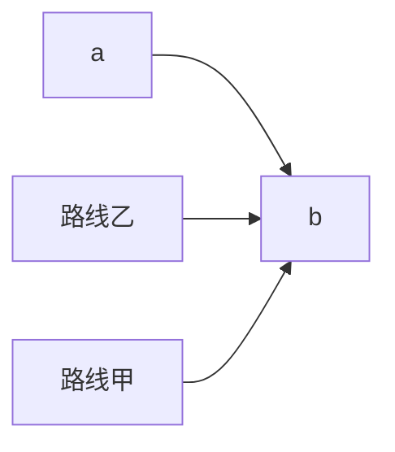

总主编 单 壤 熊 斌

# 奥数 教程

·第六版·

教辅资料站

电子教辅

试卷练习

知识总结

备课资源

—— 扫码关注获取更多学习资料 ——

八年级

本册主编 赵雄辉

seal

二维码扫一扫
免费
750分钟
名师微视频

总主编 单 墉 熊 斌

# 奥数 教程

·第六版·

华东师范大学出版社

八年级

本册主编 赵雄辉

参 编 者 赵雄辉 申建春

谢立红

视频讲解 上海市市北初级中学工作组

尤文奕 章炯毅

管君阳 徐捷

著名数学家、中国科学院院士、原中国数学奥林匹克委员会主席王元先生致青少年数学爱好者

## 致读者

《奥数教程》的出版已有十五个年头了. 在这个过程中, 包含了作者和编辑的辛勤劳作, 更多的是让我们感到欣慰: 这套书, 曾荣获了第十届全国教育图书展的优秀畅销书奖; 香港现代教育研究社出版了她的繁体字版和网络版, 成为香港的畅销图书之一, 并因此获得了版权输出奖; 据北京开卷图书市场研究所的监控销售数据, 近几年《奥数教程》的销量名列同类书前茅. 《奥数教程》在网络上非常畅销, 特别是一年级, 长期居当当网同类书的榜首, 评论数超 1.8 万条, 好评率超过 98%. 这些成绩的取得与作者们精到的创作, 广大读者的支持、呵护是分不开的.

为了使《奥数教程》更健康、更成熟地发展，为了使学生的学习生活更主动、更有效，不断提高图书的质量，我们差不多两三年修订一次，现在已经是第六版了。应广大读者的要求，方便读者自学，我们为本书配了“学习手册”和“能力测试”。把本书习题的详细解答放入“学习手册”，并加入竞赛热点精讲。全新的“能力测试”针对本书每讲，精选了一小时的习题量，帮助读者轻松巩固所学知识。

根据奥数题难度大的特点,我们特意请了奥赛名师,为《奥数教程》1—9年级中每一道例题精心录制了讲解视频,读者朋友可按照图书封底上提示的流程,利用手机或平板电脑扫描例题旁的二维码,即可免费观看.由于视频的录制、审核、上线、更新的工作量较大,在不耽误读者朋友们学习进度的情况下,视频将逐步上线,在2014年11月30日前全部上线.为了解决部分读者不方便用手机看视频,读者朋友可以到http://www.hdsdjf.com/download.aspx下载视频的压缩包,加“华师教辅ECNUP”微信平台(扫封底左下角的二维码或直接添加微信号chinastar01),回复“奥数密码”即可.

十年前，我们开展了“有奖订正”和“巧解共享”两项活动，得到了读者的支持与配合，不少读者纷纷来信、来电提出订正意见和更好的解法。比如，广州市戴炽文老师、漳州市江晗同学、南京市单川同学等提供了一些巧妙解法，经作者确认后，已收入第六版图书中，并署上姓名。这是对我们的鼓励，更是对我们的鞭策。我们计划继续开展下列活动，希望有更多的读者朋友乐于参与。

## 一、有奖订正

2014 年 8 月到 2016 年 8 月期间, 欢迎读者朋友对《奥数教程》(第六版, 共 12 册), 提出改正意见, 我们将对“纠错能手”给予奖励.

## 二、巧解共享

欢迎读者朋友对《奥数教程》中例题与习题，提供更巧妙的解法。我们将选择有新意的、合适的解法在网上公布，以与其他读者朋友共享。读者朋友也可以把巧妙的解法录制成微视频，通过“华师教辅ECNUP”微信平台发送给我们，与大家分享与交流。凡被采用者，我们将署上提供者的姓名，并支付相应的稿酬。

我们衷心祝愿《奥数教程》永远成为您的好朋友.

华东师范大学出版社

## 前言

据说在很多国家,特别是美国,孩子们害怕数学,把数学作为“不受欢迎的学科”.但在中国,情况很不相同,很多少年儿童喜爱数学,数学成绩也都很好.的确,数学是中国人擅长的学科,如果在美国的中小学,你见到几个中国学生,那么全班数学的前几名就非他们莫属.

在数(shǔ)数(shù)阶段,中国儿童就显出优势.

中国人能用一只手表示1\~10，而很多国家非用两只手不可.

中国人早就有位数的概念,而且采用最方便的十进制(不少国家至今还有12进制,60进制的残余).

中国文字都是单音节,易于背诵,例如乘法表,学生很快就能掌握,再“傻”的人也都知道“不管三七二十一”.但外国人,一学乘法,头就大了.不信,请你用英语背一下乘法表,真是佶屈聱牙,难以成诵.

圆周率 $\pi=3.14159\cdots$ . 背到小数后五位, 中国人花一两分钟就够了. 可是俄国人为了背这几个数字, 专门写了一首诗, 第一句三个单词, 第二句一个……要背 $\pi$ 先背诗, 这在我们看来简直是自找麻烦, 可他们还作为记忆的妙法.

四则运算应用题及其算术解法,也是中国数学的一大特色.从很古的时候开始,中国人就编了很多应用题,或联系实际,或饶有兴趣,解法简洁优雅,机敏而又多种多样,有助于提高学生的学习兴趣,启迪学生智慧.例如:

“一百个和尚一百个馒头，大和尚一个人吃三个，小和尚三个人吃一个，问有几个大和尚，几个小和尚？”

外国人多半只会列方程解. 中国却有多种算术解法, 如将每个大和尚“变”成 9 个小和尚, 100 个馒头表明小和尚是 300 个, 多出 200 个和尚, 是由于每个大和尚变小和尚, 多变出 8 个, 从而 $200 \div 8 = 25$ 即是大和尚人数. 小和尚自然是 75 人, 或将一个大和尚与 3 个小和尚编成一组, 平均每人吃一个馒头. 恰好与总体的平均数相等. 所以大和尚与小和尚这样编组后不多不少, 即大和尚是 $100 \div (3 + 1) = 25$ 人.

中国人善于计算,尤其善于心算.古代还有人会用手指计算(所谓“掐指一算”).同时,中国很早就有计算的器械,如算筹、算盘.后者可以说是计算机的雏形.

在数学的入门阶段——算术的学习中,我国的优势显然,所以数学往往是我国聪明的孩子喜爱的学科.

几何推理,在我国古代并不发达(但关于几何图形的计算,我国有不少论著),比希腊人稍逊一筹.但是,中国人善于向别人学习.目前我国中学生的几何水平,在世界上遥遥领先.曾有一个外国教育代表团来到我国一个初中班,他们认为所教的几何内容太深,学生不可能接受,但听课之后,不得不承认这些内容中国的学生不但能够理解,而且掌握得很好.

我国数学教育成绩显著. 在国际数学竞赛中, 我国选手获得众多奖牌, 就是最有力的证明. 从 1986 年我国正式派队参加国际数学奥林匹克以来, 中国队已经获得了 14 次团体冠军, 可谓是成绩骄人. 当代著名数学家陈省身先生曾对此特别赞赏. 他说: “今年一件值得庆祝的事, 是中国在国际数学竞赛中获得第一……去年也是第一名.” (陈省身 1990 年 10 月在台湾成功大学的讲演“怎样把中国建为数学大国”)

陈省身先生还预言：“中国将在21世纪成为数学大国。”

成为数学大国,当然不是一件容易的事,不可能一蹴而就,它需要坚持不懈的努力.我们编写这套丛书,目的就是:(1)进一步普及数学知识,使数学为更多的青少年喜爱,帮助他们取得好的成绩;(2)使喜爱数学的同学得到更好的发展,通过这套丛书,学到更多的知识和方法.

“天下大事，必作于细。”我们希望，而且相信，这套丛书的出版，在使我国成为数学大国的努力中，能起到一点作用。本丛书初版于2000年，现根据课程改革的要求对各册再作不同程度的修订。

著名数学家、中国科学院院士、原中国数学奥林匹克委员会主席王元先生担任本丛书顾问，并为青少年数学爱好者题词，我们表示衷心的感谢。还要感谢华东师大出版社及倪明、孔令志先生，没有他们，这套丛书不会是现在这个样子。

单 增 熊 斌

2014年5月

text_image

微信公众号
教辅资料站

## 目录

第 1 讲 含绝对值的一次方程 / 1

第 2 讲 含绝对值的一次不等式 / 6

第 3 讲 因式分解(一)/11

第 4 讲 因式分解(二)/18

第 5 讲 分式的运算 / 26

第 6 讲 部分分式 / 32

第 7 讲 含字母系数的方程和分式
方程 / 36

第 $\delta$ 讲 实数 / 44

第 9 讲 二次根式 / 51

第 10 讲 代数式的求值 / 60

第 11 讲 对称多项式 / 67

第 12 讲 恒等式的证明 / 74

第 13 讲 一次函数 / 81

第 14 讲 反比例函数 / 94

第 15 讲 统计 / 105

第 16 讲 三角形的边和角 / 113

第 17 讲 全等三角形 / 117

第 18 讲 等腰三角形 / 124

第 19 讲 直角三角形 / 131

第20讲 平行四边形 / 138

第21讲 梯形 / 146

第22讲 多边形的角和对角线 / 152

第23讲 比例线段 / 158

第24讲 相似三角形 / 165

第25讲 中位线 / 172

第26讲 平移和对称 / 178

第27讲 旋转 / 186

第28讲 面积 / 195

第29讲 逻辑推理 / 206

参考答案 / 213

(详细解答见《奥数教程学习手册》)

## 第 1 讲 含绝对值的一次方程

我们知道,一个正数的绝对值是它本身,一个负数的绝对值等于它的相反数,0的绝对值是0.用字母可以表示为

$$
| x | = \left\{ \begin{array}{l l} x, & x \geqslant 0, \\ - x, & x <   0. \end{array} \right.
$$

在数轴上， $|a-b|$ 是表示数a的点与表示数b的点之间的距离.

绝对值符号内含有未知数的方程,称为含有绝对值的方程.

解含有绝对值的方程,关键是根据绝对值的定义去掉绝对值符号,为了去掉绝对值符号,有时要对字母取值分段进行讨论.

【例 1】 方程 $\left|2x-4\right|=5$ 的所有根的和为().

(A) -0.5

(B) 4.5

(C) 5

(D) 4

解 由 $\left|2x-4\right|=5$ 得

2x-4=5 或 2x-4=-5,

分别求得 x = 4.5 或 x = -0.5,

所有根的和为 $4.5 + (-0.5) = 4.$

选 D.

【例 2】 解下列方程:

(1) $\left|-5x-7\right|=-6;$  
(2) $\left|4x+3\right|=2x+9.$

解 （1）由于任何数的绝对值是非负数，不论 x 取什么数，都有 $\left|-5x-7\right|\geqslant0$ ，不可能有 $\left|-5x-7\right|$ 的值等于 -6，所以原方程无解.

(2) 由原方程, 得

$$
4 x + 3 = \pm (2 x + 9), \text {且} 2 x + 9 \geqslant 0.
$$

解 $4x+3=2x+9$ ，得 x=3；

解 $4x+3=-(2x+9)$ ，得 x=-2.

由于 x = 3 时， $2x + 9 = 15 > 0$ ;

x = -2 时， $2x + 9 = 5 > 0$ .

所以原方程的解为 x = 3 或 x = -2.

说明 对一次方程 $|ax + b| = cx + d$ ，我们可将它变为： $ax + b = \pm (cx + d)$ ，且 $cx + d \geqslant 0$ 。对 $ax + b = \pm (cx + d)$ 的根，只有同时满足 $cx + d \geqslant 0$ ，才是原方程的根,否则,就是增根,应当舍去.

【例 3】 解方程

(1) $|x-1|+|x-4|=3;$  
(2) $\left|3x\right|+\left|x-2\right|=4.$

解 （1）在数轴上， $|x-1|$ 表示 x 与 1 之间的距离， $|x-4|$ 表示 x 与 4 之间的距离，而 $|x-1|+|x-4|$ 表示 x 与 1、4 两个距离的和，它们一定大于或等于 3，当 x 落在 1 和 4（包含 1、4）之间时，距离和等于 3。所以，总有 $|x-1|+|x-4|\geqslant3$ ，当且仅当 $1\leqslant x\leqslant4$ 时取等号。于是原方程的解为 $1\leqslant x\leqslant4$ 。

(2) 当 x < 0 时, 方程为 $-3x - x + 2 = 4$ , 解得 $x = -\frac{1}{2}$ .

当 $0 \leqslant x \leqslant 2$ 时，方程为 $3x - x + 2 = 4$ ，解得 x = 1.

当 x > 2 时，方程为 $3x + x - 2 = 4$ ，解得 $x = \frac{3}{2}$ ，舍去.

因此，方程有2个解， $x=-\frac{1}{2}$ 或 x=1.

说明 含绝对值的一次方程可能不止一个解. 第(1)题也可分段讨论去绝对值符号.

【例 4】 在 0 < x < 10 时, 求满足 $\left|x-3\right|=a$ 的整数 a 的值.
解 当 0 < x < 3 时, 原方程化为

$$
3 - x = a \text {, 即} x = 3 - a,
$$

整数 a 只能为 1、2.

当 $3 \leqslant x < 10$ 时, 原方程化为

$$
x - 3 = a \text {, 即} x = 3 + a,
$$

此时整数 a 可取 0、1、2、3、4、5、6.

综合可知,整数a只能为0、1、2、3、4、5、6.

【例 5】 解方程 $\left|\left|\left|x\right|-2\right|-1\right|=3.$

解 根据绝对值的定义,由 ||| x |-2 |-1 |= 3 得

$$
\mid \mid x \mid - 2 \mid - 1 = \pm 3,
$$

即 $\left|\left|x\right|-2\right|=4$ 或 $\left|\left|x\right|-2\right|=-2$ (无解).

根据绝对值定义,由 $\left|\left|x\right|-2\right|=4$ , 得

$$
\mid x \mid - 2 = \pm 4,
$$

即

$|x|=6$ 或 $|x|=-2$ (无解).

根据绝对值定义,由 $\left|x\right|=6$ 得

$$
x = \pm 6.
$$

所以，原方程的解为 x = 6 或 x = -6.

说明 形如 $||ax - b| - c| - d| = e$ 的方程,含有多层的绝对值,求解时可以不断地利用例4的方法,从最外层开始,逐层去掉绝对值符号,最后化为一般的一次方程求解.

【例 6】 解方程 $\left|x-|3x+2\right|=4.$

解 由原方程及绝对值的定义,得

$$
x - | 3 x + 2 | = \pm 4,
$$

即 $\left|3x+2\right|=x-4$ 或 $\left|3x+2\right|=x+4.$

(1) $\left|3x+2\right|=x-4.$

由上式得 $3x+2=\pm(x-4)$ ，且 $x-4\geqslant0$ .

解 $3x+2=x-4$ ，得 x=-3；

解 $3x+2=-(x-4)$ ，得 $x=\frac{1}{2}$ .

由于 x = -3 时，x - 4 = -7 < 0； $x = \frac{1}{2}$ 时， $x - 4 = -\frac{7}{2} < 0$ ，因此，x = -3 与 $x = \frac{1}{2}$ 都是原方程的增根，舍去.

(2) $\left|3x+2\right|=x+4.$

由上式得 $3x+2=\pm(x+4)$ ，且 $x+4\geqslant0$ .

解 $3x+2=x+4$ ，得 x=1；

解 $3x+2=-(x+4)$ ，得 $x=-\frac{3}{2}$ .

由于 x=1 时， $x+4=5>0$ ; $x=-\frac{3}{2}$ 时， $x+4=\frac{5}{2}>0$ ，
所以它们都是原方程的根.

因此,原方程的根为 x = 1 或 $x = -\frac{3}{2}$ .

【例 7】已知关于 x 的方程 $\left|\left|x-2\right|-1\right|=a$ 有三个整数解，求 a 的值.

解 由已知得 $\left|x-2\right|=1\pm a.$

若 a > 1，则 $\left|x - 2\right| = 1 + a$ ，x 只能有两个解.

若 $0 \leqslant a \leqslant 1$ ，则 $|x - 2| = 1 \pm a$ ，可得

$$
x = 3 + a, 3 - a, 1 - a, 1 + a.
$$

因为原方程有三个整数解，a 必为整数，故 a = 0 或 1. 但 a = 0 时，方程只有两个解，故只能 a = 1.

此时方程的三个整数解为 0, 2, 4.

## 品一品

解一道数学难题就像打破一个坚硬的果壳.再硬的果壳都有办法打破,只要有了恰当的工具.

有了好的数学思想,要牢牢把它套住,还要让它孵化.

数学王国是一个符号化的世界,数学中设计符号、运用符号,不仅可以用来进行分析、推理、论证,而且可以用来进行数学中的发现和创造.有人说:数学是思维的体操,数学符号的组合谱成了“体操进行曲”.

绝对值符号“| |”是1841年德国数学家魏尔斯特拉斯(K. Weierstrass, 1815—1897)首先引入的.

## 练习题

## 一、选择题

① 下列判断正确的是().

(A) 方程 $a \mid x \mid = a$ 的解是 $x = \pm 1$  
(B) 方程 $\left|a\right|x=\left|a\right|$ 的解是 $x=\pm1$  
(C) 方程 $\left|a\right|x=a$ 的解是 $x=\pm1$  
(D) 方程 ( $|a|+1$ ) $|x|=|a|+1$ 的解是 $x=\pm1$

② 已知 $\left|3990x+1995\right|=1995$ ，则 x 的值是().

(A) 0 或 1  
(B)-1或0  
(C) 1 或 -1  
(D)-1 或 -2

③ 若 $|2010x+2010|=20\times2010$ ，则 x 等于().

(A) 20 或 -21

(B) -20 或 21

(C) -19 或 21

(D) 19 或 -21

④ 如果关于 x 的方程 $\left|x+1\right|+\left|x-1\right|=a$ 有解，则 a 的取值范围为（）.

(A) $a \geqslant 0$

(B) a > 0

(C) $a \geqslant 1$

(D) $a \geqslant 2$

## 二、填空题

⑤ 当 $\left|x\right|=x+2$ 时， $19x^{94}+3x+27$ 的值为 \_\_\_\_.

⑥ 若 $\left|x\right|+\left|2x\right|+\left|3x\right|+\left|4x\right|=5x$ , 则 x=

⑦ 满足 $\left|5-4x\right|=8$ 的 x 值为 \_\_\_\_.

⑧ 当 x \_\_\_\_ 时， $|x-|x||=-2x.$

⑨ 若 $\frac{a}{1997}|x|-x-1997=0$ 只有负根，则 a 的取值范围是 \_\_\_\_.

## 三、解下列方程

10 | 5x + 6 | = 6x - 5.

⑪ || x |-4 | = 5.

12 | 5x - 3 | = 2 + 3x.

⑬ || x - 2 | + 1 | + 3 | = 12.

14 || 4x + 8 | - 3x | = 5.

⑮ | x - 2 | + | x - 3 | = 1.

## 四、解答题

16 已知关于 x 的方程 $\left|\left|x-1\right|-2\right|+a=0$ 只有三个不同的整数解，求 a 的值.

text_image

微信公众号
教辅资料站

## 第2讲 含绝对值的一次不等式

含有绝对值的不等式,具有一些基本性质,如:

$$
\mid a + b \mid \leqslant \mid a \mid + \mid b \mid , \mid a - b \mid \leqslant \mid a \mid + \mid b \mid ,
$$

$$
\mid a + b \mid \geqslant \mid a \mid - \mid b \mid , \mid a - b \mid \geqslant \mid a \mid - \mid b \mid .
$$

若 $|a| < |b|$ ，则 $a^2 < b^2$

对于含绝对值的不等式 $|x| > a, a > 0$ ，可得 $x > a$ 或 $x < -a$ . $|x| \leqslant a, a > 0$ ，可得 $-a \leqslant x \leqslant a$ .

解含绝对值的不等式,一般是先去掉绝对值符号,然后再求解.

【例 1】已知 $\left|a\right|<\left|c\right|$ ， $\left|b\right|<2\left|a\right|$ ， $b=\frac{a+c}{2}$ ， $S_{1}=\left|\frac{a-b}{c}\right|$ ， $S_{2}=\left|\frac{b-c}{a}\right|$ ， $S_{3}=\left|\frac{a-c}{b}\right|$ ，比较 $S_{1}$ 、 $S_{2}$ 、 $S_{3}$ 的大小.

解 将 $b=\frac{a+c}{2}$ 代入 $S_{1}$ 、 $S_{2}$ 得

$$
\begin{array}{l} S _ {1} = \left| \frac {a - \frac {a + c}{2}}{c} \right| = \left| \frac {a - c}{2 c} \right|, \\ S _ {2} = \left| \frac {\frac {a + c}{2} - c}{a} \right| = \left| \frac {a - c}{2 a} \right|. \\ \end{array}
$$

由于 $|a| < |c|$ ，所以 $S_1 < S_2$ 。

又由于 $\left|b\right|<2\left|a\right|$ ，所以 $S_{2}<S_{3}$

综合可见 $S_{1}<S_{2}<S_{3}$ .

【例 2】 如果 a、b 满足不等式 $\left|\left|a\right|-(a+b)\right|<\left|a-\left|a+b\right|\right|$ ，那么下列判断正确的是（）.

(A) a > 0 且 b > 0

(B) a < 0 且 b > 0

(C) a > 0 且 b < 0

(D) a < 0 且 b < 0

解 将题目条件中的不等式两边平方得

$$
\mid a \mid^ {2} - 2 \mid a \mid \cdot (a + b) + (a + b) ^ {2} <   a ^ {2} - 2 a \cdot \mid a + b \mid + \mid a + b \mid^ {2},
$$

化简得：

$$
\mid a \mid \cdot (a + b) > a \cdot \mid a + b \mid .
$$

显然 $a \neq 0$ . 于是 $a + b > \frac{a}{|a|} |a + b|$ .

此时 $\frac{a}{|a|}$ 只能取-1,即a<0.

则 $a+b>-|a+b|$ ，得 $a+b>0$ ，从而 b>-a>0。

所以选 B.

【例 3】已知 x、y 满足条件 $\left|x\right|+\left|y\right|\leqslant1$ ，求 $x^{2}-xy+y^{2}$ 的最大值.

解 $x^{2} - xy + y^{2} = \frac{1}{4} (x + y)^{2} + \frac{3}{4} (x - y)^{2}.$

由 $|x| + |y|\leqslant 1$ 得

$$
\mid x + y \mid \leqslant \mid x \mid + \mid y \mid \leqslant 1,
$$

从而 $(x+y)^{2}\leqslant1$

$$
\mid x - y \mid \leqslant \mid x \mid + \mid y \mid \leqslant 1,
$$

从而 $(x-y)^{2}\leqslant1$ ，于是

$$
x ^ {2} - x y + y ^ {2} \leqslant \frac {1}{4} + \frac {3}{4} = 1.
$$

并且，当 x、y 中有一个为 0，另一个为 1 时，等号成立，所以 $x^{2}-xy+y^{2}$ 的最大值是 1.

【例 4】求不等式 $\left|x-2006\right|+\left|x\right|\leqslant9999$ 的整数解个数.

解 当 $x \geqslant 2006$ 时，原不等式化为 $x - 2006 + x \leqslant 9999$ ，即 $x \leqslant 6002$ ，且同时要满足 $x \geqslant 2006$ .

当 $0 \leqslant x < 2006$ 时，原不等式化为 $2006 - x + x \leqslant 9999$ 显然对任何 $0 \leqslant x < 2006$ 都成立.

当 x < 0 时，原不等式化为 $2006 - x - x \leqslant 9999$ ，则 $x \geqslant -3996$ .

综合得满足不等式的 x 为 $-3996 \leqslant x \leqslant 6002$ .

这中间共有 $6002-(-3996)+1=9999$ 个整数解.

说明 分段去绝对值符号后,要注意解出的结果是否在所分段的范围内.

【例 5】 解不等式 $\left|x+2\right|>\left|x-3\right|$ .

解 使 $x+2=0,\ x-3=0$ 的 x 分别为 -2 和 3. 原不等式可化为以下三个不等式组：

(1) $\left\{\begin{aligned}x&\geqslant3,\\ x+2&>x-3;\end{aligned}\right.$

(2) $\left\{\begin{aligned}-2&\leqslant x<3,\\ x+2&>3-x;\end{aligned}\right.$  
(3) $\left\{\begin{aligned}x&<-2,\\ -(x+2)&>3-x;\end{aligned}\right.$

解(1)得 $x \geqslant 3$ ;

解(2)得 $\frac{1}{2}<x<3;$

不等式组(3)无解.

所以原不等式的解集是 $x > \frac{1}{2}$ .

说明 从数轴上看,满足不等式的 x 所在点到点 -2 的距离大于到点 3 的距离,可得 $x > \frac{1}{2}$ .

【例 6】 解不等式 $\left|x-4\left|-\right|2x-3\right|\leqslant1$ .

解 $|x-4|$ 与 $|2x-3|$ 的零点分别为 $x=4$ 和 $x=\frac{3}{2}$ ，由零点分段法，可把 $x$ 的取值范围分为三段： $x \leqslant \frac{3}{2}$ ； $\frac{3}{2} < x \leqslant 4$ ； $x > 4$ 。

(1) 当 $x \leqslant \frac{3}{2}$ 时, 原不等式可化为

$$
- x + 4 + 2 x - 3 \leqslant 1,
$$

解得 $x \leqslant 0.$

此时原不等式的解为 $x \leqslant 0$ .

(2) 当 $\frac{3}{2} < x \leqslant 4$ 时, 原不等式可化为

$$
- x + 4 - 2 x + 3 \leqslant 1,
$$

解得 $x \geqslant 2.$

此时原不等式的解为 $2 \leqslant x \leqslant 4$ .

(3) 当 x > 4 时, 原不等式可化为

$$
x - 4 - 2 x + 3 \leqslant 1,
$$

解得 $x \geqslant -2.$

此时原不等式的解为 x > 4.

综上所述,原不等式的解集为 $x \leqslant 0$ 或 $x \geqslant 2$ .

【例 7】若不等式 $\left|x+1\right|+\left|x-3\right|\leqslant a$ 有解, 求 a 的取值范围.

解 由绝对值的几何意义知， $|x+1|+|x-3|$ 的最小值为4，当 $-1\leqslant x\leqslant3$ 时，它的值为4.

所以原不等式有解,则必定有 $a \geqslant 4$ .

【例 8】 解关于 x 的不等式

$$
\mid a x - 1 \mid > a x - 1.
$$

解 因为 $\left|ax-1\right|>ax-1,$

所以
ax-1<0, 即 ax<1.

当 a > 0 时，不等式的解为 $x < \frac{1}{a}$ ;

当 a < 0 时, 不等式的解为 $x > \frac{1}{a}$ ;

当 a = 0 时, 不等式的解为任意实数.

## 读一读

公元 1631 年, 英国数学家、望远镜发明者哈里奥特 (T. Harriot, 1560—1621) 逝世 10 周年, 为了纪念他在数学研究方面的丰功伟绩, 出版了他的遗著《分析术实例》, 该书中创造了多个数学符号, 其中大于和小于符号首次使用, 用 $a > b$ 表示 $a$ 量大于 $b$ 量; $a < b$ 表示 $a$ 量小于 $b$ 量. 该符号直到 18 世纪初才广泛通用.

首先使用“≥”与“≤”符号的是法国的布格尔(P. Bougeur, 1698—1758)，他在1734年就引用这两个符号了.

## 练习题

## 一、选择题

① 如果 x、y 都是有理数，且 x < y，则有（）.

(A) $|x|<|y|$

(B) $|x| > |y|$

(C) $|x|=|y|$

(D) 以上三种都可能

② 如果 a、b 是有理数, 下列各式中一定成立的是().

(A) $a + b > a - |b|$

(B) $|a+b|>|a|+|b|$

(C) $a - |a| \leqslant 0$

(D) $|a| > \frac{1}{b}$

③ 若 a < 0, p > q > 0, 则( ).

(A) | pa | > | qa |

(B) | pa | < | qa |

(C) $\left|\frac{a}{p}\right|>\left|\frac{a}{q}\right|$

(D) $\left|\frac{p}{a}\right|<\left|\frac{q}{a}\right|$

④ 若 $\left|a-c\right|<\left|b\right|$ ，那么().

(A) a - c < b

(B) a > c - b

(C) $|a| > |b| - |c|$

(D) $|a| < |b| + |c|$

⑤ 若 a > b > c，那么（ ）.

(A) $|ab| > |ac|$

(B) $|a|c>b|c|$

(C) | ab | > | bc |

(D) $a \mid c \mid \geqslant b \mid c \mid$

⑥ 如果 a、b、c 都是大于 -1 的负数,那么().

(A) $a^{2}-b^{2}-c^{2}<0$

(B) $a + b - c > 0$

(C) abc > -1

(D) | abc | > 1

## 二、解答题

⑦ 已知 a 为整数，关于 x 的方程 $a^{2}x - 20 = 0$ 的根是质数，且满足不等式 $\left|ax - 7\right| > a^{2}$ ，求 a 的值.

## 三、解下列不等式

8 | 3x + 5 | ≤ 10.

⑨ $\left|x+2\right|>\frac{3x+14}{5}.$

10 | x + 3 | - | 2x - 1 | < 2.

⑪ $\left|x+2\right|+\left|x-3\right|>2.$

## 第3讲 因式分解(一)

把一个多项式化成几个整式的乘积形式,叫做因式分解.通常要求分解后的各个因式是不可约多项式,也就是质因式.

因式分解的基本方法有：

（1）提公因式法. 利用 $ma + mb + mc = m(a + b + c)$ ，把多项式中每一项的公因式提出来.  
(2) 运用公式. 如运用公式 $a^2 - b^2 = (a - b)(a + b)$ , $a^2 \pm 2ab + b^2 = (a \pm b)^2$ , $a^3 \pm b^3 = (a \pm b)(a^2 \mp ab + b^2)$ , $a^3 \pm 3a^2b + 3ab^2 \pm b^3 = (a \pm b)^3$ .  
（3）分组分解法. 先对多项式适当分组, 再分别变形, 然后利用提公因式法或运用公式法分解因式.  
（4）十字相乘法. 对二次三项式的系数进行分解, 借助十字交叉图分解, 即:

$$
a x ^ {2} + b x + c = (m x + r) (n x + s),
$$

其中 $mn = a, rs = c, ms + nr = b.$ 交叉图如右图.

把一个多项式因式分解,如果多项式的各项有公因式,就先提取公因式,公因式可以是数、单项式,也可以是多项式;如果各项没有公因式,再看能否直接运用公式法或十字相乘法分解,如果还不能分解,就试用分组分解法或其他方法.分解因式时,必须进行到每一个多项式因式都不能再分解为止,结果一定是乘积的形式,每个因式都是整式,相同因式的积要写成幂的形式.

本讲主要是应用以上基本方法分解因式,同时学习一些应用因式分解解决的问题.

【例 1】 分解因式:

$$
(x - y) ^ {2 n + 1} + 2 (y - x) ^ {2 n} (y - z) - (x - z) (x - y) ^ {2 n},
$$

其中 n 是正整数.

解 注意到 $(y-x)^{2n}=(x-y)^{2n}$ ,

$$
\begin{array}{l} (x - y) ^ {2 n + 1} + 2 (y - x) ^ {2 n} (y - z) - (x - z) (x - y) ^ {2 n} \\ = (x - y) ^ {2 n} \left[ (x - y) + 2 (y - z) - (x - z) \right] \\ = (x - y) ^ {2 n} (y - z). \\ \end{array}
$$

说明 提取公因式时,必须注意各项的符号.

【例 2】已知 $x^{4}+x^{3}+x^{2}+x+1=0$ ，求 $1+x+x^{2}+x^{3}+x^{4}+\cdots+x^{2013}+x^{2014}$ 的值.

解 将待求值的式子分解因式,再将已知代入.

$$
\begin{array}{l} 1 + x + x ^ {2} + x ^ {3} + x ^ {4} + \dots + x ^ {2 0 1 3} + x ^ {2 0 1 4} \\ = (1 + x + x ^ {2} + x ^ {3} + x ^ {4}) + (x ^ {5} + x ^ {6} + x ^ {7} + x ^ {8} + x ^ {9}) + \dots \\ + (x ^ {2 0 1 0} + x ^ {2 0 1 1} + x ^ {2 0 1 2} + x ^ {2 0 1 3} + x ^ {2 0 1 4}) \\ = (1 + x + x ^ {2} + x ^ {3} + x ^ {4}) (1 + x ^ {5} + x ^ {1 0} + \dots + x ^ {2 0 1 0}) \\ = 0. \\ \end{array}
$$

说明 要求值的式子中带有省略号,分组时要弄清楚省略号中有多少项,如何分组,这样最后一组才不会出错.

【例 3】 分解因式:

(1) $x^{3}(x-2y)+y^{3}(2x-y);$  
(2) $x(x+1)(x+2)(x+3)+1;$  
(3) $(x+y-2xy)(x+y-2)+(1-xy)^{2}.$

解 (1) $x^{3}(x - 2y) + y^{3}(2x - y)$

$$
\begin{array}{l} = (x ^ {4} - y ^ {4}) - 2 x y (x ^ {2} - y ^ {2}) \\ = (x ^ {2} - y ^ {2}) (x ^ {2} + y ^ {2}) - 2 x y (x ^ {2} - y ^ {2}) \\ = (x ^ {2} - y ^ {2}) (x ^ {2} + y ^ {2} - 2 x y) \\ = (x + y) (x - y) ^ {3}. \\ \end{array}
$$

$$
\begin{array}{l} = [ x (x + 3) ] [ (x + 1) (x + 2) ] + 1 \\ = (x ^ {2} + 3 x) (x ^ {2} + 3 x + 2) + 1 \\ = (x ^ {2} + 3 x) ^ {2} + 2 (x ^ {2} + 3 x) + 1 \\ = (x ^ {2} + 3 x + 1) ^ {2}. \\ \end{array}
$$

(2) $x(x+1)(x+2)(x+3)+1$

$$
\begin{array}{l} = (x + y) ^ {2} - 2 x y (x + y) - 2 (x + y) + 4 x y + 1 - 2 x y + x ^ {2} y ^ {2} \\ = [ (x + y) ^ {2} - 2 (x + y) + 1 ] - 2 x y (x + y - 1) + x ^ {2} y ^ {2} \\ = (x + y - 1) ^ {2} - 2 (x + y - 1) x y + (x y) ^ {2} \\ = (x + y - 1 - x y) ^ {2} \\ = (x y - x - y + 1) ^ {2} \\ = (x - 1) ^ {2} (y - 1) ^ {2}. \\ \end{array}
$$

(3) $(x+y-2xy)(x+y-2)+(1-xy)^{2}$

【例 4】已知 $2^{48}-1$ 可以被 60 与 70 之间的两个整数整除, 求这两个整数.

$$
\begin{array}{l} = (2 ^ {2 4}) ^ {2} - 1 \\ = (2 ^ {2 4} + 1) (2 ^ {2 4} - 1) \\ = (2 ^ {2 4} + 1) (2 ^ {1 2} + 1) (2 ^ {1 2} - 1) \\ = (2 ^ {2 4} + 1) (2 ^ {1 2} + 1) (2 ^ {6} + 1) (2 ^ {6} - 1). \\ \end{array}
$$

解 $2^{48} - 1$

易求得 $2^{6}+1=65$ , $2^{6}-1=63$ , 而 $2^{12}+1>70$ , $2^{24}+1>70$ , 所以要求的两个整数为 63 和 65.

说明 以下两个等式值得认真体会:

当 n 为正奇数时，

$$
a ^ {n} + b ^ {n} = (a + b) (a ^ {n - 1} - a ^ {n - 2} b + a ^ {n - 3} b ^ {2} - \dots - a b ^ {n - 2} + b ^ {n - 1});
$$

当 n 为正整数时，

$$
a ^ {n} - b ^ {n} = (a - b) (a ^ {n - 1} + a ^ {n - 2} b + a ^ {n - 3} b ^ {2} + \dots + a b ^ {n - 2} + b ^ {n - 1}).
$$

【例 5】 求代数式 $2x^{2} + 4xy + 5y^{2} - 4x + 2y - 5$ 的最小值.

解 原式 = $(x^{2} + 4xy + 4y^{2}) + (x^{2} - 4x + 4)$

$$
\begin{array}{l} + (y ^ {2} + 2 y + 1) - 1 0 \\ = (x + 2 y) ^ {2} + (x - 2) ^ {2} + (y + 1) ^ {2} - 1 0. \\ \end{array}
$$

因为 $(x+2y)^{2}\geqslant0,(x-2)^{2}\geqslant0,(y+1)^{2}\geqslant0$ ，且当x=2,y=-1时，这三个完全平方式都等于0，所以原式的最小值为-10.

【例6】如图3-1,立方体的每一个面上都写有一个自然数,并且相对两个面所写的两数之和都相等.若18的对面写的是质数a,14的对面写的是质数b,35的对面写的是质数c.试求 $a^{2}+b^{2}+c^{2}-ab-bc-ca$ 的值.

text_image

18
35
14

图3-1

解 由题意可得 $a+18=b+14=c+35$ .

所以 $a-b=-4, b-c=21, c-a=-17.$

$$
\begin{array}{l} = \frac {1}{2} \left(a ^ {2} - 2 a b + b ^ {2} + b ^ {2} - 2 b c + c ^ {2} + c ^ {2} - 2 c a + a ^ {2}\right) \\ = \frac {1}{2} \left[ (a - b) ^ {2} + (b - c) ^ {2} + (c - a) ^ {2} \right] \\ = \frac {1}{2} [ (- 4) ^ {2} + 2 1 ^ {2} + (- 1 7) ^ {2} ] = 3 7 3, \\ \end{array}
$$

因为 $a^{2}+b^{2}+c^{2}-ab-bc-ca$

所以所求式的值为 373.

说明 本题中条件“a、b、c是质数”，在求解中没有使用. 不过由这一条件及关系式 $18 + a = 14 + b = 35 + c$ ，可以断定 c 的奇偶性一定与 a、b 的奇偶性不同，而 $a \neq b$ ，偶质数又只有 2 一个，故 c = 2，从而 a = 19, b = 23.

应用本题方法,由 $a = 1990x + 1989$ , $b = 1990x + 1990$ , $c = 1990x + 1991$ , 可求出 $a^{2} + b^{2} + c^{2} - ab - bc - ca$ 的值.

【例 7】 计算：

$$
\frac {(2 \times 5 + 2) (4 \times 7 + 2) (6 \times 9 + 2) (8 \times 1 1 + 2) \cdots (2 0 1 4 \times 2 0 1 7 + 2)}{(1 \times 4 + 2) (3 \times 6 + 2) (5 \times 8 + 2) (7 \times 1 0 + 2) \cdots (2 0 1 3 \times 2 0 1 6 + 2)}.
$$

解 上式中每个括号内的数可用字母表示为 $n(n+3)+2$ .

而 $n(n+3)+2=n^{2}+3n+2=(n+1)(n+2)$ ，所以

$\text{原式} = \frac{(3 \times 4)(5 \times 6)(7 \times 8)\cdots(2015 \times 2016)}{(2 \times 3)(4 \times 5)(6 \times 7)\cdots(2014 \times 2015)}$

$$
= \frac {2 0 1 6}{2} = 1 0 0 8.
$$

说明 类似例 7 的复杂计算题求值,要观察数字间的特点,找出规律,用字母表示数,对一般情形进行分解,找出化简的规律.

【例 8】 分解因式:

(1) $63x^{2}+22x-8;$  
(2) $x^{2}+x+6y^{2}+3y+5xy.$

解 (1) $63x^{2}+22x-8$

$$
= (7 x + 4) (9 x - 2).
$$

$$
\begin{array}{l} = x ^ {2} + (5 y + 1) x + (6 y ^ {2} + 3 y) \\ = x ^ {2} + (5 y + 1) x + 3 y (2 y + 1) \\ = (x + 3 y) (x + 2 y + 1). \\ \end{array}
$$

(2) $x^{2}+x+6y^{2}+3y+5xy$

text_image

7
9
4
-2
7 × (-2) + 9 × 4 = 22

text_image

1 × 3y
1 × 2y + 1
2y + 1 + 3y = 5y + 1

说明 第(2)题是把多项式看成 x 的二次三项式, 把 y 看成常数, 采用十字相乘法. 有人把这种方法叫主元法, 就是当一个多项式有几个字母时, 选其中某个字母作为主要元素, 其他字母都看作常量, 将多项式按主要元素降幂排列, 再分解因式. 在用十字相乘法分解二次三项式时, 如果二次项系数是负数, 不妨先变形, 如 $-6x^{2}+12-x$ 先变为 $-(6x^{2}+x-12)$ , 再对 $6x^{2}+x-12$ 分解.

【例 9】已知二次三项式 $x^{2}-mx-8$ (m 是整数) 在整数范围内可以分解为两个一次因式的积, 求 m 的可能取值.

解 根据条件,如果将-8分解为两个整数的积,那么这两个整数的和即为-m.

因为-8分解为两个整数积的可能情形有

$$
(- 1) \times 8, (- 2) \times 4, (- 4) \times 2, (- 8) \times 1,
$$

所以-m 的可能值为 $(-1)+8,(-2)+4,(-4)+2,(-8)+1.$

故 m 的可能取值有 -7, -2, 2, 7 共四个.

说明 如果题目的条件不是限定在整数范围内可以分解,那么 m 的取值不能用本题的解法.如果题目改为 $x^{2}-8x-m$ 在整数范围内可以分解因式,那么只要将 -8 拆成两个整数的和 (如 $-50+42,-9+1$ ), 这两个整数的积就等于 -m, 因此, 符合条件的 m 有无数个.

【例 10】 在黑板上写有一个缺系数和常数项的多项式:

$$
x ^ {3} + \square x ^ {2} + \square x + \square .
$$

现有两个人做填数字游戏: 第一个人在任何一个空位内填上一个非零整数(可正可负), 接着, 第二个人在剩下的两个空位置中任选一个填上一个整数, 最后, 第一个人在余下的空位上填一个整数.

求证:不管第二个人怎样填数,第一个人总能使所得到的多项式可分解为三个一次因式的积,并且每个因式的 x 系数为 1,常数项为整数.

证明 因为第一个人有选择空位的主动权,所以他可以在x前的框内填上-1,这样,原多项式变为 $x^{3}+\square x^{2}-x+\square$ .

第二个人不管在哪一个框内填数 a，第一个人只需在最后一个空框内填上第二个人所填数的相反数 -a。这样，原多项式就变成了

$$
x ^ {3} + a x ^ {2} - x - a, \text {或} x ^ {3} - a x ^ {2} - x + a.
$$

$$
\begin{array}{l} = x (x ^ {2} - 1) + a (x ^ {2} - 1) \\ = (x + a) (x + 1) (x - 1). \\ x ^ {3} - a x ^ {2} - x + a \\ = x (x ^ {2} - 1) - a (x ^ {2} - 1) \\ = (x - a) (x + 1) (x - 1). \\ \end{array}
$$

而 $x^{3}+ax^{2}-x-a$

这就表明了第一个人总能使所填数符合要求.

## 试一试

下面的谜语都是以数学用语(数学概念)为谜底,你能猜出来吗?

(1) 大口；  
(2) 当面点清；  
(3) 不搞绝对平均；  
(4) 垂钓；  
(5) 东张西望；  
(6) 考试作弊；  
(7) 一笔债务；  
(8) 五四三二一;

(9) 一个葫芦做两个瓢.

谜底见第 4 讲.

## 练习题

## 一、选择题

① 如果多项式 $x^{2} + kx + \frac{1}{9}$ 是一个完全平方式,那么 k 的值是().

(A) -3

(B) 3

(C) $\frac{1}{3}$ 或 $-\frac{1}{3}$

(D) $\frac{2}{3}$ 或 $-\frac{2}{3}$

② 已知 $x^{2} + ax - 6$ 在整数范围内可分解为两个一次因式的积，且 a < 0，则 a 的值为（）.

(A) -2 和 -3

(B) -7 和 -4

(C) -1 或 -5

(D) 任意负有理数

③ 若 n 是奇数, 则 $\frac{1}{4}(n^{2}-1)$ ().

(A) 一定是奇数

(B) 一定是偶数

(C) 可能是奇数,也可能是偶数

(D) 可能是整数,也可能是分数(分母不是1)

④ n 是某一自然数, 代入代数式 $n^{3}-n$ 中计算其值时, 4 个同学算出的结果分别如下, 其中正确的结果只能是().

(A) 388 944

(B) 388 945

(C) 388 954

(D) 388 948

⑤ 若 x 是非零自然数， $y = x^{4} + 2x^{3} + 2x^{2} + 2x + 1$ ，则（）.

(A) y一定是完全平方数  
(B) 存在有限个 x，使 y 是完全平方数  
(C) y 一定不是完全平方数  
(D) 存在无限个 x，使 y 是完全平方数

⑥ 已知 $x = \underbrace{100 \cdots 00}_{n个0} \underbrace{100 \cdots 050}_{(n+1)个0}$ ，则（）.

(A) x 是完全平方数

(B) x - 25 是完全平方数

(C) x - 50 是完全平方数

(D) $x + 50$ 是完全平方数

⑦ 若 a、b 都是正数，且满足 $12345 = (111 + a)(111 - b)$ ，则 a 与 b 之间的大小关系是（）.

(A) a > b

(B)a<b

(C) a = b

(D) 以上三种情况均有可能

⑧ 数 a、b 满足关系式 $a + b - ab = 1$ ，已知 a 不是整数，则（）.

(A) b也不是整数

(B) b 一定是正整数

(C) b 是负整数

(D) b 是偶数

## 二、把下列各式分解因式

⑨ $2014x^{2}-(2014^{2}-1)x-2014.$

10 $(a-b)a^{6}+(b-a)b^{6}.$

⑪ $(x+y)(x+y+2xy)+(xy+1)(xy-1).$

12 $(x+y)(x-y)+4(y-1).$

13 $x^{2}y - y^{2}z + z^{2}x - x^{2}z + y^{2}x + z^{2}y - 2xyz.$

14 $x^{2}-(m^{2}+n^{2})x+mn(m^{2}-n^{2}).$

15 $(ax - by)^{3} + (by - cz)^{3} - (ax - cz)^{3}.$

## 三、解答题

16 求出在 1 到 100 之间的整数 n，使 $x^{2} + x - n$ 能分解为两个整系数一次因式的乘积.

⑰ 求证： $81^{7}-27^{9}-9^{13}$ 能被 45 整除.

18 求证: 四个连续自然数的积与 1 之和必定是一个完全平方数.

⑲ 求证: 如果一个数可以表示成两个整数的平方和, 那么这个数的 2 倍也可以表示成两个整数的平方和.

## 四、计算题

20 $\frac{2014^{3}-2\times2014^{2}-2012}{2014^{3}+2014^{2}-2015}$

21 $\frac{45.1^{3}-13.9^{3}}{31.2}+45.1\times13.9.$

## 第4讲 因式分解(二)

因式分解是多项式的一种恒等变形.除了上一讲应用的基本方法,还有一些重要方法.对项数多的多项式,常常要根据多项式的项数与特点灵活选择方法.

本讲再学习几种因式分解的方法.

## 1. 添项、拆项法

在分解因式时,常要对多项式进行适当的变形,使其能分组分解.添项和拆项是两种重要的变形技巧.所谓添项,就是在要分解的多项式中加上仅仅符号相反的两项的和(实际上是加上0,并不改变原多项式的值),如把 $a^{4}+4$ 添上 $4a^{2}+(-4a^{2})$ ,得 $a^{4}+4=(a^{4}+4a^{2}+4)-4a^{2}=(a^{2}+2)^{2}-(2a)^{2}$ ,从而可将原多项式分解因式.拆项是把多项式中某一项拆成两项或多项的代数和(相当于整式加法中合并同类项的逆运算),再通过适当分组,达到分解因式的目的.

【例 1】 把下列各式分解因式：

(1) $x^{4}+x^{2}y^{2}+y^{4};$  
(2) $x^{3}+9x^{2}+26x+24;$  
(3) $a^{3}+b^{3}+c^{3}-3abc$ ;  
(4) $ab(a+b)^{2}-(a+b)^{2}+1.$

$$
\begin{array}{l} = x ^ {4} + 2 x ^ {2} y ^ {2} + y ^ {4} - x ^ {2} y ^ {2} \\ = (x ^ {2} + y ^ {2}) ^ {2} - (x y) ^ {2} \\ = (x ^ {2} + y ^ {2} + x y) (x ^ {2} + y ^ {2} - x y). \\ \end{array}
$$

解 (1) $x^{4} + x^{2}y^{2} + y^{4}$

$$
\begin{array}{l} = (x ^ {3} + 7 x ^ {2} + 1 2 x) + (2 x ^ {2} + 1 4 x + 2 4) \\ = x (x ^ {2} + 7 x + 1 2) + 2 (x ^ {2} + 7 x + 1 2) \\ = (x + 2) (x ^ {2} + 7 x + 1 2) \\ = (x + 2) (x + 3) (x + 4). \\ \end{array}
$$

(2) $x^{3}+9x^{2}+26x+24$

$$
\begin{array}{l} = a ^ {3} + 3 a ^ {2} b + 3 a b ^ {2} + b ^ {3} + c ^ {3} - 3 a ^ {2} b - 3 a b ^ {2} - 3 a b c \\ = (a + b) ^ {3} + c ^ {3} - 3 a b (a + b + c) \\ = (a + b + c) \left[ (a + b) ^ {2} - (a + b) c + c ^ {2} - 3 a b \right] \\ = (a + b + c) (a ^ {2} + b ^ {2} + c ^ {2} - a b - a c - b c). \\ \end{array}
$$

(3) $a^{3}+b^{3}+c^{3}-3abc$

$$
\begin{array}{l} = a b \cdot a ^ {2} + 2 a ^ {2} b ^ {2} + a b \cdot b ^ {2} - a ^ {2} - 2 a b - b ^ {2} + 1 \\ = (a b \cdot a ^ {2} - a b) + (a ^ {2} b ^ {2} - b ^ {2}) - (a ^ {2} - 1) + (a ^ {2} b ^ {2} + a b \cdot b ^ {2} - a b) \\ = a b \left(a ^ {2} - 1\right) + b ^ {2} \left(a ^ {2} - 1\right) - \left(a ^ {2} - 1\right) + a b \left(a b + b ^ {2} - 1\right) \\ = (a ^ {2} - 1) (a b + b ^ {2} - 1) + a b (a b + b ^ {2} - 1) \\ = (a b + b ^ {2} - 1) (a ^ {2} + a b - 1). \\ \end{array}
$$

(4) $ab(a+b)^{2}-(a+b)^{2}+1$

说明 添项、拆项要根据原式的特点进行试凑. 第(1)题是为配完全平方式, 把 $x^{2}y^{2}$ 拆成 $2x^{2}y^{2}-x^{2}y^{2}$ . 第(2)题还可按 $(x^{3}+2x^{2})+(7x^{2}+14x)+(12x+24)$ 分组, 或按 $(x^{3}+3x^{2})+(6x^{2}+18x)+(8x+24)$ 分组, 也可按 $(x^{3}+4x^{2})+(5x^{2}+20x)+(6x+24)$ 分组. 第(3)题的添项, 目的在于配成 $(a+b)^{3}$ . 第(4)题拆项是为了配出 $a^{2}-1$ , 也可先配出 $b^{2}-1$ .

【例 2】已知 a 是自然数, 问 $a^{4}-3a^{2}+9$ 是质数还是合数? 给出你的证明.

分析 质数只有 1 和它本身两个约数, 而合数除了 1 和它本身还有别的约数, 要判定 $a^{4}-3a^{2}+9$ 是质数还是合数, 关键看它能否分解因式, 并且有没有除了 1 和它本身以外的约数.

$$
\begin{array}{l} = (a ^ {4} + 6 a ^ {2} + 9) - 9 a ^ {2} \\ = (a ^ {2} + 3) ^ {2} - (3 a) ^ {2} \\ = (a ^ {2} + 3 a + 3) (a ^ {2} - 3 a + 3). \\ \end{array}
$$

解 $a^{4}-3a^{2}+9$

当 a = 0 时， $a^{4}-3a^{2}+9=9$ ，是合数.

当 a=1 时， $a^{4}-3a^{2}+9=7\times1=7$ ，是质数.

当 a = 2 时， $a^{4}-3a^{2}+9=13\times1=13$ ，也是质数.

当a>2时， $a^{2}+3a+3>1$ ， $a^{2}-3a+3=(a-2)(a-1)+1>1$ ，这说明，此时 $a^{4}-3a^{2}+9$ 可以分解为两个大于1的自然数的积，即它为合数.

所以,当a=1或2时, $a^{4}-3a^{2}+9$ 是质数;当a=0或a>2时, $a^{4}-3a^{2}+9$ 是合数.

说明 根据国家标准规定,自然数包括0和正整数.本题可先取a=0,1,2,3,…,逐个求出 $a^{4}-3a^{2}+9$ 的值,再根据值进行猜测,然后寻求证明方法.还应注意,在将 $a^{4}-3a^{2}+9$ 分解因式后,不能直接断定 $a^{4}-3a^{2}+9$ 是合数,而要看各因式的值是否大于1.

## 2. 换元法

有些复杂的多项式,如果把其中某些部分看作一个整体,用一个新的字母代替(即换元),不仅可使原式得到简化,而且能使式子的特点更加明显.这样先进行换元,再将含“新字母”的多项式分解因式,最后将“新字母”用原来的式子代回去,得到原多项式的因式分解结果,这种方法就是因式分解中的换元法,或者说是换元法在因式分解中的应用.

【例 3】 分解因式:

(1) $(x^{2}+x+1)(x^{2}+x+2)-12;$  
(2) $(y+1)^{4}+(y+3)^{4}-272.$

分析 第(1)题中两个括号内的二次项和一次项完全相同,如用 $y=x^{2}+x+1$ 换元,可使原式简明而易于分解.第(2)题中有两个四次式相加,直接去掉括号,运算繁琐.为了使去括号后可以消项,常取平均值换元,即设 $u=(y+1+y+3)\div2=y+2$ ,从而使 $y+1=u-1,y+3=u+1$ ,代入后即可简化运算.

解（1）设 $x^{2} + x + 1 = y$ ，则

$$
\begin{array}{l} (x ^ {2} + x + 1) (x ^ {2} + x + 2) - 1 2 \\ = y (y + 1) - 1 2 \\ = y ^ {2} + y - 1 2 \\ = (y - 3) (y + 4) \\ = (x ^ {2} + x - 2) (x ^ {2} + x + 5) \\ = (x - 1) (x + 2) (x ^ {2} + x + 5). \\ \end{array}
$$

(2) 设 $y + 2 = u$ ，则

$$
\begin{array}{l} (y + 1) ^ {4} + (y + 3) ^ {4} - 2 7 2 \\ = (u - 1) ^ {4} + (u + 1) ^ {4} - 2 7 2 \\ = (u ^ {2} - 2 u + 1) ^ {2} + (u ^ {2} + 2 u + 1) ^ {2} - 2 7 2 \\ = [ (u ^ {2} + 1) - 2 u ] ^ {2} + [ (u ^ {2} + 1) + 2 u ] ^ {2} - 2 7 2 \\ = 2 (u ^ {2} + 1) ^ {2} + 8 u ^ {2} - 2 7 2 \\ = 2 u ^ {4} + 1 2 u ^ {2} - 2 7 0 \\ = 2 (u ^ {2} - 9) (u ^ {2} + 1 5) \\ = 2 (u - 3) (u + 3) (u ^ {2} + 1 5) \\ = 2 (y - 1) (y + 5) (y ^ {2} + 4 y + 1 9). \\ \end{array}
$$

【例 4】 分解因式:

(1) $(a-b)^{4}+(a+b)^{4}+(a^{2}-b^{2})^{2};$  
(2) $x^{4}-1998x^{2}+1999x-1998.$

解 (1) 设 a - b = x, $a + b = y$ ，则

$$
\begin{array}{l} (a - b) ^ {4} + (a + b) ^ {4} + (a ^ {2} - b ^ {2}) ^ {2} \\ = x ^ {4} + y ^ {4} + x ^ {2} y ^ {2} \\ = (x ^ {2} + y ^ {2}) ^ {2} - x ^ {2} y ^ {2} \\ = (x ^ {2} + y ^ {2} - x y) (x ^ {2} + y ^ {2} + x y) \\ = (2 a ^ {2} + 2 b ^ {2} - a ^ {2} + b ^ {2}) (2 a ^ {2} + 2 b ^ {2} + a ^ {2} - b ^ {2}) \\ = (a ^ {2} + 3 b ^ {2}) (3 a ^ {2} + b ^ {2}). \\ \end{array}
$$

(2) 设 1998 = n，则 $1999 = n + 1$ ，

$$
\begin{array}{l} x ^ {4} - 1 9 9 8 x ^ {2} + 1 9 9 9 x - 1 9 9 8 \\ = x ^ {4} - n x ^ {2} + (n + 1) x - n \\ = (x ^ {4} + x) - n (x ^ {2} - x + 1) \\ = x (x + 1) \left(x ^ {2} - x + 1\right) - n \left(x ^ {2} - x + 1\right) \\ = (x ^ {2} - x + 1) (x ^ {2} + x - n) \\ = (x ^ {2} - x + 1) (x ^ {2} + x - 1 9 9 8). \\ \end{array}
$$

说明 换元是为解题搭桥梁,“过河”之后就“拆桥”.有时可搭多座桥(如第(1)题);有时可把常数换成字母,把特殊化为一般去考虑(如第(2)题).

## 3. 待定系数法

有的多项式虽不能直接分解因式,但可由式子的最高次数与系数的特点断定其分解结果的因式形式.如只含一个字母的三次多项式分解的结果可能是一个一次二项式乘以一个二次三项式,也可能是三个一次因式的积.于是,我们可以先假设要分解因式的多项式等于几个因式的积,再根据恒等式的性质列出方程(组),进而确定其中的系数,得到分解结果,这种方法就称为待定系数法.

用待定系数法分解因式时需利用恒等式的如下重要性质:

如果 $a_{n}x^{n}+a_{n-1}x^{n-1}+\cdots+a_{1}x+a_{0}\equiv b_{n}x^{n}+b_{n-1}x^{n-1}+\cdots+b_{1}x+b_{0}$ ，那么 $a_{n}=b_{n}, a_{n-1}=b_{n-1}, \cdots, a_{1}=b_{1}, a_{0}=b_{0}$ 。即恒等式同次项的对应系数一定相等。

这里，“ $\equiv$ ”表示“恒等于”，即对任何x值，等式左边的值都等于右边的值.

【例 5】如果多项式 $x^{2}-(a+5)x+5a-1$ 能分解成两个一次因式 $(x+b)$ 、 $(x+c)$ 的乘积，且 b、c 为整数，求 a 的值.

解 由条件得

$$
x ^ {2} - (a + 5) x + 5 a - 1 = (x + b) (x + c) = x ^ {2} + (b + c) x + b c,
$$

于是

$$
\left\{ \begin{array}{l} b + c = - a - 5, \\ b c = 5 a - 1. \end{array} \right. \tag {①}
$$

①×5+②得

$$
5 (b + c) + b c = - 2 6.
$$

即 $bc + 5(b + c) + 25 = -1.$

从而 $(b+5)(c+5)=-1$ .

因为 b、c 都是整数，所以 $\left\{\begin{aligned}b+5&=1,\\ c+5&=-1,\end{aligned}\right.$ 或 $\left\{\begin{aligned}b+5&=-1.\\ c+5&=1.\end{aligned}\right.$

解得 $\left\{\begin{aligned}b&=-4,\\ c&=-6,\end{aligned}\right.$ 或 $\left\{\begin{aligned}b&=-6,\\ c&=-4.\end{aligned}\right.$

所以 $a = -b - c - 5 = 5.$

【例 6】 把 $6x^{2} + xy - 2y^{2} + 2x - 8y - 8$ 分解因式.

分析 要分解的式子是二元二次多项式,且二次项 $6x^{2} + xy - 2y^{2} = (3x + 2y)(2x - y)$ ，从而可断定原式分解的结果形式为 $(3x + 2y + a)(2x - y + b)$ ，于是可用待定系数法分解.

解 设原式 = (3x + 2y + a)(2x - y + b)，将右边展开得

$$
\begin{array}{l} 6 x ^ {2} + x y - 2 y ^ {2} + 2 x - 8 y - 8 \\ = 6 x ^ {2} + x y - 2 y ^ {2} + (2 a + 3 b) x + (- a + 2 b) y + a b. \\ \end{array}
$$

由恒等式的性质, 比较两边的系数, 得

$$
\left\{ \begin{array}{l l} 2 a + 3 b = 2, & ① \\ - a + 2 b = - 8, & ② \\ a b = - 8. & ③ \end{array} \right.
$$

由①、②可解得 a = 4, b = -2.

将 a = 4, b = -2 代入③，③也成立.

所以原式 $= (3x + 2y + 4)(2x - y - 2)$

说明 在比较两边系数后得到三个方程,但只有两个未知数,此时应选两个简单的方程联立求解,再把求得的值代入第三个方程检验.如果不能使第三个方程成立,则求得的值应舍去,原式不能分解为所设的形式.

本题在设定分解结果后,还可通过取几组具体的 x、y 值,代入假设的等式,列出方程组,求出待定系数 a、b 的值.

## 4. 利用因式定理分解

对于一个多项式 $a_{n}x^{n}+a_{n-1}x^{n-1}+\cdots+a_{1}x+a_{0}$ ，如果 x-a 是它的一个因式，那么把 x=a 代入该多项式，它的值一定为 0.

因式定理:如果 x=a 时,多项式 $a_{n}x^{n}+a_{n-1}x^{n-1}+\cdots+a_{1}x+a_{0}$ 的值为 0,那么 x-a 是该多项式的一个因式.

对于系数全部是整数的多项式 $a_{n}x^{n}+a_{n-1}x^{n-1}+\cdots+a_{1}x+a_{0}$ ，如果 $x=\frac{q}{p}$ (p、q 是互质的整数) 时，该多项式的值为 0，也就是 $x-\frac{q}{p}$ 是该多项式的一个因式时，一定有 p 是 $a_{n}$ 的约数，q 是 $a_{0}$ 的约数.

对于 $a_{n}=1$ 的特殊整系数多项式(即系数全部是整数的多项式), 如果 $x-q$ 是它的因式, 那么 $q$ 一定是常数项的约数.

有了以上定理,我们可以通过分解整系数多项式的最高次项系数和最低次项系数的因数,组成一些分数,并逐个试验,找出整系数多项式的一个或几个因式,然后再用多项式除以多项式的办法逐步分解.

【例 7】已知 $x^{2} + x - 6$ 是多项式 $2x^{4} + x^{3} - ax^{2} + bx + a + b - 1$ 的因式, 求 a、b 的值.

解 因为 $x^{2}+x-6=(x+3)(x-2)$ ，所以 $x+3$ 、x-2 都是 $2x^{4}+x^{3}-ax^{2}+bx+a+b-1$ 的因式.

将 x = -3, x = 2 代入该多项式, 其值应为 0, 即:

$$
\left\{ \begin{array}{l} 2 \times (- 3) ^ {4} + (- 3) ^ {3} - a \times (- 3) ^ {2} + b \times (- 3) + a + b - 1 = 0, \\ 2 \times 2 ^ {4} + 2 ^ {3} - a \times 2 ^ {2} + b \times 2 + a + b - 1 = 0, \end{array} \right.
$$

化简得

$$
\left\{ \begin{array}{l} - 8 a - 2 b + 1 3 4 = 0, \\ - a + b + 1 3 = 0. \end{array} \right.
$$

解得 a = 16, b = 3.

说明 本题也可以设 $2x^{4}+x^{3}-ax^{2}+bx+a+b-1=(x^{2}+x+6)A$ ，不必管 A 是一个什么样的多项式，再把 x=-3, x=2 代入等式.

【例 8】 分解因式： $x^{4}+2x^{3}-9x^{2}-2x+8$

分析 本题可以用拆项分组或待定系数法分解,也可利用因式定理分解.因为首项系数为1,常数项为8,8的约数有±1、±2、±4、±8,所以,如果原多项式有因式x-a,那么a的可能取值在这8个数之中.通过逐个代入检验,即可找出使原多项式值为0的因数.

解 因为 8 的约数有 1、-1、2、-2、4、-4、8、-8. 逐个代入原多项式求值, 得 x = 1、-1、2、-4 时, 原多项式的值都为零, 这说明 $x - 1$ 、 $x + 1$ 、 $x - 2$ 、 $x + 4$ 都是原多项式的因式.

又由于原多项式的次数为 4, 最高次项的系数为 1, 所以

$$
\text {原式} = (x - 1) (x + 1) (x - 2) (x + 4).
$$

说明 如果一元多项式中各项的系数和为0,那么x-1是这个多项式的因式;如果一元多项式中所有奇次项系数的和等于所有偶次项系数的和,那么 $x+1$ 是这个多项式的因式.本题可由这个结论求得原式有因式 $(x-1)(x+1)$ .

## 读一读

1946年4月5日,世界人民还沉醉于第二次世界大战结束的喜悦之中,一家报纸刊出一条骇人听闻的消息,声称经过一位“天文学家”和一位“数论权威”多年研究,预言2141年是世界的末日.消息传出,人心震动.那么这两位是凭什么预言的呢?原来,他们计算了式子 $N=1492^{n}-1770^{n}-1863^{n}+2141^{n}$ 在 $n=0,1,2,\cdots,1945$ 的值,结果都是1946的倍数.而1492年哥伦布发现了新大陆;1770年英国殖民地制造了波士顿惨案;1863年美国总统林肯发表解放黑奴的“解放宣言”,三个数字都与重大历史事件有关,故2141年一定要出重大事件,因为它是式子的最后一项,所以2141年是世界末日.这当然是一个荒唐的预言,但其中有一个数学问题就是在n为小于1946的自然数时,N总是1946的倍数.这是为什么呢?

事实上,因为 $x^{n}-y^{n}=(x-y)(x^{n-1}+x^{n-2}y+\cdots+xy^{n-2}+y^{n-1})$ ,所以对任何正整数 n 有 x-y 整除 $x^{n}-y^{n}$ .

而 $a^{n}-b^{n}-c^{n}+d^{n}=(a^{n}-b^{n})-(c^{n}-d^{n})$ ，当 a-b=c-d 时， $a^{n}-b^{n}-c^{n}+d^{n}$ 能被 a-b 整除.

又 $a^{n}-b^{n}-c^{n}+d^{n}=(a^{n}-c^{n})-(b^{n}-d^{n})$ ，当 a-c=b-d 时， $a^{n}-b^{n}-c^{n}+d^{n}$ 能被 a-c 整除.

取 a-b=c-d=278, a-c=b-d=371 时, $a^{n}-b^{n}-c^{n}+d^{n}$ 能被 278 整除, 也能被 371 整除, 因为 $278 \times 371 = 53 \times 1946$ , 且 278 与 371 互素, 所以任取一个 d 都有结论 $a^{n}-b^{n}-c^{n}+d^{n}$ 被 1946 整除. 当 d=1492 时, a=2141, b=1863, c=1770, 此时, 正好有 $1492^{n}-1770^{n}-1863^{n}+2141^{n}$ 能被 1946 整除.

可见，“预言家”的神秘其实只是运用因式分解得出的一个结论.

第3讲“试一试”的谜底:(1)因子(字)分解;(2)正数;(3)约分;(4)等于(鱼);(5)移项;(6)假分数;(7)负数;(8)倒数;(9)因式分解.

## 练习题

## 一、选择题

① 如果 4x-3 是 $4x^{2}+5x+a$ 的一个因式, 则 a 的值是().

(A) -6

(B) 6

(C) -8

(D) 8

② 当 m、n 都是大于 1 的整数时， $m^{4}+4n^{4}$ 一定是（）.

(A) 奇数

(B) 偶数

(C) 质数

(D) 合数

③ 若 $m = 2006^{2} + 2006^{2} \times 2007^{2} + 2007^{2}$ ，则 $m(\quad)$ .

(A) 是完全平方数且是奇数

(B) 是完全平方数且是偶数

(C) 不是完全平方数,但是偶数

(D) 是质数

④ 若 $3x^{3}-kx^{2}+4$ 被 3x-1 除后余 3, 则 k 的值为().

(A) 3

(B) 4

(C) 9

(D) 10

⑤ 下列式子中, 是 $2x^{3} + x^{2} - 13x + 6$ 的因式的是().

(A) $x + 2$

(B)x-3

(C) 2x - 1

(D) $2x + 1$

## 二、把下列各式分解因式

6 $a^{4} + 64b^{4}$  
⑦ $x^{3}+2x^{2}-5x-6.$  
8 $x^{3}+3x^{2}+3x+2.$  
⑨ $(x^{2}-x-3)(x^{2}-x-5)-3.$  
10 $3x^{2} + 5xy - 2y^{2} + x + 9y - 4.$  
⑪ $x^{3}+6x^{2}+11x+6.$

## 三、按指定方法分解因式

12 用换元法分解 $(x^{2}+5x+6)(x^{2}+7x+6)-3x^{2}$  
⑬ 用待定系数法分解 $x^{2}-xy-2y^{2}-x+5y-2$  
⑭ 用因式定理分解 $x^{3}-3x^{2}-13x+15$

## 四、解答题

⑮ 求证： $2x+3$ 是多项式 $2x^{4}-5x^{3}-10x^{2}+15x+18$ 的因式.  
16 已知多项式 $2x^{3}-x^{2}+m$ 有一个因式是 $2x+1$ ，求 m 的值.  
⑰ 求证： $8x^{2}-2xy-3y^{2}$ 可以化为两个整系数多项式的平方差.  
18 求证:不论 x、y 取什么值, $3x^{2}-8xy+9y^{2}-4x+6y+13$ 的值总是正数.  
⑲ 已知 $12a^{2} + 7b^{2} + 5c^{2} \leqslant 12a \mid b \mid -4b \mid c \mid -16c - 16$ ，求 a、b、c 的值.

## 第5讲 分式的运算

分式是两个整式相除的商,其中分母是除式,它一定含有字母,分子是被除式,不一定含有字母.当分子为零且分母不为零时,分式的值等于零,而当分母为零时,分式没有意义.

分式的基本性质是确定分式符号、通分和约分的基础. 在 $\frac{A}{B} = \frac{A \times M}{B \times M}$ , $\frac{A}{B} = \frac{A \div M}{B \div M}$ 中, M 一定是不为零的整式.

分式的运算是重要的代数式恒等变形. 其主要运算法则有

$$
\frac {a}{c} \pm \frac {b}{c} = \frac {a \pm b}{c};
$$

$$
\frac {a}{b} \pm \frac {c}{d} = \frac {a d \pm b c}{b d};
$$

$$
\frac {a}{b} \cdot \frac {c}{d} = \frac {a c}{b d}, \frac {a}{b} \div \frac {c}{d} = \frac {a d}{b c};
$$

$\left(\frac{a}{b}\right)^{n}=\frac{a^{n}}{b^{n}}$ (n 是正整数).

进行异分母分式加减运算的基本方法是转化为同分母分式加减运算,转化的关键是通分.但有时并不必将所有分式全部通分,而是利用一些技巧简化运算,如用逐步通分法、拆项分项法、分组通分法、换元法等.

分式的概念、运算与分数的概念、运算有许多相似之处，因而在解决分式的问题时要重视联系分数的相关问题进行类比思考.

【例 1】使分式 $\frac{1}{1+\frac{1}{1+\frac{1}{x}}}$ 有意义的条件是().

(A) $x \neq 0$

(B) $x \neq -1$

(C) $x \neq -\frac{1}{2}$

(D) $x \neq 0, x \neq -1, x \neq -\frac{1}{2}$

解 题中分式要有意义,必须 $x \neq 0, 1 + \frac{1}{x} \neq 0, 1 + \frac{1}{1 + \frac{1}{x}} \neq 0$ , 即

$$
x \neq 0, x + 1 \neq 0, 2 x + 1 \neq 0,
$$

所以必须 $x \neq 0, x \neq -1, x \neq -\frac{1}{2}$ ，选 D.

【例 2】已知 $\frac{x}{x^{2}+x+1}=a\neq0$ ，用含 a 的式子表示 $\frac{x^{2}}{x^{4}+x^{2}+1}.$

解 由已知得 $\frac{x^{2}+x+1}{x}=\frac{1}{a}$ ，即 $x+\frac{1}{x}=\frac{1}{a}-1$ .

又

$$
\begin{array}{l} \frac {x ^ {4} + x ^ {2} + 1}{x ^ {2}} = x ^ {2} + \frac {1}{x ^ {2}} + 1 \\ = \left(x + \frac {1}{x}\right) ^ {2} - 1 \\ = \left(\frac {1}{a} - 1\right) ^ {2} - 1 \\ = \frac {1 - 2 a}{a ^ {2}}. \\ \end{array}
$$

所以 $\frac{x^{2}}{x^{4}+x^{2}+1}=\frac{a^{2}}{1-2a}.$

说明 当分母是多项式、分子是单项式,且分母的次数高于分子的次数时,不妨试试它的倒数.

【例 3】 计算 $\frac{1^{2}}{1^{2}-100+5000}+\frac{2^{2}}{2^{2}-200+5000}+\cdots+$ $\frac{k^{2}}{k^{2}-100k+5000}+\cdots+\frac{99^{2}}{99^{2}-9900+5000}.$

解 因为 $(100-k)^{2}-100(100-k)=k^{2}-100k$ ，考察：

$$
\begin{array}{l} \frac {k ^ {2}}{k ^ {2} - 1 0 0 k + 5 0 0 0} + \frac {(1 0 0 - k) ^ {2}}{(1 0 0 - k) ^ {2} - 1 0 0 (1 0 0 - k) + 5 0 0 0} \\ = \frac {k ^ {2}}{k ^ {2} - 1 0 0 k + 5 0 0 0} + \frac {1 0 0 ^ {2} - 2 0 0 k + k ^ {2}}{k ^ {2} - 1 0 0 k + 5 0 0 0} \\ = \frac {2 k ^ {2} - 2 0 0 k + 1 0 0 0 0}{k ^ {2} - 1 0 0 k + 5 0 0 0} = 2, \\ \end{array}
$$

而 $\frac{50^{2}}{50^{2}-100\times50+5000}=1,$

所以 原式 = 49 × 2 + 1 = 99.

【例 4】 化简：

$$
\frac {x _ {2}}{x _ {1} \left(x _ {1} + x _ {2}\right)} + \frac {x _ {3}}{\left(x _ {1} + x _ {2}\right) \left(x _ {1} + x _ {2} + x _ {3}\right)} + \dots +
$$

$$
\frac {x _ {n}}{(x _ {1} + x _ {2} + \cdots + x _ {n - 1}) (x _ {1} + x _ {2} + \cdots + x _ {n})}.
$$

解 原式 = $\frac{1}{x_{1}} - \frac{1}{x_{1} + x_{2}} + \frac{1}{x_{1} + x_{2}} - \frac{1}{x_{1} + x_{2} + x_{3}} + \cdots +$

$$
\frac {1}{x _ {1} + x _ {2} + \cdots + x _ {n - 1}} - \frac {1}{x _ {1} + x _ {2} + \cdots + x _ {n}}
$$

$$
= \frac {1}{x _ {1}} - \frac {1}{x _ {1} + x _ {2} + \cdots + x _ {n}} = \frac {x _ {2} + x _ {3} + \cdots + x _ {n}}{x _ {1} \left(x _ {1} + x _ {2} + \cdots + x _ {n}\right)}.
$$

【例 5】化简： $\frac{1}{a}+\frac{1}{b}\left(1+\frac{1}{a}\right)+\frac{1}{c}\left(1+\frac{1}{a}\right)\left(1+\frac{1}{b}\right)+\frac{1}{d}\left(1+\frac{1}{b}\right)$

$$
\left. \frac {1}{a}\right) \left(1 + \frac {1}{b}\right) \left(1 + \frac {1}{c}\right) - \left(1 + \frac {1}{a}\right) \left(1 + \frac {1}{b}\right) \left(1 + \frac {1}{c}\right) \left(1 + \frac {1}{d}\right).
$$

解 将 $\frac{1}{a}$ 用 $-1+\left(1+\frac{1}{a}\right)$ 代入要化简的式子,利用提取公因式方法,

原式 $= -1 + \left(1 + \frac{1}{a}\right)\left(1 + \frac{1}{b}\right) + \frac{1}{c}\left(1 + \frac{1}{a}\right)\left(1 + \frac{1}{b}\right) + \frac{1}{d}\left(1 + \frac{1}{a}\right)\left(1 +$

$$
\left. \frac {1}{b}\right) \left(1 + \frac {1}{c}\right) - \left(1 + \frac {1}{a}\right) \left(1 + \frac {1}{b}\right) \left(1 + \frac {1}{c}\right) \left(1 + \frac {1}{d}\right)
$$

$$
= - 1 + \left(1 + \frac {1}{a}\right) \left(1 + \frac {1}{b}\right) \left(1 + \frac {1}{c}\right) + \frac {1}{d} \left(1 + \frac {1}{a}\right) \left(1 + \frac {1}{b}\right)
$$

$$
\left(1 + \frac {1}{c}\right) - \left(1 + \frac {1}{a}\right) \left(1 + \frac {1}{b}\right) \left(1 + \frac {1}{c}\right) \left(1 + \frac {1}{d}\right)
$$

$$
= - 1.
$$

【例 6】 化简：

$$
\frac {2 a - b - c}{a ^ {2} - a b - a c + b c} + \frac {2 b - c - a}{b ^ {2} - b c - a b + a c} + \frac {2 c - a - b}{c ^ {2} - a c - b c + a b}.
$$

解 $\frac{2a-b-c}{a^{2}-ab-ac+bc}+\frac{2b-c-a}{b^{2}-bc-ab+ac}+\frac{2c-a-b}{c^{2}-ac-bc+ab}$

$$
\begin{array}{l} = \frac {(a - b) + (a - c)}{(a - b) (a - c)} + \frac {(b - c) + (b - a)}{(b - c) (b - a)} + \frac {(c - a) + (c - b)}{(c - a) (c - b)} \\ = \frac {1}{a - c} + \frac {1}{a - b} + \frac {1}{b - a} + \frac {1}{b - c} + \frac {1}{c - b} + \frac {1}{c - a} \\ = 0. \\ \end{array}
$$

说明 本题如直接通分化为同分母相加,运算较繁,而通过将分子拆项,分母分解因式后,利用 $\frac{x+y}{xy}=\frac{1}{x}+\frac{1}{y}$ ,解法简洁.

【例 7】 化简

$$
\frac {b - c}{(a - b) (a - c)} + \frac {c - a}{(b - c) (b - a)} + \frac {a - b}{(c - a) (c - b)} + \frac {2}{b - a} - \frac {2}{c - a}.
$$

分析 观察得出 $\frac{b-c}{(a-b)(a-c)}=\frac{1}{a-b}-\frac{1}{a-c},\frac{c-a}{(b-c)(b-a)}=$

$\frac{1}{b-c}-\frac{1}{b-a},\frac{a-b}{(c-a)(c-b)}=\frac{1}{c-a}-\frac{1}{c-b}.$ 这样拆项相加，易求出结果.

$$
\begin{array}{l} = \frac {1}{a - b} - \frac {1}{a - c} + \frac {1}{b - c} - \frac {1}{b - a} + \frac {1}{c - a} - \frac {1}{c - b} + \frac {2}{b - a} - \frac {2}{c - a} \\ = \frac {2}{b - c}. \\ \end{array}
$$

解 $\frac{b - c}{(a - b)(a - c)} +\frac{c - a}{(b - c)(b - a)} +\frac{a - b}{(c - a)(c - b)} +\frac{2}{b - a} -\frac{2}{c - a}$

【例 8】化简 $\frac{3x^{2}+9x+7}{x+1}-\frac{2x^{2}+4x-3}{x-1}-\frac{x^{3}+x+1}{x^{2}-1}.$

分析 题中三个分式的分子的次数比分母的次数高,利用多项式除法可将每个分式拆成一个整式加一个较简单分式的形式,从而简化运算.

解 $\frac{3x^{2}+9x+7}{x+1}-\frac{2x^{2}+4x-3}{x-1}-\frac{x^{3}+x+1}{x^{2}-1}$

$$
= (3 x + 6) + \frac {1}{x + 1} - (2 x + 6) - \frac {3}{x - 1} - x - \frac {2 x + 1}{x ^ {2} - 1}
$$

$$
= \frac {1}{x + 1} - \frac {3}{x - 1} - \frac {2 x + 1}{x ^ {2} - 1}
$$

$$
= \frac {- 2 x - 4}{x ^ {2} - 1} - \frac {2 x + 1}{x ^ {2} - 1}
$$

$$
= \frac {- 4 x - 5}{x ^ {2} - 1}.
$$

## 读一读

下面是一封写给老师的短信,每句都含有数字,值得细细体会.

一支粉笔，行云流水；两手耕耘，教书育人；

三尺讲台，绘声绘色；四季如春，诲人不倦；

五谷粗布，淡泊宁静；六神会聚，妙趣横生；
七星拱月，夜以继日；八方桃李，芬芳满园；
九九重阳，登高望师；十载病体，呕心沥血；
百战百捷，享誉方圆；千千思念，恩重如山；
万般厚爱，青衫泪湿.

## 练习题

## 一、选择题

① 使分式 $\frac{3x-y}{x+2y}$ 的值等于零的全部条件是().

(A) $x + 2y = 0$ 且 3x - y = 0

(B) 3x = y 且 $x \neq 2y$

(C) x = 3y 且 $x \neq -2y$

(D) $x=\frac{1}{3}y$ 且 $x\neq-2y$

② 使分式 $\frac{x-a}{\frac{1}{x}-a}$ ( $a \neq 0$ ) 有意义的 x 应满足的条件是().

(A) $x \neq 0$

(B) $x \neq 0$ 且 $x \neq \frac{1}{a}$

(C) $x \neq \frac{1}{a}$

(D) $x \neq 0$ 或 $x \neq \frac{1}{a}$

③ 如果 $x = \frac{a}{b} \neq -1, b \neq 0$ ，那么 $\frac{a - b}{a + b}$ 等于().

(A) $1-\frac{1}{x}$ (B) $\frac{x-1}{x+1}$

(C) $x - \frac{1}{x}$

(D) $x - \frac{1}{x + 1}$

④ 如果 $\frac{a^{-1}+b}{a+b^{-1}}=k$ , 则 $\frac{a^{-2}+b^{2}}{a^{2}+b^{-2}}$ 等于().

(A) k

(B) $\frac{1}{2}k$

(C) $k^{2}$

(D) $\frac{1}{2}k^{2}$

⑤ 已知 $y_{1}=2x,\ y_{2}=\frac{2}{y_{1}},\ y_{3}=\frac{2}{y_{2}},\ \cdots,\ y_{1999}=\frac{2}{y_{1998}},\ y_{2000}=\frac{2}{y_{1999}}$ ，则 $y_{1}y_{2000}$ 的值是().

(A) 1

(B) 2

(C) $2^{1999}$

(D) $2^{2000}$

⑥ 如果 ab = 1, $M = \frac{1}{1 + a} + \frac{1}{1 + b}$ , $N = \frac{a}{1 + a} + \frac{b}{1 + b}$ , 则 M、N 的大小关系为().

(A) M > N

(B) M = N

(C) M < N

(D) 不能确定

## 二、填空题

⑦ 使分式 $\frac{x^{2}+11}{x+1}$ 的值为整数的全部自然数 x 的和是 \_\_\_\_.  
⑧ 分式 $\frac{6x^{2}+12x+10}{x^{2}+2x+2}$ 可取得的最小值为 \_\_\_\_.  
⑨ 如果 $\frac{x-6y}{4x+3y}=-\frac{16}{17}$ ，那么 $\frac{x}{y}=$ \_\_\_\_.  
10 若 $\frac{a}{b}=20,\frac{b}{c}=10$ , 则 $\frac{a+b}{b+c}$ 的值为 \_\_\_\_.

## 三、化简下列各式

⑪ $\frac{1}{x-1}-\frac{1}{x+1}-\frac{2}{x^{2}+1}-\frac{4}{x^{4}+1}-\frac{8}{x^{8}+1}.$  
12 $\frac{1}{x-1}+\frac{1}{(x-1)(x-2)}+\frac{1}{(x-2)(x-3)}+\cdots+\frac{1}{(x-99)(x-100)}$  
13 $\frac{(1+ax)^{2}-(a+x)^{2}}{(1+bx)^{2}-(b+x)^{2}}\div\frac{(1+ay)^{2}-(a+y)^{2}}{(1+by)^{2}-(b+y)^{2}}.$  
14 $\frac{x^{3}-1}{x^{3}+2x^{2}+2x+1}+\frac{x^{3}+1}{x^{3}-2x^{2}+2x-1}-\frac{2(x^{2}+1)}{x^{2}-1}.$

## 四、解答题

⑮ 已知使分式 $\frac{ax+7}{bx+11}$ 有意义的一切 x 的值, 都使这个分式的值为一个定值, 求 a、b 应满足的条件.  
16 把 $\frac{a}{b}-\frac{b}{a}$ 写成两个因式的积,使这两个因式的和为 $\frac{a}{b}+\frac{b}{a}$ ，求出这两个因式.  
⑰ 已知 $a_{1}=x,\ a_{n+1}=1-\frac{1}{a_{n}}\ (n=1,2,3,\cdots)$ . 求 $a_{2006}$ .  
18 若满足 $\frac{8}{15}<\frac{n}{n+k}<\frac{7}{13}$ 的整数 k 只有一个, 求正整数 n 的最大值.

## 第6讲 部分分式

对于一个分子、分母都是多项式的分式,当分母的次数高于分子的次数时,我们把这个分式叫做真分式.如 $\frac{2x^{2}}{6x^{3}+9x-7}$ 就是一个真分式.如果一个分式不是真分式,那么它可以用带余除法化为一个多项式与一个真分式的和.

有时候,需要把一个真分式化成几个更简单的真分式的代数和,如 $\frac{2x}{x^{2}-4}=\frac{1}{x-2}+\frac{1}{x+2}$ ,像这种恒等变形,称为将分式化为部分分式.

将一个真分式化为部分分式时,一般先将分式的分母分解因式,再根据分母的因式次数假设分解后的部分分式,最后用待定系数法求解.

如果分式的分母中含有因式 $(x-a)^{n}$ ，那么应设相应的部分分式为

$$
\frac {A}{(x - a) ^ {n}} + \frac {B}{(x - a) ^ {n - 1}} + \dots + \frac {M}{x - a},
$$

其中 A, B, …, M 是待定的常数.

如果分式的分母中含有二次式 $(x^{2}+px+q)^{2}$ ，相应地要设部分分式为

$$
\frac {A x + B}{x ^ {2} + p x + q} + \frac {C x + D}{(x ^ {2} + p x + q) ^ {2}},
$$

其中 A、B、C、D 是待定的常数.

【例 1】已知 $\frac{5x+11}{2x^{2}+7x-4}=\frac{A}{2x-1}+\frac{B}{x+4}$ ，其中 A、B 为常数，求 4A-3B 的值.

解 将已知等式右边通分得

$$
\frac {5 x + 1 1}{2 x ^ {2} + 7 x - 4} = \frac {(A + 2 B) x + (4 A - B)}{2 x ^ {2} + 7 x - 4},
$$

于是 $\left\{\begin{aligned}A+2B=5,\\ 4A-B=11.\end{aligned}\right.$

解得 A = 3, B = 1.

$$
4 A - 3 B = 4 \times 3 - 3 \times 1 = 9.
$$

【例 2】已知 $\frac{x^{2}+2x+3}{(x+2)^{3}}=\frac{A}{x+2}+\frac{B}{(x+2)^{2}}+\frac{C}{(x+2)^{3}}$ ，求 $A^{3}B^{2}C$ 的值.

解 将已知等式去分母, 得

$$
x ^ {2} + 2 x + 3 = A x ^ {2} + (4 A + B) x + (4 A + 2 B + C),
$$

比较两边的系数,得

$$
\left\{ \begin{array}{l} A = 1, \\ 4 A + B = 2, \\ 4 A + 2 B + C = 3. \end{array} \right.
$$

解得 A = 1, B = -2, C = 3. 所以 $A^{3}B^{2}C = 12$ .

【例 3】 把 $\frac{13x+14}{2x^{3}-13x^{2}-7x}$ 化为部分分式.

解 因为 $2x^{3}-13x^{2}-7x=x(x-7)(2x+1)$ ，所以设

$$
\frac {1 3 x + 1 4}{2 x ^ {3} - 1 3 x ^ {2} - 7 x} = \frac {A}{x} + \frac {B}{x - 7} + \frac {C}{2 x + 1},
$$

上式两边同乘以 $x(x-7)(2x+1)$ ，得

$$
1 3 x + 1 4 = A (x - 7) (2 x + 1) + B x (2 x + 1) + C x (x - 7),
$$

即

$$
1 3 x + 1 4 = (2 A + 2 B + C) x ^ {2} + (- 1 3 A + B - 7 C) x - 7 A,
$$

比较系数, 得 $\left\{\begin{aligned}&2A+2B+C=0,\\ &-13A+B-7C=13,\\ &-7A=14.\end{aligned}\right.$

解得 A = -2, B = 1, C = 2. 所以

$$
\frac {1 3 x + 1 4}{2 x ^ {3} - 1 3 x ^ {2} - 7 x} = - \frac {2}{x} + \frac {1}{x - 7} + \frac {2}{2 x + 1}.
$$

说明 化部分分式的结果中各真分式都应是最简分式.

【例 4】将 $\frac{x^{3}+16}{(x-2)^{4}}$ 化为部分分式.

解 设 x-2=t，则 $x=2+t, t \neq 0$ 。于是

$$
x ^ {3} + 1 6 = (2 + t) ^ {3} + 1 6 = t ^ {3} + 6 t ^ {2} + 1 2 t + 2 4,
$$

所以

$$
\frac {x ^ {3} + 1 6}{(x - 2) ^ {4}} = \frac {t ^ {3} + 6 t ^ {2} + 1 2 t + 2 4}{t ^ {4}} = \frac {1}{t} + \frac {6}{t ^ {2}} + \frac {1 2}{t ^ {3}} + \frac {2 4}{t ^ {4}},
$$

即

$$
\frac {x ^ {3} + 1 6}{(x - 2) ^ {4}} = \frac {1}{x - 2} + \frac {6}{(x - 2) ^ {2}} + \frac {1 2}{(x - 2) ^ {3}} + \frac {2 4}{(x - 2) ^ {4}}.
$$

说明 本题是分母为 $(x+a)^{n}$ 的形式,解答过程没有直接用待定系数法,而是用换元法.当分母的次数较高而分子又较简单时,用换元法比待定系数法更简单.

【例 5】 把 $\frac{x+4}{x^{3}+2x-3}$ 化为部分分式.

解 $x^{3} + 2x - 3 = (x^{3} - 1) + (2x - 2)$

$$
\begin{array}{l} = (x - 1) (x ^ {2} + x + 1) + 2 (x - 1) \\ = (x - 1) (x ^ {2} + x + 3). \\ \end{array}
$$

设 $\frac{x+4}{x^{3}+2x-3}=\frac{A}{x-1}+\frac{Bx+C}{x^{2}+x+3}$ . 去分母, 得

$$
\begin{array}{l} x + 4 = A (x ^ {2} + x + 3) + (B x + C) (x - 1) \\ = (A + B) x ^ {2} + (A - B + C) x + 3 A - C, \\ \end{array}
$$

比较系数,得

$$
\left\{ \begin{array}{l} A + B = 0, \\ A - B + C = 1, \\ 3 A - C = 4. \end{array} \right.
$$

解这个方程组, 得 A = 1, B = -1, C = -1.

所以 $\frac{x+4}{x^{3}+2x-3}=\frac{1}{x-1}-\frac{x+1}{x^{2}+x+3}.$

## 练习题

## 一、填空题

① 已知 $\frac{1}{n^{2}+3n}=\frac{A}{n}+\frac{B}{n+3}$ ，则 A= \_\_\_\_，B= \_\_\_\_。  
② 已知 $\frac{3x-4}{x^{2}+2-3x}=\frac{a}{x-1}+\frac{b}{x-2}$ 是恒等式，则 ab= \_\_\_\_.  
③ 若 $\frac{x^{2}-1}{x^{2}-5x+6}=M+\frac{a}{x-2}+\frac{b}{x-3}$ ，a、b 是常数，则 $M+a+b=$

④ 在关于 x 的恒等式 $\frac{ax-1}{(x-1)(x^{2}+1)} = \frac{b}{x+m} + \frac{cx+5}{x^{2}+n}$ 中， $\frac{ax-1}{(x-1)(x^{2}+1)}$ 和 $\frac{cx+5}{x^{2}+n}$ 都是最简分式，且 a、b、c、m、n 都是常数，则 c 的值是 \_\_\_\_，b 的值是 \_\_\_\_，a 的值是 \_\_\_\_。

⑤ 如果 $\frac{A-17x}{7x^{2}+41x-6}=\frac{B}{x+6}+\frac{4}{7x-1}$ ，则 A= \_\_\_\_，B= \_\_\_\_。

## 二、解答题

⑥ 已知 $\frac{3x^{2}-7x+2}{(x-1)(x+1)}=3+\frac{A}{x-1}+\frac{B}{x+1}$ ，其中 A、B 为常数，求 4A-2B 的值.

⑦ 如果 $\frac{2x^{2}+x-11}{x^{3}-x^{2}}=\frac{A}{x}+\frac{B}{x^{2}}+\frac{C}{x-1}$ ，A、B、C都是常数，那么 $A^{2}+B^{2}+C^{2}$ 等于多少？

⑧ 已知在关于 x 的恒等式 $\frac{Mx+N}{x^{2}+x-2}=\frac{2}{x+a}-\frac{c}{x+b}$ 中， $\frac{Mx+N}{x^{2}+x-2}$ 为最简分式，且有 a>b, $a+b=c$ ，求 N 的值.

## 三、把下列各分式化为部分分式

⑨ $\frac{x^{2}+2}{(x-1)^{3}}$ .

10 $\frac{2x^{2}+x+2}{x^{3}+1}.$

⑪ $\frac{x^{2}+1}{(x+1)^{2}(x+2)}$ .

12 $\frac{12x^{2}+20x-29}{(2x-1)(4x^{2}-4x-15)}$

## 第 7 讲 含字母系数的方程和分式方程

## 1. 含有字母系数的方程

有的方程中,除了表示未知数的字母外,还有已知数是用字母表示的,这种方程称为含有字母系数的方程.求解这类方程时,常要根据字母系数的限制条件,对字母的取值进行分类讨论.

如方程 ax = b, x 是未知数, a、b 是已知数. 若没有限制 $a \neq 0$ , 求解时则需进行讨论:

(1) 当 $a \neq 0$ 时, ax = b 是一元一次方程, 它有且只有一个解 $x = \frac{b}{a}$ ;  
(2) 当 a = 0 且 $b \neq 0$ 时，任何数都不满足 ax = b，即这个方程无解；  
(3) 当 a = b = 0 时, 方程变为 0x = 0, 它显然有无数多个解.

本讲主要讨论可化为一元一次方程的含有字母系数的方程.

【例 1】 解关于 x 的方程:

$$
(a - 1) (a - 3) x + (x + 2) = a.
$$

解 原方程可化为

$$
(a - 2) ^ {2} x = a - 2.
$$

(1) 当 $a \neq 2$ 时, $(a - 2)^{2} \neq 0$ , 原方程的解为 $x = \frac{1}{a - 2}$ .  
(2) 当 a = 2 时, 原方程变为 0x = 0, x 可取任何值.

【例 2】如果 a、b 为定值,关于 x 的方程 $\frac{2kx+a}{3}=2+\frac{x-bk}{6}$ ,
无论 k 为何值时,它的解总是 x = 1. 求 a、b 的值.

解 根据方程的解的含义, 把 x = 1 代入方程得

$$
\frac {2 k + a}{3} = 2 + \frac {1 - b k}{6}.
$$

化简，得

$$
4 k + 2 a = 1 3 - b k,
$$

这个式子对任何 k 值都成立.

取 k = 0 得 a = 6.5.

将 a = 6.5 代入上式，并取 k = -1，得 b = -4.

【例3】已知关于x的方程 $\frac{1}{4}\left(x+\frac{a}{3}\right)-\frac{1-5x}{8}=1$ 与方程4x-3 $\left[x-2\left(x-\frac{a}{3}\right)\right]=0$ 的解绝对值相同,求出这两个方程的解.

解 由 $\frac{1}{4}\left(x+\frac{a}{3}\right)-\frac{1-5x}{8}=1$ 得

$$
\frac {x}{4} + \frac {5}{8} x = \frac {9}{8} - \frac {a}{1 2},
$$

即 21x = 27 - 2a，所以 $x = \frac{27 - 2a}{21}$ .

由 $4x-3\left[x-2\left(x-\frac{a}{3}\right)\right]=0$ 得 7x=2a，所以 $x=\frac{2a}{7}$ .

因为两个方程的解绝对值相同,所以 $\left|\frac{27-2a}{21}\right|=\left|\frac{2a}{7}\right|$ , 即 27-2a=±6a, 解得 $a=\frac{27}{8}$ 或 $-\frac{27}{4}$ .

当 $a=\frac{27}{8}$ 时, 两个方程的解都是 $x=\frac{27}{28}$ .

当 $a = -\frac{27}{4}$ 时，前一个方程的解是 $x = \frac{27}{14}$ ，后一个方程的解是 $x = -\frac{27}{14}$ .

## 2. 分式方程

分母里含有未知数的方程叫做分式方程. 解分式方程的基本思想是把分式方程化为整式方程, 解出整式方程后, 再把整式方程的解代入原方程(或最简公分母)检验, 确定原分式方程的解.

将分式方程转化为整式方程的方法很多,基本方法有两种,一是方程两边都乘以各分母的最简公分母,二是将分式换成新的字母表示的整式,即用换元法.由于分式方程转化为整式方程后,有时可能产生不适合原方程的增根,所以解分式方程一定要验根.

【例 4】已知关于 x 的方程 $x + \frac{b}{x} = a + \frac{b}{a}$ 的解是 $x_{1} = a, x_{2} = \frac{b}{a}$ . 求方程 $x - \frac{2}{x - 1} = a - \frac{2}{a - 1}$ 的解.

解 观察已知方程与待求解方程的共同特点,将待求解的方程化为

$$
x - 1 + \frac {- 2}{x - 1} = a - 1 + \frac {- 2}{a - 1},
$$

如果设 x-1=y, a-1=m, -2=n, 这个方程即

$$
y + \frac {n}{y} = m + \frac {n}{m},
$$

可见 $y_{1}=m,\ y_{2}=\frac{n}{m}$ ，即 $x_{1}-1=a-1$ 或 $x_{2}-1=\frac{-2}{a-1}$ .

所以待求解的方程有两个解为

$$
x _ {1} = a, x _ {2} = \frac {- 2}{a - 1} + 1 = \frac {a - 3}{a - 1}.
$$

【例5】若关于x的方程 $\frac{2}{x-2}+\frac{mx}{x^{2}-4}=\frac{3}{x+2}$ 有增根,则m=\_\_\_\_或\_\_\_\_.

解 方程通分、去分母得

$$
2 (x + 2) + m x = 3 (x - 2),
$$

即 $(m-1)x=-10.$ ①

方程有增根, 只可能是 2 或 -2, 将 x = 2 或 -2 代入 ① 式, 求得 m = -4 或 6.

说明 也可先求得 $x=\frac{-10}{m-1}$ ，再令其等于 2 或 -2，求出 m.

【例 6】 解方程:

$$
\frac {x + 2 0 1 5}{x + 2 0 1 4} + \frac {x + 2 0 1 7}{x + 2 0 1 6} = \frac {x + 2 0 1 8}{x + 2 0 1 7} + \frac {x + 2 0 1 4}{x + 2 0 1 3}.
$$

解 方程可化简为

$$
\frac {1}{x + 2 0 1 4} + \frac {1}{x + 2 0 1 6} = \frac {1}{x + 2 0 1 7} + \frac {1}{x + 2 0 1 3}.
$$

即 $\frac{1}{x+2016}-\frac{1}{x+2017}=\frac{1}{x+2013}-\frac{1}{x+2014}$ ,

两边分别通分化简得

$$
\frac {1}{(x + 2 0 1 6) (x + 2 0 1 7)} = \frac {1}{(x + 2 0 1 3) (x + 2 0 1 4)},
$$

从而 $(x+2016)(x+2017)=(x+2013)(x+2014)$ ,

展开,化简得

$$
6 x = 2 0 1 3 \times 2 0 1 4 - 2 0 1 6 \times 2 0 1 7,
$$

即 $6x = 2013 \times 2014 - (2013 + 3)(2014 + 4)$ ,

$$
6 x = - 3 \times 2 0 1 4 - 4 \times 2 0 1 3 - 1 2,
$$

$$
x = - 2 3 5 1.
$$

经检验，x=-2351是原方程的根.

说明 求解比较复杂的分式方程不能盲目去分母,先要观察方程的特点,将方程巧妙化简,然后才转化为整式方程求解.

【例 7】 解分式方程

$$
\frac {4 x ^ {3} + 1 0 x ^ {2} + 1 6 x + 1}{2 x ^ {2} + 5 x + 7} = \frac {6 x ^ {3} + 1 0 x ^ {2} + 5 x - 1}{3 x ^ {2} + 5 x + 1}.
$$

分析 方程两边的分式都较为复杂,直接去分母较繁,观察两边

分子、分母的最高次项,左边两个最高次项的比为 $\frac{4x^{3}}{2x^{2}}=2x$ ,右边两个最高次项的比也为2x.于是可以先将方程化简.

解 原方程可变为

$$
\frac {2 x (2 x ^ {2} + 5 x + 7) + 2 x + 1}{2 x ^ {2} + 5 x + 7} = \frac {2 x (3 x ^ {2} + 5 x + 1) + 3 x - 1}{3 x ^ {2} + 5 x + 1},
$$

化简得

$$
\frac {2 x + 1}{2 x ^ {2} + 5 x + 7} = \frac {3 x - 1}{3 x ^ {2} + 5 x + 1}.
$$

因为当分子 $2x+1=0$ 和 3x-1=0 时的 x 值都不是原方程的解, 所以

$$
\frac {2 x ^ {2} + 5 x + 7}{2 x + 1} = \frac {3 x ^ {2} + 5 x + 1}{3 x - 1},
$$

化简得

$$
\frac {4 x + 7}{2 x + 1} = \frac {6 x + 1}{3 x - 1},
$$

再化简得

$$
\frac {5}{2 x + 1} = \frac {3}{3 x - 1},
$$

解这个方程得 $x=\frac{8}{9}$ .

经检验， $x=\frac{8}{9}$ 是原方程的解.

说明 本题是通过不断化简方程而求解的. 在对方程进行化简时,要注意化简得到的方程是否与原方程同解,千万不要遗漏了原方程的根.

【例 8】 解方程组

$$
\left\{ \begin{array}{l} \frac {1 0}{x + y} + \frac {3}{x - y} = - 5, \\ \frac {1 5}{x + y} - \frac {2}{x - y} = - 1. \end{array} \right.
$$

分析 直接去分母将原方程组化成二元二次方程组,超出八年级数学范围.而从方程组的特点看出,可用换元法求解.

解 设 $\frac{1}{x+y}=u,\frac{1}{x-y}=v$ ，原方程组变为

$$
\left\{ \begin{array}{l} 1 0 u + 3 v = - 5, \\ 1 5 u - 2 v = - 1. \end{array} \right.
$$

解这个方程组,得

$$
\left\{ \begin{array}{l l} u = - \frac {1}{5}, \\ v = - 1. \end{array} \right. \quad \text {即} \quad \left\{ \begin{array}{l l} x + y = - 5, \\ x - y = - 1. \end{array} \right.
$$

解得 $\left\{\begin{aligned}x&=-3,\\ y&=-2.\end{aligned}\right.$

经检验， $\left\{\begin{aligned}x&=-3,\\ y&=-2\end{aligned}\right.$ 是原方程组的解.

【例9】一个蓄水池装有甲、乙、丙三个进水管.甲、乙两管一齐开放,1小时可以注满全池的 $\frac{1}{2}$ .乙、丙两管一齐开放,1小时可以注满全池的 $\frac{2}{3}$ .丙、甲两管一齐开放,1小时12分可以注满全池.如果三管一齐开放,几分钟可以注满全池的 $\frac{1}{3}$ ?

解 设单独开放甲、乙、丙管分别需要 a、b、c 分钟注满全池, 三管一齐开放, x 分钟可以注满全池的 $\frac{1}{3}$ . 则

$$
\frac {1}{a} + \frac {1}{b} = \frac {1}{2} \div 6 0,\tag {①}
$$

$$
\frac {1}{b} + \frac {1}{c} = \frac {2}{3} \div 6 0,\tag {②}
$$

$$
\frac {1}{c} + \frac {1}{a} = \frac {1}{7 2}, \tag {③}
$$

$$
\frac {1}{a} + \frac {1}{b} + \frac {1}{c} = \frac {1}{3 x}. \tag {④}
$$

由①、②、③相加得

$$
\frac {1}{a} + \frac {1}{b} + \frac {1}{c} = \frac {1}{6 0}.
$$

代入④得 x = 20.

所以，三管一齐开放，20分钟可以注满全池的 $\frac{1}{3}$ .

## 读一读

## 谚语帮助解题

谚语警句给人以鼓励,给人以忠告,给人以启迪,给人以智慧.解题时想想一些谚语,可能别有一番感受.

(1) 在理解题意时, 记住:

知己知彼，百战不殆。

智者三思而行，愚者轻举妄动。

(2) 在寻找解题思路时, 记住:

滴水穿石，功到自然成。

初败不馁，再接再厉。

条条大路通罗马.

智者随机应变，愚者固执己见。

钓鱼的目的在于鱼而不在于钓.

(3) 做解答时, 记住:

出门观天，远行问路(不可鲁莽从事).

不入虎穴，焉得虎子。

(4) 回顾所做的解答时, 记住:

温故而知新.

再思则明.

建议你在解题中积累更多的有助解题的谚语.

## 练习题

## 一、选择题

① a 是任意实数,下列判断结论正确的个数是().

(1) 方程 $a^{2}x=0$ 的解是 x=0;

(2) 方程 ax - a = 0 的解是 x = 1;

(3) 方程 $ax + 1 = 0$ 的解是 $x = -\frac{1}{a}$ ;

(4) 方程 $\left|a\right|x=a$ 的解是 $x=\pm1$ .

(A) 0 个

(B) 1 个

(C) 2 个

(D) 3 个

② 关于 x 的方程 $a(3x+2)+b(3-2x)=5x+12$ 有无数个解,那么 ( ).

(A) a = 3, b = -2

(B) a = -2, b = 3

(C) a = 3, b = 2

(D) a = -3, b = -2

③ 关于 x 的分式方程 $\frac{a-2}{2-x} = \frac{a-2}{x-2}$ 有无穷多个解，则 a 的值有（）个.

(A) 0

(B) 1

(C) 2

(D) 无穷多

④ 关于 x 的分式方程 $\frac{x+1}{x+2}-\frac{x}{x-1}=\frac{a}{x^{2}+x-2}$ 的根是正数,那么 a 应满足条件().

(A) a > -1

(B) $a \neq 3$

(C) a<-1 且 $a \neq -3$

(D) a < 2 且 $a \neq -3$

## 二、解下列方程

⑤ $b(b^{2}+ax)-a^{2}(x+2b)=b^{3}-2a^{3}(a\neq b,a\neq0).$

6 $\frac{z}{2z-4}-\frac{z+2}{3z+3}=\frac{z^{2}}{6z^{2}-6z-12}.$

⑦ $\frac{1-ax}{mx}+\frac{1+bx}{nx}=\frac{ab}{mn}$ ，其中 $ab+an\neq bm$ .

8 $\frac{x+1}{a+b}+\frac{x-1}{a-b}=\frac{2a}{a^{2}-b^{2}}.$

⑨ $\frac{1}{(x+1)(x+2)}+\frac{1}{(x+2)(x+3)}+\cdots+\frac{1}{(x+99)(x+100)}+$

$$
\frac {1}{x + 1 0 0} = \frac {1 9 9 9}{2 0 0 0}.
$$

10 $\frac{x+6}{x+5}+\frac{x+10}{x+9}=\frac{x+7}{x+6}+\frac{x+9}{x+8}.$

## 三、解方程组

⑪ $\left\{\begin{aligned}\frac{2}{3x+2y}+\frac{5}{3x-2y}&=3,\\ \frac{9}{3x+2y}-\frac{2}{3x-2y}&=\frac{5}{4}.\end{aligned}\right.$

12 $\begin{cases}\frac{xy}{x+y}=1,\\\frac{yz}{z+y}=2,\\zx=3(z+x).\end{cases}$

## 四、解应用题

⑬ 甲杯中装有含盐 20% 的盐水 40 千克, 乙杯中装有含盐 4% 的盐水 60 千克. 现从甲杯中取出一些盐水放入丙杯, 再从乙杯中取一些盐水放入丁杯, 然后将丁杯盐水全倒入甲杯, 把丙杯盐水全倒入乙杯, 结果甲、乙两杯成为含盐浓度相同的两杯盐水, 若已知从乙杯取出并倒入丁杯的盐水重量是从甲杯取出并倒入丙杯盐水重量的 6 倍. 试问从甲杯取出并倒入丙杯的盐水是多少千克?

⑭ 已知甲、乙、丙三人做某项工作,甲单独做这项工作所用时间是乙、丙两人合作做这项工作所用时间的 a 倍,乙单独做这项工作所用时间是甲、丙两人合作做这项工作的 b 倍.问丙单独做这项工作所用时间是甲、乙两人合作做此工作的几倍?

⑮ 一辆玩具车走 12 米路, 前轮比后轮多转 6 圈, 如果前轮周长增加 $\frac{1}{4}$ , 后轮周长增加 $\frac{1}{5}$ , 那么走 12 米路前轮比后轮要多转 4 圈. 求原先前轮和后轮的周长.

## 第8讲实数

有理数都可以写成有限小数(包括整数)或循环小数的形式,都可以表示成分数 $\frac{q}{p}$ (p、q是互质的整数, $p\neq0$ );反过来,能写成 $\frac{q}{p}$ (p、q是互质的整数, $p\neq0$ )形式的数都是有理数.任何两个有理数之间存在无穷多个有理数,并且任何两个有理数的和、差、积、商(除数不为零)还是有理数,这一性质称为有理数对加、减、乘、除(除数 $\neq0$ )是封闭的.

无理数是无限不循环小数,不能写成分数 $\frac{q}{p}$ (p、q是互质的整数, $p\neq0$ )的形式.无理数对四则运算不具有封闭性,即两个无理数的和、差、积、商不一定是无理数.如 $\sqrt{7}$ 是无理数,但 $\sqrt{7}-\sqrt{7}$ , $\sqrt{7}\times\sqrt{7}$ 都不是无理数.

一个有理数 a 与一个无理数 b 进行四则运算时， $a+b$ 、a-b 是无理数；当 $a \neq 0$ 时， $a \cdot b$ 、 $\frac{a}{b}$ 、 $\frac{b}{a}$ 都是无理数；当 a = 0 时， $a \cdot b$ 、 $\frac{a}{b}$ 就是有理数了.

有理数和无理数统称实数. 实数有无穷多个, 既没有最大的实数, 也没有最小的实数.

全体实数和数轴上的所有点一一对应. 在实数范围内, 任一实数都可以开奇次方, 但只有非负数才能开偶次方.

任一个实数的绝对值是一个非负实数,两个互为相反数的实数绝对值相等,即 $|a|=|-a|$ .

非负数即正数或0.如果a是实数,则 $|a|$ 、 $a^{2}$ 、 $\sqrt{a}(a\geqslant0)$ 都是非负数.非负数有许多性质,如:有限个非负数的和仍然是非负数;有限个非负数的和等于0,必定每一个非负数都等于0;有限个非负数的积仍然是非负数;非负数中最小的数是0,没有最大的非负数.

【例 1】已知 $x = \sqrt[m]{m}$ 是 m 的立方根, $y = \sqrt[3]{b - 6}$ 是 x 的相反数, 且 m = 3a - 7, 求 x 的平方根.

解 由已知 $a+b=3,\ m=-(b-6)$ ，从而

$$
b = 6 - m = 6 - (3 a - 7) = 1 3 - 3 a.
$$

即 3-a=13-3a, 求得 a=5.

所以 $m = 3 \times 5 - 7 = 8, x = \sqrt[3]{8} = 2.$

所求 x 的平方根是 $\pm\sqrt{2}$ .

【例 2】 对于一个无理数 m, 我们把不超过 m 的最大整数叫做 m 的整数部分, 把 m 减去整数部分的差叫做 m 的小数部分. 设 $x = \sqrt{2} + 1$ , a 是 x 的小数部分, b 是 -x 的小数部分. 求 $a^{3} + b^{3} + 3ab$ 的值.

解 由 $\sqrt{2}$ 的近似值知 $2<\sqrt{2}+1<3$ ，所以x的整数部分为2， $a=(\sqrt{2}+1)-2=\sqrt{2}-1.$

又 $-3<-\sqrt{2}-1<-2$ ，所以-x的整数部分为-3，

$$
b = - \sqrt {2} - 1 - (- 3) = 2 - \sqrt {2}.
$$

于是 $a + b = 1$ .

$$
\begin{array}{l} a ^ {3} + b ^ {3} + 3 a b = (a + b) \left(a ^ {2} - a b + b ^ {2}\right) + 3 a b \\ = a ^ {2} + 2 a b + b ^ {2} \\ = (a + b) ^ {2} \\ = 1. \\ \end{array}
$$

【例 3】 计算下列各题:

(1) $\sqrt{(-5)^{2}} - \sqrt[4]{(-34)^{4}} + |-3^{2}| - \sqrt[3]{(-4)^{3}};$  
(2) $\sqrt{\underbrace{(99\cdots9)}_{1999个9})^{2}+1\underbrace{99\cdots9}_{1999个9}}$ ;  
(3) $\left(\frac{7}{3}\right)^{1007}\cdot\sqrt{\frac{3^{2014}+15^{2014}}{7^{2014}+35^{2014}}}$

解（1）原式 = 5 - 34 + 9 + 4
=-16.

$$
\begin{array}{l} = \sqrt {\underbrace {(9 9 \cdots 9} _ {1 9 9 9 \text {个} 9} + 1) ^ {2}} \\ = \sqrt {(1 0 ^ {1 9 9 9}) ^ {2}} \\ = 1 0 ^ {1 9 9 9}. \\ \end{array}
$$

(2) 原式 = $\sqrt{\underbrace{(99\cdots9)}_{1999个9}^{2} + 2 \times \underbrace{99\cdots9}_{1999个9} + 1}$

$$
\begin{array}{l} = \left(\frac {7}{3}\right) ^ {1 0 0 7} \cdot \sqrt {\left(\frac {3}{7}\right) ^ {2 0 1 4}} \\ = \left(\frac {7}{3}\right) ^ {1 0 0 7} \cdot \left(\frac {3}{7}\right) ^ {1 0 0 7} = 1. \\ \end{array}
$$

(3) 原式 = $\left(\frac{7}{3}\right)^{1007} \cdot \sqrt{\frac{3^{2014}(1+5^{2014})}{7^{2014}(1+5^{2014})}}$

【例 4】已知实数 x 与 y，使得 $x + y$ 、x - y、xy、 $\frac{x}{y}$ 四个数中的三个有相同的数值，求出所有具有这样性质的数对 $(x, y)$ .

解 由已知, $\frac{x}{y}$ 应有意义,从而 $y\neq0$ ,这样一来, $x+y\neq x-y$ .

因而必定有 $xy = \frac{x}{y}$ ，即 $x(y^{2}-1)=0$ 。

所以 x = 0 或者 $y = \pm 1$ .

(1) 当 x = 0 时，由 $xy = x + y$ 得 y = 0，这与 $\frac{x}{y}$ 有意义不符.

若 xy = x - y, 得 y = 0, 也不可能.

说明 $x \neq 0$ .

(2) 当 y = 1 时, 若 $xy = x + y$ , 则 $x = x + 1$ , 不可能.

若 xy = x - y，则 x = x - 1，也不可能.

说明 $y \neq 1$ .

(3) 当 y = -1 时，由 $xy = x + y$ 得 $x = \frac{1}{2}$ ;

由 xy = x - y 得 $x = -\frac{1}{2}$ .

综上可得符合要求的数对只有 $\left(\frac{1}{2},-1\right),\left(-\frac{1}{2},-1\right)$ .

【例 5】已知三个数 89、12、3，进行如下运算：取其中任意两个数求其和再除以 $\sqrt{2}$ ，同时求其差再除以 $\sqrt{2}$ 。试问：能否经过若干次上述运算，得到三个数 90、14、10？证明你的结论。

解 设题中原三个数为 a、b、c，则经过一次运算后得到的三个数是 $\frac{a+b}{\sqrt{2}}$ 、 $\frac{a-b}{\sqrt{2}}$ 、c.

因为

$$
\begin{array}{l} \left(\frac {a + b}{\sqrt {2}}\right) ^ {2} + \left(\frac {a - b}{\sqrt {2}}\right) ^ {2} + c ^ {2} \\ = \frac {a ^ {2} + 2 a b + b ^ {2}}{2} + \frac {a ^ {2} - 2 a b + b ^ {2}}{2} + c ^ {2} \\ = a ^ {2} + b ^ {2} + c ^ {2}, \\ \end{array}
$$

所以题设的三个数经过一次运算后始终保持其平方和不变.

但是

$$
8 9 ^ {2} + 1 2 ^ {2} + 3 ^ {2} = 8 0 7 4,
$$

$$
9 0 ^ {2} + 1 4 ^ {2} + 1 0 ^ {2} = 8 3 9 6 > 8 0 7 4.
$$

故经过题中规定的运算不可能由已知的三个数得到 90、14、10 三个数.

【例 6】已知 x、y 为实数，且 $(x-y)^{2}$ 与 $\sqrt{5x-3y-16}$ 互为相反数，求 $\sqrt{x^{2}+y^{2}}$ 的值.

解 由已知得

$$
(x - y) ^ {2} + \sqrt {5 x - 3 y - 1 6} = 0,
$$

因为 $(x-y)^{2}$ ， $\sqrt{5x-3y-16}$ 都是非负数，要使它们的和等于0，必有

$$
\left\{ \begin{array}{l} x - y = 0, \\ 5 x - 3 y - 1 6 = 0. \end{array} \right.
$$

解这个方程组,得

$$
\left\{ \begin{array}{l} x = 8, \\ y = 8. \end{array} \right.
$$

故 $\sqrt{x^{2}+y^{2}}=\sqrt{8^{2}+8^{2}}=8\sqrt{2}.$

【例 7】已知 x、y 是有理数，且

$$
\left(\frac {1}{3} + \frac {\sqrt {3}}{2}\right) x + \left(\frac {1}{4} - \frac {\sqrt {3}}{1 2}\right) y - 2. 2 5 - 1. 4 5 \sqrt {3} = 0,
$$

求 x、y 的值.

分析 a、b 为有理数,m 为无理数,则当且仅当 a=b=0 时, $a+bm=0$ . 由这一性质可解答本题.

解 已知等式可以变形为

$$
\left(\frac {1}{3} x + \frac {1}{4} y - 2. 2 5\right) + \left(\frac {1}{2} x - \frac {1}{1 2} y - 1. 4 5\right) \sqrt {3} = 0.
$$

因为 x、y 是有理数, 所以

$$
\left\{ \begin{array}{l} \frac {1}{3} x + \frac {1}{4} y - 2. 2 5 = 0, \\ \frac {1}{2} x - \frac {1}{1 2} y - 1. 4 5 = 0. \end{array} \right.
$$

化简得

$$
\left\{ \begin{array}{l} 4 x + 3 y = 2 7, \\ 6 x - y = 1 7. 4. \end{array} \right.
$$

解之得 $\left\{\begin{aligned}x=3.6,\\ y=4.2.\end{aligned}\right.$

【例8】若 $y=\frac{ax+b}{cx+d}$ ，a、b、c、d 都是有理数，且 $cd \neq 0$ ，x 是无理数。求证：当 bc=ad 时，y 是有理数。

证明 根据题意， $cd \neq 0$ ，则 $c \neq 0$ ，且 $d \neq 0$ .

由 bc = ad 得 $a = \frac{bc}{d}$ ，代入 y 的表达式得

$$
y = \frac {\frac {b c}{d} x + b}{c x + d} = \frac {b c x + b d}{c d x + d ^ {2}} = \frac {b (c x + d)}{d (c x + d)} = \frac {b}{d},
$$

所以此时 y 是有理数.

说明 要证一个数是有理数,常证这个数能表示成几个有理数的和、差、积、商的形式.要证一个数是无理数,常用反证法,即假设这个数不是无理数(即是有理数),再推出矛盾.

【例 9】已知整数 a、b、c、d 满足等式

$$
(a - \sqrt {2}) ^ {2} + (b - \sqrt {3}) ^ {2} = (c - \sqrt {2}) ^ {2} + (d - \sqrt {3}) ^ {2}.
$$

求证： $(a-c)(b-d)=0.$

解 由已知得

$$
2 (a - c) \sqrt {2} + 2 (b - d) \sqrt {3} = a ^ {2} + b ^ {2} - c ^ {2} - d ^ {2}.
$$

两边再平方得

$$
8 (a - c) ^ {2} + 1 2 (b - d) ^ {2} + 8 (a - c) (b - d) \sqrt {6} = (a ^ {2} + b ^ {2} - c ^ {2} - d ^ {2}) ^ {2},
$$

即

$$
8 (a - c) (b - d) \sqrt {6} = (a ^ {2} + b ^ {2} - c ^ {2} - d ^ {2}) ^ {2} - 8 (a - c) ^ {2} - 1 2 (b - d) ^ {2}.
$$

由于上式右边是整数,左边必定也为整数,而 $\sqrt{6}$ 是无理数,从而

$$
(a - c) (b - d) = 0.
$$

## 读一读

古希腊毕达哥拉斯(约公元前580—约前500年)学派视整数为神灵,认为“数学中的一切现象都能归结为整数或整数之比”.当数学家希帕索斯(公元前

5世纪)发现单位正方形的对角线长不能用有理数表示时,引起毕氏学派极大恐慌,据说,希帕索斯由于把这个秘密泄露出去,结果被人抛进大海,为真理献出了生命.

容易求得,单位正方形的对角线长为 $\sqrt{2}$ ,为何 $\sqrt{2}$ 不是有理数呢?

假设 $\sqrt{2}$ 是有理数,可设 $\sqrt{2}=\frac{q}{p}$ ,p、q是互质的两个正整数.于是q= $\sqrt{2}p$ ,即 $q^{2}=2p^{2}$ .可见 $q^{2}$ 是偶数,于是q也是偶数.

设 q = 2t，则由 $q^{2} = 2p^{2}$ 得 $4t^{2} = 2p^{2}$ ，即 $p^{2} = 2t^{2}$ ，说明 p 也是偶数.

这样，p 和 q 都是偶数，有公因数 2，与它们互质矛盾.

从而 $\sqrt{2}$ 不是有理数,而是无理数.

## 练习题

## 一、选择题

① 已知 $n+1=2010^{2}+2011^{2}$ ，则 $\sqrt{2n+1}$ 等于().

(A) 2010

(B) 2011

(C) 4021

(D) 4022

② 一个自然数的算术平方根为 $a (a > 1)$ ，则与这个自然数相邻的两个自然数的算术平方根分别为（）.

(A) a - 1, $a + 1$

(B) $\sqrt{a-1}$ , $\sqrt{a+1}$

(C) $\sqrt{a^{2}-1},\sqrt{a^{2}+1}$

(D) $a^{2}-1,a^{2}+1$

③ 已知实数 a 满足 $\left|2006-a\right|+\sqrt{a-2007}=a$ ，那么 $a-2006^{2}$ 的值是（）.

(A) 2005

(B) 2006

(C) 2007

(D) 2008

④ 已知 $\sqrt{x^{2}-4}+\sqrt{2x+y}=0$ , 则 x-y 的值为().

(A) 2

(B) 6

(C) 2 或 -2

(D) 6 或 -6

⑤ 若 a 是无理数, 且 a、b 满足 $ab - a - b + 1 = 0$ , 则 b 是一个().

(A) 小于 0 的有理数

(B) 大于 0 的有理数

(C) 小于 0 的无理数

(D) 大于 0 的无理数

6 设 x 是无理数, 但 $(x-2)(x+6)$ 是有理数, 则下列结论正确的是().

(A) $x^{2}$ 是有理数

(B) $(x+6)^{2}$ 是有理数

(C) $(x+2)(x-6)$ 是无理数

(D) $(x+2)^{2}$ 是无理数

## 二、填空题

⑦ 如果 a 是负实数, 则 $a^{2}$ 的平方根是 .  
⑧ 若 m 是一个完全平方数, 则比 m 大的最小完全平方数是 \_\_\_\_.  
⑨ 定义: $a \vee b$ 表示 $a 、 b$ 两个实数中取较大的一个, $a \wedge b$ 表示 $a 、 b$ 两个实数中取较小的一个, 则 $(\sqrt{203} \vee \sqrt[3]{2007}) \wedge (\sqrt{2006} \vee \sqrt{2008}) =$ \_\_\_\_.

10 用“＞”、“＜”填空：

$$
- \sqrt {2 7 5} \quad - 4 \sqrt {1 1},
$$

$$
4 - \sqrt {2} \underline {{\quad}} 1 + \sqrt {2},
$$

$$
\sqrt {6 1} - 1 \quad \sqrt {6} + 3.
$$

⑪ 设 $\sqrt{5}$ 的整数部分为 m，小数部分为 n，则 $mn + 4 =$ \_\_\_\_ .

⑫ 已知实数 a、b、x、y 满足 $y + \left|\sqrt{x} - \sqrt{3}\right| = 1 - a^{2}$ ， $\left|x - 3\right| = y - 1 - b^{2}$ ，则 $2^{x+y} + 2^{a+b}$ 的值是 \_\_\_\_.

⑬ 有理数 x、y 满足 $2x + \sqrt{3}x + (4 - \sqrt{3})y = 3 - 2\sqrt{3}$ ，则 x = \_\_\_\_， $y =$ \_\_\_\_ .

14 如果 a、b、c 都是有理数，且 $(b+\sqrt{2})^{2}=(a+\sqrt{2})(c+\sqrt{2})$ ，则 $(a-c)^{2}=$ \_\_\_\_.

## 三、计算下列各题

⑮ $(\sqrt{1.21}-\sqrt{0.0196})\div\left[\sqrt{\frac{9}{625}}+\sqrt[3]{\left(-\frac{1}{12.5}\right)^{3}}\right].$

16 $\sqrt{81 \times 82 \times 83 \times 84 + 1}$ .

## 四、解答题

⑰ 寻找一个有理数 x，使得 $x^{2} + 5$ 和 $x^{2} - 5$ 都是有理数的平方.

18 已知 x、y 都是有理数, 满足方程 $\left(\frac{1}{2}+\frac{\pi}{3}\right)x+\left(\frac{1}{3}+\frac{\pi}{2}\right)y=4+\pi$ ,
求 $x + y$ 的值.

⑲ 如果 a、b 满足 $3\sqrt{a} + 5 \mid b \mid = 7$ ，求 $S = 2\sqrt{a} - 3 \mid b \mid$ 的取值范围.

20 已知非零实数 a、b 满足 $\left|2a-4\right|+\left|b+2\right|+\sqrt{(a-3)b^{2}}+4=2a$ ，求 $\sqrt{a+b}$ 的值.

②1 已知有理数 a、b 满足 $(\sqrt{3}a+\sqrt{2})a+(\sqrt{3}b-\sqrt{2})b-\sqrt{2}-25\sqrt{3}=0$ ，求 ab 的值.

## 第9讲 二次根式

一般地,式子 $\sqrt{a}(a\geqslant0)$ 叫做二次根式.二次根式的被开方数是非负数, $\sqrt{a}$ 的结果也是一个非负数.

## 1. 二次根式的性质与运算

二次根式具有以下性质：

$$
\begin{array}{l} (\sqrt {a}) ^ {2} = a (a \geqslant 0); \\ \sqrt {a ^ {2}} = | a | = \left\{ \begin{array}{l l} a, & a > 0, \\ 0, & a = 0, \\ - a, & a <   0; \end{array} \right. \\ \sqrt {a b} = \sqrt {a} \cdot \sqrt {b} (a \geqslant 0, b \geqslant 0); \\ \sqrt {\frac {a}{b}} = \frac {\sqrt {a}}{\sqrt {b}} (a \geqslant 0, b > 0). \\ \end{array}
$$

二次根式的运算法则如下：

$$
\begin{array}{l} a \sqrt {c} + b \sqrt {c} = (a + b) \sqrt {c} (c \geqslant 0); \\ \sqrt {a} \cdot \sqrt {b} = \sqrt {a b} (a \geqslant 0, b \geqslant 0); \\ \frac {\sqrt {a}}{\sqrt {b}} = \sqrt {\frac {a}{b}} (a \geqslant 0, b > 0); \\ (\sqrt {a}) ^ {n} = \sqrt {a ^ {n}} (a \geqslant 0). \\ \end{array}
$$

在运用二次根式性质和运算法则时,要注意条件是否满足,以避免出现 $\sqrt{(-25)\times(-36)}=\sqrt{-25}\times\sqrt{-36}$ 之类的错误.

【例 1】已知 $y=\sqrt{\frac{x^{2}-2}{5x-4}}-\sqrt{\frac{x^{2}-2}{4-5x}}+2$ , 求 $\sqrt{x^{2}+y^{2}}$ 的值.

解 要 y 有意义, 必须 $\frac{x^{2}-2}{5x-4} \geqslant 0, \frac{x^{2}-2}{4-5x} \geqslant 0.$ 于是 $\frac{x^{2}-2}{5x-4} = 0$ ,
即 $x^{2}=2$ .

从而 y = 2，则

$$
\sqrt {x ^ {2} + y ^ {2}} = \sqrt {2 + 4} = \sqrt {6}.
$$

说明 求解二次根式问题,要注意被开方数(式)不能为负这一隐含条件.

【例 2】 化简

$$
S = \sqrt {x ^ {2} - 2 x + 1} - \sqrt {x ^ {2} - 4 x + 4} + \sqrt {x ^ {2} + 6 x + 9}.
$$

解 $S = \sqrt{x^{2} - 2x + 1} - \sqrt{x^{2} - 4x + 4} + \sqrt{x^{2} + 6x + 9}$

$$
= \sqrt {(x - 1) ^ {2}} - \sqrt {(x - 2) ^ {2}} + \sqrt {(x + 3) ^ {2}}
$$

$$
= | x - 1 | - | x - 2 | + | x + 3 |.
$$

由于 x-1=0 时，x=1；x-2=0 时，x=2； $x+3=0$ 时，x=-3，故应分四种情况讨论：

当 $x\leqslant-3$ 时， $S=-(x-1)+(x-2)-(x+3)=-x-4;$

当 $-3<x\leqslant1$ 时， $S=-(x-1)+(x-2)+(x+3)=x+2;$

当 $1<x\leqslant2$ 时， $S=(x-1)+(x-2)+(x+3)=3x;$

当 x > 2 时， $S = (x - 1) - (x - 2) + (x + 3) = x + 4.$

说明 利用公式 $\sqrt{a^{2}} = |a|$ 化简求值时, 要根据各绝对值的“零点数”(使绝对值为 0 的数值) 把数轴划分为几个区间, 再分别对每个区间进行讨论.

【例 3】已知 m、n 是两个连续正整数，m < n, a = mn. 求证： $\sqrt{a+n}+\sqrt{a-m}$ 与 $\sqrt{a+n}-\sqrt{a-m}$ 都是奇数.

解 由已知得 $n = m + 1$ , m = n - 1.

$$
a = m (m + 1) = (n - 1) n.
$$

又 m、n 是正整数, 所以

$$
\begin{array}{l} \sqrt {a + n} + \sqrt {a - m} \\ = \sqrt {(n - 1) n + n} + \sqrt {m (m + 1) - m} \\ = \sqrt {n ^ {2}} + \sqrt {m ^ {2}} \\ = n + m = 2 m + 1, \\ \end{array}
$$

这是一个奇数.

同理， $\sqrt{a+n}-\sqrt{a-m}=n-m=1$ ，也是奇数.

【例 4】已知实数 x、y 满足

$$
(x - \sqrt {x ^ {2} - 2 0 0 8}) (y - \sqrt {y ^ {2} - 2 0 0 8}) = 2 0 0 8,
$$

比较 x 与 y 的大小.

解 由已知得

$$
\begin{array}{l} x - \sqrt {x ^ {2} - 2 0 0 8} = \frac {2 0 0 8}{y - \sqrt {y ^ {2} - 2 0 0 8}} \\ = \frac {2 0 0 8 (y + \sqrt {y ^ {2} - 2 0 0 8})}{(y - \sqrt {y ^ {2} - 2 0 0 8}) (y + \sqrt {y ^ {2} - 2 0 0 8})} \\ = y + \sqrt {y ^ {2} - 2 0 0 8}, \\ \end{array}
$$

即

$$
x - \sqrt {x ^ {2} - 2 0 0 8} = y + \sqrt {y ^ {2} - 2 0 0 8}. \tag {①}
$$

同理 $y - \sqrt{y^2 - 2008} = \frac{2008}{x - \sqrt{x^2 - 2008}} = x + \sqrt{x^2 - 2008}$ ,

即 $x + \sqrt{x^{2} - 2008} = y - \sqrt{y^{2} - 2008}.$ ②

①+②得 2x = 2y. 所以 x = y.

【例 5】已知 c > 1, $x = \sqrt{c} - \sqrt{c - 1}$ , $y = \sqrt{c + 1} - \sqrt{c}$ , $z = \sqrt{c + 2} - \sqrt{c + 1}$ ，比较 x、y、z 的大小.

解 因为 $x=\sqrt{c}-\sqrt{c-1}=\frac{1}{\sqrt{c}+\sqrt{c-1}}$ ,

$$
y = \sqrt {c + 1} - \sqrt {c} = \frac {1}{\sqrt {c + 1} + \sqrt {c}},
$$

$$
z = \sqrt {c + 2} - \sqrt {c + 1} = \frac {1}{\sqrt {c + 2} + \sqrt {c + 1}},
$$

显然 $\sqrt{c}+\sqrt{c-1}<\sqrt{c+1}+\sqrt{c}<\sqrt{c+2}+\sqrt{c+1}$ ，所以x>y>z.

【例 6】 计算下列各题：

(1) $M=\frac{8+2\sqrt{15}-\sqrt{10}-\sqrt{6}}{\sqrt{5}+\sqrt{3}-\sqrt{2}}$ ;  
(2) $N=\frac{\sqrt{15}+\sqrt{35}+\sqrt{21}+5}{\sqrt{3}+2\sqrt{5}+\sqrt{7}}$ ;  
(3) $P = \frac{1}{2\sqrt{1} + \sqrt{2}} + \frac{1}{3\sqrt{2} + 2\sqrt{3}} + \cdots + \frac{1}{100\sqrt{99} + 99\sqrt{100}}.$

解 (1) $M=\frac{(\sqrt{5})^{2}+2\sqrt{5}\times\sqrt{3}+(\sqrt{3})^{2}-\sqrt{2}\times\sqrt{5}-\sqrt{2}\times\sqrt{3}}{\sqrt{5}+\sqrt{3}-\sqrt{2}}$

$$
\begin{array}{l} = \frac {(\sqrt {5} + \sqrt {3}) ^ {2} - \sqrt {2} (\sqrt {5} + \sqrt {3})}{\sqrt {5} + \sqrt {3} - \sqrt {2}} \\ = \frac {(\sqrt {5} + \sqrt {3}) (\sqrt {5} + \sqrt {3} - \sqrt {2})}{\sqrt {5} + \sqrt {3} - \sqrt {2}} \\ = \sqrt {5} + \sqrt {3}. \\ \end{array}
$$

(2) $N=\frac{(\sqrt{3}+\sqrt{5})(\sqrt{5}+\sqrt{7})}{(\sqrt{3}+\sqrt{5})+(\sqrt{5}+\sqrt{7})}.$

$$
\begin{array}{l} = \frac {\sqrt {7} - \sqrt {5}}{2} + \frac {\sqrt {5} - \sqrt {3}}{2} \\ = \frac {\sqrt {7} - \sqrt {3}}{2}, \\ \end{array}
$$

故 $\frac{1}{N} = \frac{1}{\sqrt{5} + \sqrt{7}} +\frac{1}{\sqrt{3} + \sqrt{5}}$

所以 $N=\frac{2}{\sqrt{7}-\sqrt{3}}=\frac{\sqrt{7}+\sqrt{3}}{2}.$

(3) 考察 P 中一般项

$$
\begin{array}{l} \frac {1}{(n + 1) \sqrt {n} + n \sqrt {n + 1}} = \frac {(n + 1) \sqrt {n} - n \sqrt {n + 1}}{(n + 1) n} \\ = \frac {\sqrt {n}}{n} - \frac {\sqrt {n + 1}}{n + 1} \\ = \frac {1}{\sqrt {n}} - \frac {1}{\sqrt {n + 1}}, \\ \end{array}
$$

故 $P=\frac{1}{1}-\frac{1}{\sqrt{2}}+\frac{1}{\sqrt{2}}-\frac{1}{\sqrt{3}}+\cdots+\frac{1}{\sqrt{99}}-\frac{1}{\sqrt{100}}$

$$
= 1 - \frac {1}{1 0} = \frac {9}{1 0}.
$$

【例 7】 化简：

$$
\frac {(\sqrt {x} - \sqrt {y}) ^ {3} + 2 x \sqrt {x} + y \sqrt {y}}{x \sqrt {x} + y \sqrt {y}} + \frac {3 \sqrt {x y} - 3 y}{x - y}.
$$

解 设 $\sqrt{x}=a+b,\sqrt{y}=a-b.$

则 $\sqrt{xy}=a^{2}-b^{2},\sqrt{x}+\sqrt{y}=2a,\sqrt{x}-\sqrt{y}=2b.$

$$
\begin{array}{l} = \frac {3 a ^ {3} + 3 a ^ {2} b + 9 b ^ {3} + 9 a b ^ {2}}{2 a ^ {3} + 6 a b ^ {2}} + \frac {6 a b - 6 b ^ {2}}{4 a b} \\ = \frac {3 (a + b) (a ^ {2} + 3 b ^ {2})}{2 a (a ^ {2} + 3 b ^ {2})} + \frac {3 a - 3 b}{2 a} \\ = \frac {3 a + 3 b + 3 a - 3 b}{2 a} = 3. \\ \end{array}
$$

原式 $= \frac{(2b)^{3} + 2(a + b)^{3} + (a - b)^{3}}{(a + b)^{3} + (a - b)^{3}} +\frac{3(a^{2} - b^{2}) - 3(a - b)^{2}}{4ab}$

说明 本题求解中巧设 $\sqrt{x}=a+b,\sqrt{y}=a-b$ ，把根式化简转化为分式化简，这种代换靠经验积累.

## 2. 复合二次根式

形如 $\sqrt{A+\sqrt{B}}$ 的二次根式, 根号里面还有根号, 我们称之为复合二次根式.

复合二次根式化简常用方法有:配方法、引入参数求待定系数法、整体平方法.

【例 8】 当 $1 \leqslant x \leqslant 2$ 时，化简 $\sqrt{x+2\sqrt{x-1}} + \sqrt{x-2\sqrt{x-1}}$ .

解 当 $1 \leqslant x \leqslant 2$ 时, $x = (\sqrt{x - 1})^2 + 1$ ,

原式 $= \sqrt{(\sqrt{x - 1})^2 + 2\sqrt{x - 1} + 1} +$

$$
\begin{array}{l} \sqrt {(\sqrt {x - 1}) ^ {2} - 2 \sqrt {x - 1} + 1} \\ = \sqrt {(\sqrt {x - 1} + 1) ^ {2}} + \sqrt {(\sqrt {x - 1} - 1) ^ {2}} \\ = | \sqrt {x - 1} + 1 | + | \sqrt {x - 1} - 1 |. \\ \end{array}
$$

当 $1 \leqslant x \leqslant 2$ 时， $\sqrt{x-1}-1 \leqslant 0$ ，所以

原式 $= \sqrt{x - 1} + 1 - (\sqrt{x - 1} - 1) = 2.$

说明 用配方法化简复合二次根式,关键是观察式子特点,看能否凑成 $A\pm2\sqrt{AB}+B$ 的形式,如

$$
\begin{array}{l} 4 \pm 2 \sqrt {3} = \sqrt {3} ^ {2} \pm 2 \sqrt {3} + 1 ^ {2}, \\ 1 1 + 2 \sqrt {1 8} = 9 + 2 \times \sqrt {9 \times 2} + 2, \\ 2 - \sqrt {3} = \frac {1}{2} (4 - 2 \sqrt {3}) = \frac {1}{2} (\sqrt {3} - 1) ^ {2}. \\ \end{array}
$$

【例 9】 计算 $\sqrt{14+6\sqrt{5}}-\sqrt{14-6\sqrt{5}}$ .

解法 1 设 $\sqrt{14+6\sqrt{5}}=a+b,$ ①

$$
\sqrt {1 4 - 6 \sqrt {5}} = a - b. \tag {②}
$$

①×②得 $a^{2}-b^{2}=4.$

① $^{2}$ +② $^{2}$ 得 $a^{2}+b^{2}=14.$

两式相减得 $b^{2}=5.$

由于 $a+b>a-b$ ，所以b>0，即 $b=\sqrt{5}$ .

原式 $= a + b - (a - b) = 2b = 2\sqrt{5}$

解法 2 设 $S = \sqrt{14 + 6\sqrt{5}} - \sqrt{14 - 6\sqrt{5}}$ ，则

$$
\begin{array}{l} S ^ {2} = 1 4 + 6 \sqrt {5} - 2 \sqrt {(1 4 + 6 \sqrt {5}) (1 4 - 6 \sqrt {5})} + 1 4 - 6 \sqrt {5} \\ = 2 8 - 2 \sqrt {1 9 6 - 1 8 0} = 2 0. \\ \end{array}
$$

从而 $S = \sqrt{20} = 2\sqrt{5}$ .

说明 本题也可直接配方得 $14 \pm 6\sqrt{5} = 9 \pm 6\sqrt{5} + 5 = 3^{2} \pm 2 \times 3 \times \sqrt{5} + (\sqrt{5})^{2} = (3 \pm \sqrt{5})^{2}$ ，从而求出结果.

【例 10】 化简 $\frac{\sqrt{3+\sqrt{5-\sqrt{13+\sqrt{48}}}}}{\sqrt{6}+\sqrt{2}}$ .

解 由 $13 + \sqrt{48} = 13 + 4\sqrt{3} = (2\sqrt{3})^{2} + 2 \cdot 2\sqrt{3} + 1$ $= (2\sqrt{3} + 1)^{2}$ ,

得 $5 - \sqrt{13 + \sqrt{48}} = 5 - 2\sqrt{3} - 1 = 4 - 2\sqrt{3}$ .

又 $4-2\sqrt{3}=(\sqrt{3})^{2}-2\sqrt{3}+1^{2}=(\sqrt{3}-1)^{2}$

所以 $3+\sqrt{5-\sqrt{13+\sqrt{48}}} = 3+(\sqrt{3}-1) = 2+\sqrt{3}.$

从而原式 $= \frac{\sqrt{2 + \sqrt{3}}}{\sqrt{6} + \sqrt{2}} = \frac{\sqrt{\frac{1}{2}(4 + 2\sqrt{3})}}{\sqrt{6} + \sqrt{2}}$

$$
= \frac {\sqrt {\frac {1}{2}} (\sqrt {3} + 1)}{\sqrt {2} (\sqrt {3} + 1)} = \frac {1}{2}.
$$

【例11】已知 $x$ 、 $y$ 都是有理数, 求满足 $\sqrt{3\sqrt{3} + \frac{21}{4}} = x + \sqrt{y}$ 的有序数对 $(x, y)$ .

解 $\sqrt{3\sqrt{3}+\frac{21}{4}}=\frac{1}{2}\sqrt{21+12\sqrt{3}}$

$$
\begin{array}{l} = \frac {1}{2} \sqrt {(\sqrt {1 2}) ^ {2} + 2 \cdot 3 \cdot \sqrt {1 2} + 3 ^ {2}} \\ = \frac {1}{2} \sqrt {(\sqrt {1 2} + 3) ^ {2}} = \frac {3}{2} + \sqrt {3}. \\ \end{array}
$$

于是 $\frac{3}{2}+\sqrt{3}=x+\sqrt{y}$ ,

即 $\left(\frac{3}{2}-x\right)+\left(\sqrt{3}-\sqrt{y}\right)=0.$

由于 x、y 都是有理数, $\sqrt{3}$ 是无理数,所以

$$
x = \frac {3}{2}, y = 3.
$$

符合条件的有理数对是 $\left(\frac{3}{2},3\right)$ .

## 想一想

有理数可以用分数表示,无理数可以用分数形式来表示吗?

让我们看无理数 $\sqrt{3}$ .

$$
\begin{array}{l} \sqrt {3} = 1 + (\sqrt {3} - 1) \\ = 1 + \frac {1}{\frac {\sqrt {3} + 1}{2}} \\ = 1 + \frac {1}{1 + \frac {1}{1 + \sqrt {3}}} \\ = 1 + \frac {1}{1 + \frac {1}{2 + \frac {1}{1 + \frac {1}{1 + \sqrt {3}}}}} \\ \end{array}
$$

你知道其中的道理吗？还可以再化下去吗？

## 练习题

## 一、选择题

① 如果 a < b，那么 $\sqrt{-(x+a)^{3}(x+b)}$ 等于().

(A) $(x+a)\sqrt{-(x+a)(x+b)}$  
(B) $(x+a)\sqrt{(x+a)(x+b)}$  
(C) $-\left(x+a\right)\sqrt{-\left(x+a\right)\left(x+b\right)}$  
(D) $-\left(x+a\right)\sqrt{(x+a)(x+b)}$

② 已知 a、b、c 在数轴上的位置如图所示.

## 第 2 题

化简 $\sqrt{a^{2}}+\sqrt{(c-a)^{2}}-\sqrt{(a+b)^{2}}+\sqrt{(b+c)^{2}}$ 的值等于().

(A) 2c - a

(B) -a

(C) 2a - 2b

(D) a

③ 设实数 x 满足 $\left|2-x\right|=2+\left|x\right|$ ，则 $\sqrt{(x-3)^{2}}$ 等于().

(A)x-3

(B) 3 - x

(C) $\pm(x-3)$

(D) 3

④ 把 $(x-1)\sqrt{-\frac{1}{x-1}}$ 根号外面的因式移到根号内,则原式等于().

(A) $\sqrt{1-x}$

(B) $\sqrt{x-1}$

(C) $-\sqrt{x-1}$

(D) $-\sqrt{1-x}$

⑤ 设正整数 a、m、n 满足 $\sqrt{a^{2}-4\sqrt{2}}=\sqrt{m}-\sqrt{n}$ ，则这样的 a、m、n 的取值().

(A) 有一组

(B) 有两组

(C) 多于两组

(D) 不存在

⑥ 化简 $4\sqrt{3+2\sqrt{2}}-\sqrt{41+24\sqrt{2}}$ 等于().

(A) $\sqrt{2}-1$

(B) 1

(C) $\sqrt{2}$

(D) 2

⑦ 将 x 的整数部分记为 $[x]$ ，x 的小数部分记为 $\{x\}$ ，则 $x = [x] + \{x\}$ ，
其中 $0 \leqslant \{x\} < 1$ . 已知 $x = \sqrt{3 - \sqrt{5}} - \sqrt{3 + \sqrt{5}}$ ，那么 $[x]$ 等于（）.

(A) -2

(B) -1

(C) 0

(D) 1

## 二、填空题

8 实数 a 满足 $\sqrt{a-1999}+|1998-a|=a$ ，则 $a-1998^{2}=$ \_\_\_\_.

⑨ 计算 $(\sqrt{30}+\sqrt{21}-3)(\sqrt{3}+\sqrt{10}-\sqrt{7})$ 的值等于\_\_\_\_.

10 已知非零实数 a、b、c 满足 $\left|a\right| + a = 0,\left|ab\right| = ab,\left|c\right| - c = 0$ ，那么代数式 $\sqrt{b^{2}} - \left|a + b\right| + \left|a - c\right| - \sqrt{c^{2} - 2bc + b^{2}}$ 化简后的结果为 \_\_\_\_.

⑪ 代数式 $4 - x^{2} - \sqrt{1 - x^{2}}$ 达到最小值时， $x$ 的值为 \_\_\_\_；代数式 $4 - x^{2} - \sqrt{1 - x^{2}}$ 达到最大值时， $x$ 的值为 \_\_\_\_。

12 满足不等式 $\frac{4}{\sqrt{3}+\sqrt{2}}<x<\frac{4}{\sqrt{5}-\sqrt{3}}$ 的整数 x 共有 \_\_\_\_ 个.

⑬ 设 a > b > c > d > 0，且 $X = \sqrt{ab} + \sqrt{cd}$ ， $Y = \sqrt{ac} + \sqrt{bd}$ ， $Z = \sqrt{ad} + \sqrt{bc}$ ，用“<”把 X、Y、Z 连结起来是 \_\_\_\_.

⑭ 已知 $\sqrt{11+2(1+\sqrt{5})(1+\sqrt{7})}=\sqrt{x}+\sqrt{y}+1$ 成立，则 x=\_\_\_\_，y=\_\_\_\_。

## 三、计算题

⑮ $\frac{2\sqrt{6}}{\sqrt{3}+\sqrt{2}-\sqrt{5}}$ .

16 $\frac{\sqrt{3}+\sqrt{5}}{3-\sqrt{6}-\sqrt{10}+\sqrt{15}}$

⑰ $\frac{1+\sqrt{2}+\sqrt{3}}{1-\sqrt{2}+\sqrt{3}}$ .

18 $\frac{\sqrt{11}+4\sqrt{6}+5\sqrt{7}}{7+\sqrt{77}+\sqrt{66}+\sqrt{42}}$

⑲ $\frac{1}{\sqrt{8}+\sqrt{11}}+\frac{1}{\sqrt{11}+\sqrt{14}}+\frac{1}{\sqrt{14}+\sqrt{17}}+\cdots+\frac{1}{\sqrt{6038}+\sqrt{6041}}.$

20 $\sqrt{10+8\sqrt{3+2\sqrt{2}}}-(\sqrt{2}+1).$

②1 $\sqrt{3 - 2\sqrt{2}} +\sqrt{5 - 2\sqrt{6}} +\sqrt{7 - 2\sqrt{12}} +\sqrt{9 - 2\sqrt{20}} +\sqrt{11 - 2\sqrt{30}} +$ $\sqrt{13 - 2\sqrt{42}} +\sqrt{15 - 2\sqrt{56}} +\sqrt{17 - 2\sqrt{72}}.$

## 第10讲 代数式的求值

用加、减、乘、除、乘方、开方符号把数或表示数的字母连结而成的式子,叫做代数式.代数式可分为有理式和无理式,有理式包括整式和分式.

代数式求值是在已知字母的值或有限制条件下,求出给定代数式的值.为了求值,有时先要把已知数据进行化简,或把限制条件进行变形,再整体代入;有时先要把待求值的式子化简或变形;有时要对条件和待求式子都作变形.

【例 1】已知 $a = -2 + \sqrt{2}$ ，则 $1 + \frac{1}{2 + \frac{1}{3 + a}}$ 的值是（）.

(A) $-\sqrt{2}$

(B) $\sqrt{2}$

(C) 2

(D) $2\sqrt{2}$

解 $1 + \frac{1}{2 + \frac{1}{3 + a}} = 1 + \frac{1}{2 + \frac{1}{1 + \sqrt{2}}}$

$$
= 1 + \frac {1}{2 + \sqrt {2} - 1} = 1 + \frac {1}{\sqrt {2} + 1}
$$

$$
= 1 + \sqrt {2} - 1 = \sqrt {2}.
$$

选 B.

【例 2】设 $a=\frac{\sqrt{5}-1}{2}$ ，求 $\frac{a^{5}+a^{4}-2a^{3}-a^{2}-a+2}{a^{3}-a}$ 的值.

解 由 $a^{2}=\left(\frac{\sqrt{5}-1}{2}\right)^{2}=\frac{3-\sqrt{5}}{2}=1+\frac{1-\sqrt{5}}{2}=1-a$ 得 $a^{2} + a = 1$ .

故 $\frac{a^{5}+a^{4}-2a^{3}-a^{2}-a+2}{a^{3}-a}$

$$
\begin{array}{l} = \frac {a ^ {3} (a ^ {2} + a) - 2 a ^ {3} - (a ^ {2} + a) + 2}{a \cdot a ^ {2} - a} \\ = \frac {a ^ {3} - 2 a ^ {3} + 1}{a (1 - a) - a} = \frac {- a ^ {3} + 1}{- a ^ {2}} \\ = \frac {- (a ^ {3} - 1)}{- (1 - a)} \\ = \frac {(a - 1) (a ^ {2} + a + 1)}{1 - a} \\ = - (a ^ {2} + a + 1) \\ = - 2. \\ \end{array}
$$

说明 这是初中数学竞赛中常出现的一类问题. 求解时不宜直接把 a 的值代入要求值的式子, 而要把已知数值加以变形, 在化简要求值的式子时, 反复利用已知条件化简. 比如 2009 年全国初中数学联赛试题: 设 $a = \sqrt{7} - 1$ , 则 $3a^{3} + 12a^{2} - 6a - 12 =$ \_\_\_\_ (原题是选择题). 求解时可先化得 $a^{2} + 2a = 6$ , 再代入要求值的式子, 化简求得值为 24.

【例 3】已知 $x=\frac{\sqrt{3}-\sqrt{2}}{\sqrt{3}+\sqrt{2}}$ ， $y=\frac{\sqrt{3}+\sqrt{2}}{\sqrt{3}-\sqrt{2}}$ ，求

$\frac{2\sqrt{10(x + y)} - 3\sqrt{xy}}{3x^2 - 5xy + 3y^2}$ 的值.

解 $x + y = \frac{(\sqrt{3} - \sqrt{2})^{2} + (\sqrt{3} + \sqrt{2})^{2}}{(\sqrt{3} + \sqrt{2})(\sqrt{3} - \sqrt{2})} = 10,$

$$
x y = \frac {\sqrt {3} - \sqrt {2}}{\sqrt {3} + \sqrt {2}} \cdot \frac {\sqrt {3} + \sqrt {2}}{\sqrt {3} - \sqrt {2}} = 1.
$$

所以 $\frac{2\sqrt{10(x+y)}-3\sqrt{xy}}{3x^{2}-5xy+3y^{2}}=\frac{2\sqrt{100}-3}{3(x+y)^{2}-11xy}=\frac{17}{300-11}=\frac{1}{17}.$

说明 本题不要直接把 x、y 的值代入要求值的式子,关键是观察式子特点,发现只需求出 $x+y$ 、xy 的值.

【例 4】已知 $x + \frac{1}{x} = 3$ ，求 $x^{10} + x^{5} + \frac{1}{x^{5}} + \frac{1}{x^{10}}$ 的值.

解 由已知得 $x^{2}+\frac{1}{x^{2}}=\left(x+\frac{1}{x}\right)^{2}-2=7.$

由 $\left(x+\frac{1}{x}\right)\left(x^{2}+\frac{1}{x^{2}}\right)=21$ 得

$$
x ^ {3} + \frac {1}{x ^ {3}} = 2 1 - \left(x + \frac {1}{x}\right) = 1 8.
$$

由 $\left(x^{2}+\frac{1}{x^{2}}\right)\left(x^{3}+\frac{1}{x^{3}}\right)=126$ 得

$$
x ^ {5} + \frac {1}{x ^ {5}} = 1 2 6 - \left(x + \frac {1}{x}\right) = 1 2 3.
$$

$$
x ^ {1 0} + \frac {1}{x ^ {1 0}} = \left(x ^ {5} + \frac {1}{x ^ {5}}\right) ^ {2} - 2 = 1 5 1 2 7.
$$

所以 $x^{10} + x^{5} + \frac{1}{x^{5}} + \frac{1}{x^{10}} = 123 + 15127 = 15250.$

【例 5】已知 $a^{2}-3a+1=0$ ，求 $2a^{2}-5a-2+\frac{3}{1+a^{2}}$ 的值.

解 由已知得 $a^{2}-3a=-1, a^{2}+1=3a$ ，两边都除以 $a(a \neq 0)$ 得 $a+\frac{1}{a}=3$ 。所以

$$
\begin{array}{l} 2 a ^ {2} - 5 a - 2 + \frac {3}{1 + a ^ {2}} = 2 (a ^ {2} - 3 a) + a - 2 + \frac {1}{a} \\ = - 4 + \left(a + \frac {1}{a}\right) \\ = - 4 + 3 \\ = - 1. \\ \end{array}
$$

说明 根据待求值的式子特点对已知条件进行变化,再整体代入,这种方法能大大简化运算.

【例6】已知 $abc \neq 0$ , $a + b + c = 0$ , 求代数式 $\frac{a^{2}}{bc} + \frac{b^{2}}{ca} + \frac{c^{2}}{ab}$ 的值.

$$
\begin{array}{l} = - \left(\frac {a}{b} + \frac {a}{c}\right) - \left(\frac {b}{a} + \frac {b}{c}\right) - \left(\frac {c}{a} + \frac {c}{b}\right) \\ = - \frac {b + c}{a} - \frac {a + c}{b} - \frac {a + b}{c} \\ = \frac {a}{a} + \frac {b}{b} + \frac {c}{c} \\ = 3. \\ \end{array}
$$

解 原式 $= \frac{-(b + c)\cdot a}{bc} +\frac{-(a + c)\cdot b}{ac} +\frac{-(a + b)\cdot c}{ab}$

【例 7】已知 a、b、c 为非零实数， $a+b+c \neq 0$ ，且 $\frac{a+b-c}{c} = \frac{a-b+c}{b} = \frac{-a+b+c}{a}$ ，求 $\frac{(a+b)(b+c)(c+a)}{abc}$ 的值.

解 设已知连比式的值为 k，则

$$
a + b - c = k c, a - b + c = k b, - a + b + c = k a,
$$

即

$$
a + b = (k + 1) c, a + c = (k + 1) b, b + c = (k + 1) a.
$$

三式相加得 $2(a+b+c)=(k+1)(a+b+c)$ .

由于 $a+b+c\neq0$ 得 $k+1=2$ ，即k=1.

于是 $\frac{(a+b)(b+c)(c+a)}{abc}=\frac{2c\cdot2a\cdot2b}{abc}=8.$

【例 8】已知实数 x、y、z 满足两个条件：

$$
\frac {y}{x - y} = \frac {x}{y + z}, \tag {①}
$$

$$
z ^ {2} = x (y + z) - y (x - y). \tag {②}
$$

求 $\frac{y^{2}+z^{2}-x^{2}}{2yz}$ 的值.

解 由①得 $y^{2}-x^{2}=-xy-yz.$

由②得 $z^{2}=xz+y^{2},\quad z^{2}-y^{2}=xz.$

所以 $\frac{y^{2}+z^{2}-x^{2}}{2yz}=\frac{xz+y^{2}-xy-yz}{2yz}$

$$
\begin{array}{l} = \frac {(x - y) (z - y)}{2 y z} = \frac {1}{2} \cdot \frac {x - y}{y} \cdot \frac {z - y}{z} \\ = \frac {1}{2} \cdot \frac {y + z}{x} \cdot \frac {z - y}{z} = \frac {1}{2} \cdot \frac {z ^ {2} - y ^ {2}}{x z} \\ = \frac {1}{2}. \\ \end{array}
$$

说明 化简已知条件时要盯住要求值式子的特点.

【例 9】设 $2004x^{3}=2005y^{3}=2006z^{3}$ ，xyz>0，且

$$
\sqrt [ 3 ]{2 0 0 4 x ^ {2} + 2 0 0 5 y ^ {2} + 2 0 0 6 z ^ {2}} = \sqrt [ 3 ]{2 0 0 4} + \sqrt [ 3 ]{2 0 0 5} + \sqrt [ 3 ]{2 0 0 6}.
$$

求 $\frac{1}{x}+\frac{1}{y}+\frac{1}{z}$ 的值.

解 设 $2004x^{3}=2005y^{3}=2006z^{3}=k$ ，显然 $k \neq 0$ 。于是

$$
2 0 0 4 = \frac {k}{x ^ {3}}, 2 0 0 5 = \frac {k}{y ^ {3}}, 2 0 0 6 = \frac {k}{z ^ {3}}.
$$

代入已知等式得

$$
\sqrt [ 3 ]{\frac {k}{x} + \frac {k}{y} + \frac {k}{z}} = \sqrt [ 3 ]{\frac {k}{x ^ {3}}} + \sqrt [ 3 ]{\frac {k}{y ^ {3}}} + \sqrt [ 3 ]{\frac {k}{z ^ {3}}},
$$

即 $\sqrt[3]{k}\cdot\sqrt[3]{\frac{1}{x}+\frac{1}{y}+\frac{1}{z}}=\sqrt[3]{k}\left(\frac{1}{x}+\frac{1}{y}+\frac{1}{z}\right).$

由 $k \neq 0$ 和 xyz > 0，可知 x > 0, y > 0, z > 0，所以

$$
\sqrt [ 3 ]{\frac {1}{x} + \frac {1}{y} + \frac {1}{z}} = \frac {1}{x} + \frac {1}{y} + \frac {1}{z},
$$

两边立方，并注意到 $\frac{1}{x}+\frac{1}{y}+\frac{1}{z}>0$ ，可得 $\frac{1}{x}+\frac{1}{y}+\frac{1}{z}=1$ .

【例 10】实数 x 满足 $\sqrt{x^{3}+2020}-\sqrt{2030-x^{3}}=54$ . 求 $28\sqrt{x^{3}+2020}+27\sqrt{2030-x^{3}}$ 的值.

解 设 $x^{3}+2020=a,2030-x^{3}=b$ , 则 $a+b=4050$

由题意知 $\sqrt{a}-\sqrt{b}=54.$ ①

两边平方得 $a + b - 2\sqrt{ab} = 2916.$

所以 $2\sqrt{ab}=a+b-2916=1134.$

于是 $(\sqrt{a}+\sqrt{b})^{2}=a+b+2\sqrt{ab}=5184.$

则 $\sqrt{a}+\sqrt{b}=\sqrt{5184}=72.$ ②

由①+②得 $\sqrt{a}=63.$

由②-①得 $\sqrt{b}=9.$

所以 $28\sqrt{x^{3}+2020}+27\sqrt{2030-x^{3}}=28\times63+27\times9=2007.$

【例 11】设 x > 0, y > 0，已知 $\sqrt{x}(\sqrt{x} + 2\sqrt{y}) = \sqrt{y}(6\sqrt{x} + 5\sqrt{y})$ ，求 $\frac{x + \sqrt{xy} - y}{2x + \sqrt{xy} + 3y}$ 的值.

解 由已知得 $(\sqrt{x})^{2}-4\sqrt{x}\sqrt{y}-5(\sqrt{y})^{2}=0$ ，即

$$
(\sqrt {x} - 5 \sqrt {y}) (\sqrt {x} + \sqrt {y}) = 0.
$$

因为 x > 0, y > 0，故 $\sqrt{x} + \sqrt{y} > 0$ ，从而 $\sqrt{x} - 5\sqrt{y} = 0$ ，即 $\sqrt{x} = 5\sqrt{y}$ ，两边平方得 x = 25y.

所以 $\frac{x+\sqrt{xy}-y}{2x+\sqrt{xy}+3y}=\frac{25y+\sqrt{25y^{2}}-y}{50y+\sqrt{25y^{2}}+3y}=\frac{29y}{58y}=\frac{1}{2}.$

## 读一读

美籍匈牙利数学家乔治·波利亚(George Polya)对怎样解题进行了数十

年的研究,总结出一张著名的“怎样解题表”.认为解题训练要重视四步:

第一,弄清问题.弄清楚未知数是什么?已知数据是什么?条件是什么?……画张图,引入适当的符号.把条件的各个部分分开,把它们写下来.

第二,拟定计划,找出已知数与未知数之间的联系.如果找不出直接的联系,你可能不得不考虑辅助问题.你应该最终得出一个求解的计划.

第三，实现计划，检验每一步骤。

第四, 回顾、检验所得到的解. 看能不能用别的方法导出这个结果, 能不能把这个结果或方法用于其他的问题.

波利亚在他的著作《怎样解题》(How to Solve It)中对这四步做了详细解释,特别是对如何寻求解题思路提出了许多建议.

## 练习题

## 一、选择题

① $a=\sqrt{7}-1$ ，则代数式 $3a^{3}+12a^{2}-6a-12$ 的值是（）.

(A) 24

(B) $4\sqrt{7} + 10$

(C) 25

(D) $4\sqrt{7} + 12$

② 已知正实数 a、b 满足 $ab = a + b$ ，则 $\frac{a}{b} + \frac{b}{a} - ab$ 等于（）.

(A) -2

(B) $-\frac{1}{2}$

(C) $\frac{1}{2}$

(D) 2

③ 已知 $\sqrt{24-a}-\sqrt{8-a}=2$ ，则 $\sqrt{24-a}+\sqrt{8-a}$ 等于（）.

(A) 7

(B) 8

(C) 9

(D) 10

④ 如果 $a + b + c = 0$ , $\frac{1}{a} + \frac{1}{b} + \frac{1}{c} = -4$ , 则 $\sqrt{\frac{1}{a^{2}} + \frac{1}{b^{2}} + \frac{1}{c^{2}}}$ 的值为 ( ).

(A) 3

(B) 4

(C) 8

(D) 16

⑤ 自然数 a、b、c、d 满足 $\frac{1}{a^{2}} + \frac{1}{b^{2}} + \frac{1}{c^{2}} + \frac{1}{d^{2}} = 1$ ，则 $\sqrt{\frac{1}{a^{3}} + \frac{1}{b^{4}} + \frac{1}{c^{5}} + \frac{1}{d^{6}}}$ 的值为().

(A) $\frac{1}{8}$

(B) $\frac{\sqrt{7}}{8}$

(C) $\frac{\sqrt{15}}{8}$

(D) $\frac{\sqrt{15}}{16}$

## 二、填空题

6 已知 $a=\sqrt{3}-1$ ，则 $a^{2014}+2a^{2013}-2a^{2012}=$ \_\_\_\_.

⑦ 若 $\frac{a}{2} = \frac{b}{4} = \frac{c}{5} \neq 0$ ，则 $\frac{2a + b - c}{a - b + c} =$ \_\_\_\_ .

⑧ 已知实数 a、b、c 满足 $\frac{ab}{a+b} = \frac{1}{3}$ ， $\frac{bc}{b+c} = \frac{1}{4}$ ， $\frac{ca}{c+a} = \frac{1}{5}$ ，则 $ab + bc + ca =$ \_\_\_\_ .

⑨ 已知 $\sqrt{x} = \frac{1}{\sqrt{a}} - \sqrt{a}$ ，则 $\sqrt{4x + x^{2}} =$ \_\_\_\_ .

10 设 $M = \frac{8}{\sqrt{2008} - 44}$ ，a 是 M 的整数部分，b 是 M 的小数部分，则 $a^{2} + 3(\sqrt{2008} + 37)ab + 10 =$ \_\_\_\_.

## 三、解答题

⑪ 已知 $x = 4 - \sqrt{3}$ ，求 $\frac{x^{4} - 6x^{3} - 2x^{2} + 18x + 23}{x^{2} - 8x + 15}$ 的值.

12 已知 $x=\frac{2+\sqrt{3}}{2-\sqrt{3}}$ , $y=\frac{2-\sqrt{3}}{2+\sqrt{3}}$ , 求 $2x^{2}-3xy+2y^{2}$ 的值.

⑬ 若 $\frac{x}{3y}=\frac{y}{2x-5y}=\frac{6x-15y}{x}$ ，求 $\frac{4x^{2}-5xy+6y^{2}}{x^{2}-2xy+3y^{2}}$ 的值.

14 已知 $\frac{1}{a}-\frac{1}{b}=4$ , 求 $\frac{a-2ab-b}{2a+7ab-2b}$ 的值.

⑮ x、y、z 为实数，且 $x + y + z \neq 0$ ，设 $\frac{x}{y + z} = a$ ， $\frac{y}{z + x} = b$ ， $\frac{z}{x + y} = c$ ，求 $\frac{a}{1 + a} + \frac{b}{1 + b} + \frac{c}{1 + c}$ 的值.

16 已知 $a+2b+3c=12$ , $a^{2}+b^{2}+c^{2}=ab+bc+ca$ . 求 $a+b^{2}+c^{3}$ 的值.

⑰ 已知 $\sqrt{a} + \sqrt{b} = 1$ , $\sqrt{a} = m + \frac{a - b}{2}$ , $\sqrt{b} = n - \frac{a - b}{2}$ , 求 $m^{2} + n^{2}$ 的值.

18 设实数 x、y 满足 $(x+\sqrt{x^{2}+1})(y+\sqrt{y^{2}+1})=1$ ，求 $x+y$ 的值.

⑲ 已知正实数 x、y、z、w 满足 $2013x^{2}=2014y^{2}=2015z^{2}=2016w^{2}$ ，且 $\frac{1}{x}+\frac{1}{y}+\frac{1}{z}+\frac{1}{w}=1$ 。求 $\frac{\sqrt{2013x+2014y+2015z+2016w}}{\sqrt{2013}+\sqrt{2014}+\sqrt{2015}+\sqrt{2016}}$ 的值。

## 第 11 讲 对称多项式

本讲学习一类具有特殊性的多项式.

## 1. 对称多项式

对于一个含有多个字母的多项式,如果将多项式中所含的任意两个字母互换,所得到的新多项式仍然与原多项式相同,那么这个多项式叫做关于这些字母的对称多项式.

例如， $x+y+z$ ，无论是x与y互换，或y与z互换，还是x与z互换，所得到的多项式仍为 $x+y+z$ ，所以 $x+y+z$ 是对称多项式.

再如 $(x+y)^{6}+x^{3}y^{3}$ ，互换x与y，而多项式不变，故它也是对称多项式.

$x+y+z,\ xy+yz+xz,\ xyz$ 称为三元初等对称多项式.

不难证明,两个对称多项式的和、差、积仍是对称多项式.

例如， $x^{3}+y^{3}+z^{3}$ 是对称多项式， $x^{2}(y+z)+y^{2}(z+x)+z^{2}(x+y)$ 也是对称多项式，可以证明它们的和、差、积都是对称多项式.

【例1】已知 $\alpha = x_{1} + x_{2} + x_{3}, \beta = x_{1}x_{2} + x_{2}x_{3} + x_{1}x_{3}, \gamma = x_{1}x_{2}x_{3}.$ 用 $\alpha$ 、 $\beta$ 、 $\gamma$ 表示出对称多项式 $x_{1}^{2}x_{2} + x_{1}x_{2}^{2} + x_{1}^{2}x_{3} + x_{1}x_{3}^{2} + x_{2}^{2}x_{3} + x_{2}x_{3}^{2}.$

解 $x_{1}^{2}x_{2} + x_{1}x_{2}^{2} + x_{1}^{2}x_{3} + x_{1}x_{3}^{2} + x_{2}^{2}x_{3} + x_{2}x_{3}^{2}$

$$
= x _ {1} \left(x _ {1} x _ {2} + x _ {1} x _ {3}\right) + x _ {2} \left(x _ {1} x _ {2} + x _ {2} x _ {3}\right) + x _ {3} \left(x _ {1} x _ {3} + x _ {2} x _ {3}\right)
$$

$$
= x _ {1} \left(\beta - x _ {2} x _ {3}\right) + x _ {2} \left(\beta - x _ {1} x _ {3}\right) + x _ {3} \left(\beta - x _ {1} x _ {2}\right)
$$

$$
= x _ {1} \beta + x _ {2} \beta + x _ {3} \beta - 3 x _ {1} x _ {2} x _ {3}
$$

$$
= (x _ {1} + x _ {2} + x _ {3}) \beta - 3 \gamma
$$

$$
= \alpha \beta - 3 \gamma .
$$

说明 任一个三元(字母为 $x_{1}$ 、 $x_{2}$ 、 $x_{3}$ ) 对称多项式都能用三元初等对称多项式 $\alpha$ 、 $\beta$ 、 $\gamma$ 表示出来. 在求表达式时, 要对原式进行“凑”配.

【例 2】 把 $x^{4}+(x+y)^{4}+y^{4}$ 分解因式.

分析 这是一个二元对称多项式,分解因式时,一般先将该式用 $x+y$ 、xy 表示出来,再进行分解.

解 $x^{4} + (x + y)^{4} + y^{4}$

$$
= (x ^ {4} + y ^ {4}) + (x + y) ^ {4}
$$

$$
= (x ^ {2} + y ^ {2}) ^ {2} - 2 x ^ {2} y ^ {2} + (x + y) ^ {4}
$$

$$
= \left[ (x + y) ^ {2} - 2 x y \right] ^ {2} - 2 x ^ {2} y ^ {2} + (x + y) ^ {4}
$$

$$
\begin{array}{l} = 2 (x + y) ^ {4} - 4 x y (x + y) ^ {2} + 2 x ^ {2} y ^ {2} \\ = 2 \left[ (x + y) ^ {2} - x y \right] ^ {2} \\ = 2 (x ^ {2} + x y + y ^ {2}) ^ {2}. \\ \end{array}
$$

【例 3】 分解因式： $(a+b+c)^{5}-a^{5}-b^{5}-c^{5}$

分析 这是一个五次对称多项式, 只要找到它的一个因式, 就能找出它同类型的另两个因式. 如果在多项式中令 $a = -b$ , 则原式 $= c^{5} - c^{5} = 0$ , 根据因式定理, 则 $a + b$ 是原式的一个因式. 于是 $(b + c)$ 、 $(c + a)$ 也是它的因式.

解 因为当 a = -b 时， $(a + b + c)^{5} - a^{5} - b^{5} - c^{5} = 0$ ，所以原式有因式 $(a + b)(b + c)(c + a)$ .

由于原式是 5 次对称多项式, 根据其特点, 可设

$$
\begin{array}{l} (a + b + c) ^ {5} - a ^ {5} - b ^ {5} - c ^ {5} \\ = (a + b) (b + c) (c + a) \left[ k \left(a ^ {2} + b ^ {2} + c ^ {2}\right) + m (a b + b c + c a) \right], \tag {①} \\ \end{array}
$$

其中 k、m 是有待确定的系数.

令 a = 1, b = 1, c = 0, 代入①式得 $30 = 2(2k + m)$ ，即

$$
2 k + m = 1 5. \tag {②}
$$

又令 a = 0, b = 1, c = 2，代入①得 $210 = 6(5k + 2m)$ ，即

$$
5 k + 2 m = 3 5. \tag {③}
$$

由②、③解得 k = 5, m = 5. 所以

$$
\begin{array}{l} (a + b + c) ^ {5} - a ^ {5} - b ^ {5} - c ^ {5} \\ = 5 (a + b) (b + c) (c + a) (a ^ {2} + b ^ {2} + c ^ {2} + a b + b c + c a). \\ \end{array}
$$

【例 4】已知 a、b、c 是非零实数，

$$
M = \frac {a}{| a |} + \frac {b}{| b |} + \frac {c}{| c |} + \frac {a b}{| a b |} + \frac {a c}{| a c |} + \frac {b c}{| b c |} + \frac {a b c}{| a b c |},
$$

求 M 的值.

分析 M 中有三个不同的字母,如逐个分类有如下八种情形:

$$
a > 0 \left\{ \begin{array}{l} b > 0 \left\{ \begin{array}{l} c > 0 \\ c <   0 \end{array} \right. \\ b <   0 \left\{ \begin{array}{l} c > 0 \\ c <   0 \end{array} \right. \end{array} \right.
$$

$$
a <   0 \left\{ \begin{array}{l} b > 0 \left\{ \begin{array}{l} c > 0 \\ c <   0 \end{array} \right. \\ b <   0 \left\{ \begin{array}{l} c > 0 \\ c <   0 \end{array} \right. \end{array} \right.
$$

考虑到 M 中 a、b、c“地位平等”， $\frac{ab}{|ab|}+\frac{ac}{|ac|}+\frac{bc}{|bc|}$ 的值取决于两数积的符号， $\frac{abc}{|abc|}$ 的值取决于三数积的符号，故可按 a、b、c 中正数的个数分类.

这是一般的思考方法. 下面从对称多项式的角度来分析这一问题.

设 $x_{1} = \frac{a}{|a|}, x_{2} = \frac{b}{|b|}, x_{3} = \frac{c}{|c|}$ ，则

$$
M = x _ {1} + x _ {2} + x _ {3} + x _ {1} x _ {2} + x _ {2} x _ {3} + x _ {3} x _ {1} + x _ {1} x _ {2} x _ {3},
$$

显然它是一个对称多项式，并且 $x_{1}, x_{2}, x_{3}$ 的值只能取 $+1$ 或 $-1$ .

这样能简化求值过程.

解 如分析中所设, 将 M 分解因式得

$$
\begin{array}{l} M = (1 + x _ {1}) (1 + x _ {2}) (1 + x _ {3}) - 1, \\ = \left(1 + \frac {a}{| a |}\right) \left(1 + \frac {b}{| b |}\right) \left(1 + \frac {c}{| c |}\right) - 1. \\ \end{array}
$$

当a、b、c中至少有一个负数时， $1+\frac{a}{|a|}$ 、 $1+\frac{b}{|b|}$ 、 $1+\frac{c}{|c|}$ 中至少有一个是0，从而M=-1.

当 a、b、c 都是正数时，M = 7.

所以 M 的值为 -1 或 7.

【例 5】 若 a、b、c、d 都不等于零. 设

$$
\begin{array}{l} A = \frac {| a |}{a} + \frac {| b |}{b} + \frac {| c |}{c} + \frac {| d |}{d} - \frac {| a b |}{a b} - \frac {| a c |}{a c} - \frac {| a d |}{a d} \\ - \frac {| b c |}{b c} - \frac {| b d |}{b d} - \frac {| c d |}{c d} + \frac {| a b c |}{a b c} + \frac {| a b d |}{a b d} \\ + \frac {| a c d |}{a c d} + \frac {| b c d |}{b c d} - \frac {| a b c d |}{a b c d}. \\ \end{array}
$$

求 A 的值.

解 设 $x_{1}=\frac{|a|}{a}$ ， $x_{2}=\frac{|b|}{b}$ ， $x_{3}=\frac{|c|}{c}$ ， $x_{4}=\frac{|d|}{d}$ ，它们的值要么为1，要么为-1.

$$
\begin{array}{l} - x _ {1} x _ {2} - x _ {1} x _ {3} - x _ {1} x _ {4} - x _ {2} x _ {3} - x _ {2} x _ {4} - x _ {3} x _ {4} \\ + x _ {1} x _ {2} x _ {3} + x _ {1} x _ {2} x _ {4} + x _ {1} x _ {3} x _ {4} + x _ {2} x _ {3} x _ {4} - x _ {1} x _ {2} x _ {3} x _ {4} \\ = 1 + \left(- 1 + x _ {1} + x _ {2} - x _ {1} x _ {2}\right) - x _ {3} \left(- 1 + x _ {1} + x _ {2} - x _ {1} x _ {2}\right) \\ - x _ {4} \left(- 1 + x _ {1} + x _ {2} - x _ {1} x _ {2}\right) + x _ {3} x _ {4} \left(- 1 + x _ {1} + x _ {2} - x _ {1} x _ {2}\right) \\ = 1 + \left(- 1 + x _ {1} + x _ {2} - x _ {1} x _ {2}\right) \left(1 - x _ {3} - x _ {4} + x _ {3} x _ {4}\right) \\ = 1 - (1 - x _ {1}) (1 - x _ {2}) (1 - x _ {3}) (1 - x _ {4}) \\ = 1 - \left(1 - \frac {| a |}{a}\right) \left(1 - \frac {| b |}{b}\right) \left(1 - \frac {| c |}{c}\right) \left(1 - \frac {| d |}{d}\right). \\ \end{array}
$$

则 $A = x_{1} + x_{2} + x_{3} + x_{4}$

当a、b、c、d中至少有一个正数时，A=1.

当 a、b、c、d 全为负数时，A = 1 - 16 = -15.

所以 A 的值为 1 或 -15.

说明 把 A 表示为 $x_{1}$ 、 $x_{2}$ 、 $x_{3}$ 、 $x_{4}$ 后，发现 A 是对称多项式，那么 A 分解因式的结果应具有对称多项式的特点。盯住对称性有利于帮助分解因式。

【例 6】 化简

$$
(x + y + z) ^ {3} - (y + z - x) ^ {3} - (z + x - y) ^ {3} - (x + y - z) ^ {3}.
$$

分析 这个多项式是对称多项式,化简后的结果仍是对称式.

解 当 x = 0 时，

$$
\begin{array}{l} (x + y + z) ^ {3} - (y + z - x) ^ {3} - (z + x - y) ^ {3} - (x + y - z) ^ {3} \\ = (y + z) ^ {3} - (y + z) ^ {3} - (z - y) ^ {3} - (y - z) ^ {3} \\ = 0. \\ \end{array}
$$

由因式定理,原多项式有因式 x-0, 即有因式 x.

同样可知原多项式有因式 y 和 z.

又因为原式是 3 次对称式,化简后的结果不能超过 3 次,所以可设

$$
(x + y + z) ^ {3} - (y + z - x) ^ {3} - (z + x - y) ^ {3} - (x + y - z) ^ {3} = k x y z. \tag {①}
$$

其中 k 是待定系数.

令 x = 1, y = 1, z = -1, 代入①式可得 k = 24.

故原式化简结果为 24xyz.

## 2. 轮换对称多项式

一个含有多个字母的多项式,把其中所含的字母按某种顺序(一般按字母表的先后顺序)排列后,把第一个字母换成第二个字母,第二个字母换成第三个字母,依此类推,并把最后一个字母换成第一个字母,如果所得到的多项式与原多项式相同,则称原多项式是关于这些字母的轮换对称多项式.

例如， $ab^{2}+bc^{2}+ca^{2}$ ，按a、b、c顺序依次轮换，变成 $bc^{2}+ca^{2}+ab^{2}$ ，仍与原多项式相同，所以 $ab^{2}+bc^{2}+ca^{2}$ 是关于a、b、c的轮换对称多项式.

容易看出,对称多项式一定是轮换对称多项式.但轮换对称多项式不一定是对称多项式.如 $(a-b)^{3}+(b-c)^{3}+(c-a)^{3}$ 是轮换对称多项式,但不是对称多项式,不过,只含有两个字母的轮换对称多项式都是对称多项式.

两个轮换对称多项式的和、差、积仍是轮换对称多项式.

【例 7】 分解因式： $a^{2}(b-c)+b^{2}(c-a)+c^{2}(a-b)$ .

分析 容易验证,原多项式是一个轮换对称多项式.当a=b时, $a^{2}(b-c)+b^{2}(c-a)+c^{2}(a-b)=b^{2}(b-c)+b^{2}(c-b)+c^{2}(b-b)=0$ ,所以a-b是原多项式的因式.由轮换对称式的特点,b-c和

c - a 也是原多项式的因式, 这样找到了原式的三个因式, 再用待定系数法就可以将原式分解因式了.

解 因为当 a = b 时， $a^{2}(b-c)+b^{2}(c-a)+c^{2}(a-b)=0$ ，所以原式含有因式 a-b.

由轮换对称式的特点,原式还含有因式 b-c、c-a.

由于原式是三次轮换对称多项式,故可设

$$
a ^ {2} (b - c) + b ^ {2} (c - a) + c ^ {2} (a - b) = k (a - b) (b - c) (c - a). \tag {①}
$$

其中 k 是待定系数.

令 a = 1, b = 0, c = -1，代入①式得 k = -1.

所以 $a^2 (b - c) + b^2 (c - a) + c^2 (a - b) = -(a - b)(b - c)(c - a)$

【例 8】已知 $x_{1}$ 、 $x_{2}$ 、 $x_{3}$ 、 $x_{4}$ 、 $x_{5}$ 、 $x_{6}$ 是六个不同的正整数，它们的取值在 1、2、3、4、5、6 之中，记：

$$
\begin{array}{l} S = \mid x _ {1} - x _ {2} \mid + \mid x _ {2} - x _ {3} \mid + \mid x _ {3} - x _ {4} \mid + \mid x _ {4} - x _ {5} \mid \\ + \mid x _ {5} - x _ {6} \mid + \mid x _ {6} - x _ {1} \mid , \\ \end{array}
$$

求 S 的最小值.

解 易验证知 S 是关于 $x_{1}$ 、 $x_{2}$ 、 $x_{3}$ 、 $x_{4}$ 、 $x_{5}$ 、 $x_{6}$ 的轮换对称式, 故而不妨设 $x_{1}=6$ , 某一个 $x_{n}$ 为 $1, n \neq 1$ .

则 $S = |6 - x_2| + \dots + |x_{n-1} - 1| + |1 - x_{n+1}| + \dots + |x_6 - 6|$

$$
\begin{array}{l} \geqslant \left| (6 - x _ {2}) + \dots + \left(x _ {n - 1} - 1\right) \right| + \left| (1 - x _ {n + 1}) + \dots + \left(x _ {6} - 6\right) \right| \\ = | 5 | + | - 5 | = 1 0, \\ \end{array}
$$

这说明 $S \geqslant 10$ .

如果取 $x_{1} = 6, x_{2} = 5, x_{3} = 4, x_{4} = 3, x_{5} = 2, x_{6} = 1$ ，代入得

$$
S = 1 + 1 + 1 + 1 + 1 + 5 = 1 0.
$$

说明 S 可以取得最小值 10.

说明 求解中运用了不等式性质 $\left|x_{1}\right|+\left|x_{2}\right|\geqslant\left|x_{1}+x_{2}\right|,\left|x_{1}\right|+\left|x_{2}\right|+\left|x_{3}\right|\geqslant\left|x_{1}+x_{2}+x_{3}\right|$ .

## 想一想

对 n 个数 $a_{1}$ , $a_{2}$ , $a_{3}$ , $\cdots$ , $a_{n}$ , 定义:

$\frac{a_{1}+a_{2}+\cdots+a_{n}}{n}$ 叫做这 n 个数的算术平均值；

$\sqrt[n]{a_{1}a_{2}a_{3}\cdots a_{n}}$ 叫做这 n 个数的几何平均值；

$\frac{n}{\frac{1}{a_1} + \frac{1}{a_2} + \frac{1}{a_3} + \cdots + \frac{1}{a_n}}$ 叫做这 $n$ 个数的调和平均值.

试取些具体数值,算出它们的三个平均值,然后猜想:在 n 个数的这三个平均值中,它们的大小有固定的关系吗?

## 练习题

## 一、选择题

① 在下列四个式子中,轮换对称多项式有().

① $3x + 2y + z$

② $x^{2}+y^{3}+z^{4}+x^{4}y^{3}z^{2}$

③ $xy^{2} + y^{2}z^{3} + z^{3}x$

④ $x^{3} + y^{3} + z^{3} - x^{2} - y^{2} - z^{2}$

(A) 0 个

(B) 1 个

(C) 2 个

(D) 3 个

② 若 $x^{2}y + xy^{2} + y^{2}z + yz^{2} + z^{2}x + zx^{2} + 3xyz = k(x + y + z) \cdot (xy + yz + zx)$ ，则 k 的值是（）.

(A) $\frac{1}{2}$

(B) 1

(C) 3

(D) -1

③ 设 $\alpha = x_{1} + x_{2} + x_{3}, \beta = x_{1}x_{2} + x_{2}x_{3} + x_{3}x_{1}, \gamma = x_{1}x_{2}x_{3}$ ，用 $\alpha$ 、 $\beta$ 、 $\gamma$ 表示出 $x_{1}^{3} + x_{2}^{3} + x_{3}^{3}$ 的结果是（）.

(A) $\alpha^{3}-3\alpha\beta+3\gamma$

(B) $\beta^{3}-3\alpha\gamma+3\gamma$

(C) $\alpha^{3} + 3\alpha\beta - 3\gamma$

(D) $\beta^{3}-3\alpha\beta+3\gamma$

## 二、把下列各式分解因式

4 $(a+b+c)^{3}-a^{3}-b^{3}-c^{3}.$

⑤ $(a-b)^{3}+(b-c)^{3}+(c-a)^{3}.$  
6 $(ab+bc+ca)(a+b+c)-abc.$  
⑦ $x^{2}(y+z)+y^{2}(z+x)+z^{2}(x+y)-(x^{3}+y^{3}+z^{3})-2xyz.$

## 三、解答题

8 已知 $a = x + y$ , $b = x^{3} + y^{3}$ ，且 $a \neq 0$ ，用 a、b 表示 $x^{2} + y^{2}$ .

⑨ 化简： $a(b+c-a)^{2}+b(c+a-b)^{2}+c(a+b-c)^{2}+(b+c-a)\cdot(c+a-b)(a+b-c)$ .

10 已知 $a + b + c + d = 0$ , $a^{3} + b^{3} + c^{3} + d^{3} = 3$ .

(1) 求证: $(a+b)^{3}+(c+d)^{3}=0;$

(2) 求证: $ab(c+d)+cd(a+b)=1.$

$$
\begin{array}{l} - \frac {a d}{| a d |} - \frac {b c}{| b c |} + \frac {b d}{| b d |} + \frac {c d}{| c d |} + \frac {a b c}{| a b c |} - \frac {a b d}{| a b d |} \\ - \frac {a c d}{| a c d |} + \frac {b c d}{| b c d |} - \frac {a b c d}{| a b c d |}, \\ \end{array}
$$

⑪ 设 $M = \frac{a}{|a|} - \frac{b}{|b|} - \frac{c}{|c|} + \frac{d}{|d|} + \frac{ab}{|ab|} + \frac{ac}{|ac|}$

求 M 的值.

## 第12讲 恒等式的证明

如果两个代数式 A 和 B, 对于它们的变数字母在允许取值范围内的任意取值, 它们都有相同的值, 那么就说这两个代数式是恒等的. 一般记作 $A \equiv B$ , 有时也记作 A = B, 这样的等式就称为恒等式. 而把一个代数式变成另一个与它恒等的代数式, 就叫做代数式的恒等变形.

恒等式的证明,就是通过恒等变形,证明等号两边的代数式相等.通常的证明方法有:

(1) 将左边转化为右边, 或将右边转化为左边, 一般是从复杂的一边化向简单的一边;  
(2) 将等式两边分别变形, 化成同一个代数式;  
(3) 证明左边 - 右边 = 0, 或者 $\frac{左边}{右边} = 1$ , 此时右边 $\neq 0$ .

对有条件限制的恒等式证明,常要变更条件,并灵活运用条件.

【例 1】已知 $\frac{1}{a} + \frac{1}{b} = \frac{1}{c}$ ，求证： $(a + b - c)^{2} = a^{2} + b^{2} + c^{2}$ .

证明 由已知得 $bc + ac = ab$ .

而 $(a + b - c)^{2} = a^{2} + b^{2} + c^{2} + 2ab - 2ac - 2bc$

$$
= a ^ {2} + b ^ {2} + c ^ {2} + 2 a b - 2 (b c + a c)
$$

$$
= a ^ {2} + b ^ {2} + c ^ {2} + 2 a b - 2 a b
$$

$$
= a ^ {2} + b ^ {2} + c ^ {2}.
$$

所以原等式成立.

【例 2】已知 abc = 1，求证：

$$
\frac {a}{a b + a + 1} + \frac {b}{b c + b + 1} + \frac {c}{a c + c + 1} = 1.
$$

证明 因为 abc = 1，所以 a、b、c 都不等于 0. 于是

左边 $= \frac{a}{ab + a + 1} +\frac{b\cdot a}{abc + ab + a} +\frac{c\cdot ab}{ab\cdot ac + c\cdot ab + ab}$

$$
\begin{array}{l} = \frac {a}{a b + a + 1} + \frac {a b}{a b + a + 1} + \frac {a b c}{a b + a + 1} \\ = \frac {a + a b + 1}{a b + a + 1} \\ = 1. \\ \end{array}
$$

又右边 = 1.

故原等式成立.

说明 本题可推广: 若 abcd = 1, 则

$$
\frac {a}{a b c + a b + a + 1} + \frac {b}{b c d + b c + b + 1} + \frac {c}{c d a + c d + c + 1} + \frac {d}{d a b + d a + d + 1} = 1.
$$

【例 3】 k 是整数，a、b、c 是两两不等的三个实数，求证：

$$
\frac {(a + b - k c) ^ {2}}{(a - c) (b - c)} + \frac {(b + c - k a) ^ {2}}{(b - a) (c - a)} + \frac {(c + a - k b) ^ {2}}{(c - b) (a - b)} = (k + 1) ^ {2}.
$$

解 左边通分,选取公分母为 $(a-b)(b-c)(c-a)$ ，得

$$
\begin{array}{l} = \frac {(b - c) \left[ (a + b - k c) ^ {2} - (b + c - k a) ^ {2} \right] + (c - a) \left[ (a + b - k c) ^ {2} - (c + a - k b) ^ {2} \right]}{(a - b) (b - c) (c - a)} \\ = \frac {(b - c) \left[ (a + 2 b + c - k c - k a) (a - c + k a - k c) \right]}{(a - b) (b - c) (c - a)} \\ + \frac {(c - a) \left[ (2 a + b + c - k b - k c) (b - c + k b - k c) \right]}{(a - b) (b - c) (c - a)} \\ = \frac {- (a + 2 b + c - k c - k a) (1 + k)}{a - b} + \frac {(2 a + b + c - k b - k c) (1 + k)}{a - b} \\ = \frac {1 + k}{a - b} \left[ (2 a + b + c - k b - k c) - (a + 2 b + c - k c - k a) \right] \\ = \frac {1 + k}{a - b} (a - b - k b + k a) \\ = \frac {1 + k}{a - b} (a - b) (1 + k) \\ = (k + 1) ^ {2} = \text {右边}. \\ \end{array}
$$

左边= $\frac{(a+b-kc)^{2}(b-a)+(b+c-ka)^{2}(c-b)+(c+a-kb)^{2}(a-c)}{(a-b)(b-c)(c-a)}$

所以原等式成立.

说明 本题恒等变形的关键是第二个等号中运用了 $b-a=(b-c)+(c-a)$ . 对上式中 k 分别取不同的整数, 可以得到一系列恒等式.

比如 k = 0 时， $\frac{(a+b)^{2}}{(a-c)(b-c)}+\frac{(b+c)^{2}}{(b-a)(c-a)}+\frac{(c+a)^{2}}{(c-b)(a-b)}=1.$

【例 4】已知实数 a、b、c 满足 $\frac{1}{a} + \frac{1}{b} + \frac{1}{c} = \frac{1}{a + b + c}$ . 求证： $\frac{1}{a^{2n-1}} + \frac{1}{b^{2n-1}} + \frac{1}{c^{2n-1}} = \frac{1}{a^{2n-1} + b^{2n-1} + c^{2n-1}}$ ，其中 n 是正整数.

证明 由 $\frac{1}{a}+\frac{1}{b}+\frac{1}{c}=\frac{1}{a+b+c}$ 得

$$
(b c + a c + a b) (a + b + c) = a b c,
$$

即 $\left[c(a+b)+ab\right]\left[(a+b)+c\right]=abc,$

化简得 $c(a+b)^{2}+ab(a+b)+c^{2}(a+b)=0,$

即 $(a+b)(ca+cb+ab+c^{2})=0,$

变形得 $(a+b)(c+a)(c+b)=0.$

所以 $a+b=0$ 或 $c+a=0$ 或 $c+b=0$ .

即
a = -b 或 c = -a 或 c = -b.

由对称性不妨设 a = -b，于是 $a^{2n-1} = -b^{2n-1}$ ，所以

$$
\frac {1}{a ^ {2 n - 1}} + \frac {1}{b ^ {2 n - 1}} + \frac {1}{c ^ {2 n - 1}} = \frac {1}{c ^ {2 n - 1}},
$$

$$
\frac {1}{a ^ {2 n - 1} + b ^ {2 n - 1} + c ^ {2 n - 1}} = \frac {1}{c ^ {2 n - 1}},
$$

所以原等式成立.

【例 5】设 a、b、c 都不为 0，且 $a^{2}-b^{2}=bc$ ， $b^{2}-c^{2}=ac$ ，求证： $a^{2}-c^{2}=ab.$

证明 将两已知等式相加得

$$
a ^ {2} - c ^ {2} = c (a + b).
$$

由 $a^{2}-b^{2}=bc$ 得 $a^{2}=b(b+c)$ ，即

$$
b + c = \frac {a ^ {2}}{b}. \tag {②}
$$

由 $b^{2}-c^{2}=ac$ 得 $(b+c)(b-c)=ac$ .

利用②得 $\frac{a^{2}}{b}(b-c)=ac$ ，即 ab-ac = bc 。所以 $ab = c(a + b)$ 。

与①比较得 $a^{2}-c^{2}=ab$ .

所以要证的等式成立.

说明 由已知条件两个等式相加得 $a^{2}-c^{2}=bc+ac$ ，与例 5 求证得到的 $a^{2}-c^{2}=ab$ 比较，得到 $bc+ac=ab$ ，两边都同时除以 abc，得 $\frac{1}{a}+\frac{1}{b}=\frac{1}{c}$ .

  
①

【例 6】已知 $x + y = a + b$ , $x^{2} + y^{2} = a^{2} + b^{2}$ .

求证： $x^{2015}+y^{2015}=a^{2015}+b^{2015}$

解 由 $x + y = a + b$ 得 $y = a + b - x$ .

代入 $x^{2} + y^{2} = a^{2} + b^{2}$ 得

$$
x ^ {2} + (a + b) ^ {2} - 2 (a + b) x + x ^ {2} = a ^ {2} + b ^ {2}.
$$

化简得 $x^{2}-(a+b)x+ab=0.$

左边分解因式得 $(x-a)(x-b)=0$ .

所以 x-a=0 或者 x-b=0.

如果 x - a = 0，即 x = a，此时 y = b；

如果 x-b=0，即 x=b，此时 y=a.

无论哪种情况,都有

$$
x ^ {2 0 1 5} + y ^ {2 0 1 5} = a ^ {2 0 1 5} + b ^ {2 0 1 5}.
$$

【例7】已知 $\frac{x}{a+2b+c}=\frac{y}{a-c}=\frac{z}{a-2b+c}$ ，且a、b、c、x、y、z均不为零.求证：

$$
\frac {a}{x + 2 y + z} = \frac {b}{x - z} = \frac {c}{x - 2 y + z}.
$$

证明 设 $\frac{x}{a+2b+c}=\frac{y}{a-c}=\frac{z}{a-2b+c}=k$ , 则 $k \neq 0$ , 所以

$$
x = (a + 2 b + c) k, \tag {①}
$$

$$
y = (a - c) k, \tag {②}
$$

$$
z = (a - 2 b + c) k. \tag {③}
$$

①+2×②+③得

$$
x + 2 y + z = 4 a k.
$$

从而 $\frac{a}{x+2y+z}=\frac{1}{4k}.$

又①-③得 x-z=4bk，故 $\frac{b}{x-z}=\frac{1}{4k}$ .

①-2×②+③得

$$
x - 2 y + z = 4 c k,
$$

故 $\frac{c}{x - 2y + z} = \frac{1}{4k}.$

所以 $\frac{a}{x+2y+z}=\frac{b}{x-z}=\frac{c}{x-2y+z}.$

【例 8】已知 $\frac{x}{a} + \frac{y}{b} + \frac{z}{c} = 1, \frac{a}{x} + \frac{b}{y} + \frac{c}{z} = 0.$ 求证：

$$
\frac {x ^ {2}}{a ^ {2}} + \frac {y ^ {2}}{b ^ {2}} + \frac {z ^ {2}}{c ^ {2}} = 1.
$$

分析 题中已知等式和要求证明的等式中都有分式 $\frac{x}{a}$ 、 $\frac{y}{b}$ 、 $\frac{z}{c}$ 或其倒数，
为使运算简便,不妨作变量代换: $\frac{x}{a}=u,\frac{y}{b}=v,\frac{z}{c}=w.$

证明 设 $\frac{x}{a}=u,\frac{y}{b}=v,\frac{z}{c}=w$ ，则条件变为

$$
u + v + w = 1, \frac {v w + u w + u v}{u v w} = 0.
$$

即 $(u+v+w)^{2}=1,\ uv+uw+vww=0.$

于是

$$
u ^ {2} + v ^ {2} + w ^ {2} = (u + v + w) ^ {2} - 2 (u v + u w + v w) = 1,
$$

即 $\frac{x^{2}}{a^{2}}+\frac{y^{2}}{b^{2}}+\frac{z^{2}}{c^{2}}=1.$

【例 9】已知 $ax^{3}=by^{3}=cz^{3}$ ，且 $\frac{1}{x}+\frac{1}{y}+\frac{1}{z}=1$ 。求证：

$$
\sqrt [ 3 ]{a x ^ {2} + b y ^ {2} + c z ^ {2}} = \sqrt [ 3 ]{a} + \sqrt [ 3 ]{b} + \sqrt [ 3 ]{c}.
$$

证明 设 $ax^{3}=by^{3}=cz^{3}=t^{3}$ ，则

$$
a = \frac {t ^ {3}}{x ^ {3}}, b = \frac {t ^ {3}}{y ^ {3}}, c = \frac {t ^ {3}}{z ^ {3}}.
$$

所以 $\sqrt[3]{a}+\sqrt[3]{b}+\sqrt[3]{c}=t\left(\frac{1}{x}+\frac{1}{y}+\frac{1}{z}\right)=t.$

$$
\begin{array}{l} = \sqrt [ 3 ]{t ^ {3} \left(\frac {1}{x} + \frac {1}{y} + \frac {1}{z}\right)} \\ = t. \\ \end{array}
$$

又 $\sqrt[3]{ax^2 + by^2 + cz^2} = \sqrt[3]{ax^3 \cdot \frac{1}{x} + by^3 \cdot \frac{1}{y} + cz^3 \cdot \frac{1}{z}}$

从而 $\sqrt[3]{ax^{2}+by^{2}+cz^{2}}=\sqrt[3]{a}+\sqrt[3]{b}+\sqrt[3]{c}.$

说明 如令 $\sqrt[3]{a}=p,\sqrt[3]{b}=q,\sqrt[3]{c}=r$ ，条件变为 px=qy=rz ，也可证得等式两边都等于 px.

## 想一想

自然数表示为 n 个自然数的平方和问题,早在两千多年前就为古希腊所关注.公元 3 世纪前后,古希腊数学家丢番图猜测:

自然数可表为四个整数的平方和.如:

$$
5 = 1 ^ {2} + 2 ^ {2} + 0 ^ {2} + 0 ^ {2}, 6 = 1 ^ {2} + 1 ^ {2} + 2 ^ {2} + 0 ^ {2}, 7 = 1 ^ {2} + 1 ^ {2} + 1 ^ {2} + 2 ^ {2}.
$$

这个猜想曾经被许多数学家研究,其中欧拉曾发现:

$$
\begin{array}{l} (a ^ {2} + b ^ {2} + c ^ {2} + d ^ {2}) (x ^ {2} + y ^ {2} + z ^ {2} + t ^ {2}) \\ = (a x - b y - c z - d t) ^ {2} + (a y + b x + c t - d z) ^ {2} + \\ (a z - b t + c x + d y) ^ {2} + (a t + b z - c y + d x) ^ {2}, \\ \end{array}
$$

意思是说:两个可表为四个整数平方和的数之积仍可用四个整数的平方和表示.
你能推证出这个等式吗?

## 练习题

## 一、填空题

① 若 $S_{1}=1+\frac{1}{1^{2}}+\frac{1}{2^{2}}$ , $S_{2}=1+\frac{1}{2^{2}}+\frac{1}{3^{2}}$ , $\cdots$ , $S_{k}=1+\frac{1}{k^{2}}+\frac{1}{(k+1)^{2}}$ ,
用含 n 的代数式表示 $\sqrt{S_{1}} + \sqrt{S_{2}} + \cdots + \sqrt{S_{n}} =$ \_\_\_\_ .

② 如果 $xyz \neq 0$ ，且 $x + y + z = 0$ ，去掉 $\sqrt{\frac{1}{x^{2}} + \frac{1}{y^{2}} + \frac{1}{z^{2}}}$ 的根号得到结果为 \_\_\_\_.

③ 如果非零实数 a、b、c 满足 $a + b + c = 0$ ，那么 $\frac{abc}{a^{3} + b^{3} + c^{3}} =$ \_\_\_\_ .

④ 如果正实数 a、b、c、d 满足关系 $a^{4} + b^{4} + c^{4} + d^{4} = 4abcd$ ，那么 a、b、c、d 的大小关系是 \_\_\_\_.

## 二、解答下列问题

⑤ 求证： $1+4\left(\frac{a^{2}b^{2}}{a^{4}-b^{4}}\right)^{2}=\left(\frac{a^{4}+b^{4}}{a^{4}-b^{4}}\right)^{2}$

6 求证:

$$
\left(a + \frac {1}{a}\right) ^ {2} + \left(b + \frac {1}{b}\right) ^ {2} + \left(a b + \frac {1}{a b}\right) ^ {2} = \left(a + \frac {1}{a}\right) \left(b + \frac {1}{b}\right) \left(a b + \frac {1}{a b}\right) + 4.
$$

⑦ 求证： $\frac{a^{3}(c-b)+b^{3}(a-c)+c^{3}(b-a)}{a^{2}(c-b)+b^{2}(a-c)+c^{2}(b-a)}=a+b+c.$

8 求证: $\frac{b}{a(a+b)} + \frac{c}{(a+b)(a+b+c)} + \frac{d}{(a+b+c)(a+b+c+d)} = \frac{b+c+d}{a(a+b+c+d)}$ .

⑨ 求证: $\frac{x}{ax - a^2} + \frac{y}{ay - a^2} + \frac{z}{az - a^2} = \frac{1}{x - a} + \frac{1}{y - a} + \frac{1}{z - a} + \frac{3}{a}$ .

10 求证： $\frac{a\sqrt{a}+b\sqrt{b}}{\sqrt{a}+\sqrt{b}}-\sqrt{ab}=\left(\frac{a-b}{\sqrt{a}+\sqrt{b}}\right)^{2}$

⑪ 已知正数 A、B、C、D、x、y、z、t 满足 $\frac{A}{x} = \frac{B}{y} = \frac{C}{z} = \frac{D}{t}$ ，求证：

$$
\sqrt {A x} + \sqrt {B y} + \sqrt {C z} + \sqrt {D t} = \sqrt {(A + B + C + D) (x + y + z + t)}.
$$

12 已知 $\frac{a}{b} = \frac{c}{d} = 3$ . 求证:

$$
\frac {a ^ {2} + c ^ {2}}{a + c} + \frac {b ^ {2} + d ^ {2}}{b + d} = \frac {(a + b) ^ {2} + (c + d) ^ {2}}{a + b + c + d}.
$$

⑬ 已知 $a + b = 1$ ，求证：

$$
\frac {b}{a ^ {3} - 1} - \frac {a}{b ^ {3} - 1} = \frac {2 (a - b)}{a ^ {2} b ^ {2} + 3}.
$$

14 已知 c > b > a > 0, $\frac{(b+c)^{2}-a^{2}}{bc} + \frac{(c+a)^{2}-b^{2}}{ca} + \frac{(a+b)^{2}-c^{2}}{ab} =$ 8, 求证: $a + b = c$ .

⑮ 已知 a、b、c、x、y、z 是互不相等的非零实数，且 $\frac{yz}{bz+cy} = \frac{xz}{cx+az} = \frac{xy}{ay+bx} = \frac{x^{2} + y^{2} + z^{2}}{a^{2} + b^{2} + c^{2}}$ . 求证：

$$
a + b + c = 2 (x + y + z).
$$

## 第13讲 一次函数

形如 $y = kx + b$ (k、b 都是常数，且 $k \neq 0$ ) 的函数称为一次函数. 若 b = 0，则称函数 $y = kx$ ( $k \neq 0$ ) 为正比例函数，我们称 y 与 x 成正比例关系.

一次函数的图象是一条直线.k>0时，函数图象形如图13-1，y随x的增大而增大；k<0时，函数图象形如图13-2，y随x的增大而减小.正比例函数图象是关于原点O的中心对称图形.

text_image

y=kx+b
y=kx
-b/k
b
y=kx+b'
O
-b'/k
x
b'
k>0

图13-1

text_image

y
b
-b/k
x
O
-b'/k
b'
y=kx+b
y=kx+b'
k < 0

图13-2

在解决有关一次函数的问题时,常运用数形结合及分类讨论的思想.待定系数法是研究函数解析式的基本方法.在实际问题中还要注意对自变量的要求.

【例1】两个一次函数 $y = ax + b$ 和 $y = cx + 5$ ，学生甲求出它们图象的交点的正确坐标为(3, -2)，学生乙因把 $c$ 抄错了，导致求出的交点坐标是 $\left(\frac{3}{4}, \frac{1}{4}\right)$ . 则函数 $y = ax + b$ 的解析式是 \_\_\_\_.

解 由题意,乙只抄错 c,求出的坐标 $\left(\frac{3}{4},\frac{1}{4}\right)$ 应满足 $y=ax+b$ ,又(3,-2)也满足 $y=ax+b$ ,将坐标代入解析式得

$$
\left\{ \begin{array}{l} - 2 = 3 a + b, \\ \frac {1}{4} = \frac {3}{4} a + b, \end{array} \right.
$$

求得 a = -1, b = 1.

所以 $y = ax + b$ 的解析式是 $y = -x + 1$ .

【例 2】已知点 A、B 分别在 y = x、y = 8x 的图象上, 其横坐标分别为 a、b (a > 0, b > 0). 直线 AB 的函数关系式为 $y = kx + m$ , 求当 $\frac{b}{a}$ 是整数时, 满足条件的整数 k 的值.

解 由已知得，A 的坐标为 $(a, a)$ ，B 的坐标为 $(b, 8b)$ .

由 A、B 在 $y = kx + m$ 的图象上, 可得

$$
a = k a + m, 8 b = k b + m.
$$

两式相减,得

$$
k = \frac {8 b - a}{b - a} = \frac {8 (b - a) + 7 a}{b - a} = 8 + \frac {7}{\frac {b}{a} - 1}.
$$

由于 $\frac{b}{a}$ 、k都是整数，所以 $\frac{b}{a}$ 应为2或8.

此时 k 的值为 15 或 9.

【例3】设关于x的一次函数 $y=a_{1}x+b_{1}$ 与 $y=a_{2}x+b_{2}$ ，我们称函数 $y=m(a_{1}x+b_{1})+n(a_{2}x+b_{2})$ 为此两个函数的生成函数，其中 $m+n=1$ .

(1) 当 x = 1 时, 求函数 $y = x + 1$ 与 y = 2x 的生成函数的值;

(2) 若函数 $y = a_{1}x + b_{1}$ 与 $y = a_{2}x + b_{2}$ 的图象的交点为 P，判断点 P 是否在此两个函数的生成函数的图象上，并说明理由.

解 （1）两个已知函数的生成函数是

$$
y = m (x + 1) + 2 n x,
$$

当 x=1 时， $y=m(1+1)+2n=2(m+n)=2.$

(2) 设 P 的坐标为 $(x_{0}, y_{0})$ ，则

$$
y _ {0} = a _ {1} x _ {0} + b _ {1}, y _ {0} = a _ {2} x _ {0} + b _ {2}.
$$

两个已知函数的生成函数为

$$
y = m (a _ {1} x + b _ {1}) + n (a _ {2} x + b _ {2}),
$$

当 $x=x_{0}$ 时，

$$
\begin{array}{l} m (a _ {1} x + b _ {1}) + n (a _ {2} x + b _ {2}) \\ = m (a _ {1} x _ {0} + b _ {1}) + m (a _ {2} x _ {0} + b _ {2}) \\ = m y _ {0} + n y _ {0} = (m + n) y _ {0} = y _ {0}, \\ \end{array}
$$

所以,点 P 在此两个函数的生成函数的图象上.

【例 4】 对于一次函数 $y=(2k-5)x+(k-4)$ .

(1) 若其图象经过第一、三、四象限, 化简

$$
\sqrt {k ^ {2} - 4 k + 4} + \sqrt {k ^ {2} - 8 k + 1 6};
$$

(2) 若函数为正比例函数, 且与 y = mx 的图象关于 x 轴对称, 求 m 的值.

解 （1）一次函数的图象为直线，且经过第一、三、四象限，如图 13-3 所示，则

$$
\left\{ \begin{array}{l l} 2 k - 5 > 0, \\ k - 4 <   0. \end{array} \right. \text {解得} \left\{ \begin{array}{l l} k > \frac {5}{2}, \\ k <   4. \end{array} \right.
$$

于是 $\frac{5}{2}<k<4.$

故 $\sqrt{k^{2}-4k+4}+\sqrt{k^{2}-8k+16}=|k-2|+|k-4|=k-2+4-k=2.$

(2) 若该函数为正比例函数, 则 k - 4 = 0 且 $2k - 5 \neq 0$ . 于是 k = 4. 故其解析式为 y = 3x.

而点 A(1, 3) 在直线 y = 3x 上，它关于 x 轴的对称点是 $(1, -3)$ ，将 $(1, -3)$ 代入 y = mx，得 m = -3。

说明 若两正比例函数的图象关于 x 轴对称, 则系数值互为相反数.

【例 5】如图 13-4, $y = kx + b$ 的图象过点 $P(1, 4)$ ，且与 x 轴、y 轴的正半轴交于 A、B，原点为 O，问 k、b 为何值时， $\triangle AOB$ 的面积最小？

解 因点 $P(1, 4)$ 在一次函数 $y = kx + b$ 的图象上，所以，一次函数可表示为 $y = kx + (4 - k)$ .

令 x = 0，得 $B(0, 4 - k)$ ；令 y = 0，得 $A\left(\frac{k - 4}{k}, 0\right)$ .

text_image

y
B
P(1, 4)
A
O
x

图13-4

连结 PO, 则

$$
\begin{array}{l} S _ {\triangle A O B} = S _ {\triangle B O P} + S _ {\triangle P O A} \\ = \frac {1}{2} [ 1 \times (4 - k) ] + \frac {1}{2} \times 4 \times \frac {k - 4}{k} \\ = 4 - \frac {1}{2} \left(k + \frac {1 6}{k}\right). \\ \end{array}
$$

显然，k<0，令u=-k， $v=-\frac{16}{k}$ ，则u>0，v>0，且uv=16。故

text_image

y
O
x

图13-3

$$
\begin{array}{l} S _ {\triangle A O B} = 4 + \frac {1}{2} (u + v) \\ = 4 + \frac {1}{2} \left[ (\sqrt {u} - \sqrt {v}) ^ {2} + 2 \sqrt {u v} \right] \geqslant 4 + \sqrt {u v} = 8, \\ \end{array}
$$

当且仅当 $\sqrt{u}=\sqrt{v}$ ，即k=-u=-4时，取等号， $S_{\triangle AOB}$ 取最小值8，此时， $b=4-(-4)=8$ .

【例 6】设直线 $y = kx + k - 1$ 和直线 $y = (k + 1)x + k$ (k 是正整数) 及 x 轴围成的三角形面积为 $S_{k}$ ，求 $S_{1} + S_{2} + S_{3} + \cdots + S_{2006}$ 的值.

解 将 y=0 代入 $y=kx+k-1$ ，得 $x=\frac{1}{k}-1$ ；

将 y=0 代入 $y=(k+1)x+k$ ，得 $x=\frac{1}{k+1}-1$ .

于是两直线与 x 轴的交点坐标分别为 $\left(\frac{1}{k}-1,0\right)$ ， $\left(\frac{1}{k+1}-1,0\right)$ .

设两直线的交点坐标为 $(x, y)$ ，则

$$
\left\{ \begin{array}{l l} y = k x + k - 1, \\ y = (k + 1) x + k. \end{array} \right. \text {解得} \left\{ \begin{array}{l l} x = - 1, \\ y = - 1. \end{array} \right.
$$

所以三角形的底边长为 $\left(\frac{1}{k}-1\right)-\left(\frac{1}{k+1}-1\right)=\frac{1}{k}-\frac{1}{k+1}$ ，高为 $|y|=|-1|=1$ 。从而

$$
S _ {k} = \frac {1}{2} \Big (\frac {1}{k} - \frac {1}{k + 1} \Big) (k \text {是正整数}).
$$

$$
\begin{array}{l} = \frac {1}{2} \left[ \left(1 - \frac {1}{2}\right) + \left(\frac {1}{2} - \frac {1}{3}\right) + \left(\frac {1}{3} - \frac {1}{4}\right) + \dots + \left(\frac {1}{2 0 0 6} - \frac {1}{2 0 0 7}\right) \right] \\ = \frac {1}{2} \left(1 - \frac {1}{2 0 0 7}\right) = \frac {1 0 0 3}{2 0 0 7}. \\ \end{array}
$$

因此 $S_{1} + S_{2} + S_{3} + \cdots + S_{2006}$

说明 求两函数的交点时,只要把它们的解析式联立成方程组求解即可.

【例 7】已知四条直线 x = 1, y = -1, y = 3, y = kx - 3 所围成的凸四边形面积等于 12, 求 k 的值.

分析 画出四条直线所围图形如图 13-5 所示, 发现可能是直角梯形, 也可能是直角三角形, 题中明确所围成的图形是凸四边形, 从而可以求出各交点坐标, 得到直角梯形的底边长和高, 从而列出等式.

解 由条件求得 y = -1 与 y = kx - 3 图象交点坐标为 $A\left(\frac{2}{k}, -1\right)$ .

y = 3 与 y = kx - 3 图象交点坐标为 B $\left(\frac{6}{k}, 3\right)$ . A、B 一定在直线 x = 1 的同侧，从而

$$
\frac {1}{2} \Big (\Big | \frac {2}{k} - 1 \Big | + \Big | \frac {6}{k} - 1 \Big | \Big) \times 4 = 1 2,
$$

即 $\left|\frac{2}{k}-1\right|+\left|\frac{6}{k}-1\right|=6.$

由于 $\frac{2}{k}-1$ 与 $\frac{6}{k}-1$ 要么同为正,要么同为负,所以 $\frac{2}{k}-1+\frac{6}{k}-1=6$ 或 $1-\frac{2}{k}+1-\frac{6}{k}=6$ ,解得k=1或k=-2.

line

| Point | x | y |
| --- | --- | --- |
| A | 1 | -1 |

图13-5

说明 根据梯形的面积=中位线长×高,可得所围凸四边形的中位线长为3,而中位线是函数y=1的图象,所以求得中位线与y=kx-3的交点坐标为(4,1)或(-2,1),代入y=kx-3,容易求得k=1或-2.

【例 8】已知函数 $y = |x + 1| - 2 |x - 1| + |x + 2|$ .

(1) 在直角坐标系中画出函数的图象；  
(2) 已知关于 x 的方程 $kx + 3 = |x + 1| - 2 |x - 1| + |x + 2|$ 有三个解，其中 $k \neq 0$ ，求 k 的取值范围.

解 （1）分段化去函数式中的绝对值符号得

$$
y = \left\{ \begin{array}{l l} - 5, & \text {当} x \leqslant - 2 \text {时}, \\ 2 x - 1, & \text {当} - 2 <   x \leqslant - 1 \text {时}, \\ 4 x + 1, & \text {当} - 1 <   x \leqslant 1 \text {时}, \\ 5, & \text {当} x > 1 \text {时}. \end{array} \right.
$$

画出函数图象如图 13-6.

(2) 设 $y = kx + 3$ , $A(1, 5)$ . 已知方程的解可以通过求函数 $y = kx + 3$ 与函数 $y = |x + 1| - 2|x - 1| + |x + 2|$ 的图象交点横坐标而得到.

因为 $y = kx + 3$ 的图象经过 $(0, 3)$ .

若直线 $y = kx + 3$ 经过点 A，则此时两个函数图象只有两个交点，并且 k = 2。只有 0 < k < 2 时，两个函数图象才有 3 个交点。

所以要使已知方程有三个解,k 的取值范围为 0 < k < 2.

说明 函数、方程可以联系起来,求解相关问题时要努力从图象上得到启

line

| Point | x | y |
| --- | --- | --- |
| A | 1 | 5 |

图13-6

发,数形结合寻求答案.

【例9】如图13-7,在平行四边形ABCD中, $\angle DAB=60^{\circ}$ ,AB=5,BC=3,点P从起点D出发,沿DC、CB向终点B匀速运动,设点P所走过的路程为x,点P所经过的线段与线段AD、AP所围成图形的面积为y,y随x的变化而变化,下面4个选项中,能正确反映y与x的函数关系的是().

text_image

D
P
C
A
E
B

(1)

text_image

D
C
P
A
B
F

(2)  
图13-7

line

| X | Y |
| --- | --- |
| 0 | 0 |
| 8 | 8 |

(A)

text_image

y
O
8 x

(B)

line

| X | Y |
| --- | --- |
| 0 | 0 |
| 8 | 1 |

(C)

line

| X | Y |
| --- | --- |
| 0 | 0 |
| 8 | y |

(D)

解 先建立函数关系式再作判断.

当 $0 < x \leqslant 5$ 时，所需研究的图形是 $\triangle ADP$ . 如图 13-7(1)，过点 D 作 $DE \perp AB$ 于点 E.

在 Rt△ADE 中，AD = BC = 3，∠DAE = 60°，易得 AE = $\frac{3}{2}$ ，DE = $\sqrt{AD^{2} - AE^{2}} = \frac{3}{2}\sqrt{3}$ 。这时 $y = \frac{1}{2} \cdot x \cdot \frac{3}{2}\sqrt{3} = \frac{3}{4}\sqrt{3}x$ 。

当 $5 < x \leqslant 8$ 时，所需研究的图形是四边形 ADCP，其面积是 $S_{\square ABCD}$ 与 $S_{\triangle ABP}$ 的差。如图 13-7(2)，过点 P 作 $PF \perp AB$ 于点 F。

在 Rt△BFP 中，BP = 8 - x，∠PBF = 60°，易得

$$
B F = \frac {8 - x}{2}, P F = \sqrt {B P ^ {2} - B F ^ {2}} = \frac {\sqrt {3}}{2} (8 - x).
$$

这时 $y = 5 \times \frac{3}{2} \sqrt{3} - \frac{1}{2} \times 5 \times \frac{\sqrt{3}}{2} (8 - x) = \frac{5}{4} \sqrt{3} x - \frac{5}{2} \sqrt{3}.$

因为 $5 < x \leqslant 8$ 时，直线应与 y 轴相交于负半轴，所以应选 A.

说明 本题可用排除法得到答案.

当 $0 < x \leqslant 5$ 时，y 是 $\triangle ADP$ 的面积，由于 $\triangle ADP$ 的底边DP上的高是常数，所以其面积y是底边长x的正比例函数，由此排除D.

又由于当 x 从 0 增加到 5 时，y 值从 0 增加到 $\frac{1}{2}S_{\square ABCD}$ ，而当 x 从 5 增加到 8 时，y 值从 $\frac{1}{2}S_{\square ABCD}$ 增加到 $S_{\square ABCD}$ ，因此，当 $0 < x \leqslant 8$ 时，y 不是 x 的正比例函数（增长不均匀），由此排除 B.

再根据当 x = 5 时的函数值是 x = 8 时函数值的一半, 排除 C.

而 A 满足条件, 故选 A.

【例 10】 A、B 两村盛产柑橘，A 村有柑橘 200 吨，B 村有柑橘 300 吨。现将这些柑橘运到 C、D 两个冷藏仓库，已知 C 仓库可储存 240 吨，D 仓库可储存 260 吨；从 A 村运往 C、D 两处的费用分别为每吨 20 元和 25 元，从 B 村运往 C、D 两处的费用分别为每吨 15 元和

18元.设从A村运往C仓库的柑橘重量为x吨，A、B两村运往两仓库的柑橘运输费用分别为 $y_{A}$ 元和 $y_{B}$ 元.

(1) 求出 $y_{A}$ 、 $y_{B}$ 与 x 之间的函数关系式；

(2) 试讨论 A、B 两村中, 哪个村的运费较少;

(3) 考虑到 B 村的经济承受能力, B 村的柑橘运费不得超过 4830 元. 在这种情况下, 请问怎样调运, 才能使两村运费之和最小? 求出这个最小值.

解 （1）根据题目条件列表如下：

<table><tr><td>产地\仓库</td><td>C</td><td>D</td><td>总计</td></tr><tr><td>A</td><td>x吨</td><td>(200-x)吨</td><td>200吨</td></tr><tr><td>B</td><td>(240-x)吨</td><td>(60+x)吨</td><td>300吨</td></tr><tr><td>总计</td><td>240吨</td><td>260吨</td><td>500吨</td></tr></table>

所以

$$
y _ {A} = 2 0 x + 2 5 (2 0 0 - x) = - 5 x + 5 0 0 0 (0 \leqslant x \leqslant 2 0 0),
$$

$$
y _ {B} = 1 5 (2 4 0 - x) + 1 8 (6 0 + x) = 3 x + 4 6 8 0 (0 \leqslant x \leqslant 2 0 0).
$$

(2) 当 $y_{A}=y_{B}$ 时， $-5x+5000=3x+4680,\quad x=40;$

当 $y_{A} > y_{B}$ 时， $-5x + 5000 > 3x + 4680, x < 40;$

当 $y_{A}<y_{B}$ 时， $-5x+5000<3x+4680,\ x>40.$

因此，当 x=40 时， $y_{A}=y_{B}$ ，即两村运费相等；当 $0 \leqslant x < 40$ 时， $y_{A} > y_{B}$ ，即 B 村运费较少；当 $40 < x \leqslant 200$ 时， $y_{A} < y_{B}$ ，即 A 村运费较少.

(3) 由 $y_{B} \leqslant 4830$ ，得 $3x + 4680 \leqslant 4830$ 。于是 $0 \leqslant x \leqslant 50$ 。

设两村运费之和为 y，则 $y = y_{A} + y_{B}$ . 即 $y = -2x + 9680$ .

由于 y 随 x 的增大而减小, 所以当 x = 50 时, $y_{\min} = 9580$ (元).

故当 A 村运往 C 仓库的柑橘重量为 50 吨, 运往 D 仓库为 150 吨, B 村运往 C 仓库为 190 吨, 运往 D 仓库为 110 吨的时候, 两村的运费之和最小, 最小费用为 9580 元.

说明 （1）在讨论函数关系式时,当条件过多且复杂时,表格法有助于使条件明了化.

(2) 在利用一次函数的单调性解决实际问题时,要注意 x 的取值范围.

【例 11】 向阳村建起了天然气供应站,气站根据实际情况,每天从零点开始至凌晨 4 点,只打开进气阀,在以后的 16 小时 (4:00—20:00),同时打开进气阀和供气阀,20:00—24:00 只打开供气阀,已知气站每小时进气量和供气量是一定的,图 13-8 反映了某天储气量 $y(\text{米}^{3})$ 与 $x(\text{小时})$ 之间的关系:

(1) 求 0:00—20:00 之间气站每小时增加的储气量；

(2) 求 20:00—24:00 时，y 与 x 的函数关系式，并画出函数图象；

(3) 照此规律运行,从这天零点起三昼夜内,经过多少小时气站储气量达到最大? 并求出最大值.

解 （1）由图 13-8 可知，在 0:00—4:00 之间气站储气量从 30 米 $^{3}$ 增加到 230 米 $^{3}$ ，那么 0:00—4:00 之间气站每小时增加的储气量为 $\frac{230-30}{4}=50(\text{米}^{3})$ .

line

| X | Y |
| --- | --- |
| 0 | 30 |
| 4 | 230 |
| 20 | 238 |

图13-8

同理可求 4:00—20:00 之间气站每小时增加的储气量为 $\frac{238-230}{16}=\frac{1}{2}$ (米 $^{3}$ ).

(2) 由(1)可知气站每小时供气量为 $50 - \frac{1}{2} = \frac{99}{2}$ (米 $^{3}$ )，所以 24 时储气量为 $238 - \frac{99}{2} \times 4 = 40$ (米 $^{3}$ ).

因此点(20,238)和点(24,40)满足y与x的函数关系式.

设所求函数关系式为 $y = kx + b$ ，则有

$$
\left\{ \begin{array}{l l} 2 3 8 = 2 0 k + b, \\ 4 0 = 2 4 k + b. \end{array} \right. \text {解得} \left\{ \begin{array}{l l} k = - \frac {9 9}{2}, \\ b = 1 2 2 8. \end{array} \right.
$$

故 $y$ 与 $x$ 的函数关系式为

$$
y = - \frac {9 9}{2} x + 1 2 2 8 (2 0 \leqslant x \leqslant 2 4).
$$

这段图象如图 13-9 所示.

(3) 由(2)可知,24时气站储气量是40米 $^{3}$ ,所以每天储气量增加40-30=10(米 $^{3}$ ).

由图 13-9 可知, 每天 20:00 时气站储气量达到最大值, 因此, 三昼夜内, 第三天的 20:00 时, 即经过了 $24 \times 2 + 20 = 68$ (小时), 气站的储气量达到最大, 且最大值为 $238 + 10 \times 2 = 258$ (米 $^{3}$ ).

line

| X | Y |
| --- | --- |
| 0 | 30 |
| 4 | 230 |
| 20 | 238 |
| 24 | 40 |

图13-9

说明 看图解题时,要注意转折点以及直线方向上的变化,并从直线上点的坐标分析出一些必要的关系.

## 练习题

## 一、选择题

① 已知点 $(-7, m)$ 和点 $(-8, n)$ 都在直线 y = -2x - 6 上，则 m 与 n 的大小关系是().

(A) m > n

(B) m<n

(C) m=n

(D) 不能确定

② 若直线 $x + 2y = 2m$ 与直线 $2x + y = 2m + 3$ (m 为常数) 的交点在第四象限，则整数 m 的值可以是（）.

(A) -3, -2, -1, 0

(B) 0, 1, 2, 3

(C) -1, 0, 1, 2

(D) -2, -1, 0, 1

③ 已知 y 与 $x + 2$ 成正比例, z - 4 与 y 成正比例, 且当 x = -3 时, y = -6; 当 y = 6 时, z = -2. 则有 ( ).

(A) z = 6x - 8

(B) $z=-6x+8$

(C) z = -6 - 8x

(D) z = -6x - 8

④ 已知一次函数 $y = ax + b$ 的图象经过一、二、三象限，且与 x 轴交于点 $(-2, 0)$ ，则 ax > b 的解集为（）.

(A)x>-2

(B)x<-2

(C)x>2

(D)x<2

⑤ 在密码学中,直接可以看到的内容为明码,对明码进行某种处理后得到的内容为密码.有一种密码将英文26个字母a,b,…,z(不论大小写)依次对应 1, 2, …, 26 这 26 个自然数(见下表).

<table><tr><td>字母</td><td>a</td><td>b</td><td>c</td><td>d</td><td>e</td><td>f</td><td>g</td><td>h</td><td>i</td><td>j</td><td>k</td><td>l</td><td>m</td></tr><tr><td>序号</td><td>1</td><td>2</td><td>3</td><td>4</td><td>5</td><td>6</td><td>7</td><td>8</td><td>9</td><td>10</td><td>11</td><td>12</td><td>13</td></tr><tr><td>字母</td><td>n</td><td>o</td><td>p</td><td>q</td><td>r</td><td>s</td><td>t</td><td>u</td><td>v</td><td>w</td><td>x</td><td>y</td><td>z</td></tr><tr><td>序号</td><td>14</td><td>15</td><td>16</td><td>17</td><td>18</td><td>19</td><td>20</td><td>21</td><td>22</td><td>23</td><td>24</td><td>25</td><td>26</td></tr></table>

当明码对应的序号 x 为奇数时, 密码对应的序号 $y = \frac{x + 1}{2}$ ; 当明码对应的序号 x 为偶数时, 密码对应的序号 $y = \frac{x}{2} + 13$ .

按上述规定,将明码“love”译成密码是().

(A) gawq

(B) shxc

(C) sdri

(D) love

⑥ 若 $\frac{a}{b+c} = \frac{b}{c+a} = \frac{c}{a+b} = t$ ，则一次函数 $y = tx + t^{2}$ 的图象必定经过的象限是().

(A) 第一、二象限

(B) 第一、二、三象限

(C) 第二、三、四象限

(D) 第三、四象限

⑦ 如图,设 b > a, 将一次函数 $y = bx + a$ 与 $y = ax + b$ 的图象画在同一平面直角坐标系内,则有一组 a、b 的取值,使得图象正确的是().

text_image

y
b
O
x
a

(A)

text_image

y
b
a
O
x

(B)

text_image

y
b
O
2
x
a

(C)

text_image

y
b
a
O
x

(D)

⑧ 一辆公共汽车从车站开出,加速行驶一段时间后开始匀速行驶.过了一段时间,汽车达到下一车站.乘客上下车后汽车开始加速,一段时间后又开始匀速行驶.图中近似地刻画出汽车在这段时间内的速度变化情况的是().

line

| 时间 | 速度 |
| --- | --- |
| 0 | High |
| ~1 | High |
| ~2 | Low |
| ~3 | 0 |
| ~4 | 0 |
| ~5 | 0 |
| ~6 | Low |
| ~7 | High |
| ~8 | High |

(A)

line

| 时间 | 速度 |
| --- | --- |
| 0 | 0 |
| ~1 | ~0.6 |
| ~2 | ~0.6 |
| ~3 | 0 |
| ~4 | 0 |
| ~5 | ~0.6 |
| ~6 | ~0.6 |

(B)

line

| 时间 | 速度 |
| --- | --- |
| 0 | 0 |
| ~1 | ~峰值 |
| ~2 | 0 |
| ~3 | ~峰值 |

(C)

line

| 时间 | 速度 |
| --- | --- |
| N/A | Constant |

(D)

⑨ 你一定知道乌鸦喝水的故事吧！一个紧口瓶中盛有一些水，乌鸦想喝，但是嘴够不着瓶中的水，于是乌鸦衔来一些小石子放入瓶中，瓶中水面的高度随石子的增多而上升，乌鸦喝到了水。但是还没解渴，瓶中水面就下降到乌鸦够不着的高度，乌鸦只好再去衔些石子放入瓶中，水面又上升，乌鸦终于喝足了水，哇哇地飞走了。如果设衔入瓶中石子的体积为 $x$ ，瓶中水面的高度为 $y$ ，如图，图中能大致表示上面故事情节的图象是（ ）.

text_image

y
O
x

(A)

line

| X | Y |
| --- | --- |
| 0 | ~0.5 |
| ~0.5 | ~1.5 |
| ~1.0 | ~2.5 |
| ~1.5 | ~1.0 |
| ~2.0 | ~2.0 |
| ~2.5 | ~2.5 |

(B)

line

| X | Y |
| --- | --- |
| 0 | ~0.5 |
| ~0.5 | ~1.5 |
| ~1.0 | ~2.5 |
| ~1.5 | 0 |
| ~2.0 | ~1.5 |
| ~2.5 | ~2.5 |

(C)

line

| X | Y |
| --- | --- |
| 0 | ~0.6 |
| 1 | ~0.2 |
| 2 | ~0.6 |
| 3 | ~0.2 |
| 4 | ~0.6 |

(D)

10 甲、乙两人骑车从学校出发,先上坡到距学校6千米的A地,再下坡到距学校16千米的B地,甲、乙两人行程y(千米)与时间x(小时)之间的函数关系如图所示.休息一阵后,若甲、乙两人又同时从B地按原路返回到学校,返回时,甲和乙上、下坡的速度仍保持不变.则下列结论:

(1) 乙往返行程中的平均速度相同；

(2) 乙从学校出发 45 分钟后追上甲；

(3) 乙从 B 地返回到学校用时 1 小时 18 分钟；

(4) 甲、乙返回时在下坡路段相遇.

其中正确的结论有( ).

line

| 时间 (小时) | 甲 (千米) | 乙 (千米) |
| --- | --- | --- |
| 0 | 0 | 0 |
| 3/5 | 6 | 6 |
| 11/10 | 11 | 16 |
| 4/3 | 16 | 16 |

第 10 题

(A) (2)(3)

(B) (1)(4)

(C) (1)(2)(4)

(D) (2)(3)(4)

⑪ 已知直线 y = mx - 1 上有一点 B(1, n)，它到原点的距离是 $\sqrt{10}$ ，则此直线与两坐标轴围成的三角形的面积为（）.

(A) $\frac{1}{2}$

(B) $\frac{1}{4}$ 或 $\frac{1}{2}$

(C) $\frac{1}{4}$ 或 $\frac{1}{8}$

(D) $\frac{1}{8}$ 或 $\frac{1}{2}$

## 二、填空题

⑫ 直线 $y=\frac{5}{4}x-\frac{95}{4}$ 与 x 轴的交点为 A，与 y 轴的交点为 B，则线段 AB 上（包括端点）横坐标和纵坐标都是整数的点一共有 \_\_\_\_ 个.

⑬ 如果函数 $y = x + 5$ 的图象经过点 $P(a, b)$ 和 $Q(c, d)$ ，则代数式 $a(c -$

$d)+b(d-c)$ 的值为 \_\_\_\_.

14 非零实数 a、b 满足 $a \neq b$ 时，一次函数 y = a, $y = ax + b$ , $y = bx + a$ 的图象围成的三角形面积等于 \_\_\_\_.

⑮ 已知直线 $(2k-1)x-(k+3)y-(k-11)=0$ ，不论k为何值时，直线都经过一个定点，这个定点的坐标是\_\_\_\_。

## 三、解答题

16 在直角坐标系中，x轴上的动点M(x,0)到定点P(5,5)，Q(2,1)的距离分别为MP、MQ，当M的横坐标取何值时，MP+MQ取最小值？

⑰ 如图, 直线 $y = -\frac{\sqrt{3}}{3} x + 1$ 与 $x$ 轴、 $y$ 轴分别交于点 $A 、 B$ , 以线段 $AB$ 为直角边在第一象限内作等腰 $\mathrm{Rt} \triangle ABC, \angle BAC = 90^\circ$ , 如果在第二象限内有一点 $P\left(a, \frac{1}{2}\right)$ , 且 $\triangle ABP$ 的面积与 $\triangle ABC$ 的面积相等, 求 $a$ 的值.

18 从 2, 3, 4, 5 这四个数中, 任取两个数 p 和 $q (p \neq q)$ , 构成函数 y = px - 2 和 $y = x + q$ , 若两个函数图象的交点在直线 x = 2 的左侧, 则这样的有序数组 $(p, q)$ 共有多少组?

text_image

y
B
C
P
O
A
x

第 17 题

⑲ 两辆汽车从同一地点同时出发,沿同一方向同速直线行驶,每辆车最多只能带24桶汽油,途中不能用别的油,每桶油可使一辆汽车前进60千米,两车都必须返回出发地点,但是可以不同时返回,也可以两车相互借用对方的汽油,为了使其中一辆车尽可能地远离出发点,另一辆车应当在离出发点多少千米的地方返回?离出发点远的那辆车一共行驶了多少千米?

20 某校部分住校生,放学后到学校锅炉房打水,每人接水2升,他们先同时打开两个放水笼头,后来因故障关闭一个放水笼头.假设前后两人接水间隔时间忽略不计,且不发生泼洒,锅炉内的余水量y(升)与接水时间x(分)的函数图象如图所示.请结合图象,回答下列问题:

line

| x (分) | y (升) |
| --- | --- |
| 0 | 96 |
| 2 | 80 |
| 4 | 72 |

第 20 题

(1) 根据图中信息,请你写出一个结论;  
(2) 问前 15 位同学接水结束共需要几分钟?  
(3) 小敏说: “今天我们寝室的 8 位同学去

锅炉房连续接完水恰好用了3分钟。”你说可能吗？请说明理由。

②1 某电器经营业主计划购进一批同种型号的挂式空调和电风扇,若购进

8 台空调和 20 台电风扇, 需要资金 17 400 元, 若购进 10 台空调和 30 台电风扇, 需要资金 22 500 元.

(1) 求挂式空调和电风扇每台的采购价各是多少元?

(2) 该经营业主计划购进这两种电器共 70 台, 而可用于购买这两种电器的资金不超过 30 000 元, 根据市场行情, 销售一台这样的空调可获利 200 元, 销售一台这样的电风扇可获利 30 元. 该业主希望当这两种电器销售完时, 所获得的利润不少于 3500 元. 试问该经营业主有哪几种进货方案? 哪种方案获利最大? 最大利润是多少?

## 第14讲 反比例函数

形如 $y=\frac{k}{x}$ (k 是常数, 且 $k \neq 0$ ) 的函数称为反比例函数, 我们称 y 与 x 成反比例关系. 显然, $x \neq 0$ .

反比例函数的图象为双曲线,两个分支都无限接近于(但永远不能到达)坐标轴.k>0时,函数图象在第一、三象限(如图14-1),两个分支在各自的象限内y都随x的增大而减小;k<0时,函数图象在第二、四象限(如图14-2),两个分支在各自的象限内y都随x的增大而增大.

反比例函数的图象关于原点 O 成中心对称,且关于直线 y = x 和 y = -x 均成轴对称.

text_image

y
y=k/x
O
x
y=x
y=-x

图14-1

text_image

y=k/x
O
y=x
x
y=-x

图14-2

与一次函数类似,在解决有关反比例函数的问题时,常运用数形结合及分类讨论的思想,待定系数法是研究函数解析式的基本方法.在实际问题中还要注意对自变量的要求.

【例1】如图14-3，在x轴的正半轴上依次截取 $OA_{1}=A_{1}A_{2}=A_{2}A_{3}=A_{3}A_{4}=A_{4}A_{5}=A_{5}A_{6}$ ，分别过点 $A_{1}$ 、 $A_{2}$ 、 $A_{3}$ 、 $A_{4}$ 、 $A_{5}$ 、 $A_{6}$ 作x轴的垂线，与 $y=\frac{2}{x}$ 的图象相交于 $P_{1}$ ， $P_{2}$ ， $P_{3}$ ， $P_{4}$ ， $P_{5}$ ， $P_{6}$ ，得到直角三角形 $OP_{1}A_{1}$ ， $A_{1}P_{2}A_{2}$ ， $A_{2}P_{3}A_{3}$ ，…， $A_{5}P_{6}A_{6}$ ，这6个三角形的面积和是\_\_\_\_。

解 设 $OA_{1} = A_{1}A_{2} = \dots = A_{5}A_{6} = a$ 则

text_image

y
P₁
P₂
P₃
O
A₁
A₂
A₃
x

图14-3

$$
\begin{array}{l} O A _ {2} = 2 a, O A _ {3} = 3 a, \dots , O A _ {6} = 6 a, \\ A _ {1} P _ {1} = \frac {2}{a}, A _ {2} P _ {2} = \frac {2}{2 a} = \frac {1}{a}, \\ A _ {3} P _ {3} = \frac {2}{3 a}, \dots , A _ {6} P _ {6} = \frac {2}{6 a} = \frac {1}{3 a}. \\ \end{array}
$$

从而

$$
\begin{array}{l} S _ {\triangle O P _ {1} A _ {1}} = \frac {1}{2} O A _ {1} \cdot A _ {1} P _ {1} = \frac {1}{2} \cdot a \cdot \frac {2}{a} = 1, \\ S _ {\triangle A _ {1} P _ {2} A _ {2}} = \frac {1}{2} A _ {1} A _ {2} \cdot A _ {2} P _ {2} = \frac {1}{2} \cdot a \cdot \frac {1}{a} = \frac {1}{2}, \\ S _ {\triangle A _ {2} P _ {3} A _ {3}} = \frac {1}{2} A _ {2} A _ {3} \cdot A _ {3} P _ {3} = \frac {1}{2} \cdot a \cdot \frac {2}{3 a} = \frac {1}{3}, \\ S _ {\triangle A _ {3} P _ {4} A _ {4}} = \frac {1}{4}, \quad S _ {\triangle A _ {4} P _ {5} A _ {5}} = \frac {1}{5}, \quad S _ {\triangle A _ {5} P _ {6} A _ {6}} = \frac {1}{6}. \\ \end{array}
$$

这 6 个三角形的面积和等于 $1 + \frac{1}{2} + \frac{1}{3} + \frac{1}{4} + \frac{1}{5} + \frac{1}{6} = 2 \frac{27}{60}$ .

说明 对反比例函数 $y=\frac{k}{x}$ (k>0) 上一点 $A(x_{0},y_{0})$ ，自 A 作 x 轴垂线，
垂足为 E，则 $S_{\triangle OAE} = \frac{1}{2} \cdot OE \cdot AE = \frac{1}{2} x_{0} y_{0} = \frac{1}{2} k$ 。当 k < 0 时，相应三角形的面积为 $\frac{1}{2} |k|$ 。

【例 2】如图 14-4, 两个反比例函数 $y=\frac{k_{1}}{x}$ 和 $y=\frac{k_{2}}{x}$ ( $k_{1}>k_{2}>0$ ) 在第一象限内的图象依次是曲线 $C_{1}$ 和 $C_{2}$ . 设 P 在 $C_{1}$ 上, $PE \perp x$ 轴于点 E, 交 $C_{2}$ 于点 A, $PD \perp y$ 轴于点 D, 交 $C_{2}$ 于点 B. 求四边形 PAOB 的面积.

text_image

y
C₁
D
B
P
A
O
E
x
C₂

图14-4

解 设 $P(m, n)$ ，则 $mn = k_{1}$ .

$$
\begin{array}{l} A \left(m, \frac {k _ {2}}{m}\right), B \left(\frac {k _ {2}}{n}, n\right). \\ S _ {\text {四边形} P A O B} = S _ {\text {四边形} P E O D} - S _ {\triangle O E A} - S _ {\triangle O B D} \\ = m n - \frac {1}{2} \cdot m \cdot \frac {k _ {2}}{m} - \frac {1}{2} \cdot \frac {k _ {2}}{n} \cdot n \\ = k _ {1} - k _ {2}. \\ \end{array}
$$

$$
\begin{array}{l} S _ {\text {四边形} P A O B} = S _ {\text {四边形} P E O D} - S _ {\triangle O E A} - S _ {\triangle O B D} \\ = m n - \frac {1}{2} \cdot m \cdot \frac {k _ {2}}{m} - \frac {1}{2} \cdot \frac {k _ {2}}{n} \cdot n \\ = k _ {1} - k _ {2}. \\ \end{array}
$$

【例 3】 正比例函数 y = x 与反比例函数 $y = \frac{1}{x}$ 的图象相交于 A、C 两点， $AB \perp x$ 轴于点 B， $CD \perp x$ 轴于点 D（如图 14-5），求四边形 ABCD 的面积.

解法一 由点A与点C都在 $y=\frac{1}{x}$ 的图象上,可知

$$
S _ {\triangle A O B} = S _ {\triangle C O D} = \frac {1}{2} \times 1 = \frac {1}{2}.
$$

因为 y = x 与 $y = \frac{1}{x}$ 的图象都关于原点 O 对称, 所以 OD = OB. 则 $S_{\triangle ABD} = 2S_{\triangle AOB} = 1$ , $S_{\triangle BCD} = 2S_{\triangle COD} = 1$ .

所以 $S_{四边形ABCD}=S_{\triangle ABD}+S_{\triangle BCD}=2.$

解法二 联立方程得 $\left\{\begin{aligned}y&=x,\\ y&=\frac{1}{x}.\end{aligned}\right.$ 解得 $\left\{\begin{aligned}x&=1,\\ y&=1,\end{aligned}\right.$ 或 $\left\{\begin{aligned}x&=-1,\\ y&=-1.\end{aligned}\right.$

于是点 A(1, 1)，点 C(-1, -1).

则 AB = CD = 1, BD = 1 - (-1) = 2.

所以 $S_{四边形ABCD}=S_{\triangle ABD}+S_{\triangle BCD}$

$$
= \frac {1}{2} A B \cdot B D + \frac {1}{2} C D \cdot B D
$$

$$
= A B \cdot B D = 2.
$$

【例 4】如图 14-6, 已知双曲线 $y=\frac{k}{x}(k>0, x>0)$ 的图象上有两点 $P_{1}(x_{1}, y_{1})$ 、 $P_{2}(x_{2}, y_{2})$ ，且 $x_{1}<x_{2}$ 。分别过 $P_{1}$ 、 $P_{2}$ 向 x 轴作垂线，垂足分别为 B, D。过 $P_{1}$ 、 $P_{2}$ 向 y 轴作垂线，垂足分别为 A、C。

（1）记四边形 $AP_{1}BO$ 和四边形 $CP_{2}DO$ 的面积分别为 $S_{1}$ 、 $S_{2}$ ，周长分别为 $C_{1}$ 、 $C_{2}$ ，试比较 $S_{1}$ 与 $S_{2}$ 的大小，比较 $C_{1}$ 与 $C_{2}$ 的大小.

(2) 若 P 是双曲线 $y = \frac{k}{x} (k > 0, x > 0)$ 上一点, 分别过 P 点向 x 轴、y 轴作垂线, 垂足分别为 M、N. 试问当 P 在何处时, 四边形 PMON 的周长最小, 最小值为多少?

解 （1）易求得 $S_{1}=x_{1}y_{1}=k,\quad S_{2}=x_{2}y_{2}=k$ ，所以 $S_{1}=S_{2}$

text_image

y
A
P₁
C
P₂
O
B
D
x

图14-6

text_image

y
A
D
O
B
x
C

图14-5

又 $C_1 = 2(x_1 + y_1) = 2\left(x_1 + \frac{k}{x_1}\right), C_2 = 2\left(x_2 + \frac{k}{x_2}\right),$

得 $C_{2}-C_{1}=2\left(\frac{x_{2}^{2}+k}{x_{2}}-\frac{x_{1}^{2}+k}{x_{1}}\right)=2\cdot\frac{x_{1}x_{2}^{2}-x_{2}x_{1}^{2}+kx_{1}-kx_{2}}{x_{1}x_{2}}.$

又 $x_{1}>0,\ x_{2}>0,\ x_{1}x_{2}>0,\ x_{2}-x_{1}>0,$

则 $x_{1}x_{2}^{2} - x_{2}x_{1}^{2} + kx_{1} - kx_{2} = x_{1}x_{2}(x_{2} - x_{1}) - k(x_{2} - x_{1})$

$$
= (x _ {1} x _ {2} - k) (x _ {2} - x _ {1}),
$$

所以当 $x_{1}x_{2}=k$ 时， $C_{2}=C_{1}$ ；当 $x_{1}x_{2}>k$ 时， $C_{2}>C_{1}$ ；当 $x_{1}x_{2}<k$ 时， $C_{2}<C_{1}$ .

(2) 设四边形 PMON 的周长为 C, 则 $C = 2(x + y)$ , 因为 xy = k, x > 0, k > 0,

所以 $C = 2\left(x + \frac{k}{x}\right) = 2\left[\left(\sqrt{x} - \frac{\sqrt{k}}{\sqrt{x}}\right)^{2} + 2\sqrt{k}\right].$

当 $\sqrt{x}-\frac{\sqrt{k}}{\sqrt{x}}=0$ ，即 $x=\sqrt{k}$ 时，C取得最小值 $4\sqrt{k}$ ，此时P点坐标为 $(\sqrt{k},\sqrt{k})$ .

【例 5】已知反比例函数 $y=\frac{k}{x}$ 的图象与一次函数 $y=ax+b$ 的图象交于点 A(-2, m)、B(5, n)，求 $3a+b$ 的值.

解 由已知 A、B 在 $y = \frac{k}{x}$ 的图象上, 得

$$
m = - \frac {k}{2}, n = \frac {k}{5}.
$$

再将 A、B 坐标代入 $y = ax + b$ ，得

$$
- 2 a + b = m, 5 a + b = n.
$$

于是 $\left\{\begin{aligned}-2a+b&=-\frac{k}{2},\\ 5a+b&=\frac{k}{5}.\end{aligned}\right.$

解方程组得 $\left\{\begin{aligned}a&=\frac{k}{10},\\ b&=-\frac{3k}{10}.\end{aligned}\right.$

所以 $3a + b = \frac{3k}{10} - \frac{3k}{10} = 0.$

【例6】如图14-7,已知直线 $y_{1}=x+m$ 与x轴、y轴分别交于点A、B,与双曲线 $y_{2}=\frac{k}{x}(x<0)$ 分别交于点C、D,且点C的坐标为 $(-1,2)$ .

(1) 分别求出直线 AB 及双曲线的解析式;  
(2) 求出点 D 的坐标;  
(3) 利用图象直接写出: 当 x 在什么范围内取值时, $y_{1} > y_{2}$ .

解 （1）因为点 C(-1, 2) 在双曲线 $y_{2} = \frac{k}{x}$ (x < 0) 的图象上，所以 $k = (-1) \times 2 = -2$ .

则双曲线的解析式为 $y_{2}=-\frac{2}{x}(x<0)$ .

又点 C(-1, 2) 在直线 $y_{1}=x+m$ 的图象上，所以 $m=2-(-1)=3$ .

则直线 AB 的解析式为 $y_{1}=x+3$ .

(2) 作直线 y = -x，过点 C 作 $CE \perp x$ 轴于点 E， $CF \perp y$ 轴于点 F，过点 D 作 $DG \perp x$ 轴于点 G， $DH \perp y$ 轴于点 H.

因为直线与双曲线的图象都关于直线 y = -x 对称, 所以点 F 与点 G、点 H 与点 E 也分别关于直线 y = -x 对称. 于是 OG = OF, OH = OE.

又点 C 的坐标是 $(-1, 2)$ ，则点 D 的坐标是 $(-2, 1)$ .

(3) 由图象可以得出, 当 -2 < x < -1 时, $y_{1} > y_{2}$ .

说明 （1）点 $P(x, y)$ 关于直线 y = x 的对称点坐标为 $(y, x)$ ，关于直线 y = -x 的对称点坐标为 $(-y, -x)$ .

(2) 由图象比较两个函数值的大小关系时, 作与 y 轴平行的直线, 交点在上的则函数值较大.

【例 7】已知直线 $y = kx + b (k \neq 0)$ 与双曲线 $y = \frac{k^{2}}{x}$ 交于点 $M(m, -1)$ 、 $N(n, 2)$ . 求不等式 $\frac{x - b}{k} > \frac{k^{2}}{x}$ 的解集.

分析 如果点 $(x_{0},y_{0})$ 在 $y=kx+b$ 的图象上,即 $y_{0}=kx_{0}+b$ ,
则点 $(y_{0},x_{0})$ 在 $x=yk+b$ 的图象上,即在 $y=\frac{x-b}{k}$ 的图象上.

如果点 $(x_{0},y_{0})$ 在 $y=\frac{k}{x}$ 的图象上,则点 $(y_{0},x_{0})$ 也在 $y=\frac{k}{x}$ 的图象上.

解 由已知, 点 M、N 在 $y = kx + b$ 的图象上, 则点 $(-1, m)$ 、 $(2, n)$ 在

text_image

y
B
C
F
D
H
A
G
E
O
x
y=-x

图14-7

$y=\frac{x-b}{k}$ 的图象上.

又点 M、N 在 $y = \frac{k^{2}}{x}$ 的图象上，则点 $(-1, m)$ 、 $(2, n)$ 在 $y = \frac{k^{2}}{x}$ 的图象上.

从而 $y=\frac{x-b}{k}$ 与 $y=\frac{k^{2}}{x}$ 的交点为 $P(-1, m)$ 、 $Q(2, n)$ .

如图 14-8 所示, 要 $\frac{x-b}{k} > \frac{k^{2}}{x}$ , 应有 -1 < x < 0 或 x > 2.

所以不等式 $\frac{x-b}{k}>\frac{k^{2}}{x}$ 的解集为-1<x<0或x>2.

text_image

y
y=k²/x
y=x-b/k
Q
-1
O
2
x
P

图14-8

【例 8】如图 14-9, 已知双曲线 $y=\frac{k}{x}(k>0)$ 与过原点的两条直线 $l_{1}$ 、 $l_{2}$ 相交, 交点 A、P 在第一象限, B、Q 在第三象限. A、P 点的横坐标分别为 m、n.

(1) 求点 B 的坐标;  
(2) 四边形 APBQ 能否为矩形？能否为正方形？如可能，写出 m、n 满足的条件，如不可能，说明理由.

解 （1）由已知得 A 的坐标为 $\left(m, \frac{k}{m}\right)$ . 点 B 与点 A 关于原点 O 对称，所以点 B 的坐标为 $\left(-m, -\frac{k}{m}\right)$ .

text_image

y
l₂
P
l₁
A
O
x
B
Q

图14-9

(2) 由双曲线的中心对称性知 OA = OB,

OP = OQ, 所以四边形 APBQ 是平行四边形. 当 OA = OP 时, APBQ 是矩形.

又点 P 坐标为 $\left(n,\frac{k}{n}\right)$ ，所以由勾股定理得

$$
m ^ {2} + \frac {k ^ {2}}{m ^ {2}} = n ^ {2} + \frac {k ^ {2}}{n ^ {2}},
$$

即 $m^{2}-n^{2}=\frac{k^{2}}{m^{2}n^{2}}(m^{2}-n^{2})$ ,

即 $(m^{2}-n^{2})\left(1-\frac{k^{2}}{m^{2}n^{2}}\right)=0.$

而 $m \neq n$ ，故 $k^{2} = m^{2} n^{2}$ .

又 A、P 在第一象限，k > 0，所以 mn = k 时 APBQ 是矩形.

由于 $\angle AOP < 90^{\circ}$ ，所以 APBQ 不可能是正方形。

## 练习题

## 一、选择题

① 下列哪个函数的图象是 $y = \frac{k}{x} (k \neq \pm 1)$ 图象的对称轴？（）.

(A) y = kx

(B) y = - kx

(C) $y = |k| x$

(D) $y = \frac{k}{|k|} x$

② 在函数 $y=\frac{k}{x}(k<0)$ 的图象上有三个点: $A_{1}(x_{1},y_{1})$ , $A_{2}(x_{2},y_{2})$ , $A_{3}(x_{3},y_{3})$ . 已知 $x_{1}<x_{2}<0<x_{3}$ ，则下列关系式正确的是().

(A) $y_{1}<y_{2}<y_{3}$

(B) $y_{3}<y_{2}<y_{1}$

(C) $y_{3} < y_{1} < y_{2}$

(D) $y_{2}<y_{1}<y_{3}$

③ 将点 $P(5, 3)$ 向下平移 1 个单位后，落在函数 $y = \frac{k}{x}$ 的图象上，则 k 的值为（）.

(A) 10

(B) 12

(C) 18

(D) 20

④ 如果 y 是 x 的正比例函数, z 是 y 的反比例函数, 那么 z 是 x 的().

(A) 正比例函数

(B) 反比例函数

(C) 既不是正比例函数,也不是反比例函数

(D) z 是 $x^{2}$ 的正比例函数

⑤ 如果反比例函数 $y=\frac{k}{x}(k\neq0)$ 在 x<0 时，y 随 x 的增大而增大，那么一次函数 $y=kx-k(k\neq0)$ 的图象经过的象限为().

(A) 一、二、三

(B) 一、二、四

(C) 一、三、四

(D) 二、三、四

⑥ 如果 $y=ax(a\neq0)$ 的图象与 $y=\frac{b}{x}(b\neq0)$ 的图象有两个交点, 其中一个交点的坐标为 $(-3,-2)$ , 那么另一个交点的坐标为().

(A) $(2,3)$

(B) $(3,-2)$

(C) $(-2,3)$

(D) $(3,2)$

⑦ 函数 y = kx 和 $y = \frac{k}{x}$ 在同一坐标系中的图象是下图中的().

text_image

y
O
x

(A)

text_image

y
O
x

(B)

text_image

y
O
x

(C)

text_image

y
O
x

(D)

⑧ 函数 $y=\frac{m}{x}$ 与 y=mx-m 在同一平面直角坐标系中的图象可能是().

text_image

y
O
x

(A)

text_image

y
O
x

(B)

text_image

y
O
x

(C)

text_image

y
O
x

(D)

⑨ 如图,动点 P 在函数 $y=\frac{1}{2x}(x>0)$ 的图象上运动, $PM \perp x$ 轴于点 M, $PN \perp y$ 轴于点 N, 线段 PM、PN 分别与直线 AB: $y=-x+1$ 交于点 E、F, 则 $AF \cdot BE$ 的值是().

(A) 4

(B) 2

(C) 1

(D) $\frac{1}{2}$

text_image

y
B
F
P
N
E
A
O
M
x

第9题

text_image

A
O
E
C
F
B
x
y

第 10 题

10 如图,反比例函数 $y=-\frac{4}{x}$ 的图象与直线 $y=-\frac{1}{3}x$ 的交点为 A、B, 过点 A 作 y 轴的平行线与过点 B 作 x 轴的平行线相交于点 C, 则 $\triangle ABC$ 的面积为().

(A) 8

(B) 6

(C) 4

(D) 2

## 二、填空题

⑪ 设函数 y = 2x 与 $y = \frac{4}{x}$ 的图象两个交点为 $A(x_{1}, y_{1})$ ， $B(x_{2}, y_{2})$ ，

$x_{1}>x_{2}$ ，点 $C(\sqrt{2},-2\sqrt{2})$ ，则 $\triangle ABC$ 的面积为\_\_\_\_。

12 如图, 直线 l 与双曲线交于 A、C 两点, 将直线 l 绕原点 O 顺时针旋转 $\alpha$ 角 $(0^{\circ}<\alpha\leqslant45^{\circ})$ , 与双曲线交于 B、D 两点, 则四边形 ABCD 的形状一定是 \_\_\_\_ 形.

text_image

y
l
A
α
B
O
x
D
C

第 12 题

text_image

y
A
O
x
B

第 13 题

⑬ 如图,图中正比例函数和反比例函数的图象相交于A、B两点,分别以A、B两点为圆心,画与y轴相切的两个圆,若点的A坐标为(1,2),则图中两个阴影面积的和为\_\_\_\_.  
⑭ 两个反比例函数 $y = \frac{3}{x}$ 和 $y = \frac{6}{x}$ 在第一象限内的图象如图所示, 点 $P_1, P_2, P_3, \cdots, P_{2005}$ 在反比例函数 $y = \frac{6}{x}$ 的图象上, 它们的横坐标分别为 $x_1, x_2, \cdots, x_{2005}$ , 纵坐标分别为 1, 3, 5, $\cdots$ , 共 2005 个连续的奇数, 过点 $P_1, P_2, \cdots, P_{2005}$ 分别作 $y$ 轴的平行线, 与 $y = \frac{3}{x}$ 的图象交点依次为 $Q_1(x_1, y_1)$ , $Q_2(x_2, y_2), Q_3(x_3, y_3), \cdots, Q_{2005}(x_{2005}, y_{2005})$ , 则 $y_{2005}$ 等于 \_\_\_\_.

contour

| Point | x-coordinate | y-coordinate |
| --- | --- | --- |
| P1 | 1 | 1 |
| P2 | 3 | 3 |
| P3 | 5 | 5 |

第 14 题

text_image

y
A
O
45°
B
x

第 15 题

⑮ 如图,已知 A 是直线 y = x 上一点,过 A 作 BA ⊥ OA 交双曲线 $y = \frac{k}{x}$ 于 B,且 $OA^{2} - AB^{2} = 8$ ,则 k = \_\_\_\_.

## 三、解答题

16 如图,过原点的直线与 $y = -\frac{7}{x}$ 的图象交于点 A、C, 自点 A、C 分别作 x 轴的垂线, 垂足分别为点 B、D. 求四边形 ABCD 的面积.

⑰ 如图, 直线 $y = k_{1}x + b$ 与双曲线 $y = \frac{k_{2}}{x}$ 只有一个交点 A(1, 2), 且与 x 轴、y 轴分别交于 B、C 两点, AD 垂直平分 OB, 垂足为点 D, 求直线与双曲线的解析式.

text_image

A
B O D C
x
y

第 16 题

text_image

y
C
A
O D B x

第 17 题

text_image

A
O
B
x
y

第 18 题

18 如图,一次函数 $y_{1}=kx+b$ 的图象与反比例函数 $y_{2}=\frac{m}{x}$ 的图象交于 A(-2,1)、B(1,n) 两点.

(1) 分别求出一次函数和反比例函数的解析式;

(2) 利用图象直接写出: 当 x 在什么范围内取值时, $y_{1} > y_{2}$ .

⑲ 已知,在矩形 AOBC 中,OB = 4,OA = 3.分别以 OB、OA 所在直线为 x 轴和 y 轴,建立平面直角坐标系.如图,点 F 是边 BC 上一个动点(不与 B、C 重合).过点 F 的反比例函数 $y = -\frac{k}{x}$ (k > 0) 在第二象限内的图象与 AC 边交于点 E.

text_image

C
E
A
F
B
O
x
y

第 19 题

(1) $\triangle AOE$ 与 $\triangle BOF$ 的面积有何关系？说明理由.

(2) 记 $S = S_{\triangle OEF} - S_{\triangle ECF}$ ，求 S 与 k 的函数关系式，并求出使 S 取最大值时的 k 值.

20 心理学家研究发现,一般情况下,在第一节40分钟的课中,学生的注意力随教师讲课时间的变化而变化.开始上课时,学生的注意力逐步增强,中间有一段时间学生的注意力保持较理想的稳定状态,随后学生的注意力开始分散,经过实验分析可知,学生的注意力指数y随时间x(分)的变化规律如图所示,其中AB、BC分别为线段,CD为双曲线的一部分.

line

| X | Y |
| --- | --- |
| 0 | 20 |
| 10 | 40 |
| 25 | 40 |
| 40 | ~25 |

第 20 题

(1) 求出线段 AB 和双曲线 CD 的函数关系式, 并写出自变量的取值范围;

(2) 开始上课后第 5 分钟时与第 30 分钟时比较, 何时学生的注意力更集中?

(3) 一道难题需讲 19 分钟,为了保证学习效果,要求学生的注意力指数不低于 36,老师能否适当安排时间,使学生在所需达到的注意力状态下学完此题,说明理由.

## 第15讲 统 计

统计是在决策过程中获取和处理信息所采用的一系列步骤和准则.做统计工作时,大致包括五个环节,即:

(1) 统计设计——根据工作目的, 拟订搜集数据、整理数据的内容和方法;  
(2) 统计调查——弄清数据资料来源,选择合适的方法进行数据收集;  
(3) 统计整理——审核所收集的数据,并用科学的方法进行分组整理;  
(4) 统计分析——分析整理后的数据, 计算出所需要的指标数据;  
(5) 统计推断——根据数据进行分析, 推断出结果, 表述结论.

【例1】编号为1到25的25个弹珠被分放在两个篮子A和B中,15号弹珠在篮子A中,把这个弹珠从篮子A移到篮子B中,这时篮子A中的弹珠号码数的平均数等于原平均数加 $\frac{1}{4}$ ,B中弹珠号码数的平均数也等于原平均数加 $\frac{1}{4}$ ,问原来在篮子A中有多少个弹珠?

解 设原来篮子 A 中有弹珠 x 个, 则篮子 B 中有弹珠 $(25-x)$ 个. 又设原来篮子 A 中弹珠号码数的平均数为 a, 篮子 B 中弹珠号码数的平均数为 b, 则有

$$
\left\{ \begin{array}{l} a x + b (2 5 - x) = 1 + 2 + 3 + \dots + 2 5, \\ \frac {a x - 1 5}{x - 1} = a + \frac {1}{4}, \\ \frac {b (2 5 - x) + 1 5}{(2 5 - x) + 1} = b + \frac {1}{4}, \end{array} \right.
$$

化简得

$$
\left\{ \begin{array}{l l} (a - b) x + 2 5 b = 3 2 5, & ① \\ x - 4 a = - 5 9, & ② \\ x - 4 b = - 3 4. & ③ \end{array} \right.
$$

③-②得 $a-b=\frac{25}{4}$ ，代入①得 $x+4b=52$ .

由此与③联立解得 x = 9.

所以,原来在篮子 A 中有 9 个弹珠.

【例 2】 某次数学竞赛共有 15 道题, 下表是对于做对 $n(n=0,1,2,\cdots,15)$ 道题的人数的一个统计, 如果又知其中做对 4 道题和 4 道以上的学生平均每人做对 6 道题, 做对 10 道题和 10 道题以下的学生平均每人做对 4 道题, 问这个表至少统计了多少人?

<table><tr><td>n</td><td>0</td><td>1</td><td>2</td><td>3</td><td>...</td><td>12</td><td>13</td><td>14</td><td>15</td></tr><tr><td>做对n道题的人数</td><td>7</td><td>8</td><td>10</td><td>21</td><td>...</td><td>15</td><td>6</td><td>3</td><td>1</td></tr></table>

解 由统计表得,做对0\~3题的总人数是 $7+8+10+21=46$ (人),他们做对题目的总数为: $0\times7+1\times8+2\times10+3\times21=91$ .

做对 12～15 道题的总人数为 $15+6+3+1=25$ (人)，他们做对题目的总数为： $12 \times 15 + 13 \times 6 + 14 \times 3 + 15 \times 1 = 315$ .

设 $x_{i}$ 表示做对 i 道题目的人数, $i=0, 1, \cdots, 15$ .

由条件得

$$
\left\{ \begin{array}{l} \frac {4 x _ {4} + 5 x _ {5} + \cdots + 1 5 x _ {1 5}}{x _ {4} + x _ {5} + \cdots + x _ {1 5}} = 6, \\ \frac {0 \cdot x _ {0} + 1 x _ {1} + 2 x _ {2} + \cdots + 1 0 x _ {1 0}}{x _ {0} + x _ {1} + x _ {2} + \cdots + x _ {1 0}} = 4, \end{array} \right.
$$

即 $\left\{\begin{aligned}&4x_{4}+5x_{5}+\cdots+15x_{15}=6(x_{4}+x_{5}+\cdots+x_{15}),\\ &x_{1}+2x_{2}+\cdots+10x_{10}=4(x_{0}+x_{1}+x_{2}+\cdots+x_{10}),\end{aligned}\right.$

两式相减得

$$
\begin{array}{l} 1 1 x _ {1 1} + 1 2 x _ {1 2} + \dots + 1 5 x _ {1 5} - (x _ {1} + 2 x _ {2} + 3 x _ {3}) \\ = 2 (x _ {4} + x _ {5} + \dots + x _ {1 0}) + 6 (x _ {1 1} + x _ {1 2} + \dots + x _ {1 5}) - 4 (x _ {0} + x _ {1} + x _ {2} + x _ {3}). \\ \end{array}
$$

由统计表得

$$
\begin{array}{l} 1 2 x _ {1 2} + 1 3 x _ {1 3} + 1 4 x _ {1 4} + 1 5 x _ {1 5} = 3 1 5, \\ 0 x _ {0} + x _ {1} + 2 x _ {2} + 3 x _ {3} = 9 1, \\ x _ {0} + x _ {1} + x _ {2} + x _ {3} = 4 6, \\ x _ {1 2} + x _ {1 3} + x _ {1 4} + x _ {1 5} = 2 5, \\ \end{array}
$$

从而

$$
1 1 x _ {1 1} + 3 1 5 - 9 1 = 2 (x _ {0} + x _ {1} + x _ {2} + \dots + x _ {1 5}) + 4 x _ {1 1} + 4 \times 2 5 - 6 \times 4 6,
$$

即 $2(x_{0}+x_{1}+\cdots+x_{15})=7x_{11}+400,$

可见 $x_{0}+x_{1}+\cdots+x_{15}=3.5x_{11}+200,$

而 $x_{11}\geqslant0$ ，所以只有当 $x_{11}=0$ 时，统计的总人数最少.

因此,这个表至少统计了200人.

【例 3】 某校初二运动队为了备战学校运动会,计划一起去购置运动鞋. 队长统计了全队 20 名学生需要的鞋码数如表 15-1.

表 15-1

<table><tr><td>鞋码</td><td>38</td><td>39</td><td>40</td><td>41</td><td>42</td></tr><tr><td>人数</td><td>5</td><td></td><td></td><td>3</td><td>2</td></tr></table>

由于不小心弄脏了表格,使两个数据看不清楚了.

试问下列判断是否正确？

(A) 这组数据的中位数是 40, 众数是 39;  
(B) 这组数据的中位数与众数一定相等；  
(C) 这组数据的平均数 P 满足 39 < P < 40.

解 如果这组数据的中位数是 40, 众数必定是 40, 不可能是 39. 所以 A 是错误的.

如果 39 码和 40 码的人数都是 5, 它们的中位数与众数就不相等, 所以 B 是错误的.

假设剩余的 10 人全部穿 39 码鞋, 可得平均数为 39.35;

假设剩余的 10 人全部穿 40 码鞋, 可得平均数为 39.85.

可见 39 < P < 40. 所以 C 是正确的.

【例 4】 在一次促销活动的第一天，A、B、C、D 四种品牌的微波炉销售数量分别是 10, 8, x, 10，已知这组数据的中位数和平均数相等，求出这组数据的中位数.

分析 为了求出中位数,应对4个数从小到大排列,但由于x不确定,所以要对x进行讨论.

解 数据 10, 8, x, 10 的平均数为 $\frac{28+x}{4}$ .

(1) 当 $x \leqslant 8$ 时, 数据从小到大排列是 x, 8, 10, 10, 它们的中位数为 9.

从而 $\frac{28+x}{4}=9$ ，解得x=8，说明在 $x\leqslant8$ 时有x=8满足条件；

(2) 当 8 < x < 10 时, 数据从小到大排列是 8, x, 10, 10, 于是 $\frac{28 + x}{4} = \frac{x + 10}{2}$ , 解得 x = 8, 不符合 8 < x < 10 的范围;

(3) 当 $x \geqslant 10$ 时，数据从小到大排列是 8, 10, 10, x.

于是 $\frac{28+x}{4}=10$ ，解得x=12，符合 $x\geqslant10$ 的范围.

综上可见，x=8 或 12，相应的中位数为 9 或 10.

【例 5】某生物学家想估计一个湖中的鱼的条数,他在 5 月 1 日随机从湖中捞出 60 条鱼,给每条鱼做上记号以后放回湖中. 在 9 月 1 日他又随机捞出 70 条鱼,发现其中有 3 条鱼标有记号. 根据估计,由于鱼死亡和捕捞,5 月 1 日湖中的鱼有 25% 在 9 月 1 日时已不在湖

中,同时,由于鱼新生和投入鱼苗,9月1日湖中的鱼有40%在5月1日时还未进入湖中.假设9月1日捕捞的鱼能代表整个湖中鱼的情况,问5月1日湖中大约有多少条鱼?

解 设 5 月 1 日湖中大约有 x 条鱼, 根据题意, 得

$$
\frac {3}{7 0} = \frac {6 0 (1 - 25 \%)}{x (1 - 25 \%) \div (1 - 40 \%)},
$$

即 $\frac{3}{70}=\frac{36}{x}$ ，解得 x=840.

所以，5月1日湖中大约有840条鱼.

【例 6】某同学为了描点作出函数 $y = ax^{2} + bx + c (a \neq 0)$ 的图象, 他取了 7 个 x 值, 且 $x_{1} < x_{2} < \cdots < x_{7}$ , $x_{2} - x_{1} = x_{3} - x_{2} = \cdots = x_{7} - x_{6}$ . 分别算出了对应的 y 值, 得到表 15-2.

表 15-2

<table><tr><td>x</td><td>x1</td><td>x2</td><td>x3</td><td>x4</td><td>x5</td><td>x6</td><td>x7</td></tr><tr><td>y</td><td>51</td><td>107</td><td>185</td><td>285</td><td>407</td><td>549</td><td>717</td></tr></table>

由于计算错误,有一个 y 值算错了,如何找出算错的是哪一个值?该数值的正确值应是多少?

解 设 $x_{2}-x_{1}=\cdots=x_{7}-x_{6}=d,\quad x_{i}$ 对应的函数值为 $y_{i},\quad i=1,2,\cdots,$ 7.

则 $T_{k}=y_{k+1}-y_{k}$

$$
\begin{array}{l} = (a x _ {k + 1} ^ {2} + b x _ {k + 1} + c) - (a x _ {k} ^ {2} + b x _ {k} + c) \\ = \left[ a (x _ {k} + d) ^ {2} - a x _ {k} ^ {2} \right] + b \left[ x _ {k} + d - x _ {k} \right] \\ = 2 a d x _ {k} + a d ^ {2} + b d. \\ \end{array}
$$

从而 $T_{k+1}-T_{k}=2ad(x_{k+1}-x_{k})=2ad^{2}.$

由于 a、d 是定值, 可见 $T_{k+1}-T_{k}$ 是一个常数.

根据已知数据表,可求得表 15-3.

表 15-3

<table><tr><td>k</td><td>1</td><td>2</td><td>3</td><td>4</td><td>5</td><td>6</td><td>7</td></tr><tr><td>yk</td><td>51</td><td>107</td><td>185</td><td>285</td><td>407</td><td>549</td><td>717</td></tr><tr><td>Tk</td><td>56</td><td>78</td><td>100</td><td>122</td><td>142</td><td>168</td><td></td></tr><tr><td>Tk+1-Tk</td><td>22</td><td>22</td><td>22</td><td>20</td><td>26</td><td></td><td></td></tr></table>

可见 $T_{k+1}-T_{k}$ 中的数据 20、26 有问题, 它们都应该为 22, 于是 $T_{5}$ 应为 144, $T_{6}$ 应为 166, 从而 $y_{6}$ 应为 551.

可见,题中 $x_{6}$ 对应的 y 值算错了,应为 551.

## 读一读

数学家长寿吗？

有人对《世界著名数学家传记》(吴文俊,北京:科学出版社,1995)中153名数学家的寿命进行分析,除去其中9名生卒年份不详的数学家、21名中国数学家、3名女数学家,剩余的120名外国男数学家平均寿命70.3岁,分段统计如表15-4所示.

表 15-4

<table><tr><td>寿命</td><td>20—29</td><td>30—39</td><td>40—49</td><td>50—59</td><td>60—69</td><td>70—79</td><td>80—89</td><td>90—100</td></tr><tr><td>频数</td><td>2</td><td>3</td><td>9</td><td>12</td><td>23</td><td>34</td><td>30</td><td>7</td></tr></table>

还有人对中国现代 115 位已逝世的数学家寿命进行分析, 平均寿命为 74.85 岁, 标准差为 1.22 岁, 中位数为 76 岁, 众数为 86 岁, 最长的是 101 岁的苏步青. 分段统计如表 15-5.

表 15-5

<table><tr><td>寿命</td><td>30—39</td><td>40—49</td><td>50—59</td><td>60—69</td><td>70—79</td><td>80—89</td><td>90—100</td><td>≥100</td></tr><tr><td>频数</td><td>1</td><td>2</td><td>11</td><td>21</td><td>29</td><td>38</td><td>12</td><td>1</td></tr></table>

## 练习题

## 一、选择题

① 若干名同学制作迎奥运卡通图片,他们制作的卡通图片张数的条形统计图如图所示,设他们制作的卡通图片张数的平均数为 a,中位数为 b,众数为 c.

bar

| 图片张数 | 人数 |
| --- | --- |
| 4 | 4 |
| 5 | 3 |
| 6 | 3 |

则 a、b、c 的大小关系为( ).

(A) a > b > c

(B) b > a > c

(C) c > a > b

(D) a > c > b

② 已知一组正数 $x_{1}$ 、 $x_{2}$ 、 $x_{3}$ 、 $x_{4}$ 、 $x_{5}$ 的方差 $S^{2}=\frac{1}{5}(x_{1}^{2}+x_{2}^{2}+x_{3}^{2}+x_{4}^{2}+x_{5}^{2}-20)$ ，则关于数据 $x_{1}+2$ 、 $x_{2}+2$ 、 $x_{3}+2$ 、 $x_{4}+2$ 、 $x_{5}+2$ 的说法：(1) 方差为 $S^{2}$ ; (2) 平均数为 2; (3) 平均数为 4; (4) 方差为 $4S^{2}$ ，其中正确的说法是（）.

(A) (1)与(2)

(B) (1)与(3)

(C) (2)与(4)

(D) (3)与(4)

③ 已知数据 $x_{1}, x_{2}, x_{3}$ 的平均数为 a; $y_{1}, y_{2}, y_{3}$ 的平均数为 b. 则数据 $2x_{1} + 3y_{1}, 2x_{2} + 3y_{2}, 2x_{3} + 3y_{3}$ 的平均数是().

(A) $2a + 3b$

(B) $\frac{2}{3}a+b$

(C) $6a + 9b$

(D) $2a + b$

④ 一组互不相等的数据,它的中位数为80,小于中位数的数的平均数为70,大于中位数的数的平均数为96,设这组数据的平均数为 $\bar{x}$ ,则一定有().

(A) $\bar{x}=82$

(B) $80 \leqslant \bar{x} \leqslant 82$

(C) $\bar{x}=83$

(D) $82 \leqslant \bar{x} \leqslant 83$

## 二、填空题

⑤ 一次测验共出 5 道题，做对一题得 3 分，已知 26 人的平均数不小于 4.8，最低分是 3 分，至少有 3 人得 4 分，则得 5 分的人数是 \_\_\_\_。

⑥ 一次投篮练习中,每人投球10个,每投进一球得1分,得分的部分情况如下表.

<table><tr><td>得分</td><td>0</td><td>1</td><td>2</td><td>...</td><td>8</td><td>9</td><td>10</td></tr><tr><td>人数</td><td>7</td><td>5</td><td>4</td><td>...</td><td>3</td><td>4</td><td>1</td></tr></table>

已知所有投篮人员中,至少得3分的人平均得分为6分,得分不到8分的人平均得分为3分,则全部投篮的人数是\_\_\_\_人.

⑦ 数据 $x_{1}, x_{2}, \cdots, x_{n}$ 的方差为 $S^{2}, k, a$ 是常数，则 $kx_{1} + a, kx_{2} + a, \cdots, kx_{n} + a$ 的方差是 \_\_\_\_.  
⑧ 为了了解某中学初三年级250名学生升学考试的数学成绩,从中抽取了50名学生的数学成绩进行分析,求得 $\bar{x}_{样本}=94.5$ . 下面是50名学生数学成绩的频率分布表:

<table><tr><td>分组</td><td>频数累计</td><td>频数</td><td>频率</td></tr><tr><td>60.5~70.5</td><td>下</td><td>3</td><td>a</td></tr><tr><td>70.5~80.5</td><td>正一</td><td>6</td><td>0.12</td></tr><tr><td>80.5~90.5</td><td>正正</td><td>9</td><td>0.18</td></tr><tr><td>90.5~100.5</td><td>正正正丁</td><td>17</td><td>0.34</td></tr><tr><td>100.5~110.5</td><td></td><td>b</td><td>0.2</td></tr><tr><td>110.5~120.5</td><td>正</td><td>5</td><td>0.1</td></tr><tr><td>合计</td><td></td><td>50</td><td>1</td></tr></table>

根据题中给出的条件回答下列问题:

(1) 在这次抽样分析的过程中,样本是  
(2) 频率分布表中的数据 a=\_\_\_\_，b=\_\_\_\_；  
(3) 估计该校初三年级这次升学考试的数学平均成绩约为\_\_\_\_分；  
(4) 在这次升学考试中,该校初三年级数学成绩在 90.5\~100.5 范围内的人数约为 \_\_\_\_ 人.

## 三、解答题

⑨ 某风景区对 5 个旅游景点的门票价格进行了调整, 据统计, 调价前后各景点的游客人数基本不变. 有关数据如下表所示:

<table><tr><td>景点</td><td>A</td><td>B</td><td>C</td><td>D</td><td>E</td></tr><tr><td>原价(元)</td><td>10</td><td>10</td><td>15</td><td>20</td><td>25</td></tr><tr><td>现价(元)</td><td>5</td><td>5</td><td>15</td><td>25</td><td>30</td></tr><tr><td>平均日人数(千人)</td><td>1</td><td>1</td><td>2</td><td>3</td><td>2</td></tr></table>

(1) 该风景区称调整前后这 5 个景点门票的平均收费不变, 平均日总收入持平. 问风景区是怎样计算的?

(2) 另一方面, 游客认为调整收费后风景区的平均日总收入相对于调价前, 实际上增加了约 9.4%. 问游客是怎样计算的?

(3) 你认为风景区和游客哪一个的说法较能反映整体实际?

10 某校九年一班全体学生进行了一次“健康知识竞赛”. 根据竞赛成绩(得分为整数, 满分为 100 分)绘制了频数分布直方图(如图所示), 根据频数分布直方图解答下列问题:

histogram

| 成绩(分) | 频数(学生人数) |
| --- | --- |
| 50~60 | 4 |
| 60~70 | 8 |
| 70~80 | 10 |
| 80~90 | 16 |
| 90~100 | 12 |

(注:每组不含最小值,含最大值)

(1) 求该班的学生人数；

(2) 若成绩不少于 80 分为优秀, 且该班有 5 名学生的成绩为 80 分, 则学生成绩的优秀率是多少?

(3) 若该班超过 82 分的学生有 20 人, 则学生成绩的中位数可能是多少分? (直接写出答案即可)

⑪ 为估计一次性木质筷子的用量,2011年从某县共600家高、中、低档饭店中抽取10家作样本,这些饭店每天消耗的一次性筷子盒数分别为:

0.6, 3.7, 2.2, 1.5, 2.8, 1.7, 1.2, 2.1, 3.2, 1.0.

(1) 通过对样本的计算, 估计该县 2011 年消耗多少盒一次性筷子(每年按 350 个营业日计算);

(2) 2013 年又对该县一次性木质筷子的用量以同样的方式作了抽样调查，调查的结果是 10 个样本饭店每个饭店平均每天使用一次性筷子 2.42 盒，求该县 2012 年、2013 年这两年一次性木质筷子用量平均每年增长的百分率（2012 年该县饭店数、全年营业天数均与 2011 年相同）；

(3) 在(2)的条件下, 若生产一套中小学生桌椅需木材 0.07 米 $^{3}$ , 求该县 2013 年使用一次性筷子的木材可以生产多少套学生桌椅.

计算中需用的有关数据为：

每盒筷子 100 双, 每双筷子的质量为 5 克, 所用木材的密度为 $0.5 \times 10^{3}$ 千克 / 米 $^{3}$ .

## 第 16 讲 三角形的边和角

三角形是由三条线段首尾连结围成的封闭图形.它的任意两边之和大于第三边,由此可推出,任意两边之差小于第三边.三条线段中,如果任意两条线段的长度和大于第三条线段,那么这三条线段一定能够组成一个三角形.

边长都是整数的三角形,称为整边三角形.

三角形的内角和是 $180^{\circ}$ ，进而可得出，三角形的一个外角等于与它不相邻的两内角之和，大于任一个与它不相邻的内角。

方程(特别是不定方程)和不等式是解决整边三角形或内角度数是整数的三角形的常用工具.枚举、分类则是常用的方法,但要注意对求得的结果进行检验.

【例 1】一个等腰三角形的两边是 6 与 7, 求这个三角形的周长.

分析 选 6 作腰还是 7 作腰, 周长不会相同.

解 若以 6 作腰, 则周长是 $6 + 6 + 7 = 19$ .

若以 7 作腰, 则周长是 $7 + 7 + 6 = 20$ .

【例 2】三角形的边长均为整数,且周长为 9 的不全等的三角形个数为( ).

(A) 1

(B) 2

(C) 3

(D) 4

分析 将各种情形一一列举出来,便知道答案.

解 $9=1+4+4=2+3+4=3+3+3$ ，故选(C).

【例 3】如图 16 - 1, 在 $\triangle ABC$ 中, $\angle ABD = \angle DBE = \angle EBC, \angle ACD = \angle DCE = \angle ECB.$ 若 $\angle BEC = 145^{\circ}$ ，求 $\angle BDC$ 的度数.

分析 $\angle BDC$ 与 $\angle BEC$ 通过什么样的角联系起来呢？显然只有通过 $\triangle BCD$ 与

text_image

A
D
E
B
C

图16-1

△BCE 的内角和及 BE 与 CE 作为角的等分线架通解题的桥梁.

解 在 $\triangle BCE$ 中， $\angle CBE + \angle BCE = 180^{\circ} - \angle BEC = 180^{\circ} - 145^{\circ} = 35^{\circ}$

BE、CE分别是∠CBD、∠BCD的平分线,则∠CBD+∠BCD=2×(∠CBE+∠BCE)=2×35°=70°,那么∠BDC=180°-70°=110°.

【例 4】已知三角形三边 a、b、c 的长都是整数，且 $a \leqslant b < c$ ，如果 b = 7，则这样的三角形共有（）.

(A) 21 个

(B) 28 个

(C) 49 个

(D) 54 个

分析 依据题意有 $a \leqslant 7 < c$ ，显然 a 的最小值是 1，最大值是 7，

c 的最小值是 8. 那么, 对 a 分别取 1, 2, …, 7, 看看有多少组数值能够组成三角形.

解 因为 $a \leqslant b < c, b = 7$ ，所以 $a \leqslant 7 < c.$ 那么， $a = 1, 2, \cdots, 7.$

当 a=1 时, b=7, 而 $c \geqslant 8$ , 显然没有满足题意的数值.

当a=2时,那么c=8,有1组数值满足题意.

当 a = 3 时, 那么 c = 8, 9, 有 2 组数值满足题意.

当 a = 4 时,那么 c = 8, 9, 10, 有 3 组数值满足题意.

当 a = 5 时,那么 c = 8, 9, 10, 11, 有 4 组数值满足题意.

当a=6时，那么c=8，9，10，11，12，有5组数值满足题意.

当 a = 7 时,那么 c = 8, 9, 10, 11, 12, 13, 有 6 组数值满足题意.

因此，满足题意的数值共有 $1+2+3+4+5+6=21$ （组），选 A.

## 读一读

一个边长为1的等边三角形,将它的每边三等分,然后以每边正中间的线段为边,向外作等边三角形,那么原来的三角形就变成了六角星.再将六角星的每边又三等分,以每边正中间的线段向外作等边三角形.如此不断地继续下去,它的外缘会越来越细小,好像一片雪花(如图16-2).我们把这样的图案称为雪花曲线,雪花曲线是1904年瑞典数学家海里格·冯·科赫首先描述的,所以又称为科赫雪花.

  
图16-2

雪花曲线有一些有趣的特性,如它的面积永远小于原等边三角形的外接圆的面积,但它的长度却是无穷长,因为每次变换后长度是原来的 $\frac{4}{3}$ ,如果无限地变换下去,边缘的长度为 $3\times\frac{4}{3}\times\frac{4}{3}\times\frac{4}{3}\times\cdots$ ,趋向于无穷大.

1999年的全国初中数学联赛还以此为背景,出了一道题,题意是原来等边三角形的周长是3,照上面的方法作下去,求第2000个图形的周长.

我们可以这样想:第一个图形的周长是3,第二个图形的周长是 $\frac{4}{3}\times3$ ,第三个图形的周长是 $\left(\frac{4}{3}\right)^{2}\times3,\cdots$ ,第2000个图形的周长就是 $\left(\frac{4}{3}\right)^{1999}\times3$ .

## 练习题

## 一、选择题

① 下列不能构成三角形三边长的数组是( ).

(A) $\left(\frac{1}{2},\frac{1}{3},\frac{1}{4}\right)$

(B) $\left(\frac{2}{3},\frac{3}{4},\frac{4}{5}\right)$

(C) $(3^{2},4^{2},5^{2})$

(D) $(4^{2},5^{2},6^{2})$

② 一个三角形的周长是偶数,其中的两条边长分别是4和2007,则满足上述条件的三角形个数为().

(A) 1

(B) 3

(C) 5

(D) 7

③ 如图, 将三角尺的直角顶点放在直尺的一边上, $\angle1 = 30^{\circ}$ , $\angle2 = 50^{\circ}$ , 则 $\angle3$ 的度数等于 ( ).

(A) $50^{\circ}$

(B) $30^{\circ}$

(C) $20^{\circ}$

(D) $15^{\circ}$

text_image

1
2
3

第3题

④ 观察下列图形：

natural_image

Geometric diagram of a large triangle divided into smaller triangles (no text or symbols)

(1)

natural_image

Geometric pattern of nested triangles forming a large triangle (no text or symbols)

(2)

natural_image

Geometric pattern of nested triangles forming a large triangle (no text or symbols)

(3)

## 第 4 题

根据图形(1)(2)(3)的规律,图(4)中三角形的个数是().

(A) 159

(B) 106

(C) 161

(D) 160

## 二、填空题

⑤ 一个等腰三角形的两边是 11 与 9, 则它的周长是 \_\_\_\_.

⑥ 已知三角形的三边长分别是3、1-2x、4，则x的取值范围是\_\_\_\_。

⑦ 如图, DC 平分 ∠ADB, EC 平分 ∠AEB. 若 ∠DAE = 80°, ∠DBE = 130°, 则 ∠DCE = \_\_\_\_.

text_image

A
C
B
D
E

第7题

text_image

A
G
F
E
B
C
D

第8题  
⑧ 如图,已知 $BG \parallel CE$ , 则 $\angle A + \angle B + \angle C + \angle D + \angle E + \angle G$ 的度数是\_\_\_\_.

## 三、解答题

⑨ 已知三角形的三边长 a、b、c 都是整数，且 a < b < c，如果 b = 7，求满足条件的三角形的个数.  
10 在平面内,分别用3根,5根,6根,…,火柴首尾依次相接,能搭成什么形状的三角形呢?通过尝试,列表如下:

<table><tr><td>火柴数</td><td>3</td><td>5</td><td>6</td><td>...</td></tr><tr><td>示意图</td><td></td><td></td><td></td><td>...</td></tr><tr><td>形状</td><td>等边三角形</td><td>等腰三角形</td><td>等边三角形</td><td>...</td></tr></table>

问:(1) 4 根火柴能搭成三角形吗?

(2) 8 根、12 根火柴能搭成几种不同形状的三角形？画出它们的示意图.

⑪ 已知三条线段的长度分别是 $4a^{2} + 5, 2a + 3, 4a^{2} + 3a + 1, a$ 是非负整数, 以这三条线段为边, 能否构成一个三角形? 若能, 求出三角形的三边长.  
⑫ 已知△ABC的两条高线的长分别为5和20,若第三条高线也是整数,求第三条高线长的最大值.

## 第17讲 全等三角形

判定两个三角形全等的方法有: SAS、AAS、ASA、SSS. 两个直角三角形全等的判定方法,除了上述4种方法外,还有HL方法.

两个全等三角形的对应边、对应角相等；对应边上的中线、高线相等；对应角的角平分线相等.

运用三角形全等,可以证明线段相等、角相等、两直线垂直等问题.证题的基本思路是将要证明的问题,转化为证两个三角形全等,在要证的两个全等的三角形中,找出对应的边或角相等.但在找全等的条件时,要注意添加适当的辅助线,而辅助线的添加可由图形特征及已知条件决定.

【例 1】 如图 17-1, AB // CD, AC // BD, AD 与 BC 交于点 O, AE ⊥ BC 于点 E, DF ⊥ BC 于点 F. 则图中全等的三角形有( )对.

(A) 5

(B) 6

(C) 7

(D) 8

分析 题目不难,怎样做到全部都找出呢?
第一步,观察图形,找出可能会全等的三角形;第二步,论证是不是全等.

解 $\triangle ABC \cong \triangle DCB(ASA)$ ， $\triangle ACD \cong \triangle DBA(ASA)$ ， $\triangle AOB \cong \triangle DOC(AAS$ 或 AAS)， $\triangle AOC \cong \triangle DOB(AAS$ 或 ASA)， $\triangle ACE \cong \triangle DBF(HL)$ ， $\triangle AOE \cong \triangle BOF(HL)$ ， $\triangle ABE$

text_image

A
B
F
O
E
C
D

图17-1

因此，一共有7对全等三角形，选(C).

说明 全等的理由可以与解答中不同,这与选择哪对三角形作为第一对全等三角形有关.

【例 2】 在△ABC 中, 点 E 在 BC 上, 点 D 在 AE 上, 且 ∠ABD = ∠ACD, 请再增加一个条件, 使 BE = CE 成立.

分析 观察图形，BE 所在的三角形有 $\triangle BDE$ 、 $\triangle ABE$ ，CE 所在的三角形有 $\triangle CDE$ 、 $\triangle ACE$ 。则由图可知， $\triangle BDE$ 与 $\triangle CDE$ ， $\triangle ABE$ 与 $\triangle ACE$ 可能全等。这就需要根据三角形全等的判定方法寻找全等的条件。

text_image

A
D
B
E
C

图17-2

解 增加 $\angle BAD = \angle CAD$ 这个条件可使 BE = CE 成立.

因为 $\angle BAD = \angle CAD$ ，AD = AD， $\angle ABD = \angle ACD$ ，所以 $\triangle ABD \cong \triangle ACD$ ，则 AB = AC.

又因为 AB = AC， $\angle BAD = \angle CAD$ ，AE = AE，则 $\triangle ABE \cong \triangle ACE$ ，故 BE = CE.

说明 还可增加其他的条件,如 $\angle BDE = \angle CDE$ 、 $\angle ADB = \angle ADC$ 等.
如果运用等腰三角形的性质,则还可以增加线段方面的条件.

【例3】如图17-3,在 $\triangle ABC$ 中,已知 $\angle ABC=\angle ACB=40^{\circ}$ ,BD是 $\angle ABC$ 的平分线,延长BD至点E,使得DE=AD,求 $\angle ECA$ 的度数.

text_image

A
D
E
B
F
C

图17-3

分析 要求∠ECA的度数,则要寻找它与已知角之间的关系.而已知角有

$\angle ABC = \angle ACB = 40^{\circ}, \angle BAC = 100^{\circ}, \angle ABD = \angle CBD = 20^{\circ}.$ 观察图知， $\angle ECA$ 在 $\triangle CDE$ 中，如果能够找到一个与 $\triangle CDE$ 全等的三角形，且又能使已知角与 $\angle ECA$ 有数量关系，那么问题即可解决。显然，仅从图上看，不能实现，则要构造一个三角形与 $\triangle CDE$ 全等。

解 在边 BC 上取点 F，使 BF = AB，连结 DF.

因为 BD 是 $\angle ABC$ 的平分线, 所以 $\angle ABD = \angle CBD$ .

又 AB = FB, BD = BD, 则 $\triangle ABD \cong \triangle FBD$ .

故 AD = FD， $\angle ADB = \angle FDB.$

而 $\angle ABC = \angle ACB = 40^{\circ}$ ，则 $\angle BAC = 100^{\circ}$ ， $\angle ABD = \angle CBD = 20^{\circ}$ ，那么 $\angle ADB = \angle FDB = 60^{\circ}$ .

因此， $\angle CDE = \angle CDF = 60^{\circ}$

而 AD = DF = DE, CD = CD, 则 $\triangle CDF \cong \triangle CDE$ .

因此， $\angle ECA = \angle ACB = 40^{\circ}.$

说明 观察图形,看哪两个三角形可能会全等,从而添辅助线构造全等三角形,这是一个重要方法.

【例 4】如图 17-4, $\triangle ABC$ 内, $\angle BAC = 60^{\circ}$ , $\angle ACB = 40^{\circ}$ , P、Q 分别在 BC、CA 上, 并且 AP、BQ 分别是 $\angle BAC$ 、 $\angle ABC$ 的角平分线. 求证: $BQ + AQ = AB + BP$ .

证明 延长 AB 至 M，使 BM = BP，连结 PM.

因为 $\angle ABC = 80^{\circ}$ ，则 $\angle MBP = 100^{\circ}$ .

text_image

A
Q
B
P
C
M

图17-4

而 BM = BP，则 $\angle M = \angle MPB = 40^{\circ} = \angle ACB$ .

又 $\angle MAP = \angle CAP = 30^{\circ}$ ，AP 为公共边，则 $\triangle APC \cong \triangle APM$ ，从而 AC = AM.

易证 $\angle QBC = \angle C = 40^{\circ}$ ，得 BQ = CQ.

$$
A C = A Q + C Q = A Q + B Q,
$$

$$
A M = A B + B M = A B + B P.
$$

因此， $BQ + AQ = AB + BP$ .

说明 证线段间的和、差、倍关系时,经常采用将长线段分成几条线段之和或将短线段加长的办法,从而使要证的几条线段转化到一条线段上,构造全等三角形证之.

【例 5】 在 $\triangle ABC$ 中， $BD$ 是 $\angle ABC$ 的平分线. 在 $\triangle ABC$ 外取一点 $E$ ,使得 $\angle EAB=\angle ACB$ , $AE=DC$ ,并且线段 $ED$ 与线段 $AB$ 相交,交点记为 $K$ .证明: $KE=KD$ .

证明 如图 17-5, 作 $EF \perp AB$ 于点 F, $DP \perp AB$ 于点 P, $DH \perp BC$ 于点 H.

由于 BD 是 $\angle ABC$ 的平分线, 则 DP = DH.

又 $\angle EAB = \angle ACB$ ，则 $\angle AEF = \angle CDH$ .

而 AE = CD，那么 $\triangle AEF \cong \triangle CDH$ .

所以 EF = DH. 那么, EF = DP.

易知 $\triangle KEF \cong \triangle KDP$ ，故 KE = KD.

说明 在有角平分线的条件中,可作角两边的垂线,运用角平分线的性质证三角形全等.

text_image

Geometric diagram with labeled points and perpendiculars, likely from a math problem or proof

图17-5

【例6】在四边形ABCD中,已知AB=a,AD=b,BC=DC,
对角线AC平分∠BAD.问:a与b的大小符合什么条件时,有∠B+
∠D=180°,请画出图形,并证明你的结论.

解 当 a=b 时, 如图 17-6, 则 $\triangle ABC \cong \triangle ADC$ , 所以 $\angle B = \angle D$ . 只有当 $\angle B = \angle D = 90^{\circ}$ 时, 才有 $\angle B + \angle D = 180^{\circ}$ .

当 $a \neq b$ 时, 不妨设 a > b, 如图 17-7.

text_image

A
B
C
D

图17-6

text_image

B
E
C
A
D

图17-7

在 AB 上截取 AE = b，连结 EC，则 $\triangle AEC \cong \triangle ADC$ 。因此， $\angle AEC = \angle D, EC = DC = BC$ ，则 $\angle B + \angle D = \angle CEB + \angle AEC = 180^{\circ}$ 。

所以，若 a = b，则只有当 $\angle B = \angle D = 90^{\circ}$ 时，才有 $\angle B + \angle D = 180^{\circ}$ ;

若 $a \neq b$ ，一定有 $\angle B + \angle D = 180^{\circ}$ .

说明 本题是几何探索题,可以先考虑特殊情况(如 a=b) 下会有什么样的结论,然后再考虑一般情形下结论是否成立.

【例 7】如图 17-8, $\triangle ABC$ 是等腰直角三角形, $\angle ACB = 90^{\circ}$ , D 是 AC 的中点, 连结 BD, 作 $\angle ADF = \angle CDB$ , 连结 CF 交 BD 于点 E. 求证: $BD \perp CF$ .

证明 过点 A 作 $GA \perp AC$ 交 DF 的延长线于点 G.

因为 $\angle GAD = \angle BCD = 90^{\circ}$ ， $\angle ADG = \angle CDB$ ，AD = CD，所以， $\triangle ADG \cong \triangle CDB$ ，那么 AG = BC， $\angle G = \angle DBC$ .

text_image

G
F
E
A
D
C
B

图17-8

又 AC = BC，则 AG = AC。而 $\angle GAF = \angle CAF = 45^{\circ}$ ，AF 是 $\triangle AGF$ 和 $\triangle ACF$ 的公共边，则 $\triangle AGF \cong \triangle ACF$ ， $\angle G = \angle ACF$ 。因此， $\angle ACF = \angle CBD$ 。

而 $\angle ACF + \angle BCF = 90^{\circ}$ ，所以 $\angle BCF + \angle CBD = 90^{\circ}$ ，则 $\angle BEC = 90^{\circ}$ ，即 $BD \perp CF$ .

下面提供福建省漳州市龙文区一中分校初二(14)班江晗同学的证法,供大家欣赏.

如图 17-9, 作 $\angle ACB$ 的平分线交 BD 于点 G.

因为 CG 是 $\angle ACB$ 的平分线， $\angle ACB = 90^{\circ}$ ，则 $\angle ACG = 45^{\circ}$ .

因为 $\angle BAC = \angle ACG = 45^{\circ}$ ， $\angle ADF = \angle CDG$ ，AD = CD，所以 $\triangle ADF \cong \triangle CDG$ ，则 CG = AF.

因为 CG = AF， $\angle BAC = \angle DCG$ ，AC = BC，

所以 $\triangle ACF \cong \triangle CBG$ ，则 $\angle CBD = \angle ACF$ .

text_image

Geometric diagram of triangle ABC with internal points D, E, F, G and dashed line segment DE

图17-9

而 $\angle ACF + \angle BCF = 90^{\circ}$ ，则 $\angle CBD + \angle BCF = 90^{\circ}$ .

所以 $\angle BEC = 90^{\circ}$ ，即 $BD \perp CF$ .

说明 江晗同学的思路是:要证 $BD \perp CF$ ，则只要证 $\angle CBE + \angle BCE = 90^{\circ}$ 。观察图知，只要证 $\angle DCE = \angle CBE$ 。那么，就需要添辅助线构造全等三角形，从而作 $\angle ACB$ 的平分线。

## 试一试

我们知道,如果两个几何图形的形状相同、大小相等,那么这两个图形是全等的.对于两个三角形是否全等,我们已经知道了判定的方法.有时候,对于一些稍微复杂的图形,那些判定方法还难以用上,但通过翻折、旋转、平移图形就能够知道两个图形是否全等.

你能判断下面两组图形中,哪两个图形是全等的吗?

  
(A)

  
(B)

  
(C)

  
(D)  
图17-10

  
(A)

  
(B)

  
(C)

  
(D)  
图17-11

## 练习题

## 一、选择题

① 如图, 四边形 ABCD 中, AC 垂直平分 BD 于点 O. 图中全等三角形有( )对.

(A) 1

(B) 2

(C) 3

(D) 4

② 下列命题正确的是().

(A) 有两边和一角对应相等的两个三角形全等

(B) 有一边对应相等的两个等腰直角三角形全等

(C) 有一边对应相等的两个等边三角形全等

(D) 有一角对应相等的两个等腰三角形全等

③ 如图,已知 $\triangle ABC$ 中,AD是 $\angle BAC$ 的平分线, $DE\perp AB$ 于E, $DF\perp AC$ 于F.则下列结论中错误的是().

(A) $AD \perp EF$

(B) DE = DF

(C) AE = AF

(D) $DE \perp DF$

text_image

A
B
O
D
C

第1题

text_image

Geometric diagram of triangle ABC with internal points D, E, F, G and connecting segments

第3题

text_image

A
F
E
B
D
C

第 4 题

④ 如图,等边 $\triangle ABC$ 中,D、F分别是BC、AB上的点,且BD=AF,AD、CF交于E点,则 $\angle CED$ 等于().

(A) $30^{\circ}$

(B) $60^{\circ}$

(C) $45^{\circ}$

(D) $75^{\circ}$

## 二、填空题

⑤ 如图,已知 AB = AD, $\angle1 = \angle2$ , 要使 $\triangle ABC \cong \triangle ADE$ , 还需添加的条件是(只需填一个) \_\_\_\_.

⑥ 已知“两个三角形有两条边及一个角相等”，请补充条件，使这两个三角形成为全等三角形：\_\_\_\_。（示例：若这个相等角是相等边的夹角，则这两个三角形全等）

text_image

A
1
2
B
D
E
C

第 5 题

⑦ 如图，A 在 DE 上，F 在 AB 上，且 AC = CE，DE = 3， $\angle1 = \angle2 = \angle3$ ，则 AB = \_\_\_\_.

text_image

D
3
A
E
F
2
1
B
C

第7题

text_image

D
E
C
1
2
3
4
A
B

第8题

⑧ 如图， $AD \parallel BC,\angle1 = \angle2,\angle3 = \angle4,AD = 4,BC = 2.$ 那么， $AB =$ \_\_\_\_ .

## 三、解答题

⑨ 如图,给出5个等量关系: ①AD = BC, ②AC = BD, ③CE = DE, ④∠D = ∠C, ⑤∠DAB = ∠CBA. 请你以其中的两个为条件,另三个中的1个为结论,写出一个正确命题(只需要写出一种情况),并加以证明.

text_image

D
C
E
A
B

第9题

text_image

B
C
F
E
D
A

第 10 题

10 如图,在 $\triangle ABC$ 中, $\angle ACB=90^{\circ}$ ,D是AC中点,F点在BC的延长线上,DE∥BC,交AB于点E,连结CE. $\angle CDF=\angle A$ , $\angle B=59^{\circ}$ ,求 $\angle F$ 的度数.  
⑪ 如图, 点 C 在线段 AB 上, $DA \perp AB$ , $EB \perp AB$ , $FC \perp AB$ , 且 DA = BC, EB = AC, FC = AB, $\angle AFB = 51^{\circ}$ , 求 $\angle DFE$ 的度数.

text_image

D
E
A
C
B
F

第 11 题

text_image

Geometric diagram of triangle ABC with internal points D, E, F and perpendicular line DE

第 12 题

12 如图,在 $\triangle ABC$ 中,D是BC的中点, $DE\perp DF$ ,试判断 $BE+CF$ 与EF的大小关系,并证明你的结论.

## 第18讲 等腰三角形

若按边(角)是否相等分类,两边(角)相等的三角形是等腰三角形.等腰三角形是轴对称图形,由此可知,它的两底角相等,底边上的高、中线、顶角的平分线重合(简称三线合一).这是等腰三角形的重要性质.

等边三角形的三边相等，各内角都是60°.

在要确定一个等腰三角形的边或角时,通常要讨论哪一条边可作为腰或底边,哪一个角可作为底角或顶角的问题.

解决等腰三角形中的问题,一般可运用全等三角形知识,但更多地是考虑运用等腰三角形的特殊性质.比如,证线段相等或角相等,可将两线段或两角转化到同一三角形中;证角或边相等,构造等腰三角形是经常运用的方法.

【例1】已知等腰三角形一腰上的高与另一腰的夹角为 $20^{\circ}$ , 求这个等腰三角形三个角的度数.

分析 条件中没有说明这个等腰三角形是等腰直角三角形、等腰锐角三角形还是等腰钝角三角形. 这样, 等腰三角形一腰上的高有可

能是另一腰(但本题不可能),也有可能在等腰三角形内部,还有可能在等腰三角形外部.因此,要分情况讨论.

解 依据题意,可画出图 18-1 与图 18-2.

text_image

A
20°
D
B
C

图18-1

text_image

D
20°
A
B
C

图18-2

在图 18-1 中, 易知 $\angle A = 70^{\circ}$ , 则 $\angle ABC = \angle C = 55^{\circ}$ .

在图 18-2 中, 易知 $\angle BAD = 70^{\circ}$ , 则 $\angle BAC = 110^{\circ}$ , $\angle ABC = \angle C = 35^{\circ}$ .

因此，这个等腰三角形三个内角的度数为 $70^{\circ}$ 、 $55^{\circ}$ 、 $55^{\circ}$ 或 $110^{\circ}$ 、 $35^{\circ}$ 、 $35^{\circ}$ .

【例 2】如图 18-3, 已知 $\angle BAD = \angle DAC = 9^{\circ}$ , $AD \perp AE$ , 且 $AB + AC = BE$ . 求 $\angle B$ 的度数.

分析 从图上看，∠B 所在的三角形有△ABD、△ABC、

$\triangle ABE$ . 不管在哪个三角形中, 都无法直接求出 $\angle B$ 的度数. 因此, 必须添辅助线, 将 $AB + AC = BE$ 集中到一个三角形中, 看看能否得出角之间的关系, 利用方程求解.

解 延长 BA 到点 F，使 AF = AC，连结 EF.

由题设知，BF = BE， $\angle3 = 90^{\circ}-\angle1=$ $90^{\circ}-\angle2=\angle4.$

于是， $\triangle EAF \cong \triangle EAC$

那么， $\angle EAF = \angle EAC.$

设 $\angle AEF = \angle AEC = \alpha.$

由 BF = BE 得， $\angle F = \angle BEF = 2\alpha,\quad \angle B = 180^{\circ}-4\alpha.$

故 $90^{\circ} - \alpha = \angle ADE = \angle 1 + \angle B = 9^{\circ} + 180^{\circ} - 4\alpha .$

解得 $\alpha = 33^{\circ}, \angle B = 180^{\circ} - 4 \times 33^{\circ} = 48^{\circ}.$

说明 已知两线段的和等于第三线段,可将两线段中的一条延长等于第三线段,或在第三线段上截取一段等于两线段中的一条.

text_image

A
3
4
1
2
B D C
F
E

图18-3

【例 3】 在 $\triangle ABC$ 中， $\angle ABC = 60^{\circ}$ ， $\angle ACB = 40^{\circ}$ ，P 为 $\angle ABC$ 、 $\angle ACB$ 的角平分线的交点. 证明: $AB = PC$ .

分析 从图上看,AB、PC既不在一个三角形中,又它们所在的三角形不可能全等.那么,必须添辅助线,或者将它们转到同一三角形

中,或者构造两个全等三角形,或者证 AB = m, m = PC. 已知是角的度数,故构造等边三角形,寻找解决的突破点.

证明 如图 18-4, 以 PC 为边作正 $\triangle PDC$ , 连结 AP, 则 AP 平分 $\angle BAC$ (理由见下面的“说明”), 则 $\angle PAC = 40^{\circ}$ .

又 $\angle ACP = 20^{\circ}$ ，则 $\angle APC = 120^{\circ}$ 。因为 $\angle CPD = 60^{\circ}$ ，所以 $\angle APC + \angle CPD = 180^{\circ}$ 。

因此，A、P、D三点共线.

又 $\angle BAC = 80^{\circ} = \angle ACD, AC = CA, \angle ACB = 40^{\circ} = \angle CAD$ ，则 $\triangle ABC \cong \triangle CDA$ .

因此，AB = CD.

由 CD = PC, 得 AB = PC.

说明 如图 18-5，BP、CP 分别是∠ABC、∠ACB 的平分线，过点 P 分别作△ABC 三边的垂线，垂足分别是点 D、E、F.

text_image

A
P
B
C
D

图18-4

text_image

A
E
F
P
B
D
C

图18-5

由角平分线性质,得 PD = PF, PD = PE.

因此，PE=PF，所以AP是∠BAC的平分线.

【例 4】如图 18-6 所示, 已知 $\triangle ABC$ 是等边三角形, E 是 AC 延长线上的任意一点, 选择一点 D, 使得 $\triangle CDE$ 是等边三角形. 如果 M 是线段 AD 的中点, N 是线段 BE 的中点. 求证: $\triangle CMN$ 是等边三角形.

证明 因为 $\triangle ABC$ 和 $\triangle CDE$ 都是等边三角形,则 AC = BC, $\angle ACD = \angle BCE = 60^{\circ} + \angle BCD$ , $CD = CE$ , 所以 $\triangle ACD \cong \triangle BCE$ , $AD = BE$ .

text_image

Geometric diagram with labeled points A, B, C, D, E, M, N forming intersecting triangles and lines

图18-6

又 M、N 分别是 AD、BE 中点，则 AM = BN.

而 $\angle CAM = \angle CBN$ ，则 $\triangle AMC \cong \triangle BNC$ ，CM = CN， $\angle ACM = \angle BCN$ .

又因为 $\angle NCM = \angle BCN - \angle BCM, \angle ACB = \angle ACM - \angle BCM = 60^{\circ}$ ，即 $\angle NCM = 60^{\circ}$ 。所以， $\triangle CMN$ 是等边三角形。

说明 利用等边三角形中三边相等且每个内角是 $60^{\circ}$ ，可实现线段或角之间相等关系的转化.

【例 5】如图 18 - 7, Rt△ABC 中, $\angle BAC = 90^{\circ}$ , CA = BA, $\angle DAC = \angle DCA = 15^{\circ}$ . 求证: BA = BD.

证明 以 AB 为边作等边 $\triangle EAB$ ，连结 EC、ED.

因为 $\angle DAC = \angle DCA$ ，所以 AD = CD.

text_image

A
D
C
E
B

图18-7

又 CA = BA, $\triangle EAB$ 是等边三角形, 则 AC = AE.

而 $\angle CAB = 90^{\circ}, \angle BAE = 60^{\circ}, \angle DAC = 15^{\circ}$ ，则 $\angle DAE = \angle DAC = 15^{\circ}$ .

因此， $\triangle DAC \cong \triangle DAE$ ， $\angle DCA = \angle DEA = 15^{\circ}$

而 $\triangle ACE$ 是底角为 $75^{\circ}$ 的等腰三角形,则 $\triangle CDE$ 是等边三角形,那么CE = AD.

又 AC = AB， $\angle ACE = \angle DAB = 75^{\circ}$ ，则 $\triangle ACE \cong \triangle BAD$ ，故 BD = AE，即 BA = BD。

说明 已知条件中的两角的和或差是 $60^{\circ}$ 的话, 可运用构造等边三角形的方法, 集中已知条件, 可使问题获得解决.

【例 6】如图 18 - 8, $\triangle ABC$ 中, AB = AC, D、E 分别是 BC、AC 上的点. 问 $\angle BAD$ 与 $\angle CDE$ 满足什么条件时, AD = AE, 写出你的推理过程.

解 当 $\angle BAD = 2\angle CDE$ 时, AD = AE,
理由如下:

因为 $\angle1=\angle C+\angle CDE,$

text_image

A
2
1
E
B
D
C

第 18 - 8

$$
\angle 2 = \angle A D C - \angle C D E = \angle B + \angle B A D - \angle C D E.
$$

要使 $\angle1=\angle2$ ，则必须有

$$
\angle C + \angle C D E = \angle B + \angle B A D - \angle C D E.
$$

而 AB = AC，则 $\angle B = \angle C$ 。所以 $\angle BAD = 2\angle CDE$ 。

说明 这是探求条件的问题. 我们可以先假定结论成立, 逐步逆推过去, 得到相应的结论.

## 读一读

等腰三角形是一类特殊的三角形,除了教材上讲述的一些性质与判定外,还有许多美妙的性质与判定.

1. (Steier-Lehmer 定理)如果三角形中两条内角平分线相等,则这个三角形是等腰三角形.  
2. (Viviani 定理)正三角形内的一点到三边距离的和为定值.  
3. 两个正三角形对应顶点两两连线的中点是另一个正三角形的顶点.

这些定理,同学们都可以证明,而且自己还可以探索发现等腰三角形中许多有趣的知识.

## 练习题

## 一、选择题

① 如图,在 $\triangle ABC$ 中, $D$ 、 $E$ 分别是 $AC$ 、 $AB$ 上的一点, $BD$ 和 $CE$ 相交于点 $O$ ,给出下列4个条件:① $\angle EBO=\angle DCO$ , ② $\angle BEO=\angle CDO$ , ③ $BE=CD$ , ④ $OB=OC$ .从中选取2个条件,有6种组合方式:①②、①③、①④、②③、②④、③④,其中可以判定 $\triangle ABC$ 是等腰三角形的组合方式有( ).

text_image

A
E
D
O
B
C

第1题

(A) 3 种

(B) 4 种

(C) 5 种

(D) 6 种

② 如图,在 $\triangle ABC$ 中,已知 $\angle CAB=60^{\circ}$ ，D、E分别是边AB、AC上的点，且 $\angle AED=60^{\circ}$ ， $ED+DB=CE$ ， $\angle CDB=2\angle CDE$ ，则 $\angle DCB$ 等于().

(A) $15^{\circ}$

(B) $20^{\circ}$

(C) $25^{\circ}$

(D) $30^{\circ}$

text_image

C
E
A
D
B

第 2 题

text_image

A
D
A₁
B₁
C₁
B
E
C

第3题

③ 如图,在等边△ABC中,AD=BE=CF,D、E、F不是中点,连结AE、BF、CD,构成一些全等三角形.如果将3个全等三角形组成一组,那么图中全等三角形的组数是().

(A) 3

(B) 4

(C) 5

(D) 6

④ 设 P 是等边△ABC 所在平面上一点, 它使△ABP、△BCP、△ACP都是等腰三角形, 满足上述条件的 P 点共有( ).

(A) 1 个

(B) 4 个

(C) 7 个

(D) 10 个

## 二、填空题

⑤ 如图,在四边形ABCD中，AB=AC=AD.若 $\angle BAC=25^{\circ}$ , $\angle CAD=75^{\circ}$ ,则 $\angle BDC=$ \_\_\_\_， $\angle DBC=$ \_\_\_\_.

natural_image

Geometric diagram of a quadrilateral ABCD with diagonals AC and BD intersecting (no labels or text)

第 5 题

text_image

A
60°
B
D
E
C

第6题

⑥ 如图, 在 $\triangle ABC$ 中, AB = AC, AD = AE, $\angle BAD = 60^{\circ}$ , 则 $\angle EDC =$ \_\_\_\_ .

⑦ 如图, $\triangle ABC$ 的两内角平分线 $BI$ 、 $CI$ 交于 $I$ ,过 $I$ 作 $DE \parallel BC$ 交 $AB$ 于 $D$ ,交 $AC$ 于 $E$ .若 $AB = 12$ , $AC = 7$ ,则 $\triangle ADE$ 的周长是\_\_\_\_.

text_image

A
D
I
E
B
C

第7题

text_image

C
M
N
A
B

第8题

⑧ 如图,在 $\triangle ABC$ 中,AC=BC, $\angle C=20^{\circ}$ ,又点M、N在边AC、BC上,且满足 $\angle BAN=50^{\circ},\angle ABM=60^{\circ}$ .则 $\angle NMB=$ \_\_\_\_.

## 三、解答题

⑨ 如图,在正方形ABCD中,△PBC、△QCD是两个等边三角形,PB与DQ交于M,BP与CQ交于E,CP与DQ交于F.求证:PM=QM.

text_image

A
P
F
D
Q
M
E
B
C

第9题

text_image

A
B D C

第 10 题

10 如图,在 $\triangle ABC$ 中,AD交边BC于点D, $\angle B=45^{\circ},\quad\angle ADC=60^{\circ}$ ,DC=2BD.求 $\angle C$ 的度数.  
⑪ 如图,点 D、E 在 $\triangle ABC$ 的边 BC 上,AD = AE,要使 AB = AC,请补充一个条件(尽量写出你所知道的可能的情形),并给出一种情形的证明.

text_image

A
B D E C

第11题

text_image

A
F
E
B
D
C

第 12 题

⑫ 如图,已知△ABC为等边三角形,D、E、F分别在边BC、CA、AB上,且△DEF也是等边三角形.

(1) 除已知相等的边以外,请你猜想还有哪些相等线段,并证明你的猜想

是正确的；

(2) 你所证明相等的线段, 可以通过怎样的变化相互得到? 写出变化过程.

⑬ 如图,在 $\triangle ABC$ 中, $\angle ABC=46^{\circ}$ ,D是边BC上的一点, $\angle DAB=21^{\circ}$ .试确定 $\angle CAD$ 的度数.

text_image

A
B D C

第 13 题

text_image

A
B
C
M
N

第 14 题

14 如图,在 $\triangle ABC$ 中, $\angle ABC=12^{\circ}$ , $\angle ACB=132^{\circ}$ , $BM$ 和 $CN$ 分别是这两个角的外角平分线,且点 $M$ 、 $N$ 分别在直线 $AC$ 、 $AB$ 上.证明: $BM=CN$ .

## 第 19 讲 直角三角形

直角三角形的两锐角互余,斜边是最大的边; $30^{\circ}$ 角所对的边是斜边的一半.反过来,在直角三角形中,若有一直角边是斜边的一半,则其所对的角是 $30^{\circ}$ .斜边上的中线等于斜边的一半.

若设两直角边分别为 a、b，斜边为 c，则 $a^{2}+b^{2}=c^{2}$ . 反之，若 $a^{2}+b^{2}=c^{2}$ ，则以 a、b、c 为边的三角形是直角三角形.

证明直角三角形中的两角相等、线段相等或垂直问题,除运用全等三角形或等腰三角形中的方法外,还可应用直角三角形中特殊角或边之间的关系.

涉及边长是整数的问题,一般是对 $a^{2}+b^{2}=c^{2}$ 进行变换,综合整数与方程知识解决.

【例 1】如图 19-1, 在 Rt△ABC 中, ∠C = 90°, AC = 4, BC = 3. 在 Rt△ABC 的外部拼接一个合适的直角三角形, 使得拼成的图形是一个等腰三角形, 至少画出两种拼法.

分析 所拼成的等腰三角形的一条腰或底边要是 Rt△ABC 的一条边, 因此, 要分别以 Rt△ABC 的三边

text_image

A
B
C

图19-1

作拼成等腰三角形的腰或底,看看在 Rt△ABC 外拼一个什么样的三角形.这样就能算出该三角形的三边长,从而确定各种拼法.

解 各种拼法见图 19-2.

text_image

A
4 5
B 3 C 3
A
4 2√5
B 3 C 2
A
4 3 C
B 5 4
A
4 3 C
B 3 C 1
A
4 25/6
B 3 C 7/6

图19-2

【例 2】如图 19-3, 沿一张长方形的纸条 ABCD 的对角线 BD 将 $\triangle BCD$ 折成 $\triangle BDF$ ，DF 交 AB 于点 E. 若已知 AE = 2 cm, $\angle BDC = 30^{\circ}$ ，求纸条的长和宽.

解 由于 $\triangle BCD$ 折叠后变为 $\triangle BDF$ ，则 $\triangle BCD\cong\triangle BDF$ 。这时， $\angle BDC=\angle BDF=30^{\circ}$ ，则 $\angle ADE=30^{\circ}$ 。

又 AB // CD, 则 $\angle EBD = \angle BDC = 30^{\circ}$ , 那么 $\angle EDB = \angle EBD = 30^{\circ}$ , DE = BE.

在 Rt△ADE 中，∠ADE = 30°，AE = 2，则 DE = 4， $AD = \sqrt{DE^{2} - AE^{2}} = 2\sqrt{3}$ . 而 AB = AE + EB = 6. 所以，纸条长为 6 cm，宽为 $2\sqrt{3}$ cm.

说明 图形折叠后,可能产生全等的图形,由此要善于找出相等的角与线段.

text_image

F
A	E	B
D 30°	C

图19-3

【例 3】如图 19 - 4, 在 $\triangle ABC$ 中, AC = BC, $\angle ACB = 90^{\circ}$ , D、E 是边 AB 上的两点, AD = 3, BE = 4, $\angle DCE = 45^{\circ}$ . 求 $\triangle ABC$ 的面积.

解 将 $\triangle CEB$ 顺时针旋转 $90^{\circ}$ ,得到 $\triangle CE'A$ ,连结 $E'D$ .

text_image

Geometric diagram of triangle ABC with auxiliary points D and E, and dashed lines connecting vertices and midpoints

图19-4

易知 $AE' = BE = 4$ ， $\angle E'AD = 90^{\circ}$ ，故

$$
E ^ {\prime} D = \sqrt {A E ^ {\prime 2} + A D ^ {2}} = \sqrt {4 ^ {2} + 3 ^ {2}} = 5.
$$

由 $\angle DCE = 45^{\circ} = \angle DCE'$ ，知 $\triangle DCE \cong \triangle DCE'$ ，则 $DE = E'D = 5$ ，AB = 12。因此， $S_{\triangle ABC} = \frac{1}{4} AB^{2} = 36$ 。

【例 4】如图 19-5, 自△ABC 内的任一点 P, 作三角形三条边的垂线: $PD \perp BC$ , $PE \perp CA$ , $PF \perp AB$ . 若 BD = BF, CD = CE. 证明: AE = AF.

分析 条件中有众多的直角三角形,而相等的两组线段分散在图形的边缘,很难与要证的结论联系起来,找不到两个三角形全等的条件.如果连结EF,则要证 $\angle AEF=\angle AFE$ ,

text_image

F
A
O
N
P
B
M
C
D
E

图19-5

同样陷入条件不够的境地.因此,从勾股定理入手试试,也许有解决的希望.

证明 连结 PA、PB、PC. 因为 PF ⊥ AB，所以

$$
A F ^ {2} = A O ^ {2} + F O ^ {2}, B P ^ {2} = B O ^ {2} + P O ^ {2},
$$

$$
A P ^ {2} = A O ^ {2} + P O ^ {2}, B F ^ {2} = B O ^ {2} + F O ^ {2}.
$$

那么， $AF^{2}+BP^{2}=AO^{2}+BO^{2}+FO^{2}+PO^{2}=AP^{2}+BF^{2}$

同理， $AP^{2}+CE^{2}=AE^{2}+CP^{2}$ ， $BD^{2}+CP^{2}=BP^{2}+CD^{2}$

三式相加，得 $AF^{2} + CE^{2} + BF^{2} = AE^{2} + CD^{2} + BF^{2}$

而 BD = BF，CD = CE，故 AE = AF.

说明 由上述证明可以得到这样一个结论:若四边形的两条对角线互相垂直,则两组对边的平方和相等.

【例 5】如图 19-6, 设正△ABC 的边长为 2, M 是 AB 边上的中点, P 是 BC 边上的任意一点, PA + PM 的最大值和最小值分别记作 S 和 T, 求 $S^{2} - T^{2}$ 的值.

分析 M 是定点, $PA + PM$ 的最大值与最小值取决于 P 点的位置. 先考虑 P 的极端位置, 如与 C、B 重合时的情形, 然后考虑非极端情形.

text_image

C
P
M'
A
M
B
A'

图19-6

解 先求 S.

由图知道,当 P 点与顶点 C 重合时, $PA+PM$ 有最大值.这时, $PA=CA=2$ ,
CM 是正 $\triangle ABC$ 的高, $PM=CM=\sqrt{2^{2}-1^{2}}=\sqrt{3}$ . 因此, $S=PA+PM=2+\sqrt{3}$ .

再求 T.

作正 $\triangle A^{\prime}BC$ ，设 $M^{\prime}$ 为 $A^{\prime}B$ 的中点，则 $\triangle PMB\cong\triangle PBM^{\prime}$ ， $PM=PM^{\prime}$ ， $PA+PM=PA+PM^{\prime}\geqslant AM^{\prime}$ 。连结 $CM^{\prime}$ ，则 $\angle ACM^{\prime}=90^{\circ}$ 。

所以， $AM'=\sqrt{AC^{2}+(CM')^{2}}=\sqrt{4+3}=\sqrt{7}$ ，即 $T=\sqrt{7}$

故 $S^2 - T^2 = (2 + \sqrt{3})^2 - (\sqrt{7})^2 = 4\sqrt{3}$ .

说明 P 与 C 重合时, S 取得最大值是可以从图上观察得到, 但是, 最小值并不是 P 与 B 重合时取得. 事实上, P 与 B 重合时, $PA + PM = 3 > \sqrt{7}$ . 因此, 从图上难以直接观察得到, 还需要论证. 从上面的论证中发现, 取得最小值时, P 点是 BC 与 $AM'$ 的交点.

【例6】如图19-7,BD、CE是锐角 $\triangle ABC$ 的两条高,过顶点B、C分别作ED的垂线BF、CG,垂足分别为点F、G.求证:EF=DG.

分析 观察图形,显然 EF、DG 所在的△BEF 与△CDG 不会全等,则需要构造全等三角形或通过线段的加减等方式才能

text_image

Geometric diagram with labeled points and lines, showing triangle ABC with auxiliary points and perpendiculars

图19-7

得到结论. 条件中直角三角形比较多, 自然联想到直角三角形的一些性质, 如取斜边 BC 的中点 M，证 $MN \parallel BF$ ，则 N 是 FG 中点，那么只要证 N 是 DE 中点，即可得到结论.

证明 分别取 BC、ED 的中点 M、N，连结 MD、ME、MN.

因为 $BD \perp AC$ ， $CE \perp AB$ ，所以 $MD = ME = \frac{1}{2}BC$ .

又因为 N 是 ED 中点, 所以 $MN \perp ED$ , EN = ND.

因为 $MN \perp ED$ ， $BF \perp ED$ ， $CG \perp ED$ ，所以 $BF \parallel MN \parallel CG$ .

又因为 M 是 BC 中点, 所以 FN = NG, FN - EN = NG - ND, 即 EF = DG.

说明 往往运用“直角三角形斜边上的中线等于斜边的一半”这条定理,可以沟通不同三角形中一些线段间的关系.

【例 7】设 A 是给定的正有理数.

（1）若 A 是一个三边长都是有理数的直角三角形的面积, 证明:
一定存在三个正有理数 x、y、z, 使得 $x^{2}-y^{2}=y^{2}-z^{2}=A$ ;  
(2) 若存在三个正有理数 x、y、z，满足 $x^{2}-y^{2}=y^{2}-z^{2}=A$ ，证明：存在一个三边长都是有理数的直角三角形，它的面积等于 A.

分析 x、y、z 不是直角三角形的三边,而是要我们寻找与三边长 a、b、c 相关的三个数.因此,要构造用 a、b、c 表示 x、y、z 的三个式子.

证明 （1）设 a、b、c 是某个直角三角形的三边长，a、b、c 都是有理数，且 $a^{2} + b^{2} = c^{2}$ ， $\frac{1}{2}ab = A$ .

若 a=b，则 $2a^{2}=c^{2}$ ， $\frac{c}{a}=\sqrt{2}$ ，这与 a、c 都是有理数的假定矛盾，故 $a\neq b$ 。

不妨设 a < b，取 $x = \frac{a + b}{2}$ ， $y = \frac{c}{2}$ ， $z = \frac{b - a}{2}$ ，则 x、y、z 都是正有理数，且

$$
x ^ {2} - y ^ {2} = \frac {(a + b) ^ {2} - c ^ {2}}{4} = \frac {1}{2} a b = A, y ^ {2} - z ^ {2} = \frac {c ^ {2} - (b - a) ^ {2}}{4} = \frac {1}{2} a b = A.
$$

(2) 设三个正有理数 x、y、z 满足 $x^{2}-y^{2}=y^{2}-z^{2}=A$ ，则 x>y>z.
取 a = x - z, $b = x + z$ , c = 2y, 则 a、b、c 都是正有理数，且

$$
\begin{array}{l} a ^ {2} + b ^ {2} = 2 (x ^ {2} + z ^ {2}) = 4 y ^ {2} = c ^ {2}, \\ \frac {1}{2} a b = \frac {1}{2} (x ^ {2} - z ^ {2}) = \frac {1}{2} \left[ (x ^ {2} - y ^ {2}) + (y ^ {2} - z ^ {2}) \right] = A, \\ \end{array}
$$

即存在一个三边长 a、b、c 都是正有理数的直角三角形,它的面积等于 A.

## 读一读

勾股定理可以称得上旷世名题,它的证明方法至今已有三百多种.参与证明方法探索的人,两千多年来,有专业的数学家,有政界要人,有黎民百姓.可以说,数学上还没有一个命题像勾股定理这样,引起了这么广泛的关注.2002年北京数学家大会的会标就是用勾股定理构图而成的.

下面提供几种勾股定理证明方法的构图，供同学们欣赏。

text_image

B
P
C
A
N
M
D
F
E
G
H

图19-8

text_image

3
2
1
1
3
2

图19-9

text_image

1
2
3
4
5
3
2
3
1
5
4

图19-10

text_image

a
c
b
c
a
b

图19-11

## 练习题

## 一、选择题

① 在直角三角形中,斜边的平方恰等于两条直角边乘积的2倍.那么,这个三角形的三边长之比为().

(A) 3:4:5

(B) 1:1:1

(C) 2:3:4

(D) $1:1:\sqrt{2}$

② 如图, 在 $\triangle ABC$ 中, H 是高 AD 和 BE 的交点, 且 BH = AC, 则 $\angle ABC$ 等于().

(A) $30^{\circ}$

(B) $45^{\circ}$

(C) $60^{\circ}$

(D) $75^{\circ}$

text_image

A
E
H
B
D
C

第 2 题

text_image

A
1
2
E
C
D
B

第3题

③ 如图,已知 $\angle1=\angle2$ , AD=BD=4, CE⊥AD, 2CE=AC, 那么 CD 的长是().

(A) 2

(B) 3

(C) 1

(D) 1.5

④ 若直角三角形的两条直角边长为 a、b，斜边为 c，斜边上的高为 h，则有( ).

(A) $ab = h^{2}$

(B) $a^{2}+b^{2}=2h^{2}$

(C) $\frac{1}{a^{2}}+\frac{1}{b^{2}}=\frac{1}{h^{2}}$

(D) $\frac{1}{a}+\frac{1}{b}=\frac{1}{h}$

⑤ 已知两条直角边分别是整数 a、 $b(b<2011)$ ，则斜边长是 $b+1$ 的直角三角形的个数为（）.

(A) 28

(B) 29

(C) 30

(D) 31

## 二、填空题

⑥ 在 Rt△ABC 中，∠C = 90°，∠A = 30°，AB + AC = 6√3，则 AC = \_\_\_\_.  
⑦ 如图， $AB \perp AD$ ，AB = 3，BC = 12，CD = 13，DA = 4，则四边形ABCD的面积是\_\_\_\_。  
⑧ 如图,在 $\triangle ABC$ 中, $AB=AC,\ \angle ABN=\angle MBC,\ BM=MN$ , BN=a,则点N到边BC的距离等于\_\_\_\_.

natural_image

Geometric diagram of a quadrilateral ABCD with right angles at B and D (no labels or text)

第7题

text_image

A
N
B
M
C

第8题

text_image

C'
A
B
D
C

第9题

⑨ 如图,AD 是△ABC 的中线, $\angle ADC = 45^{\circ}$ . 把 $\triangle ADC$ 沿直线 AD 翻折,使点 C 落在点 $C'$ 的位置上,如果 BC = 4,那么 $BC' =$ \_\_\_\_ .  
10 已知直角三角形的三边长是 a、a-b、 $a+b$ ，a、b 为整数，那么它的

最小面积是\_\_\_\_.

## 三、解答题

⑪ 如图,所有的四边形都是正方形,所有的三角形都是直角三角形,其中最大的正方形边长是13厘米.试确定4个阴影正方形的面积之和.

natural_image

Geometric diagram of interconnected squares forming a triangular pattern (no text or symbols)

第 11 题

natural_image

Simple geometric diagram of a triangle with vertices labeled A, B, C, and D (no additional text or symbols)

第 12 题

⑫ 如图,在凸四边形ABCD中, $\angle ABC=30^{\circ},\angle ADC=60^{\circ},AD=DC.$ 证明: $BD^{2}=AB^{2}+BC^{2}$ .  
⑬ 如图,在 $\triangle ABC$ 中,AD是边BC上的中线, $AB=\sqrt{2}$ , $AD=\sqrt{6}$ , $AC=\sqrt{26}$ . 求 $\angle ABC$ 的度数.

text_image

A
B
D
C

第 13 题

text_image

Geometric diagram with labeled points A, B, C, D, E, and O, showing connected line segments forming triangles and quadrilaterals.

第 14 题

14 如图,在 $\triangle ABC$ 中, $\angle ACB=90^{\circ},\angle ABC=30^{\circ}$ ,以AC、BC为边分别作正 $\triangle ACD$ 、正 $\triangle BCE$ ,连结AE、BD相交于O.求证: $\angle AOD=60^{\circ}$ .  
⑮ 求同时满足下列两个条件的直角三角形三边长：

① 两条直角边边长为整数；  
② 三角形的周长是 x 厘米, 面积是 x 平方厘米.

## 第20讲 平行四边形

平行四边形是一类特殊的四边形,特殊性体现在它的两组对边分别平行且相等、两组对角分别相等、对角线互相平分.

矩形、菱形、正方形是特殊的平行四边形,它们除了拥有平行四边形的所有性质外,各自还有独特的性质.如矩形的四个角是直角、对角线相等;菱形的四条边相等、对角线互相垂直且平分内角;正方形包括了矩形和菱形的所有性质.

要证明一个四边形是平行四边形、矩形、菱形或正方形,可采用“层层叠加”的办法.例如,要证一个四边形是矩形,思路之一可先证它是平行四边形,再证有一个角是直角或对角线相等.

平行四边形有非常丰富的性质,为证明几何问题提供了极大的方便,诸如证角相等、线段相等、直线平行或垂直等,都可以转化为证平行四边形.

同时,三角形性质要注意灵活运用,构造平行四边形也是本讲中常用的技巧.

【例 1】如图 20-1, 在☐ABCD 中, ∠DAB = 60°, 点 E、F 分别在 CD、AB 的延长线上, 且 AE = AD, CF = CB.

(1) 求证: 四边形 AFCE 是平行四边形.  
(2) 若去掉已知条件的 “ $\angle DAB = 60^{\circ}$ ”, 上述的结论还成立吗? 若成立, 请写出证明过程; 若不成立, 请说明理由.

分析 （1）要证四边形 AFCE 是平行四边形，已有 AF // CE，则根据平行四边形的判定方法，还需要证 AF = CE 或 AE // CF，或者证 O 点是 EF 的中点.

(2) $\angle DAB=60^{\circ}$ 能不能去掉,可以从两个方面思考:一是当 $\angle DAB\neq60^{\circ}$ 时,画个图观察AFCE是否为平行四边形;二是不用这个条件,能否证明AFCE是平行四边形.

证明 (1) 因为 ABCD 是平行四边形, 则 $AB \parallel CD$ , $\angle ADE = \angle DAB = 60^{\circ}$ . 而 AE = AD, 那么 $\triangle ADE$ 是等边三角形, $\angle DAE = 60^{\circ}$ .

同理可证， $\angle BFC = 60^{\circ}$

因此， $\angle DAE + \angle DAB + \angle BFC = 180^{\circ}$ ， $AE \parallel CF$ 。故四边形 AFCE 是平行四边形。

(2) 结论成立.

因为 ABCD 是平行四边形, 则 $AB \parallel CD$ , $\angle ADE = \angle DAB$ .

text_image

E
D
C
O
A
B
F

图20-1

AE = AD, 则 $\angle ADE = \angle AED, \angle DAE = 180^{\circ} - 2\angle BAD.$

又 $AD \parallel BC$ ，则 $\angle DAB = \angle CBF$ .

BC = BF,那么∠CBF = ∠BFC = ∠DAB.

因此， $\angle DAE + \angle DAB + \angle BFC = 180^{\circ} - 2\angle BAD + \angle BAD + \angle BAD = 180^{\circ}$ ，那么 $AE \parallel FC$ ，故四边形 AFCE 是平行四边形.

说明 （2）可以再令 $\angle DAB = 30^{\circ}$ 、 $40^{\circ}$ 等数值，先得出结论成立，然后论证.

【例 2】如图 20-2, 菱形 ABCD 中, AB = 3, DF = 1, $\angle DAB = 60^{\circ}$ , $\angle EFG = 15^{\circ}$ , $FG \perp BC$ 于点 G, 则 $AE = (\quad)$ .

text_image

D
C
F
G
A
H
E
B

图20-2

(A) $1+\sqrt{2}$  
(B) $\sqrt{6}$  
(C) $2\sqrt{3}-1$  
(D) $1 + \sqrt{3}$

解 过 F 作 AB 的垂线,垂足为 H 点.

因为 $\angle DAB = 60^{\circ}$ ，AF = AD - FD = 2，所以 $\angle AFH = 30^{\circ}$ ，AH = 1， $FH = \sqrt{3}.$

又因为 $\angle EFG = 15^{\circ}$ ，所以

$$
\angle E F H = \angle A F G - \angle A F H - \angle E F G = 9 0 ^ {\circ} - 3 0 ^ {\circ} - 1 5 ^ {\circ} = 4 5 ^ {\circ},
$$

从而 $\triangle FHE$ 是等腰直角三角形,则 $HE=FH=\sqrt{3}$ .

故 $AE = AH + HE = 1 + \sqrt{3}$ ，选D.

【例 3】设凸四边形 ABCD 的 4 个顶点满足条件: 每一点到其他 3 个点的距离之和都要相等. 试判断这个四边形是什么四边形? 请证明你的结论.

解 这个四边形是矩形.

由已知得

$AB + AC + AD = BA + BC + BD = CA + CB + CD = DA + DB + DC,$ 变换此式有

$$
\left\{ \begin{array}{l l} A C + A D = B C + B D, & ① \\ A B + A D = B C + C D, & ② \\ A B + A C = B D + C D. & ③ \end{array} \right.
$$

① + ② - ③ 得 AD = CB.

② + ③ - ① 得 AB = CD.

故知 ABCD 是平行四边形.

又①+③-②得AC=BD.

因此，ABCD 是矩形。

说明 这里得出线段间的关系,完全是依据方程进行的.因此,方程方法是证明中常用的手段.

【例 4】如图 20-3, $\angle MON = 90^{\circ}$ ，在 $\angle MON$ 的内部有一个正方形 AOCD，点 A、C 分别在射线 OM、ON 上，点 $B_{1}$ 是 ON 上的任意一点，在 $\angle MON$ 的内部作正方形 $AB_{1}C_{1}D_{1}$ .

text_image

M
D₁
A
D
C₁
O
B₁ C H N

图20-3

(1) 连结 $CC_{1}$ ，猜一猜 $\angle C_{1}CN$ 的度数是多少？并证明你的结论.

(2) 在 ON 上再任取一点 $B_{2}$ ，以 $AB_{2}$ 为边，在 $\angle MON$ 的内部作正方形 $AB_{2}C_{2}D_{2}$ ，观察图形，并结合(1)、(2)的结论，请你再做出一个合理的判断.

证明 (1) $\angle C_{1}CN = 45^{\circ}$ , 理由如下:

作 $C_{1}H \perp ON$ 于点H. 因为AOCD、 $AB_{1}C_{1}D_{1}$ 是正方形, 所以 $\angle AOB_{1}=\angle C_{1}HB=90^{\circ}, AB_{1}=B_{1}C_{1}$ .

又 $\angle AB_{1}O + \angle C_{1}B_{1}H = 90^{\circ}, \angle AB_{1}O + \angle OAB_{1} = 90^{\circ}$ ，则 $\angle C_{1}B_{1}H = \angle OAB_{1}$ 。因此， $\triangle OAB_{1} \cong \triangle HB_{1}C_{1}$ ，那么 $B_{1}H = OA, C_{1}H = OB_{1}$ 。

又 OA = OC，则 $OC = B_{1}H$ ， $OB_{1} = CH$ ，CH = $C_{1}H$ ，故 $\angle C_{1}CN = 45^{\circ}$ .

(2) 可以得出 $\angle C_{2}CN = 45^{\circ}$ . 因为容易证明 C、 $C_{1}$ 、 $C_{2}$ 在同一直线上.

说明 本例实际上是一个几何定值问题.

【例 5】如图 20-4, 在矩形 ABCD 和矩形 BFDE 中, 若 AB = BF, 求证: $MN \perp CF$ .

证明 因为 AB = BF，BF = DE，则 AB = DE.

又 $\angle A = \angle E = 90^{\circ}, \angle AMB = \angle EMD,$ 则 $\triangle AMB \cong \triangle EMD, BM = MD.$

易知 BMDN 是平行四边形, 而 BM = MD,
则 BMDN 是菱形.

text_image

A
M
E
D
B
N
C
F

图20-4

连结 BD, 则 $BD \perp MN$ , NB = ND, 那么, $\angle NBD = \angle NDB$ .

又可证 $\triangle BNF \cong \triangle DNC$ ，则 NF = NC， $\angle NFC = \angle NCF$ 。所以

$$
\angle N F C = \angle N D B.
$$

故 BD // CF，MN ⊥ CF.

说明 证明垂直可应用菱形两对角线互相垂直的性质,使问题变得简单.

【例 6】 在△ABC 中, M 是边 AC 的中点, P 为 AM 上一点, 过点 P 作 $PK \parallel AB$ 交 BM 于点 X, 交 BC 于点 K. 若 PX = 2, XK = 3, 求 AB.

解 如图 20 - 5, 以 BC 为对角线作 □ABCD, 延长 PK 交 BD 于点 Q, 过点 M 作 AB 的平行线交 BC 于点 O, 交 BD 于点 N.

text_image

C
D
M
O
N
P
Q
X
K
A
B

图20-5

那么，AB = PQ = MN. 易知 CO = BO，点 O 是平行四边形 ABCD 的中心. 因此，MO = ON.

所以， $KQ = XK = 3$ ， $AB = PX + XK + KQ = 2 + 3 + 3 = 8.$

说明 构造平行四边形解题对解决求线段长度、求角度等问题很有效.

【例 7】如图 20-6, 在矩形 ABCD 中, 已知 AD = 12, AB = 5, P 是 AD 边上任意一点, $PE \perp BD$ , $PF \perp AC$ , E、F 分别是垂足. 求 $PE + PF$ 的值.

解 作 AG ⊥ BD 于 G，PM ⊥ AG 于 M，则 PE = MG.

text_image

A
3
1
P
2
D
O
E
M
F
B
G
C

图20-6

又易证 $\angle1=\angle2=\angle3$ ，从而 $Rt\triangle PAM \cong Rt\triangle APF$ ，AM = PF。所以， $PE + PF = MG + AM = AG.$

而 AD = 12, AB = 5, $\angle BAD = 90^{\circ}$ , 则 BD = 13.

在 $\triangle ABD$ 中,根据面积公式有 $\frac{1}{2}AB\times AD=\frac{1}{2}BD\times AG$ ,则AG= $\frac{AB\times AD}{BD}=\frac{5\times12}{13}=\frac{60}{13}$ ,即 $PE+PF=\frac{60}{13}$ .

【例8】如图20-7,矩形纸片ABCD的边长分别为a，b(a<b).将纸片任意翻折(如图20-8)，折痕为PQ(P在BC上)，使顶点C落在四边形APCD内一点 $C'$ ， $PC'$ 的延长线交直线AD于M，再将纸片的另一部分翻折，使点A落在直线PM上一点 $A'$ ，且 $A'M$ 所在直线与PM所在直线重合(如图20-9)折痕为MN.

text_image

A
a
B
b
C
D

图20-7

text_image

A
M
D
C'
Q
B
P
C

图20-8

text_image

A
M
D
C'
Q
N
A'
B
P
C

图20-9

(1) 猜想两折痕 PQ、MN 之间的位置关系, 并加以证明;

(2) 若 $\angle QPC$ 的角度在每次翻折的过程中都为 $45^{\circ}$ (如图20-9),每次翻折后,非重叠部分的四边形 $MC^{\prime}QD$ ,及四边形 $BPA^{\prime}N$ 的周长与 $a$ , $b$ 有何关系,为什么?

解 (1) $PQ \parallel MN$ .

因为四边形 ABCD 是矩形, 所以 $AD \parallel BC$ , 且 M 在 AD 直线上, 则有 $AM \parallel BC$ . 所以 $\angle AMP = \angle MPC$ .

由翻折可得: $\angle MPQ = \angle CPQ = \frac{1}{2} \angle MPC$ , $\angle NMP = \angle AMN = \frac{1}{2} \angle AMP$ , 所以 $\angle MPQ = \angle NMP$ , 故 $PQ \parallel MN$ .

(2) 当 $\angle QPC = 45^{\circ}$ 时, 四边形 $PCQC'$ 是正方形, 四边形 $C'QDM$ 是矩形.

因为 $C^{\prime}Q = CQ$ ， $C^{\prime}Q + QD = a$ ，所以矩形 $C^{\prime}QDM$ 的周长为 2a.

同理可得矩形 $BPA'N$ 的周长为 2a. 所以两个四边形的周长都为 2a, 与 b 无关.

## 读一读

用一些互不相等的小正方形,能够拼出一个大正方形吗?你不要认为这是个很简单的图形拼组问题,真正要做起来还很难呢.如果能够拼成的话,那么大正方形就叫做完美正方形.也就是说,完美正方形是指一个由较小的正方形所拼成的大正方形,且小正方形的面积都不相等.

为探索完美正方形,数学家们做了不懈的努力.

1930 年,苏联数学家鲁金认为这种完美正方形不存在.

1939 年, Sprague 发现了第一个完美正方形, 它是由 55 个小正方形组成, 边长为 4205 单位.

1939 年,英国剑桥大学的四个学生 Brooks、Smith、Stone 和 Tutte 就曾经沉迷于此问题,花了一段很长的时间,最后在理论的指导下,找出了由 28 个小正方形组成的完美正方形，边长为1015单位.

1946 年, Willcocks 发现了一个由 24 个小正方形组成的完美正方形, 边长为 175 单位.

1978 年,荷兰的数学家 Duijvestijn 在电子计算机的帮助下,又发现一个由 21 个小正方形组成的完美正方形.它是目前由最少数目的小正方形组成的完美正方形,如图 20-10.

treemap

| Category | Value |
| --- | --- |
| 50 | 50 |
| 35 | 35 |
| 27 | 27 |
| 15 | 15 |
| 17 | 17 |
| 8 | 8 |
| 19 | 19 |
| 29 | 29 |
| 25 | 25 |
| 9 | 9 |
| 7 | 7 |
| 16 | 16 |
| 11 | 11 |
| 6 | 6 |
| 24 | 24 |
| 33 | 33 |
| 4 | 4 |
| 37 | 37 |
| 18 | 18 |
| 42 | 42 |

图20-10

## 练习题

## 一、选择题

① 下面的条件中,能够推出四边形 ABCD 是平行四边形的是().

① AB // CD, AD // BC;  
② $\angle A = \angle C, \angle B = \angle D;$  
③ AB = CD, AD // BC;  
④ $AD \parallel BC, \angle A = \angle C.$

(A) ①②③

(B) ②③④

(C) ①②④

(D) ①③④

② 如图,已知□ABCD中,点E、F分别在边AB、BC上.若AB=10,AB与CD间距离为8,AE=EB,BF=FC,则△DEF的面积是().

(A) 40  
(B) 30  
(C) 20  
(D) 10

③ ① 两条对角线互相平分且相等的四边形是菱形；  
② 两条对角线互相垂直平分且有一组邻边相等的四边形是菱形；  
③ 两条对角线分别平分两组对角的四边形是菱形；  
④ 两条对角线互相垂直且有一条对角线平分一组对角的四边形是菱形.

上述 4 个命题中正确的是( ).

(A) ①②

(B) ②③

(C) ③④

(D) ②④

text_image

A
E
B
F
D
C

第 2 题

④ 如图,将矩形ABCD分成15个大小相等的正方形,E、F、G、H分别在AD、AB、BC、CD边上,且是某个小正方形的顶点.若四边形EFGH的面积为1,则矩形ABCD的面积为().

(A) 2

(B) $\frac{4}{3}$

(C) $\frac{3}{2}$

(D) $\frac{5}{3}$

⑤ 如图,矩形ABCD的对角线相交于O,AE平分∠BAD交BC于E,∠CAE=15°,那么∠BOE等于().

(A) $60^{\circ}$

(B) $45^{\circ}$

(C) $50^{\circ}$

(D) $75^{\circ}$

text_image

A
E
D
F
H
B
G
C

第 4 题

text_image

A
O
B
E
C
D

第 5 题

text_image

A
B
E
C
F
D

第6题

⑥ 如图,在菱形ABCD中,AB=AE,E、F分别在BC、CD边上,且 $\triangle AEF$ 是等边三角形,则 $\angle C$ 的度数是().

(A) $100^{\circ}$

(B) $120^{\circ}$

(C) $80^{\circ}$

(D) $60^{\circ}$

## 二、填空题

⑦ 如图,在□ABCD中, $\angle ABC=3\angle A$ ,F在CB的延长线上, $EF\perp DC$ 于E, $CF=CD$ ,EF=1,则DE=\_\_\_\_.  
⑧ 如图,已知□ABCD中,AE⊥BC,AF⊥DC,BC:CD=3:2,AB=EC,则∠EAF等于\_\_\_\_.

text_image

D E C
A B
F

第 7 题

text_image

A
D
B E C
F

第8题

text_image

A
D
F
E
G
B
C

第9题

⑨ 如图,正方形 ABCD 的边长为 2,点 E 在边 AB 上. 四边形 EFGB 也是正

方形,设 $\triangle AFC$ 的面积为 S. 则 S= \_\_\_\_.

⑩ 如图,在 $\triangle MBN$ 中,BM=6,点A、C、D分别在MA、NB、MN上,四边形ABCD为平行四边形, $\angle NDC=\angle MDA$ ,则 $\square ABCD$ 的周长是\_\_\_\_.

text_image

M
A
B
C
D
N

第 10 题

## 三、解答题

⑪ 如图,已知 AK、CS、BJ、DL 为□ABCD 的内角平分线,E、F、G、H 为它们的交点,AB = 10,AD = 6. 求 EG 的长.

text_image

A S L B
F
E G
H
D J K C

第 11 题

text_image

D
F
C
A
E
B
G

第 12 题

12 已知:如图,在□ABCD中,E、F分别为边AB、CD的中点,BD是对角线,AG∥DB交CB的延长线于G.若四边形BEDF是菱形,则四边形AGBD是什么特殊四边形?并证明你的结论.  
⑬ 如图, Q 是正方形 ABCD 的边 CD 的中点, 作 $\angle BAP = 2\angle QAD$ , P 在 CD 上. 求证: $AP = CP + CB$ .  
14 如图,在菱形ABCD中,AB=4a,E在BC上,EC=2a, $\angle BAD=120^{\circ}$ ,P在BD上.求 $PE+PC$ 的最小值.

text_image

C
P
Q
D
A
B

第 13 题

text_image

A
P
B
E
C
D

第 14 题

text_image

A
B
M
C
P
N

第 15 题

⑮ 如图,在 $\triangle ABC$ 中, $\angle C=90^{\circ}$ ,点M在BC上,且BM=AC,N在AC上,且AN=MC,AM与BN相交于P,求证: $\angle BPM=45^{\circ}$ .

## 第21讲梯形

一组对边平行而另一组对边不平行的四边形是梯形.一定要注意“另一组对边不平行”这一限制条件,否则就会误认为“平行四边形是特殊的梯形”.

如果两腰相等或同一底上的两个底角相等或对角线相等的梯形是等腰梯形.

等腰梯形同一底上的两底角相等、对角线相等.

在解决梯形问题时,常需要添辅助线,将梯形转化为三角形或平行四边形问题.下图是我们添辅助线的常用方法.

natural_image

Simple geometric diagram of a triangle divided into two segments by a dashed line (no text or symbols)

图21-1

natural_image

Simple geometric diagram of a trapezoid with dashed vertical lines and two right-angle markers at the base (no text or labels)

图21-2

natural_image

Simple geometric diagram of a trapezoid with a dashed right angle marker (no text or labels)

图21-3

natural_image

Geometric diagram showing a trapezoid with a diagonal line and a dashed line extending from its right edge (no text or symbols)

图21-4

natural_image

Simple geometric diagram of a trapezoid with a dashed diagonal line (no text or symbols)

图21-5

natural_image

Simple geometric diagram of a trapezoid with a dashed-line side (no text or symbols)

图 21-6

【例1】如图21-7,在Rt△ABC中,E是斜边AB上的中点,DE∥BC交AC于D,DF∥EC交BC的延长线于F.求证:四边形EBFD是等腰梯形.

证明 因为 DE // CF, DF // EC, 所以 ECFD 是平行四边形, 则 DF = EC.

而 EC 是 Rt $\triangle ABC$ 斜边上的中线，则 $EC = \frac{1}{2} AB = EB$ ，从而 DF = EC = EB.

text_image

A
E
D
B
C
F

图21-7

又由 $DF \parallel EC, EC$ 与 $EB$ 相交于 $E$ , 可知 $EB$ 与 $DF$ 不平行. 否则过 $E$ 点作 $EC, EB$ 两条直线都与 $DF$ 平行, 这是不可能的.

综上所述,四边形 EBFD 是等腰梯形.

说明 要证一个四边形是等腰梯形,需证明四边形满足三个条件:(1)一组对边平行；(2)另一组对边不平行；(3)不平行的这组对边相等或平行的这组对边同一底上的两个角相等或两条对角线相等.

【例 2】如图 21-8, 在直角梯形 ABCD 中, $\angle B = \angle C = 90^{\circ}$ , AB = BC. M 为 BC 边上一点, 且 $\angle DMC = 45^{\circ}$ . 求证: AD = AM.

证明 过 A 作 $AE \perp CD$ 交 CD 的延长线于 E.

由 $\angle B = \angle C = \angle E = 90^{\circ}, AB = BC$ ，可得 ABCE 是正方形，则有 AE = AB = CE.

text_image

C
D
E
M
B
A

图21-8

又 $\angle DMC = 45^{\circ}$ ，则 $\angle CDM = 45^{\circ}$ ，CM = CD，故有 BM = DE。因此， $Rt\triangle ABM \cong Rt\triangle AED$ ，则有 AM = AD。

说明 本例也可以过 D 作 $DH \perp AB$ 于 H, 转化为证明 $Rt\triangle ABM \cong Rt\triangle DHA$ .

【例3】如图21-9,梯形ABCD中,AD∥BC,已知AD+BC=3,AC=√3,BD=√6,求梯形ABCD的面积.

解 延长 AD 至 E，使 DE = BC，连结 CE，则 CE = BD.

而 $AC = \sqrt{3}$ ， $CE = BD = \sqrt{6}$ ， $AE = AD + BC = 3$ ，满足 $9 = AE^{2} = AC^{2} + CE^{2}$ ，那么 $\angle ACE = 90^{\circ}$ ，即 $AC \perp CE$ 。从而 $AC \perp BD$ 。

故梯形 ABCD 的面积 = $\frac{1}{2}AC \times BD = \frac{1}{2} \times \sqrt{3} \times \sqrt{6} = \frac{3\sqrt{2}}{2}$ .

text_image

B
C
A
D
E

图21-9

说明 两条对角线互相垂直的梯形面积是两对角线乘积的一半.

【例 4】如图 21-10, 在四边形 ABCD 中, $AB \parallel CD$ , AD = BC, BD = DC, $AC \perp BD$ 于 M. 求证: $CM = \frac{1}{2}(AB + DC)$ .

证明 作 $BE \parallel AC$ 交 $DC$ 的延长线于 $E$ , 作 $BF \perp DC$ 于 $F$ .

text_image

A
B
M
D
F
C
E

图21-10

因为 $AB \parallel CD$ ，所以 ABEC 是平行四边形，则 AB = CE，BE = AC.

又因为 AD = BC，所以 BD = AC = BE，则 DF = FE.

由于 AC ⊥ BD，BE ∥ AC，那么 BD ⊥ BE，且

$$
B F = \frac {1}{2} D E = \frac {1}{2} (D C + C E) = \frac {1}{2} (A B + D C).
$$

在 $\triangle DBF$ 和 $\triangle DCM$ 中， $\angle BFD = \angle CMD = 90^{\circ}$ ， $\angle BDF$ 公共， $BD = DC$ 。因此， $\triangle DBF \cong \triangle DCM$ ，从而 $CM = BF = \frac{1}{2}(AB + DC)$ 。

【例 5】已知,如图 21-11,在梯形 ABCD 中, $AD \parallel BC$ ,BC = DC,CF 平分 $\angle BCD$ , $DF \parallel AB$ ,BF 的延长线交 DC 于点 E. 求证:

(1) $\triangle BFC \cong \triangle DFC;$  
(2) AD = DE.

分析 AD 与 DE 关系不明朗, 直接证明相等无法实现, 需要寻找等量来代换. 因为 AD //

BC,根据图形特点可知,若延长DF交BC于点G,则可构造平行四边形,于是AD的等量即可找到,问题也可得到解决.

text_image

A
D
F
E
B
G
C

图21-11

证明 （1）因为 CF 平分 $\angle BCD$ ，所以 $\angle GCF = \angle FCE$ .

在 $\triangle BFC$ 和 $\triangle DFC$ 中,因为 $BC=DC,\angle GCF=\angle FCE,CF=CF$ ,所以 $\triangle BFC\cong\triangle DFC$ .

(2) 延长 $DF$ 交 $BC$ 于 $G$ , 因为 $AD \parallel BC$ , $DG \parallel AB$ , 所以四边形 $ADGB$ 为平行四边形, 所以 $AD = BG$ . 因为 $\triangle BFC \cong \triangle DFC$ , 所以 $BF = DF$ , $\angle EBC = \angle FDE$ , 又 $\angle BFG = \angle DFE$ , 所以 $\triangle BFG \cong \triangle DFE$ , 所以 $DE = BG = AD$ .

【例 6】如图 21-12, 在梯形 ABCD 中, AB // CD, 记 $S_{梯形ABCD} = S$ , $S_{\triangle AOB} = S_{1}$ , $S_{\triangle DOC} = S_{2}$ . 试判断 $\sqrt{S_{1}} + \sqrt{S_{2}}$ 与 $\sqrt{S}$ 的大小关系, 并说明理由.

text_image

A
S₁
B
S₃
O
S₄
S₂
D
C

图21-12

解 记 $S_{\triangle AOD} = S_{3}$ ， $S_{\triangle BOC} = S_{4}$ ，则

$$
S = S _ {1} + S _ {2} + S _ {3} + S _ {4}.
$$

又 $\frac{S_{1}}{S_{3}}=\frac{OB}{OD},\quad\frac{S_{4}}{S_{2}}=\frac{OB}{OD}$ ，则 $\frac{S_{1}}{S_{3}}=\frac{S_{4}}{S_{2}}$ ，即 $S_{1}S_{2}=S_{3}S_{4}$ 。而

$$
\begin{array}{l} (\sqrt {S _ {1}} + \sqrt {S _ {2}}) ^ {2} - (\sqrt {S}) ^ {2} = S _ {1} + S _ {2} + 2 \sqrt {S _ {1} S _ {2}} - (S _ {1} + S _ {2} + S _ {3} + S _ {4}) \\ = 2 \sqrt {S _ {1} S _ {2}} - (S _ {3} + S _ {4}). \\ \end{array}
$$

因为 $AB \parallel CD$ ，则 $S_{\triangle ACD} = S_{\triangle BCD}$ ，即 $S_{2} + S_{3} = S_{2} + S_{4}$ ，那么 $S_{3} = S_{4}$ .

因此， $2\sqrt{S_{1}S_{2}}-(S_{3}+S_{4})=0$ ，所以 $\sqrt{S_{1}}+\sqrt{S_{2}}=\sqrt{S}$

说明 本例若去掉 $AB \parallel CD$ ，则有 $\sqrt{S_{1}} + \sqrt{S_{2}} \leqslant \sqrt{S}$ 。只有当 $AB \parallel CD$ 时，才能取等号。

## 想一想

我国古代数学家秦九韶在《数书九章》中提出这样一个问题：

有一农户,兄弟三人合耕一梯形田.南底34步,北底52步,
高150步,要求三等分这块田.问:各等分段尺寸是多少?

利用梯形面积公式,可求得这块田的面积是: $(34+52)\times150\div2=6450(步^{2})$ ,那么每人分得的面积是 $6450\div3=2150(步^{2})$ .

如图 21-13, 解这个梯形, 可得出图中有关线段的长度. 但计算很复杂, 有兴趣的同学可以借助计算器算一算, 答案是:

$$
h _ {1} = 4 3 \frac {4 4 8 8 8 6 0 2 7 0 4 5}{8 4 3 3 7 0 9 0 1 9 0 5}, b _ {1} = 4 6 \frac {6 5 6 7 4 5 4 8 2 5 2 8 3}{8 4 8 2 6 8 9 5 7 2 6 5 1}.
$$

$$
h _ {2} = 4 9 \frac {2 6 2 7 6 3 1 9}{4 1 2 4 0 6 3 0 9}, b _ {2} = 4 0 \frac {5 2 2 8 4}{5 8 7 0 9}.
$$

$$
h _ {3} = 5 7 \frac {8 5 3}{2 0 4 3}.
$$

text_image

52
h₁
b₁
h₂
b₂
h₃
34
150

图21-13

## 练习题

## 一、选择题

① 如图,用四个全等的等腰梯形拼成四边形ABCD,则∠A的度数是().

(A) $30^{\circ}$

(B) $40^{\circ}$

(C) $50^{\circ}$

(D) $60^{\circ}$

text_image

D
C
A
B

第1题

text_image

D C
A B

第 2 题

② 如图,梯形ABCD中,AB∥CD,AC⊥BD,AC=5,梯形的高是4,

那么梯形 ABCD 的面积是( ).

(A) 25

(B) 50

(C) $\frac{50}{3}$

(D) 12.5

③ 在直角梯形 ABCD 中, 底 AB = 13, CD = 8, $AD \perp AB$ , 并且 AD = 12, 则 A 到 BC 的距离为().

(A) 12

(B) 13

(C) $\frac{12\times21}{13}$

(D) 10.5

④ 如图,在等腰梯形ABCD中, $AB \parallel CD,\angle ABC = 60^{\circ}$ ,且AB = 20, $AC \perp BD.$ 则ABCD的周长为().

(A) 100

(B) $50\sqrt{3}$

(C) $40 + 20\sqrt{3}$

(D) $60\sqrt{3}$

text_image

A D
B C

第 4 题

text_image

D C
P
A B

第 5 题

⑤ 如图,在直角梯形ABCD中, $AB \parallel CD$ , $AD \perp AB$ ,点P在腰AD上移动,要使 $PB+PC$ 最小,则应有().

(A) PB = PC

(B) PA = PD

(C) $\angle BPC = 60^{\circ}$

(D) $\angle APB = \angle DPC$

## 二、填空题

⑥ 如图,在梯形ABCD中, $\angle DCB=90^{\circ},AB\parallel CD,AB=25,BC=$ 24. 将该梯形折叠, 点 A 恰好与点 D 重合, BE 为折痕, 那么 AD 的长度为 \_\_\_\_.

⑦ 如图,在梯形ABCD中, $AD \parallel BC$ , $AD = 2$ , $AC = 4$ , $BC = 6$ , $BD = 8$ . 则梯形ABCD的面积为\_\_\_\_.

text_image

D
C
E
A
B

第6题

natural_image

Geometric diagram of a quadrilateral ABCD with diagonal AC, no text or labels present

第7题

text_image

300
400
500

第8题

⑧ 在长为 2.1 m, 宽为 1.6 m 的矩形铝板上, 要剪出如图所示的直角

梯形零件(尺寸单位为 mm),则这块铝板最多能剪出这样的零件的个数是 \_\_\_\_.

⑨ 如图,在梯形ABCD中, $AD \parallel BC$ ,AC、BD相交于M,且AB=AC,AB⊥AC,BC=BD.那么,对角线的交角∠AMB的度数是\_\_\_\_.

text_image

A
D
M
B
C

第9题

text_image

A B
D C

第 10 题

10 如图,在四边形ABCD中, $AB \parallel CD,\angle C=75^{\circ},\angle D=30^{\circ},AB=3,AD=10$ ,那么CD的长是\_\_\_\_.

## 三、解答题

⑪ 如图, 在梯形 ABCD 中, $AB \parallel CD$ , $AC \perp BD$ . 求证: $AC^{2} + BD^{2} = (AB + DC)^{2}$ .

12 如图,在梯形 ABCD 中, $AB \parallel CD$ ,AB = a, $CD = b(a > b)$ ,M 是 DC 延长线上的一点,且 AM 把梯形分成面积相等的两部分.求 CM 的长.

⑬ 如图,在梯形 ABCD 中, $\angle A+\angle B=90^{\circ}$ , AB // CD, M, N 分别是 AB, CD 的中点,求证: $MN = \frac{1}{2}(AB - CD)$ .

text_image

A
B
D
C

第 11 题

text_image

D
C
M
E
A
B

第 12 题

text_image

D N C
A M B

第 13 题

## 第22讲 多边形的角和对角线

多边形分为凸多边形与凹多边形,在初中范围内,通常指的多边形是凸多边形.

n 边形的内角和是 $(n-2)\times180^{\circ}$ ，外角和是 $360^{\circ}$ 。若 n 边形的每个内角都相等，则每个内角的度数是 $\frac{(n-2)\times180^{\circ}}{n}$ ，每个外角的度数是 $\frac{360^{\circ}}{n}$ 。

n 边形中, 不相邻两顶点连结的线段, 称为对角线, 共有 $\frac{n(n-3)}{2}$ 条对角线.

求 n 边形的内(外)角度数、边数或对角线条数是十分常见的问题, 解决时常用到三角形内角和、不等式及方程的知识.

【例 1】如图 22-1, $\angle A + \angle B + \angle C + \angle D + \angle E + \angle F + \angle G = n \times 90^{\circ}$ ，则 n = \_\_\_\_.

解 设 AF、BG 交于点 Q. 则

$$
\angle A Q G = \angle A + \angle D + \angle G.
$$

故

text_image

A
B
Q
C
G
F
D
E

图22-1

$$
\begin{array}{l} \angle A + \angle B + \angle C + \angle D + \angle E + \angle F + \angle G \\ = \angle B + \angle C + \angle E + \angle F + \angle A Q G \\ = \angle B + \angle C + \angle E + \angle F + \angle B Q F = 5 4 0 ^ {\circ} = 6 \times 9 0 ^ {\circ}. \\ \end{array}
$$

因此，n = 6.

说明 类似于图 22-1 的图形称为多角形, 求它的有关内角和一般是将所求角转化为四边形或三角形的内角和解决. 这就需要我们找准转化到什么样的四边形或三角形中, 使求解简便.

【例 2】一个凸 n 边形的内角和小于 $2010^{\circ}$ ，求 n 的最大值.

解 由 $(n-2)\times180^{\circ}<2010^{\circ}$ ，解得 $n<13\frac{1}{6}$ 。由于 n 是自然数，则 n 的最大值是 13。

说明 建立关于角度的一个不等式,求出边数 n 的范围,是求解这类题的基本方法.

【例 3】已知正 n 边形共有 $n+3$ 条对角线, 其周长为 x, 对角线长的和为 y. 求 $\frac{y}{x}$ 的值.

解 由 $\frac{n(n-3)}{2}=n+3$ ，则 $n^{2}-5n-6=0$ ，即 $(n-6)(n+1)=0.$

而 $n+1>0$ ，所以 n-6=0，n=6。

设正六边形边长为 1, 如图 22-2, 正六边形对角线长度有两种, 如 BE 与 BF.

过 A 作 AH ⊥ BF 于 H.

$\triangle ABF$ 是顶角为 $120^{\circ}$ 的等腰三角形, 则 $\angle ABH = 30^{\circ}, AH = \frac{1}{2} AB = \frac{1}{2}, BH = \sqrt{AB^{2} - AH^{2}} = \sqrt{1^{2} - \left(\frac{1}{2}\right)^{2}} = \frac{\sqrt{3}}{2}, BF = \sqrt{3}.$

易知 BCDE 是等腰梯形, 可求得 BK = EG = $\frac{1}{2}$ , BE = $2 \times \frac{1}{2} + 1 = 2$ .

又正六边形中,有6条是BF长度的对角线,有3条是BE长度的对角线.

因此，x=6， $y=6\sqrt{3}+6$

故 $\frac{y}{x}=\frac{6\sqrt{3}+6}{6}=1+\sqrt{3}.$

text_image

E
D
G
F
H
K
C
A
B

图22-2

【例 4】已知 ABCDE 是正五边形, O 是平面上一点, $\triangle DOE$ 是等边三角形, 求 $\angle AOC$ 的度数.

解 如图 22-3, 当点 O 在正五边形内时, 连结 OA、OC、OD、OE, 因为 $\triangle DOE$ 是等边三角形, 所以在 $\triangle AOE$ 中, 有 $\angle AEO = 108^{\circ} - 60^{\circ} = 48^{\circ}, OE = DE = AE$ , 则 $\angle 2 = \frac{180^{\circ} - 48^{\circ}}{2} = 66^{\circ}$ .

同理， $\angle1=66^{\circ}$

又 $\angle DOE = 60^{\circ}$ ，则

$$
\angle A O C = 3 6 0 ^ {\circ} - (\angle 2 + \angle E O D + \angle 1) = 3 6 0 ^ {\circ} - (6 6 ^ {\circ} + 6 0 ^ {\circ} + 6 6 ^ {\circ}) = 1 6 8 ^ {\circ}.
$$

text_image

A
B
O
1
2
E
C
D

图22-3

text_image

A
B
E
C
D
O

图22-4

如图 22-4, 当点 O 在正五边形 ABCDE 外部时, 有 $\angle COD = \angle AOE = \frac{1}{2}[180^{\circ} - (108^{\circ} + 60^{\circ})] = 6^{\circ}$ . 那么

$$
\angle A O C = \angle D O E - \angle A O E - \angle C O D = 6 0 ^ {\circ} - 6 ^ {\circ} - 6 ^ {\circ} = 4 8 ^ {\circ}.
$$

【例 5】如图 22-5, 五边形 ABCDE 的每条边所在直线沿该边垂直方向向外平移 4 个单位, 得到新的五边形 A'B'C'D'E'.

(1) 图中 5 块阴影部分即四边形 $AHA'G$ 、 $BFB'P$ 、 $COC'N$ 、 $DMD'L$ 、 $EKE'I$ 能拼成一个五边形吗？说明理由.

(2) 证明五边形 $A^{\prime}B^{\prime}C^{\prime}D^{\prime}E^{\prime}$ 的周长比五边形 ABCDE 的周长至少增加 25 个单位.

text_image

A'
G
H
F
B'
A
I
E'
P
B
E
K
C
D
O
L
C'
N
M
D'
D

图22-5

分析 （1）5 块阴影部分要能拼成一个五边形须满足条件: $A^{\prime}GB^{\prime}$ ; $B^{\prime}PC^{\prime}$ ; $C^{\prime}ND^{\prime}$ ; $D^{\prime}LE^{\prime}$ ; $E^{\prime}IA^{\prime}$ 三点分别共线; $\angle 1 + \angle 2 + \angle 3 + \angle 4 + \angle 5 = 360^{\circ}$ ;

(2) 增加的周长等于 $A^{\prime}H + A^{\prime}G + B^{\prime}F + B^{\prime}P + C^{\prime}O + C^{\prime}N + D^{\prime}M + D^{\prime}L + E^{\prime}K + E^{\prime}I$ . 用圆的周长逼近估算.

解 （1）图中 5 块阴影部分能拼成一个小五边形.

因为 BF = AG = AH = EI = EK = DL = DM = CN = CO = BP = 4.

$$
\begin{array}{c} \angle B F B ^ {\prime} = \angle A G A ^ {\prime} = \angle C O C ^ {\prime} = \angle B P B ^ {\prime} = \angle D M D ^ {\prime} = \angle C N C ^ {\prime} = \\ \angle E K E ^ {\prime} = \angle D L D ^ {\prime} = \angle A H A ^ {\prime} = \angle E I E ^ {\prime} = 9 0 ^ {\circ}. \end{array}
$$

又 $(\angle A'+\angle B'+\angle C'+\angle D'+\angle E')+(\angle1+\angle2+\angle3+\angle4+\angle5)=5\times180^{\circ}$ ，而 $\angle A'+\angle B'+\angle C'+\angle D'+\angle E'=(5-2)\times180^{\circ}=3\times180^{\circ}$ ，所以 $\angle1+\angle2+\angle3+\angle4+\angle5=360^{\circ}$ .

(2) 增加的周长等于 $A^{\prime}H + A^{\prime}G + B^{\prime}F + B^{\prime}P + C^{\prime}O + C^{\prime}N + D^{\prime}M + D^{\prime}L + E^{\prime}K + E^{\prime}I$ ，其值恰为图中阴影区域拼成的五边形的周长。该五边形的内切圆半径为 4，故其周长 S 大于圆周长 $8\pi$ ，则 $S > 8\pi > 8 \times 3.14 = 25.12 > 25$ 。

【例 6】（1）计算凸十边形所有对角线的条数，以及以凸十边形顶点为顶点的三角形的个数；

(2) 在凸十边形每个顶点处任意标上一个自然数, 在(1)中的三角形中, 若 3 个顶点所标 3 数之和为奇数, 则该三角形为奇三角形; 若

3 数之和为偶数,则称偶三角形.试判断:奇三角形个数是奇数还是偶数?证明

你的结论.

解 （1）凸十边形共有 $10 \times (10 - 3) \div 2 = 35$ 条对角线.

又因为边与对角线共有 45 条, 每条属于 8 个三角形的边, 则三角形数为 $\frac{45 \times 8}{3} = 120$ 个.

(2) 奇三角形个数是偶数.

因为凸十边形每个顶点属于36个三角形,也就是说凸十边形每个顶点所写的数在总和中计算了36次,那么总和应为十顶点所标数总和的36倍,则一定是偶数.

如果奇三角形个数为奇数,则它们顶点之和必为奇数(奇数个奇数之和为奇数).而偶三角形顶点之和必为偶数.于是,上述总和=奇数+偶数=奇数,矛盾!因此,奇三角形个数必为偶数.

## 读一读

把不等边凸 n 边形分成不同的三角形, 问: 有多少种分法? 这是大数学家欧拉于 1751 年提出来的.

当然,要解决这个问题还是有难度的,我们先看看当n=3、4、5时,分别有多少种分法(用 $E_{n}$ 表示分法数).

text_image

E₃=1
E₄=2
E₅=5

欧拉自己得出了一些特殊情况下的答案,如 $E_{3}=1$ , $E_{4}=2$ , $E_{5}=5$ , $E_{6}=14$ , $E_{7}=42$ , $E_{8}=132$ , $E_{9}=429$ .

1758年，有数学家给出了计算n边形分法的计算公式：

$$
E _ {n} = E _ {2} E _ {n - 1} + E _ {3} E _ {n - 2} + \dots + E _ {n - 2} E _ {3} + E _ {n - 1} E _ {2} (n \geqslant 3),
$$

其中 $E_{2}=1$ .

例如,要计算边不相等的凸十边形可以分成不同三角形的分法数,则可运

用上述公式有：

$$
\begin{array}{l} E _ {1 0} = E _ {2} E _ {9} + E _ {3} E _ {8} + E _ {4} E _ {7} + E _ {5} E _ {6} + E _ {6} E _ {5} + E _ {7} E _ {4} + E _ {8} E _ {3} + E _ {9} E _ {2} \\ = 1 \times 4 2 9 + 1 \times 1 3 2 + 2 \times 4 2 + 5 \times 1 4 + 1 4 \times 5 + \\ 4 2 \times 2 + 1 3 2 \times 1 + 4 2 9 \times 1 \\ = 1 4 3 0. \\ \end{array}
$$

## 练习题

## 一、选择题

① 如图， $\angle A+\angle B+\angle C+\angle D+\angle E+\angle F+\angle G$ 等于().

(A) $360^{\circ}$

(B) $450^{\circ}$

(C) $540^{\circ}$

(D) $720^{\circ}$

text_image

A M G
B N F
C E
D

第1题

text_image

F
1
G
A'
A
B'
2
H
C
D
E

第2题

② 如图,将六边形 ABCDEF 沿直线 GH 折叠,使点 A、B 落在六边形 CDEFGH 的内部.记 $\angle C + \angle D + \angle E + \angle F = \alpha$ , 则下列结论中正确的是().

(A) $\angle1+\angle2=900^{\circ}-2\alpha$

(B) $\angle1+\angle2=1080^{\circ}-2\alpha$

(C) $\angle1+\angle2=720^{\circ}-\alpha$

(D) $\angle1+\angle2=360^{\circ}-\frac{1}{2}\alpha$

③ 在一个多边形中,除了2个内角外,其余内角和为 $2006^{\circ}$ .则这个多边形的边数为().

(A) 12

(B) 12 或 13

(C) 14

(D) 14 或 15

④ 已知多边形内角和与外角和的总和为 $2160^{\circ}$ ，则这个多边形的对角线共有（）.

(A) 54 条

(B) 65 条

(C) 60 条

(D) 55 条

⑤ 一个凸 n 边形最小内角为 $95^{\circ}$ ，其他内角依次增加 $10^{\circ}$ ，则 n 等于（）.

(A) 6

(B) 12

(C) 4

(D) 10

## 二、填空题

⑥ 如果一个多边形的内角和是它的外角和的 5 倍, 则这个多边形的边数是 \_\_\_\_.

⑦ 一个凸 2000 边形,最多有 \_\_\_\_ 个锐角.

⑧ 一个凸 n 边形中, 除去一个内角后, $(n-1)$ 个内角和是 $8940^{\circ}$ , 那么除去的这个内角等于 \_\_\_\_.

⑨ 凸六边形 ABCDEF 中， $\angle A = \angle B = \angle C = \angle D = \angle E = \angle F$ ，EF = 1, ED = 5，那么 $AB + BC =$ \_\_\_\_ .

10 一个凸 n 边形的内角中恰有 4 个钝角, 则 n 的最大值是 \_\_\_\_.

## 三、解答题

⑪ 已知凸 n 边形 $A_{1}A_{2}\cdots A_{n}$ (n > 4) 的所有内角都是 $15^{\circ}$ 的整数倍，且 $\angle A_{1} + \angle A_{2} + \angle A_{3} = 285^{\circ}$ . 求 n.

12 已知一个凸 n 边形各内角度数均相等,且度数是奇数.问:这样的多边形有几种?证明你的结论.

⑬ 如图,求 $\angle A + \angle B + \angle C + \angle D + \angle E + \angle F$ 的度数.

text_image

A
O
B
E
C
D
F

第 13 题

text_image

C
D
B
O
E
A
F

第 14 题

14 如图,在凸六边形 $ABCDEF$ 中, $AD$ 、 $BE$ 、 $CF$ 三线共点于 $O$ , 每相邻三个顶点所组成的三角形的面积都是 1. 求六边形 $ABCDEF$ 的面积.

## 第23讲 比例线段

本讲内容包括代数比例式与几何线段比例式两个部分, 后者的变换以前者为基础, 结合图形进行线段间的加减而进行.

若 $\frac{a}{b} = \frac{c}{d}$ ，则 ad = bc，这个命题称为比例的基本性质。它是一切比例性质和比例变换的依据，由它可变出许多种比例式。

由 $\frac{a}{b} = \frac{c}{d}$ ，可以推出合分比性质： $\frac{a \pm b}{b} = \frac{c \pm d}{d}$ ， $\frac{a}{b \pm a} = \frac{c}{d \pm c}$ .

由 $\frac{a}{b}=\frac{c}{d}=\frac{e}{f}=\cdots$ , 可推得 $\frac{a+c+e+\cdots}{b+d+f+\cdots}=\frac{a}{b}(b+d+f+\cdots\neq0)$ ,
称为等比性质.

如图 23-1, $l_{1} \parallel l_{2} \parallel l_{3}$ ，则 $\frac{AB}{BC} = \frac{DE}{EF}$ . 由此运用比例的性质，结合线段的加减法，可推出一系列的比例式.

将图 23-1 变换为图 23-2, 即在 $\triangle ABC$ 中, DE // BC, 则

$$
\frac {A D}{A B} = \frac {A E}{A C} = \frac {D E}{B C}.
$$

如图 23-3, AD 是 $\triangle ABC$ 的内角 BAC 的平分线, 则 $\frac{BD}{DC} = \frac{AB}{AC}$ .

text_image

A
D
l₁
B
E
l₂
C
F
l₃

图23-1

text_image

A
D E
B C

图23-2

text_image

A
B D C

图23-3

上述 3 个几何比例式命题, 它们的逆命题也成立.

在求比例式中有关值或证明有关问题时,较多地要运用方程解决,而对几何线段比例式,一般要构造有平行线的图形.

【例 1】已知 x、y、z 满足 $\frac{2}{x} = \frac{3}{y - z} = \frac{5}{z + x}$ ，则 $\frac{5x - y}{y + 2z}$ 的值为().

(A) 1

(B) $\frac{1}{3}$

(C) $-\frac{1}{3}$

(D) $\frac{1}{2}$

解 由 $\frac{2}{x} = \frac{3}{y - z} = \frac{5}{z + x}$ 得 y = 3x, $z = \frac{3}{2}x$ ，所以 $\frac{5x - y}{y + 2z} = \frac{5x - 3x}{3x + 3x} = \frac{1}{3}$ ，故选 B.

说明 已知条件是连等式的,可以运用等比性质或者建立方程组,求出字母之间的关系,并代入所求代数式中求值.

【例 2】如图 23-4, 已知在平行四边形 ABCD 中, E、F 分别为边 AB、AD 上的点, EF 与对角线 AC 交于点 P. 若 $\frac{AE}{EB} = \frac{a}{b}$ , $\frac{AF}{FD} = \frac{m}{n}$ (a、b、m、n 均为正数), 则 $\frac{AP}{PC}$ 的值为().

(A) $\frac{am}{an+bm}$  
(B) $\frac{bn}{an+bm}$  
(C) $\frac{am}{am+an+bm}$  
(D) $\frac{bn}{an+bm+bn}$

解 延长 CB、FE 相交于点 G.

因为 $AD \parallel CG$ ，所以 $\frac{BG}{AF} = \frac{EB}{AE} = \frac{b}{a}$ ，即有

$$
\frac {C G - B C}{A F} = \frac {b}{a}, \frac {C G}{A F} - \frac {B C}{A F} = \frac {b}{a}.
$$

又 $\frac{AF}{FD}=\frac{m}{n}$ ，则 $\frac{FD}{AF}=\frac{n}{m}$ .

因此， $\frac{AD}{AF}=\frac{m+n}{m}.$

而 BC = AD，则 $\frac{BC}{AF} = \frac{m + n}{m}$ .

那么， $\frac{CG}{AF}=\frac{m+n}{m}+\frac{b}{a}=\frac{am+an+bm}{am}.$

而 $AD \parallel CG$ ，则 $\frac{AP}{PC} = \frac{AF}{GC}$ .

因此， $\frac{AP}{PC}=\frac{am}{am+an+bm}$ ，选C.

说明 运用平行线分线段成比例定理,要善于根据图形与解题需要,灵活运用合(分)比性质,得出解题所需要的线段或比例式.

text_image

D
F
P
A
E
B
G
C

图23-4

【例 3】如图 23-5, 在 $\triangle ABC$ 中, AB = 1, AC = 2, D 是 BC 的中点, AE 平分 $\angle BAC$ 交 BC 于点 E, 且 $DF \parallel AE$ . 求 CF 的长.

解 过点 E 分别作 $EH \perp AB$ ，交 AB 于点 H， $EG \perp AC$ ，交 AC 于点 G.

text_image

A
F G
H
B
E D
C

图23-5

因为 AE 平分 $\angle BAC$ ，所以， $\frac{BE}{CE}=\frac{AB}{AC}=\frac{1}{2}$ .

又由 $DF \parallel AE$ ，得

$$
\frac {C F}{C A} = \frac {C D}{C E} = \frac {B C}{2 C E} = \frac {B E + E C}{2 C E} = \frac {1}{2} \left(\frac {B E}{C E} + 1\right) = \frac {1}{2} \left(\frac {1}{2} + 1\right) = \frac {3}{4}.
$$

所以， $CF=\frac{3}{4}\times CA=\frac{3}{4}\times2=\frac{3}{2}.$

【例 4】如图 23-6, 在 $\triangle ABC$ 中, AB = AC, $\angle BAC = 90^{\circ}$ , BD 是中线, $AE \perp BD$ , 交 BC 于点 E. 求证: BE = 2EC.

证明 延长 BA 到点 F, 使 AF = AD, 连结 FC.

在 $\triangle ABD$ 和 $\triangle ACF$ 中,因为AB=AC, $\angle BAD = \angle CAF = 90^{\circ}, AF = AD$ ，所以 $\triangle ABD \cong \triangle ACF.$

text_image

Geometric diagram of triangle ABC with auxiliary lines and perpendiculars, labeled points A, B, C, D, E, F

图23-6

则 $\angle ABD = \angle ACF.$

因为 $\angle BAC = 90^{\circ}$ ， $AE \perp BD$ ，所以 $\angle ABD = \angle DAE$ 。

所以， $\angle ACF = \angle EAC$ ，故 $AE \parallel FC$ .

因此， $\frac{BE}{EC}=\frac{BA}{AF}.$

因为 BD 是中线, 则 AB = 2AD = 2AF, 所以 BE = 2EC.

说明 构造平行线,运用比例线段证线段间的关系,是常用的方法.

【例 5】如图 23-7, 在△ABC 中, AD 与 CF 交于点 E, 点 D 在 BC 上, 点 F 在 AB 上, 且 $AE \cdot BF = 2AF \cdot DE$ . 试判断 AD 是△ABC 的中线、高还是角平分线, 并说明理由.

解 AD 是△ABC 的中线, 理由如下.

过 D 作 DG // AB 交 CF 于 G. 那么 $\frac{AE}{ED}=$

text_image

A
F
E
G
B
D
C

图23-7

$$
\frac {A F}{D G}.
$$

而由已知 $AE \cdot BF = 2AF \cdot DE$ ，得 $\frac{AE}{ED} = \frac{2AF}{FB}$ 。因此， $\frac{AF}{DG} = \frac{2AF}{FB}$ ，即 $\frac{DG}{FB} = \frac{1}{2}$ 。

又 $\frac{CD}{BC}=\frac{DG}{FB}$ ，则 $\frac{CD}{BC}=\frac{1}{2}$ ，即D为BC的中点，AD是 $\triangle ABC$ 的中线.

【例6】如图23-8,在 $\triangle ABC$ 中, $D$ 为 $BC$ 边的中点, $E$ 为 $AC$ 边上的任意一点, $BE$ 交 $AD$ 于点 $O$ ,某学生在研究这一问题时,发现了如下事实:

① 当 $\frac{AE}{AC} = \frac{1}{2} = \frac{1}{1+1}$ 时，有 $\frac{AO}{AD} = \frac{2}{3} = \frac{2}{2+1}$ ;  
② 当 $\frac{AE}{AC} = \frac{1}{3} = \frac{1}{1 + 2}$ 时, 有 $\frac{AO}{AD} = \frac{2}{4} = \frac{2}{2 + 2}$ ;  
③ 当 $\frac{AE}{AC} = \frac{1}{4} = \frac{1}{1 + 3}$ 时，有 $\frac{AO}{AD} = \frac{2}{5} = \frac{2}{2 + 3}$ .

如图 23-8 中, 当 $\frac{AE}{AC} = \frac{1}{1 + n}$ 时, 请你猜想 $\frac{AO}{AD}$ 的一般结论, 并证明你的结论(其中 n 为正整数).

text_image

Four geometric diagrams showing triangles ABCD and ADE with labeled points and lines, likely illustrating a geometry problem or proof.

图23-8

分析 题目已知条件中含有线段比例的提示,可能要构造平行线.于是考虑过D作DF∥BE,即有 $\frac{AO}{AD}=\frac{AE}{AF}$ ,因为 $\frac{AE}{AC}=\frac{1}{1+n}$ ,根据平行线分线段成比例及线段间的相互关系,即可得出 $\frac{AE}{AF}=\frac{2}{n+2}$ ,即有 $\frac{AO}{AD}=\frac{2}{n+2}$ .

解 猜想: $\frac{AO}{AD}=\frac{2}{n+2}.$

如图 23-9, 证明过 D 作 $DF \parallel BE$ , 所以 $\frac{AO}{AD} = \frac{AE}{AF}$ . 因为 D 为 BC 边的中点, 所以 $CF = EF = \frac{1}{2} EC$ .

text_image

Geometric diagram of triangle ABC with internal points D, E, F, and O, showing segments and dashed lines

图23-9

因为 $\frac{AE}{AC}=\frac{1}{1+n}$ ，所以 $\frac{AE}{AE+2EF}=\frac{1}{1+n}$ ， $\frac{AE}{EF}=\frac{2}{n}$ ， $\frac{AE}{AF}=\frac{2}{n+2}$ .

故 $\frac{AO}{AD}=\frac{2}{n+2}.$

## 读一读

三角形中的比例线段还有两个著名的定理——梅涅劳斯定理与塞瓦定理.
梅涅劳斯是公元2世纪希腊数学家,塞瓦是18世纪意大利数学家.这两个定理在证明比例线段或三点共线中有着很广泛的应用.

梅涅劳斯定理: 直线 DF 分别截△ABC 三边 AB、BC、AC 于点 D、F、E,
则 $\frac{AD}{DB} \cdot \frac{BF}{FC} \cdot \frac{CE}{EA} = 1.$

证明 如图 23-10, 过点 C 作 $CH \parallel DF$ 交 AB 于点 H. 则有

$$
\frac {A D}{D H} = \frac {A E}{E C}, \frac {B F}{C F} = \frac {B D}{H D}.
$$

那么

$$
\frac {A D}{D B} \cdot \frac {B F}{F C} \cdot \frac {C E}{E A} = \frac {A D}{D B} \cdot \frac {B D}{H D} \cdot \frac {D H}{A D} = 1.
$$

text_image

A
D
H
E
B
C
F

图23-10

text_image

A
F
E
B
H
D
C

图23-11

塞瓦定理:如图23-11,H是△ABC内一点,连结AH、BH、CH,并分别延长交BC、CA、AB于点D、E、F,则 $\frac{BD}{DC}\cdot\frac{CE}{EA}\cdot\frac{AF}{FB}=1$ .

证明 运用梅涅劳斯定理有：

直线 FC 截△ABD 三边，则 $\frac{AF}{FB} \cdot \frac{BC}{CD} \cdot \frac{DH}{HA} = 1$ .

直线 BE 截△ADC 三边, 则 $\frac{AH}{HD} \cdot \frac{DB}{BC} \cdot \frac{CE}{EA} = 1$ .

将这两式相乘,即有 $\frac{BD}{DC}\cdot\frac{CE}{EA}\cdot\frac{AF}{FB}=1$ .

这两个定理的逆命题也成立,而且是证明三点共线、三线共点时常用的定理.

## 练习题

## 一、选择题

① 若 $\frac{a}{b} = \frac{3}{4}$ , $\frac{b}{c} = \frac{3}{2}$ , $\frac{c}{d} = \frac{4}{5}$ . 则 $\frac{ac}{b^{2} + d^{2}}$ 等于().

(A) $\frac{19}{60}$

(B) $\frac{18}{61}$

(C) $\frac{7}{54}$

(D) $\frac{11}{54}$

② 设 a、b、c 是三个互不相同的正数，已知 $\frac{a-c}{b} = \frac{c}{a+b} = \frac{b}{a}$ ，那么有（）.

(A) 3b = 2c

(B) 3a = 2b

(C) 2b = c

(D) 2a = b

③ 如图,在 $\triangle ABC$ 中,AB=AC,D在AB上,E在AC的延长线上, $BD=3CE,DE$ 交BC于F,则DF:FE等于().

(A) 5:2

(B) 2:1

(C) 3:1

(D) 4:1

④ 如图,四边形ABCD是平行四边形,∠BAD的平分线交BD于E,交CD于F,交BC的延长线于G.则下列结论中正确的是().

(A) $AE^{2}=EF\cdot FG$

(B) $AE^{2}=EF\cdot EG$

(C) $AE^{2}=EG\cdot FG$

(D) $AE^{2}=EF\cdot AG$

text_image

A
D
B
C
F
E

第3题

text_image

D
F
C
E
A
B
G

第4题

text_image

A
E
F
B
D
C

第 5 题

⑤ 如图,已知 $\triangle ABC$ 中, $\frac{BD}{DC}=\frac{2}{3}$ , $\frac{AE}{EC}=\frac{3}{4}$ ,AD、BE相交于F.则 $\frac{AF}{FD}\cdot\frac{BF}{FE}$ 的值是().

(A) $\frac{7}{3}$

(B) $\frac{14}{9}$

(C) $\frac{35}{12}$

(D) $\frac{56}{15}$

## 二、填空题

⑥ 已知 $\frac{3}{x+y}=\frac{4}{y+z}=\frac{5}{z+x}$ ，则 $\frac{x^{2}+y^{2}+z^{2}}{xy+yz+zx}$ 的值是 \_\_\_\_.

⑦ 如图,在 $\triangle ABC$ 中,CD是 $\angle ACB$ 的平分线, $DE\parallel BC$ ,若BC=a,AC=b,则DE=\_\_\_\_.

text_image

A
D
E
B
C

第 7 题

text_image

A
D
E
F
B
C
G

第8题

⑧ 如图,ABCD 是正方形,A、E、F、G 在同一条直线上,并且 AE = 5 cm, EF = 3 cm. 那么, FG = cm.  
⑨ 如图, $AB \parallel EF \parallel CD$ , 已知 $AC + BD = 240$ , $BC = 100$ , $EC + ED = 192$ , 则 $CF =$ \_\_\_\_.

text_image

A
E
B
F
C
D

第9题

text_image

A
D
F
B
C
E

第 10 题

10 如图，D、F分别是△ABC边AB、AC上的点，且AD:DB=CF:FA=2:3，连DF交BC边的延长线于E点，则EF:DF=\_\_\_\_。

## 三、解答题

⑪ 如图, $\triangle ABC$ 中, $AB=AC$ , $AD\perp BC$ 于点D,M为AD的中点,CM的延长线交AB于点K.求证:AB=3AK.  
12 如图,在 $\triangle ABC$ 中,D、E为AC、AB上的点,BD、CE相交于O,取AB的中点F,连结OF.若 $AD=\frac{1}{2}CD$ , $AE=\frac{1}{2}BE$ .求证: $OF\parallel BC$ .

  
第 11 题

text_image

A
E
F
O
D
B
C

第 12 题

text_image

A
R
P
O
B
Q
C

第 13 题

⑬ 如图,已知点 O 是△ABC 内部的一点,P、Q、R 是边 AB、BC、CA 上的点,且 OP ∥ BC,OQ ∥ CA,OR ∥ AB,OP = OQ = OR = x.记 BC = a,CA = b,AB = c.求 x.

## 第24讲 相似三角形

判定两个三角形相似的主要方法有:两边对应成比例且夹角相等,两角对应相等,三边对应成比例.

如果两个三角形是直角三角形,还可运用“斜边与一直角边对应成比例”的方法.

三角形三条中线的交点是它的重心,重心将任一条中线分为2:1两部分,即三角形顶点到重心的距离是重心到相应边中点距离的2倍.

相似三角形的相似比等于它们周长的比、对应中线的比、对应高的比、对应角平分线的比,相似比的平方等于它们的面积比.

两个多边形相似,必须满足对应角相等、对应边成比例.有时,可以把两个多边形分割为三角形,它们所有的三角形对应相似,那么,这两个多边形也相似.

相似三角形中,较多的问题是证线段成比例,或运用相似三角形作桥梁,证有关角相等、线垂直或平行、求面积等.解决这些问题的主要方法是要善于分析题中条件和结论特征,发现要证哪两个三角形相似或添置什么样的辅助线,转化为相似三角形.

【例 1】如图 24-1, 花丛中有一路灯杆 AB, 在灯光下, 小明在 D 点处的影长 DE = 3 米, 沿 BD 方向行走到达 G 点, DG = 5 米, 这时小明的影长 GH = 5 米. 如果小明的身高为 1.7 米, 求路灯杆 AB 的高度 (精确到 0.1 米).

解 设 AB = x 米, BD = y 米.

因为 $AB \parallel CD \parallel FG$ ，所以

$$
\triangle A B E \sim \triangle C D E, \triangle A B H \sim \triangle F G H.
$$

那么， $\frac{AB}{CD}=\frac{BE}{DE}$ ， $\frac{AB}{FG}=\frac{BH}{GH}$ .

text_image

A
B
C
D
E
G
F
H

图24-1

因此， $\frac{x}{1.7}=\frac{3+y}{3}$ ， $\frac{x}{1.7}=\frac{10+y}{5}$ 。解得 $y=7.5,\ x=5.95\approx6.0$ 。

所以，路灯杆 AB 的高度是 6.0 米.

【例 2】如图 24-2, $AD \parallel BC$ , $\angle D = 90^{\circ}$ , DC = 7, AD = 2, BC = 4. 若在边 DC 上有一点 P, 使得 $\triangle PAD$ 和 $\triangle PBC$ 相似, 则这样的点 P 有几个? 给出你的证明.

解 满足条件的点有 3 个.

因为 $\triangle ADP \sim \triangle PCB$ ，则对应边成比例有两种情况：

① $\frac{AD}{BC}=\frac{DP}{CP}$ ; ② $\frac{AD}{PC}=\frac{DP}{BC}$ .

若是①,则有 $\frac{DP}{CP}=\frac{2}{4}=\frac{1}{2}$ .

text_image

A
D
P
C
B

图24-2

而 $DP + CP = 7$ ，那么解得 $DP = \frac{7}{3}$ 。说明点 P 在线段 DC 上。

若是②,则有 $\frac{2}{PC}=\frac{PD}{4}$ ，即 $PC\cdot PD=8$ .

则有 $(7-PD)PD=8,PD^{2}-7PD+8=0.$

解得 $PD = \frac{7 \pm \sqrt{17}}{2}$ .

而 $0 < \frac{7 \pm \sqrt{17}}{2} < 7$ ，说明这时有 2 个点满足条件.

综上,有3个点满足条件.

说明 例 2 是寻找两个三角形相似的条件, 已知中有一个直角对应相等, 则还需两直角边对应成比例. 但两直角边成比例有两种情况, 不要只写出一种.

【例 3】如图 24-3, 设 D 是 $\triangle ABC$ 的边 AB 上的一点, 作 $DE \parallel BC$ 交 AC 于点 E, 作 $DF \parallel AC$ 交 BC 于点 F, 已知 $\triangle ADE$ 、 $\triangle DBF$ 的面积分别为 m 和 n, 求四边形 DECF 的面积.

text_image

A
m
D
E
n
B
F
C

图24-3

解 设 $\triangle ABC$ 的面积为S.

因为 $\triangle ADE \sim \triangle ABC$ ，则

$$
\frac {A D}{A B} = \sqrt {\frac {S _ {\triangle A D E}}{S}}.
$$

又因为 $\triangle BDF \sim \triangle BAC$ ，则 $\frac{BD}{AB} = \sqrt{\frac{S_{\triangle BDF}}{S}}$ .

两式相加得， $\sqrt{\frac{S_{\triangle ADE}}{S}}+\sqrt{\frac{S_{\triangle BDF}}{S}}=\frac{AD}{AB}+\frac{BD}{AB}=1$ ，即 $\sqrt{\frac{m}{S}}+\sqrt{\frac{n}{S}}=1$ ，
解得 $S = (\sqrt{m} + \sqrt{n})^{2}$ .

所以四边形 DECF 的面积为 $(\sqrt{m} + \sqrt{n})^{2} - m - n = 2\sqrt{mn}$ .

【例 4】如图 24-4, 在 Rt△ABC 中, ∠ACB = 90°, CD 是角平分线, DE ∥ BC 交 AC 于点 E, DF ∥ AC 交 BC 于点 F. 求证: CD² = 2AE · BF.

证明 因为 $DE \parallel BC$ ，所以 $\angle ADE = \angle B$ .

因此， $Rt\triangle AED \sim Rt\triangle DFB$ ，则 $\frac{AE}{DF} = \frac{DE}{BF}$ ，
即 $DE \cdot DF = AE \cdot BF.$

因为 $\angle ACB = 90^{\circ}$ ， $DE \parallel BC$ ， $DF \parallel AC$ ，所以 $DE \perp AC$ ， $DF \perp BC$ 。从而 $\angle ECF = \angle DEC = \angle DFC = 90^{\circ}$ 。

又 CD 是角平分线, 所以 DE = DF.

因此,四边形 CEDF 是正方形.这时有 $CD = \sqrt{2}DE = \sqrt{2}DF$ , 则

$$
C D ^ {2} = \sqrt {2} D E \cdot \sqrt {2} D F = 2 D E \cdot D F = 2 A E \cdot B F.
$$

【例 5】如图 24-5, 在 $\triangle ABC$ 中, AB = AC, $AD \perp BC$ , 垂足为 D, E、G 分别为 AD、AC 的中点, $DF \perp BE$ , 垂足为 F. 求证: FG = DG.

证明 连结 AF、CF.

因为 $AD \perp BC$ ， $DF \perp BE$ ，则易知 $\angle FDB = \angle FED$ ， $\triangle BFD \sim \triangle DFE$ ，那么， $\frac{DF}{EF}=\frac{BD}{ED}.$

text_image

A
E
G
B
F
D
C

图24-5

由已知得，CD = BD，DE = EA，则 $\frac{DF}{EF}=\frac{DC}{EA}$ ，又 $\angle FDC=\angle FEA$ 。那么， $\triangle DFC\sim\triangle EFA$ 。从而 $\angle DFC=\angle EFA$ 。

又 $\angle DFE = 90^{\circ}$ ，则 $\angle AFC = 90^{\circ}$ ， $FG = \frac{1}{2}AC$ .

而 $DG = \frac{1}{2}AC$ ，故 FG = DG.

说明 如果从证明 $\angle GDF = \angle GFD$ 着手的话, 条件中的线段相等关系就难以用上. 所以, 想到运用第三线段 AC 作桥梁, 步步分析到要证三角形相似.

【例6】如图24-6所示. $\square ABCD$ 的对角线交于 $O$ , $OE$ 交 $BC$ 于 $E$ , 交 $AB$ 的延长线于 $F$ . 若 $AB = a$ , $BC = b$ , $BF = c$ , 求 $BE$ .

分析 本题所给出的已知长的线段 AB, BC, BF 位置分散, 应设法利用平行四边形中的等量关系,通过辅助线将长度已知的线段集中到一个可解的图形中来,为此,过O作OG∥BC,交AB于G,构造出 $\triangle FEB\sim\triangle FOG$ ,进而求解.

text_image

C
E
F
A
D
B

图24-4

text_image

D
C
O
E
A
G
B
F

图 24 - 6

解 过 O 作 OG // BC，交 AB 于 G. 显然，

OG 是△ABC 的中位线, 所以 OG = $\frac{1}{2}$ BC = $\frac{1}{2}$ b, GB = $\frac{1}{2}$ AB = $\frac{1}{2}$ a.

在 $\triangle FOG$ 中，由于 $GO \parallel EB$ ，所以 $\triangle FOG \sim \triangle FEB$ ， $\frac{BE}{OG} = \frac{FB}{FG}$ ，则

$$
B E = \frac {F B}{F G} \cdot O G = \frac {c}{c + \frac {a}{2}} \cdot \frac {b}{2} = \frac {b c}{a + 2 c}.
$$

【例 7】如图 24-7 所示. 在 $\triangle ABC$ 中, $\angle A : \angle B : \angle C = 1 : 2 : 4$ . 求证: $\frac{1}{AB} + \frac{1}{AC} = \frac{1}{BC}$ .

分析 欲证 $\frac{1}{AB} + \frac{1}{AC} = \frac{1}{BC}$ ，只要证明 $\frac{BC+AC}{AB\cdot AC}=\frac{1}{BC}$ 或 $\frac{AB+AC}{AB}=\frac{AC}{BC}$ 即可.

为此若能设法利用长度分别为 AB、BC、CA 及 $1 = AB + AC$ 这 4 条线段, 构造一对相似三角形, 问题可能解决.

text_image

E
C
A
B
D

图24-7

注意到,原 $\triangle ABC$ 中,已含上述4条线段中的三条,因此,不妨以原三角形ABC为基础添加辅助线,构造一个三角形,使它与 $\triangle ABC$ 相似,能解决问题.

证 延长 AB 至 D，使 BD = AC（此时， $AD = AB + AC$ ），又延长 BC 至 E，使 AE = AC，连结 ED。下面证明， $\triangle ABC \sim \triangle DAE$ 。

设 $\angle A = \alpha, \angle B = 2\alpha, \angle C = 4\alpha$ ，则 $\angle A + \angle B + \angle C = 7\alpha = 180^{\circ}$ ，由作图知， $\angle ACB$ 是等腰三角形 ACE 的外角，所以

$$
\angle C A E = 1 8 0 ^ {\circ} - 3 \alpha - 3 \alpha = 7 \alpha - 6 \alpha = \alpha , \angle A C E = 1 8 0 ^ {\circ} - 4 \alpha = 3 \alpha .
$$

从而 $\angle EAB = 2\alpha = \angle EBA, AE = BE.$

又由作图知 AE = AC, AE = BD, 所以 BE = BD.

$\triangle BDE$ 是等腰三角形,所以 $\angle D=\angle BED=\alpha=\angle CAB$ .

所以 $\triangle ABC \sim \triangle DAE$ ， $\frac{AD}{AE} = \frac{AB}{BC}$ ，即 $\frac{AB + AC}{AC} = \frac{AB}{BC}$ ，所以 $\frac{1}{AB} + \frac{1}{AC} = \frac{1}{BC}$ .

## 读一读

运用相似三角形的知识进行测量,在我国古代的数学著作中就有论述了,如《九章算术》、《海岛算经》等著作中有许多关于测量的问题.下面选取两个问题,供同学们阅读.

1. (《九章算术》)长方形城东西长7里,南北长9里.每边正中开门,出东门15里有一棵树.问:出南门走多少步,能看见树?(300步为1里)  
2. (《海岛算经》)现有人测望海岛, 立两标杆各高 3 丈, 前后距离 1000 步, 并使两标杆与海岛顶峰在同一平面内. 从前标杆向后退 123 步, 人目着地, 前视岛峰, 刚好与标杆顶点在一直线上. 从后标杆向后退 127 步, 人目着地, 前视岛峰, 也刚好与标杆顶点在一直线上, 问: 岛峰、岛与前标杆距离各是多少?

## 练习题

## 一、选择题

① 如图, 若 A、B、C、D、E、F、G、H、O 都是 $5 \times 7$ 方格纸中的格点, 为使 $\triangle DME \sim \triangle ABC$ , 则点 M 应是 F、G、H、O 四点中的().

text_image

C
D E B
F G H O A

第1题

(A) F

(B) G

(C) H

(D) O

② 如图,小正方形的边长均为1,则下列图中的三角形(阴影部分)与 $\triangle ABC$ 相似的是().

  
第 2 题

③ 如图,在 $\triangle ABC$ 中,D是边AC上一点.下面四种情况中, $\triangle ABD\sim\triangle ACB$ 不一定成立的情况是().

(A) $AD \cdot BC = AB \cdot BD$  
(B) $AB^{2}=AD\cdot AC$  
(C) $\angle ABD = \angle ACB$  
(D) $AB \cdot BC = AC \cdot BD$

text_image

A
D
C
B

第3题

④ 如图, 在 $\triangle ABC$ 中, $\angle C=90^{\circ}$ , $ED \perp AB$ 于D,AD=BD,AB=20,AC=12,则DE的长是().

text_image

C
E
A
D
B

第 4 题

(A) 10

(B) 8.5

(C) 9.5

(D) 7.5

⑤ 在直角梯形 ABCD 中，上底 $AD = \sqrt{3}$ ，下底 $BC = 3\sqrt{3}$ ，与两底垂直的腰 AB = 6，在 AB 上选取一点 P，使 $\triangle PAD$ 与 $\triangle PBC$ 相似，这样的点 P 有（）.

(A) 1 个

(B) 2 个

(C) 3 个

(D) 不存在

## 二、填空题

⑥ 如图,ABCD是平行四边形,直线PS分别交AB、CD的延长线于P、S,交BC、AC、AD于Q、E、R,图形中相似三角形(不含全等三角形)有\_\_\_\_对.

text_image

A
R
S
D
E
B
Q
C
P

第6题

text_image

A
E
D
B
F
C

第7题

⑦ 如图,矩形ABCD的边长AB=4,BC=8,将矩形折叠使点C与A重合.则折痕EF的长是

⑧ 如图,E 是正方形 ABCD 的边 CD 上一点,且 DE = 2,点 B 到线段 AE 的距离 BF = 3. 则正方形 ABCD 的边长是 \_\_\_\_.

⑨ 如图,在 $\triangle ABC$ 中, $\angle A=2\angle B,AC=4,AB=5$ ,那么BC=\_\_\_\_.

text_image

A
F
D
E
B
C

第8题

natural_image

Simple geometric triangle labeled with vertices A, B, and C (no additional text or symbols)

第9题

text_image

A
D
E
B
C

第 10 题

⑩ 如图,梯形ABCD中,AD∥BC,CE是∠BCD的平分线,且CE⊥AB,E为垂足,BE=2AE.若四边形AECD的面积为1,则梯形ABCD的面积为\_\_\_\_.

## 三、解答题

⑪ 如图,AB是Rt△ABC的斜边,AE是∠CAB的平分线,CD⊥AB于D,交AE于F,FM∥AB交CB于M.求证:

(1) $\frac{AE}{AF}=\frac{AB}{AC};$

(2) CM = EB.

⑫ 如图, $\triangle ABC$ 中, $D$ 在 $BC$ 上, $E$ 在 $AB$ 上,且 $\angle1=\angle2=\angle3$ ,如果 $\triangle ABC$ 、 $\triangle EBD$ 、 $\triangle ADC$ 的周长依次为 $m$ 、 $m_{1}$ 、 $m_{2}$ , $BD=6$ , $DC=2$ .求 $\frac{m_{1}+m_{2}}{m}$ 的值.

text_image

A
D
F
C
E M
B

第 11 题

text_image

A
E
2
3
B
1
D
C

第 12 题

text_image

Q'
C
B
P'
D
A
R
E
F
P
R'

第 13 题

⑬ 如图, $\triangle PQR$ 和 $\triangle P'Q'R'$ 是两个全等的等边三角形,它们的重叠部分是一个六边形 ABCDEF,设这个六边形的边长为 $AB = a_{1}$ , $BC = b_{1}$ , $CD = a_{2}$ , $DE = b_{2}$ , $EF = a_{3}$ , $FA = b_{3}$ . 求证: $a_{1}^{2} + a_{2}^{2} + a_{3}^{2} = b_{1}^{2} + b_{2}^{2} + b_{3}^{2}$ .

## 第25讲 中位线

三角形中位线是三角形两边中点的连线,它平行于第三边,且等于第三边的一半.

梯形中位线是梯形两腰中点的连线,它平行于上下两底,且等于上下底和的一半.

三角形中位线和梯形中位线定理都有两个条件和两个结论,条件和结论中某一个互换,得到的命题都是真命题.这一点,常用在解题之中.

由已知条件中的中点,可以联想到中位线,则引出相应的辅助线.这是本讲作辅助线的特色之一.

【例 1】如图 25-1, 等腰梯形 ABCD 中, AD // BC, M、N 分别是 AD、BC 的中点, E、F 分别是 BM、CM 的中点.

(1) 求证: 四边形 MENF 是菱形;

(2) 若四边形 MENF 是正方形, 请探索等腰梯形 ABCD 的高和底边 BC 的数量关系, 并证明你的结论.

text_image

A
M
D
E
F
B
N
C

图25-1

证明 （1）因为 ABCD 是等腰梯形，则 AB = DC， $\angle A = \angle D$ 。又 M 是 AD 中点，则 AM = DM。因此， $\triangle ABM \cong \triangle DCM$ ，BM = CM。

又因为 E、F 分别是 BM、CM 的中点, 则 $EN = \frac{1}{2} CM$ , $FN = \frac{1}{2} BM$ , 且 EN // CM, FN // BM. 那么, EN = FN, 且 MENF 是平行四边形. 因此, MENF 是菱形.

(2) 连结 MN, 则 MN 是等腰梯形的高.

当 MENF 是正方形时， $FN \perp CM$ ，而 F 是 CM 的中点，则 $\triangle MNC$ 是等腰直角三角形，MN = CN.

而 N 是 BC 中点, 则 BN = CN.

因此，若四边形 MENF 是正方形，则有 BC = 2MN.

【例 2】如图 25-2, 已知 AD 为 $\triangle ABC$ 的角平分线, AB < AC, 在 AC 上截取 CE = AB, M、N 分别为 BC、AE 的中点. 求证: MN // AD.

证明 连结 BE, 取 BE 中点为 F, 连结 FN、FM.

因为 FN 是 $\triangle EAB$ 的中位线, 所以 FN = $\frac{1}{2}AB$ , 且 FN // AB.

因为 FM 是 $\triangle BCE$ 的中位线, 所以 FM = $\frac{1}{2}CE$ , 且 FM // CE.

又 CE = AB，则 FN = FM，故 $\angle3 = \angle4$ .

但 $\angle4=\angle5$ ，则 $\angle3=\angle5$ .

又 $\angle1+\angle2=\angle3+\angle5$ ，而 $\angle1=\angle2$ ，则 $\angle2=\angle5$ ，故 $MN\parallel AD$

text_image

A
N
1
2
3
5
E
F
4
B
D
M
C

图25-2

【例 3】如图 25-3, $\angle ABC$ 的平分线 BE 与 BC 边的中线 AD 垂直且相等. 已知 BE = AD = 4, 求 $\triangle ABC$ 的三边长.

解 过 D 作 DF // BE 交 AC 于 F.

由于 BE 平分 $\angle ABC, BE \perp AD$ ，则 M 是 AD 的中点。而 D 是 BC 的中点，且 $DF \parallel BE$ ，则 F 是 EC 的中点。那么 DF 是 $\triangle BEC$ 的中位线，ME 是 $\triangle ADF$ 的中位线。

text_image

Geometric diagram of triangle ABC with points D, E, F, M and perpendicular line from B to AD

图25-3

因为 BE = 4，则 DF = 2，ME = 1。这时，MB = 3，MD = 2，

$$
B D = \sqrt {M B ^ {2} + M D ^ {2}} = \sqrt {3 ^ {2} + 2 ^ {2}} = \sqrt {1 3}, B C = 2 \sqrt {1 3}.
$$

由于 $\triangle ABD$ 是等腰三角形,则 $AB=BD=\sqrt{13}$ .

在 Rt△AME 中， $AE=\sqrt{MA^{2}+ME^{2}}=\sqrt{2^{2}+1^{2}}=\sqrt{5}$

在 Rt△ADF 中， $AF = \sqrt{AD^{2} + DF^{2}} = \sqrt{4^{2} + 2^{2}} = 2\sqrt{5}.$

所以， $EF = FC = 2\sqrt{5} - \sqrt{5} = \sqrt{5}$ ，则 $AC = 3\sqrt{5}$ .

因此， $AB=\sqrt{13}$ ， $AC=3\sqrt{5}$ ， $BC=2\sqrt{13}$

说明 由于 D 是 BC 的中点, 故过 D 作已知边 BE 的平行线 DF, 得出 F 是 EC 的中点, 使题的已知条件得到了充分利用.

【例 4】如图 25-4, 在四边形 ABCD 中, E、F 分别是边 AB、CD 的中点, P 为对角线 AC 延长线上的任意一点, PF 交 AD 于点 M, PE 交 BC 于点 N, EF 交 MN 于点 K. 求证: K 是线段 MN 的中点.

text_image

Geometric diagram with labeled points and lines, likely from a math problem or proof

图25-4

证明 在 PF 上取点 G，使 GF = FM。又取 CA 的中点 L，连结 GC、GN、LE、LF。则 LE、LF 分别为 $\triangle ABC$ 、 $\triangle ACD$ 的中位线，并且有 $CG \parallel DM$ ， $LF \parallel AD$ ， $LE \parallel CB$ 。得

$$
\angle G C N = \angle F L E, \frac {C G}{L F} = \frac {P C}{P L} = \frac {C N}{L E}.
$$

故 $\triangle CNG \sim \triangle LEF$ ，NG // EF.

于是，FK 是△MNG 的中位线.

所以，K 是线段 MN 的中点.

【例 5】如图 25-5, 在△ABC 中, D 为 AB 的中点, 分别延长 CA、CB 到点 E、F, 使 DE = DF. 过 E、F 分别作 CA、CB 的垂线, 相交于点 P. 求证: $\angle PAE = \angle PBF$ .

证明 分别取 AP、BP 的中点 M、N. 连结 EM、DM、FN、DN.

由 D 为 AB 的中点, 则 DM ∥ BN, DN ∥ AM. 那么, ∠AMD = ∠BND.

text_image

Geometric diagram with labeled points and lines, likely from a math problem or proof

图25-5

又因为 M、N 分别是 Rt△AEP、Rt△BFP 斜边的中点, 所以 EM = AM = DN, FN = BN = DM.

因为 DE = DF，则 $\triangle DEM \cong \triangle FDN$ ，故 $\angle EMD = \angle FND$ ，从而 $\angle AME = \angle BNF$ .

又因 $\triangle AME$ 、 $\triangle BNF$ 均为等腰三角形，故 $\angle PAE = \angle PBF$ .

【例 6】已知, 如图 25-6, 在四边形 ABCD 中, E, F 分别为 AB, CD 的中点. 求证: $EF < \frac{1}{2}(AC + BD)$ .

分析 要证的结论是线段的大小关系，目前学过的知识中，与之有关的只有三角形三边关系：三角形两边之和大于第三边。于

text_image

A
D
E
F
B
M
C

图25-6

是,可通过作辅助线,将EF, $\frac{1}{2}$ AC, $\frac{1}{2}$ BD集中到一个三角形中.

证明 取 BC 的中点 M，连结 EM、FM，因为 E 是 AB 中点，F 是 DC 的中点，所以 $EM = \frac{1}{2}AC$ ， $FM = \frac{1}{2}BD$ 。又因为 $EF < EM + FM$ ，所以 $EF < \frac{1}{2}(AC + BD)$ 。

## 想一想

三角形的中位线分得三角形与原三角形相似,梯形的中位线分得的两个梯形分别与原梯形相似吗?如果不相似,那么,原梯形应满足什么条件时,梯形的中位线分得的两个梯形与原梯形相似?

## 练习题

## 一、选择题

① 如图,任意四边形ABCD各边中点分别是E、F、G、H,若对角线AC、BD的长都为20cm,则四边形EFGH的周长是().

(A) 80 cm

(B) 40 cm

(C) 20 cm

(D) 10 cm

text_image

A
H
D
E
G
B
F
C

第1题

text_image

D
C
F
E
A
B

第 2 题

② 如图,在四边形ABCD中,E、F分别为对角线AC、BD的中点,那么EF与AB+CD的关系是().

(A) $EF = \frac{1}{2}(AB + CD)$

(B) $EF > \frac{1}{2}(AB + CD)$

(C) $EF < \frac{1}{2}(AB + CD)$

(D) $EF \geqslant \frac{1}{2}(AB + CD)$

③ 如图,在梯形ABCD中, $AD \parallel BC$ , $CD = AD + BC$ ,E、F分别是AB、CD的中点, $\angle DEF = 50^{\circ}$ .那么 $\angle C$ 的大小是().

text_image

A
D
E
F
B
C

第3题

(A) $50^{\circ}$

(B) $60^{\circ}$

(C) $70^{\circ}$

(D) $80^{\circ}$

④ 如图,E是AC的中点,D在边BC上,且CD=2BD,AD与BE相交于F,△BDF的面积为1.那么,△ABC的面积是().

(A) 6

(B) 12

(C) 5

(D) 10

text_image

A
E
F
B
D
C

第 4 题

text_image

A N D
E
F
B
M
C

第 5 题

⑤ 如图,在梯形ABCD中, $AD \parallel BC,\angle B=30^{\circ},\angle C=60^{\circ},E,M,F,N$ 分别为AB、BC、CD、DA的中点.已知BC=7，MN=3，则EF的长是().

(A) 4

(B) 4.5

(C) 5

(D) 6

## 二、填空题

⑥ 如图，M、P分别为△ABC的边AB、AC上的点，且AM = BM，AP = 2CP，BP与CM相交于N，已知PN = 1，则BP的长是\_\_\_\_。

text_image

A
M
B
N
P
C

第6题

text_image

A
B
E
G
F
D
C

第7题

⑦ 如图,在梯形ABCD中, $AB \parallel CD$ ,EF是中位线,与AC相交于G,且EF=16cm,EG-GF=4cm,则AB的长是 cm.  
⑧ 如图,在 $\triangle ABC$ 中,AB=7,AC=11,M是BC的中点,AD是 $\angle BAC$ 的平分线, $MF\parallel AD$ .则FC的长为  
⑨ 如图,在正方形ABCD中,E是CD的中点,F是AD的中点,连结BE、CF,它们相交于P.已知 $\angle CBP=27^{\circ}$ ,那么 $\angle BAP$ 等于\_\_\_\_.

text_image

A
F
B
D M
C

第8题

text_image

A
F
D
E
P
B
C

第9题

text_image

E
A
F
l
B
P
C

第 10 题

10 如图, 过△ABC的顶点A作直线l, 过B、C引l的垂线, 垂足分别为E、F, P是BC的中点, △PEF的面积是 $\sqrt{2}$ , 那么, 四边形BCFE的面积是 \_\_\_\_.

## 三、解答题

⑪ 如图,在 $\triangle ABC$ 中,D、E分别是AC、BC的中点, $BF=\frac{1}{3}AB$ ,BD与FC相交于G,连结EG.

(1) 求证: $EG \parallel AC$ ;  
(2) 求 $\frac{S_{\triangle BFG}}{S_{\triangle BFG}}$ 的值.

text_image

A
F
G
D
B
E
C

第 11 题

text_image

A
E
B
C
D

第 12 题

12 如图,在梯形ABCD中, $AD \parallel BC$ , $\angle A = 90^{\circ}$ , $E$ 是AB的中点,且 $\angle CED = 90^{\circ}$ . 求证:E到CD的距离等于EA.  
⑬ 如图,在 $\triangle ABC$ 中, $\angle ABC=2\angle C$ ,AD平分 $\angle BAC$ ,过BC的中点M作AD的垂线,交AD的延长线于F,交AB的延长线于E.求证: $BE=\frac{1}{2}BD$ .

text_image

A
B D M
E F C

第 13 题

text_image

A
B
M
D
C
E

第 14 题

14 已知,如图,在 $\triangle ABC$ 中,AB>AC,AD平分 $\angle BAC$ ,BE垂直AD延长线于E,M是BC的中点.求证: $EM=\frac{1}{2}(AB-AC)$ .

## 第26讲 平移和对称

平移和对称是解决平面几何问题常用的图形变换方法.

在平面内,将一个图形沿某个方向移动一定的距离,这样的图形变换称为平移.从定义可知,平移后,图形的形状、大小和方向没有发生任何变化(平移前后的两个图形是全等形).

(1) 对应线段平行(或在同一直线上)且相等, 对应角相等, 对应点所连结的线段平行且相等;  
(2) 图形平移后,对应点连成的线段平行且相等(或在同一直线上).  
(3) 多次平移相当于一次平移.  
(4) 平移是由方向、距离决定的.

这些性质是利用平移解题的关键.

对称也是一种几何变换,同学们目前所接触的是中心对称和轴对称.其性质可见下表:

<table><tr><td>定义和性质\变换名称</td><td>中心对称</td><td>轴对称</td></tr><tr><td>定义</td><td>将一个图形绕某个定点旋转180°,如果它可以和另一个图形重合,那么这两个图形成中心对称.这个定点叫对称中心.</td><td>将一个图形关于某条定直线作轴反射,如果它可以和另一个图形重合,那么这两个图形成轴对称.这条定直线叫对称轴.</td></tr><tr><td>性质</td><td>成中心对称的两个图形全等,连结对称点的线段都经过对称中心,并且被对称中心平分.</td><td>成轴对称的两个图形全等,连结对称点的线段都被对称轴垂直平分,如果对应线段或延长线相交,那么交点在对称轴上.</td></tr></table>

【例 1】如图 26-1, 将腰长为 2 的等腰直角三角形 ABC 沿 AC 移动至 A'B'C', 若重叠部分 $\triangle A'PC$ 的面积是 1, 则它移动的距离 AA' 是多少?

解 由平移性质可知 $AB \parallel A'B'$ .
则 $\triangle A'PC \sim \triangle ABC$ .

text_image

A'
A
2
C
C'
P
B
B'

图26-1

因为 $S_{\triangle ABC} = \frac{1}{2} \times 2^{2} = 2$ ，又 $S_{\triangle A'PC} = 1$ ，可得

$$
\left(\frac {A ^ {\prime} C}{A C}\right) ^ {2} = \frac {S _ {\triangle A ^ {\prime} P C}}{S _ {\triangle A B C}} = \frac {1}{2}. \text {则} A ^ {\prime} C = \frac {1}{\sqrt {2}} A C = 2.
$$

所以 $AA' = AC - A'C = 2\sqrt{2} - 2.$

说明 解变换问题要充分利用其性质去寻找变换前后图形之间的关系.

【例 2】一张宽为 3、长为 4 的矩形纸片 ABCD，先沿对角线 BD 对折，点 C 落在 $C'$ 的位置， $BC'$ 交 AD 于点 G，如图 26-2. 再折叠一次，使点 D 与点 A 重合，得折痕 EN，EN 交 AD 于点 M，如图 26-3. 求 ME 的长.

text_image

C'
A
G
D
B
C

图 26 - 2

text_image

C'
E
A
G
M
D
N
B
C

图26-3

解 显然 Rt△ABG ≌ Rt△C'DG，所以 C'G = AG.

设 $C^{\prime}G = x$ ，则 GD = 4 - x。在 Rt△ $C^{\prime}DG$ 中，

$$
G D ^ {2} = C ^ {\prime} G ^ {2} + C ^ {\prime} D ^ {2}.
$$

即 $(4-x)^{2}=x^{2}+3^{2}.$

解得 $x=\frac{7}{8}$ . 即 $C^{\prime}G=\frac{7}{8}$ .

因为 EN 垂直平分线段 AD，则 $MD = \frac{1}{2}AD = 2$ .

又 Rt△EMD ∽ Rt△GC'D，故 $\frac{ME}{C'G} = \frac{MD}{C'D}$ .

所以 $ME = \frac{7}{12}.$

说明 关于直线的翻折变换可转化为轴对称问题. 因此, 有关轴对称中的一些结论, 都能应用于直线翻折问题.

【例 3】如图 26-4, 已知正方形 ABCD 的面积为 S.

(1) 求作: 四边形 $A^{\prime}B^{\prime}C^{\prime}D^{\prime}$ ，使得点 $A^{\prime}$ 和点 A 关于点 B 对称，点 $B^{\prime}$ 和点 B 关于点 C 对称，点 $C^{\prime}$ 和点 C 关于点 D 对称，点 $D^{\prime}$ 和点 D 关于点 A 对称；(只要求画出图形,不要求写作法)

(2) 用 S 表示(1)中作出的四边形 $A^{\prime}B^{\prime}C^{\prime}D^{\prime}$ 的面积 $S^{\prime}$ ;  
(3) 若将已知条件中的正方形改为任意四边形, 面积仍为 S, 并按(1)的要求作出一个新的四边形, 面积为 $S''$ , 则 $S'$ 与 $S''$ 是否相等? 为什么?

natural_image

Simple geometric diagram of a square labeled with vertices A, B, C, D (no additional text or symbols)

图26-4

解 （1）如图 26-5 所示.

(2) 设正方形 ABCD 的边长为 a. 则 $AA' = 2a$ , $S_{\triangle AA'D'} = \frac{1}{2}AA' \cdot AD' = a^2$ .

同理， $S_{\triangle BB'A'} = S_{\triangle CC'B'} = S_{\triangle DD'C'} = a^{2}$

所以 $S' = S_{\triangle AA'D'} + S_{\triangle BB'A'} + S_{\triangle CC'B'} + S_{\triangle DD'C'} + S_{\text{正方形ABCD}} = 5a^{2} = 5S.$

(3) $S' = S''$ .

text_image

D'
A'
B
A
C
D
C'
B'

图26-5

text_image

D'
A
B
D
C
A'
C'
B'

图26-6

证明如下:如图 26-6 所示,连结 BD、BD'.

因为 $\triangle BDD'$ 中，AB是中线，所以 $S_{\triangle ABD'} = S_{\triangle ABD}$ .

又 $\triangle AA'D'$ 中， $BD'$ 是中线，所以 $S_{\triangle ABD'} = S_{\triangle A'BD'}$ .

因此 $S_{\triangle AA'D'} = 2S_{\triangle ABD}$ .

同理得 $S_{\triangle CC'B'} = 2S_{\triangle CBD}$ . 则 $S_{\triangle AA'D'} + S_{\triangle CC'B'} = 2S$ .

同理又可得 $S_{\triangle BB'A'} + S_{\triangle DD'C'} = 2S.$

所以 $S'' = S_{\triangle AA'D'} + S_{\triangle BB'A'} + S_{\triangle CC'B'} + S_{\triangle DD'C'} + S_{四边形ABCD} = 5S.$

由(2)得， $S' = 5S$ 。所以 $S' = S''$ 。

说明 中心对称变换是旋转变换的一种特殊情形,也叫点翻折.解此类问题时要注意其与线翻折的相似点和区别.

【例4】如图26-7,梯形ABCD中,AD∥BC,分别以两腰AB、CD为边向两边作正方形ABGE和正方形DCHF.线段AD的垂直平分线j交线段EF于点M,EP⊥j于点P,FQ⊥j于点Q.求证:点M为EF的中点.

证明 如图 26-7, 过点 N 作 NP' // AE 交 EP 于点 P', 作 NQ' // DF 交 QF 于点 Q', 作 NR // AB 交 BL 于点 R, 作 NS // DC 交 CL 于点 S.

在 Rt△P′PN 和 Rt△NLR 中, 易得 $\angle PP'N = \angle LNR.$

又 $RN = AB = AE = P'N$ ，可知 $\mathrm{Rt}\triangle P'PN\cong \mathrm{Rt}\triangle NLR.$

从而 $PP' = LN.$

同理可证 $QQ' = LN$ ，所以 $PP' = QQ'$ .

显然 $EP \parallel FQ \parallel AD$ . 则 $EP' \parallel AN, FQ' \parallel DN$ .

又 AN = DN，于是 $EP' \parallel FQ'$ .

所以 $EP = EP' + PP' = FQ' + QQ' = FQ.$

而 EP // FQ，故四边形 EQFP 是平行四边形.

因此点 M 是 EF 的中点.

说明 解决本题的关键是通过平移变换构造平行四边形,从而使看似无关的线段转化成相同的线段.

text_image

E P'
P
M
Q
Q'
G
A
N D
B R L S C
H
j

图26-7

【例5】如图26-8,正方形ABCD的边长为3,点E在BC上,且BE=2.点P在BD上移动,则PE+PC的最小值是多少?

分析 $PE + PC$ 是两条线段的和, 而且 $P$ 是移动的, 也就是说 $PE 、 PC$ 的长度是变化的, 因此和不能直接求出来. 于是, 我们考虑是

否可以将两条不同位置的线段,集中到一条线段上,或者集中到一个便于求解的三角形中.这时,可以利用轴对称等变换来实现.

text_image

A
P
B
E
C
D

图26-8

text_image

A
D
E'
P
B
E
C

图26-9

解 如图 26-9, 以 BD 为对称轴, 作 E 点关于 BD 的对称点 $E'$ . 因为 ABCD 是正方形, 所以 $E'$ 必落在 AB 上. 这样, 求 $PE + PC$ , 可转化为求 $PE' + PC$ . 因此, 当 $PE'$ 、PC 在一条直线上时, $PE' + PC$ 的值最小. 因此, $PE + PC$ 的最小值即为 $CE'$ 的长, $CE' = \sqrt{BC^{2} + BE^{2}} = \sqrt{3^{2} + 2^{2}} = \sqrt{13}$ .

## 读一读

## 寻找宝藏

从前,有个富于冒险精神的年轻人,在他曾祖父的遗物中发现一张羊皮纸,上面指出了一项宝藏.它是这样写着的:

在××地方的一座荒岛北岸,一大片草地上有一株橡树和一株松树,还有一座绞架.从绞架走到橡树,并记住步数,到了橡树向右拐个直角再走同样的步数,在那里打个桩;回到绞架朝松树走去,也记住步数,到了松树向左拐个直角再走同样的步数,也打个桩;在两个桩的正中挖掘,就可以找到宝藏.

可是，当年轻人到达这座岛时，虽然找到了橡树和松树，但绞架已不见踪影。地方太大了，根本无从挖掘，年轻人无奈，只好两手空空，启帆回程……

我们能否应用所学数学知识来寻找宝藏的位置呢？

如图 26-10, 设点 A、B、C、D、X 分别表示橡树、松树、第一个桩、第二个桩和绞架, E 为 CD 的中点, 即宝藏所在位置. M、N 分别是 CX、DX 的中点, 点 P 是射线 AM 与 DX 的交点.

text_image

P
X
N
M
E
C
A
B
D

图26-10

由三角形的中位线定理易得 MENX 是平行四边形. 于是 ME = XN = BN,

EN = MX = AM, $\angle AME = 90^{\circ} - \angle XME = 90^{\circ} - \angle XNE = \angle ENB.$ 那么 $\triangle AME \cong \triangle ENB.$ 则 EA = EB.

由等腰直角三角形的底角是45°，及直线截平行线所得内错角相等可推出 $\angle AME = \angle AXB$ ; 而等腰直角三角形必相似或全等, 则 $\frac{AM}{AX} = \frac{BN}{BX}$ , 即 $\frac{AM}{AX} = \frac{EM}{BX}$ . 于是 $\triangle AME$ 与 $\triangle AXB$ 相似, 可知 $\angle EAB = \angle XAM = 45^{\circ}$ , 故 $\angle EBA = \angle EAB = 45^{\circ}$ .

所以 $\triangle AEB$ 是等腰直角三角形,而且斜边AB的位置已确定,则点E(即宝藏)的位置就不难找到了.

## 练习题

① 将 Rt△ABC 沿斜边 AB 向右平移 5 cm, 得到 Rt△DEF. 已知 AB = 10 cm, BC = 8 cm. 求图中阴影部分三角形的周长.

text_image

C
F
G
A
D
B
E

第1题

text_image

A
D
1
E
2
A'
B
C

第 2 题

② 如图，D、E分别是△ABC的边AB、AC上的点，把△ADE沿DE翻折，当点A落在四边形BCED内部变为A'时，则∠A'与∠1+∠2之间有一种数量关系始终保持不变，请试着找出这个规律.  
③ 在 $\triangle ABC$ 中， $\angle B=2\angle C$ . 求证：AC<2AB.  
④ 如图 1 是一张画有小方格的等腰直角三角形纸片, 将图 1 按箭头方向折叠成图 2, 再将图 2 按箭头方向折叠成图 3.

  
图 1

  
图 2

  
图 3

  
图 4

  
图 5

## 第 4 题

(1) 请把上述两次折叠的折痕用实线画在图 4 中.  
(2) 在折叠后的图形 3 中, 沿直线 m 剪掉阴影部分, 把剩余部分展开, 将所得到的图形在图 5 中用阴影表示出来.  
⑤ 如图,将正方形 ABCD 沿 BE 对折,使点 A 落在对角线 BD 上的 A' 处,连结 A'C,求 $\angle BA'C$ 的度数.

text_image

A E D
A'
B C

第 5 题

text_image

A
C'
B
E
C
D

第6题

6 如图,矩形 ABCD 的长、宽分别为 5 和 3,将顶点 C 折过来,使它落在

AB 上的 C' 点 (DE 为折痕), 那么 $\triangle DC'E$ 的面积是多少?

⑦ 如图,有一块矩形纸片ABCD,AB=8,AD=6.将纸片折叠,使得AD边落在AB边上,折痕为AE,再将△AED沿DE向右翻折,AE与BC的交点为F,求△CEF的面积.

text_image

A
B
D
C
A
D
B
E
C
D
B
A
F
E
C

图 2  
图 3  
第7题

⑧ 实验与推理:如图1,2,四边形ABCD是正方形,M是AB延长线上一点.直角三角尺的一条直角边经过点D,且直角顶点E在AB边上滑动(点E不与点A,B重合),另一条直角边与∠CBM的平分线BF相交于点F.

(1) 如图 1, 当点 E 在 AB 边的中点位置时:

通过测量 DE, EF 的长度, 猜想 DE 与 EF 的数量关系;

连结点 E 与 AD 边的中点 N，猜想 NE 与 BF 满足的数量关系；

请证明你的上述两猜想.

(2) 如图 2, 当点 E 在 AB 边上的任意位置时, 请你在 AD 边上找到一点 N, 使 NE = BF, 进而猜想此时 DE 与 EF 有怎样的数量关系.

text_image

D
C
N
F
A
E
B
M

图 1

text_image

D
C
F
A
E
B
M

图 2  
第8题

⑨ 如图,一张矩形纸片 ABCD 的边长分别为 9 厘米和 3 厘米,把顶点 A 和 C 叠和在一起,得到折痕 EF.

(1) 求证: 四边形 AECF 是菱形.

(2) 计算折痕 EF 的长.

(3) 求 $\triangle CEH$ 的面积.

10 操作: 将一把三角尺放在边长为 1 的正方形 ABCD 上, 并使它的直角顶点 P 在对角线 AC 上滑动, 直角的一边始终经过点 B, 另一边与射线 DC 相交于点 Q. (如图 1、图 2)

text_image

D
E
H
C
A
F
B

第9题

探究: 设 A、P 两点间的距离为 x.

(1) 当点 Q 在边 CD 上时, 线段 PQ 与线段 PB 之间有怎样的大小关系? 试证明你观察得到的结论;  
(2) 当点 P 在线段 AC 上滑动时, $\triangle PCQ$ 是否可能成为等腰三角形? 如果可能, 指出所有能使 $\triangle PCQ$ 成为等腰三角形的点 Q 的位置, 并求出相应的 x 的值; 如果不可能, 试说明理由.

text_image

A
P
D
Q
B
C

图 1

text_image

A
D
P
B
C
Q

图 2

## 第 10 题

⑪ 如图,菱形ABCD中,AB=2, $\angle A=120^{\circ}$ ,点P、Q、K分别为线段BC、CD、BD上的任意一点,请说明何时 $PK+QK$ 的值最小.  
12 如图 1, Rt△PMN 中, ∠P = 90°, PM = PN, MN = 8 cm, 矩形 ABCD 的长和宽分别为 8 cm 和 2 cm, 点 C 和点 M 重合, BC 和 MN 在一条直线上, 令 Rt△PMN 不动, 矩形 ABCD 沿 MN 所在直线

向右以每秒1 cm的速度移动(如图2)，直到C点与N点重合为止.设移动x秒后，矩形ABCD与△PMN重叠部分的面积为 $y cm^{2}$ ，求y与x之间的函数关系式.

text_image

A
K
D
B
P
C
Q

第 11 题

text_image

A
2
B
C(M)
D
P
N

图 1

text_image

A
2
B
M C
D
P
N

图 2

## 第 12 题

## 第27讲 旋 转

在平面内,把一个图形绕一个定点O沿某个方向转动一个角度,这样的图形运动称为旋转.点O叫做旋转中心,旋转的角叫做旋转角.如果图形上的点P经过旋转变为点 $P'$ ,那么这两个点叫做这个旋转的对应点.

旋转的性质：

①对应点到旋转中心的距离相等.  
②对应点与旋转中心所连线段的夹角等于旋转角.  
③旋转前、后的图形全等.

旋转的三要素：

① 旋转中心：  
②旋转方向；  
③ 旋转角度.

注意:三要素中只要任意改变一个,图形就会不一样.

解决旋转问题,要抓住三个关键点:一是抓住旋转角,二是抓住图形的全等,三是抓住特殊的角和相等的边.

【例 1】如图 27-1, 将边长为 2 的两个互相重合的正方形纸片按住其中一个不动, 另一个绕点 B 顺时针旋转一个角度, 若使重叠部分的面积为 $\frac{4\sqrt{3}}{3}$ , 求这个旋转角度的大小.

text_image

A
A'
D
F
D'
C
B
C'

图 27 - 1

解 连结 BF. 显然 Rt△A'FB ≅ Rt△FBC.
图 27
因为图 27 - 1 中阴影部分的面积为 $\frac{4\sqrt{3}}{3}$ ，则 $CF \cdot BC = \frac{4\sqrt{3}}{3}$ . 又 BC = 2, 可得 $CF = \frac{2\sqrt{3}}{3}$ , $BF = \frac{4\sqrt{3}}{3}$ .

于是在 Rt△BFC 中，BF = 2CF. 所以 ∠FBC = 30°.

而 $\angle A^{\prime}BF = \angle FBC = 30^{\circ}$ ，故 $\angle A^{\prime}BC = 60^{\circ}$ .

因此 $\angle CBC' = 30^{\circ}$ . 所以旋转角度为 $30^{\circ}$ .

想一想 若已知旋转角度为 $30^{\circ}$ ，又如何求出重叠部分的面积呢？

说明 解变换问题要充分利用其性质去寻找变换前后图形之间的关系.

【例 2】已知, 点 P 是正方形 ABCD 内的一点, 连结 PA、PB、PC.

(1) 将 $\triangle PAB$ 绕点 $B$ 顺时针旋转 $90^{\circ}$ 到 $\triangle P^{\prime}CB$ 的位置(如图27-2). 设 $AB$ 的长为 $a, PB$ 的长为 $b (b < a)$ , 求 $\triangle PAB$ 旋转到 $\triangle P^{\prime}CB$ 的过程中边 $PA$ 所扫过区域(图27-2中阴影部分)的面积;

(2) 在图 27-2 中, 若 PA = 2, PB = 4, $\angle APB = 135^{\circ}$ , 求 PC 的长;  
(3) 如图 27-3, 若 $PA^{2} + PC^{2} = 2PB^{2}$ ，请说明点 P 必在 AC 上.

text_image

A
P
B
P'
C
D

图27-2

text_image

A
D
P
B
C
P'

图27-3

解 （1）阴影部分的面积为

$$
S _ {\mathrm{阴}} = \frac {1}{4} \pi a ^ {2} - \frac {1}{4} \pi b ^ {2} = \frac {1}{4} \pi (a ^ {2} - b ^ {2}).
$$

(2) 显然 $\triangle APB \cong \triangle CP'B$ . 连结 $PP'$ ，则 $\angle ABP = \angle CBP'$ .

又 $\angle ABP + \angle PBC = 90^{\circ}$ ，于是 $\angle PBP' = \angle CBP' + \angle PBC = 90^{\circ}$ .

由 $BP = BP'$ 得 $\angle BP'P = \angle BPP' = 45^\circ, PP' = 4\sqrt{2}$ .

因为 $\angle BP'C = \angle APB = 135^{\circ}$ ，可知 $\angle PP'C = 90^{\circ}$ .

又 $CP' = AP = 2$ ，所以在 Rt△ $PP'C$ 中，

$$
P C = \sqrt {P P ^ {\prime 2} + P ^ {\prime} C ^ {2}} = \sqrt {(4 \sqrt {2}) ^ {2} + 2 ^ {2}} = 6.
$$

(3) 将 $\triangle ABP$ 绕点 $B$ 按顺时针方向旋转 $90^{\circ}$ 至 $\triangle CBP'$ 的位置, 连结 $PP'$ .

则 $\angle PBP' = 90^{\circ}, P'C = PA, BP = BP', \angle BP'C = \angle APB.$

由 $PA^{2} + PC^{2} = 2PB^{2}$ ，知 $P^{\prime}C^{2} + PC^{2} = PP^{\prime2}$ .

故 $\angle PCP' = 90^{\circ}$ .

在四边形 $BPCP'$ 中，

$$
\angle B P C + \angle B P ^ {\prime} C = 3 6 0 ^ {\circ} - \angle P B P ^ {\prime} - \angle P C P ^ {\prime} = 1 8 0 ^ {\circ}.
$$

所以 $\angle BPC + \angle APB = 180^{\circ}$ .

因此点 P 必在对角线 AC 上.

说明 旋转可以将分散的线段、角相对集中起来,从而使已知条件集中在一个我们相对熟知的基本图形中.

【例 3】 在矩形 ABCD 中, AD = 2AB, E 是 AD 的中点, 一块三角板的直角顶点与点 E 重合, 将三角板绕点 E 按顺时针方向旋转. 当三角板的两直角边与 AB, BC 分别交于点 M, N 时, 观察或测量 BM 与 CN 的长度, 你能得到什么结论? 并证明你的结论.

分析与解 观察 BM 与 CN, 猜测 BM = CN.
在旋转图形中, 证明线段相等, 一般考虑构造全等三角形. 过点 E 作 $EF \perp BC$ , 可得四边形 ABFE 是正方形, 所以 $AE = EF, \angle A = \angle EFN$ . 又因为 $\angle AEF = \angle MEN = 90^{\circ}$ , 所以 $\triangle AEM \cong \triangle FEN$ , 所以 AM = FN, 又因为 AB = FC, 所以 BM = CN.

text_image

A
E
D
M
B
F
N
C

图27-4

【例4】已知:正方形ABCD中, $\angle MAN=45^{\circ},\angle MAN$ 绕点A顺时针旋转,它的两边分别交CB,DC(或它们的延长线)于点M,N.当 $\angle MAN$ 绕点A旋转到BM=DN时(如图27-5),易证 $BM+DN=MN$ .

(1) 当∠MAN绕点A旋转到BM≠DN时(如图27-6)，线段BM，DN和MN之间有怎样的数量关系？写出猜想，并加以证明.

(2) 当∠MAN绕点A旋转到如图27-7的位置时, 线段BM, DN和MN之间又有怎样的数量关系? 请直接写出你的猜想.

text_image

A
D
N
B
M
C

图27-5

text_image

A
D
N
B M C

图27-6

text_image

A
D
M
B
C
N

图27-7

解 (1) $BM + DN = MN$ 成立. 因为 $BM$ 和 $DN$ 是分散的, 可以通过旋转将它们放在一条直线上, 这样便于观察和解题. 如图 27-8, 把 $\triangle AND$ 绕点 $A$ 顺时针 $90^{\circ}$ , 得到 $\triangle ABE$ , 因为 $AB \perp EM$ , 所以 $E, B, M$ 三点共线. 因此, 只要证明 $EM = MN$ , 问题就得到解决了. 证明如下:

因为 $\angle MAN = 45^{\circ}$ ，所以 $\angle BAM + \angle DAN = 45^{\circ}$ ，即 $\angle EAM = 45^{\circ} = \angle MAN$ 。又因为 AM = MA，AE = AM，所以 $\triangle AEM \cong \triangle ANM$ ，则有 ME = MN。因为 $ME = BE + BM = DN + BM$ ，所以 $DN + BM = MN$ 。

text_image

A
D
N
E
B
M
C

图27-8

(2) DN - BM = MN.

想一想 同学们能够证明第(2)问的结论吗?

【例5】操作:在 $\triangle ABC$ 中, $AC=BC=2,\angle C=90^{\circ}$ ,将一块等腰三角形板的直角顶点放在斜边 $AB$ 的中点 $P$ 处,将三角板绕点 $P$ 旋转,三角板的两直角边分别交射线 $AC$ 、 $CB$ 于 $D$ 、 $E$ 两点.图27-9,27-10,27-11是旋转三角板所得到的图形中的3种情况.研究:

(1) 三角板绕点 P 旋转, 观察线段 PD 和 PE 之间有什么数量关系? 并结合图 27-10 加以证明;  
(2) 在图 27-9 中, 显然有 $DE^{2}=AD^{2}+BE^{2}$ . 三角板绕点 P 旋转, 这个等式仍成立吗? 若成立, 试结合图 27-11 加以证明; 若不成立, 请说明理由;  
(3) 三角板绕点 P 旋转, $\triangle PBE$ 是否能成为等腰三角形? 若能, 指出所有情况(即写出 $\triangle PBE$ 为等腰三角形时 CE 的长); 若不能, 请说明理由;  
(4) 若将三角板的直角顶点放在斜边 AB 上的点 M 处, 且 AM : MB = 1 : 3, 和前面一样操作, 试问线段 MD 和 ME 之间有什么数量关系? 并结合图 27-12 加以证明.

text_image

A
D
P
C
E
B

图 27 - 9

text_image

A
P
D
C
E
B

图27-10

text_image

A
P
C
B
D
D'
E

图27-11

text_image

A
K
M
D
C H E B

图27-12

解 (1) PD = PE.

证明:连结 PC.

由 AC = BC, $\angle ACB = 90^{\circ}$ , 点 P 为 AB 的中点, 知 PC = PB, $\angle DCP = \angle EBP = 45^{\circ}$ , $\angle CPB = 90^{\circ}$ .

则 $\angle CPE + \angle EPB = 90^{\circ}$ . 又 $\angle DPC + \angle CPE = 90^{\circ}$ ，故 $\angle DPC =$

∠EPB. 所以 △PDC ≌ △PEB.

从而 PD = PE.

(2) 三角板绕点 P 旋转, 等式 $DE^{2} = AD^{2} + BE^{2}$ 仍成立.

证明:作点 D 关于 PE 的对称点 $D'$ ，连结 DE、 $D'E$ 、 $D'B$ .

则 $DP = D'P, DE = D'E$ . 又 $AP = BP$ , 所以四边形 $ADBD'$ 为平行四边形. 故 $AD \parallel D'B$ .

而 $AD \perp CE$ ，得 $D'B \perp CE$ .

在 Rt△D′BE 中， $D'E^{2}=D'B^{2}+BE^{2}$

即 $DE^{2}=AD^{2}+BE^{2}$

(3) $\triangle PBE$ 有可能成为等腰三角形,分为以下三种情形.

情形 1: 当点 E 与点 C 重合时, 点 D 与点 A 重合, 有 PE = PB. 此时 CE = 0;

情形 2: 当 $PE \perp BC$ 时, 有 PE = EB. 此时 $CE = \frac{1}{2}BC = 1$ ;

情形 3: 当点 E 在 CB 的延长线上时, 可取到 PB = BE. 因为 $PB = \frac{1}{2} AB = \sqrt{2}$ , 所以此时 $CE = BC + PB = 2 + \sqrt{2}$ .

(4) 过点 M 作 $MK \perp AC$ 于点 K，作 $MH \perp CB$ 于点 H.

由 AC = BC, $\angle C = 90^{\circ}$ , 知 $\angle A = \angle B = 45^{\circ}$ .

得 Rt△AKM ∽ Rt△BHM. 则 $\frac{MK}{MH} = \frac{AM}{BM} = \frac{1}{3}$ .

又 $\angle KMD + \angle DMH = 90^{\circ}$ ， $\angle DMH + \angle HME = 90^{\circ}$ ，故 $\angle KMD = \angle HME$ 。所以 $Rt\triangle MKD \sim Rt\triangle MHE$ 。

因此 $\frac{MD}{ME}=\frac{MK}{MH}=\frac{1}{3}$ . 即ME=3MD.

说明 对于变换问题要善于“动中求静”,努力寻求量之间的不变关系.第(3)小题中的等式当然可以通过证明三角形全等进行确定,但本题采用轴对称变换亦有巧妙之处.

【例 6】如图 27-13, 已知 $\triangle ABC$ 中, $\angle BAC = 120^{\circ}, P$ 为 $\triangle ABC$ 内一点. 求证: $PA + PB + PC > AB + AC.$

分析 PA、PB、PC 分散在三个三角形中,遇到这种情况,需要考虑通过旋转,将它们集中起来,便于观察,从而找到解题

natural_image

Geometric diagram of a tetrahedron with vertices labeled A, B, C and an internal point P (no text or symbols beyond labels)

图27-13

思路. 把 $\triangle APC$ 绕 $A$ 逆时针旋转 $60^{\circ}$ 得到 $\triangle AP'C'$ ,再由图形旋转的性质可得出 $\triangle APP'$ 为等边三角形,再由 $\angle BAC=120^{\circ}$ 可知 $\angle BAC'=120^{\circ}+60^{\circ}=$

$180^{\circ}$ ，即 B、A、 $C'$ 共线，根据三角形的三边关系即可得出结论.

解 如图 27-14, 把 $\triangle APC$ 绕 A 逆时针旋转 $60^{\circ}$ 得到 $\triangle AP'C'$ , 所以 $\angle CAC' = \angle PAP' = 60^{\circ}$ , $AC = AC'$ , $AP = AP'$ , $PC = PC'$ , 所以 $\triangle APP'$ 为等边三角形, 所以 $PP' = AP$ . 因为 $\angle BAC = 120^{\circ}$ , 所以 $\angle BAC' = 120^{\circ} + 60^{\circ} = 180^{\circ}$ , 即 B、A、C 共

text_image

C
P'
P
C'
A
B

图27-14

线,所以 $BC' < BP + PP' + P'C$ ，即 $PA + PB + PC > AB + AC.$

## 读一读

同学们在物理课上肯定都做过钟摆实验.钟摆每摆一次就是一次旋转变换.这本来是一个很普通的生活现象,然而,伽利略却通过它发现了一个著名的物理原理.

伽利略是意大利著名的物理学家、天文学家、数学家，从小就喜欢观察和思考。在他18岁的那年，一次到教堂做礼拜，他注意到屋顶挂的那些摇摆不定的吊灯，灯绳一样长。他用自己的脉搏跳动的次数来测量吊灯的摆动时间，发现尽管有的灯摆动幅度大，有的灯摆动幅度小，但是它们摆动一次的时间都相等。这一发现引起伽利略的思考：是不是其他摆动也跟吊灯相似，摆动一次的时间跟幅度大小没关系，吊灯的轻重不影响摆动一次的时间长短？

回去以后,伽利略找了些长短不同的绳子和轻重不同的石头,他用绳子系住石头做成摆,研究摆动的规律.他发现:摆动一次的时间,由绳的长短来决定,不但与摆动幅度的大小没有关系,而且与石头的轻重也没有关系;只要摆绳的长度一定,摆动一次的时间就是一定的.

伽利略发现的摆动规律叫摆的等时性,被后来的科学家利用来制造带摆的时钟.

## 练习题

## 一、选择题

① 如图,直角梯形 $ABCD$ 中, $\angle BCD = 90^{\circ}$ , $AD \parallel BC$ , $BC = CD$ , $E$ 为梯形内一点,且 $\angle BEC = 90^{\circ}$ , 将 $\triangle BEC$ 绕 $C$ 点旋转 $90^{\circ}$ 使 $BC$ 与 $DC$ 重合,得到 $\triangle DCF$ ,连 $EF$ 交 $CD$ 于 $M$ . 已知 $BC = 5$ , $CF = 3$ , 则 $DM:MC$ 的值为( ).\n $\text{.}$

(A) 5:3

(B) 3:5

(C) 4:3

(D) 3:4

text_image

A
D
E
M
F
B
C

第1题

text_image

C
E A D B

第 2 题

text_image

B
A
C
B
A
C

第3题

② 如图,已知 Rt△ABC ≅ Rt△DEC, ∠E = 30°, D 为 AB 的中点, AC = 1, 若△DEC绕D顺时针旋转, 使ED、CD分别与 Rt△ABC 的直角边BC相交于M、N, 则当△DMN为等边三角形时, AM的值为().

(A) $\sqrt{3}$

(B) $\frac{2\sqrt{3}}{3}$

(C) $\frac{\sqrt{3}}{3}$

(D) 1

③ 如图,一块等边三角形木板 ABC 的边长为 1,现将木板沿水平线翻转 (绕一个点旋转),那么图中 A 点从开始到结束所走的路径长度为().

(A) 4

(B) $2\pi$

(C) $\frac{2\pi}{3}$

(D) $\frac{4\pi}{3}$

## 二、填空题

④ 将直角边长为 $5 \, cm$ 的等腰直角 $\triangle ABC$ 绕点 A 逆时针旋转 $15^{\circ}$ 后，得到 $\triangle AB'C'$ ，则图中阴影部分的面积是 \_\_\_\_ $cm^{2}$ .

text_image

A
C'
C
B
B'

第 4 题

natural_image

Simple geometric quadrilateral labeled ABCDE with no additional text or symbols

第 5 题

⑤ 如图,五边形 $ABCDE$ 中, $\angle B = \angle AED = 90^{\circ}$ , $AB = CD = AE = BC + DE = 1$ , 这个五边形的面积为 \_\_\_\_.

## 三、解答题

⑥ 复习“全等三角形”的知识时,老师布置了一道作业题:“如图1,已知在 $\triangle ABC$ 中, $AB=AC$ ,P是 $\triangle ABC$ 内部任意一点,将AP绕A顺时针旋转至AQ,使 $\angle QAP=\angle BAC$ ,连结BQ、CP,则BQ=CP.”

小亮是个爱动脑筋的同学,他通过对图1的分析,证明了 $\triangle ABQ \cong \triangle ACP$ ,从而证得BQ = CP之后,将点P移到等腰三角形ABC之外,原题中的条件不变,发现“BQ = CP”仍然成立,请你就图2给出证明.

text_image

A
Q
P
B
C

图 1

text_image

Q
A
P
B
C

图 2

## 第6题

⑦ 如图 1, 在矩形 ABCD 中, AB = 2, $AD = \sqrt{3}$ .

(1) 在边 CD 上找一点 E，使 EB 平分 $\angle AEC$ ，并加以说明；

(2) 若 P 为 BC 边上一点, 且 BP = 2CP, CD 中点为 E, 连结 EP 并延长交 AB 的延长线于 F.

① 求证: 点 B 平分线段 AF;

② 如图 2, $\triangle PAE$ 能否由 $\triangle PFB$ 绕 P 点按顺时针方向旋转而得到？若能，加以证明，并求出旋转度数；若不能，请说明理由.

text_image

D
C
P
A
B

图 1

text_image

D E C
P
A B F

图 2

## 第7题

8 如图,含 $30^{\circ}$ 角的直角三角板 $ABC(\angle B=30^{\circ})$ 绕直角顶点C沿逆时针方向旋转角 $\alpha(\angle\alpha<90^{\circ})$ ，再沿 $\angle A$ 的对边翻折得到 $\triangle A^{\prime}B^{\prime}C$ ，AB与 $B^{\prime}C$ 交于点M， $A^{\prime}B^{\prime}$ 与BC交于点N， $A^{\prime}B^{\prime}$ 与AB相交于点E.

(1) 求证: $\triangle ACM \cong \triangle A'CN$ ;

(2) 当 $\angle\alpha = 30^{\circ}$ 时, 找出 ME 与 $MB'$ 的数量关系, 并加以说明.

⑨ 如图, $\triangle ABC$ 是等腰直角三角形, $AB=BC$ , D是斜边BC的中点,E、F分别是AB、AC边上的点,且 $DE\perp DF$ . 若 $BE=12$ , $CF=5$ , 求:
(1) $\triangle BDE$ 与 $\triangle DCF$ 的面积之和;(2) $\triangle DEF$ 的面积.

text_image

A
B'
M
E
C
N
B
A'

第8题

text_image

A
E
F
B
D
C

第9题

10 如图 1, 一副直角三角板满足 AB = BC, AC = DE, $\angle ABC = \angle DEF = 90^{\circ}$ , $\angle EDF = 30^{\circ}$ .

【操作】将三角板 DEF 的直角顶点 E 放置于三角板 ABC 的斜边 AC 上，再将三角板 DEF 绕点 E 旋转，并使边 DE 与边 AB 交于点 P，边 EF 与边 BC 于点 Q.

【探究一】在旋转过程中，

(1) 如图 2, 当 $\frac{CE}{EA}=1$ 时, EP 与 EQ 满足怎样的数量关系? 并给出证明;

(2) 如图 3, 当 $\frac{CE}{EA}=2$ 时, EP 与 EQ 满足怎样的数量关系? 并说明理由;

(3) 根据你对(1)、(2)的探究结果,试写出当 $\frac{CE}{EA}=m$ 时,EP与EQ满足的数量关系式为\_\_\_\_,其中m的取值范围是\_\_\_\_(直接写出结论,不必证明).

【探究二】若 $AC = 30 \, cm$ ，连结 PQ，设 $\triangle EPQ$ 的面积为 $S(\mathrm{cm}^{2})$ ，在旋转过程中：

(1) S 是否存在最大值或最小值？若存在，求出最大值或最小值；若不存在，说明理由.

(2) 随着 S 取不同的值, 对应 $\triangle EPQ$ 的个数有哪些变化? 求出相应 S 值的取值范围.

text_image

A(D)
B
C(E)
F

图 1

text_image

A
E
P
Q
B
C
D
F

图 2

text_image

A
P
E
D
B
Q
C
F

图 3  
第 10 题

⑪ 如图, $\triangle ABC$ 是等腰直角三角形, $\angle C=90^{\circ}$ , O是 $\triangle ABC$ 内一点,点O到 $\triangle ABC$ 各边的距离都等于1,将 $\triangle ABC$ 绕点O顺时针旋转 $45^{\circ}$ 得 $\triangle A^{\prime}B^{\prime}C^{\prime}$ ,两三角形公共部分为多边形KLMNPQ.

(1) 证明: $\triangle AKL$ 、 $\triangle BMN$ 、 $\triangle CPQ$ 都是等腰直角三角形;

(2) 求 $\triangle ABC$ 与 $\triangle A'B'C'$ 公共部分的面积.

text_image

A'
Q
C
P
C'
N
K
O
A
L
M
B
B'

第 11 题

## 第28讲面积

面积是联系几何图形的重要元素.借助于有关面积的知识来解决数学问题的方法称为面积法.面积法既能解决题目中直接涉及面积的问题,也可解决一些题目中不直接涉及面积的问题.其解题的基本思路是:采用不同方法或从不同角度去计算某一平面图形的面积、建立不同图形间的面积关系,从而得出一些线段、角度等几何要素间的关系.

利用面积法解题,应掌握以下基本公式和定理.

## 1. 面积公式

$$
S _ {\mathrm{三角形}} = \frac {1}{2} a h _ {a} = \frac {1}{2} b h _ {b} = \frac {1}{2} c h _ {c};
$$

$$
S _ {\mathrm{平行四边形}} = a h _ {a};
$$

$$
S _ {\mathrm{梯形}} = \frac {1}{2} (a + b) h;
$$

$$
S _ {\mathrm{菱形} A B C D} = \frac {A C \times B D}{2}.
$$

## 2. 等积定理

(1) 两个全等图形的面积相等;  
(2) 等底等高的两个三角形面积相等；  
(3) 一个图形的面积等于它的各部分面积之和.

## 3. 面积比定理

(1) 两个三角形面积之比,等于它们的底高积之比;  
(2) 两个等底三角形面积之比,等于它们的高之比;  
(3) 两个等高三角形面积之比,等于它们的底之比;  
(4) 两个相似三角形面积之比,等于它们相似比的平方.

## 4. 与面积有关的重要定理

(1) 设四边形 ABCD 的对角线 AC、BD 相交于点 O，则

$$
\frac {S _ {\triangle D A C}}{S _ {\triangle B A C}} = \frac {O D}{O B}, S _ {\triangle O A D} \cdot S _ {\triangle O B C} = S _ {\triangle O A B} \cdot S _ {\triangle O C D}.
$$

(2) 设 P、Q 不在线段 AB 上, 则

$$
S _ {\triangle P A B} = S _ {\triangle Q A B} \Leftrightarrow \left\{ \begin{array}{l l} A B / / P Q, & P 、 Q \text {在} A B \text {同侧}; \\ A B \text {平分} P Q, & P 、 Q \text {在} A B \text {异侧}. \end{array} \right.
$$

灵活运用上述知识要点,巧妙进行等积变换是应用面积法解题的关键.面积与面积、面积与线段的相互转化是用面积法解题的重要手段.

【例 1】如图 28-1，P 为△ABC 内任意一点，三边 a、b、c 上的高分别为 $h_{a}$ 、 $h_{b}$ 、 $h_{c}$ ，且点 P 到 a、b、c 的距离分别为 $t_{a}$ 、 $t_{b}$ 、 $t_{c}$ ，求证： $\frac{t_{a}}{h_{a}} + \frac{t_{b}}{h_{b}} + \frac{t_{c}}{h_{c}} = 1$ .

证明 连结 PA、PB、PC.

因为 $S_{\triangle ABC} = S_{\triangle PAB} + S_{\triangle PBC} + S_{\triangle PCA}$ ，所以

$$
\frac {S _ {\triangle P A B}}{S _ {\triangle A B C}} + \frac {S _ {\triangle P B C}}{S _ {\triangle A B C}} + \frac {S _ {\triangle P C A}}{S _ {\triangle A B C}} = 1.
$$

又 $S_{\triangle PAB} = \frac{1}{2} ct_c, S_{\triangle PBC} = \frac{1}{2} at_a, S_{\triangle PCA} = \frac{1}{2} bt_b,$

且 $S_{\triangle ABC} = \frac{1}{2} ch_c = \frac{1}{2} ah_a = \frac{1}{2} bh_b$ ，故

$$
\frac {S _ {\triangle P A B}}{S _ {\triangle A B C}} = \frac {\frac {1}{2} c t _ {c}}{\frac {1}{2} c h _ {c}} = \frac {t _ {c}}{h _ {c}}.
$$

同理可得 $\frac{S_{\triangle PCA}}{S_{\triangle ABC}}=\frac{t_{b}}{h_{b}},\quad\frac{S_{\triangle PBC}}{S_{\triangle ABC}}=\frac{t_{a}}{h_{a}}.$

因此， $\frac{t_{a}}{h_{a}}+\frac{t_{b}}{h_{b}}+\frac{t_{c}}{h_{c}}=1.$

## 想一想

由本例可以推出以下两个重要结论.试一试,能否证明?

(1) $at_{a}+bt_{b}+ct_{c}=2S_{\triangle ABC};$  
(2) 若 P 为 $\triangle ABC$ 内任意一点, 直线 AP、BP、CP 分别交对边于点 E、F 和 G, 则 $\frac{PE}{AE} + \frac{PF}{BF} + \frac{PG}{CG} = 1$ , $\frac{AP}{AE} + \frac{BP}{BF} + \frac{CP}{CG} = 2$ .

【例 2】 在平面直角坐标系中, 正方形 OABC 的顶点坐标分别为 O(0, 0), A(100, 0), B(100, 100), C(0, 100). 若正方形内部(边界及顶点除外)有一个横坐标、纵坐标都是整数的点(叫做格点)P 满足 $S_{\triangle POA} \cdot S_{\triangle PBC} = S_{\triangle PAB} \cdot S_{\triangle POC}$ , 就称这个格点 P 为“好点”, 求出正方形 OABC 内部好点的个数.

解 过点 P 分别作 PD、PE、PF、PG 垂直于边 OA、AB、BC、OC 于点 D、E、F、G. 易知

text_image

A
P
B
C

图28-1

$$
P F + P D = 1 0 0, P E + P G = 1 0 0.
$$

由 $S_{\triangle POA} \cdot S_{\triangle PBC} = S_{\triangle PAB} \cdot S_{\triangle POC}$ ，知 $PD \cdot PF = PE \cdot PG$ ，即 $PD(100 - PD) = PG(100 - PG)$ ， $(PD - PG)(PD + PG - 100) = 0$ 。故 PD = PG 或 PG = PF。

于是，P 为对角线 OB 上的点或 P 为对角线 AC 上的点，满足

text_image

y
C
F
B
G
P
E
O
D
A
x

图28-2

$$
S _ {\triangle P O A} \cdot S _ {\triangle P B C} = S _ {\triangle P A B} \cdot S _ {\triangle P O C}.
$$

因此,当且仅当 P 为对角线 OB 或对角线 AC 内部的格点时,点 P 为好点.

易知 OB 上有 99 个好点, AC 上也有 99 个好点. 又易知对角线 OB 与 AC 的交点是好点, 于是, 满足条件的好点个数为 $99 + 99 - 1 = 197$ (个).

【例 3】如图 28-3, 正方形 ABCD 的边长为 1, M、N 为 BD 所在直线上的两点, 且 $AM = \sqrt{5}$ , $\angle MAN = 135^{\circ}$ . 求四边形 AMCN 的面积.

解 设正方形 ABCD 的中心为 O, 连结 AO.

于是， $AO \perp BD$ ，AO = OB = $\frac{\sqrt{2}}{2}$ ，MO =

$$
\sqrt {A M ^ {2} - A O ^ {2}} = \frac {3 \sqrt {2}}{2}.
$$

故 MB = MO - OB = $\sqrt{2}$ .

又 $\angle ABM = \angle NDA = 135^{\circ}$ ,

$$
\begin{array}{l} \angle N A D = \angle M A N - \angle D A B - \angle M A B \\ = 1 3 5 ^ {\circ} - 9 0 ^ {\circ} - \angle M A B \\ = \angle A M B, \\ \end{array}
$$

则 $\triangle ADN \sim \triangle MBA$ , $\frac{AD}{MB} = \frac{DN}{BA}$ .

从而， $DN=\frac{AD}{MB}\times BA=\frac{1}{\sqrt{2}}\times1=\frac{\sqrt{2}}{2}.MN=MB+BD+DN=\frac{5\sqrt{2}}{2}.$

根据对称性知,四边形AMCN的面积为

$$
S = 2 S _ {\triangle M A N} = 2 \times \frac {1}{2} \times M N \times A O = \frac {5}{2}.
$$

text_image

A
O
B
C
M
D
N

图28-3

【例 4】如图 28-4，□ABCD 中的△BAD 内有一点 P. △PAB 的面积为 2, △PCB 的面积为 5. 求△PBD 的面积.

解 易知 $S_{\triangle ABP} + S_{\triangle CDP} = S_{\triangle ADP} + S_{\triangle BCP}$ , 则有 $S_{\triangle CDP} - S_{\triangle ADP} = 3$ .

分别过 A、B、C 作 DP 所在直线的垂线, 垂足分别为 E、F、G,
又过 B 作 $BH \perp CG$ , 垂足为 H.

易知 BFGH 是矩形, 则 BF = GH. 也易证 $\triangle ADE \cong \triangle CBH$ , 则 AE = CH.

因此，CG-AE = BF.

而 $S_{\triangle ADP} = \frac{1}{2} PD \cdot AE$ , $S_{\triangle CDP} = \frac{1}{2} PD \cdot$

CG, $S_{\triangle PBD} = \frac{1}{2} PD\cdot BF$ ，所以

text_image

A
P
G
D
F
E
B
H
C

图28-4

$$
S _ {\triangle P B D} = S _ {\triangle C D P} - S _ {\triangle A D P} = 3.
$$

【例 5】已知矩形 ABCD 和点 P.

(1) 当点 P 在图 28-5(1) 中的位置时, 有结论: $S_{\triangle PBC} = S_{\triangle PAC} + S_{\triangle PCD}$ . 试证明之.  
(2) 当点 P 在图 28-5(2) 中的位置时, 试猜想: $S_{\triangle PBC}$ 、 $S_{\triangle PAC}$ 、 $S_{\triangle PCD}$ 有怎样的大小关系? 证明你的结论.

text_image

A
E
D
P
B
F
C

(1)

text_image

P
A
E
D
B
F
C

(2)  
图28-5

证明 （1）过点 P 作 $EF \perp BC$ ，分别交 AD、BC 于 E、F 两点。
因为

$$
\begin{array}{l} S _ {\triangle P B C} + S _ {\triangle P A D} = \frac {1}{2} B C \cdot P F + \frac {1}{2} A D \cdot P E \\ = \frac {1}{2} B C (P F + P E) \\ = \frac {1}{2} B C \cdot E F \\ = \frac {1}{2} S _ {\text {矩形} A B C D}, \\ \end{array}
$$

又 $S_{\triangle PAC} + S_{\triangle PCD} + S_{\triangle PAD} = S_{\triangle ACD} = \frac{1}{2} S_{\text{矩形} ABCD}$ ，所以

$$
S _ {\triangle P B C} + S _ {\triangle P A D} = S _ {\triangle P A C} + S _ {\triangle P C D} + S _ {\triangle P A D}.
$$

因此 $S_{\triangle PBC} = S_{\triangle PAC} + S_{\triangle PCD}$

(2) 猜想: $S_{\triangle PBC} = S_{\triangle PAC} + S_{\triangle PCD}$ .

过点 P 作 PF ⊥ BC，分别交 AD、BC 与 E、F 两点.

因为

$$
\begin{array}{l} S _ {\triangle P B C} = \frac {1}{2} B C \cdot P F = \frac {1}{2} B C \cdot P E + \frac {1}{2} B C \cdot E F \\ = \frac {1}{2} A D \cdot P E + \frac {1}{2} B C \cdot E F \\ = S _ {\triangle P A D} + \frac {1}{2} S _ {\text {矩形} A B C D}, \\ \end{array}
$$

又 $S_{\triangle PAC} + S_{\triangle PCD} = S_{\triangle PAD} + S_{\triangle ADC} = S_{\triangle PAD} + \frac{1}{2} S_{\text{矩形} ABCD}$ ，所以

$$
S _ {\triangle P B C} = S _ {\triangle P A C} + S _ {\triangle P C D}.
$$

## 想一想

当点 P 在图 28-6 中的位置时， $S_{\triangle PBC}$ 、 $S_{\triangle PAC}$ 、 $S_{\triangle PCD}$ 的大小关系又如何？

natural_image

Geometric diagram of a pentagon with vertices labeled A, B, C, D, and P (no text or symbols beyond labels)

图28-6

【例6】如图28-7,在梯形ABCD中,已知AD∥BC,BA、CD的延长线相交于点E,EF∥DB交CB的延长线与点F,在BC的延长线上取CG=BF,求证:EG∥AC.

证明 连结 AG、DF.

由 $AD \parallel BC$ ，得 $S_{\triangle ABD} = S_{\triangle ACD}$ .

故 $S_{\triangle EBD}=S_{\triangle EAC}$

又 EF // DB, 则 $S_{\triangle EBD} = S_{\triangle FBD}$ .

从而 $S_{\triangle EAC} = S_{\triangle FBD}$ .

因为 $AD \parallel BC$ ，且 BF = CG.

text_image

E
A
D
F
B
C
G

图28-7

所以 $S_{\triangle FBD} = S_{\triangle GAC}$ . 于是 $S_{\triangle EAC} = S_{\triangle GAC}$ .

因此 $EG \parallel AC.$

【例 7】 若△ABC 的面积是 $1 \, cm^{2}$ ，如图 28-8 所示，AD = DE = EC，BG = GF = FC，求阴影四边形的面积.

解 如图 28-8, 设 AG 与 BE 交于点 N, AF 与 BE 交于点 P, 连结 NC、PC. 设 $S_{\triangle NGB} = x \, cm^{2}$ , $S_{\triangle NCE} = y \, cm^{2}$ , 则 $S_{\triangle NCG} = 2x \, cm^{2}$ , $S_{\triangle NEA} = 2y \, cm^{2}$ .

因为 $S_{\triangle ABC} = 1 \, cm^{2}$ ，且 AD = DE = EC，BG = GF = FC，所以 $S_{\triangle BCE}$ 、 $S_{\triangle ACF}$ 均为 $\frac{1}{3} \, cm^{2}$ ， $S_{\triangle ACG} = \frac{2}{3} \, cm^{2}$ ，从而

$$
\left\{ \begin{array}{l l} 3 x + y = \frac {1}{3}, \\ 2 x + 3 y = \frac {2}{3}, \end{array} \right. \quad \text {解得} \left\{ \begin{array}{l l} x = \frac {1}{2 1}, \\ y = \frac {4}{2 1}. \end{array} \right.
$$

text_image

A
D
E
P
N
B
G
F
C

图 28 - 8

故 $S_{\triangle NGB}=\frac{1}{21}\ cm^{2}$ .

设 $S_{\triangle PCF}=u\,cm^{2}$ ， $S_{\triangle PCE}=v\,cm^{2}$ ，则 $S_{\triangle PBF}=2u\,cm^{2}$ ， $S_{\triangle PAE}=2v\,cm^{2}$ 。从而

$$
\left\{ \begin{array}{l} 3 u + v = \frac {1}{3}, \\ u + 3 v = \frac {1}{3}. \end{array} \right.
$$

所以 $4u + 4v = \frac{2}{3}$ ，故 $u + v = \frac{1}{6}$ 。即 $S_{四边形PECF} = \frac{1}{6} cm^{2}$ 。

因此 $S_{阴影四边形}=\frac{1}{3}-\frac{1}{21}-\frac{1}{6}=\frac{5}{42}(cm^{2})$ .

说明 （1）计算不规则图形的面积时,可直接将其分解为多个常规图形的面积和,也可用间接法求,具体情况应视题目而定.

(2) 将几何图形的面积计算转化成用方程或方程组求解, 有时是一种行之有效的方法.

【例 8】如图 28-9, 在 $\triangle ABC$ 中, D、E 为 AC 的三等分点, F 为 BC 的中点, G 为 FC 的中点. 若 $S_{\triangle ABC} = 2004$ , 求阴影部分的面积.

分析 因为条件中出现了三等分点和中点,所以图形中会出现等面积的三角形和面积成整数倍关系的三角形,所以,设某一阴影部分三角形面积为 x，并找出其他阴影部分三角形面积与已设三角形面积之间的关系，是解题的方向.

解 设 $S_{\triangle EGC} = x$ . 因为 FG = GC, 所以 $S_{\triangle EFG} = S_{\triangle EGC} = x$ , 所以 $S_{\triangle EFC} = S_{\triangle EFG} + S_{\triangle EGC} = 2x$ .

因为 DE = EC，所以 $S_{\triangle DEF} = S_{\triangle EFC} = 2x$ ， $S_{\triangle DFC} = S_{\triangle DEF} + S_{\triangle EFC} = 4x$ .

因为 BF = FC，所以 $S_{\triangle DBF} = S_{\triangle DFC} = 4x$ ，所以 $S_{\triangle DBC} = S_{\triangle DBF} + S_{\triangle DFC} = 8x$ .

text_image

A
D
E
B
F
G
C

图 28 - 9

因为 AD : DC = 1 : 2，所以 $S_{\triangle ABD} = \frac{1}{2} S_{\triangle DBC} = 4x$ ，所以 $S_{\triangle ABC} = S_{\triangle ABD} + S_{\triangle DBC} = 4x + 8x = 12x = 2004$ ，解得 x = 167，所以

$$
S _ {\text {阴影}} = 4 x + 2 x + x = 7 x = 7 \times 1 6 7 = 1 1 6 9.
$$

【例9】如图28-10,设点E、F、G、H分别在面积为1的四边形ABCD的边AB、BC、CD、DA上,且 $\frac{AE}{EB}=\frac{BF}{FC}=\frac{CG}{GD}=\frac{DH}{HA}=$ k(k是正数),求四边形EFGH的面积.

解 连结 AC, 过点 G 作 GP // AC 交 DH 于点 P, 则 $\frac{DP}{DA} = \frac{DG}{DC}$ .

由 $\frac{CG}{GD}=\frac{DH}{HA}=k$ ,得 $\frac{DH}{DA}=\frac{k}{k+1}$ .

而 $\frac{DP}{DA}=\frac{DG}{DC}=\frac{1}{k+1}$ ，则

$$
\frac {S _ {\triangle D H G}}{S _ {\triangle D P G}} = \frac {D H}{D P} = k. \tag {①}
$$

text_image

D G
P
C
F
H
A E B

图 28 - 10

又 $\triangle DPG \sim \triangle DAC$ ，故

$$
\frac {S _ {\triangle D P G}}{S _ {\triangle D A C}} = \left(\frac {D G}{D C}\right) ^ {2} = \frac {1}{(k + 1) ^ {2}}. \tag {②}
$$

所以 $\frac{S_{\triangle DHG}}{S_{\triangle DAC}}=\frac{k}{(k+1)^{2}}$ ，即

$$
S _ {\triangle D H G} = \frac {k}{(k + 1) ^ {2}} S _ {\triangle D A C}. \tag {③}
$$

同理可得

$$
S _ {\triangle B E F} = \frac {k}{(k + 1) ^ {2}} S _ {\triangle B A C}. \tag {④}
$$

③+④得

$$
S _ {\triangle D H G} + S _ {\triangle B E F} = \frac {k}{(k + 1) ^ {2}} (S _ {\triangle D A C} + S _ {\triangle B A C}) = \frac {k}{(k + 1) ^ {2}} S _ {\mathrm{四边形} A B C D} = \frac {k}{(k + 1) ^ {2}}.
$$

连结 BD. 同理可证 $S_{\triangle AEH} + S_{\triangle CFG} = \frac{k}{(k+1)^{2}}$ .

因此 $S_{\text{四边形}EFGH} = S_{\text{四边形}ABCD} - (S_{\triangle AEH} + S_{\triangle BEF} + S_{\triangle CFG} + S_{\triangle DHG})$

$$
= 1 - \frac {2 k}{(k + 1) ^ {2}} = \frac {k ^ {2} + 1}{(k + 1) ^ {2}}.
$$

## 读一读

希波克拉底(古希腊医师,西方医学奠基人)的一位病人得知希氏善长几何,便拿来一题讨教(与其说是讨教不如说是“测试”):如何用最简便的方法将一个正方形分成面积比分别为3:4:5的三块?

  
图28-11

解法并不困难,比如边长为12的正方形,图28-11的分法较简便.

“这样要将边等分，”那位病友看了上面的做法，摇摇头接着说，“要求不用直尺，也不用圆规，同时所求面积比是精确的。”

对于一贯用尺规作图的希波克拉底来讲,这道题无疑是一个挑战!然而希氏沉着冷静地思考,以及巧妙运用娴熟的几何知识,很快将问题解决.他采用的方法是:折纸.其步骤如图:

几次折叠将正方形纸片折出三条折痕,从而亦将正方形分成面积比为3:4:5的三部分A、B、C,如图(6).

你能证明这种做法是正确的吗？

  
(1)

  
(2)

  
(3)

  
(4)

  
(5)

  
(6)  
图28-12

## 练习题

## 一、选择题

① 如图, $\triangle ABC$ 是边长为 $6\ cm$ 的等边三角形,被一平行于 $BC$ 的矩形所截, $AB$ 被截成三等份,则图中阴影部分的面积是().

(A) $4 \, cm^{2}$

(B) $2\sqrt{3}$ cm $^{2}$

(C) $3\sqrt{3}$ cm $^{2}$

(D) $4\sqrt{3}$ cm $^{2}$

text_image

A
E H
F G
B C

第1题

natural_image

Geometric diagram of quadrilateral ABCD with diagonal AC, no text or labels present

第 2 题

② 梯形 ABCD 中， $AD \parallel BC$ ，AD = 2，AC = 4，BC = 6，BD = 8。则梯形 ABCD 的面积为（）.

(A) $4 \sqrt{15}$

(B) 16

(C) $8 \sqrt{15}$

(D) 32

③ 如图, 正方形 ABCD 的边长为 2, 点 E 在边 AB 上, 四边形 EFGB 也是正方形, 设 $\triangle AFC$ 的面积为 S, 则().

(A) S = 2

(B) S = 2.4

(C) S = 4

(D) S 与 BE 长度有关

④ 如图, 在四边形 ABCD 中, M、N 分别是 AB、CD 的中点, AN、BN、DM、CM 划分四边形所成 7 个区域的面积分别为 $S_{1}$ 、 $S_{2}$ 、 $S_{3}$ 、 $S_{4}$ 、 $S_{5}$ 、 $S_{6}$ 、 $S_{7}$ , 那么恒成立的关系式是( ).

text_image

A
D
F
E
M
G
B
C

第 3 题

(A) $S_{2}+S_{6}=S_{4}$

(B) $S_{1}+S_{7}=S_{4}$

(C) $S_{2}+S_{3}=S_{4}$

(D) $S_{1}+S_{6}=S_{4}$

⑤ 如图,在矩形ABCD中,E、F分别为边BC、CD的中点,线段AE、AF与对角线BD分别交于点G、H.设矩形ABCD的面积为S,则以下4个结论中:(1)AG:GE=2:1;(2)BG:GH:HD=1:1:1;

text_image

A
M
B
S₂
S₅
S₁
S₄
S₇
S₃
S₆
D
N
C

第4题

text_image

A
S₄
D
S₃
S₁
H
F
S₅
G
S₆
B
S₂
E
C

第 5 题

(3) $S_{1}+S_{2}+S_{3}=\frac{1}{3}S$ ;(4) $S_{2}:S_{4}:S_{6}=1:2:4$ ，正确的结论有().

(A) 1 个

(B) 2 个

(C) 3 个

(D) 4 个

## 二、填空题

⑥ 正方形 ABCD 的边长为 2, E、F 是边 AB、AD 的中点, G 是 CF 上一点, $3CG = 2GF$ , 则 $\triangle BEG$ 的面积等于 \_\_\_\_.

text_image

D
G
C
F
A
E
B

第6题

text_image

A
E
F
O
B
P
C
D

第7题

⑦ 在长方形 ABCD 中, AB = 7, AD = 24, P 为 BC 上一动点, 作 PE ⊥ AC 于 E, 作 PF ⊥ BD 于 F, AC 与 BD 相交于点 O. 则 PE + PF =

⑧ 在等腰直角 $\triangle ABC$ 中, AC = BC = 1, M 是 BC 的中点, $CE \perp AM$ 于点 E, 交 AB 于点 F, 则 $S_{\triangle MBF} =$ \_\_\_\_ .

text_image

C
E
M
A
F
B

第8题

## 三、解答题

⑨ 如图,ABCDE 是正五边形,AP、AQ、AR 是由 A 向 CD、CB 和 DE(或延长线)所引的垂线,O 是正五边形的中心,OP = 1. 求 $AO + AQ + AR$ 的长.

text_image

A
Q
B
O
R
E
C
P
D

第9题

text_image

A
F
U
B
P
E
T
C
Q
D
S
R

第 10 题

10 如图,两个全等的正六边形 ABCDEF、PQRSTU,其中 P 是正六边形 ABCDEF 的中心,它们的面积都为 1,求阴影部分面积.

⑪ 如图,正 $\triangle ABC$ 的面积是1,P是平面上一点,使 $\triangle PAB$ 、 $\triangle PBC$ 、 $\triangle PCA$ 的面积相等.作出所有满足条件的P点,并求出相应的 $\triangle PAB$ 的面积.

text_image

A
B C

第 11 题

natural_image

Simple geometric rectangle labeled with vertices A, B, C, D (no additional text or symbols)

第 12 题

12 如图,求证:面积为 S 的矩形 ABCD 中任意三点(可以在矩形的边界上)组成的三角形面积不超过 $\frac{1}{2}$ S.  
⑬ 如图,梯形ABCD中,AD∥BC,O为对角线交点,F为OB上一点,E为CF上一点.S△AOB=10,S△BFE=3,S△BEC=9,S△OEC=6.求梯形ABCD的面积.

text_image

A
D
O
F
E
B
C

第 13 题

text_image

D
H
F
G
A
E
B
C

第 14 题

14 如图,在正方形 ABCD 中,E、F 分别为 AB、AD 的中点,DE 交 CF 于 H,交 AC 于 G. 若正方形的面积为 4,求四边形 AGHF 的面积.

## 第29讲 逻辑推理

有些问题,不是进行许多计算、分析数量关系或图形的变换来得出答案和结论的.问题的条件也不是算式、数字和图形,而是一些相互关联的事实.题目需根据条件进行有根据的分析推理,作出正确的判断,得出问题的答案,这类问题就是逻辑推理问题.解决逻辑推理问题的基本方法有:

演绎法. 即从题设的某些条件或结论的反面出发, 经过分析推理, 排除不可能的情形, 从而得出正确结论的方法.

表格法. 即将问题中的信息(条件)反映在一张表格上, 让条件与条件、条件与结论之间的联系明朗化, 促进有效推理, 使得问题获解的方法.

画图法. 即把问题中的元素表示为点, 将元素间的关系表示为线, 从而利用图形的直观性进行推理的方法.

【例 1】 数学家斯摩林依将莎士比亚的名剧《威尼斯商人》中的情节编成了一道题：

女主角鲍西娅对求婚者说：“这里有三个盒子：金盒、银盒、铅盒。每个盒子上的铭牌各写有一句话，但三句话中，只有一句是真话。谁能

猜中我的肖像放在哪个盒子里,谁就能做我的丈夫。”盒子上的话见图29-1.
一个求婚者猜中了.问:他是怎样猜中的?鲍西娅的肖像放在哪个盒子里?

  
图29-1

解 设想求婚者看到金盒与铅盒上的铭牌,两句话的意思截然相反,因此其中必有一句是真话,另一句是假话.

而真话只有一句，故银盒上铭牌所写的那句话“肖像不在这盒里”就肯定是假话了。

所以鲍西娅的肖像放在银盒里.

说明 解决这个问题的关键是:在同一时间、同一关系下,对同一事物的两个相反的判断不能都假,必定非此即彼.

【例 2】160 人站在一行, 自 1 起至 160 依次报数, 凡报奇数者出队; 留下的再从 1 起报数, 报奇数者又出队, 这样反复下去, 最后留下一个人,问这个人第一次报数是多少?

解 应用倒推法,逆向考虑:最后留下者最末一轮必报2,在倒数第2轮必报4,倒数第3轮必报8,……如此逆推回去,顺序为2,4,8,16,32,64,128.再推已超过160了.故这个人第一次报数是128.

说明 （1）有些问题看似无从下手,若用倒推法逆向考虑,思路就会清晰明了.

(2) 以下是 2005 年“卡西欧杯”全国初中数学竞赛试题,与本题如出一辙.

## 想一想

有两副扑克牌,每副牌的排列顺序是:第一张是大王,第二张是小王,然后是黑桃、红桃、方块、梅花四种花色排列,每种花色的牌又按A,2,3,…,J,Q,K的顺序排列.某人把按上述排列的两副扑克牌上下叠放在一起,然后从上到下把第一张丢掉,把第二张放在最底层,再把第三张丢掉,把第四张放在最底层,……如此下去,直至最后只剩一张牌,则所剩的这张牌是\_\_\_\_.

答案 第二副牌中的方块6.

【例 3】某学校举办数学竞赛，A、B、C、D、E 五位同学得了前五名，发奖前，老师让他们猜一猜各人的名次排列情况.

A说:B第三名,C第五名.

B说:E第四名,D第五名.

C说:A是第一名,E第四名.

D说:C第一名,B第二名.

E说:A第三名,D第四名.

老师说:每个名次都有人猜对.问这五位同学的名次是怎样排列的?

解 依题意列表如下:

<table><tr><td>判断者\名次</td><td>一</td><td>二</td><td>三</td><td>四</td><td>五</td></tr><tr><td>A</td><td></td><td></td><td>B</td><td></td><td>C</td></tr><tr><td>B</td><td></td><td></td><td></td><td>E</td><td>D</td></tr><tr><td>C</td><td>A</td><td></td><td></td><td>E</td><td></td></tr><tr><td>D</td><td>C</td><td>B</td><td></td><td></td><td></td></tr><tr><td>E</td><td></td><td></td><td>A</td><td>D</td><td></td></tr></table>

由上表可见,被猜为第二名的只有 B 一人,则可以断定 B 是第二名,而不是第三名.并由此推知 A 是第三名.由 A 是第三名推知 C 是第一名,继而确定 D 是第五名,最后可知 E 是第四名.

因此,五位同学的名次排列为:C 是第一名,B 是第二名,A 是第三名,E 是第四名,D 是第五名.

说明 有些问题元素之间的关系如同多米诺骨牌,只要找准突破口,后面的推理就迎刃而解了.

【例 4】甲、乙、丙、丁四人比赛象棋,每两人都比一盘,结果乙胜丁,并且甲、乙、丙胜的盘数相同.问丁胜了几盘.

解 赛法有甲乙、丙甲、甲丁、乙丙、乙丁、丙丁共计 6 盘. 根据已知条件, 丁已败给乙, 所以丁胜的盘数只能少于 3.

若丁胜1盘，则甲、乙、丙共胜5盘.

若丁胜2盘，则甲、乙、丙共胜4盘.

这两种情况都不能使甲、乙、丙胜的盘数相同,所以丁胜0盘,甲、乙、丙三人各胜2盘.

【例 5】人的血型通常为 A 型、B 型、O 型、AB 型. 子女的血型与其父母血型间的关系如下表所示:

<table><tr><td>父母的血型</td><td>子女可能的血型</td></tr><tr><td>O、O</td><td>O</td></tr><tr><td>O、A</td><td>A、O</td></tr><tr><td>O、B</td><td>B、O</td></tr><tr><td>O、AB</td><td>A、B</td></tr><tr><td>A、A</td><td>A、O</td></tr><tr><td>A、B</td><td>A、B、AB、O</td></tr><tr><td>A、AB</td><td>A、B、AB</td></tr><tr><td>B、B</td><td>B、O</td></tr><tr><td>B、AB</td><td>A、B、AB</td></tr><tr><td>AB、AB</td><td>A、B、AB</td></tr></table>

现有三个分别身穿红、黄、蓝上衣的孩子,他们的血型依次为 O、A、B. 每个孩子的父母都戴着同样颜色的帽子,颜色也分别为红、黄、蓝三种,依次表示所具有的血型为 AB、A、O. 问穿红、黄、蓝上衣的孩子的父母各戴什么颜色的帽子?

分析 因为父母都戴着同样颜色的帽子,所以父母的血型都相同,这样血型表只需保留一、五、八、十这4行.又由于三种颜色的帽子分别表示AB、A、

O三种血型,所以第八行也可划去.这样血型表就比原来简单多了,再讨论这个简表就不难得出血型间的关系,从而再得出题目结论.

解 因为父母都戴着同样颜色的帽子,所以父母的血型都相同,根据血型表,只有 O、O, A、A, B、B, AB、AB 符合条件.

又因为父母都戴着红、黄、蓝三种颜色的帽子,而三种颜色依次表示所具有的血型为 AB、A、O,所以符合条件的只有 O、O,A、A,AB、AB. 因而,可以得出下面的简表:

<table><tr><td>父母的血型</td><td>子女可能的血型</td></tr><tr><td>O、O</td><td>O</td></tr><tr><td>A、A</td><td>A、O</td></tr><tr><td>AB、AB</td><td>A、B、AB</td></tr></table>

从上面的简表可以看出父母的血型为 O 的,孩子血型一定为 O,即穿红上衣的孩子,父母戴蓝帽子.

划去简表的第一行及子女血型中的 O, 又三个孩子中没有 AB 血型, 所以子女血型中的 AB 也可划去.

由第二行,父母的血型为 A 的,子女的血型一定为 A,即穿黄上衣的孩子,父母戴黄帽子.

最后，穿蓝上衣的孩子，父母戴红帽子。

【例 6】 在 $18 \times 18$ 的方格纸上的每个方格中均填入一个彼此不相等的正整数. 求证: 无论哪种填法, 至少有两对相邻小方格 (有一条公共边的两个小方格称为一对相邻小方格), 每对相邻的两小方格中所填之数的差均不小于 10.

证明 设 a, b 分别为这 324 个正整数中的最小者和最大者.

由于这些数互不相等,所以 $b-a \geqslant 323$ .

(1) 当 a 和 b 所在的方格既不同行又不同列时, 从 a 所在的方格出发, 可以通过一系列向相邻小方格 (上下或左右) 的移动而达到 b 所在的方格. 如图 29-2 所示.

由于 a 和 b 既不同行又不同列, 总存在两条完全不同的路线(两条路线途经的方格无一相同), 由 a 所在的

text_image

路线乙
a
b
路线甲

图29-2

方格达到 b 所在的方格. 显然, 无论是路线甲, 还是路线乙, 其相邻移动的次数均不超过 $17 + 17 = 34$ (次).

若在路线甲上任何相邻两方格所填之数的差均小于或等于9,则

$$
3 2 3 \leqslant b - a \leqslant 3 4 \times 9 = 3 0 6,
$$

但这与事实不符.

路线乙的情况完全相同,所以,在路线甲和路线乙中各存在一对相邻小方格,其中所填之数的差均不小于10;

(2) 当 a 和 b 所在的方格同行或同列时.

与情况 1 类似,如图 29-3 所示. 同样可以找到两条完全不同的,移动次数不大于 34 次的路线甲和路线乙,其中各存在一对相邻小方格,其中所填之数的差均不小于 10.

flowchart

图29-3

说明 问题解决有时可从极端情况着手,由特殊推知一般结论.

## 读一读

在小说《唐·吉诃德》里描写过这样一个国家,它有一条奇怪的法律:每个旅游者都要回答“你来这里做什么?”如果回答对了,一切都好办;如果回答错了,他就要被绞死.有一天,一位旅游者回答“我来这里是要被绞死”.这时,卫兵一想,如果不把他绞死,他就说错了,就应该被绞死.可是,如果他被绞死,他就说对了,他就不应该绞死.为了作出决断,旅游者被送到国王那里,国王想了好久,说:不管我作出什么决定,都要破坏这条法律,我们还是宽大为怀,让这个人自由吧!

像这样的推理,被称作“悖论”,为什么会出现这种情况呢?

## 练习题

① A、B、C、D 四个小孩在院子里踢球, 把房间的窗玻璃打破了. 询问后分别得到如下的回答:

A 说: B 打破的.

B说:D打破的.

C说:不是我打破的.

D说:B撒谎.

已知其中只有一个孩子说了真话,而且肇事者也只是其中的一个人,问说真话的是谁,肇事者是谁?

② 有一正方体,它的各个面上分别标有字母 a、b、c、d、e、f. 甲、乙、丙三个同学从三个不同的角度去观察此正方体,观察结果如图所示. 问这个正方体各个面上的字母的对面各是什么字母?

text_image

f
a d
b
c a
e
d c

第 2 题

③ 有红、蓝、黄、白、紫五种颜色的珠子各一颗，用纸包好，在桌子上排成一排，五个人猜各包里珠子的颜色。

甲猜:第二包是紫色,第三包是黄色;

乙猜:第二包是蓝色,第四包是红色;

丙猜:第一包是红色,第五包是白色;

丁猜:第三包是蓝色,第四包是白色;

戊猜:第二包是黄色,第五包是紫色;

猜完后,打开纸包一看,每人都猜对了一种,并且每包都有一个人猜对.请你也猜一猜他们各自都猜中了哪一种颜色的珠子?

④ S、J 和 R 三人在火车上担任刹车员、司炉和司机(不一定依此顺序).今天火车上只有三位乘客,而且很凑巧,三位乘客的姓也是 S、J 和 R.为了把工作人员和乘客区分开,让我们把乘客称为先生——S 先生、J 先生和 R 先生.此外,我们还知道:

(1) R 先生住在底特律市；

(2) 刹车员住在芝加哥和底特律之间；

(3) 住在芝加哥的乘客和刹车员同姓；

(4) 刹车员的一位邻居也是一位乘客,他挣的工资正好是刹车员工资的三倍;

(5) J 先生一年恰好挣 2000 元, 得靠政府救济过日子;

(6) S 的台球打得比司炉好;

现在要问,谁是司机?

⑤ 学校开设有语文、数学、外语、自然科学四门课外兴趣课供学生自愿报名参加。某班参加语文、数学、外语、自然科学兴趣课的人数分别为18、20、21、19。如果该班学生总人数为25，问该班至少有多少学生四门兴趣课都报名参加？

⑥ 甲、乙、丙三人手中各有若干颗糖,第一次甲给乙和丙的颗数分别等于乙、丙手中原有的颗数,第二次乙给甲和丙的颗数分别等于甲、丙两人手中现有的颗数,第三次丙给甲、乙的颗数分别等于甲、乙两人手中现有的颗数,这时,甲、乙、丙三人手中恰好每人有8颗糖.问甲、乙、丙三人原有多少颗糖?

⑦ 讨论一道开放性试题,老师要求同组每个同学至少要和三个同学交换意见. 某学习小组共有 11 位同学, 讨论完后有两位同学说自己和 4 个同学交换了意见. 请证明至少还有一位同学也至少和 4 个同学交换了意见.

⑧ 某次体育比赛共有 $n (n \geqslant 3)$ 名选手参加, 每两名选手都比赛一局. 现知无平局出现, 而且每个选手都未能击败所有对手. 求证: 其中必存在 3 名选手甲、乙和丙, 使得甲胜乙、乙胜丙、丙胜甲.

⑨ 小张、小李和小王分别出生在北京、上海和武汉,他们分别是歌唱、相声和舞蹈演员.已知:

(1) 小王非歌唱演员, 小李非相声演员;  
(2) 歌唱演员不出生在上海:  
(3) 相声演员出生在北京；  
(4) 小李不出生在武汉.

试确定他们的职业和出生地.

10 在黑板上写上三个正整数,然后将其中一个擦去,换上其他两数的和与1的差,将这个过程重复若干次后得到(17,1983,1999).问一开始黑板上写出的是哪三个数?

## 参考答案

## 第 1 讲 含绝对值的一次方程

① D ② B ③ D ④ D ⑤ 43 ⑥ 0 ⑦ $-\frac{3}{4}$ 或 $\frac{13}{4}$ ⑧ $x \leqslant$ 0 ⑨ -1997 < a ≤ 1997 ⑩ x = 11 ⑪ x = 9 或 x = -9 ⑫ $x = \frac{5}{2}$ 或 $x = \frac{1}{8}$ ⑬ x = 10 或 x = -6 ⑭ 无解 ⑮ $2 \leqslant x \leqslant 3$ ⑯ a = -2

## 第 2 讲 含绝对值的一次不等式

① D ② C ③ A ④ D ⑤ D ⑥ C ⑦ a = -2 ⑧ -5 ≤ $x \leqslant \frac{5}{3}$ ⑨ x > 2 或 x < -3 ⑩ x < 0 或 x > 2 ⑪ 全体实数

## 第 3 讲 因式分解(一)

① D ② C ③ B ④ A ⑤ C ⑥ B ⑦ A ⑧ B
⑨ $(2014x+1)(x-2014)$ ⑩ $(a-b)^{2}(a+b)(a^{2}-ab+b^{2})(a^{2}+ab+b^{2})$ ⑪ $(x+y+xy-1)(x+1)(y+1)$ ⑫ $(x+y-2)(x-y+2)$ ⑬ $(x-z)(x+y)(y-z)$ ⑭ $(x-m^{2}+mn)(x-mn-n^{2})$ ⑮ $3(ax-cz)(ax-by)(cz-by)$ ⑯ n 可以为 2、6、12、20、30、42、56、72、90 ⑰ 提示：原式 = $3^{26}(3^{2}-3-1)=3^{24}\times45$ ⑱ 提示： $n(n+1)(n+2)(n+3)+1=(n^{2}+3n+1)^{2}$ ⑲ 提示：设 $x=m^{2}+n^{2}$ ，则 $2x=2m^{2}+2n^{2}=(m+n)^{2}+(m-n)^{2}$ ⑳ $\frac{2012}{2015}$ ⑫ 3481

## 第 4 讲 因式分解(二)

① A ② D ③ A ④ D ⑤ C ⑥ $(a^{2}+8b^{2}-4ab)(a^{2}+8b^{2}+4ab)$ ⑦ $(x+1)(x-2)(x+3)$ ⑧ $(x+2)(x^{2}+x+1)$ ⑨ $(x+2)(x-3)(x-2)(x+1)$ ⑩ $(3x-y+4)(x+2y-1)$ ⑪ $(x+1)(x+2)(x+3)$ ⑫ $(x^{2}+8x+6)(x^{2}+4x+6)$ ⑬ $(x-2y+1)(x+y-2)$ ⑭ $(x-1)(x+$

3) $(x-5)$ ⑮ 提示： $x=-\frac{3}{2}$ 代入 $2x^{4}-5x^{3}-10x^{2}+15x+18$ 得 0

16 $m = \frac{1}{2}$ ⑰ 提示: $8x^{2} - 2xy - 3y^{2} = (2x + y)(4x - 3y) = (A + B)(A - B)$ 求出 A、B  ⑱ 提示:原式 $= 2(x - 2y)^{2} + (x - 2)^{2} + (y + 3)^{2} \geqslant 0$ ，并且可知 $x - 2y$ 、 $x - 2$ 、 $y + 3$ 不同时为 0  ⑲ $a = \frac{1}{2}$ ， $b = -1$ ， $c = -2$

## 第 5 讲 分式的运算

① D ② B ③ B ④ C ⑤ B ⑥ B ⑦ 22 ⑧ 4 ⑨ $\frac{2}{3}$

10 $\frac{210}{11}$ ⑪ $\frac{16}{x^{16}-1}$ ⑫ $\frac{1}{x-100}$ ⑬ 1 ⑭ 0 ⑮ 11a-7b=0

16 $\frac{a+b}{a}$ 、 $\frac{a-b}{b}$ ⑰ $a_{2006}=\frac{x-1}{x}$ ⑱ n=112

## 第6讲 部分分式

① $\frac{1}{3}, -\frac{1}{3}$ ② 2 ③ 6 ④ -4, 4, 9 ⑤ 27, -3 ⑥ 8 ⑦ 285

8 -4 ⑨ $\frac{1}{x-1}+\frac{2}{(x-1)^{2}}+\frac{3}{(x-1)^{3}}$ ⑩ $\frac{1}{x+1}+\frac{x+1}{x^{2}-x+1}$ ⑪ $-\frac{4}{x+1}+$

$$
\frac {5}{x + 2} + \frac {2}{(x + 1) ^ {2}} \quad ⑫ \frac {1}{2 x - 1} - \frac {1}{2 x + 3} + \frac {3}{2 x - 5}
$$

## 第 7 讲 含字母系数的方程和分式方程

① A ② C ③ B ④ C ⑤ x = 2a ⑥ z = - $\frac{8}{3}$ ⑦ x =

$\frac{m+n}{ab+an-bm}$ ⑧ 当 a=0 时, 无解; 当 $a \neq 0$ 时, $x=\frac{a+b}{a}$ ⑨ $x=\frac{1}{1999}$

⑩ x = -7 ⑪ x = 1, $y = \frac{1}{2}$ ⑫ x = $\frac{12}{5}$ , $y = \frac{12}{7}$ , z = -12 ⑬ 从甲杯取出并倒入丙杯的盐水是8千克 ⑭ 丙单独做这项工作所用时间是甲、乙合作的 $\frac{a + b + 2}{ab - 1}$ 倍 ⑮ 原先前轮周长为 $\frac{2}{5}$ 米, 后轮周长为 $\frac{1}{2}$ 米

## 第8讲 实 数

① C ② C ③ C ④ D ⑤ B ⑥ C ⑦ ±a ⑧ ( $\sqrt{m} + 1$ )²

⑨ $\sqrt{203}$ ⑩ <, >, > ⑪ $2\sqrt{5}$ ⑫ 17 ⑬ $x = -\frac{5}{6}$ , $y = \frac{7}{6}$ ⑭ 0

⑮ 24 ⑯ 6805 ⑰ x = $\frac{41}{12}$ ⑱ 6 ⑲ - $\frac{21}{5}$ ≤ S ≤ $\frac{14}{3}$ ⑳ 1 ⑱ 12

## 第9讲 二次根式

① C ② B ③ B ④ D ⑤ A ⑥ B ⑦ A ⑧ 1999

⑨ $6\sqrt{7}$ ⑩ b ⑪ $x=\pm\frac{\sqrt{3}}{2}$ ; $x=\pm1$ 或 0 ⑫ 6 ⑬ Z<Y<X ⑭ x=5,

y = 7 或 x = 7, y = 5 ⑮ $\sqrt{3} + \sqrt{2} + \sqrt{5}$ ⑯ $\sqrt{2} + \sqrt{3}$ ⑰ $\sqrt{2} + \sqrt{3}$

18 $\sqrt{11}-\sqrt{6}$ 19 $\frac{1}{3}\sqrt{6041}-\frac{2}{3}\sqrt{2}$ 20 3 21 2

## 第 10 讲 代数式的求值

① A ② A ③ B ④ B ⑤ C ⑥ 0 ⑦ 1 ⑧ 1 ⑨ $\frac{1}{a}$ —

a ⑩ 2008 ⑪ 5 ⑫ 385 ⑬ $\frac{9}{2}$ ⑭ 6 ⑮ 1 ⑯ 14 ⑰ $\frac{1}{2}$

18 0 19 1

## 第11讲 对称多项式

① B ② B ③ A ④ $3(a+b)(b+c)(c+a)$ ⑤ $3(a-b)(b-c)$

(c-a) ⑥ $(a+b)(b+c)(c+a)$ ⑦ $-(x-y-z)(y-z-x)(z-x-y)$

8 $\frac{a^{3}+2b}{3a}$ ⑨ 4abc 10 (1) 提示: $a+b=-(c+d)$ (2) 提示: $a^{3}+b^{3}+$

$c^{3}+d^{3}=(a+b)^{3}-3ab(a+b)+(c+d)^{3}-3cd(c+d)$ ⑪ 当 a、d 中至少一个是正数，或 b、c 中至少一个是负数时，M=1；当 a、d 都为负数且 b、c 都为正数时，M=-15

## 第12讲 恒等式的证明

① $\frac{n^{2}+2n}{n+1}$ ② $\left|\frac{1}{x}+\frac{1}{y}+\frac{1}{z}\right|$ ③ $\frac{1}{3}$ ④ a=b=c=d ⑤ 提示：
对左边式子通分 ⑥ 提示：作差，注意 $\left(ab+\frac{1}{ab}\right)^{2}-\left(ab+\frac{1}{ab}\right)\left(a+\frac{1}{a}\right)\left(b+\frac{1}{b}\right)=\left(ab+\frac{1}{ab}\right)\left[\left(ab+\frac{1}{ab}\right)-\left(a+\frac{1}{a}\right)\left(b+\frac{1}{b}\right)\right]$ ⑦ 提示： $b^{3}(a-c)=b^{3}(a-b+b-c)=b^{3}(a-b)+b^{3}(b-c)$ ⑧ 提示： $\frac{b}{a(a+b)}=\frac{1}{a}-\frac{1}{a+b}$ ⑨ 提示：作差，注意 $\frac{x}{a(x-a)}-\frac{1}{x-a}=\frac{x-a}{a(x-a)}=\frac{1}{a}$ ⑩ 提示： $a\sqrt{a}+b\sqrt{b}=(\sqrt{a})^{3}+(\sqrt{b})^{3}=(\sqrt{a}+\sqrt{b})[(\sqrt{a})^{2}-\sqrt{ab}+(\sqrt{b})^{2}]$ ⑪ 提示：设 $\frac{A}{x}=k$ 则 A=kx, B=ky, C=kz, D=kt，再将需求证的式子两边分别化简 ⑫ 提示：a=3b, c=3d，等式两边同时化简 ⑬ 提示：a-1=-b; b-1=-a，化简等式左边 ⑭ 提示：化简已知等式为 $\frac{(b-c)^{2}-a^{2}}{ab}+\frac{(c-a)^{2}-b^{2}}{ca}+\frac{(a+b)^{2}-c^{2}}{ab}=0$ ，再将分子分解因式，然后提出公因式 ⑮ 提示：将已知分式的分子分母交换得 $\frac{b}{y}+\frac{c}{z}=\frac{c}{z}+\frac{a}{x}=\frac{a}{x}+\frac{b}{y}$

## 第 13 讲 一次函数

① B ② D ③ D ④ C ⑤ B ⑥ A ⑦ B ⑧ B ⑨ B
⑩ D ⑪ C ⑫ 5 ⑬ 25 ⑭ $\left|\frac{b(a-b)}{2a}\right|$ ⑮ (2, 3) ⑯ $\left(\frac{5}{2}, 0\right)$

⑰ $\frac{\sqrt{3}-8}{2}$ ⑱ 5 组 ⑲ 480 千米, 1920 千米 提示: 设甲用了 x 桶汽油时返回, 这时乙有 $(24-2x)+(24-x)=48-3x$ 桶汽油. 由题设 $48-3x \leqslant 24$ , 得 $x \geqslant 8$ . 甲、乙分手后, 乙前进的路程是 $\frac{(48-3x)-x}{2} \cdot 60 = 30(48-4x)$ , 当 x = 8 时, 得最大值为 480 千米, 乙行驶的路程是 $2(60 \times 8 + 480) = 1920$ 千米 ⑳ (1) 略 (2) 5.5 分钟 (3) 可能, 从 1 分钟开始 8 位同学连续接水 ⑱ (1) 挂式空调 1800 元, 电风扇 150 元 (2) 三种方案: 空调 9 台, 电风扇 61 台; 空调 10 台, 电风扇 60 台; 空调 11 台, 电风扇 59 台; 利润最大为 3970 元

## 第14讲 反比例函数

① D ② C ③ A ④ B ⑤ B ⑥ D ⑦ C ⑧ C ⑨ C
(提示:作 $EH \perp y$ 轴于点 $H$ ,作 $FG \perp x$ 轴于点 $G$ ) ⑩ A(提示:列方程组 $y = -\frac{4}{x}$ ,
求解) ⑪ 8 ⑫ 平行四边形 ⑬ π ⑭ 2004.5(提示: $P_n$ 与 $Q_n$ ) $y = -\frac{1}{3}x$

横坐标相同,且 $P_{n}$ 的纵坐标是 $Q_{n}$ 的纵坐标的2倍, $n=1,2,\cdots,2005$ ⑮ 4
(提示:作 $BH \perp x$ 轴于H,作 $AD \perp x$ 轴于D) ⑯ 14 ⑰ $y=-2x+4$ 和 $y=\frac{2}{x}$ ⑱ (1) $y_{1}=-x-1$ 和 $y_{2}=-\frac{2}{x}$ (2) 当x<-2或0<x<1时, $y_{1}>y_{2}$ ⑲ (1) $S_{\triangle AOE}=S_{\triangle BOF}=\frac{1}{2}k$ (2) $S=-\frac{1}{12}(k-6)^{2}+3$ ; 当k=6时,S最大
⑳ (1) $y=2x+20(0\leqslant x\leqslant10)$ 和 $y=\frac{1000}{x}(25\leqslant x\leqslant40)$ (2) 第30分钟时学生的注意力更集中 (3) 老师只要第8分钟开始讲课即可

## 第 15 讲 统 计

① B ② B ③ A ④ D ⑤ 22 ⑥ 43 ⑦ $k^{2}S^{2}$ ⑧ (1) 样本是 50 名学生的成绩 (2) $a=0.06, b=10$ (3) 94.5 (4) 85 ⑨ (1) 调整前后的平均价格均为 16 元, 平均日总收入持平 (2) 游客计算原平均总收入 160 (千元), 现平均总收入 175 (千元), 增长了 $\frac{175-160}{160}\times100\%\approx9.4\%$ (3) 游客的说法较能反映整体实际 ⑩ (1) 50 (2) 66% (3) 可能取 81, 81.5, 82

⑪ (1) $\bar{x}=2.0$ ，该县2011年消耗一次性筷子为420 000盒 (2) 10% (3) 可生产桌椅7260套

## 第 16 讲 三角形的边和角

① C ② B ③ C ④ C ⑤ 29 或 31 ⑥ -3 < x < 0 ⑦ 105°
⑧ 540° ⑨ 10 个 ⑩ (1) 不能搭成三角形 (2) 2, 3, 3 能搭成一个三角形，且是等腰三角形；2, 5, 5；3, 4, 5；4, 4, 4 各能搭成一个三角形，并且这 3 个三角形分别是等腰三角形、直角三角形、等边三角形（示意图略） ⑪ 能，共有 6 种可能：(21, 7, 23)，(41, 9, 46)，(69, 11, 77)，(105, 13, 116)，(149, 15, 163)

12 6

## 第17讲 全等三角形

① C ② C ③ D ④ B ⑤ 答案不唯一,以下几个任填一个都可以: $AC = AE$ 、 $\angle B = \angle D$ 、 $\angle C = \angle E$ ⑥ 答案不唯一,例如可以填以下6个中的任一个:(1)若这个角是直角,则这两个三角形全等;(2)若这两边相等,则这两个三角形全等;(3)若这个角的对边恰好是两边中的大边,则这两个三角形全等;(4)若这个角是钝角,则这两个三角形全等;(5)若这两个三角形都是锐角三角形,则这两个三角形全等;(6)若这两个三角形都是钝角三角形,则这两个三角形全等 ⑦ 3 ⑧ 6 ⑨ 答案不唯一,下面仅提供一种.已知 $AD = BC$ , $AC = BD$ .求证: $\angle D = \angle C$ .因为 $AD = BC$ , $AC = BD$ , $AB$ 公共,所以 $\triangle ABD \cong \triangle BAC$ , 那么 $\angle D = \angle C$ ⑩ $\angle F = 51^\circ$ ⑪ $39^\circ$ ⑫ 延长 $FD$ 到 $G$ ,使 $FD = DG$ ,连结 $BG$ 、 $EG$ .因为 $D$ 是 $BC$ 的中点,则 $CD = DB$ .又 $\angle 1 = \angle 2$ ,所以 $\triangle CDF \cong \triangle BDG$ , $CF = BG$ .而 $DE \perp DF$ , $\angle EDF = \angle EDG = 90^\circ$ , $DE$ 是 $\triangle DEF$ 和 $\triangle DEG$ 的公共边,则 $\triangle DEF \cong \triangle DEG$ , $EF = EG$ .在 $\triangle BEG$ 中, $BE + BG > EG$ ,因此, $BE + CF > EF$

## 第18讲 等腰三角形

① B ② B ③ C ④ D ⑤ 12.5°, 37.5° ⑥ 30° ⑦ 19
⑧ 30° ⑨ 因为ABCD是正方形，则BC=DC。△PBC、△QCD都是等边三角形，则∠CBE=∠CDF=60°，∠BCE=∠DCF=30°。因此，△BCE≌△DCF，CE=CF。又等边△PBC、△QCD的边都是正方形ABCD的边，则CQ=CP，那么QE=PF。而∠P=∠Q=60°，∠PMF=∠QME，则△PMF≌△QME。因此，PM=QM。 ⑩ 75° ⑪ 下面5个条件中任意补充一个，都可使AB=AC成立。(1) BD=CE；(2) BD=CE；(3) ∠BAD=∠CAE；(4) ∠BAE=∠CAD；(5) ∠B=∠C ⑫ (1) 相等的线段还有：AF=BD=CE，AE=BF=CD ⑫ (2) 可以看作线段FE绕F点按顺时针方向旋转60°后得到线段FD，然后FD绕D点按顺时针方向旋转60°后得到线段DE，这样就容易知道AF=BD=CE，AE=BF=CD ⑬ 67° ⑭ 因为∠ABC=12°，BM为∠ABC的外角平分线，所以∠MBC= $\frac{1}{2}$ (180°-12°)=84°。又∠BCM=180°-∠ACB=48°，则∠BMC=180°-84°-48°=48°。于是，BM=BC。由∠ACN= $\frac{1}{2}$ (180°-∠ACB)=24°，故∠BNC=180°-∠ABC-∠BCN=180°-12°-(∠ACB+

$\angle ACN)=168^{\circ}-(132^{\circ}+24^{\circ})=12^{\circ}=\angle ABC.$ 所以，CN=CB. 因此，BM=CN

## 第 19 讲 直角三角形

① D ② B ③ A ④ C ⑤ D ⑥ 6 ⑦ 36 ⑧ $\frac{\sqrt{3}}{2}$ a

⑨ $2 \sqrt { 2 }$ ⑩ 6 ⑪ 阴影1与2的面积和是 $DE^{2}=BC^{2}$ , 阴影3与4的面积和是 $GF^{2}=AC^{2}$ , 那么4个阴影的面积和是 $AC^{2}+BC^{2}=AB^{2}=13^{2}=169$ (平方厘米) ⑫ 连结AC, 以BC为边作正△BCE, 连结AE. 因为AD = DC, $\angle ADC = 60^{\circ}$ , 所以△ACD是正三角形, 则DC = CA = AD. 又 $\angle EBC = 60^{\circ}$ , $\angle ABC = 30^{\circ}$ , 则 $\angle ABE = 90^{\circ}$ . 在Rt△ABE中, $AE^{2}=AB^{2}+BE^{2}=AB^{2}+BC^{2}$ . 在△ACE和△DCB中, AC = DC, $\angle ACE = \angle DCB$ , CE = CB, 则△ACE≌△DCB, 所以AE = BD. 因此, $BD^{2}=AB^{2}+BC^{2}$ ⑬ $\angle ABC = 60^{\circ}$ ⑭ 由于△ACD、△BCE都是等边三角形, 则AC = DC, BC = EC, $\angle ACE = \angle BCD = 150^{\circ}$ , 那么△ACE≌△DCB. 因此, $\angle CAE = \angle CDB$ . 又 $\angle ABC + \angle BCD = 180^{\circ}$ , 则AB∥CD, $\angle ABD = \angle CDB$ , 即 $\angle ABD = \angle CAE$ . 因此, $\angle AOD = \angle ABD + \angle BAE = \angle BAE + \angle CAE = \angle ABC = 60^{\circ}$ ⑮ 设两直角边分别是a、b(a、b是整数), 则斜边为 $\sqrt{a^{2}+b^{2}}$ . 因为 $\frac{1}{2}ab = a+b+\sqrt{a^{2}+b^{2}}$ , 那么 $\frac{1}{2}ab-(a+b)=\sqrt{a^{2}+b^{2}}$ . 则(a-4)(b-4)=8. 由于a-4、b-4均为整数, 可知(a,b)=(5,12)、(12,5)、(6,8)、(8,6). 因此, 当两直角边为5、12时, 斜边为13; 当两直角边为6、8时, 斜边为10

## 第20讲 平行四边形

① C ② B ③ B ④ D ⑤ D ⑥ A ⑦ $\sqrt{2} - 1$ ⑧ $60^{\circ}$ ⑨ 2 ⑩ 12 ⑪ 4 ⑫ AGBD 是矩形 ⑬ 取 BC 的中点 E，连 EA、EP，
过 E 作 $EF \perp PA$ 于 E. 由于 ABCD 是正方形，则 $\triangle ADQ \cong \triangle ABE$ ，再证 $\triangle ABE \cong \triangle AFE$ 与 $\triangle PCE \cong \triangle PFE$ ，所以， $AP = CP + CB$ ⑭ 连结 PA、AE. 因为 ABCD 是菱形，易知 $\triangle APD \cong \triangle CPD$ ，那么 $PC = PA$ 。连结 AC，易知 $\triangle ACD$ 是等边三角形，则 $AC = 4a$ 。这时， $AB = AC = 4a$ 。又因 E 是 BC 中点，则 $AE \perp BC$ 。在 Rt $\triangle ABE$ 中， $AE = 2\sqrt{3}a$ 。而 $PE + PC = PE + PA \geqslant AE = 2\sqrt{3}a$ ，所以 $PE + PC$ 的最小值是 $2\sqrt{3}a$ 。这时，P 点是 AE 与 BD 的交点 ⑮ 略

## 第 21 讲 梯 形

① D ② C ③ A ④ C ⑤ D ⑥ 30 ⑦ 4 $\sqrt{15}$ ⑧ 20

⑨ $75^{\circ}$ ⑩ 13 ⑪ 作 $DE \parallel CA$ 交 $BA$ 的延长线于 $E$ . 由于 $AC \perp BD$ , 则 $DE \perp BD$ . 而 $CDEA$ 是平行四边形, 则 $AC = DE$ , $CD = AE$ . 在 Rt $\triangle BDE$ 中, $BD^{2} + DE^{2} = BE^{2} = (AE + AB)^{2} = (AB + AD)^{2}$ , 即 $AC^{2} + BD^{2} = (AB + DC)^{2}$ ⑫ $\frac{a(a-b)}{a+b}$ ⑬ 过 $D$ 点作 $BC$ 的平行线 $DP$ , 可以得到 $\angle A + \angle APD = 90^{\circ}$ . 不难发现 $(AB - CD) = AP$ . 而 $AP$ 为直角三角形 $ADP$ 的斜边, 取线段 $AP$ 的中点 $G$ 并连结 $DG$ , 只需证明四边形 $DGMN$ 为平行四边形. 这由 $GM = AM - AG = \frac{1}{2}(AB - AP) = \frac{1}{2}BP = \frac{1}{2}CD = DN$ 及 $AB \parallel CD$ 即可证明

## 第 22 讲 多边形的角和对角线

① C ② B ③ D ④ A ⑤ A ⑥ 12 ⑦ 3 ⑧ 60° ⑨ 6
⑩ 7 ⑪ n = 5, 6, 7, 8, 9, 10 ⑫ 6 种 ⑬ 360° ⑭ 6

## 第 23 讲 比例线段

① B ② A ③ C ④ C ⑤ C ⑥ 14/11 ⑦ ab/a+b ⑧ 16/3
⑨ 80 ⑩ 2:1 ⑪ 过B作BG∥KM交AD延长线于G,则AB/AK=AG/AM,
MD/GD=CD/BD. 因为AB=AC,AD⊥BC,所以BD=CD,MD=GD. 因为AD=2AM,所以AG=AD+GD=3AM. 所以AB/AK=3AM/AM,AB=3AK ⑫ 连结DE.
因为AD/AC=1/3,AE/AB=1/3,所以AD/AC=AE/AB,则DE∥BC. 因此,OD/OB=DE/BC=AE/AB=1/3. 而EF=AF-AE=1/2AB-1/3AB=1/6AB,BF=1/2AB,则EF/BF=1/3. 故
EF/BF=OD/OB,所以OF∥BC ⑬ x=1/(1+a+1/b+1/c)

## 第 24 讲 相似三角形

① C ② B ③ D ④ D ⑤ B ⑥ 8 对 ⑦ $2\sqrt{5}$ ⑧ $2\sqrt{3}$ ⑨ 6 ⑩ $2 \frac{1}{7}$ ⑪ (1) 由已知易证 $Rt\triangle ABC \sim Rt\triangle ACD$ ，而 $\angle DAF =$ ∠CAE, 则 Rt△ACE ∽ Rt△ADF, 故有 $\frac{AB}{AC} = \frac{AC}{AD} = \frac{AE}{AF}$ , 即 $\frac{AE}{AF} = \frac{AB}{AC}$ (2) 因为 $FM \parallel AB$ , 所以 $\frac{AE}{AF} = \frac{BE}{BM}$ . 又因为 $AE$ 是∠CAB的平分线, 则 $\frac{AB}{AC} = \frac{BE}{CE}$ . 由 (1) 知, $\frac{BE}{BM} = \frac{BE}{CE}$ , 所以 $BM = CE$ , 因此, $CM = EB$ (12) $\frac{5}{4}$ (13) 易证 $\triangle AP'B \sim \triangle CQB \sim \triangle CQ'D \sim \triangle ERD \sim \triangle ER'F \sim \triangle APF$ , 它们的面积之比为对应边的平方比, 设比例系数为 $k$ , 则 $S_{\triangle AP'B} = AB^2k = a_1^2k$ , $S_{\triangle CQB} = CB^2k = b_1^2k$ , $S_{\triangle CQ'D} = CD^2k = a_2^2k$ , $S_{\triangle ERD} = ED^2k = b_2^2k$ , $S_{\triangle ER'F} = EF^2k = a_3^2k$ , $S_{\triangle APF} = FA^2k = b_3^2k$ . 由于两正三角形未重叠部分应有相等面积, 所以 $(a_1^2 + a_2^2 + a_3^2)k = (b_1^2 + b_2^2 + b_3^2)k$ , 即 $a_1^2 + a_2^2 + a_3^2 = b_1^2 + b_2^2 + b_3^2$

## 第 25 讲 中位线

① B ② C ③ D ④ B ⑤ A ⑥ 4 ⑦ 12 ⑧ 9 ⑨ 54°

10 $2\sqrt{2}$ ⑪ (1) 取 $AF$ 的中点 $H$ , 连结 $HD$ , 则 $HD \parallel FC$ . 因为 $BF = FH$ , 则 $BG = GD$ , $G$ 是 $BD$ 的中点, 故 $EG \parallel AC$ (2) $\frac{2}{3}$ ⑫ 过 $E$ 作 $EF \parallel AD$ 交 $CD$ 于 $F$ . 由于 $E$ 是 $AB$ 的中点, 则 $F$ 是 $CD$ 的中点, 且 $EF = \frac{1}{2}CD = DF$ . 那么, $\angle DEF = \angle EDF$ . 又 $\angle DEF = \angle ADE$ , 则 $\angle ADE = \angle EDF$ . 而 $EA \perp AD$ , 则 $E$ 到 $CD$ 的距离等于 $EA$ ⑬ 延长 $BE$ 至 $G$ , 使 $EG = BE$ , 连结 $GC$ 、 $GD$ . 因为 $BM = MC$ , $EG = BE$ , 则 $EM \parallel GC$ . 再证 $\triangle AGD \cong \triangle ACD$ 与 $BD = BG = 2BE$ , 即得 $BE = \frac{1}{2}BD$ ⑭ 延长 $BE$ 交 $AC$ 的延长线于 $G$ , 易证 $\triangle ABE \cong \triangle ACE$ . 所以 $BE = GE$ , $AB = AG$ . 又因 $BM = CM$ , 所以 $ME = \frac{1}{2}CG = \frac{1}{2}(AG - AC) = \frac{1}{2}(AB - AC)$

## 第 26 讲 平移和对称

① 12 cm ② $2\angle A^{\prime} = \angle 1 + \angle 2$ ③ 过点 $A$ 作 $AD \perp BC$ 于点 $D$ , 作 $\triangle ADC$ 关于 $AD$ 的对称图形 $\triangle ADC'$ , 则 $C^{\prime} 、 B 、 D 、 C$ 四点共线, $AC^{\prime} = AC$ , $\angle C^{\prime} = \angle C$ . 因为 $\angle ABC = 2\angle C$ , $\angle ABC = \angle C^{\prime} + \angle BAC^{\prime}$ , 所以 $\angle C^{\prime} = \angle BAC^{\prime}$ . 则 $BC^{\prime} = AB$ . 而 $AC^{\prime} < AB + BC^{\prime}$ , 因此 $AC^{\prime} < 2AB$ . 故 $AC < 2AB$

⑤ 67.5°

6 $\frac{25}{6}$

⑦ 2

8 (1) DE =

EF, NE = BF (2) 在 AD 边上找到点 N, 使 DN = EB, 则点 N 满足题目要求.

此时 DE = EF ⑨ (1) 由 AB // CD，知 AF // CE，CF // HE。根据对称性，得 $\angle CEH = \angle AED$ 。因为 D、E、C 三点共线，所以 A、E、H 三点共线。因此 AE // CF，四边形 AECF 是平行四边形。又 AF = CF，所以四边形 AECF 是菱形 (2) $\sqrt{10}$ 厘米 (3) 6 平方厘米 ⑩ (1) PB = PQ (2) $\triangle PCQ$ 可能成为等腰三角形。情形 1: 当点 P 与点 A 重合时，点 Q 与点 D 重合，此时 x = 0。情形 2: 当点 Q 在边 DC 的延长线上，且 CP = CQ 时，x = 1 ⑪ 先根据四边形 ABCD 是菱形可知，AD // BC，由 $\angle A = 120^{\circ}$ 可知 $\angle B = 60^{\circ}$ ，作点 P 关于直线 BD 的对称点 $P'$ ，连结 $P'Q$ ，PC，则 $P'Q$ 的长即为 $PK + QK$ 的最小值，由图可知，当点 Q 与点 C 重合， $CP' \perp AB$ 时 $PK + QK$ 的值最小 ⑫ 当 $0 \leqslant x \leqslant 2$ 时， $y = \frac{1}{2}x^{2}$ ; 当 $2 < x \leqslant 6$ 时，y = 2x - 2; 当 $6 < x \leqslant 8$ 时， $y = -\frac{1}{2}x^{2} + 8x - 20$

## 第 27 讲 旋 转

① C ② B ③ D ④ $\frac{25\sqrt{3}}{6}$ ⑤ 1 ⑥ 略 ⑦ (1) 当 E 为 CD 中点时, EB 平分 ∠AEC (2) ① 因为 CE //BF, 所以 $\frac{CE}{BF} = \frac{CP}{BP} = \frac{1}{2}$ , 则 $BF = 2CE$ . 因为 $AB = 2CE$ , 所以点 B 平分线段 $AF$ ; ② 能, $120^\circ$ ⑧ (1) 因为 $\angle A = \angle A'$ , $AC = A'C$ , $\angle ACM = \angle A'CN = 90^\circ - \angle MCN$ , 所以 $\triangle ACM \cong \triangle A'CN$ (2) $MB' = 2ME$ ⑨ (1) $72\frac{1}{4}$ (2) $42\frac{1}{4}$ ⑩ [探究一](1) $EP = EQ$ (2) $\frac{EP}{EQ} = \frac{1}{2}$ (3) $\frac{EM}{EQ} = \frac{1}{m}$ , $0 < m \leqslant 2 + \sqrt{6}$ [探究二](1) S 有最小值 $50 cm^2$ , 最大值 $75 cm^2$ (2) 当 $50 < S \leqslant 62.5$ 时, 对应 $\triangle EPQ$ 有 2 个; 当 S = 50 或 $62.5 < S \leqslant 75$ 时, 对应 $\triangle EPQ$ 有 1 个 ⑪ (1) 略 (2) $4\sqrt{2} - 2$

## 第28讲 面积

① C ② A ③ A ④ B ⑤ D ⑥ $\frac{4}{5}$

⑦ 6.72 ⑧ $\frac{1}{12}$ ⑨ 4 ⑩ $\frac{1}{3}$ ⑪ 如图点 D、E、F、H 都是满足条件的点 P，共 4 个。当 P 为点 D 时， $S_{\triangle PAB} = \frac{1}{3}$ ；当 P 为点 E、F、H 时， $S_{\triangle PAB} = 1$ ⑫ 略

text_image

A
E
D
F
B
C
H

第 11 题

⑬ 45 ⑭ $\frac{7}{15}$

## 第29讲 逻辑推理

① 说真话的是 D，肇事者是 C ② a、b、c、d、e、f 的对面分别是 e、d、f、b、a、c ③ 甲猜中第三包是黄色，乙猜中第二包是蓝色，丙猜中第一包是红色，丁猜中第四包是白色，戊猜中第五包是紫色 ④ S 是司机 ⑤ 至少 3 人 ⑥ 甲、乙、丙原有糖分别为 13 颗、7 颗、4 颗 ⑦ 略 ⑧ 略 ⑨ 小张是出生在武汉的歌唱演员，小李是出生在上海的舞蹈演员，小王是出生在北京的相声演员 ⑩ 3, 3, 3