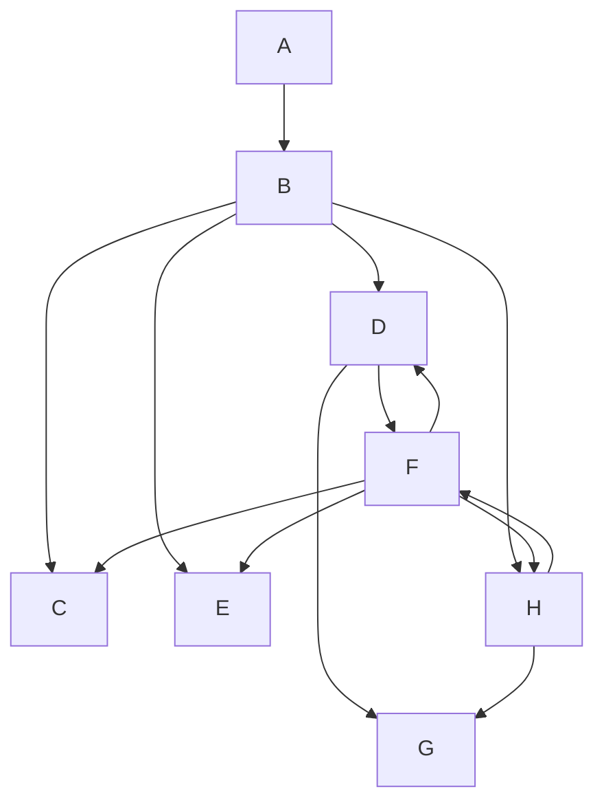

## 教辅资料站

电子教辅 试卷练习

知识总结 备课资源

扫码关注获取更多学习资料——

总主编 单 壤 熊 斌

## 奥数 教程

· 第六版 ·

九年级

葛军 编著

seal

二维码扫一扫
免费
750分钟
名师微视频

总主编 单 壤 熊 斌

# 奥数 教程

·第六版·

华东师范大学出版社

九年级

编 著 葛 军

视频讲解 上海市市北初级中学工作组

尤文奕 章炯毅

管君阳 徐捷

著名数学家、中国科学院院士、原中国数学奥林匹克委员会主席王元先生致青少年数学爱好者

## 致读者

《奥数教程》的出版已有十五个年头了. 在这个过程中, 包含了作者和编辑的辛勤劳作, 更多的是让我们感到欣慰: 这套书, 曾荣获了第十届全国教育图书展的优秀畅销书奖; 香港现代教育研究社出版了她的繁体字版和网络版, 成为香港的畅销图书之一, 并因此获得了版权输出奖; 据北京开卷图书市场研究所的监控销售数据, 近几年《奥数教程》的销量名列同类书前茅. 《奥数教程》在网络上非常畅销, 特别是一年级, 长期居当当网同类书的榜首, 评论数超 1.8 万条, 好评率超过 98%. 这些成绩的取得与作者们精到的创作, 广大读者的支持、呵护是分不开的.

为了使《奥数教程》更健康、更成熟地发展，为了使学生的学习生活更主动、更有效，不断提高图书的质量，我们差不多两三年修订一次，现在已经是第六版了。应广大读者的要求，方便读者自学，我们为本书配了“学习手册”和“能力测试”。把本书习题的详细解答放入“学习手册”，并加入竞赛热点精讲。全新的“能力测试”针对本书每讲，精选了一小时的习题量，帮助读者轻松巩固所学知识。

根据奥数题难度大的特点,我们特意请了奥赛名师,为《奥数教程》1—9年级中每一道例题精心录制了讲解视频,读者朋友可按照图书封底上提示的流程,利用手机或平板电脑扫描例题旁的二维码,即可免费观看.由于视频的录制、审核、上线、更新的工作量较大,在不耽误读者朋友们学习进度的情况下,视频将逐步上线,在2014年11月30日前全部上线.为了解决部分读者不方便用手机看视频,读者朋友可以到http://www.hdsdjf.com/download.aspx下载视频的压缩包,加“华师教辅ECNUP”微信平台(扫封底左下角的二维码或直接添加微信号chinastar01),回复“奥数密码”即可.

十年前，我们开展了“有奖订正”和“巧解共享”两项活动，得到了读者的支持与配合，不少读者纷纷来信、来电提出订正意见和更好的解法。比如，广州市戴炽文老师、漳州市江晗同学、南京市单川同学等提供了一些巧妙解法，经作者确认后，已收入第六版图书中，并署上姓名。这是对我们的鼓励，更是对我们的鞭策。我们计划继续开展下列活动，希望有更多的读者朋友乐于参与。

## 一、有奖订正

2014年8月到2016年8月期间，欢迎读者朋友对《奥数教程》（第六版，共12册），提出改正意见，我们将对“纠错能手”给予奖励.

## 二、巧解共享

欢迎读者朋友对《奥数教程》中例题与习题,提供更巧妙的解法.我们将选择有新意的、合适的解法在网上公布,以与其他读者朋友共享.读者朋友也可以把巧妙的解法录制成微视频,通过“华师教辅ECNUP”微信平台发送给我们,与大家分享与交流.凡被采用者,我们将署上提供者的姓名,并支付相应的稿酬.

我们衷心祝愿《奥数教程》永远成为您的好朋友.

华东师范大学出版社

## 前言

据说在很多国家,特别是美国,孩子们害怕数学,把数学作为“不受欢迎的学科”.但在中国,情况很不相同,很多少年儿童喜爱数学,数学成绩也都很好.的确,数学是中国人擅长的学科,如果在美国的中小学,你见到几个中国学生,那么全班数学的前几名就非他们莫属.

在数(shǔ)数(shù)阶段,中国儿童就显出优势.

中国人能用一只手表示1\~10，而很多国家非用两只手不可.

中国人早就有位数的概念,而且采用最方便的十进制(不少国家至今还有12进制,60进制的残余).

中国文字都是单音节,易于背诵,例如乘法表,学生很快就能掌握,再“傻”的人也都知道“不管三七二十一”.但外国人,一学乘法,头就大了.不信,请你用英语背一下乘法表,真是佶屈聱牙,难以成诵.

圆周率 $\pi=3.14159\cdots$ . 背到小数后五位, 中国人花一两分钟就够了. 可是俄国人为了背这几个数字, 专门写了一首诗, 第一句三个单词, 第二句一个……要背 $\pi$ 先背诗, 这在我们看来简直是自找麻烦, 可他们还作为记忆的妙法.

四则运算应用题及其算术解法,也是中国数学的一大特色.从很古的时候开始,中国人就编了很多应用题,或联系实际,或饶有兴趣,解法简洁优雅,机敏而又多种多样,有助于提高学生的学习兴趣,启迪学生智慧.例如:

“一百个和尚一百个馒头，大和尚一个人吃三个，小和尚三个人吃一个，问有几个大和尚，几个小和尚？”

外国人多半只会列方程解. 中国却有多种算术解法, 如将每个大和尚“变”成 9 个小和尚, 100 个馒头表明小和尚是 300 个, 多出 200 个和尚, 是由于每个大和尚变小和尚, 多变出 8 个, 从而 $200 \div 8 = 25$ 即是大和尚人数. 小和尚自然是 75 人, 或将一个大和尚与 3 个小和尚编成一组, 平均每人吃一个馒头. 恰好与总体的平均数相等. 所以大和尚与小和尚这样编组后不多不少, 即大和尚是 $100 \div (3 + 1) = 25$ 人.

中国人善于计算,尤其善于心算.古代还有人会用手指计算(所谓“掐指一算”).同时,中国很早就有计算的器械,如算筹、算盘.后者可以说是计算机的雏形.

在数学的入门阶段——算术的学习中,我国的优势显然,所以数学往往是我国聪明的孩子喜爱的学科.

几何推理,在我国古代并不发达(但关于几何图形的计算,我国有不少论著),比希腊人稍逊一筹.但是,中国人善于向别人学习.目前我国中学生的几何水平,在世界上遥遥领先.曾有一个外国教育代表团来到我国一个初中班,他们认为所教的几何内容太深,学生不可能接受,但听课之后,不得不承认这些内容中国的学生不但能够理解,而且掌握得很好.

我国数学教育成绩显著. 在国际数学竞赛中, 我国选手获得众多奖牌, 就是最有力的证明. 从 1986 年我国正式派队参加国际数学奥林匹克以来, 中国队已经获得了 14 次团体冠军, 可谓是成绩骄人. 当代著名数学家陈省身先生曾对此特别赞赏. 他说: “今年一件值得庆祝的事, 是中国在国际数学竞赛中获得第一……去年也是第一名.” (陈省身 1990 年 10 月在台湾成功大学的讲演“怎样把中国建为数学大国”)

陈省身先生还预言：“中国将在21世纪成为数学大国。”

成为数学大国,当然不是一件容易的事,不可能一蹴而就,它需要坚持不懈的努力.我们编写这套丛书,目的就是:(1)进一步普及数学知识,使数学为更多的青少年喜爱,帮助他们取得好的成绩;(2)使喜爱数学的同学得到更好的发展,通过这套丛书,学到更多的知识和方法.

“天下大事，必作于细。”我们希望，而且相信，这套丛书的出版，在使我国成为数学大国的努力中，能起到一点作用。本丛书初版于2000年，现根据课程改革的要求对各册再作不同程度的修订。

著名数学家、中国科学院院士、原中国数学奥林匹克委员会主席王元先生担任本丛书顾问，并为青少年数学爱好者题词，我们表示衷心的感谢。还要感谢华东师大出版社及倪明、孔令志先生，没有他们，这套丛书不会是现在这个样子。

单 增 熊 斌
2014年5月

text_image

微信公众号
教辅资料站

## 目录

第 1 讲 一元二次方程 / 1

第 2 讲 可化为一元二次方程的方程 / 6

第 3 讲 一元二次方程的判别式 / 12

第 4 讲 根与系数的关系及其应用 / 19

第 5 讲 二元二次方程组 / 27

第 6 讲 一元二次方程的整数根 / 35

第 7 讲 完全平方数 / 41

第 $\delta$ 讲 二次函数 / 47

第 9 讲 一元二次不等式 / 57

第10讲 一元二次方程根的分布 / 65

第11讲 二次函数的最大值与最小值 / 74

第12讲 简单分式函数的最值/82

第13讲 锐角三角函数 / 86

第14讲 解直角三角形 / 93

第15讲 圆的基本性质 / 101

第16讲 直线与圆 / 109

第17讲 两圆的位置关系 / 117

第18讲 圆幂定理 / 124

第19讲 四点共圆 / 131

第20讲 几何定值问题 / 138

第21讲 三角形的“五心”/145

第22讲 几何不等式 / 156

第23讲 不定方程 / 162

第24讲 反证法 / 170

第25讲 极端原理 / 177

第26讲 染色问题 / 183

第27讲 概率 / 188

参考答案 / 193

(详细解答见《奥数教程学习手册》)

## 第1讲 一元二次方程

一元二次方程的一般形式是

$$
a x ^ {2} + b x + c = 0 (a \neq 0),
$$

它的简单形式是

$$
A x ^ {2} = B (A \neq 0).
$$

如果上述一元二次方程的根为 $x_{0}$ ，那么

$$
a x _ {0} ^ {2} + b x _ {0} + c = 0. \tag {*} \tag {※}
$$

反之亦然.

利用式 $(*)$ ，我们可以容易地得到a、b、c与 $x_{0}$ 之间的关系.

一元二次方程 $ax^{2}+bx+c=0(a\neq0)$ 的求根公式是

$$
x _ {1, 2} = \frac {- b \pm \sqrt {b ^ {2} - 4 a c}}{2 a}.
$$

【例 1】 观察下列等式：

$$
2 2 5 = 1 5 ^ {2}
$$

$$
6 2 5 = 2 5 ^ {2}
$$

$$
1 2 2 5 = 3 5 ^ {2}
$$

$$
2 0 2 5 = 4 5 ^ {2}
$$

......

若 21 025 = x²，试根据上述各式的规律求出 x 的值.

解 由题设令 $x = 10n + 5, n > 0$ ，则有

$$
2 1 0 2 5 = (1 0 n + 5) ^ {2} \text {, 得} n ^ {2} + n - 2 1 0 = 0,
$$

即

$$
(n + 1 5) (n - 1 4) = 0,
$$

解之得 n = 14，或 n = -15（舍去）.

故所求 x = 145.

【例 2】已知 b、c 为方程 $x^{2}+bx+c=0$ 的两个根，且 $c \neq 0$ ， $b \neq c$ ，求 b、c.

分析 将 b、c 分别代入方程, 得两个恒等式, 继之, 考虑加或减, 对恒等式进行综合化简, 这是恒等变形的基本方法. 本题中, 观察两个等式特点,尝试减法运算,达到简化的目的.

解 因为 b、c 是方程 $x^{2}+bx+c=0$ 的两个根, 所以

$$
\left\{ \begin{array}{l l} b ^ {2} + b ^ {2} + c = 0, & ① \\ c ^ {2} + b c + c = 0. & ② \end{array} \right.
$$

由①-②得 $(b-c)\left[(b+c)+b\right]=0.$

由 $b-c \neq 0$ 及上式得

$$
c + 2 b = 0. \tag {③}
$$

又 $c \neq 0$ ，式②化为 $c + b + 1 = 0.$ ④

联立③、④，解得
b = 1, c = -2.

思考 你还可以有其他解法吗?

【例 3】已知三个关于 x 的一元二次方程

$$
a x ^ {2} + b x + c = 0, b x ^ {2} + c x + a = 0, c x ^ {2} + a x + b = 0
$$

恰有一个公共实数根,求 $\frac{a^{2}}{bc}+\frac{b^{2}}{ca}+\frac{c^{2}}{ab}$ 的值.

分析 参照例 2, 考虑对三个等式做加法, 以简化问题.

解 设 $x_{0}$ 是它们的公共实数根, 则

$$
a x _ {0} ^ {2} + b x _ {0} + c = 0, b x _ {0} ^ {2} + c x _ {0} + a = 0, c x _ {0} ^ {2} + a x _ {0} + b = 0.
$$

把上面三个式子相加,整理得

$$
(a + b + c) (x _ {0} ^ {2} + x _ {0} + 1) = 0.
$$

因为 $x_{0}^{2}+x_{0}+1=\left(x_{0}+\frac{1}{2}\right)^{2}+\frac{3}{4}>0$ ，所以 $a+b+c=0$

于是 $\frac{a^{2}}{bc}+\frac{b^{2}}{ca}+\frac{c^{2}}{ab}=\frac{a^{3}+b^{3}+c^{3}}{abc}=\frac{a^{3}+b^{3}-(a+b)^{3}}{abc}$

$$
= \frac {- 3 a b (a + b)}{a b c} = 3.
$$

说明 $x^{2} + x + 1, x^{2} - x + 1$ 这两个代数式的值总是大于0的.这一基本事实经常用到.

【例 4】已知 m、n 是有理数，方程 $x^{2} + mx + n = 0$ 有一个根是 $\sqrt{5} - 2$ ，求 $m + n$ 的值.

解 由题设得

$$
(\sqrt {5} - 2) ^ {2} + m (\sqrt {5} - 2) + n = 0,
$$

即

$$
(9 - 2 m + n) + (m - 4) \sqrt {5} = 0.
$$

因为 m、n 是有理数，而 $\sqrt{5}$ 是无理数，所以必有

$$
\left\{ \begin{array}{l} 9 - 2 m + n = 0, \\ m - 4 = 0, \end{array} \right.
$$

解得

$$
\left\{ \begin{array}{l} m = 4, \\ n = - 1, \end{array} \right.
$$

于是

$$
m + n = 3.
$$

思考 你能证明 $\sqrt{5}$ 是无理数吗？

【例 5】已知关于 x 的方程 $(a-1)x^{2}-4x-1+2a=0$ 的一个根为 x=3.

(1) 求 a 的值及方程的另一根；

（2）如果一个三角形的三条边长都是这个方程的根，求这个三角形的周长.

解 （1）由题设得 $9(a-1)-4\times3-1+2a=0$ ，解得 a=2.

所以原方程为 $x^{2}-4x+3=0$ ，解得它的另一根是 1.

(2) 由题设知三角形中至少有两条边相等, 则有下列两种情形:

① 三边相等，边长为 1、1、1 或 3、3、3。那么三角形的周长是 3 或 9。

② 仅有两边相等, 因为 $1+1<3$ , 所以三角形的边长只能是 3、3、1. 那么三角形的周长是 7.

综合①、②可知,三角形的周长可以是3或7或9.

【例 6】设 $x_{1}$ 、 $x_{2}$ 是方程 $x^{2} + x - 3 = 0$ 的两个根，求 $x_{1}^{3} - 4x_{2}^{2} + 19$ 的值.

解 由题设得

$$
x _ {1} ^ {2} = 3 - x _ {1}, x _ {2} ^ {2} = 3 - x _ {2}.
$$

于是

$$
\begin{array}{l} x _ {1} ^ {3} - 4 x _ {2} ^ {2} + 1 9 = x _ {1} \left(3 - x _ {1}\right) - 4 \left(3 - x _ {2}\right) + 1 9 \\ = 3 x _ {1} - (3 - x _ {1}) + 4 x _ {2} + 7 \\ = 4 (x _ {1} + x _ {2}) + 4. \\ \end{array}
$$

由求根公式知方程 $x^{2} + x - 3 = 0$ 的两个根分别为 $\frac{-1 + \sqrt{13}}{2}$ ， $\frac{-1 - \sqrt{13}}{2}$ ，所以 $x_{1} + x_{2} = -1$ ，从而

$$
x _ {1} ^ {3} - 4 x _ {2} ^ {2} + 1 9 = 0.
$$

说明 计算 $x_{1} + x_{2}$ 可用两式 $x_{1}^{2} = 3 - x_{1}, x_{2}^{2} = 3 - x_{2}$ 相减后因式分解求得，还可直接用第4讲中根与系数的关系（即韦达定理）得到.利用方程的根所满足的等式，去处理一些代数式的计算，可以起到“降次”作用，从而简化计算过程.

【例 7】已知 $x=\frac{1}{1+\sqrt{2}}$ ，求 $\sqrt{x^{3}+2x^{2}-x+8}$ 的值.

解 由题设得 $x = \sqrt{2} - 1,$

即 $x+1=\sqrt{2}$ ,

于是 $(x+1)^{2}=(\sqrt{2})^{2}$

即 $x^{2}+2x-1=0.$

所以 $\sqrt{x^{3}+2x^{2}-x+8}=\sqrt{x(x^{2}+2x-1)+8}=2\sqrt{2}.$

## 读一读

## 学会尝试

面对一道数学题,应当满怀信心,应当努力尝试一下.

英国女诗人罗赛蒂(C. Rossetti, 1830—1894)一首小诗“我想试试”(I'll Try)值得一读：

那个说“我想试试”的小孩，

他将登上山巅.

那个说“我不成”的小孩，

在山下停步不前.

“我想试试”每天办成很多事，

“我不成”就真一事无成.

因此你务必说“我想试试”，

将“我不成”弃埃尘.

其英文如下：

The little boy who says “I’ll try”,
Will climb to the hill-top.
The little boy who says “I can’t”,
Will at the bottom stop.
“I’ll try” does great things every day,
“I can’t” gets nothing done.
Be sure then that you say “I’ll try”,
And let “I can’t” alone.

(节选自:单樽.解题研究.上海:上海教育出版社,2007,2\~3和210.)

## 练习题

① 设 b、c 是整数，当 x 依次取 1、3、6、11 时，小明算得多项式 $x^{2} + bx + c$ 的值分别为 3、5、21、93。经验证，只有一个结果是错误的。这个错误的结果是（）。

(A) 当 x = 1 时， $x^{2} + bx + c = 3$

(B) 当 x = 3 时， $x^{2} + bx + c = 5$

(C) 当 x = 6 时， $x^{2} + bx + c = 21$

(D) 当 x = 11 时， $x^{2} + bx + c = 93$

② 解方程： $(2x+1)(x+1)=(3x-1)(x+1)$ .

③ 解方程 $x^{2}-|x|-1=0.$

④ 设 k 是实数, 关于 x 的一元二次方程 $x^{2}-3kx+k^{2}+k=0$ 的一个解是 1, 求 k 的值.

⑤ 设 b 是实数, 已知方程 $x^{2} + bx + 1 = 0$ 与方程 $x^{2} - x - b = 0$ 有一个公共实根, 求 b 的值.

⑥ 设 a、b 是整数, 方程 $x^{2} + ax + b = 0$ 的一根是 $\sqrt{4 - 2\sqrt{3}}$ , 求 $a + b$ 的值.

⑦ 已知实数 a 是方程 $x^{2}-5x+1=0$ 的一个根，求 $a^{4}+a^{-4}$ 的个位数字.

8 设 c 是实数, 已知 $x^{2}-3x+c=0$ 的一个解的相反数是方程 $x^{2}+3x-c=0$ 的一个解, 求方程 $x^{2}-3x+c=0$ 的解.

⑨ 已知 $x=\frac{4-\sqrt{7}}{3}$ ，求 $\frac{x^{4}+x^{2}+1}{x^{2}}$ 的值.

10 设 m、n 是实数，满足 $m^{2}=m+1,\ n^{2}=n+1,\ m\neq n$ ，求 $m^{5}+n^{5}$ 的值.

## 第2讲 可化为一元二次方程的方程

在中学里,对于次数超过2的整式方程(称为高次方程),通常运用因式分解法或换元法,把它转化为一元二次方程或一元一次方程去求解.

【例 1】 解方程: $(x-1)(x^{2}+3x+2)=0$ .

解 原方程化为

$$
x - 1 = 0 \text {或} x ^ {2} + 3 x + 2 = 0.
$$

由
x-1=0,

得 $x_{1}=1.$

由 $x^{2}+3x+2=0,$

得 $x_{2}=-1$ 或 $x_{3}=-2$ .

经检验知原方程的解为

$$
x _ {1} = 1, x _ {2} = - 1, x _ {3} = - 2.
$$

【例 2】 设实数 $x=\sqrt[3]{20+14\sqrt{2}}+\sqrt[3]{20-14\sqrt{2}}$ ，求 $x^{2013}$ 的末位数字.

解 由题设知 $x^{3}=\left(\sqrt[3]{20+14\sqrt{2}}+\sqrt[3]{20-14\sqrt{2}}\right)^{3}$ ,

得 $x^{3}=40+3x(\sqrt[3]{20+14\sqrt{2}}\cdot\sqrt[3]{20-14\sqrt{2}})$

即 $x^{3}-6x-40=0.$

观察上面方程特点, 可知 x 的取值一定大于 0, 且 $x^{3}$ 至少大于 40, 最接近的是 x = 4, 代入满足等式, 这说明方程 $x^{3} - 6x - 40 = 0$ 有一个根为 4, 即式子 $x^{3} - 6x - 40$ 有一个因式 x - 4. 于是将 $x^{3} - 6x - 40$ 进行分解因式

得 $(x-4)(x^{2}+4x+10)$ ，从而有

$$
(x - 4) (x ^ {2} + 4 x + 1 0) = 0.
$$

而 $x^{2}+4x+10=(x^{2}+4x+4)+6=(x+2)^{2}+6>0,$

所以 x = 4.

又 $4^{2013} = (16)^{1006} \times 4$ ，其末位数字是 4.

故所求的 $x^{2013}$ 的末位数字是 4.

说明 关于形如 $ax^{3}+bx^{2}+cx+d=0(a、b、c、d$ 为整数) 的方程若有有理根, 则其根或是整数 $d$ 的约数 (含负整数), 或是 $d$ 的约数与 $a$ 的约数 (不等于 1) 之商. 如方程 $x^{3} - 6x - 40 = 0$ 若有有理根, 则其根是 40 的约数, 则可尝试将 $x = -1, 1, 2, -2, -5, 5, 4, -4, -8, 8, 10, -10, 20, -20, 40, -40$ 代入得有理根, 这里需要运用观察法审视等式 $x^{3} - 6x - 40 = 0$ 的取值特点.

【例 3】 解方程： $\left|x\right|-\frac{4}{x}=\frac{3\left|x\right|}{x}.$

分析 去绝对值,得分式方程,之后,化为一元二次方程.

解 由题设得 $x \neq 0$ .

当 x > 0 时, 原方程化为

$$
x - \frac {4}{x} = 3,
$$

即 $x^{2}-3x-4=0,$

解得 x = 4 或 x = -1 (舍去).

当 x < 0 时, 原方程化为

$$
- x - \frac {4}{x} = - 3,
$$

即 $x^{2}-3x+4=0.$

又 $x^{2}-3x+\frac{9}{4}+\frac{7}{4}=\left(x-\frac{3}{2}\right)^{2}+\frac{7}{4}>0,$

从而方程 $x^{2}-3x+4=0$ 无实数解.

故原方程的解为 x = 4.

【例 4】 解方程: $\frac{1}{x^{2}+x-2}+\frac{1}{x^{2}+7x+10}=2.$

解 原方程化为

$$
\begin{array}{l} \frac {1}{(x + 2) (x - 1)} + \frac {1}{(x + 2) (x + 5)} = 2, \\ \frac {1}{3} \left[ \frac {1}{x - 1} - \frac {1}{x + 2} \right] + \frac {1}{3} \left[ \frac {1}{x + 2} - \frac {1}{x + 5} \right] = 2, \\ \end{array}
$$

即 $\frac{1}{x-1}-\frac{1}{x+5}=6.$

整理得 $x^{2}+4x-6=0,$

解得 $x = -2 \pm \sqrt{10}.$

经检验,原方程的解为 $x_{1}=-2+\sqrt{10}$ , $x_{2}=-2-\sqrt{10}$ .

说明 对于无理方程,其求解的基本思想是把它转化为有理方程.常用的方法是:配方法、换元法、因式分解法.

【例 5】 解方程：

$$
2 x ^ {2} - 1 5 x - \sqrt {2 x ^ {2} - 1 5 x + 1 9 9 8} = - 1 8.
$$

解 由题设得 $2x^{2}-15x+1998\geqslant0.$ ①

令 $y = \sqrt{2x^{2} - 15x + 1998}$ ，则 $y \geqslant 0$ ，且原方程化为

$$
y ^ {2} - y - 1 9 8 0 = 0.
$$

解得 y = 45 或 y = -44.

又 $y \geqslant 0$ ，所以 y = -44 舍去。于是

$$
\sqrt {2 x ^ {2} - 1 5 x + 1 9 9 8} = 4 5,
$$

得 $2x^{2}-15x-27=0.$

解得 x = 9 或 $x = -\frac{3}{2}$ .

由 x = 9 和 $x = -\frac{3}{2}$ 都满足式①，可知原方程的解为 $x_{1} = 9, x_{2} = -\frac{3}{2}$ .

【例6】设 k 为实数, 若关于 x 的方程 $x^{2}-2x=k \mid x \mid$ 恰有三个不同的实数解, 求 k 的取值范围.

解 显然 x = 0 是方程 $x^{2} - 2x = k \mid x \mid$ 的一个解.

若当 x<0 时方程 $x^{2}-2x=k\mid x$ 有解，则 $x^{2}-2x=-kx$ ，得 $x=-k+2$ .

由 $-k+2<0$ ，得k>2.

若当 x > 0 时方程 $x^{2} - 2x = k \mid x \mid$ 有解，则 $x^{2} - 2x = kx$ ，得 $x = k + 2$ .

由 $k+2>0$ ，得 k>-2.

综上所述,所求的实数 k 的取值范围是 k > 2.

【例 7】已知 a、b 都是负实数，且 $\frac{1}{a} + \frac{1}{b} - \frac{1}{a - b} = 0$ ，求 $\frac{b}{a}$ 的值.

解 由 $\frac{1}{a}+\frac{1}{b}-\frac{1}{a-b}=0$ 得

$$
a ^ {2} - b ^ {2} - a b = 0,
$$

即

$$
\left(\frac {b}{a}\right) ^ {2} + \frac {b}{a} - 1 = 0.
$$

因为 a、b 都是负实数，所以 $\frac{b}{a}$ 可看成是方程

$$
x ^ {2} + x - 1 = 0
$$

的一个正根.

解此方程得 $x=\frac{-1-\sqrt{5}}{2}$ 或 $x=\frac{-1+\sqrt{5}}{2}$ .

因此 $\frac{b}{a}=\frac{-1+\sqrt{5}}{2}.$

思考 是否存在实数 a、b，满足 $\frac{1}{a}+\frac{1}{b}-\frac{1}{a+b}=0?$

进一步地,是否存在实数a、b、c,满足

$$
\frac {1}{a} + \frac {1}{b} + \frac {1}{c} = \frac {1}{a + b + c} \text {呢？}
$$

【例 8】已知互不相等的实数 a、b、c 满足 $a + \frac{1}{b} = b + \frac{1}{c} = c + \frac{1}{a} = t$ ，求 t 的值.

解 由 $a+\frac{1}{b}=t$ 得 $b=\frac{1}{t-a}$ ，代入 $b+\frac{1}{c}=t$ ，得

$$
\frac {1}{t - a} + \frac {1}{c} = t,
$$

整理得 $ct^{2}-(ac+1)t+(a-c)=0.$

又由 $c+\frac{1}{a}=t$ 得 $ac+1=at$ ，代入上式

得 $ct^{2}-at^{2}+(a-c)=0,$

即 $(c-a)(t^{2}-1)=0.$

又 $c \neq a$ ，所以 $t^{2}-1=0$ ，得 $t=\pm1$ 。

验证 $b=\frac{1}{1-a}$ ， $c=\frac{a-1}{a}$ 时 t=1； $b=-\frac{1}{1+a}$ ， $c=-\frac{a+1}{a}$ 时 t=-1.

故 $t = \pm 1$ .

思考 在例 8 的条件下, 求 abc 的值. 进一步地, 还可参见第 5 讲例 8.

【例 9】如图 2-1, 在 Rt△ABC 中, 斜边 AB 的长为 35, 正方形 CDEF 内接于△ABC, 且其边长为 12, 求△ABC 的周长.

解 如图, 设 BC = a, AC = b, 则

$$
a ^ {2} + b ^ {2} = 3 5 ^ {2} = 1 2 2 5. \tag {①}
$$

text_image

A
F
E
C
D
B

图2-1

又 Rt△AFE ∽ Rt△ACB，所以 $\frac{FE}{CB}=\frac{AF}{AC}$ ，即 $\frac{12}{a}=\frac{b-12}{b}$ ，得

$$
1 2 (a + b) = a b. \tag {②}
$$

由①、②得

$$
(a + b) ^ {2} = a ^ {2} + b ^ {2} + 2 a b = 1 2 2 5 + 2 4 (a + b),
$$

即 $(a+b)^{2}-24(a+b)-1225=0.$

解得 $a+b=49$ 或 $a+b=-25$ (舍去)，所以

$$
a + b + c = 4 9 + 3 5 = 8 4.
$$

## 读一读

## 早期的数学竞赛——围绕方程解法的争论

16 世纪的意大利,很风行类似本书故事中的“解方程竞赛”.这种竞赛奖金丰富,靠着这种奖金过生活的数学家大有人在.竞赛中所出的题目全都是解三次方程、四次方程.参加比赛的每个人都身怀秘技,相互竞争.

$x^{3}+ax=b$ 这种形式的三次方程式是波洛尼亚的数学家西比昂·费罗
(1465—1526)所发明,然后由他的学生弗洛里斯承传下去.

意大利还有一位绰号塔尔塔里亚的数学家,本名尼哥罗·丰塔纳(1499—1557).这个绰号是“口吃”之意.据说,他小时候曾被法军殴击脸部,产生了后遗症,遂不能自由说话,才有了这个绰号.丰塔纳家境贫苦,只能自习数学.在努力之下,他跟费罗一样,发现了 $x^{3}+ax=b$ 这种形式的三次方程的解法.

对这个解法颇有自信的丰塔纳向弗洛里斯下战帖,进行解方程竞赛.他赢了弗洛里斯.

因这次竞赛的激励,丰塔纳不断反复研究,终于在1541年发现了三次方程的一般解法.

另一方面，意大利米拉诺地方有一位叫卡尔达诺(1501—1576)的数学家热切希望在解方程竞赛中取胜。为达目的，他必须知道三次方程式的一般解法。因此，他拜访了丰塔纳，应允“绝对守住秘密”，终于习得一般解法。

之后，卡尔达诺在帕多瓦大学任职教授。在他1545年出版的《大衍术》一书中，把丰塔纳教他的三次方程解法当作自己的发明发表出来。

这种行径激怒了丰塔纳，立刻向他下了战帖。不过，卡尔达诺并未上场比试，而由他的学生费拉里(1522—1565)代为出席。

费拉里极具数学天分. 年轻时, 他就已发现四次方程式的一般解法. 因此, 这次的数学比赛最终由费拉里获胜.

数学史上,三次方程解法的发现人,大多记载为卡尔达诺,而四次方程解法的发现人则记载为费拉里.

如上所述，针对三次方程、四次方程的解法，数学家们曾经为它们如火如荼地竞争过哪！

（选自：江滕邦彦.铃德拉公主数学之恋——二次方程式.台北：益智工房，2002,90\~91.）

## 练习题

① 解方程： $(x-2)(x^{2}-3x-4)=0.$

② 解方程： $x^{2}-|2x-1|-2=0.$

③ 解方程： $\frac{x+1}{x+2}+\frac{x+8}{x+9}=\frac{x+2}{x+3}+\frac{x+7}{x+8}.$

4 解方程： $x^{2}+\frac{1}{x^{2}}-\frac{7}{2}\left(x-\frac{1}{x}\right)+1=0.$

⑤ 解方程： $2\left(x^{2}+\frac{1}{x^{2}}\right)-3\left(x+\frac{1}{x}\right)=1.$

6 解方程： $\left(\frac{x^{2}-1}{x}\right)^{2}-\frac{7}{6}\left(\frac{x^{2}-1}{x}\right)-4=0.$

⑦ 解关于 x 的方程: $\frac{a+x}{b+x}+\frac{b+x}{a+x}=\frac{5}{2}$ .

⑧ 解方程： $\sqrt{x+8}-\sqrt{5x+20}+2=0.$

⑨ 解方程: $x^{2}+x+2x\sqrt{x+2}=14.$

10 解方程: $x^{2}+18x+30=2\sqrt{x^{2}+18x+45}$

⑪ 解方程： $4x^{2}+2x\sqrt{3x^{2}+x}+x-9=0.$

12 解方程: $x^{3} + 2x^{2} - 5x + 2 = 0.$

## 第3讲 一元二次方程的判别式

我们已经知道一元二次方程 $ax^{2}+bx+c=0(a\neq0)$ 可以通过配方转化为

$$
a \left(x + \frac {b}{2 a}\right) ^ {2} = \frac {b ^ {2} - 4 a c}{4 a},
$$

即

$$
\left(x + \frac {b}{2 a}\right) ^ {2} = \frac {b ^ {2} - 4 a c}{4 a ^ {2}}.
$$

根据平方根的定义, 当 $b^{2}-4ac \geqslant 0$ 时, 方程才有实数解; 当 $b^{2}-4ac < 0$ 时, 方程无实数解. 人们把 $b^{2}-4ac$ 称为一元二次方程的判别式, 记为 $\Delta$ .

当 $\Delta = b^{2} - 4ac = 0$ 时， $\left(x + \frac{b}{2a}\right)^{2} = 0$ ，那么方程有两个相同的实根（称为重根）；当 $\Delta = b^{2} - 4ac > 0$ 时，方程有两个不同的实根，分别为 $x_{1} = \frac{-b + \sqrt{\Delta}}{2a}$ ， $x_{2} = \frac{-b - \sqrt{\Delta}}{2a}$ .

由此可知， $\Delta$ 的正负性关联着方程有无实根.

【例 1】设 k 为实数, 试判断方程 $(k-1)x^{2}+3kx+k+1=0$ 有无实数根?

证明 由题设当 k=1 时, 原方程化为 $3x+2=0$ , 得 $x=-\frac{2}{3}$ 是方程的根.

当 $k \neq 1$ 时，由题中方程，有

$$
\Delta = (3 k) ^ {2} - 4 (k - 1) (k + 1) = 5 k ^ {2} + 4.
$$

由 $5k^{2} \geqslant 0$ ，得 $5k^{2} + 4 > 0$ ，即 $\Delta > 0$ ，所以方程有两个不相等的实数根.

故 k = 1 时方程仅有一个实数根； $k \neq 1$ 时方程有两个不相等的实数根.

说明 只有一元二次方程,才可用判别式 $\Delta$ .

【例 2】已知 a、b、c 为三角形的三边,试判别方程 $b^{2}x^{2}+(b^{2}+c^{2}-a^{2})x+c^{2}=0$ 有无实根?

解 因为方程 $b^{2}x^{2} + (b^{2} + c^{2} - a^{2})x + c^{2} = 0$ 的判别式为

$$
\Delta = (b ^ {2} + c ^ {2} - a ^ {2}) ^ {2} - 4 b ^ {2} c ^ {2},
$$

因式分解得

$$
\begin{array}{l} \Delta = (b ^ {2} + c ^ {2} - a ^ {2} - 2 b c) (b ^ {2} + c ^ {2} - a ^ {2} + 2 b c) \\ = \left[ (b - c) ^ {2} - a ^ {2} \right] \left[ (b + c) ^ {2} - a ^ {2} \right] \\ = (b - c - a) (b - c + a) (b + c - a) (b + c + a), \\ \end{array}
$$

而 $b+c>a,\ a+b>c,\ c+a>b,$

所以

$$
b - c - a <   0, b - c + a > 0, b + c - a > 0.
$$

于是

$$
\Delta <   0,
$$

从而知方程无实根.

【例 3】 当 a 在什么范围内取值时, 方程 $\left|x^{2}-5x\right|=a$ 有且只有两个相异实数根?

解 由题设知 $a \geqslant 0$ .

当 a=0 时， $\left|x^{2}-5x\right|=0$ ，得 $x_{1}=0, x_{2}=5$ 。符合题意。

当a>0时，原方程化为

$$
x ^ {2} - 5 x - a = 0, \tag {①}
$$

和 $x^{2}-5x+a=0.$ ②

在方程①中,因它的判别式为 $25 + 4a > 0$ , 所以方程①有两个不同的实根. 因此,由题设知,方程②要么无实数解,要么它的解与方程①的解相同.

显然,若方程①、②有相同的解,则只有a=0.而a>0,所以,方程②必无实数解,从而此方程的判别式25-4a<0,即 $a>\frac{25}{4}$ .

故 a 的取值范围是 a = 0 或 $a > \frac{25}{4}$ .

【例4】对于实数 $u$ 、 $v$ , 定义一种运算“ $*$ ”为: $u * v = uv + v$ . 若关于 $x$ 的方程 $x * (a * x) = -\frac{1}{4}$ 有两个不同的实数根, 求满足条件的实数 $a$ 的取值范围.

解 由题中运算“\*”定义, 可知 $a * x = ax + x$ , $x * (a * x) = x(ax + x) + (ax + x)$ , 所以由 $x * (a * x) = -\frac{1}{4}$ 得

$$
(a + 1) x ^ {2} + (a + 1) x + \frac {1}{4} = 0.
$$

依题设有 $\left\{\begin{aligned}a+1\neq0,\\ \Delta=(a+1)^{2}-(a+1)>0,\end{aligned}\right.$

解得 a > 0 或 a < -1.

【例 5】求方程 $x + y = x^{2} - xy + y^{2} + 1$ 的实数解.

解 将方程 $x + y = x^{2} - xy + y^{2} + 1$ 看作关于 x 的一元二次方程

$$
x ^ {2} - (y + 1) x + (y ^ {2} - y + 1) = 0.
$$

要使得此方程有实数解 x，则必有

$$
\begin{array}{l} \Delta = (y + 1) ^ {2} - 4 (y ^ {2} - y + 1) \\ = - 3 (y - 1) ^ {2} \geqslant 0. \\ \end{array}
$$

又因为 $-3(y-1)^{2}\leqslant0,$

所以 y-1=0，即 y=1.

把 y = 1 代入原方程得

$$
x ^ {2} - 2 x + 1 = 0,
$$

即
x = 1.

经检验 x = 1, y = 1 满足题中方程.

故方程的实数解为 x = 1, y = 1.

说明 在求解二元二次(或含字母系数)方程时,其基本思路之一,就是根据方程解的实数性,运用判别式分离变元而逐一讨论,求得结果.当然,我们也可以利用配方法求得结果.即将例5中方程化为

$$
2 x + 2 y = 2 x ^ {2} - 2 x y + 2 y ^ {2} + 2,
$$

即 $(x-1)^{2}+(y-1)^{2}+(x-y)^{2}=0.$

则有 x = 1, y = 1 符合要求.

由此可见，配方法也是处理这类问题的基本思路之一。

我们知道由方程 $ax^{2}+bx+c=0(a\neq0)$ ，就会想到判别式 $\Delta$ 。反之，当遇到 $\Delta=b^{2}-4ac$ 的形式，联想到相应的一元二次方程，常能简捷地解决一些问题。

【例 6】已知 $(x-z)^{2}-4(x-y)(y-z)=0$ ，试求 $x+z$ 与 y 的关系.

分析 看到 “ $(x-z)^{2}-4(x-y)(y-z)=0$ ”，想到 “ $b^{2}-4ac=0$ ”，努力化为一元二次方程有等根的问题解决.

解 当 $x - y \neq 0$ 即 $x \neq y$ 时, 作方程

$$
(x - y) t ^ {2} - (x - z) t + (y - z) = 0.
$$

因为

$$
\Delta = (x - z) ^ {2} - 4 (x - y) (y - z) = 0,
$$

所以上述方程有两个相等的实根.

又 $(x-y)-(x-z)+(y-z)=0,$

则这个方程的实根为 $t_{1}=t_{2}=1$ 。于是

$$
(x - y) t ^ {2} - (x - z) t + (y - z) = (x - y) \cdot (t ^ {2} - 2 t + 1),
$$

从而 $x-z=2(x-y)$ ，y-z=x-y，

即 $x+z=2y.$

当x-y=0即x=y时，由题中等式得x-z=0，即x=z，也有 $x+z=2y$ .

故 $x+z=2y.$

说明 上面给出了例 6 一种解题思路, 它是由形似 $b^{2}-4ac$ 而联想到用一元二次方程来解决. 其实, 我们也可以利用恒等变形来求得结果.

由 $(x-z)^{2}-4(x-y)(y-z)=0,$

得 $x^{2}+2xz+z^{2}-4xy-4yz+4y^{2}=0,$

即 $(x+z)^{2}-4y(x+z)+4y^{2}=0,$

得 $\left[(x+z)-2y\right]^{2}=0,$

即 $x+z=2y.$

从这里看出,运用恒等变形来解决此题反而简捷.本讲介绍例6通过构造一元二次方程的解法仅仅是为了拓展读者的思路,并非鼓励读者解题时“舍近求远”.对于自然而简单的解法,我们应该大力推崇.

【例 7】已知 $a < 0, b \leqslant 0, c > 0$ ，且

$$
\sqrt {b ^ {2} - 4 a c} = b - 2 a c,
$$

求 $b^{2}-4ac$ 的最小值.

解 由题设知

$$
\frac {- b + \sqrt {b ^ {2} - 4 a c}}{2 a c} = - 1 (a c \neq 0),
$$

则方程

$$
a c x ^ {2} + b x + 1 = 0
$$

有实根 x = -1，于是有 ac = b - 1.

由于 $b^{2}-4ac=(2acx+b)^{2}$ ，所以把x=-1，ac=b-1代入，

得 $b^{2}-4ac=\left[2(b-1)(-1)+b\right]^{2}$

$$
= (2 - b) ^ {2}.
$$

又 $b \leqslant 0$ ，则 $2 - b \geqslant 2$ ，从而 $b^{2} - 4ac \geqslant 4$ .

当 b=0 时，ac=-1， $b^{2}-4ac$ 取得最小值 4.

说明 此题还可以运用第 4 讲的知识来解决.

## 读一读

## 你的解法未必就是简单自然的

上帝有一本好书，好的解法全在那本书上。

—P. Erdős(1913—1996)

关于例 6, 联想到利用一元二次方程来处理此问题. 这是一个解法. 但是否是一个简单自然的解法呢?

可以说这不是一个简单自然的解法.

因为如果我们注意到

$$
x - z = (x - y) + (y - z),
$$

且分别令 x-y=a, y-z=b, 则

$$
(a + b) ^ {2} = 4 a b,
$$

即 $(a-b)^{2}=0,$

得
a = b,

从而

$$
x - y = y - z,
$$

即

$$
x + z = 2 y.
$$

我们在寻求解决问题的过程中,应力求对各种解法进行比较,追求简单自然的解法.

尝试用多种解法处理下列问题,并感悟哪种解法是简单自然的.

设 a、b、c 都是实数，求证： $(b-c)^{2}\geqslant(a-2b)(2c-a)$ .

(选编自:单樽.解题研究.上海:上海教育出版社,2007,183\~184.)

## 练习题

① 方程 $9x^{2}-(k+6)x+k+1=0$ 有两个相等实数根, 求 k 的值.  
② 若关于 x 的方程 $ax^{2} + x + 2 = 0$ 无实根, 求 a 的取值范围.  
③ k 取什么值时, 方程 $kx^{2}-(2k+1)x+k=0$ :

(1) 有两个不相等的实数根；

(2) 有相等的实数根；

(3) 无实数根?

④ 设 n 为实数, 已知方程 $x^{2} + 2x = n - 1$ 没有实数根, 求证: 方程 $x^{2} + nx = 1 - 2n$ 一定有两个不相等实数根.  
⑤ 设 m 为实数, 已知方程 $(m+2)x^{2}-4mx+m=0(m\neq-2)$ 有两个相等的实根, 求此方程的根.  
⑥ 设 a 为实数, 已知关于 x 的方程 $(a^{2}-1)x^{2}-2(a+1)x+1=0$ 恰有一个实根, 求 a 的值.  
⑦ 设 k 为实数, 已知方程 $2x(kx-4)-x^{2}+6=0$ 无实数根, 求 k 的取值范围.  
⑧ 设 a 为实数, 已知关于 x 的方程

$$
x ^ {2} - 2 \sqrt {- a} x + \frac {(a - 1) ^ {2}}{4} = 0
$$

有实数根 $x_{0}$ ，求 $a^{2013}-x_{0}^{2013}$ 的值.

⑨ 实数 m 为何值时, 方程

$$
2 (m + 1) x ^ {2} + 2 \sqrt {6} m x + 3 m - 2 = 0
$$

有两个不相等的实数根.

10 设 a、b 为实数,试判别方程 $(x-a)(x-a-b)=1$ 的实根个数.  
⑪ 设 a、b、c 为互不相等的实数, 求证: 二次方程 $ax^{2} + 2bx + c = 0$ ,

$bx^{2}+2cx+a=0,\ cx^{2}+2ax+b=0$ 不可能同时都有两个相等的实根.

12 求关于 x、y 的方程

$$
5 x ^ {2} - 3 x y + \frac {1}{2} y ^ {2} - 2 x + \frac {1}{2} y + \frac {1}{4} = 0
$$

的实数解.

⑬ 设 a 为实数, 求能使关于 x 的方程

$$
\frac {x + 1}{x - 1} + \frac {x - 1}{x + 1} + \frac {2 x + a + 2}{x ^ {2} - 1} = 0
$$

只有一个实根的所有 a 的值的和.

14 设 a 为实数, 若关于 x 的方程 $x^{2} + 2ax + 7a - 10 = 0$ 没有实根, 则必有实根的方程是().

(A) $x^{2}+2ax+3a-2=0$  
(B) $x^{2}+2ax+5a-6=0$  
(C) $x^{2}+2ax+10a-21=0$  
(D) $x^{2}+2ax+2a+3=0$

## 第4讲 根与系数的关系及其应用

如果一元二次方程 $ax^{2}+bx+c=0(a\neq0)$ 的两根为 $x_{1}$ 、 $x_{2}$ ，那么

$$
a x ^ {2} + b x + c = a (x - x _ {1}) (x - x _ {2}).
$$

比较等式两边对应项的系数,得

$$
\left\{ \begin{array}{l} x _ {1} + x _ {2} = - \frac {b}{a}, \\ x _ {1} \cdot x _ {2} = \frac {c}{a}. \end{array} \right. \tag {①}
$$

式①与式②也可以运用求根公式得到.人们把公式①与②称为韦达定理,即根与系数的关系.

因此，给定一元二次方程 $ax^{2} + bx + c = 0$ 就一定有式①与②成立。反过来，如果有两数 $x_{1}$ 、 $x_{2}$ 满足①与②，那么这两数 $x_{1}$ 、 $x_{2}$ 必是一个一元二次方程 $ax^{2} + bx + c = 0$ 的根。利用这一基本知识常可以简捷地处理问题。

【例 1】已知方程 $2x^{2}-3x-5=0$ 的两根为 $x_{1}$ 、 $x_{2}$ ，求：

(1) $x_{1}^{2}+x_{2}^{2};$

(2) $x_{1}^{3}+x_{2}^{3};$

(3) $x_{1}^{5}+x_{2}^{5}.$

解 由根与系数的关系得

$$
x _ {1} + x _ {2} = \frac {3}{2},
$$

$$
x _ {1} \cdot x _ {2} = - \frac {5}{2}.
$$

$$
\begin{array}{l} = \frac {9}{4} - 2 \times \left(- \frac {5}{2}\right) \\ = \frac {2 9}{4}. \\ \end{array}
$$

(1) $x_{1}^{2}+x_{2}^{2}=(x_{1}+x_{2})^{2}-2x_{1}x_{2}$

(2) 由(1)的结果,有

$$
\begin{array}{l} x _ {1} ^ {3} + x _ {2} ^ {3} = (x _ {1} + x _ {2}) (x _ {1} ^ {2} + x _ {2} ^ {2}) - x _ {1} x _ {2} ^ {2} - x _ {2} x _ {1} ^ {2} \\ = (x _ {1} + x _ {2}) (x _ {1} ^ {2} + x _ {2} ^ {2}) - x _ {1} x _ {2} (x _ {1} + x _ {2}) \\ = \frac {3}{2} \times \frac {2 9}{4} - \left(- \frac {5}{2}\right) \times \frac {3}{2} \\ = \frac {1 1 7}{8}. \\ \end{array}
$$

(3) 由(1)、(2)的结果,有

$$
\begin{array}{l} x _ {1} ^ {4} + x _ {2} ^ {4} = \left(x _ {1} + x _ {2}\right) \left(x _ {1} ^ {3} + x _ {2} ^ {3}\right) - x _ {1} x _ {2} \left(x _ {1} ^ {2} + x _ {2} ^ {2}\right) \\ = \frac {3}{2} \times \frac {1 1 7}{8} - \left(- \frac {5}{2}\right) \times \frac {2 9}{4} \\ = \frac {6 4 1}{1 6}. \\ \end{array}
$$

$$
\begin{array}{l} = \frac {3}{2} \times \frac {6 4 1}{1 6} - \left(- \frac {5}{2}\right) \times \frac {1 1 7}{8} \\ = \frac {3 0 9 3}{3 2}. \\ \end{array}
$$

所以 $x_{1}^{5}+x_{2}^{5}=(x_{1}+x_{2})(x_{1}^{4}+x_{2}^{4})-x_{1}x_{2}(x_{1}^{3}+x_{2}^{3})$

说明 （1）解答例 1 还有其他方法,读者可以自行尝试.

(2) 观察归纳总结例 1 的解答过程, 我们发现, 即便对于更一般的表达式 $x_{1}^{n} + x_{2}^{n}$ (n 是正整数) 的值, 我们都可以求解. 如何计算呢? 如果已经知道了 $A_{n-2} = x_{1}^{n-2} + x_{2}^{n-2}$ , $A_{n-1} = x_{1}^{n-1} + x_{2}^{n-1}$ , 那么, 运用

$$
A _ {n} = x _ {1} ^ {n} + x _ {2} ^ {n} = (x _ {1} + x _ {2}) A _ {n - 1} - x _ {1} x _ {2} A _ {n - 2}
$$

就可以计算出 $A_{n}=x_{1}^{n}+x_{2}^{n}$ 的结果了.

(3) 事实上, 既然能求 $x_{1}^{n} + x_{2}^{n}$ ( $n$ 为正整数), 也就能求 $x_{1}^{n} + x_{2}^{n}$ ( $n$ 为整数). 这是为什么呢? 请读者思考.

【例 2】设 k 为实数, 已知 $x_{1}$ 、 $x_{2}$ 是方程 $x^{2}-2(k+1)x+k^{2}+2=0$ 的两个不同的实根, 且 $(x_{1}+1)(x_{2}+1)=8$ , 求 k 的值.

解 由根与系数的关系得

$$
\begin{array}{l} x _ {1} + x _ {2} = 2 (k + 1), \\ x _ {1} x _ {2} = k ^ {2} + 2. \\ \end{array}
$$

所以 $(x_{1}+1)(x_{2}+1)=x_{1}x_{2}+(x_{1}+x_{2})+1=k^{2}+2k+5.$

而 $(x_{1}+1)(x_{2}+1)=8$ ，于是

$$
k ^ {2} + 2 k - 3 = 0,
$$

解之得 k = -3 或 k = 1.

又因原方程有两个不同的实根,所以

$$
\Delta = 4 (k + 1) ^ {2} - 4 (k ^ {2} + 2) = 8 k - 4 > 0,
$$

即 $k > \frac{1}{2}$ . 因此 k = 1.

【例 3】求不超过 $(\sqrt{5}+\sqrt{3})^{6}$ 的最大整数.

解 $(\sqrt{5}+\sqrt{3})^{6}=(8+2\sqrt{15})^{3}.$

令 $8 + 2\sqrt{15} = a$ , $8 - 2\sqrt{15} = b$ , 则 ab = 4, $a + b = 16$ , 所以 a、b 是方程 $x^{2} - 16x + 4 = 0$ 的两个实根, 从而有

$$
a ^ {2} = 1 6 a - 4, b ^ {2} = 1 6 b - 4,
$$

得 $a^{3}=16a^{2}-4a,\ b^{3}=16b^{2}-4b.$

因此 $a^{3}+b^{3}=16(a^{2}+b^{2})-4(a+b)$

$$
= 1 6 \left[ (a + b) ^ {2} - 2 a b \right] - 4 (a + b)
$$

$$
= 1 6 \left[ 1 6 ^ {2} - 2 \times 4 \right] - 4 \times 1 6
$$

$$
= 3 9 0 4.
$$

因为 0 < b < 1，所以 $0 < b^{3} < 1$ ，从而不超过 $a^{3}$ 的最大整数为 3903.

故不超过 $(\sqrt{5}+\sqrt{3})^{6}$ 的最大整数为3903.

【例 4】设 a、b 是实数，且 b > 0， $a^{2} \geqslant 4b$ ，试说明一定存在非零实数 x、y，使得 $a + 2\sqrt{b} = (\sqrt{x} + \sqrt{y})^{2}$ .

解 由 $a+2\sqrt{b}=(\sqrt{x}+\sqrt{y})^{2}$ ，得

$$
a + 2 \sqrt {b} = x + y + 2 \sqrt {x y}.
$$

假设 $x + y = a, xy = b,$ ①

则努力说明是否存在实数 x、y 满足①.

由一元二次方程根与系数关系可知，x、y可以是一元二次方程

$$
t ^ {2} - a t + b = 0
$$

的两个根.

因为 $a^{2} \geqslant 4b$ ，所以上述方程有实数根 x、y，从而由求根公式得

$$
x = \frac {a + \sqrt {a ^ {2} - 4 b}}{2}, y = \frac {a - \sqrt {a ^ {2} - 4 b}}{2}.
$$

故一定存在实数 x、y，满足 $a + 2\sqrt{b} = (\sqrt{x} + \sqrt{y})^{2}$ .

说明 利用例 4 的结论, 可以化简 $\sqrt{11+2\sqrt{18}}$ 为 $3+\sqrt{2}$ .

【例 5】设 a、b、c、d 为实数，已知一元二次方程 $x^{2}+cx+d=0$ 的两根为 a、b，一元二次方程 $x^{2}+ax+b=0$ 的两根为 c、d，求所有满足条件的数组 $(a, b, c, d)$ .

解 由方程根与系数关系,得

$$
a + b = - c, a b = d, c + d = - a, c d = b.
$$

所以 b = -a - c = d .

当b=d=0时，有c=-a，则 $(a,b,c,d)=(t,0,-t,0)$ （这里t为任意实数）；

当 $b=d\neq0$ 时，有 $a=\frac{d}{b}=1,\quad c=\frac{b}{d}=1$ ，从而b=-2，d=-2。所以 $(a,b,c,d)=(1,-2,1,-2)$ 。

经检验,数组 $(1,-2,1,-2)$ , $(t,0,-t,0)$ (t为任意实数)满足条件.

【例 6】设 a 为实数, 已知 $x_{1}$ 、 $x_{2}$ 是关于 x 的一元二次方程 $x^{2} + (3a - 1)x + 2a^{2} - 1 = 0$ 的两个实数根, 使得 $(3x_{1} - x_{2})(x_{1} - 3x_{2}) = -80$ 成立. 求 a 的所有可能值.

解 由题设知 $\Delta=(3a-1)^{2}-4(2a^{2}-1)=a^{2}-6a+5\geqslant0$ 解得 $a \geqslant 5$ 或 $a \leqslant 1$ .

又由根与系数的关系知 $x_{1} + x_{2} = -(3a - 1)$ ， $x_{1}x_{2} = 2a^{2} - 1$ ，于是 $(3x_{1} - x_{2})(x_{1} - 3x_{2}) = 3(x_{1}^{2} + x_{2}^{2}) - 10x_{1}x_{2} = 3(x_{1} + x_{2})^{2} - 16x_{1}x_{2} = 3(3a - 1)^{2} - 16(2a^{2} - 1) = -5a^{2} - 18a + 19$ ，从而有 $-5a^{2} - 18a + 19 = -80$ ，解得 a = 3（舍去）或 $a = -\frac{33}{5}$ .

综上所述,所求的实数 $a = -\frac{33}{5}$ .

【例 7】如图 4-1, 已知 $\triangle ABC$ 和平行于 BC 的直线 DE, 且 $S_{\triangle BDE} = k^{2}$ (定值), 这里 $S_{\triangle BDE}$ 是 $\triangle BDE$ 的面积, 问当 $k^{2}$ 与 $S_{\triangle ABC}$ 之间满足什么关系时, 存在直线 DE, 有几条?

解 设 $\frac{AD}{AB}=x,\quad S_{\triangle ABC}=S$ , 又 $DE \parallel BC$ , 所以 $\frac{AE}{AC}=\frac{AD}{AB}=x$ ,
从而

$$
S _ {\triangle A D E} = x ^ {2} S, S _ {\triangle A B E} = x S.
$$

于是由 $S_{\triangle ABE} = S_{\triangle ADE} + S_{\triangle BDE}$ 得

$$
x S = x ^ {2} S + k ^ {2},
$$

即 $x^{2}S - xS + k^{2} = 0.$

要使此方程有实数根,则

$$
\Delta = S ^ {2} - 4 k ^ {2} S \geqslant 0,
$$

即 $S \geqslant 4k^{2}$ .

设这个方程的两根为 $x_{1}$ 、 $x_{2}$ ，则由根与系数的关系得

$$
x _ {1} + x _ {2} = 1, x _ {1} x _ {2} = \frac {k ^ {2}}{S}.
$$

text_image

B
D
A
E
C

图4-1

因为 1 和 $\frac{k^{2}}{S}$ 均为正数, 所以 $x_{1}$ 、 $x_{2}$ 均为非负数, 又 $S \geqslant 4k^{2}$ , 则

$$
0 <   x _ {1}, x _ {2} <   1.
$$

于是当 $S_{\triangle ABC} = S = 4k^{2}$ 时， $x_{1} = x_{2}$ ，则只有一条直线 DE 满足要求；当 $S_{\triangle ABC} = S > 4k^{2}$ 时， $x_{1} \neq x_{2}$ ，则有两条这样的直线 DE 满足要求.

【例 8】 对于一切不小于 2 的自然数 n，关于 x 的一元二次方程 $x^{2}-(n+2)x-2n^{2}=0$ 的两个根记作 $a_{n}$ 、 $b_{n}(n\geqslant2)$ ，求

$$
\frac {1}{(a _ {2} - 2) (b _ {2} - 2)} + \frac {1}{(a _ {3} - 2) (b _ {3} - 2)} + \dots + \frac {1}{(a _ {1 0 1} - 2) (b _ {1 0 1} - 2)}
$$

的值.

解 由根与系数的关系得 $a_{n} + b_{n} = n + 2$ ， $a_{n}b_{n} = -2n^{2}$ ，所以

$$
\begin{array}{l} (a _ {n} - 2) (b _ {n} - 2) = a _ {n} b _ {n} - 2 (a _ {n} + b _ {n}) + 4 \\ = - 2 n ^ {2} - 2 (n + 2) + 4 = - 2 n (n + 1), \\ \end{array}
$$

则 $\frac{1}{(a_{n}-2)(b_{n}-2)}=-\frac{1}{2n(n+1)}=-\frac{1}{2}\left(\frac{1}{n}-\frac{1}{n+1}\right)$ . 所以

$$
\begin{array}{l} \frac {1}{(a _ {2} - 2) (b _ {2} - 2)} + \frac {1}{(a _ {3} - 2) (b _ {3} - 2)} + \dots + \frac {1}{(a _ {1 0 1} - 2) (b _ {1 0 1} - 2)} \\ = - \frac {1}{2} \left[ \left(\frac {1}{2} - \frac {1}{3}\right) + \left(\frac {1}{3} - \frac {1}{4}\right) + \dots + \left(\frac {1}{1 0 1} - \frac {1}{1 0 2}\right) \right] \\ = - \frac {1}{2} \left(\frac {1}{2} - \frac {1}{1 0 2}\right) = - \frac {2 5}{1 0 2}. \\ \end{array}
$$

## 不必“为技巧而技巧”

技巧重要,但技巧是为解题服务的,不必“为技巧而技巧”.

例 解分式方程 $\frac{2}{x^{2}-4}-\frac{1}{x(x-2)}+\frac{x-4}{x(x+2)}=0.$

解 方程两边同乘 $x(x-2)(x+2)$ 得

$$
2 x - (x + 2) + (x - 2) (x - 4) = 0.
$$

即 $x^{2}-5x+6=0,$

$$
x _ {1} = 2, x _ {2} = 3.
$$

经检验, 只有 x = 3 是原方程的根.

又解 因为 $\frac{2}{x^{2}-4}=\frac{1}{2}\left(\frac{1}{x-2}-\frac{1}{x+2}\right)$ ,

$$
\frac {1}{x (x - 2)} = \frac {1}{2} \left(\frac {1}{x - 2} - \frac {1}{x}\right),
$$

$$
\frac {x - 4}{x (x + 2)} = \frac {1}{x + 2} - \frac {4}{x (x + 2)} = \frac {3}{x + 2} - \frac {2}{x},
$$

所以原方程化为

$$
\frac {1}{2} \left(\frac {1}{x - 2} - \frac {1}{x + 2}\right) - \frac {1}{2} \left(\frac {1}{x - 2} - \frac {1}{x}\right) + \left(\frac {3}{x + 2} - \frac {2}{x}\right) = 0,
$$

即 $\frac{1}{2}\left(\frac{5}{x+2}-\frac{3}{x}\right)=0.$

解得
x = 3.

后一种解法用到将分式表示为部分分式的技巧,似乎很高明,效果却是“西望长安——不见家(佳)”,没有什么好处.

(选自:单樽.解题研究.上海:上海教育出版社,2007,180\~181.)

## 练习题

① 已知 $m^{2} + 58m - 2929 = 0$ , $n^{2} + 58n - 2929 = 0$ , 且 $m \neq n$ , 求 $\frac{1}{m} + \frac{1}{n}$ 的值.

② 设 a、b 是两相异实数, 满足

$$
a ^ {2} + 1 = 3 a, b ^ {2} + 1 = 3 b,
$$

求 $\frac{1}{a^{2}}+\frac{1}{b^{2}}$ 的值.

③ 设实数 a、b 分别满足

$$
1 9 a ^ {2} + 9 9 a + 1 = 0, b ^ {2} + 9 9 b + 1 9 = 0,
$$

且 $ab \neq 1$ ，求 $\frac{ab + 4a + 1}{b}$ 的值.

④ 求作一个一元二次方程,使它的根分别是方程 $x^{2}-5x+2=0$ 的两根平方的相反数.

⑤ 求作一个一元二次方程,使它的根分别是方程 $(2x+7)(x-3)=1$ 的两根和与两根积.

⑥ 设 a、b、c 为实数，且 $a \neq 0$ ，求作一个一元二次方程，使它的两根分别为方程 $ax^{2} + bx + c = 0$ 的两根的倒数加 1.

⑦ 设 m 为实数, 已知方程 $2x^{2}-3x+m=0$ 的一根为另一根的 2 倍, 求 m 的值.

8 设 a 为实数, 已知方程 $2x^{2}-(a-1)x+a+1=0$ 的两根差为 1, 求 a 的值.

⑨ 设 a 为实数, 已知方程 $x^{2} + 2ax = 3$ 的两根的平方和为 10, 求 $|a|$ 的值.

10 解方程

$$
\frac {x ^ {2} + 3 x}{2 x ^ {2} + 2 x - 8} + \frac {x ^ {2} + x - 4}{3 x ^ {2} + 9 x} = \frac {1 1}{1 2}.
$$

⑪ 设 a、b、c 为实数，且 $a \neq 0$ ，已知关于 x 的一元二次方程 $ax^{2} + bx + c = 0$ 没有实数解，甲由于看错了二次项系数，误求得两根为 2 和 4；乙由于看错了其中一项系数的符号，误求得两根为 -1 和 4，求 $\frac{2b + 3c}{a}$ 的值.

12 设 a 为实数, 已知一元二次方程 $x^{2}-4ax+5a^{2}-6a=0$ 有两个实根, 且两根之差的绝对值为 6, 求 a 的值.

⑬ 设 m 为实数, $x_{1}$ 、 $x_{2}$ 是方程 $x^{2}-2mx+(m^{2}+2m+3)=0$ 的两实根, 则 $x_{1}^{2}+x_{2}^{2}$ 的最小值是 \_\_\_\_.

14 已知方程 $x^{2}-(2+\sqrt{3})x+2\sqrt{3}=0$ 的一根为直角三角形的斜边 c，另一根为直角边 a，求此直角三角形的第三边 b.

⑮ 设 k 是实数, 关于 x 的一元二次方程 $x^{2} + kx + k + 1 = 0$ 的两个实根

分别为 $x_{1}$ 、 $x_{2}$ ，若 $x_{1}+2x_{2}^{2}=k$ ，求 k 的值.

16 设 a、b 为实数, 方程 $x^{2} + ax + b = 0$ 的两根为 $x_{1}$ 、 $x_{2}$ , 且 $x_{1}^{3} + x_{2}^{3} = x_{1}^{2} + x_{2}^{2} = x_{1} + x_{2}$ , 问有序的二元数组 $(a, b)$ 共有多少组?

## 第5讲 二元二次方程组

解二元二次方程组的基本思路是“消元”和“降次”.

【例 1】 解方程组

$$
\left\{ \begin{array}{l} x + 2 y = 5, \\ x ^ {2} + y ^ {2} - 2 x y - 1 = 0. \end{array} \right.
$$

解 由 $x + 2y = 5$ 得

$$
x = 5 - 2 y,
$$

代入 $x^{2} + y^{2} - 2xy - 1 = 0$ ，得

$$
3 y ^ {2} - 1 0 y + 8 = 0.
$$

解得 $y_{1}=2,\ y_{2}=\frac{4}{3}.$

从而 $x_{1}=1,\ x_{2}=\frac{7}{3}.$

所以，原方程组的解是

$$
\left\{ \begin{array}{l} x _ {1} = 1, \\ y _ {1} = 2, \end{array} \right. \quad \left\{ \begin{array}{l} x _ {2} = \frac {7}{3}, \\ y _ {2} = \frac {4}{3}. \end{array} \right.
$$

思考 还有其他解法吗?

在解二元二次方程组或特殊的方程组时,常常把它们转化为基本方程组

$$
\left\{ \begin{array}{l} x + y = a, \\ x y = b \end{array} \right.
$$

来解决,特别是由二元对称方程(方程中未知数 x、y 互换后方程保持不变的二元方程)组成的方程组,其基本解题思路之一就是化方程组为上述基本方程组.

【例 2】已知 $x + y = 3$ , $x^{2} + y^{2} - xy = 4$ , 求 $x^{4} + y^{4} + x^{3}y + xy^{3}$ 的值.

解 由 $x^{2}+y^{2}-xy=4$ 得

$$
(x ^ {2} + 2 x y + y ^ {2}) - 3 x y = 4,
$$

即

$$
(x + y) ^ {2} - 3 x y = 4.
$$

又 $x+y=3$ ，则

$$
3 x y = (x + y) ^ {2} - 4 = 5,
$$

即

$$
x y = \frac {5}{3}.
$$

于是原方程化为基本方程组

$$
\left\{ \begin{array}{l} x + y = 3, \\ x y = \frac {5}{3}. \end{array} \right.
$$

因为

$$
\begin{array}{l} x ^ {4} + y ^ {4} + x ^ {3} y + x y ^ {3} \\ = (x + y) (x ^ {3} + y ^ {3}) \\ = (x + y) ^ {2} \left[ (x + y) ^ {2} - 3 x y \right], \\ \end{array}
$$

所以 $x^{4}+y^{4}+x^{3}y+xy^{3}=3^{2}\times\left[3^{2}-3\times\frac{5}{3}\right]=36.$

【例 3】 解方程组

$$
\left\{ \begin{array}{l l} x y + x + y = - 1 3, & ① \\ x ^ {2} + y ^ {2} = 2 9. & ② \end{array} \right.
$$

分析 观察发现该方程组是对称方程组,则可以化为基本方程组.

解 由①×2+②得

$$
(x + y) ^ {2} + 2 (x + y) - 3 = 0,
$$

即

$$
[ (x + y) + 3 ] [ (x + y) - 1 ] = 0,
$$

所以 $x+y+3=0$ 或 $x+y-1=0.$

把它们代入式①得

$$
\left\{ \begin{array}{l l} x + y = - 3, \\ x y = - 1 0 \end{array} \right. \quad \text {或} \quad \left\{ \begin{array}{l l} x + y = 1, \\ x y = - 1 4. \end{array} \right.
$$

解方程组

$$
\left\{ \begin{array}{l} x + y = - 3, \\ x y = - 1 0 \end{array} \right.
$$

得 $\left\{ \begin{array}{l}x_{1} = -5,\\ y_{1} = 2 \end{array} \right.$ 或 $\left\{ \begin{array}{l}x_2 = 2,\\ y_2 = -5. \end{array} \right.$

解方程组

$$
\left\{ \begin{array}{l} x + y = 1, \\ x y = - 1 4 \end{array} \right.
$$

得 $\left\{ \begin{array}{l}x_{3} = \frac{1 + \sqrt{57}}{2},\\ y_{3} = \frac{1 - \sqrt{57}}{2} \end{array} \right.$ 或 $\left\{ \begin{array}{l}x_4 = \frac{1 - \sqrt{57}}{2},\\ y_4 = \frac{1 + \sqrt{57}}{2}. \end{array} \right.$

故方程组的解为

$$
\left\{ \begin{array}{l} x _ {1} = - 5, \\ y _ {1} = 2, \end{array} \right. \quad \left\{ \begin{array}{l} x _ {2} = 2, \\ y _ {2} = - 5, \end{array} \right. \quad \left\{ \begin{array}{l} x _ {3} = \frac {1 + \sqrt {5 7}}{2}, \\ y _ {3} = \frac {1 - \sqrt {5 7}}{2}, \end{array} \right. \quad \left\{ \begin{array}{l} x _ {4} = \frac {1 - \sqrt {5 7}}{2}, \\ y _ {4} = \frac {1 + \sqrt {5 7}}{2}. \end{array} \right.
$$

说明 基本方程组

$$
\left\{ \begin{array}{l} x + y = a, \\ x y = b \end{array} \right.
$$

有两种基本解法：一种是代入消元；另一种是转化为一元二次方程的两根，求得结果.

【例 4】 解方程组

$$
\left\{ \begin{array}{l} \frac {1}{x} + \frac {1}{y} = 5, \\ x y = \frac {1}{6}. \end{array} \right.
$$

解 把 $\frac{1}{x}$ 、 $\frac{1}{y}$ 看作整体,即令 $\frac{1}{x}=u,\frac{1}{y}=v$ ,则有

$$
\left\{ \begin{array}{l} u + v = 5, \\ u \cdot v = 6, \end{array} \right.
$$

解得

$$
\left\{ \begin{array}{l} u _ {1} = 2, \\ v _ {1} = 3, \end{array} \right. \quad \left\{ \begin{array}{l} u _ {2} = 3, \\ v _ {2} = 2. \end{array} \right.
$$

从而有

$$
\left\{ \begin{array}{l} x _ {1} = \frac {1}{2}, \\ y _ {1} = \frac {1}{3}, \end{array} \right. \quad \left\{ \begin{array}{l} x _ {2} = \frac {1}{3}, \\ y _ {2} = \frac {1}{2}. \end{array} \right.
$$

经检验，

$$
\left\{ \begin{array}{l} x _ {1} = \frac {1}{2}, \\ y _ {1} = \frac {1}{3}, \end{array} \right. \quad \left\{ \begin{array}{l} x _ {2} = \frac {1}{3}, \\ y _ {2} = \frac {1}{2} \end{array} \right.
$$

是原方程的解.

说明 在处理二元二次方程时,还常视其为关于一个未知数的含字母的一元二次方程,利用一元二次方程的根的判别式及其他基本知识来“各个击破”,达到求解二元二次方程组的目的.

【例 5】已知一梯形 ABCD 的上底、高、下底为从小到大的三个连续正整数且这三个正整数使 $x^{3}-30x^{2}+ax$ (a 为常数) 的值为同样顺序的三个连续正整数, 求梯形 ABCD 的面积.

解 设题中梯形的高为 t，则上底为 t-1，下底为 $t+1$ ，这里 t > 1。于是梯形的面积为

$$
\frac {1}{2} \cdot \left[ (t - 1) + (t + 1) \right] \cdot t = t ^ {2}.
$$

由题设有

$$
\begin{array}{l} (t - 1) ^ {3} - 3 0 (t - 1) ^ {2} + a (t - 1) + 1 \\ = (t + 1) ^ {3} - 3 0 (t + 1) ^ {2} + a (t + 1) - 1, \\ \end{array}
$$

$$
= t ^ {3} - 3 0 t ^ {2} + a t
$$

从而 $\left\{\begin{aligned}3t^{2}-3t-60t+30+a-1&=0,\\ 3t^{2}+3t-60t-30+a-1&=0,\end{aligned}\right.$

解得
t = 10, a = 301.

所以梯形的面积为 $t^{2}=100$ .

说明 对于三个连续整数,涉及这三数和的问题,通常设中间数为 a,其余两数为 a-1 和 $a+1$ ,则可以简化计算.

【例 6】 解方程组：

$$
\left\{ \begin{array}{l} a b + c + d = 3, \\ b c + a + d = 5, \\ c d + a + b = 2, \\ d a + b + c = 6. \end{array} \right.
$$

解 由 $ab + c + d = 3$ 及 $cd + a + b = 2$ ，相加得

$$
a b + c d + a + b + c + d = 5.
$$

由 $bc + a + d = 5$ 及 $da + b + c = 6$ ，相加得

$$
a d + b c + a + b + c + d = 1 1.
$$

于是有 $(ad+bc)-(ab+cd)=6$ ，即

$$
(a - c) (d - b) = 6,
$$

则 $a \neq c, b \neq d.$

又 $(da+b+c)-(bc+a+d)=1=(ab+c+d)-(cd+a+b)$ ,

得 $(a+c-2)(b-d)=0$ . 所以 $a+c=2$ .

又因为 $(cd+a+b)+(da+b+c)=8$ ，得

$$
(a + c) d + (a + c) + 2 b = 8,
$$

所以 $b+d=3.$

同理由 $(da+b+c)-(cd+a+b)=2\times(bc+a+d)-2\times(ab+c+d)$ ，得 $(a-c)(d+2b-3)=0$ ，所以 $d+2b=3$ 。

因此，由 $b+d=3$ 及 $d+2b=3$ ，解得b=0，d=3，代入 $(a-c)(d-b)=6$ ，得a-c=2。从而联立a-c=2与 $a+c=2$ ，得a=2，c=0。

故原方程组的解为 a=2, b=0, c=0, d=3.

【例 7】已知三个不同的实数 a、b、c 满足 $a-b+c=3$ ，方程 $x^{2}+ax+1=0$ 和 $x^{2}+bx+c=0$ 有一个相同的实根，方程 $x^{2}+x+a=0$ 和 $x^{2}+cx+b=0$ 也有一个相同的实根。求 a、b、c 的值。

解 设 $x_{1}$ 是方程 $x^{2} + ax + 1 = 0$ 和方程 $x^{2} + bx + c = 0$ 的一个相同的实根, 则 $\left\{ \begin{array}{l} x_{1}^{2} + ax_{1} + 1 = 0, \\ x_{1}^{2} + bx_{1} + c = 0, \end{array} \right.$ 两式相减, 可解得 $x_{1} = \frac{c - 1}{a - b}$ .

设 $x_{2}$ 是方程 $x^{2} + x + a = 0$ 和方程 $x^{2} + cx + b = 0$ 的一个相同的实根，则 $\left\{ \begin{array}{l}x_{2}^{2} + x_{2} + a = 0,\\ x_{2}^{2} + cx_{2} + b = 0, \end{array} \right.$ 两式相减，可解得 $x_{2} = \frac{a - b}{c - 1}$

所以 $x_{1}x_{2}=1$ .

又方程 $x^{2}+ax+1=0$ 的两根之积等于 1，于是 $x_{2}$ 也是方程 $x^{2}+ax+1=0$ 的根，从而有 $x_{2}^{2}+ax_{2}+1=0$ .

又 $x_{2}^{2}+x_{2}+a=0$ ，两式相减，得 $(a-1)x_{2}=a-1$

若 a=1 ，则方程 $x^{2}+ax+1=0$ 无实根，所以 $a \neq 1$ ，从而有 $x_{2}=1$ 。

于是 a = -2, b + c = -1. 又 $a - b + c = 3$ , 解得 b = -3, c = 2.

故 a = -2, b = -3, c = 2.

【例 8】已知实数 a、b、c、d 互不相等，且

$$
a + \frac {1}{b} = b + \frac {1}{c} = c + \frac {1}{d} = d + \frac {1}{a} = x,
$$

试求 x 的值.

解 由 $a+\frac{1}{b}=x$ 得

$$
b = \frac {1}{x - a}.
$$

再由 $b+\frac{1}{c}=x$ 及 $b=\frac{1}{x-a}$ 得

$$
c = \frac {x - a}{x ^ {2} - a x - 1}.
$$

由 $c+\frac{1}{d}=x$ 及 $c=\frac{x-a}{x^{2}-ax-1}$ 得

$$
\frac {x - a}{x ^ {2} - a x - 1} + \frac {1}{d} = x,
$$

即 $dx^{3}-(ad+1)x^{2}-(2d-a)x+ad+1=0.$

又 $d+\frac{1}{a}=x$ ，即 $ad+1=ax$ ，则有

$$
(d - a) (x ^ {3} - 2 x) = 0.
$$

由已知 $d-a \neq 0$ ，则可解得

$$
x = 0 \quad {\text {或}} \quad x = \pm \sqrt {2}.
$$

若 x = 0，则由 $c = \frac{x - a}{x^{2} - ax - 1}$ 得 a = c，矛盾。所以所求 x 的值为

$$
x = \pm \sqrt {2}.
$$

## 读一读

## 解法应当是简单自然的

解题应力求简单自然.要抓住问题的实质,直接剖取核心,不要拖泥带水、兜圈子、使出很多“废招”.

例 m 取什么值时, 方程 $2x^{2}-(3m+2)x+12=0$ 与 $4x^{2}-(9m-2)x+36=0$ 有一个相同的根?

如果分别解两个二次方程,再将所得的根加以比较,那就白花了很多气力.
本题的实质就是(将两个方程的 x 当作同一个数)解方程组:

$$
\left\{ \begin{array}{l l} 2 x ^ {2} - (3 m + 2) x + 1 2 = 0, & ① \\ 4 x ^ {2} - (9 m - 2) x + 3 6 = 0. & ② \end{array} \right.
$$

消去 x 就可以得出 m.

先消去 $x^{2}$ 项,得出

$$
(m - 2) x = 4. \tag {③}
$$

①×(m-2)²再用③代入得

$$
2 \times 4 ^ {2} - 4 (3 m + 2) (m - 2) + 1 2 (m - 2) ^ {2} = 0.
$$

化简解得

$$
m = 3.
$$

不难验证 m = 3 时，①、②确有一个相同的根 x = 4.

(选自:单樽.解题研究.上海:上海教育出版社,2007,45.)

## 练习题

① 解方程组

$$
\left\{ \begin{array}{l} x + y = 5, \\ x y = 4. \end{array} \right.
$$

② 已知实数 a、b 满足 $a^{2} + b^{2} - 11 = 0$ , $a^{2} - 5b - 5 = 0$ , 求 b 的值.

③ 若方程组

$$
\left\{ \begin{array}{l} x + y = 4 - a, \\ x y + a (x + y) = 5 \end{array} \right.
$$

有实数解,则 a 的取值范围为().

(A) $a \geqslant \frac{2}{3}$

(B) $a \leqslant 2$

(C) $\frac{2}{3}<a<2$

(D) $\frac{2}{3}\leqslant a\leqslant2$

④ 试判别方程组 $\left\{\begin{aligned}x^{2}-4x-2y+1=0,\\ y-2=kx\end{aligned}\right.$ 有无实数解.

⑤ 解方程组

$$
\left\{ \begin{array}{l} x ^ {2} + 2 x y - 1 0 x = 0, \\ y ^ {2} + 2 x y - 1 0 y = 0. \end{array} \right.
$$

6 解方程组

$$
\left\{ \begin{array}{l} x ^ {2} + y ^ {2} = 5, \\ 2 x ^ {2} - 3 x y - 2 y ^ {2} = 0. \end{array} \right.
$$

⑦ 解方程组

$$
\left\{ \begin{array}{l} x + y = 2, \\ x y - z ^ {2} = 1. \end{array} \right.
$$

8 实数 x、y、z 满足 $x = y + \sqrt{2}$ ， $2xy + 2\sqrt{2}z^{2} + 1 = 0$ ，求 $x + y + z$ 的值.

⑨ 有一支匀速前进的队伍,总长为40米,排尾的通讯员因传达命令赶到排头后又立即以同样的速度回到排尾,队伍向前进了30米,问通讯员比队伍多行了多少路程?

10 有甲、乙、丙三种货物,若购甲3件、乙7件、丙1件,共需3.15元;若购甲4件、乙10件、丙1件,共需4.20元.现在购甲、乙、丙各1件,共需多少元?

⑪ 已知实数 x、y 满足 $x^{2}-2x-4y=5$ ，求 x-2y 的取值范围.

12 小明划船 15 千米, 若以他平常的速度划船, 则顺流比逆流所需的时间少 5 小时; 若以他平常的速度的 2 倍划船, 则顺流比逆流所需的时间仅少 1 小时, 求水流的速度.

⑬ 实数 x、y、z 满足

$$
\left\{ \begin{array}{l} x = 6 - 3 y, \\ x + 3 y - 2 x y + 2 z ^ {2} = 0, \end{array} \right.
$$

求 $x^{2y+z}$ 的值.

## 第6讲 一元二次方程的整数根

对于一元二次方程 $ax^{2} + bx + c = 0$ ，由求根公式(或配方)得 $\sqrt{b^{2} - 4ac} = \pm (2ax + b)$ 。若 a、b、x 均为有理数，则 $2ax + b$ 也为有理数，所以 $\sqrt{b^{2} - 4ac}$ 也为有理数，可令为 m，则 $\sqrt{b^{2} - 4ac} = m$ ，得 $\Delta = b^{2} - 4ac = m^{2}$ 。特别地，当 a、b、c 为整数，且方程有整数根，则方程的判别式 $\Delta = b^{2} - 4ac$ 必为一个完全平方数。

【例 1】设 n 为有理数, 已知方程 $x^{2}-(\sqrt{3}+1)x+\sqrt{3}n-6=0$ 有一个整数根, 求 n 的值.

分析 由 $\sqrt{3}$ 联想到有理数与无理数之间的关系.

解 根据题设,令题中方程的一个整数根为 $\alpha$ , 则有

$$
\alpha^ {2} - (\sqrt {3} + 1) \alpha + \sqrt {3} n - 6 = 0,
$$

即 $\alpha^{2}-\alpha-6=\sqrt{3}(\alpha-n).$

因为 $\sqrt{3}$ 是无理数，而 $\alpha-n$ 、 $\alpha^{2}-\alpha-6$ 是整数，所以必有 $\alpha=n$ ，从而

$$
n ^ {2} - n - 6 = 0,
$$

解得
n = -2 或 n = 3.

故所求 n 的值为 -2 或 3.

【例 2】设整数 a 使得关于 x 的一元二次方程 $5x^{2}-5ax+26a-143=0$ 的两个根都是整数, 求 a 的值.

解 由题设知方程的判别式应是完全平方数,即

$\Delta = 25a^{2} - 4 \times 5 \times (26a - 143) = k^{2}, k$ 为非负整数，

得 $k^2 -(5a - 52)^2 = 156$ ，即

$$
\begin{array}{l} (k + 5 a - 5 2) (k - 5 a + 5 2) \\ = 1 5 6 \times 1 = 7 8 \times 2 = 3 9 \times 4 = 2 6 \times 6 \\ = 1 3 \times 1 2 = 3 \times 5 2. \\ \end{array}
$$

因为 $k+5a-52$ 与 $k-5a+52$ 同奇或同偶，且

$$
(k + 5 a - 5 2) + (k - 5 a + 5 2) = 2 k \geqslant 0,
$$

所以有

$$
\left\{ \begin{array}{l l} k + 5 a - 5 2 = 7 8, \\ k - 5 a + 5 2 = 2 \end{array} \right. \text {或} \left\{ \begin{array}{l l} k + 5 a - 5 2 = 2 6, \\ k - 5 a + 5 2 = 6 \end{array} \right. \text {或}
$$

$$
\begin{array}{l} {\left\{k + 5 a - 5 2 = 2, \right.} \\ {\left. k - 5 a + 5 2 = 7 8 \right.} \end{array} \text {或} \begin{array}{l} {\left\{k + 5 a - 5 2 = 6, \right.} \\ {\left. k - 5 a + 5 2 = 2 6. \right.} \end{array}
$$

解得 k = 40, a = 18 符合题设.

故 a 的值是 18.

【例3】设a为整数,已知存在整数b和c,对于任意实数x,都有 $(x+a)(x-15)-25=(x+b)(x+c)$ ,求a可能的值.

解 由 $(x+a)(x-15)-25=(x+b)(x+c)$ ,

得 $(b+c-a+15)x+bc+25+15a=0.$

由 x 的任意性, 得

$$
\left\{ \begin{array}{l} b + c = a - 1 5, \\ b c = - 1 5 a - 2 5, \end{array} \right.
$$

得 $bc + 15(b + c) + 15^{2} = -25,$

即 $(b+15)(c+15)=-1\times25=-5\times5=1\times(-25)$ ,

从而有

$\begin{cases}b+15=-1,\\c+15=25;\end{cases}$ 或 $\begin{cases}b+15=25,\\c+15=-1;\end{cases}$ 或 $\begin{cases}b+15=-5,\\c+15=5;\end{cases}$

或 $\left\{\begin{aligned}b+15&=5,\\ c+15&=-5;\end{aligned}\right.$ 或 $\left\{\begin{aligned}b+15&=1,\\ c+15&=-25;\end{aligned}\right.$ 或 $\left\{\begin{aligned}b+15&=-25,\\ c+15&=1.\end{aligned}\right.$

即 $b+c=-6$ 或 $b+c=-30$ 或 $b+c=-54$ .

当 $b+c=-6$ 时，a=9；

当 $b+c=-30$ 时，a=-15；

当 $b+c=-54$ 时，a=-39.

所以,满足题中要求的a为9或-15或-39.

说明 例 3 还可以利用判别式来处理.

在上面,我们已经求得

$$
\left\{ \begin{array}{l} b + c = a - 1 5, \\ b c = - 1 5 a - 2 5, \end{array} \right.
$$

则 b、c 为一元二次方程 $t^{2}-(a-15)t+(-15a-25)=0$ 的两个整数根, 所以

$$
\Delta = (1 5 - a) ^ {2} - 4 \times (- 1 5 a - 2 5) = m ^ {2},
$$

这里 m 为整数, 从而有

$$
m ^ {2} - (a + 1 5) ^ {2} = 1 0 0.
$$

又 $m-(a+15)$ 与 $m+(a+15)$ 同奇同偶,所以

$$
[ m - (a + 1 5) ] [ m + (a + 1 5) ] = 2 \times 5 0 = 1 0 \times 1 0,
$$

从而

$$
\left\{ \begin{array}{l l} m - (a + 1 5) = 2, \\ m + (a + 1 5) = 5 0; \end{array} \right. \quad \text {或} \left\{ \begin{array}{l l} m - (a + 1 5) = 5 0, \\ m + (a + 1 5) = 2; \end{array} \right.
$$

或 $\left\{\begin{aligned}m-(a+15)&=-2,\\ m+(a+15)&=-50;\end{aligned}\right.$ 或 $\left\{\begin{aligned}m-(a+15)&=-50,\\ m+(a+15)&=-2;\end{aligned}\right.$

或 $\left\{\begin{aligned}m-(a+15)=10,\\ m+(a+15)=10;\end{aligned}\right.$ 或 $\left\{\begin{aligned}m-(a+15)=-10,\\ m+(a+15)=-10.\end{aligned}\right.$

于是 $a+15=24$ 或 $a+15=-24$ 或 $a+15=0$ ,

即
a = 9 或 -15 或 -39.

【例 4】设 a 为正整数, 如果关于 x 的方程 $x^{2} + 4x + \sqrt{10 - a} + 2 = 0$ 有两个有理根, 求所有 a 的值.

解 由于方程的两根均为有理数,所以根的判别式 $\Delta \geqslant 0$ , 且为完全平方数.

由 $\Delta=16-4(\sqrt{10-a}+2)=4(2-\sqrt{10-a})\geqslant0$ , 得

$$
2 \geqslant 2 - \sqrt {1 0 - a} \geqslant 0.
$$

所以， $0 \leqslant \sqrt{10 - a} \leqslant 2.$

又 $\Delta$ 为完全平方数, 所以 $2 - \sqrt{10 - a}$ 为非负整数, 即 $\sqrt{10 - a}$ 为非负整数, 从而推得 $\sqrt{10 - a} = 0, 1, 2$ .

当 $\sqrt{10-a}=0$ 时,解得a=10;

当 $\sqrt{10-a}=1$ 时,解得a=9;

当 $\sqrt{10-a}=2$ 时,解得a=6.

经检验,a=6,a=9符合题意.

故 a = 6, 9.

【例 5】是否存在质数 p、q，使得关于 x 的一元二次方程 $px^{2}-qx+p=0$ 有有理数根？

解 因为方程有有理数根,所以判别式为平方数.令 $\Delta = q^{2} - 4p^{2} = n^{2}$ , 其中 n 是一个非负整数, 则 $(q - n)(q + n) = 4p^{2}$ .

由于 $1 \leqslant q - n \leqslant q + n$ ，且q - n与 $q + n$ 同奇偶，故q - n与 $q + n$ 同为偶数.

因此，有如下几种可能情形：

$$
\begin{array}{l} {\left\{ \begin{array}{l l} {q - n = 2,} \\ {q + n = 2 p ^ {2}} \end{array} \right. \text {或} \left\{ \begin{array}{l l} {q - n = 4,} \\ {q + n = p ^ {2}} \end{array} \right. \text {或} \left\{ \begin{array}{l l} {q - n = p,} \\ {q + n = 4 p} \end{array} \right.} \end{array}
$$

或 $\left\{\begin{aligned}q-n=2p,\\ q+n=2p\end{aligned}\right.$ 或 $\left\{\begin{aligned}q-n=p^{2},\\ q+n=4.\end{aligned}\right.$

消去 n，解得 $q = p^{2} + 1$ ，或 $q = 2 + \frac{p^{2}}{2}$ ，或 $q = \frac{5p}{2}$ ，或 q = 2p.

由 p、q 都是质数得 q = 2p 不合题意，并且若要使 $q = p^{2} + 1$ ，或 $q = 2 + \frac{p^{2}}{2}$ ，或 $q = \frac{5p}{2}$ ，必须有 p = 2。此时 $q = 2^{2} + 1 = 5$ ，或 q = 4。又 q = 4 不是质数，所以 p = 2，q = 5。

又当 p=2, q=5 时，方程为 $2x^{2}-5x+2=0$ ，它的根是 $x_{1}=\frac{1}{2}$ ， $x_{2}=2$ ，均为有理数.

综上所述,存在质数 p=2, q=5 满足题设.

【例 6】已知三个整数 a、b、c 之和为 13，且 $\frac{b}{a} = \frac{c}{b}$ ，求 a 的最大值和最小值，并求出此时相应的 b 与 c 的值.

解 设 $\frac{b}{a} = \frac{c}{b} = x$ ，则 $b = ax, c = ax^{2}$ .

于是， $a+b+c=13$ 化为 $a(x^{2}+x+1)=13$ .

因为 $a \neq 0$ ，所以

$$
x ^ {2} + x + 1 - \frac {1 3}{a} = 0. \tag {①}
$$

又a、b、c为整数，则方程①有解且解必为有理数，所以 $\Delta=1-4\left(1-\frac{13}{a}\right)=\frac{52}{a}-3>0$ ，解得 $1\leqslant a<\frac{52}{3}$ ，从而 $1\leqslant a\leqslant17$ 。但a=17时， $\sqrt{\Delta}=\sqrt{\frac{52}{17}-3}=\frac{\sqrt{17}}{17}$ 不为有理数，于是

$$
1 \leqslant a \leqslant 1 6.
$$

而当a=1时，方程①化为 $x^{2}+x-12=0$ ，解得 $x_{1}=-4,x_{2}=3$ .

所以 $a_{\min}=1, b=-4, c=16$ ; 或 $a_{\min}=1, b=3, c=9$ .

而当a=16时，方程①化为 $x^{2}+x+\frac{3}{16}=0$ ，解得 $x_{1}=-\frac{3}{4}$ ， $x_{2}=-\frac{1}{4}$ .

所以 $a_{\max}=16,\ b=-12,\ c=9;$ 或 $a_{\max}=16,\ b=-4,\ c=1.$

故所求 a 的最小值为 1，此时 b = -4, c = 16 或 b = 3, c = 9；a 的最大值为 16，此时 b = -12, c = 9 或 b = -4, c = 1.

【例 7】用 $[x]$ 表示不大于 x 的最大整数, 则方程 $x^{2}-2[x]-3=0$ 的解的个数为 \_\_\_\_.

解 由题设知 $[x] \leqslant x < [x] + 1, 2[x] + 3 = x^{2} \geqslant 0$ ，得 $[x] \geqslant -\frac{3}{2}$ .

显然 $[x]\neq0.$

当 $[x]>0$ 时， $\left(\left[x\right]\right)^{2}\leqslant x^{2}<\left(\left[x\right]+1\right)^{2}$ ，得

$$
([ x ]) ^ {2} \leqslant 2 [ x ] + 3 <   ([ x ] + 1) ^ {2}.
$$

从而由 $[x] \geqslant -\frac{3}{2}$ 及上式得 $[x] = 2$ 或 3.

若 $[x]=2$ ，则 $x^{2}=2[x]+3=2\times2+3=7$ ，得 $x=\sqrt{7}$ .

若 $[x]=3$ ，则 $x^{2}=2\times3+3=9$ ，得x=3.

当 $[x]<0$ 时， $\left(\left[x\right]+1\right)^{2}<x^{2}\leqslant\left(\left[x\right]\right)^{2}$ ，得

$$
(\left[ x \right] + 1) ^ {2} <   2 [ x ] + 3 \leqslant (\left[ x \right]) ^ {2}.
$$

又 $[x]\geqslant-\frac{3}{2}$ ，得 $[x]=-1$ 。于是

$$
x ^ {2} = 2 \times (- 1) + 3 = 1, x = - 1.
$$

故方程的解为 x = -1，或 $x = \sqrt{7}$ ，或 x = 3，即方程的解有三个.

说明 解决一元二次方程整数根问题,通常直接考虑有理数与实数的关系,或因式分解,或利用一元二次方程的判别式与求根公式,或运用根与系数的关系式,或者转化为讨论一元二次函数的根的取值范围,或者运用配方,或者运用整数的若干基本性质.但具体操作时,应视具体问题的特征,恰当地选择解题方法.

## 练习题

① 设 $\sqrt{27-10\sqrt{2}}=a+b$ ，其中 a 为正整数，b 在 0 与 1 之间，求 $\frac{a+b}{a-b}$ 的值.

② 把三个连续的正整数 a、b、c 按任意次序(次序不同视为不同组)填入 $x^{2}+\square x+\square=0$ 的三个方框中,作为一元二次方程的二次项系数、一次项系数和常数项,使所得方程至少有一个整数根.

③ 设关于 x 的方程 $rx^{2}-(2r+7)x+(r+7)=0$ 的根是正整数, 求整数 r 的值.

④ 满足 $\left|ab\right|+\left|a+b\right|=1$ 的整数对 $(a, b)$ 共有().

(A) 4 对

(B) 7 对

(C) 6 对

(D) 8 对

⑤ 设 x、y 是正整数，且满足 $\frac{1}{x}-\frac{1}{y}=\frac{1}{100}$ ，求 y 的最大值.

⑥ 已知方程 $(x-a)(x-8)=1$ 有两个整数根,求a的值.

⑦ 如图,正方形 $EFGH$ 内接于 $\triangle ABC$ ,设 $BC = \overline{ab}$ ( $\overline{ab}$ 是一个由十位数字 $a$ 和个位数字 $b$ 组成的两位数), $EF = c$ , 三角形高 $AD = d$ , 已知 $a 、 b 、 c 、 d$ 是从小到大的四个连续正整数,试求 $\triangle ABC$ 的面积.

⑧ 边长为整数的直角三角形,若其两直角边长是方程 $x^{2}-(k+2)x+4k=0$ 的两根,求 k 的值并确定直角三角形三边之长.

text_image

A
E
F
B
H
D
G
C

(第7题)

⑨ 若 m、n 都是整数, 求证: 方程

$$
x ^ {2} + 1 0 m x - 5 n + 3 = 0
$$

没有整数根.

10 设方程 $ax^{2} + bx + c = 0$ ，系数 a、b、c 都是奇数，求证：这个方程无整数根.

## 第7讲 完全平方数

我们容易知道：

$$
(2 n) ^ {2} = 4 n ^ {2};
$$

$$
(2 n + 1) ^ {2} = 4 n ^ {2} + 4 n + 1 = 4 n (n + 1) + 1. (n \in \mathbf {Z})
$$

这表明,平方数具有特点:偶数的平方除以4余0,奇数的平方除以4余1.若用同余的记号,即

$$
(2 n) ^ {2} \equiv 0 (\mathrm{mod} 4);
$$

$$
(2 n + 1) ^ {2} \equiv 1 (\mathrm{mod} 4). (n \in \mathbf {Z})
$$

换句话说,如果一个整数除以4,余数不是0也不是1,那么它就不是平方数.

我们知道,100,1000,10000,…都是4的倍数.所以,一个正整数除以4的余数,就是它的末两位数字组成的数除以4的余数.

【例 1】 求证:一列数:11, 111, 1111, 11 111, …(第 n 项是由 $n+1$ 个 1 组成的 $n+1$ 位数)中每一个数都不是完全平方数.

解 容易知道 11 不是完全平方数.

$$
\underbrace {1 1 \cdots 1 1} _ {n + 1 \text {个} 1} = \underbrace {1 1 \cdots 1} _ {n - 1 \text {个} 1} \times 1 0 0 + 1 1. (n \geqslant 2),
$$

这个数除以 4 的余数是 3, 不是 0 或 1.

所以,这列数中每一个数都不是完全平方数.

说明 利用例 1 的解题思路, 容易得到:

22, 222, 2222, …; 55, 555, 5555, …; 66, 666, 6666, …; 99, 999, 9999, …都不是完全平方数.

虽然我们知道平方数一定是除以4余0或1,但是,不能据此说除以4余0或1的正整数一定是完全平方数.例如,33就不是平方数.为此,我们还常用到平方数的个位数的数字特征.容易算得平方数的个位数字一定是0、1、4、5、6、9.因此,利用这个特征,就能容易地知道:33,333,3333,…;77,777,7777,…;88,888,8888,…都不是平方数.

至于判别 44, 444, 4444, … 是否为平方数, 则还可以利用平方数的质因数分解特征: 它的每个不同的质因数的个数一定是偶数, 或者一定是若干完全平方数的乘积. 由于 $44 = 4 \times 11$ , $444 = 4 \times 111$ , $4444 = 4 \times 1111$ , …, 这里 11, 111, 1111, … 不是平方数, 所以, 44, 444, 4444, … 都不是完全平方数.

【例 2】 求证:不论 a、b 是怎样的整数, $15a-35b+3$ 都不可能是一个完全平方数.

解 由于 $15a-35b+3=5\times(3a-7b)+3$ ，考虑数 $5\times(3a-7b)$ 是 5 的倍数，那么这个数的末位数字必定是 0 或 5，于是 $15a-35b+3$ 的末位数字必是 3 或 8。这与完全平方数的个位数字只可能是 0、1、4、5、6、9 不符。

所以， $15a-35b+3$ 不是平方数.

思考 你能用平方数除以 4 的特点来处理此问题吗？

【例 3】 求证:凡是形如 $(4n+2)$ 的数,都不能表示成两个平方数的差.

解 因为 $a^{2}-b^{2}=(a-b)(a+b)$ ,

而 $(a-b)$ 与 $(a+b)$ 是同奇或同偶.若同偶,则 $a^{2}-b^{2}$ 必为4的倍数;
若同奇,则 $a^{2}-b^{2}$ 是奇数.

所以 $4n+2$ 不能表示为两个平方数之差.

【例 4】 求证: 若完全平方数的十位数字是奇数, 则其个位数字一定等于 6.

解 设完全平方数为 $A=(10m+n)^{2}$ ，其中 m 是自然数，n 为 0，1, 2, $\cdots$ , 9 中的某个数，则

$$
A = (1 0 m + n) ^ {2} = 1 0 0 m ^ {2} + 2 0 m n + n ^ {2},
$$

显然 A 的十位数字等于 $n^{2}$ 的十位数字加上一个偶数. 要使 A 的十位数字是奇数, $n^{2}$ 的十位数字必须是奇数. 因此, n 不能是奇数, 且 $n \neq 0, 2$ 或 8. 所以 n 只能是 4 或 6, 从而知 $n^{2}$ 的个位数字都是 6.

故十位数字是奇数的完全平方数的个位数必是6.

说明 此例告诉我们,若某数的十位数字是奇数,而个位数字不等于6,则该数必不是平方数,例如,34,334,3334,…都不是平方数.

【例 5】设 a 为整数, 若 $100a + 64$ 与 $201a + 64$ 都是四位数, 且均为完全平方数, 求 a 的值.

解 由题设知 $1000 < 100a + 64 < 10000$ 及 $1000 < 201a + 64 < 10000$ ，得 $10 \leqslant a < 50$ .

令 $100a + 64 = m^{2}$ ， $201a + 64 = n^{2}$ ，则 $32 \leqslant m < n < 100$ ，得 $64 < n + m < 200$ ， $0 < n - m < 100 < 101$ ，及

$$
1 0 1 a = n ^ {2} - m ^ {2} = (n - m) (n + m).
$$

因为 101 是质数, 及 $n+m<2\times101$ , 所以 $n+m=101$ , 从而 a=n-m,
得 a = 2n - 101，代入 $201a + 64 = n^{2}$ ，整理得

$$
n ^ {2} - 4 0 2 n + 2 0 2 3 7 = 0.
$$

解得 n = 59 或 n = 343(舍去).

所以 a = 2n - 101 = 17.

【例6】设 m 为正整数, 满足 $5 \times 2^{m} + 1$ 是完全平方数, 求所有的 m 的值.

解 由题设知 $5 \times 2^{m} + 1 \geqslant 5 \times 2^{1} + 1 = 11$ ， $5 \times 2^{m} + 1$ 是奇数，又 $5 \times 2^{m} + 1$ 是完全平方数，所以可令 $5 \times 2^{m} + 1 = (2k - 1)^{2}$ ， $k \geqslant 3$ ，k 为正整数。则有

$$
5 \cdot 2 ^ {m} = 4 k (k - 1).
$$

于是 $m \geqslant 3$ ，且 $5 \cdot 2^{m-2} = k(k-1)$ .

由 $k \geqslant 3$ 及 k 与 k-1 互素, 推得

$$
\left\{ \begin{array}{l l} k = 5, \\ k - 1 = 2 ^ {m - 2}; \end{array} \right. \text {或} \left\{ \begin{array}{l l} k = 2 ^ {m - 2}, \\ k - 1 = 5. \end{array} \right.
$$

解得 k = 5, m = 4.

故 m = 4.

【例 7】设 n 为正整数, 满足 $2^{n} + 256$ 是完全平方数, 求 n 的值.

解 当 $n \leqslant 8$ 时, $2^{n} + 256 = 2^{n}(1 + 2^{8 - n})$ , 若它是完全平方数, 则 $n$ 必为偶数.

若 n=2，则 $2^{n}+256=2^{2}\times65$ ；若 n=4，则 $2^{n}+256=2^{4}\times17$ ；

若 $n = 6$ ，则 $2^{n} + 256 = 2^{6} \times 5$ ；若 $n = 8$ ，则 $2^{n} + 256 = 2^{8} \times 2$ .所以，当 $n\leqslant 8$ 时， $2^{n} + 256$ 都不是完全平方数.

当 $n > 8$ 时, $2^{n} + 256 = 2^{8}(2^{n-8} + 1)$ , 若它是完全平方数, 则 $2^{n-8} + 1$ 为一奇数的平方. 设 $2^{n-8} + 1 = (2k + 1)^{2} (k$ 为自然数), 则 $2^{n-10} = k(k + 1)$ .

由于 k 和 $k+1$ 一奇一偶, 所以 k=1, 于是 $2^{n-10}=2$ , 得 n=11.

故所求的 n = 11.

【例 8】 证明:存在无穷多个这样的由无穷多个数组成的一列数,它的各项都是不同的正整数,并且对每一个正整数 n,这列数的前 n 项的和被 n 整除.

解 $1 + 3 = 2^{2}, 1 + 3 + 5 = 3^{2}, \cdots,$ 一般地，就有

$$
1 + 3 + 5 + \dots + (2 n - 1) = n ^ {2}
$$

被 n 整除. 这说明一列数: 1, 3, 5, …, 2n-1, …, 满足题中要求.

对于上述这个无穷的一列数,每项扩大 k 倍,k 是任一个正整数,得到的一列数

$$
k \cdot 1, k \cdot 3, k \cdot 5, \dots
$$

也满足要求.

由于 k 可取无穷多个值, 这样, 就得到了无穷多个满足要求的一列数.

【例 9】我们知道 $4 = 2^{2}$ , $8 = 2^{3}$ , $9 = 3^{2}$ , $72 = 2^{3} \times 3^{2}$ , 它们具有一个共同特点: 一个正整数是另一个正整数的整数幂(幂指数大于1), 或者是 n 个正整数的整数幂(幂指数都大于 1)的乘积, 这个正整数就叫做幂数. 8 和 9 是两个连续的幂数. 问是否存在无穷多对连续的幂数?

解 考虑算式

$$
(2 n + 1) ^ {2} = 4 n (n + 1) + 1.
$$

自然地,若 $n、(n+1)$ 是幂数,则 $4n(n+1)$ 是幂数,而且 $4n(n+1)+1$ 也是幂数.

因此,利用上述结果,可以产生无穷多对连续的幂数.如:

8和9， $4 \times 8 \times 9$ 和 $4 \times 8 \times 9 + 1$ ， $4 \times [(4 \times 8 \times 9) \times (4 \times 8 \times 9 + 1)]$ 和 $4 \times [(4 \times 8 \times 9) \times (4 \times 8 \times 9 + 1)] + 1, \cdots,$

即 8 和 9, 288 和 289, 332 928 和 332 929, …

## 读一读

## 难题

波格达诺夫·别列斯基的名画“难题”(图7-1)，是许多人都知道的，但看这画的人对其中所标的“难题”的内容作深入了解的恐怕就不多了。这问题是要用口算很快地求出下面这题计算的结果：

$$
\frac {1 0 ^ {2} + 1 1 ^ {2} + 1 2 ^ {2} + 1 3 ^ {2} + 1 4 ^ {2}}{3 6 5}.
$$

这问题事实上不大容易.但有一位教师的生徒们对它能处理得很好.这位教师就是那张画所表扬的人,里面画着的是他的肖像.他就是O.A.拉金斯基,原来是自然科学教授,放弃了大学教席来到农村学校里当一名普通教师.这位贤明的教育家在他学校里教过口算,纯熟地利用着数的性质.10、11、12、13、14这几个数具有一种有趣的特性:

$$
1 0 ^ {2} + 1 1 ^ {2} + 1 2 ^ {2} = 1 3 ^ {2} + 1 4 ^ {2}.
$$

既然 $100+121+144=365$ ，所以很容易在心里算出画里哪个式子就等于 2.

上述有趣的特性,引导我们利用方程知识向前走远一点.即思考如下问题:

问题 1 求所有这样的五个连续整数, 满足前三个的平方和等于后两个的平方和.

问题 2 求所有这样的四个连续的整数,其中最大一个的立方和等于其余三个数的立方和.

text_image

10 11 12 13 14
365

图7-1

同学们,相信你们能轻松地解决上述两个问题.

(答案 问题 1: 10, 11, 12, 13, 14; 或 -2, -1, 0, 1, 2. 问题 2: 3, 4, 5, 6.)

(选编自:别莱利曼.趣味代数学.开明书店,1950年,127\~129.)

## 练习题

① 求证：

(1) $\underbrace{11\cdots155\cdots56}_{n个 (n-1)个}$ 是完全平方数；

(2) $8\underbrace{99\cdots9}_{(n-1)\text{个}}\underbrace{400\cdots01}_{(n-1)\text{个}}$ 是完全平方数.

② 已知整数 P 等于两个相邻的自然数的平方和.

(1) 最小的三位数 P 是 \_\_\_\_ ;

(2) 试探索 P 的个位数字的特征.

③ 设 a > 0, $\sqrt{5-a}$ 是整数, 则 a 的值为 .

④ 如果三个连续正整数 a、b、c 的平方和的个位数字是 2, 那么 b 的个位数字是 \_\_\_\_.

⑤ 给出两个结论:①奇完全平方数的末两位数字之和为奇数;②偶完全

平方数的末两位数字之和为偶数. 其中( ).

(A) 只有①正确

(B) 只有②正确

(C) ①、②都正确

(D) ①、②都不正确

⑥ 如果从某数开始的 75 个连续的正整数之和是一个完全平方数, 求这个数的最小值.

⑦ 证明:任何完全平方数 B 的个位数字与十位数字之积必为偶数.

⑧ 是否存在这样的两位数 $\overline{ab}$ ，它与将两个数位上的数字交换后所得的两位数 $\overline{ba}$ 之和是完全平方数？若存在，有几个？若不存在，说明理由。

⑨ 一个正整数,如果加上100,是一个完全平方数;如果加上168,则是另一个完全平方数.求这个正整数.

10 一个正整数加上与减去同一奇数,所得的和与差会不会都是完全平方数?试证明你的结论.

⑪ 一个两位数与它的平方的末两位数相同,这样的两位数有多少个?

12 将 $1, 2, 3, \cdots, n$ 分为两组, 使得每一组中任意两个不同的数相加, 和都不是平方数, 能这样分组的 n 最大是多少?

⑬ 将 $2, 3, \cdots, n$ 分为两组, 每组中任意两个不同的数相加, 和都不是平方数. n 最大是多少?

14 ±1²±2²±3²±…±n²(n为自然数)，其中“+”号与“-”号可任意选择，所得的代数和中，绝对值最小是多少？

⑮ 求方程 $x^{2} + y^{2} = 2015$ 的整数解.

16 证明: 把所有平方数分成两组, 一定有一组中有两个数的和是平方数.

## 第 $S$ 讲 二次函数

一般地,二次函数形如 $y=ax^{2}+bx+c(a\neq0)$ ，定义域是 I，这里 I 是某个数集.

在已知的定义域里求二次函数的解析式,可以灵活运用如下三种基本方式.

(1) 三点唯一确定

如果已知二次函数的图象上的三点坐标(或称函数的三对对应值) $(x_{1}, y_{1})$ 、 $(x_{2}, y_{2})$ 、 $(x_{3}, y_{3})$ ，那么方程组

$$
\left\{ \begin{array}{l} y _ {1} = a x _ {1} ^ {2} + b x _ {1} + c, \\ y _ {2} = a x _ {2} ^ {2} + b x _ {2} + c, \\ y _ {3} = a x _ {3} ^ {2} + b x _ {3} + c \end{array} \right.
$$

就可以唯一确定 a、b、c，从而求得函数解析式 $y=ax^{2}+bx+c$ .

(2) 利用“顶点”待定

由于 $y = ax^{2} + bx + c = a \left( x + \frac{b}{2a} \right)^{2} + \frac{4ac - b^{2}}{4a}$ ，所以当已知二次函数图象的顶点坐标 $\left(-\frac{b}{2a}, \frac{4ac - b^{2}}{4a}\right)$ 时，就可以设二次函数形如 $y = a \left( x + \frac{b}{2a} \right)^{2} + \frac{4ac - b^{2}}{4a}$ ，从而利用其他条件，容易求得此函数的解析式。这里直线 $x = -\frac{b}{2a}$ 又称为二次函数图象的对称轴。

(3) 利用“方程根”待定

我们知道，

$$
\begin{array}{l} y = a x ^ {2} + b x + c \\ = a \left(x + \frac {b}{2 a}\right) ^ {2} + \frac {4 a c - b ^ {2}}{4 a} \\ = a (x - x _ {1}) (x - x _ {2}), \\ \end{array}
$$

这里 $x_{1}$ 、 $x_{2}$ 分别是方程 $ax^{2}+bx+c=0$ 的两根. 当已知二次函数的图象与 x 轴有交点(或者说方程 $ax^{2}+bx+c=0$ 有实根)时, 就可以令函数解析式为 $y=a(x-x_{1})(x-x_{2})$ , 从而求得此函数的解析式.

在实际求二次函数的解析式时,常常综合运用上述的基本方法进行简捷地求解.

【例 1】如图 8-1, 已知二次函数 $y = ax^{2} + bx + c$ 的图象顶点在 y 轴上, c - b = 2, 且经过点 $P(2, 8)$ , 求此二次函数的解析式.

分析 用“顶点”待定法.

解 由于 $y=a\left(x+\frac{b}{2a}\right)^{2}+\frac{4ac-b^{2}}{4a}$ ，所以由此二次函数图象顶点在 y 轴上，得

$$
- \frac {b}{2 a} = 0,
$$

即
b = 0.

从而由 c-b=2 得 c=2.

又因为此二次函数的图象经过点(2,8)，则有

$$
8 = a \times 2 ^ {2} + 0 \times 2 + 2,
$$

得 $a=\frac{3}{2}.$

contour

| Point | X | Y |
| --- | --- | --- |
| P | 2 | 8 |

图8-1

于是二次函数的解析式是

$$
y = \frac {3}{2} x ^ {2} + 2.
$$

说明 根据二次函数的图象,容易得到二次函数具有以下基本性质:

(1) 对称性

二次函数 $y = ax^{2} + bx + c$ 的图象关于 $x = -\frac{b}{2a}$ 对称.

(2) 单调性

当a>0时,二次函数 $y=ax^{2}+bx+c$ 在区间 $\left(-\infty,-\frac{b}{2a}\right]$ 上是单调递减的,在区间 $\left(-\frac{b}{2a},+\infty\right)$ 上是单调递增的;

当a<0时,二次函数 $y=ax^{2}+bx+c$ 在区间 $\left(-\infty,-\frac{b}{2a}\right]$ 上是单调递增的,在区间 $\left(-\frac{b}{2a},+\infty\right)$ 上是单调递减的.

(3) 最值性

当 a > 0 时，二次函数 $y = ax^{2} + bx + c$ 在定义域 $(-∞, +∞)$ 上有最小值 $\frac{4ac - b^{2}}{4a}$ ;

当 a < 0 时，二次函数 $y = ax^{2} + bx + c$ 在定义域 $(-∞, +∞)$ 上有最大值 $\frac{4ac - b^{2}}{4a}$ .

注意 二次函数的最大值、最小值与所给出的定义域有关.

(4) 与 x 轴的交点

对于二次函数 $y = f(x) = ax^{2} + bx + c$ ，如果 $\Delta = b^{2} - 4ac \geqslant 0$ ，那么此函数的图象与 x 轴有交点，当 $\Delta > 0$ 时，有两个交点；当 $\Delta = 0$ 时，有唯一的一个交点.

设 $x_{1}, x_{2}$ 是函数与 $x$ 轴两个交点的横坐标, 且 $x_{1} < x_{2}$ . 如图8-2(1), 我们发现, 如果 $a > 0$ , 且 $\Delta > 0$ , 那么当 $x < x_{1}$ 时, $f(x) > 0$ ; 当 $x_{1} < x < x_{2}$ 时, $f(x) < 0$ ; 当 $x > x_{2}$ 时, $f(x) > 0$ .

text_image

y
a>0
A
(x₁,0) 0
B
(x₂,0) x
C

(1)

text_image

y
a<0
C
A
0
B
(x₁,0)
(x₂,0)
x

(2)  
图8-2

如果 a < 0，且 $\Delta > 0$ ，那么由图 8-2(2)，当 $x < x_{1}$ 或 $x > x_{2}$ 时， $f(x) < 0$ ；当 $x_{1} < x < x_{2}$ 时， $f(x) > 0$ 。

【例 2】已知二次函数图象的顶点为(1,2)，且与直线 $y = 2x + k$ 相交于点(2, -1)，试求：

(1) 二次函数的解析式;  
(2) k 的值;  
(3) 该二次函数的图象与直线 $y = 2x + k$ 的另一个交点的坐标.

分析 经审题知本题用“顶点”待定法简便.

解 （1）因为二次函数图象的顶点为 $(1, 2)$ ，所以，可设此二次函数的解析式为

$$
y = a (x - 1) ^ {2} + 2.
$$

又因为点 $(2,-1)$ 在二次函数的图象上,则有

$$
- 1 = a (2 - 1) ^ {2} + 2,
$$

解得

$$
a = - 3.
$$

故所求的二次函数解析式为 $y = -3(x - 1)^{2} + 2$ .

(2) 由题设知点(2, -1)在直线 $y = 2x + k$ 上, 则

$$
- 1 = 2 \times 2 + k,
$$

解得

$$
k = - 5.
$$

(3) 根据题设有

$$
2 x - 5 = - 3 (x - 1) ^ {2} + 2,
$$

即

$$
3 x ^ {2} - 4 x - 4 = 0,
$$

解得

$$
x = 2 \text {或} x = - \frac {2}{3}.
$$

代入直线方程得, 当 x = 2 时, y = -1; 当 $x = -\frac{2}{3}$ 时, $y = -\frac{19}{3}$ .

故二次函数的图象与直线 $y=2x+k$ 的另一交点的坐标为 $\left(-\frac{2}{3},-\frac{19}{3}\right)$ .

【例 3】设 k 为实数, 若函数 $y=(k^{2}-1)x^{2}-(k+1)x+1$ 的图象与 x 轴没有公共点, 求 k 的取值范围.

解 由题设,当函数为二次函数时,有 $k^{2}-1\neq0$ ,且方程 $(k^{2}-1)x^{2}-(k+1)x+1=0$ 无实数解,所以 $\Delta=(k+1)^{2}-4(k^{2}-1)<0$ ,
解得 $k>\frac{5}{3}$ 或k<-1.

当函数为一次函数时,k=1,而此时 $y=-2x+1$ 与x轴有公共点,不符合题意.

当函数为常数函数时，k=-1，此时 y=1 与 x 轴没有公共点.

所以符合题意的 k 的取值范围是 $k > \frac{5}{3}$ 或 $k \leqslant -1$ .

【例 4】设二次函数 $y=x^{2}+bx+c$ 的图象的顶点为 D，与 x 轴正方向从左至右依次交于 A、B 两点，与 y 轴正方向交于 C 点。若 $\triangle ABD$ 和 $\triangle OBC$ 均为等腰直角三角形（O 为坐标原点），试判断点 (1,0) 是否在此函数的图象上？

解 由题意得 $C(0, c)$ 、 $A\left(\frac{-b-\sqrt{b^{2}-4c}}{2}, 0\right)$ 、 $B\left(\frac{-b+\sqrt{b^{2}-4c}}{2}, 0\right)$ 、 $D\left(-\frac{b}{2}, -\frac{b^{2}-4c}{4}\right)$ .

过 D 作 $DE \perp AB$ 于点 E，则 2DE = AB，即 $2 \times \frac{b^{2} - 4c}{4} = \sqrt{b^{2} - 4c}$ ，得 $b^{2}-4c=2\sqrt{b^{2}-4c}$ ，所以 $\sqrt{b^{2}-4c}=0$ 或 $\sqrt{b^{2}-4c}=2$ .

由题意知 $b^{2} - 4c > 0$ ，得 $\sqrt{b^2 - 4c} = 2.$

又 OC = OB，即 $c = \frac{-b + \sqrt{b^{2} - 4c}}{2}$ ，得 $b + 2c = \sqrt{b^{2} - 4c} = 2$ 。所以有 $c(b + c + 1) = 0$ ，而 $c \neq 0$ ，得 $b + c + 1 = 0$ 。

因为 $1^{2}+b\cdot1+c=1+b+c=0$ ，所以函数 $y=x^{2}+bx+c$ 的图象经过点(1,0).

【例 5】已知点 A、B 的坐标分别为 $(1, 0)$ 、 $(2, 0)$ . 若二次函数 $y = x^{2} + (a - 3)x + 3$ 的图象与线段 AB 恰有一个交点, 求 a 的取值范围.

解 分两种情况：

(1) 因为二次函数 $y = x^{2} + (a - 3)x + 3$ 的图象与线段 AB 只有一个交点，且点 A、B 的坐标分别为 $(1, 0)$ 、 $(2, 0)$ ，所以

$$
[ 1 ^ {2} + (a - 3) \times 1 + 3 ] \times [ 2 ^ {2} + (a - 3) \times 2 + 3 ] <   0,
$$

得 $-1<a<-\frac{1}{2}$ .（为什么？）

由 $1^{2}+(a-3)\times1+3=0$ ，得 a=-1 ，此时 $x_{1}=1, x_{2}=3$ ，符合题意；

由 $2^{2}+(a-3)\times2+3=0$ ，得 $a=-\frac{1}{2}$ ，此时 $x_{1}=2, x_{2}=\frac{3}{2}$ ，不符合题意.

(2) 令 $x^{2}+(a-3)x+3=0$ ，由判别式 $\Delta=0$ ，得 $a=3\pm2\sqrt{3}$

当 $a = 3 + 2\sqrt{3}$ 时， $x_{1} = x_{2} = -\sqrt{3}$ ，不合题意；当 $a = 3 - 2\sqrt{3}$ 时， $x_{1} = x_{2} = \sqrt{3}$ ，符合题意.

综上所述，a 的取值范围是 $-1 \leqslant a < -\frac{1}{2}$ 或 $a = 3 - 2\sqrt{3}$ .

【例6】已知 $m, n, p$ 为正整数, $m < n$ . 设 $A(-m, 0), B(n, 0)$ , $C(0, p)$ , $O$ 为坐标原点. 若 $\angle ACB = 90^{\circ}$ , 且 $OA^{2} + OB^{2} + OC^{2} = 3(OA + OB + OC)$ . 求图象经过 $A, B, C$ 三点的二次函数的解析式.

解 因为 $\angle ACB = 90^{\circ}, OC \perp AB$ ，所以 $\triangle AOC \sim \triangle COB$ ，从而有 $OA \cdot OB = OC^{2}$ ，即 $mn = p^{2}$ .

由 $OA^{2}+OB^{2}+OC^{2}=3(OA+OB+OC)$ ，得

$$
m ^ {2} + n ^ {2} + p ^ {2} = 3 (m + n + p).
$$

又

$$
\begin{array}{l} m ^ {2} + n ^ {2} + p ^ {2} = (m + n + p) ^ {2} - 2 (m n + n p + m p) \\ = (m + n + p) ^ {2} - 2 (p ^ {2} + n p + m p) \\ = (m + n + p) ^ {2} - 2 p (m + n + p) \\ \end{array}
$$

$$
= (m + n + p) (m + n - p),
$$

从而由 $m+n+p \neq 0$ 推得 $m+n-p=3$ ，即 $m+n=p+3$ .

又 $mn = p^{2}$ ，所以 $m, n$ 是关于 $x$ 的一元二次方程

$$
x ^ {2} - (p + 3) x + p ^ {2} = 0 \tag {①}
$$

的两个不相等的正整数根,从而 $\Delta=[-(p+3)]^{2}-4p^{2}>0$ , 解得 -1<p<3.

又 p 为正整数, 则 p = 1 或 p = 2.

当 p=1 时, 方程 ① 为 $x^{2}-4x+1=0$ , 没有整数解.

当 p=2 时，方程 ① 为 $x^{2}-5x+4=0$ ，又 m<n，所以两根为 m=1，n=4.

综上所知 m = 1, n = 4, p = 2.

设图象经过A、B、C三点的二次函数的解析式为 $y=k(x+1)(x-4)$ ，将点 $C(0,2)$ 的坐标代入得 $2=k\cdot1\cdot(-4)$ ，解得 $k=-\frac{1}{2}$ .

所以，图象经过 A、B、C 三点的二次函数的解析式为

$$
y = - \frac {1}{2} (x + 1) (x - 4) = - \frac {1}{2} x ^ {2} + \frac {3}{2} x + 2.
$$

【例 7】已知二次函数 $y = x^{2} + bx + c \quad (c < 0)$ 的图象与 x 轴的交点分别为 A、B，与 y 轴的交点为 C. 设 $\triangle ABC$ 的外接圆的圆心为点 P.

(1) 求证: $\odot P$ 与 y 轴的另一个交点为定点.

(2) 如果 AB 恰好为 $\odot P$ 的直径, 且 $S_{\triangle ABC} = 2$ , 求 b 和 c 的值.

解 （1）易求得点 C 的坐标为 $(0, c)$ ，设 $A(x_{1}, 0)$ ， $B(x_{2}, 0)$ ，则 $x_{1} + x_{2} = -b$ ， $x_{1}x_{2} = c$ .

设 $\odot P$ 与y轴的另一个交点为D.由于AB、CD是 $\odot P$ 的两条相交弦,它们的交点为点O,所以 $OA \times OB = OC \times OD$ ,则

$$
O D = \frac {O A \times O B}{O C} = \frac {\mid x _ {1} x _ {2} \mid}{\mid c \mid} = \frac {\mid c \mid}{\mid c \mid} = 1.
$$

因为 c < 0 ，所以点 C 在 y 轴的负半轴上，从而点 D 在 y 轴的正半轴上。因此点 D 为定点，它的坐标为 $(0, 1)$ 。

(2) 因为 $AB \perp CD$ ，如果 AB 恰好为 $\odot P$ 的直径，则 C、D 关于点 O 对称，所以点 C 的坐标为 $(0, -1)$ ，即 c = -1。

又 $AB = |x_{1} - x_{2}| = \sqrt{(x_{1} + x_{2})^{2} - 4x_{1}x_{2}}$

$$
= \sqrt {(- b) ^ {2} - 4 c} = \sqrt {b ^ {2} + 4},
$$

所以

$S_{\triangle ABC}=\frac{1}{2}AB\cdot OC=\frac{1}{2}\sqrt{b^{2}+4}\cdot1=2$ ，解得 $b=\pm2\sqrt{3}$

【例 8】已知点 M、N 的坐标分别为 $(0, 1)$ 、 $(0, -1)$ ，点 P 是抛物线 $y = \frac{1}{4} x^{2}$ 上的一个动点.

(1) 判断以点 P 为圆心、PM 为半径的圆与直线 y = -1 的位置关系；

(2) 设直线 PM 与抛物线 $y = \frac{1}{4}x^{2}$ 的另一个交点为点 Q，连结 NP、NQ.
求证： $\angle PNM = \angle QNM$ .

解 （1）设点 P 的坐标为 $\left(x_{0}, \frac{1}{4}x_{0}^{2}\right)$ ，则

$$
P M = \sqrt {x _ {0} ^ {2} + \left(\frac {1}{4} x _ {0} ^ {2} - 1\right) ^ {2}} = \sqrt {\left(\frac {1}{4} x _ {0} ^ {2} + 1\right) ^ {2}} = \frac {1}{4} x _ {0} ^ {2} + 1.
$$

又因为点 P 到直线 y = -1 的距离为 $\frac{1}{4}x_{0}^{2} - (-1) = \frac{1}{4}x_{0}^{2} + 1$ ，所以以点 P 为圆心、PM 为半径的圆与直线 y = -1 相切.

(2) 如图 8-3, 分别过点 P、Q 作直线 y = -1 的垂线, 垂足分别为 H、R. 由(1)知, PH = PM, 同理可得, QM = QR.

因为 PH、MN、QR 都垂直于直线 y = -1，所以 PH∥MN∥QR，于是

$$
\frac {Q M}{R N} = \frac {M P}{N H},
$$

所以 $\frac{QR}{RN}=\frac{PH}{HN}$ ,

text_image

y
M
P
Q
O
R N H

图8-3

因此，Rt△PHN ∽ Rt△QRN.

于是 $\angle HNP = \angle RNQ$ ，从而 $\angle PNM = \angle QNM$ .

## 读一读

## 问题是数学的心脏

在《数学的心脏》(美国数学月刊1980年第7期)这篇文章中,数学家P.R.Halmos劈头提出一个问题:

“数学究竟是由什么组成的？”

“公理？定理？证明？概念？定义？理论？公式？方法？”

Halmos 认为这些都很重要,但不是数学的心脏,他强调指出:

“问题是数学的心脏。”

这句名言代表了众多数学家的共同看法,也反映了数学发展的真实情况.

从古到今,有许多著名的数学问题脍炙人口,例如尺规作图的三大问题(指三等分任意角、立方倍积、化圆为方,后来都被证明不可能用尺规作图完成);高次方程的求根公式(三次、四次方程可以借助于 Tartaglia—Cardano 公式,一般的高于四次的方程没有根式解,这是 Abel 等人证明的);最速降线(Johann Bernoulli 指出质点从一点下降到另一点的最快的曲线是摆线);Fermat 大定理 (n≥3 时, $x^{n}+y^{n}=z^{n}$ 没有整数解,这个大猜测、大问题,直到 1995 年,才被怀尔斯(Andrew Wiles, 1953—)解决)等等.对这些问题的研究大大促进了数学的发展,产生了许多的新概念、新方法,甚至新的数学分支.正是化圆为方问题的刺激,Lindemann 证明了 $\pi$ 是超越数,成为超越数论这一数学分支的滥觞.而 Galois 在构造具体的、特殊的不能用根式解的高次方程的过程中,创立了意义重大的群论.最速降线导致变分学的诞生也是人所周知的事实.Fermat 大定理更是一只生金蛋的鸡,理想、分圆域、模曲线……各种新的研究不断地由它产生.

(选自:单塚.解题研究.上海:上海教育出版社,2007,65\~66.)

## 练习题

① 已知二次函数 $y = -x^{2} + 2mx + 1 - m^{2}$ 的图象经过原点, 求此函数图象的顶点坐标.

② 已知二次函数 $y = ax^{2} + bx + c$ 的图象如图所示, 则下列六个代数式: ab、ac、 $a + b + c$ 、 $a - b + c$ 、 $2a + b$ 、2a - b 中, 其值为正的式子的个数是 ( ).

(A) 2 个

(B) 3 个

(C) 4 个

(D) 5 个

contour

| X | Y |
| --- | --- |
| 0 | ~-0.5 |
| ~0.7 | ~0.8 |
| 1 | 0 |

(第2题)

text_image

y
0
x

(第3题)

③ 二次函数 $y = ax^{2} + bx + c$ 的图象如图所示, 则点 $(a + b, ac)$ 在直角坐标系的().

(A) 第一象限

(B) 第二象限

(C) 第三象限

(D) 第四象限

④ 在平面直角坐标系中,如果横坐标与纵坐标都是整数的点称为整点.将二次函数 $y = -x^{2} + 6x - \frac{27}{4}$ 的图象与 x 轴所围成的封闭图形染成红色,则在此红色区域内部及其边界上的整点的个数是().

(A) 5

(B) 6

(C) 7

(D) 8

⑤ 设 a、b、c 为实数，且 $a \neq 0$ ，已知函数 $y = ax + b$ 和 $y = ax^{2} + bx + c$ ，那么它们的图象可以是（）.

text_image

y
0
x

(A)

text_image

y
0
x

(B)

text_image

y
0
x

(C)

text_image

y
0
x

(D)

⑥ m 为何实数时, 函数 $y = (m - 8)x^{2} - 2(m - 4)x + m + 2$ 的图象与 x 轴有两个交点?  
⑦ 设 a、b 为实数，已知二次函数 $y = x^{2} + ax + b$ 的图象与 x 轴的两个交点的横坐标分别为 m、n，且 $\left|m\right| + \left|n\right| \leqslant 1$ 。设满足上述要求的 b 的最大值和最小值分别为 p、q，则 $\left|p\right| + \left|q\right| =$ \_\_\_\_。  
⑧ 已知二次函数 $y = ax^{2} + bx + c$ 的图象如图所示.

(1) 求 a、b、c 和 $b^{2}-4ac$ 的符号；  
(2) 求 A、B、D、M 各点的坐标；  
(3) 求 $\vert AB\vert$ 的长;  
(4) 求 $\left|OA\right|\cdot\left|OB\right|$ 的值;  
(5) 若 $\left|OA\right|=\left|OD\right|$ ，求 a、b、c 的关系.

⑨ 抛物线 $y=ax^{2}+bx+c$ 与 x 轴交于 A、B 两点，与 y 轴交于点 C. 若 $\triangle ABC$ 是直角三角形，求 ac 的值.  
10 抛物线 $y = mx^{2} + x$ 和 $y = nx^{2} + x$ 与 x 轴正半轴分别交于点 A 和 B.
若点 A 在点 B 的右边，则 m 与 n 的大小关系为().

(A) m > n

(B) m < n

(C) m = n

(D) 无法确定

⑪ 已知一次函数 $y_{1}$ 的图象与二次函数 $y_{2}$ 的图象交于点 A(1, 4)、B(-2, -2)，且抛物线与 y 轴交于点 C(0, 3).

(1) 求它们的解析式;  
(2) 当 x 为何值时 $y_{1} > y_{2}$ ?

(3) 当 x 为何值时 $y_{1}$ 与 $y_{2}$ 都随 x 增大而增大?

12 在平面直角坐标系中,求同时满足下列两个条件的点的坐标:

① 直线 $y = -2x + 3$ 通过这样的点；

②不论实数 m 取何值,二次函数 $y=mx^{2}+\left(m-\frac{2}{3}\right)x-\left(2m-\frac{3}{8}\right)$ 的图象都不通过这样的点.

⑬ 设 a、b、c 为实数, 已知二次函数 $y = ax^{2} + bx + c$ 的图象 G 和 x 轴有且只有一个交点 A, 与 y 轴的交点为 B(0, 4), 且 ac = b.

(1) 求 a、b、c 的值；

(2) 将一次函数 $y = -3x$ 的图象作适当平移, 使它经过点 $A$ , 记所得的图象为 $L$ , 图象 $L$ 与 $G$ 的另一个交点为 $C$ , 求 $\triangle ABC$ 的面积.

14 设 a、m 为正实数,已知二次函数 $y=ax^{2}-2amx+am^{2}+2m+1$ (a>0, m>0) 的图象 $S_{1}$ 顶点为 A, 另一二次函数的图象 $S_{2}$ 的顶点 B 在 y 轴上, 且 $S_{1}$ 和 $S_{2}$ 关于点 $P(1,3)$ 成中心对称.

(1) 当 a = 1 时, 求图象 $S_{2}$ 所表示的函数解析式和 m 的值;

(2) 设 $S_{2}$ 与 $x$ 轴正半轴的交点是 $C$ , 当 $\triangle ABC$ 为等腰三角形时, 求 $a$ 的值.

⑮ 设 a、b、c 为实数，且 a > 0, c > 1，已知二次函数 $y = ax^{2} + bx + c$ ，当 x = c 时，y = 0；当 0 < x < c 时，y > 0。

(1) 请比较 ac 和 1 的大小, 并说明理由;

(2) 当 x > 0 时, 求证: $\frac{a}{x+2} + \frac{b}{x+1} + \frac{c}{x} > 0.$

## 第9讲 一元二次不等式

设 a, b, c 为实数，形如 $ax^{2} + bx + c > 0$ （或 < 0 或 $\geqslant 0$ 或 $\leqslant 0$ ），其中 $a \neq 0$ 的不等式叫做一元二次不等式，满足不等式的 x 的值构成的集合叫做一元二次不等式的解.

求解一元二次不等式,常常用到下面的基本结论:

$$
A B > 0 \Leftrightarrow A > 0 \text {且} B > 0 \text {或} A <   0 \text {且} B <   0;
$$

$$
A B \geqslant 0 \Leftrightarrow A \geqslant 0 \text {且} B \geqslant 0 \text {或} A \leqslant 0 \text {且} B \leqslant 0;
$$

$$
A B <   0 \Leftrightarrow A > 0 \text {且} B <   0 \text {或} A <   0 \text {且} B > 0;
$$

$$
A B \leqslant 0 \Leftrightarrow A \geqslant 0 \text {且} B \leqslant 0 \text {或} A \leqslant 0 \text {且} B \geqslant 0.
$$

于是，常运用因式分解将 $ax^{2}+bx+c$ 转化为AB的形式.

【例 1】 解不等式:

(1) $x^{2}+4x-21\geqslant0;$  
(2) $x^{2}-3x-1<0.$

分析 (1) 直接分解.

(2) 直接因式分解有困难, 借助一元二次方程的求根公式, 来转化题中的不等式.

解 （1）原不等式可以化为

$$
(x + 7) (x - 3) \geqslant 0,
$$

即 $\left\{\begin{aligned}x+7\geqslant0,\\ x-3\geqslant0;\end{aligned}\right.$ 或 $\left\{\begin{aligned}x+7\leqslant0,\\ x-3\leqslant0.\end{aligned}\right.$

解 $\left\{\begin{aligned}x+7&\geqslant0,\\ x-3&\geqslant0\end{aligned}\right.$ 得 $x\geqslant3;$

解 $\left\{\begin{aligned} x+7&\leqslant0,\\ x-3&\leqslant0\end{aligned}\right.$ 得 $x\leqslant-7.$

所以原不等式的解为 $x \geqslant 3$ 或 $x \leqslant -7$ .

(2) 因为 $x^{2}-3x-1=\left(x-\frac{3+\sqrt{13}}{2}\right)\left(x-\frac{3-\sqrt{13}}{2}\right)$ ,

所以 $x^{2}-3x-1<0$

转化为 $\left\{\begin{aligned}x-\frac{3+\sqrt{13}}{2}<0,\\ x-\frac{3-\sqrt{13}}{2}>0,\end{aligned}\right.$ 或 $\left\{\begin{aligned}x-\frac{3+\sqrt{13}}{2}>0,\\ x-\frac{3-\sqrt{13}}{2}<0.\end{aligned}\right.$

解 $\left\{\begin{aligned}x-\frac{3+\sqrt{13}}{2}<0,\\ x-\frac{3-\sqrt{13}}{2}>0\end{aligned}\right.$ 得 $\frac{3-\sqrt{13}}{2}<x<\frac{3+\sqrt{13}}{2}.$

解 $\left\{\begin{aligned}x-\frac{3+\sqrt{13}}{2}>0,\\ x-\frac{3-\sqrt{13}}{2}<0,\end{aligned}\right.$ 无解.

故原不等式的解为 $\frac{3-\sqrt{13}}{2}<x<\frac{3+\sqrt{13}}{2}.$

说明 总结上述解题过程,并结合一元二次函数图象,我们可以得到如下结论:

我们知道

$$
a x ^ {2} + b x + c = a \left(x + \frac {b}{2 a}\right) ^ {2} + \frac {4 a c - b ^ {2}}{4 a}.
$$

对于a>0，当 $\Delta=b^{2}-4ac>0$ 时，方程 $ax^{2}+bx+c=0$ 有两个不同的实根 $\alpha$ 、 $\beta$ ，则 $ax^{2}+bx+c=a(x-\alpha)(x-\beta)$ 。如果设 $\alpha<\beta$ ，那么 $ax^{2}+bx+c>0$ 的解为 $x<\alpha$ 或 $x>\beta$ ; $ax^{2}+bx+c<0$ 的解为 $\alpha<x<\beta$ 。

当 $\Delta = b^{2} - 4ac = 0$ 时，方程 $ax^{2} + bx + c = 0$ 的两根为 $\alpha = \beta$ ，得 $ax^{2} + bx + c = a\left(x + \frac{b}{2a}\right)^{2} = a(x - \alpha)^{2}$ ，则 $ax^{2} + bx + c > 0$ 的解为 $x \neq \alpha$ ，即 $x \neq -\frac{b}{2a}$ ； $ax^{2} + bx + c < 0$ 无解.

当 $\Delta = b^{2} - 4ac < 0$ 时，不等式 $ax^{2} + bx + c > 0$ 的解为一切实数，即 x 可以取任意实数； $ax^{2} + bx + c < 0$ 无解.

对于 a < 0，只需在不等式 $ax^{2} + bx + c > 0$ （或 < 0）的两边同乘以 -1，就化为上述情形.

【例 2】 解不等式:

$$
x ^ {2} - 5 \mid x \mid + 6 > 0.
$$

分析 注意 $x^{2}=\left(\left|x\right|\right)^{2}$ ，整体分解.

解 由题意得

$$
(| x | - 2) (| x | - 3) > 0,
$$

即 $|x| > 3$ 或 $|x| <   2.$

由 $|x|>3$ 得x>3，或x<-3；

由 $|x|<2$ 得-2<x<2.

所以原不等式的解为

$$
x <   - 3, \text {或} - 2 <   x <   2, \text {或} x > 3.
$$

说明 （1）上述求解中把 $|x|$ 看作整体.

(2) 还可以分 $x \geqslant 0$ 和 x < 0 分别求解.

(3) 利用函数图象易知结论成立.

如图 9-1, 当 $x \geqslant 0$ 时, 函数 $y = x^{2} - 5x + 6 = \left(x - \frac{5}{2}\right)^{2} - \frac{1}{4}$ 的图象的顶点为 $\left(\frac{5}{2}, -\frac{1}{4}\right)$ , 与 x 轴两个交点为 $(3, 0)$ 、 $(2, 0)$ , 则 $x^{2} - 5x + 6 > 0$ 就是函数图象 x 轴上方 y 轴右侧的部分.

当 x < 0 时，函数 $y = x^{2} + 5x + 6 = \left(x + \frac{5}{2}\right)^{2} - \frac{1}{4}$ 的图象顶点为 $\left(-\frac{5}{2}, -\frac{1}{4}\right)$ ，与 x 轴两个交点为 $(-2, 0)$ 、 $(-3, 0)$ ，则 $x^{2} + 5x + 6 > 0$ 就是函数图象 x 轴上方 y 轴左侧的部分.

contour

| X | Y |
| --- | --- |
| -3 | ~0.2 |
| -2.5 | ~-0.2 |
| 0 | 1 |
| 2.5 | ~-0.2 |
| 3 | ~0.2 |

图9-1

所以不等式的解为

$$
x <   - 3, \text {或} - 2 <   x <   2, \text {或} x > 3.
$$

【例 3】设 a 为实数, 解关于 x 的不等式:

$$
a x ^ {2} - (a + 1) x + 1 <   0.
$$

分析 注意 a 的讨论.

解 (1) a = 0 时，原不等式为 $-x + 1 < 0$ ，即 x > 1.

(2) 当 $a \neq 0$ 时，原不等式化为

$$
(a x - 1) (x - 1) <   0,
$$

即 $a\left(x-\frac{1}{a}\right)(x-1)<0.$

若 a > 0，则 $\left(x - \frac{1}{a}\right)(x - 1) < 0$ 。于是，当 a > 1 时， $\frac{1}{a} < x < 1$ ；当 a < 1 时， $1 < x < \frac{1}{a}$ ；当 a = 1 时，不等式无解。

若 a < 0 ，则 $\left(x - \frac{1}{a}\right)(x - 1) > 0$ ，得 $x < \frac{1}{a}$ 或 x > 1 。

故，a=0时不等式的解为x>1；a>1时，不等式的解为 $\frac{1}{a}<x<1$ ；
0<a<1时不等式的解为 $1<x<\frac{1}{a}$ ; a=1时不等式无解; a<0时不等式的解为 $x<\frac{1}{a}$ 或x>1.

【例 4】设实数 a、b、c 满足 $c \leqslant b \leqslant a$ ，且 $a + b + c = 10$ ，abc - 23a = 40，求 $\left| a \right| + \left| b \right| + \left| c \right|$ 的最小值.

解 由 $c \leqslant b \leqslant a$ 及 $a + b + c = 10$ ，可以推得 a > 0.

又 $b+c=10-a,\ bc=23+\frac{40}{a}$ ，所以 b、c 是关于 x 的一元二次方程

$$
x ^ {2} - (1 0 - a) x + \left(2 3 + \frac {4 0}{a}\right) = 0
$$

的两个实数根,从而有

$$
\Delta = (1 0 - a) ^ {2} - 4 \Big (2 3 + \frac {4 0}{a} \Big) \geqslant 0,
$$

得 $a^{3}-20a^{2}+8a-160\geqslant0,$

即 $(a^{2}+8)(a-20)\geqslant0,$

所以 $a \geqslant 20.$

于是 $b+c=10-a\leqslant-10,\quad|b+c|\geqslant10,$

从而 $\left| b \right| + \left| c \right| \geqslant \left| b + c \right| \geqslant 10.$

因此， $\left|a\right|+\left|b\right|+\left|c\right|\geqslant30$ ，当a=20，b=-5，c=-5时，等号成立.

【例 5】 在直角坐标系 xOy 中, 纵坐标与横坐标都是整数的点称为整点. 试在二次函数 $y=\frac{x^{2}}{10}-\frac{x}{10}+\frac{9}{5}$ 的图象上找出满足 $y \leqslant |x|$ 的所有整点 $(x, y)$ ，并说明理由.

解 由题设得 $y=\frac{x^{2}}{10}-\frac{x}{10}+\frac{9}{5}\leqslant\left|x\right|$ ,

即有 $x^{2}-x+18\leqslant10\mid x|$ .
①

当 $x \geqslant 0$ 时，式①化为

$$
x ^ {2} - 1 1 x + 1 8 \leqslant 0,
$$

得 $2 \leqslant x \leqslant 9.$

又 $10y = x^{2} - x - 2 + 20 = (x - 2)(x + 1) + 20$ ，则满足 x 及 y 均是整数的有 x = 2, y = 2; x = 4, y = 3; x = 7, y = 6; x = 9, y = 9.

当 x < 0 时，式①化为

$$
x ^ {2} + 9 x + 1 8 \leqslant 0,
$$

得 $-6 \leqslant x \leqslant -3.$

则满足 x 及 y 均是整数的有 x = -3, y = 3; x = -6, y = 6.

所以满足题中要求的整点是

$$
(- 3, 3) 、 (- 6, 6) 、 (2, 2) 、 (4, 3) 、 (7, 6) 、 (9, 9).
$$

【例6】设 $m$ 、 $n$ 为正整数, 且 $m \neq 2$ , 二次函数 $y = x^{2} + (3 - mt)x - 3mt$ 的图象与 $x$ 轴的两个交点间的距离为 $d_{1}$ , 二次函数 $y = -x^{2} + (2t - n)x + 2nt$ 的图象与 $x$ 轴的两个交点间的距离为 $d_{2}$ . 如果 $d_{1} \geqslant d_{2}$ 对一切实数 $t$ 恒成立, 求 $m$ 、 $n$ 的值.

解 因为一元二次方程 $x^{2}+(3-mt)x-3mt=0$ 的两根分别为 mt 和 -3，所以 $d_{1}=|mt+3|$ .

一元二次方程 $-x^{2}+(2t-n)x+2nt=0$ 的两根分别为2t和-n，所以 $d_{2}=$ $|2t+n|$ .

因此, $d_{1}\geqslant d_{2}\Leftrightarrow\mid mt+3\mid\geqslant\mid2t+n\mid\Leftrightarrow(mt+3)^{2}\geqslant(2t+n)^{2}$

$$
\Leftrightarrow (m ^ {2} - 4) t ^ {2} + (6 m - 4 n) t + 9 - n ^ {2} \geqslant 0. \tag {①}
$$

由题设知， $m^{2}-4\neq0$ ，且①式对一切实数t恒成立，所以

$$
\begin{array}{l} \left\{ \begin{array}{l} m ^ {2} - 4 > 0, \\ \Delta = (6 m - 4 n) ^ {2} - 4 (m ^ {2} - 4) (9 - n ^ {2}) \leqslant 0, \end{array} \right. \end{array}
$$

整理得 $\left\{\begin{aligned}m>2& \text{或}m<-2,\\ 4(mn-6)^{2}&\leqslant0,\end{aligned}\right.$ 即 $\left\{\begin{aligned}m>2& \text{或}m<-2,\\ mn&=6.\end{aligned}\right.$

由于 m、n 为正整数，所以有 $\left\{\begin{aligned}m&>2,\\ mn&=6,\end{aligned}\right.$ 从而 $\left\{\begin{aligned}m&=3,\\ n&=2;\end{aligned}\right.$ 或 $\left\{\begin{aligned}m&=6,\\ n&=1.\end{aligned}\right.$

## 反思“套用”二次函数

以例为示,学会反思.

例 已知 k > a > b > c > 0，求证

$$
k ^ {2} - (a + b + c) k + a b + b c + c a > 0. \tag {①}
$$

这是一道代数证明题,初中生就可以做.

很多同学一看到①,就想套用二次函数的知识:

抛物线 $y = x^{2} - (a + b + c)x + ab + bc + ca$ 开口向上, 如果二次多项式

$$
x ^ {2} - (a + b + c) x + a b + b c + c a \tag {②}
$$

的判别式

$$
\Delta = (a + b + c) ^ {2} - 4 (a b + b c + c a) \tag {③}
$$

满足

$$
\Delta <   0, \tag {④}
$$

那么抛物线与 x 轴没有交点，从而在 x 轴上方，恒有

$$
x ^ {2} - (a + b + c) x + a b + b c + c a > 0. \tag {⑤}
$$

于是①成立.

于是问题化为证明④成立.

这一计划也很清楚,但是无法证明④一定成立,很多同学走到这里,便“山重水复疑无路”了.他们中不少人不相信这一计划的缺陷,坚持证明④成立,结果徒劳无功.

其实问题并不要求⑤恒成立,只要求在x=k(或x>a)时⑤成立.坚持证明④的人根本没看到,更没有利用已知中的条件k>a>b>c>0.当然④在一定条件下是成立的.例如

$$
a <   b + c \tag {6}
$$

时，

$$
\begin{array}{l} \Delta = a ^ {2} + b ^ {2} + c ^ {2} - 2 a b - 2 b c - 2 c a \\ = a (a - b - c) + \left(b ^ {2} - a b\right) + \left(c ^ {2} - a c\right) - 2 b c <   0. \\ \end{array}
$$

因此，在 $a<b+c$ 时，①一定成立。只需证明在 $a\geqslant b+c$ 时，①也成立。

熟悉二次函数的同学,现在到了“柳暗花明”的境地,不难看出抛物线顶点的横坐标是 $\frac{a+b+c}{2}$ ，横坐标为 $a\left(\geqslant\frac{a+b+c}{2}\right)$ 的点在顶点右方，对应于x=a，函数y的值是

$$
a ^ {2} - (a + b + c) a + a b + b c + c a = b c > 0.
$$

而在 x > a 时，函数 y 是增加的，所以 y > 0，特别地，①成立.

这样,不论 $a < b + c$ 或 $a \geqslant b + c$ ，式①均成立.

上述解法虽然复杂,却是中学生最“擅长的”做法,困难仅在于分 $a < b + c$ 与 $a \geqslant b + c$ 两种情况进行.

但是，上述解法并不是最好的解法，更不是唯一的解法。

更好的解法是由已知出发，得

$$
k - a > 0, k - b > 0, k - c > 0,
$$

从而

$$
\begin{array}{l} 0 <   (k - a) (k - b) (k - c) \\ = k ^ {3} - (a + b + c) k ^ {2} + (a b + b c + c a) k - a b c \\ <   k ^ {3} - (a + b + c) k ^ {2} + (a b + b c + c a) k. \\ \end{array}
$$

因为 k>0，在上式两边约去 k，即得①.

从这种解法可以看出问题的实质是一个三次不等式(其中 $(k-a)(k-b)(k-c)=k^{3}-(a+b+c)k^{2}+(ab+bc+ca)k-abc$ 是三次方程的韦达定理).套用二次函数是思维定势的反映.“不识庐山真面目,只缘身在此山中”.多长一点见识,才能抓住问题的本质.

(选自:单樽.解题研究.上海:上海教育出版社,2007,85\~86.)

## 练习题

① 已知 -1 < x < 0，则 $-x^{2}$ 、x、 $\frac{1}{x}$ 的大小关系是().

(A) $-x^{2}<x<\frac{1}{x}$

(B) $\frac{1}{x}<-x^{2}<x$

(C) $x < -x^{2} < \frac{1}{x}$

(D) $\frac{1}{x}<x<-x^{2}$

② 解不等式： $x-\frac{5}{2}>x(x-2)-\frac{1}{4}.$

③ 解关于 x 的不等式： $56x^{2} + ax > a^{2}$

④ a 为何值时, 只有一个 x 值满足不等式:

$$
0 <   x ^ {2} + a x + 5 \leqslant 4.
$$

⑤ 解不等式： $x^{2}-2x-3>3\mid x-1\mid$

⑥ 设 k 为实数, 已知关于 x 的分式方程

$$
\frac {1}{x + 2} - \frac {k}{x - 2} = 1 - \frac {4 x}{x ^ {2} - 4}
$$

有两个实数根,那么 k 应满足().

(A) $k^{2}-18k+33>0$

(B) $k^{2}-18k+33>0$ ，且 $k\neq2$

(C) $k \neq 2$

(D) 以上答案均不正确

⑦ 解不等式：

$$
- x <   x ^ {2} - 2 <   x.
$$

8 设 $\alpha$ 、 $\beta$ 、 $\gamma$ 为实数，满足 $\alpha < \beta < \gamma$ ，求不等式

$$
(x - \alpha) (x - \beta) (x - \gamma) <   0
$$

的解.

⑨ 设 a 为实数, 已知二次函数 $f(x) = x^{2} - 2ax + 6$ . 当 $-2 \leqslant x \leqslant 2$ 时, 恒有 $f(x) \geqslant a$ , 求 a 的取值范围.

10 设 a、b 为实数, 若不等式 $ax^{2} + abx + b > 0$ 的解为 1 < x < 2, 试确定 a、b 的值.

⑪ 设 a 为实数,要使满足

$$
\frac {x + y}{2} = \frac {y + z}{3} = \frac {z + x}{7}
$$

的一切实数 x、y、z 也满足不等式

$$
x ^ {2} + y ^ {2} + z ^ {2} + a (x + y + z) > - 1,
$$

求 a 的取值范围.

12 设三角形三边长分别为 a、b、c，满足

$$
a ^ {2} - a - 2 b - 2 c = 0,
$$

$$
a + 2 b - 2 c + 3 = 0.
$$

问三角形哪一边长最大?

## 第 10 讲 一元二次方程根的分布

我们利用根与系数的关系,可以不求方程 $ax^{2}+bx+c=0$ 的根,而知其根的正、负性.

在 $\Delta = b^{2} - 4ac \geqslant 0$ 的条件下, 我们有如下结论:

当 $\frac{c}{a}<0$ 时,方程的两根必一正一负.若 $-\frac{b}{a}\geqslant0$ ,则此方程的正根不小于负根的绝对值;若 $-\frac{b}{a}<0$ ,则此方程的正根小于负根的绝对值.

当 $\frac{c}{a}>0$ 时,方程的两根同正或同负.若 $-\frac{b}{a}>0$ ,则此方程的两根均为正根;若 $-\frac{b}{a}<0$ ,则此方程的两根均为负根.

我们还可以更多地借助于函数图象与方程根之间的关系,并利用一个基本结论:“对于二次函数 $y=ax^{2}+bx+c$ , 若 $f(m)\cdot f(n)<0(m<n)$ , 则在 m 与 n 之间, 必有一个 $x_{0}$ , 使得 $f(x_{0})=0$ , 即方程 $f(x)=0$ 在 m 与 n 之间必有一个实数根 $x_{0}$ ”, 来考察一元二次方程根的分布状态.

【例 1】设 k 为整数, 已知方程 $x^{2}+(k+3)x+(2k+3)=0$ 的两根异号且正根的绝对值小于负根的绝对值, 求 k 的值.

解 设方程两根为 $x_{1}$ 、 $x_{2}$ ，则由题设知两根之积 $x_{1}x_{2}$ 小于 0，两根之和 $x_{1}+x_{2}$ 小于 0.

由根与系数的关系和方程判别式, 得

$$
\left\{ \begin{array}{l} (k + 3) ^ {2} - 4 (2 k + 3) > 0, \\ - (k + 3) <   0, \\ 2 k + 3 <   0, \end{array} \right.
$$

即 $\left\{\begin{aligned}(k-3)(k+1)&>0,\\-3&<k<-\frac{3}{2},\end{aligned}\right.$

得 $-3 < k < -\frac{3}{2}.$

又 k 为整数, 所以 k = -2.

【例 2】设 a、b 为实数,已知关于 x 的实系数二次方程 $x^{2} + ax + b = 0$ 有两个实数根 $\alpha$ 、 $\beta$ . 证明: 如果 $\left|\alpha\right| < 2$ , $\left|\beta\right| < 2$ , 那么 $2 \left|a\right| < 4 + b$ 且 $\left|b\right| < 4$ .

解 由韦达定理(根与系数的关系),有 $\left|b\right|=\left|\alpha\beta\right|<2\times2=4.$

另一方面,由函数 $y = x^{2} + ax + b$ 的图象(图 10-1)易知函数在 $x = \pm 2$ 时均为正值,即

$$
(\pm 2) ^ {2} \pm 2 a + b > 0,
$$

从而

$$
4 + b > 2 \mid a \mid .
$$

text_image

-2 α O β 2 x
y

图10-1

【例3】设k为实数,已知方程 $7x^{2}-(k+13)x+k^{2}-k-2=0$ 有两实根 $\alpha,\beta$ ，且 $0<\alpha<1,1<\beta<2$ ，那么k的取值范围是().

(A) 3 < k < 4

(B) $-2<k<-1$

(C) 3 < k < 4 或 -2 < k < -1

(D) 无解

解法 1 用根与系数的关系.

设 $x = y + 1$ ，则原方程变形为

$$
7 (y + 1) ^ {2} - (k + 1 3) (y + 1) + k ^ {2} - k - 2 = 0,
$$

整理,得

$$
7 y ^ {2} - (k - 1) y + k ^ {2} - 2 k - 8 = 0.
$$

原方程两根为 $\alpha$ 、 $\beta$ ，所以上述方程的两根为

$$
\alpha_ {1} = \alpha - 1, \quad \beta_ {1} = \beta - 1,
$$

又因为 $0 < \alpha < 1, 1 < \beta < 2$ ，所以

$$
- 1 <   \alpha - 1 <   0, \quad 0 <   \beta - 1 <   1,
$$

即 $-1 < \alpha_{1} < 0,\quad 0 < \beta_{1} < 1,$ ①

所以 $\alpha_{1}\beta_{1}=\frac{1}{7}(k^{2}-2k-8)<0,$ ②

解得
-2 < k < 4.
③

又 $(\alpha_{1}+1)(\beta_{1}+1)=(\alpha_{1}+\beta_{1})+\alpha_{1}\beta_{1}+1>0,$ ④

即 $\frac{k-1}{7}+\frac{k^{2}-2k-8}{7}+1>0,$

亦即 $k^{2}-k-2>0,$

解得 k > 2 或 k < -1.
⑤

又由 $(\alpha_{1}-1)(\beta_{1}-1)=\alpha_{1}\beta_{1}-(\alpha_{1}+\beta_{1})+1>0$ ⑥

得 $\frac{k^{2}-2k-8}{7}-\frac{k-1}{7}+1>0,$

即 $k^{2}-3k>0,$

解得 k > 3 或 k < 0. ⑦

可证明,满足②、④、⑥的 $\alpha_{1}$ 、 $\beta_{1}$ 必满足式①,所以k的范围是③、⑤、⑦的公共部分,即

$$
- 2 <   k <   - 1 \text {或} 3 <   k <   4.
$$

故应选 C.

解法 2 用求根公式.

由求根公式,得

$$
x = \frac {(k + 1 3) \pm \sqrt {(k + 1 3) ^ {2} - 4 \times 7 \times (k ^ {2} - k - 2)}}{1 4},
$$

即 $x=\frac{(k+13)\pm\sqrt{-27k^{2}+54k+225}}{14}$ .

由题设,得

$$
0 <   \frac {k + 1 3 - \sqrt {- 2 7 k ^ {2} + 5 4 k + 2 2 5}}{1 4} <   1, \tag {①}
$$

$$
1 <   \frac {k + 1 3 + \sqrt {- 2 7 k ^ {2} + 5 4 k + 2 2 5}}{1 4} <   2. \tag {②}
$$

解①, 得

$$
- 2 <   k <   - 1 \text {或} 2 <   k <   4;
$$

解②, 得

$$
- 2 <   k <   0 \text {或} 3 <   k <   4.
$$

所以
-2<k<-1或3<k<4.

故应选 C.

解法 3 用函数图象.

设 $f(x)=7x^{2}-(k+13)x+k^{2}-k-2$ ，则由题设知，函数 $f(x)$ 的图象与 x 轴的交点一个在 0 与 1 之间，另一个在 1 与 2 之间，而 7>0，函数图象开口向上，所以

$$
\left\{ \begin{array}{l l} f (0) = k ^ {2} - k - 2 > 0, & ① \\ f (1) = 7 - (k + 1 3) + k ^ {2} - k - 2 <   0, & ② \\ f (2) = 2 8 - 2 (k + 1 3) + k ^ {2} - k - 2 > 0. & ③ \end{array} \right.
$$

解①, 得

$$
k > 2 \text {或} k <   - 1;
$$

解②, 得

$$
- 2 <   k <   4;
$$

解③, 得

$$
k > 3 \text {或} k <   0.
$$

所以不等式组解集为

$$
- 2 <   k <   - 1 \text {或} 3 <   k <   4.
$$

故应选 C.

说明 本题是关于一元二次方程根的分布问题,用求根法解无理不等式,太复杂;用根与系数关系法亦较复杂;用二次函数图象解则较简单.一般来说,有关一元二次方程根的分布问题,多用二次函数图象化方程问题为函数问题求解.

【例 4】关于 x 的一元二次方程 $2ax^{2}-2x-3a-2=0$ 的一根大于 1, 另一根小于 1, 则 a 的取值范围是().

(A) a > 0 或 a < -4

(B) a<-4

(C) a > 0

(D)-4<a<0

解法 1 用换元法.

设 y = x - 1，则 $x = y + 1$ ，原方程变为

$$
2 a (y + 1) ^ {2} - 2 (y + 1) - 3 a - 2 = 0,
$$

整理,得

$$
2 a y ^ {2} + 2 (2 a - 1) y - a - 4 = 0. \tag {①}
$$

原方程两根“一根大于1，另一根小于1”等价于方程①“有一正根、一负根”，所以

$$
- \frac {a + 4}{2 a} <   0,
$$

即 $2a(a+4)>0.$

于是
a > 0 或 a < -4.

故应选 A.

解法2 设 $f(x)=2ax^{2}-2x-3a-2$ 。原二次方程一根大于1，另一根小于1，则二次函数 $f(x)$ 与 x 轴交点在点 $(1,0)$ 两侧。观察图象可得

$$
\left\{ \begin{array}{l} a > 0, \\ f (1) = 2 a - 2 - 3 a - 2 = - a - 4 <   0, \end{array} \right.
$$

或 $\left\{\begin{aligned}a&<0,\\ f(1)&=2a-2-3a-2=-a-4>0.\end{aligned}\right.$

解这两个不等式组,得 a > 0 或 a < -4.

故应选 A.

思考 还有其他解法吗?

【例 5】设二次方程 $ax^{2}+bx+c=0$ 的系数 a、b、c 都是奇数. 它的两个实根 $x_{1}$ 、 $x_{2}$ 满足 $-1<x_{1}<0, x_{2}>1$ . 若 $b^{2}-4ac=5$ , 求 $x_{1}$ 、 $x_{2}$ .

解 设 a > 0, $f(x) = ax^{2} + bx + c$ , 则有

$$
\left\{ \begin{array}{l} f (0) = c <   0, \\ f (- 1) = a - b + c > 0, \\ f (1) = a + b + c <   0, \end{array} \right.
$$

从而 $\left\{\begin{aligned}c&<0,\\ b&=\frac{f(1)-f(-1)}{2}<0.\end{aligned}\right.$

因为 $b^{2}-4ac=5,\quad a>0,\quad c<0,\quad b<0$ ，那么 $0<b^{2}<5,\quad0>b>-\sqrt{5}$

因为 b 是奇数, 得 b = -1, 从而 ac = -1. 又因为 a > 0, c < 0 且是奇数, 则 a = 1, c = -1. 因此 $f(x) = x^{2} - x - 1$ . 方程 $x^{2} - x - 1 = 0$ 的根

$$
x _ {1} = \frac {1 - \sqrt {5}}{2}, \quad x _ {2} = \frac {1 + \sqrt {5}}{2}
$$

满足要求.

当a<0时,二次方程 $-ax^{2}-bx-c=0$ 的系数仍是奇数,判别式 $\Delta=(-b)^{2}-4(-a)(-c)=b^{2}-4ac=5$ ,且两个实根与 $ax^{2}+bx+c=0$ 的相同.因为它的二次项系数-a>0,故应用上一段的结果, $-ax^{2}-bx-c=0$ 的两个实根是 $x_{1}=\frac{1-\sqrt{5}}{2},x_{2}=\frac{1+\sqrt{5}}{2}$ .这也就是所求的 $ax^{2}+bx+c=0$ 的根.

【例6】设a、b、c为实数，且a>0，二次函数 $f(x)=ax^{2}+bx+c$ 。若方程 $f(x)=x$ 的根为 $x_{1}$ 、 $x_{2}$ ，且 $x_{2}-x_{1}>\frac{1}{a}$ 。当0<t<x\_{1}时，试比较 $f(t)$ 与 $x_{1}$ 的大小关系。

解法 1 已知方程 $f(x)=x$ ，整理得

$$
a x ^ {2} + (b - 1) x + c = 0.
$$

由韦达定理得

$$
\left\{ \begin{array}{l} x _ {1} + x _ {2} = - \frac {b - 1}{a}, \\ x _ {1} x _ {2} = \frac {c}{a}, \end{array} \right.
$$

根据题设 a > 0，则

$$
x _ {2} - x _ {1} > \frac {1}{a} > 0,
$$

所以 $x_{2}-x_{1}=\frac{\sqrt{(b-1)^{2}-4ac}}{a}>\frac{1}{a}$ ,

得到 $\sqrt{(b-1)^{2}-4ac}>1.$ (\*)

又 $x_{1}$ 是方程 $f(x)=x$ 的根, 则

$$
x _ {1} = \frac {- (b - 1) - \sqrt {(1 - b) ^ {2} - 4 a c}}{2 a},
$$

由(\*)可知 $x_{1}<\frac{-(b-1)-1}{2a}=-\frac{b}{2a}.$

又因为 $f(x)$ 开口向上，在 $\left(-\infty, -\frac{b}{2a}\right]$ 是单调递减的，且由题设

$$
0 <   t <   x _ {1} <   - \frac {b}{2 a},
$$

因此 $f(t) > f(x_{1}) = x_{1}.$

解法 2 由已知方程 $f(x)=x$ 的两根为 $x_{1}$ 、 $x_{2}$ ，则有

$$
f (x) - x = a (x - x _ {1}) (x - x _ {2}),
$$

即 $f(x)=a(x-x_{1})(x-x_{2})+x.$

因为 $f(t)-x_{1}=a(t-x_{1})(t-x_{2})+t-x_{1}$

$$
= (t - x _ {1}) [ a (t - x _ {2}) + 1 ],
$$

由题设 $0 < t < x_{1}$ ,

得 $t-x_{1}<0.$ ①

又由 $x_{2} - x_{1} > \frac{1}{a}$ ，得 $x_{2} - t > \frac{1}{a}$

得 $a(t-x_{2})<-1,$

即 $a(t-x_{2})+1<0.$ ②

综合①、②，有 $f(t)-x_{1}>0$ ，所以 $f(t)>x_{1}$

说明 题目要求比较 $f(t)$ 与 $x_{1}$ 的大小, 解法 1 是比较 $f(t)$ 与 $f(x_{1})$ 的大小关系, 利用不等式得到 $0 < t < x_{1} < -\frac{b}{2a}$ , 从而解决此题. 而解法 2 是利用已知二次方程的两根, 把函数 $f(x)$ 表达式写成 $a(x - x_{1})(x - x_{2}) + x$ 的形式, 通过作差比较来解决.

【例 7】 设实数 a、b、c、m 满足条件

$$
\frac {a}{m + 2} + \frac {b}{m + 1} + \frac {c}{m} = 0,
$$

且 $a \geqslant 0, m > 0$ . 求证: 方程 $ax^{2} + bx + c = 0$ 有一根 $x_{0}$ ，满足 $0 < x_{0} < 1$ .

解 当 a=0 时，若 $b \neq 0$ ，方程的根为 $x_{0} = -\frac{c}{b}$ ，又 $\frac{m}{m+1} = -\frac{c}{b}$ ，则 $x_{0} = \frac{m}{m+1}$ ，即 $0 < x_{0} < 1$ ；若 b=0，则 c=0，那么任何实数都是原方程的根，因此必有一根 $x_{0}$ 使得 $0 < x_{0} < 1$ 。

当a>0时，令 $f(x)=ax^{2}+bx+c$ ，则有

$$
f \left(\frac {m}{m + 1}\right) = - \frac {m a}{(m + 1) ^ {2} (m + 2)} <   0.
$$

若 c > 0，则 $f(0) = c > 0$ ，所以必有一根 $x_{0}$ 满足 $0 < x_{0} < \frac{m}{m+1} < 1$ ；若 $c \leqslant 0$ ，则

$$
f (1) = a + b + c = \frac {a}{m + 2} - \frac {c}{m} > 0.
$$

所以必有一根 $x_{0}$ 满足 $0 < \frac{m}{m+1} < x_{0} < 1$ .

【例8】已知 $a 、 b 、 c$ 为实数, $ac < 0$ , 且 $\sqrt{2}a + \sqrt{3}b + \sqrt{5}c = 0$ . 求证: 一元二次方程 $ax^2 + bx + c = 0$ 有一个根介于 $\sqrt{\frac{3}{5}}$ 与 1 之间.

解 由题设,不妨令a>0(否则多项式乘以-1,并用-a、-b、-c代替a、b、c即可),则由ac<0得c<0.

考虑运用二次函数图象特点转化问题为:证明函数 $f(x)=ax^{2}+bx+c(a>$

0, c < 0) 有 $f\left(\sqrt{\frac{3}{5}}\right) < 0$ , $f(1) > 0$ .

由 $\sqrt{2}a+\sqrt{3}b+\sqrt{5}c=0(a>0,c<0)$ ,

可得 $\sqrt{3}a+\sqrt{3}b>\sqrt{2}a+\sqrt{3}b=-\sqrt{5}c>-\sqrt{3}c,$

即 $\sqrt{3}a+\sqrt{3}b+\sqrt{3}c>0,$

则 $f(1)=a+b+c>0.$

又由 $-c=\sqrt{\frac{2}{5}}a+\sqrt{\frac{3}{5}}b>\frac{3}{5}a+\sqrt{\frac{3}{5}}b,$

可得 $a\left(\sqrt{\frac{3}{5}}\right)^{2}+b\left(\sqrt{\frac{3}{5}}\right)+c<0,$

即 $f\left(\sqrt{\frac{3}{5}}\right)<0.$

因此,函数 $f(x)$ 的图象与 x 轴必有一个交点,它的横坐标在 $\sqrt{\frac{3}{5}}$ 与 1 之间,即方程 $f(x)=0$ 必有一根介于 $\sqrt{\frac{3}{5}}$ 与 1 之间.

## 练习题

① 试确定实数 m 的值, 使方程 $4x^{2} + (m - 2)x + m - 5 = 0$ 的根均为负数.

② 确定实数 k 的值, 使抛物线 $y = kx^{2} + (k - 3)x + 1 (k \neq 0)$ 与 x 轴的交点至少有一个在原点右侧.

③ 设 m 为实数, 已知二次函数 $y=(m-1)x^{2}+8x+m-7$ .

(1) m 在什么范围内时, 它的图象与 x 轴有两个交点?

(2) 同(1), 但要求两个交点在原点的同一边(不包括原点).

4 实数 m 为何值时, 关于 x 的方程 $x^{2}-2mx-(m-12)=0$ 两根均大于 2?

⑤ 确定 k 的最大的整数值, 使二次方程 $2x^{2} + k^{2}x + 6k - 1 = 0$ 分别满足下列条件:

(1) 有一个实根比 0 大, 另一个实根比 -3 小;

(2) 有一个实根比 1 小, 另一个实根比 1 大;

(3) 有一个实根比 -3 小, 另一个实根在 0 与 1 之间.

6 实数 a 在什么范围内, 关于 x 的方程 $3x^{2}-5x+a=0$ 的一个根大于

-2且小于0,另一个根大于1且小于3?

⑦ 实数 m 取何值时, 关于 x 的方程 $(m-1)x^{2}+(3m+2)x+2m-1=0$ 有一个根大于 1, 另一个根小于 1?

⑧ 设 m 为实数, 已知关于 x 的方程 $(m+3)x^{2}-4mx+2m-1=0$ 的两个实根异号, 且负根的绝对值较大, 求 m 的取值范围.

⑨ 实数 a 取何值时, 方程 $x^{2} + 2ax + 2a + 1 = 0$ 在区间 $(-4, 0)$ 中有两个不相等的实根.

10 设 a、b、c 为实数，且 $a \neq 0$ 。若对二次函数 $f(x) = ax^{2} + bx + c$ ，有实数 p 使 $af(p) < 0$ ，求证：方程 $f(x) = 0$ 有两个不同的实根，且其中一个比 p 大，另一个比 p 小。

⑪ 设 m、n 均为正整数, 若关于 x 的方程 $4x^{2}-2mx+n=0$ 的两个实数根都大于 1 且小于 2, 求 m、n 的值.

12 当 m 取什么实数时, 关于 x 的方程 $x^{2}-4 \mid x \mid +5 = m$ 有四个不相等的实数根?

⑬ 设 m 为实数, 已知关于 x 的方程 $x^{2}-mx+4=0$ 在 $-1 \leqslant x \leqslant 1$ 范围内有根, 求 m 的取值范围.

14 当实数 b 取何值时, 直线 $y = \frac{1}{2}x + b$ 与抛物线 $y = x^{2} + 2x - 3$ 的两个交点分别在第一、三象限内?

⑮ 设 b 为实数, 已知函数 y = x - b, $y = |x^{2} - 4x + 3|$ . 试借助函数图象的知识, 解答下列问题:

(1) 当 b 取何值时, 两曲线有一个公共点? 两曲线有三个公共点?

(2) 当 b 取何值时, 两曲线有两个公共点?

(3) 当 b 取何值时, 两曲线有四个公共点?

16 设 $f_{1}(x)$ 、 $f_{2}(x)$ 是二次项系数相等的两个二次函数， $\alpha_{1}$ 、 $\beta_{1}$ 是方程 $f_{1}(x)=0$ 的两个根， $\alpha_{2}$ 、 $\beta_{2}$ 是方程 $f_{2}(x)=0$ 的两个根. 求证：

$$
f _ {1} (\alpha_ {2}) f _ {1} (\beta_ {2}) = f _ {2} (\alpha_ {1}) f _ {2} (\beta_ {1}).
$$

## 第 11 讲 二次函数的最大值与最小值

二次函数的最大值与最小值是数学竞赛中的重要内容.

对于二次函数

$$
y = f (x) = a x ^ {2} + b x + c = a \left(x + \frac {b}{2 a}\right) ^ {2} + \frac {4 a c - b ^ {2}}{4 a} (a > 0)
$$

(1) 在 $-\infty < x < +\infty$ 上，函数只有最小值 $\frac{4ac - b^{2}}{4a}$ ，且当 $x = -\frac{b}{2a}$ 时取得，而无最大值.  
(2) 在 $-\infty < x \leqslant m$ 上，当 $m \leqslant -\frac{b}{2a}$ 时，函数有最小值 $y = f(m)$ ；当 $m > -\frac{b}{2a}$ 时，函数有最小值 $y = f\left(-\frac{b}{2a}\right)$ .

在 $m \leqslant x < +\infty$ 上，当 $m > -\frac{b}{2a}$ 时，函数有最小值 $y = f(m)$ ；当 $m \leqslant -\frac{b}{2a}$ 时，函数有最小值 $y = f\left(-\frac{b}{2a}\right)$ .

(3) 在 $m \leqslant x \leqslant n$ 上，当 $n \leqslant -\frac{b}{2a}$ 时，函数有最大值 $y = f(m)$ ，最小值 $y = f(n)$ ；当 $m < -\frac{b}{2a} < n$ 时，函数有最小值 $y = f\left(-\frac{b}{2a}\right)$ ，最大值为 $f(m)$ 与 $f(n)$ 中的较大者；当 $-\frac{b}{2a} \leqslant m$ 时，函数有最大值 $y = f(n)$ ，最小值 $y = f(m)$ .

对于 a<0，可以仿照上述讨论，得到二次函数 $y=ax^{2}+bx+c$ 在所给区间上的最大值、最小值。实际上，只要以 -y 替代 y，就能得到相应的结论。

【例 1】已知 t 是实数, 若 a、b 是关于 x 的一元二次方程 $x^{2}-2x+t-1=0$ 的两个非负实根, 求 $(a^{2}-1)(b^{2}-1)$ 的最小值.

解 由题设及根与系数的关系得 $a \geqslant 0, b \geqslant 0, a + b = 2,$ ab = t - 1. 那么 $(a^{2}-1)(b^{2}-1)=(ab)^{2}-a^{2}-b^{2}+1=(ab)^{2}-$

$$
(a + b) ^ {2} + 2 a b + 1 = (t - 1) ^ {2} - 2 ^ {2} + 2 (t - 1) + 1 = t ^ {2} - 4.
$$

又 $a \geqslant 0, b \geqslant 0$ ，得 $t-1 \geqslant 0$ ，即 $t \geqslant 1$ 。

由于方程有两个非负实根,所以 $(-2)^{2}-4(t-1)\geqslant0$ ,解得 $t\leqslant2$ ,从而有 $1\leqslant t\leqslant2$ .

于是 $(a^{2}-1)(b^{2}-1)$ 的最小值为1-4=-3，当t=1时取得.

【例 2】已知关于 x 的函数 $y = x^{2} + ax + 3$ ，其中 $-1 \leqslant x \leqslant 1$ ，试分别求出下列条件下函数的最大值和最小值.

(1) 0 < a < 2;

(2) a > 2.

解 令 $y = f(x) = x^{2} + ax + 3 = \left(x + \frac{a}{2}\right)^{2} + \frac{12 - a^{2}}{4}$ .

(1) 由 0 < a < 2 得 $-1 < -\frac{a}{2} < 0$ ，则有 $-1 < -\frac{a}{2} < 1$ ，于是根据二次函数 $y = f(x) (-1 \leqslant x \leqslant 1)$ 的图象及最大值、最小值性质可知，此函数的最小值为 $f\left(-\frac{a}{2}\right) = \frac{12 - a^{2}}{4}$ .

因为 $f(-1)=4-a,\ f(1)=4+a$ ，且 a>0 ，所以 $f(1)>f(-1)$ ，在 $-1\leqslant x\leqslant1$ 上函数的最大值为 $f(1)=4+a$ 。

(2) 由 a > 2 得 $-\frac{a}{2} < -1$ ，于是根据二次函数的最大值、最小值性质可知，在 $-1 \leqslant x \leqslant 1$ 上，函数 $y = f(x)$ 的最小值为 $f(-1) = 4 - a$ ，最大值为 $f(1) = 4 + a$ .

【例 3】设 a、b 为实数, 满足 $ab - 4a + 4b = 18$ , 求 $a^{2} + b^{2}$ 的最小值.

解 记 $y = a^{2} + b^{2}$ ，x = a - b，则

$$
a b = 4 a - 4 b + 1 8 = 4 x + 1 8.
$$

于是

$$
\begin{array}{l} y = a ^ {2} + b ^ {2} = (a - b) ^ {2} + 2 a b = x ^ {2} + 2 (4 x + 1 8) \\ = (x + 4) ^ {2} + 2 0 \geqslant 2 0. \\ \end{array}
$$

当x=-4，即a-b=-4，ab=2，也即 $a=-2+\sqrt{6}$ ， $b=2+\sqrt{6}$ 或 $a=-2-\sqrt{6}$ ， $b=2-\sqrt{6}$ 时， $a^{2}+b^{2}$ 的最小值为20.

【例4】若 $y=\sqrt{1-x}+\sqrt{x-\frac{1}{2}}$ 的最大值为 a，最小值为 b，求 $a^{2}+b^{2}$ 的值.

解 由题设可知 $1 - x \geqslant 0$ ，且 $x - \frac{1}{2} \geqslant 0$ ，得 $\frac{1}{2} \leqslant x \leqslant 1$ .

$$
y ^ {2} = \frac {1}{2} + 2 \sqrt {- x ^ {2} + \frac {3}{2} x - \frac {1}{2}} = \frac {1}{2} + 2 \sqrt {- \left(x - \frac {3}{4}\right) ^ {2} + \frac {1}{1 6}}.
$$

由于 $\frac{1}{2}<\frac{3}{4}<1$ ，所以当 $x=\frac{3}{4}$ 时， $y^{2}$ 取到最大值1，又 $y\geqslant0$ ，从而有

$$
a = 1.
$$

当 $x = \frac{1}{2}$ 或1时， $y^{2}$ 取到最小值 $\frac{1}{2}$ ，从而有 $b = \frac{\sqrt{2}}{2}$ .

所以, $a^{2}+b^{2}=\frac{3}{2}$ .

【例 5】已知 a、b 为实数，求 $a^{2} + ab + b^{2} - a - 2b$ 的最小值.

解 设 $A = a^{2} + ab + b^{2} - a - 2b$ ，则有

$$
a ^ {2} + (b - 1) a + b ^ {2} - 2 b - A = 0,
$$

上式可以看作是关于 a 的一元二次方程.

因为 a 是实数, 所以

$$
\Delta = (b - 1) ^ {2} - 4 (b ^ {2} - 2 b - A) \geqslant 0,
$$

即

$$
3 b ^ {2} - 6 b - 4 A - 1 \leqslant 0. \tag {①}
$$

式①表示函数 $y = 3b^{2} - 6b - 4A - 1$ 一定有非正值. 于是函数图象顶点的纵坐标必定非正值, 即

$$
\frac {4 \times 3 \times (- 4 A - 1) - 6 ^ {2}}{4 \times 3} \leqslant 0,
$$

得

$$
A \geqslant - 1.
$$

当A=-1时，由①得b=1，从而知a=0.

所以，当 a=0 且 b=1 时， $a^{2}+ab+b^{2}-a-2b$ 有最小值 -1.

说明 注意到 $A = a^{2} + ab + b^{2} - a - 2b$ 中有 ab 项, 通常考虑设 a = s - t, $b = s + t$ , 则 s、t 均为实数, 且有

$$
\begin{array}{l} A = 3 s ^ {2} + t ^ {2} - 3 s - t \\ = 3 \left(s - \frac {1}{2}\right) ^ {2} + \left(t - \frac {1}{2}\right) ^ {2} - 1 \\ \geqslant - 1, \\ \end{array}
$$

等号当且仅当 $s=\frac{1}{2}$ 且 $t=\frac{1}{2}$ 时取得.

因此，当a=0且b=1时，A有最小值-1.

【例6】设b、k为实数，且 $k\neq0$ 。在直角坐标系xOy中，一次函数 $y=kx+b+2$ 的图象与x轴、y轴的正半轴分别交于A、B两点，且使得 $\triangle OAB$ 的面积值等于 $|OA|+|OB|+3$ 。

(1) 用 b 表示 k;  
(2) 求 $\triangle OAB$ 面积的最小值.

解 （1）令 x = 0，得 $y = b + 2, b > -2;$

令 y = 0 ，得 $x = -\frac{b + 2}{k} > 0, k < 0.$

所以 A、B 两点的坐标分别为 $A\left(-\frac{b+2}{k},0\right)$ 、 $B(0,b+2)$ .

从而 $\triangle OAB$ 的面积为 $S=\frac{1}{2}(b+2)\cdot\left(-\frac{b+2}{k}\right)$ .

由题设得 $\frac{1}{2}(b+2)\cdot\left(-\frac{b+2}{k}\right)=-\frac{b+2}{k}+b+2+3,$

解得 $k = -\frac{b^{2} + 2b}{2(b + 5)}$ , b > 0.

$$
\begin{array}{l} = b + \frac {1 0}{b} + 7 \\ = \left(\sqrt {b} - \sqrt {\frac {1 0}{b}}\right) ^ {2} + 7 + 2 \sqrt {1 0}. \\ \end{array}
$$

(2) 由(1)得 $S = \frac{(b+2)(b+5)}{b} = \frac{b^{2} + 7b + 10}{b}$

当 $\sqrt{b}-\sqrt{\frac{10}{b}}=0$ ，即 $b=\sqrt{10}$ 时，S有最小值 $7+2\sqrt{10}$ .

所以， $\triangle OAB$ 面积的最小值为 $7+2\sqrt{10}$ .

【例 7】设 a、b、c 为实数, 满足 c < b < a, $a + b + c = 0$ . 已知二次函数 $y = ax^{2} + bx + c$ 和一次函数 y = -bx.

(1) 求证: 两个函数的图象有两个不同的交点 A、B;

(2) 过(1)中的两点 A、B 分别作 x 轴的垂线, 垂足为 $A_{1}$ 、 $B_{1}$ . 求线段 $A_{1}B_{1}$ 的长的取值范围.

解 (1) 证明: 由 $\left\{\begin{aligned} y &= ax^{2} + bx + c, \\ y &= -bx \end{aligned}\right.$ 消去 y 得 $ax^{2} + 2bx + c = 0$ ，则有判别式

$$
\Delta = 4 b ^ {2} - 4 a c = 4 (- a - c) ^ {2} - 4 a c = 4 (a ^ {2} + a c + c ^ {2}) = 4 \left[ \left(a + \frac {c}{2}\right) ^ {2} + \frac {3}{4} c ^ {2} \right].
$$

因为 $a+b+c=0,\ a>b>c$ ，所以 a>0, c<0 ，从而 $\frac{3}{4}c^{2}>0$

于是 $\Delta > 0$ ，即两函数的图象有两个不同的交点.

(2) 设方程 $ax^{2} + 2bx + c = 0$ 的两根为 $x_{1}$ 和 $x_{2}$ ，则 $x_{1} + x_{2} = -\frac{2b}{a}$ ， $x_{1}x_{2} = \frac{c}{a}$ .

则 $|A_1B_1|^2 = (x_1 - x_2)^2 = \left(\frac{\sqrt{\Delta}}{a}\right)^2$ ，即

$$
\begin{array}{l} \mid A _ {1} B _ {1} \mid^ {2} = \frac {4 b ^ {2} - 4 a c}{a ^ {2}} = \frac {4 (- a - c) ^ {2} - 4 a c}{a ^ {2}} \\ = 4 \left[ \left(\frac {c}{a}\right) ^ {2} + \frac {c}{a} + 1 \right] = 4 \left[ \left(\frac {c}{a} + \frac {1}{2}\right) ^ {2} + \frac {3}{4} \right]. \\ \end{array}
$$

又 $a + b + c = 0, a > b > c$ ，则 a > 0, c < 0。所以 a > -a - c > c，解得 $-2 < \frac{c}{a} < -\frac{1}{2}$ .

于是 $4\left[\left(-\frac{1}{2}+\frac{1}{2}\right)^{2}+\frac{3}{4}\right]<\left|A_{1}B_{1}\right|^{2}<4\left[\left(-2+\frac{1}{2}\right)^{2}+\frac{3}{4}\right]$ ，即

$$
3 <   \mid A _ {1} B _ {1} \mid^ {2} <   1 2.
$$

故 $\sqrt{3}<|A_{1}B_{1}|<2\sqrt{3}.$

【例8】如图11-1,在平面直角坐标系xOy中,矩形OABC的两边分别在x轴和y轴上,OA=10cm,OC=6cm,现有两动点P、Q分别从O、A同时出发,点P在线段OA上沿OA方向作匀速运动,点Q在线段AB上沿AB方向作匀速运动,已知点P的运动速度为1cm/s.

  
图11-1

(1) 设点 Q 的运动速度为 $\frac{1}{2}$ cm/s, 运动时间为 t s,

(i) 当 $\triangle CPQ$ 的面积最小时,求点Q的坐标;

(ii) 当 $\triangle COP$ 和 $\triangle PAQ$ 相似时,求点Q的坐标.

(2) 设点 Q 的运动速度为 $a \mathrm{~cm} / \mathrm{s}$ , 问是否存在 $a$ 的值, 使得 $\triangle OCP$ 与 $\triangle PAQ$ 和 $\triangle CBQ$ 这两个三角形都相似? 若存在, 请求出 $a$ 的值, 并写出此时点 Q 的坐标; 若不存在, 请说明理由.

解 (1) (i) $S_{\triangle CPQ} = S_{矩形OABC} - S_{\triangle OCP} - S_{\triangle PAQ} - S_{\triangle BCQ}$

$$
= 6 0 - \frac {1}{2} \times 6 \times t - \frac {1}{2} (1 0 - t) \times \frac {1}{2} t - \frac {1}{2} \times 1 0 \left(6 - \frac {1}{2} t\right)
$$

$$
= \frac {1}{4} (t - 6) ^ {2} + 2 1 (0 \leqslant t \leqslant 1 0).
$$

故当 t = 6 时， $S_{\triangle CPQ}$ 最小值为 21，此时点 Q 的坐标为 (10, 3).

(ii) 如图 11-2, $\triangle COP$ 和 $\triangle PAQ$ 相似等价于 $\angle1 = \angle2$ 或 $\angle1 = \angle3$ .

当 $\angle1=\angle2$ 时， $\frac{OC}{OP}=\frac{QA}{PA}$ ，得 $\frac{6}{t}=\frac{\frac{1}{2}t}{10-t}$ ，即 $\frac{1}{2}t^{2}+6t-60=0$ ，

解得 $t_{1}=-6+2\sqrt{39}$ ， $t_{2}=-6-2\sqrt{39}$ （舍去）.

当 $\angle1=\angle3$ 时， $\frac{6}{t}=\frac{10-t}{\frac{1}{2}t}$ ，解得 t=7.

因此, 当 $t = -6 + 2\sqrt{39}$ 或 7 时, 即当 Q 点的坐标为 $(10, -3 + \sqrt{39})$ 或 $\left(10, \frac{7}{2}\right)$ 时, $\triangle COP$ 和 $\triangle PAQ$ 相似.

text_image

y
C
5
B
4
Q
3
1
2
O
P
A
x

图11-2

(2) 假设存在 a 使 $\triangle OCP$ 与 $\triangle PAQ$ 、 $\triangle CBQ$ 这两个三角形都相似, 设此时 P、Q 运动的时间为 t s, 则 $OP = t \, cm$ , $AQ = at \, cm$ .

(i) 当 $\angle1 = \angle3 = \angle4$ 时， $\frac{OC}{OP} = \frac{PA}{AQ} = \frac{BC}{BQ}$ ， $\frac{6}{t} = \frac{10 - t}{at} = \frac{10}{6 - at}$ .
解得 $t_{1}=2, t_{2}=18$ (舍去).

此时 $a=\frac{4}{3}$ ，Q 点的坐标为 $\left(10,\frac{8}{3}\right)$ .

(ii) 当 $\angle1 = \angle3 = \angle5$ 时， $\angle CPQ = \angle CQP = 90^{\circ}$ ，则不存在这样的 a 值.

(iii) 当 $\angle1 = \angle2 = \angle4$ 时， $\frac{OC}{OP} = \frac{QA}{AP} = \frac{BC}{BQ}$ ， $\frac{6}{t} = \frac{at}{10 - t} = \frac{10}{6 - at}$ .

即 $\left\{\begin{aligned}&60-6t=at^{2},\\ &36-6at=10t.\end{aligned}\right.$ ①
②

由②得 $at = \frac{36 - 10t}{6}$ ，代入①，得

$$
6 0 - 6 t = \frac {(3 6 - 1 0 t) t}{6},
$$

整理得 $5t^{2}-36t+180=0,\Delta<0$ ，方程无实数解，则不存在这样的 a 值.

(iv) 当 $\angle1 = \angle2 = \angle5$ 时，由图可知 $\angle1 = \angle PCB > \angle5$ ，则不存在这样的 a 值.

综上所述,存在a的值,使 $\triangle OCP$ 与 $\triangle PAQ$ 和 $\triangle CBQ$ 这两个三角形都相似,此时 $a=\frac{4}{3}$ ,点Q的坐标为 $\left(10,\frac{8}{3}\right)$ .

## 读一读

## 解题切忌学花架子

解题,要善于抓住问题的本质,不可死搬硬套.

例 已知 a、b、c 为正数. $\frac{\sqrt{2}b-2c}{a}=1$ , 求证 $b^{2}\geqslant4ac$ .

本题是个很简单的不等式证明题,由已知条件可得

$$
\sqrt {2} b = a + 2 c. \tag {①}
$$

①与要证的结论 $b^{2}\geqslant4ac$ 已经很接近:b 在左边,a、c 在右边.剩下的只需要用基本的不等式导出

$$
a + 2 c \geqslant 2 \sqrt {a \cdot 2 c} = 2 \sqrt {2 a c},
$$

从而

$$
\sqrt {2} b \geqslant 2 \sqrt {2 a c},
$$

约去 $\sqrt{2}$ 再平方即得 $b^{2}\geqslant4ac$ .

有人一看 $b^{2}\geqslant4ac$ 就想到一元二次方程 $ax^{2}+bx+c=0$ 的判别式(真是条件反射!). 于是从方程有实根着手. 正好 $x=-\frac{\sqrt{2}}{2}$ 代入 $ax^{2}+bx+c$ 中得出

$$
a \cdot \frac {1}{2} - \frac {\sqrt {2}}{2} b + c = \frac {a - \sqrt {2} b + 2 c}{2} = 0.
$$

这实在是太巧合了！因而也缺乏普遍性，如果题目改为“已知 $\frac{\sqrt{2}b-3c}{a}=1$ ，求证 $b^{2}\geqslant4ac$ ”，那么采用判别式的做法就失效了。可见，采用判别式的做法实在是故弄玄虚，解题切忌学这种花架子。

(选自:单樽.解题研究.上海:上海教育出版社,2007,104.)

## 练习题

① 求函数 $y = x^{2} - 4x + 3 (0 \leqslant x \leqslant 5)$ 的最大值与最小值.  
② 求函数 $y = 3 - \sqrt{-x^{2} + 6x - 5}$ 的最小值.  
③ 设实数 x、y 满足 $x^{2}-2x-4y=5$ ，记 t=x-2y，求 t 的取值范围.  
④ 设 a、b、c 是 $\triangle ABC$ 的三边长，二次函数 $y = \left(a - \frac{b}{2}\right)x^{2} - cx - a - \frac{b}{2}$ 在 x = 1 时取最小值 $-\frac{8}{5}b$ ，则 $\triangle ABC$ 是().

(A) 等腰三角形

(B) 锐角三角形

(C) 钝角三角形

(D) 直角三角形

⑤ 设 a 为实数, 求函数 $y = x^{2} - 2ax (0 \leqslant x \leqslant 1)$ 的最大值、最小值.

⑥ 在 $\triangle ABC$ 中， $BC=2$ ， $BC$ 边上的高 $AD=1$ ， $P$ 是 $BC$ 上任一点， $PE\parallel AB$ 交 $AC$ 于点 $E$ ， $PF\parallel AC$ 交 $AB$ 于点 $F$ 。

(1) 设 BP = x，将 $S_{\triangle PEF}$ 用 x 表示.

(2) 点 P 在 BC 的什么位置时， $S_{\triangle PEF}$ 最大.

⑦ 有一种产品，生产 x 吨，耗费 $\left(\frac{1}{10}x^{2}+5x+1000\right)$ 元；若售出 x 吨，则每吨价格为 $\left(a+\frac{x}{b}\right)$ 元，这里 a、b 为实数。如果所生产的产品能全部卖掉，且生产 150 吨时利润最大，这时每吨价格为 40 元。求 a、b 的值。

⑧ 设 a、b、c 为实数, 已知二次函数 $y = f(x) = ax^{2} + bx + c$ 的图象的对称轴是 2x - 3 = 0, 在 x 轴的截距的倒数和为 2, 且经过点 $(3, -3)$ .

(1) 试求 a、b、c 的值.

(2) 当 x 在什么范围时，y > 1 或 y < -3?

(3) 当 x 为何值时，y 有最大值？并求最大值.

(4) 作出此函数的图象.

⑨ 已知 $x^{2}+2y^{2}=1$ ，求 $2x+5y^{2}$ 的最大值和最小值.

10 设 m 为实数, 且 $m \neq -1$ , 求函数 $y = (m + 1)x^{2} - 2(m + 1)x - m$ 的最大值或最小值.

⑪ 求函数 $f(x)=x\mid x\mid-2x-|x|$ 在 $-1\leqslant x\leqslant\frac{3}{2}$ 的最小值.

12 已知二次函数 $y = -x^{2} - 3x + 4$ 的图象 $C_{1}$ 和二次函数 $y = x^{2} - 3x - 4$ 的图象 $C_{2}$ 相交于 A、B 两点. 点 P 在图象 $C_{1}$ 上, 且位于点 A 和点 B 之间; 点 Q 在图象 $C_{2}$ 上, 也位于点 A 和点 B 之间.

(1) 求线段 AB 的长:

(2) 当 $PQ \parallel y$ 轴时, 求 PQ 长度的最大值.

⑬ 设 a、b 为实数, 已知 $a^{2} + b^{2} = 1$ , 对于满足条件 $0 \leqslant x \leqslant 1$ 的一切实数 x, 不等式 $a(1 - x)(1 - x - ax) - bx (b - x - bx) \geqslant 0$ 恒成立. 当乘积 ab 取最小值时, 求 a、b 的值.

## 第12讲 简单分式函数的最值

我们知道,最简单的分式函数 $y=\frac{k}{x}$ ，又叫做反比例函数.在本讲中,我们讨论简单分式函数 $y=\frac{ax+d}{ax+b}$ 、 $y=\frac{dx^{2}+ex+f}{ax^{2}+bx+c}$ 的最值.

【例 1】求函数 $y=\frac{5x-2}{x+3}$ 在 $0 \leqslant x \leqslant 2$ 时的最值.

解 $y = \frac{5x - 2}{x + 3} = \frac{5(x + 3) - 17}{x + 3} = 5 - \frac{17}{x + 3}.$

由 $0 \leqslant x \leqslant 2,$

得 $3 \leqslant x + 3 \leqslant 5,$

$$
\frac {1 7}{5} \leqslant \frac {1 7}{x + 3} \leqslant \frac {1 7}{3},
$$

所以 $-\frac{17}{3}\leqslant-\frac{17}{x+3}\leqslant-\frac{17}{5},$

从而

$$
5 - \frac {1 7}{3} \leqslant 5 - \frac {1 7}{x + 3} \leqslant 5 - \frac {1 7}{5},
$$

即 $-\frac{2}{3}\leqslant y\leqslant\frac{8}{5}.$

故函数的最小值为 $-\frac{2}{3}$ ，最大值为 $\frac{8}{5}$ .

说明 此例中由函数 $x+3$ 随 x 的增大而增大, 则 $\frac{17}{x+3}$ 随 x 的增大而减小, 从而知 $-\frac{17}{x+3}$ 随 x 的增大而增大. 因此, 函数 $y=\frac{5x-2}{x+3}$ 的最小值在 x=0 时取得, 最大值在 x=2 时取得.

【例 2】 求函数 $y=\frac{x+1}{x^{2}+3}$ 的最大值.

解 由题设得

$$
y x ^ {2} - x + 3 y - 1 = 0.
$$

由于 x 是实数, 则上述关于 x 的一元二次方程的判别式

$$
\Delta = (- 1) ^ {2} - 4 y (3 y - 1) \geqslant 0,
$$

即 $12y^{2}-4y-1 \leqslant 0$ . 解得

$$
- \frac {1}{6} \leqslant y \leqslant \frac {1}{2}.
$$

所以函数 y 的最大值为 $\frac{1}{2}$ ，此时 x=1。

说明 在讨论形如 $y=\frac{dx^{2}+ex+f}{ax^{2}+bx+c}$ 的最值时,我们可以将它转化为关于 x 的一元二次方程,运用方程的判别式来求得.

【例 3】求分式 $\frac{3x^{2}+6x+5}{\frac{1}{2}x^{2}+x+1}$ 的取值范围.

解 令 $y=\frac{3x^{2}+6x+5}{\frac{1}{2}x^{2}+x+1}$ ，则

$$
y \left(\frac {1}{2} x ^ {2} + x + 1\right) = 3 x ^ {2} + 6 x + 5,
$$

即 $(y-6)x^{2}+(2y-12)x+2y-10=0.$ ①

根据题设知上述关于 x 的方程必有实数解, 而 y - 6 = 0 即 y = 6 时, 方程
①无解. 所以 $y \neq 6$ . 从而方程①为 x 的一元二次方程, 且有实数解.

因此,根的判别式

$$
\Delta = (2 y - 1 2) ^ {2} - 4 (y - 6) (2 y - 1 0) \geqslant 0,
$$

即 $(y-6)(y-4)\leqslant0,$

解得 $4 \leqslant y \leqslant 6.$

又 $y \neq 6$ ，则该分式函数的取值范围是

$$
4 \leqslant y <   6.
$$

说明 （1）对于求解分子分母是二次三项式的分式函数取值范围(或最大值、最小值)问题,常常用方程根的判别式,这是处理这类问题的基本方法.

(2) 此题还有简便的方法吗?

【例 4】已知函数 $y=\frac{ax^{2}+bx+6}{x^{2}+2}$ 的最小值是 2，最大值是 6，求实数 a、b 的值.

解 将原函数去分母,并整理得

$$
(a - y) x ^ {2} + b x + (6 - 2 y) = 0.
$$

若 $y \equiv a$ ，即 y 是常数，就不可能有最小值 2 和最大值 6 了。所以 $y \not\equiv a$ ，于是

$$
\Delta = b ^ {2} - 4 (a - y) (6 - 2 y) \geqslant 0,
$$

即 $y^{2}-(a+3)y+3a-\frac{b^{2}}{8}\leqslant0.$ ①

由题设，y 的最小值为 2，最大值为 6，所以

$$
(y - 2) (y - 6) \leqslant 0,
$$

即 $y^{2}-8y+12\leqslant0.$ ②

比较①、②得

$$
\left\{ \begin{array}{l} a + 3 = 8, \\ 3 a - \frac {b ^ {2}}{8} = 1 2. \end{array} \right.
$$

解得 $a = 5, b = \pm 2\sqrt{6}.$

【例 5】求函数 $y=\frac{x^{4}+x^{2}+5}{(x^{2}+1)^{2}}$ 的最大值和最小值.

解 由 $y=\frac{x^{4}+x^{2}+5}{(x^{2}+1)^{2}}$ 得

$$
y = \frac {5}{(x ^ {2} + 1) ^ {2}} - \frac {1}{x ^ {2} + 1} + 1.
$$

令 $t = \frac{1}{x^2 + 1}$ ，则

$$
y = 5 t ^ {2} - t + 1 = 5 \left(t - \frac {1}{1 0}\right) ^ {2} + \frac {1 9}{2 0}, 0 <   t \leqslant 1.
$$

当 $t=\frac{1}{10}$ 时，函数 y 取最小值 $\frac{19}{20}$ ，此时有 $\frac{1}{x^{2}+1}=\frac{1}{10}$ ，得 $x=\pm3$ .

当 t=1 时，函数 y 取最大值 $5\left(1-\frac{1}{10}\right)^{2}+\frac{19}{20}=5$ ，此时， $\frac{1}{x^{2}+1}=1, x=0.$

所以，当 $x = \pm 3$ 时，y 取最小值 $\frac{19}{20}$ ；当 x = 0 时，y 取最大值 5.

## 练习题

① 已知 $f_{1}(x)$ 是正比例函数, $f_{2}(x)$ 是反比例函数, 且 $\frac{f_{1}(1)}{f_{2}(1)} = 2$ , $f_{1}(2) +$

$4f_{2}(2)=6.$ 求 $f_{1}(x)$ 与 $f_{2}(x)$ 的表达式.

② 已知 m 是小于 1 的正数, $a = 1 - \frac{1}{m}$ , $b = \frac{1}{m} - 1$ , $c = m - \frac{1}{m}$ , $d = \frac{1}{m} - m$ , 那么().

(A) c < d < a < b

(B) b < c < d < a

(C) c < a < b < d

(D) a < c < b < d

③ 如果 a、b、c、d 都是不为 0 的整数，且 $\frac{1}{a} + \frac{1}{b} = \frac{1}{c}$ ， $\frac{1}{b} + \frac{1}{c} = \frac{1}{d}$ ， $\frac{1}{c} + \frac{1}{d} = \frac{1}{a}$ ，那么 $\frac{1}{a} + \frac{1}{b} + \frac{1}{c} + \frac{1}{d}$ 的最小值（）.

(A) 为 -5

(B) 为 $-\frac{5}{2}$

(C) 为 $-\frac{5}{6}$

(D) 不存在

4 求函数 $y=\frac{3x+5}{x-2}$ 在 $3 \leqslant x \leqslant 5$ 上的最值.

⑤ 设 a、b 为实数，已知函数 $y=\frac{ax+b}{x+1}$ 在 $0 \leqslant x \leqslant 1$ 上的最大值为 3，最小值为 1，求 a 与 b 的值.

⑥ 求函数 $y=\frac{x^{2}+x+2}{2x^{2}-x+1}$ 的最大值和最小值.

⑦ 设 b、c 为实数, 若函数 $y = \frac{1}{x^{2} - 2bx + c^{2}}$ 的自变量 x 的取值范围是
一切实数,则下面的关系中一定满足要求的是().

(A) b > c > 0

(B) b > 0 > c

(C) c > 0 > b

(D) c > b > 0

⑧ 设 x、y、z 是 3 个不全为零的实数, 求 $\frac{xy + 2yz}{x^{2} + y^{2} + z^{2}}$ 的最大值.

## 第13讲 锐角三角函数

如图 13-1, 我们有

$$
\sin A = \frac {a}{c}, \cos A = \frac {b}{c},
$$

$$
\sin B = \frac {b}{c}, \cos B = \frac {a}{c},
$$

$$
\tan A = \frac {a}{b}, \tan B = \frac {b}{a}.
$$

利用上述基本关系式,可以解决关于锐角三角函数的问题.其基本思路就是运用直角三角形中边、角之间关系转化为所要解决的问题.

text_image

B
a
c
C
b
A

图13-1

【例1】 在 $\triangle ABC$ 中, $\angle A$ 和 $\angle B$ 均为锐角, $AC=6$ , $BC=3\sqrt{3}$ , 且 $\sin A=\frac{\sqrt{3}}{3}$ , 则 $\cos B$ 的值为\_\_\_\_.

解 如图 13-2, 在 $\triangle ABC$ 中作高 CD.

因为 AC = 6， $\sin A = \frac{\sqrt{3}}{3}$ ，所以 $CD = AC \cdot \sin A = 2\sqrt{3}$ 。从而

$$
D B = \sqrt {(3 \sqrt {3}) ^ {2} - (2 \sqrt {3}) ^ {2}} = \sqrt {1 5}.
$$

故 $\cos B = \frac{DB}{BC} = \frac{\sqrt{15}}{3\sqrt{3}} = \frac{\sqrt{5}}{3}.$

【例 2】如图 13-3, 在菱形 ABCD 中, $AE \perp BC$ , 垂足为 E, 若 $\cos B = \frac{4}{5}$ , EC = 2, P 是 AB 边上的一个动点, 则线段 PE 的长度的最小值是 \_\_\_\_.

解 设菱形 ABCD 的边长为 x，则
AB = BC = x，又 EC = 2，所以 BE = x - 2.

text_image

C
A D B

图13-2

text_image

A
D
P
B
E
C

图13-3

因为 $AE \perp BC$ 于点 E，所以在 Rt△ABE 中， $\cos B = \frac{x - 2}{x}$ ，又 $\cos B =$

$\frac{4}{5}$ ，于是 $\frac{x-2}{x}=\frac{4}{5}$ ，解得x=10，即AB=10。所以BE=8，AE=6，当 $EP\perp$ AB时，PE取得最小值。

于是由三角形面积公式得 $\frac{1}{2}AB \cdot PE = \frac{1}{2}BE \cdot AE$ ，从而 PE 的最小值为 4.8.

【例 3】如图 13-4, 已知 $\alpha$ 是 $\triangle ABC$ 中的一个锐角, 试判别 $\sin \alpha + \cos \alpha$ 的值与 1 的大小关系, 并说明理由.

解 设 $\angle ABC = \alpha$ . 过 A 作 $AD \perp BC$ 交 BC 于点 D, 则 $\triangle ABD$ 为直角三角形, $\angle ADB = 90^{\circ}$ . 所以

$$
\sin \alpha = \frac {A D}{A B}, \cos \alpha = \frac {B D}{A B},
$$

text_image

A
α
B
D
C

图13-4

从而有

$$
\sin \alpha + \cos \alpha = \frac {A D + B D}{A B}.
$$

又在 $\triangle ABD$ 中一定有 $AD+BD>AB$ ，所以

$$
\sin \alpha + \cos \alpha > 1.
$$

【例 4】已知 $\sin\alpha + \cos\alpha = \sqrt{2}$ ，求 $\sin\alpha\cos\alpha$ 的值.

解 由 $\sin\alpha+\cos\alpha=\sqrt{2}$ 两边平方得

$$
(\sin \alpha + \cos \alpha) ^ {2} = (\sqrt {2}) ^ {2}.
$$

又 $\sin^{2}\alpha+\cos^{2}\alpha=1$ , 所以

$$
1 + 2 \sin \alpha \cos \alpha = 2,
$$

得

$$
\sin \alpha \cos \alpha = \frac {1}{2}.
$$

说明 （1）当已知 $\sin \alpha$ 与 $\cos \alpha$ 之间和或差的值时，常常考虑运用 $\sin^{2}\alpha + \cos^{2}\alpha = 1$ 转化问题.

(2) 总结此题解答过程,该问题实际上是读者都熟悉的问题:

已知 $a + b = \sqrt{2}$ , $a^{2} + b^{2} = 1$ , 求 ab 的值.

这里用三角函数式 $\sin \alpha$ 、 $\cos \alpha$ 来替代 a、b，变化了一下问题的形式。因

此,在解题时,弄清问题的本质是非常重要的.

【例 5】直角三角形 ABC 中, 已知 $\angle C = 90^{\circ}, \sin A + \sin B = m$ .
求证： $\sin A \cdot \sin B = \frac{m^{2} - 1}{2}$ .

证明 因为 $\angle A+\angle B=90^{\circ}$ ，所以 $\sin B=\cos A$ 。从而

$$
\sin^ {2} A + \sin^ {2} B = \sin^ {2} A + \cos^ {2} A = 1.
$$

又 $\sin A + \sin B = m$ ，所以，

$$
m ^ {2} = (\sin A + \sin B) ^ {2} = \sin^ {2} A + \sin^ {2} B + 2 \sin A \cdot \sin B,
$$

即 $2\sin A \cdot \sin B = m^{2} - (\sin^{2}A + \cos^{2}A) = m^{2} - 1.$

故命题得证.

说明 在 $\triangle ABC$ 中，AC=b，AB=c，
BC=a，过点A作边BC上的高，长为 $h_{a}$ ，如图13-5，则有

$$
\sin B = \frac {h _ {a}}{c}, \sin C = \frac {h _ {a}}{b},
$$

从而

$$
\frac {b}{\sin B} = \frac {c}{\sin C}.
$$

text_image

A
c
hₐ
b
B
a
C

图13-5

同理可得 $\frac{a}{\sin A}=\frac{b}{\sin B}.$

对于钝角三角形,同样有上述结论.

于是我们有

$$
\frac {a}{\sin A} = \frac {b}{\sin B} = \frac {c}{\sin C}.
$$

这就是正弦定理,其比值等于2R,其中R为△ABC的外接圆半径.运用正弦定理可以将边与角互相转化.

【例6】 在 $\triangle ABC$ 中, $a、b、c$ 分别是角 $A、B、C$ 的对边,且 $\frac{b+c}{10}=\frac{c+a}{15}=\frac{a+b}{11}$ ,求 $\sin A:\sin B:\sin C$ .

解 依题设,可将边转化为角.

设 $\frac{a}{\sin A}=\frac{b}{\sin B}=\frac{c}{\sin C}=k$ ，则

$$
a = k \sin A, b = k \sin B, c = k \sin C.
$$

于是题中条件化为

$$
\frac {\sin B + \sin C}{1 0} = \frac {\sin C + \sin A}{1 5} = \frac {\sin A + \sin B}{1 1}.
$$

令上述比值为 t，那么

$$
\begin{array}{l} \sin B + \sin C = 1 0 t, \\ \sin C + \sin A = 1 5 t, \\ \sin A + \sin B = 1 1 t. \\ \end{array}
$$

所以

$$
\sin A = 8 t, \sin C = 7 t, \sin B = 3 t,
$$

从而

$$
\sin A: \sin B: \sin C = 8: 3: 7.
$$

【例7】已知三角形两边之和是10,这两边的夹角为 $30^{\circ}$ ,面积为 $\frac{25}{4}$ .求证:此三角形为等腰三角形.

证明 由题设可设 $a + b = 10, \alpha = 30^{\circ}$ ，则

$$
S _ {\triangle} = \frac {1}{2} a b \sin \alpha = \frac {2 5}{4},
$$

即 $\frac{1}{2}ab \cdot \frac{1}{2} = \frac{25}{4}$ ,

得
ab = 25.

于是，由 $a+b=10,\ ab=25$ ，得 a、b 是方程

$$
x ^ {2} - 1 0 x + 2 5 = 0
$$

的两个根. 而此方程有两个相等的根, 所以 a = b = 5, 即此三角形为等腰三角形.

说明 也可以直接由

$$
(a - b) ^ {2} = (a + b) ^ {2} - 4 a b = 0,
$$

得
a = b.

思考 如果将例7中“夹角为 $30^{\circ}$ ”改为“夹角为 $90^{\circ}$ ”,“ $\frac{25}{4}$ ”改为“m”,你会求m的取值范围吗？试试看！

【例8】已知正三角形 $ABC, AB = a$ ，点 $P$ 、 $Q$ 分别从 $A$ 、 $C$ 两点同时出发，以相同速度作直线运动，且点 $P$ 沿射线 $AB$ 方向运动，点 $Q$ 沿射线 $BC$ 方向运动。设 $AP$ 的长为 $x$ ， $\triangle PCQ$ 的面积为 $S$ ，

(1) 求 S 关于 x 的函数关系式;  
(2) 当 AP 的长为多少时, $\triangle PCQ$ 的面积和 $\triangle ABC$ 的面积相等?

解 (1) 如图 13-6 和图 13-7, $S = S_{\triangle PCQ} = S_{\triangle PBQ} - S_{\triangle PBC}$ .

text_image

A
P
B
C
Q

图13-6

text_image

A
B
C
Q
P

图13-7

当 0 < x < a 时，

$$
\begin{array}{l} S _ {\triangle P C Q} = \frac {1}{2} (a + x) (a - x) \sin 6 0 ^ {\circ} - \frac {1}{2} a (a - x) \sin 6 0 ^ {\circ} \\ = - \frac {\sqrt {3}}{4} x ^ {2} + \frac {\sqrt {3}}{4} a x; \\ \end{array}
$$

当 $x > a$ 时，

$$
\begin{array}{l} S _ {\triangle P C Q} = \frac {1}{2} (a + x) (x - a) \sin 1 2 0 ^ {\circ} - \frac {1}{2} a (x - a) \sin 1 2 0 ^ {\circ} \\ = \frac {\sqrt {3}}{4} x ^ {2} - \frac {\sqrt {3}}{4} a x. \\ \end{array}
$$

所以

$$
S = \left\{ \begin{array}{l l} - \frac {\sqrt {3}}{4} x ^ {2} + \frac {\sqrt {3}}{4} a x, & 0 <   x <   a, \\ \frac {\sqrt {3}}{4} x ^ {2} - \frac {\sqrt {3}}{4} a x, & x > a. \end{array} \right.
$$

(2) 因为 $S_{\triangle ABC} = \frac{1}{2}a^{2}\sin 60^{\circ} = \frac{\sqrt{3}}{4}a^{2}$ .

根据题设, 若 $S_{\triangle ABC} = S_{\triangle PCQ}$ , 则

当 0 < x < a 时，有 $-\frac{\sqrt{3}}{4}x^{2}+\frac{\sqrt{3}}{4}ax=\frac{\sqrt{3}}{4}a^{2}$ ，即 $x^{2}-ax+a^{2}=0$ ，此方程无实根；

当 x > a 时，有 $\frac{\sqrt{3}}{4}x^{2}-\frac{\sqrt{3}}{4}ax=\frac{\sqrt{3}}{4}a^{2}$ ，即 $x^{2}-ax-a^{2}=0$ ，解得

$x_{1}=\frac{1+\sqrt{5}}{2}a>a,\ x_{2}=\frac{1-\sqrt{5}}{2}a<a$ （舍去）.

所以，当 $AP = \frac{1 + \sqrt{5}}{2}a$ 时， $\triangle PCQ$ 的面积和 $\triangle ABC$ 的面积相等.

## 练习题

① 若锐角 $\alpha$ 、 $\beta$ 满足 $\sin \alpha > \sin \beta$ ，则下列各式中正确的是（）.

(A) $\cos \alpha > \cos \beta$

(B) $\tan \alpha > \tan \beta$

(C) $\cot \alpha > \cot \beta$

(D) 以上说法都不对

② 已知A、B是两个锐角，且满足 $\sin^{2}A+\cos^{2}B=\frac{5}{4}t,\cos^{2}A+\sin^{2}B=\frac{3}{4}t^{2}$ ，则实数t所有可能值的和为().

(A) $-\frac{8}{3}$

(B) $-\frac{5}{3}$

(C) 1

(D) $\frac{11}{3}$

③ 在 $\triangle ABC$ 中， $\angle A=30^{\circ},AB=4,BC=\frac{4}{3}\sqrt{3}$ ，则 $\angle B$ 的度数为().

(A) $30^{\circ}$

(B) $90^{\circ}$

(C) $30^{\circ}$ 或 $60^{\circ}$

(D) $30^{\circ}$ 或 $90^{\circ}$

④ 如图, 在△ABC中, AB = 5, AC = 3, D为BC的中点, AD = 2, 则tan∠BAD= \_\_\_\_.

⑤ 在△ABC中,若 $\left|\sin A-1\right|+\left(\frac{\sqrt{3}}{2}-\cos B\right)^{2}=$ 0, 求 $\tan C$ 的值.

⑥ 已知线段AB=10，点P到AB的距离为3.
若 $PA \cdot PB$ 最小，求 $PA + PB$ 的值.

⑦ 已知 $y = 4 \cos x \sin x + 2 \cos x - 2 \sin x - 1, 0 \leqslant x \leqslant \frac{\pi}{2}$ . 问 x 为何值时, y 可以取得非负值?

text_image

A
B D C

(第4题)

⑧ 在 $\triangle ABC$ 中,已知 $AB=AC,\angle A=40^{\circ},P$ 为AB上一点, $\angle ACP=20^{\circ}$ ,求 $\frac{BC}{AP}$ 的值.

⑨ 已知函数 $y = (\cos \theta)x^{2} - (4 \sin \theta)x + 6$ ，对于任意的实数 x 都有 y > 0，且 $\theta$ 是三角形的一个内角，求 $\cos \theta$ 的取值范围。（提示：利用 $\cos^{2}\theta + \sin^{2}\theta = 1$ ）

## 第14讲 解直角三角形

为了处理三角形中若干问题,我们常常把它们转化为直角三角形中的问题,并利用锐角三角函数知识和勾股定理来求得结果.

【例 1】已知 a、b、c 分别是 $\triangle ABC$ 中 $\angle A$ 、 $\angle B$ 、 $\angle C$ 的对边，且 a、b 是关于 x 的一元二次方程 $x^{2} + 4(c + 2) = (c + 4)x$ 的两个根.

(1) 判断 $\triangle ABC$ 的形状；

(2) 若 $\tan\angle A=\frac{3}{4}$ ，求 a、b、c.

解 （1）根据题设,尝试用边来判断.

因为

$$
a + b = c + 4,
$$

$$
a b = 4 (c + 2),
$$

所以 $a^{2}+b^{2}=(a+b)^{2}-2ab$

$$
= (c + 4) ^ {2} - 2 \times 4 (c + 2)
$$

$$
= c ^ {2},
$$

从而 $\triangle ABC$ 是直角三角形， $\angle C=90^{\circ}$

(2) 由 $\angle C = 90^{\circ}$ ， $\tan \angle A = \frac{3}{4}$ ，得 $\frac{a}{b} = \frac{3}{4}$ .

令 a = 3k, b = 4k (k > 0)，则 c = 5k，于是

$$
7 k = 5 k + 4,
$$

得

$$
k = 2,
$$

从而

$$
a = 6, b = 8, c = 1 0.
$$

【例 2】如图 14-1, 在直角三角形 ABC 中, $\angle C = 90^{\circ}$ , AD 是 $\angle A$ 的平分线, 且 $CD = \sqrt{6}$ , $DB = 2\sqrt{6}$ , 求 $\triangle ABC$ 的三边长.

解 由角平分线想到对称性,考虑过点 D 作 $DE \perp AB$ , 交 AB 于点 E, 则由 $\angle C = 90^{\circ}$ 得 $CD = DE = \sqrt{6}$ .

在直角三角形 BDE 中，

$$
\sin \angle B = \frac {D E}{D B} = \frac {\sqrt {6}}{2 \sqrt {6}} = \frac {1}{2},
$$

则 $\angle B = 30^{\circ}$ ，所以

$$
B C = C D + D B = 3 \sqrt {6}.
$$

$$
\begin{array}{l} A C = B C \cdot \tan B \\ = 3 \sqrt {6} \cdot \frac {\sqrt {3}}{3} \\ = 3 \sqrt {2}, \\ \end{array}
$$

$$
A B = \frac {A C}{\sin \angle B} = 2 A C = 6 \sqrt {2},
$$

text_image

A
E
C
D
B

图14-1

故 $\triangle ABC$ 的三边长分别为 $6\sqrt{2}$ 、 $3\sqrt{2}$ 、 $3\sqrt{6}$ .

【例3】如图14-2所示,已知电线杆AB直立于地面上,它的影子恰好照在土坡的坡面CD和地面BC上.如果CD与地面成45°, $\angle A=60^{\circ},CD=4m,BC=(4\sqrt{6}-2\sqrt{2})m$ ,则电线杆AB的长为\_\_\_\_m(精确到0.1m).

text_image

A
B
C
D

图14-2

text_image

A
D
B C F E

图14-3

解 如图 14-3, 延长 AD 交地面于点 E, 过点 D 作 $DF \perp CE$ 于点 F.

因为 $\angle DCF = 45^{\circ}, \angle A = 60^{\circ}, CD = 4$ ，所以

$$
C F = D F = C D \cdot \sin 4 5 ^ {\circ} = 4 \times \frac {\sqrt {2}}{2} = 2 \sqrt {2},
$$

$$
E F = D F \cdot \tan 6 0 ^ {\circ} = 2 \sqrt {2} \times \sqrt {3} = 2 \sqrt {6}.
$$

因为 $\frac{AB}{BE} = \tan 30^{\circ} = \frac{\sqrt{3}}{3}$ ,

所以 $AB = BE \times \frac{\sqrt{3}}{3}$

$$
\begin{array}{l} = (4 \sqrt {6} - 2 \sqrt {2} + 2 \sqrt {2} + 2 \sqrt {6}) \times \frac {\sqrt {3}}{3} \\ = 6 \sqrt {2} \approx 8. 5 (\mathrm{m}). \\ \end{array}
$$

【例 4】如图 14-4, 某岛 S 周围 42 海里内存在着大量的暗礁. 现在一轮船自西向东以每小时 15 海里的速度航行, 在 A 处测得 S 在北偏东 $60^{\circ}$ , 2 小时后在 B 处测得 S 在正东北方向, 试问轮船是否需要改变航行方向行驶, 才能避免触礁危险, 说明理由.

解 过点 S 作 SM ⊥ AB，交 AB 的延长线于点 M（如图14-4）.

在直角三角形 SMB 中， $\angle SBM = 45^{\circ}$ ，则 SM = BM.

设 SM = x，在直角三角形 AMS 中， $\angle SAM = 30^{\circ}, AB = 15 \times 2 = 30$ ，则

$$
\tan 3 0 ^ {\circ} = \frac {S M}{A M} = \frac {x}{3 0 + x},
$$

于是 $\frac{\sqrt{3}}{3}=\frac{x}{30+x},$

得 $x = 15\sqrt{3} + 15.$

所以 $SM = 15\sqrt{3} + 15 = 41.0.$

因 SM < 42，故轮船需改变航向.

【例 5】如图 14 - 5, 在 $\triangle ABC$ 中, 已知 $\angle ABC = 90^{\circ}$ , D 是 AC 的中点, 过点 D 作 $DE \perp AC$ , 与 CB 的延长线交于点 E, 以 BA、BE 为邻边作长方形 BAFE, 连结 FD. 若 $\angle C = 60^{\circ}$ , $DF = \sqrt{3}$ cm, 则 BC 的长为 \_\_\_\_ cm.

解 过 D 作 DM//CB, 垂足为 M.

因为 $DM \parallel CB \parallel AF, D$ 为 AC 的中点, 所以 M 为 EF 中点, 且 $DM \perp EF$ . 因此 DF = DE.

因为 $\angle C = 60^{\circ}$ ，所以 $\angle DEC = 30^{\circ}$ .

又 $DF = \sqrt{3} \, cm$ ，所以 $DE = \sqrt{3} \, cm$ ，从而由 $\frac{CD}{DE} = \tan 30^{\circ}$ ，得 $CD = \sqrt{3} \times \frac{\sqrt{3}}{3} = 1 \, cm$ 。于是 $AC = 2CD = 2 \, cm$ 。

又 $\angle C = 60^{\circ}$ ，则 $\angle BAC = 30^{\circ}$ ，所以 $\frac{BC}{AC} = \sin 30^{\circ}$ ，得 BC = 1 cm.

故 BC 的长为 1 cm.

text_image

北
A
B
45°
S
M

图14-4

text_image

F
A
M
D
E
B
C

图14-5

【例 6】如图 14-6, 在 $\triangle ABC$ 中, CD 是高, CE 为 $\angle ACB$ 的平分线. 若 AC = 15, BC = 20, CD = 12, 求 CE 的长.

解 因 CE 是 $\angle ACB$ 的平分线, 所以点 E 到边 AC 与 BC 的距离相等, 从而有

$$
\frac {S _ {\triangle A C E}}{S _ {\triangle B C E}} = \frac {A C}{B C} = \frac {A E}{E B}.
$$

text_image

C
A D E B

图14-6

由 AC = 15, BC = 20, CD = 12, 及 CD 是高, 得 $AD = \sqrt{AC^{2} - CD^{2}} = 9$ , $BD = \sqrt{BC^{2} - CD^{2}} = 16$ . 所以

$$
A B = A D + B D = 2 5.
$$

由 $\frac{AC}{BC}=\frac{AE}{EB}$ 得 $\frac{15}{20}=\frac{AE}{EB}$ ，得

$$
A E = \frac {3}{4 + 3} \times A B = \frac {3}{7} \times 2 5 = \frac {7 5}{7}.
$$

于是由 AE - AD = DE 得 DE = $\frac{75}{7} - 9 = \frac{12}{7}$ ，从而

$$
C E ^ {2} = C D ^ {2} + D E ^ {2} = 1 2 ^ {2} + \left(\frac {1 2}{7}\right) ^ {2} = 1 2 ^ {2} \times \frac {5 0}{7 ^ {2}},
$$

即 $CE = \frac{60}{7}\sqrt{2}.$

【例 7】 在等腰直角三角形 ABC 中， $AB = 1, \angle A = 90^{\circ}$ ，点 E 为腰 AC 上任意一点，AE = a，点 F 在底边 BC 上，且 $FE \perp BE$ 。求证：

$$
S _ {\triangle C E F} = \frac {a (1 - a) ^ {2}}{2 (1 + a)}.
$$

证明 如图 14-7, 过点 F 作 $FD \perp AC$ , 垂足为点 D.

因为 $\angle ABE + \angle BEA = \angle BEA + \angle DEF$ ，所以 $\angle ABE = \angle DEF$ ，从而

$$
\triangle A B E \sim \triangle D E F,
$$

得 $\frac{AB}{DE}=\frac{AE}{DF}.$

text_image

A
E
B
F
C
D

图14-7

又因为 FD = CD，则令 FD = x，那么 DE = 1 - a - x.

于是

$$
\frac {1}{1 - a - x} = \frac {a}{x},
$$

得 $x=\frac{a(1-a)}{1+a}.$

故 $S_{\triangle CEF} = \frac{1}{2} EC\cdot FD$

$$
= \frac {1}{2} \cdot (1 - a) \cdot \frac {a (1 - a)}{1 + a}
$$

$$
= \frac {a (1 - a) ^ {2}}{2 (1 + a)}.
$$

说明 （1）当点 E 为 AC 的中点时, 此问题就是 1998 年全国初中数学竞赛试题第 11 题.

(2) 此题还可以进行推广得例 8.

【例8】如图14-8,在直角三角形ABC中, $\angle A=90^{\circ}$ ,AB=a,AC=b,E是AC上一动点,F在BC上,E从点A开始向C运动且保持 $EF\perp BE$ .试写出 $S_{\triangle EFC}$ 与AE长x的关系式.

解 过点 C 作 $CD \perp EF$ ，交直线 EF 于点 D，则

$$
\triangle A B E \sim \triangle D E C,
$$

得 $\frac{AB}{ED} = \frac{BE}{EC} = \frac{AE}{CD}.$

由 AE = x，得 EC = b - x，则

$$
\frac {a}{D E} = \frac {\sqrt {a ^ {2} + x ^ {2}}}{b - x} = \frac {x}{C D},
$$

text_image

A
E
B
F
C
D

图14-8

得 $DE = \frac{a(b-x)}{\sqrt{a^{2}+x^{2}}}$ ,

$$
C D = \frac {(b - x) x}{\sqrt {a ^ {2} + x ^ {2}}}.
$$

又 $\triangle BEF \sim \triangle CDF$ ,

则 $\frac{BE}{CD}=\frac{EF}{DF},$

即 $\frac{BE}{BE+CD}=\frac{EF}{EF+FD}=\frac{EF}{ED},$

得 $EF=\frac{\sqrt{a^{2}+x^{2}}\cdot\frac{a(b-x)}{\sqrt{a^{2}+x^{2}}}}{\sqrt{a^{2}+x^{2}}+\frac{(b-x)x}{\sqrt{a^{2}+x^{2}}}}$

$$
= \frac {a (b - x) \sqrt {a ^ {2} + x ^ {2}}}{a ^ {2} + b x}.
$$

故 $S_{\triangle CEF} = \frac{1}{2} EF\cdot CD = \frac{1}{2}\cdot \frac{ax(b - x)^2}{a^2 + bx},0 <   x <   b.$

说明 在上式中令 a = b = 1，即为例 7 的结果.

【例 9】 求所有满足两条直角边长均为整数,且周长恰好等于面积的整数倍的直角三角形.

解 设直角三角形的两条直角边长为 a、b (0 < a ≤ b)，则

$a+b+\sqrt{a^{2}+b^{2}}=k\cdot\frac{1}{2}ab$ (a、b、k均为正整数)，

即 $2\sqrt{a^{2}+b^{2}}=kab-2(a+b).$

化简, 得 $(ka - 4)(kb - 4) = 8$ , 所以

$$
\left\{ \begin{array}{l l} k a - 4 = 1, \\ k b - 4 = 8 \end{array} \right. \text {或} \left\{ \begin{array}{l l} k a - 4 = 2, \\ k b - 4 = 4. \end{array} \right.
$$

解得 $\left\{\begin{aligned}k&=1,\\ a&=5,\\ b&=12\end{aligned}\right.$ 或 $\left\{\begin{aligned}k&=2,\\ a&=3,\\ b&=4\end{aligned}\right.$ 或 $\left\{\begin{aligned}k&=1,\\ a&=6,\\ b&=8.\end{aligned}\right.$ 即有3组解.

故所求的直角三角形有 3 个, 分别是三边长为 5、12、13、3、4、5、6、8、10 的三角形.

【例 10】设 a、b 为实数， $a \neq 0$ 。如图 14-9，已知二次函数 $y = ax^{2} + bx - 3$ 的图象顶点为 E，它与 x 轴交于 A、B 两点，与 y 轴交于点 C，且 OB = OC = 3OA。一次函数 $y = -\frac{1}{3}x + 1$ 的图象与 y 轴交于点 D。求 $\angle DBC - \angle CBE$ 。

解 将 x=0 分别代入 $y=-\frac{1}{3}x+1,\ y=ax^{2}+bx-3$ 知， $D(0,1)$ ， $C(0,-3)$ .

由 OB = OC = 3OA，得 B(3, 0)，A(-1, 0). 从而知直线 $y = -\frac{1}{3}x + 1$

过点 B.

将点 $C(0,-3)$ 的坐标代入 $y=a(x+1)(x-3)$ ，得a=1。所以二次函数 $y=x^{2}-2x-3$ 的图象顶点为 $E(1,-4)$ 。于是由两点间距离公式得

$$
B C = 3 \sqrt {2}, C E = \sqrt {2}, B E = 2 \sqrt {5}.
$$

从而 $BC^{2}+CE^{2}=BE^{2}$ ，所以 $\triangle BCE$ 为直角三角形，且 $\angle BCE = 90^{\circ}$ .

因此 $\tan\angle CBE=\frac{CE}{CB}=\frac{1}{3}$ . 又 $\tan\angle DBO=\frac{OD}{OB}=\frac{1}{3}$ ，则 $\angle DBO=\angle CBE$ .

text_image

y
D
A O B x
C E

图14-9

故 $\angle DBC - \angle CBE = \angle DBC - \angle DBO = \angle OBC = 45^{\circ}.$

## 练习题

① 已知 a、b、c 是一个三角形的三边长, 若方程组

$$
\left\{ \begin{array}{l} x ^ {2} - a x - y + b ^ {2} + a c = 0, \\ a x - y + b c = 0 \end{array} \right.
$$

只有一个解,判断这个三角形是何种三角形?

② 在 $\triangle ABC$ 中， $AB=AC$ ， $\angle BAC=120^{\circ}$ ， $D$ 是 $BC$ 边中点， $DE\perp AB$ 于点 $E$ ，求 $AE:BD$ .  
③ 如图, 四边形 ABCD 中, $\angle A = \angle BCD = 90^{\circ}$ , BC = CD, E 是 AD 延长线上一点, 若 DE = AB = 3 cm, $CE = 4\sqrt{2}$ cm, 求 AD 的长.

text_image

C
B
A
D
E

(第3题)

text_image

A
F
E
B
D
C

(第4题)

④ 如图, 设 AD、BE、CF 为三角形 ABC 的三条高, 若 AB = 6, BC = 5, EF = 3, 求线段 BE 的长.  
⑤ 在直角三角形 $ABC$ 中, $AB = c$ , $BC = a$ , $AC = b$ , $\angle C = 90^\circ$ , $a + c = 6$ , $\tan A = \sqrt{3}$ , 解这个直角三角形.

⑥ 已知在 $\triangle ABC$ 中， $BC=6$ ， $AC=6\sqrt{3}$ ， $\angle A=30^{\circ}$ ，求AB的长.

⑦ 在四边形ABCD中,已知AB:BC:CD:DA=2:2:3:1,且∠B=90°,求∠DAB的度数.

⑧ 在 $\triangle ABC$ 中， $\angle A = 30^{\circ}$ ， $\angle C - \angle B = 60^{\circ}$ ，已知BC = a，求AB的长.

⑨ 四边形 ABCD 中， $\angle A = 60^{\circ}$ ， $\angle B = \angle D = 90^{\circ}$ ，AD = 8，AB = 7，求 BC + CD 的值.

⑩ 已知△ABC的周长是24，M是AB的中点，且MC=MA=5，求△ABC的面积.

⑪ 在 $\triangle ABC$ 中， $\angle C = 90^{\circ}, \angle A = 15^{\circ}, AB = 10$ ，求 $\triangle ABC$ 的面积.

12 在 Rt△ABC 中，∠C = 90°，BC < AC，BC·AC = $\frac{1}{4}AB^{2}$ ，求∠A.

⑬ 如图,在 $\triangle ABC$ 中, $D$ 、 $E$ 分别是 $BC$ 、 $AC$ 的中点.已知 $\angle ACB = 90^{\circ}$ , $BE = 4$ , $AD = 7$ , 则 $AB$ 的长为( ).

(A) 10

(B) $5\sqrt{3}$

(C) $2 \sqrt{13}$

(D) $2\sqrt{15}$

text_image

C
E
D
A
B

(第 13 题)

text_image

A
B D C

(第 14 题)

14 如图,在 $\triangle ABC$ 中 $\angle BAC=45^{\circ},AD\perp BC$ 于点D,若BD=3,CD=2,求 $S_{\triangle ABC}$ .

⑮ 已知 a、b、c 都是正数，且关于 x 的方程

$$
(c + a) x ^ {2} + 2 b x + (c - a) = 0
$$

有两个相等的实根,问 a、b、c 是否可作为一个三角形的三边的长? 如果可以,那么这个三角形是什么形状的三角形?

## 第15讲 圆的基本性质

圆是初中数学中的重要内容.并且圆的基本性质具有较强的适用性.因此,它也是数学竞赛中的重要内容.

【例 1】如图 15-1, 锐角 $\triangle ABC$ 内接于圆 O, $\angle ABC = 60^{\circ}$ , $\angle BAC = 36^{\circ}$ , 作 $OE \perp AB$ 交劣弧 $\widehat{AB}$ 于点 E, 连结 EC, 求 $\angle OEC$ .

解 因为 $OE \perp AB$ ，所以 E 为劣弧 $\widehat{AB}$ 中点，从而

$$
\angle B C E = \angle E C A = \frac {1}{2} \angle B C A.
$$

又 $\angle ABC = 60^{\circ}, \angle BAC = 36^{\circ},$

则 $\angle BCA = 180^{\circ} - 60^{\circ} - 36^{\circ} = 84^{\circ}.$

于是 $\angle BCE = 42^{\circ}.$

而 $\angle OEC + 90^{\circ} = \angle ABC + \angle BCE,$

所以 $\angle OEC = 12^{\circ}.$

text_image

A
E
O
B
C

图15-1

【例 2】如图 15-2, $\odot C$ 通过原点, 并与坐标轴分别交于 A、D 两点. 已知 $\angle OBA = 30^{\circ}$ , 点 D 的坐标为 (0, 2), 求点 A、C 的坐标.

解 连结AD. 因为 $\angle AOD=90^{\circ}$ , 所以AD是直径. 又因为C是 $\odot C$ 的圆心, 所以

$$
A C = C D = O C.
$$

因为 $\angle ABO$ 与 $\angle ADO$ 是同劣弧所对的角, 所以

$$
\angle A D O = \angle A B O = 3 0 ^ {\circ}.
$$

从而 $OA=OD\cdot\tan30^{\circ}=2\times\frac{\sqrt{3}}{3}=\frac{2\sqrt{3}}{3}.$

于是,点A的坐标为 $\left(-\frac{2\sqrt{3}}{3},0\right)$ .因为C是AD的中点,由中点坐标公式求得点C的坐标为 $\left(-\frac{\sqrt{3}}{3},1\right)$ .

text_image

y
D(0,2)
B
C
A
O
x

图15-2

【例 3】已知锐角 $\triangle ABC$ 的顶点 A 到垂心 H 的距离等于它的外接圆的半径,求 $\angle A$ 的度数.

解 锐角 $\triangle ABC$ 的垂心在三角形内部,如图15-3,设 $\triangle ABC$ 的外心为 $O,D$ 为 $BC$ 的中点, $BO$ 的延长线交 $\odot O$ 于点 $E$ ,连结 $CE、AE$ .

因为 BE 是直径, 所以 $\angle BCE = 90^{\circ}$ , 即 $EC \perp BC$ .

text_image

A
E
O
H
B
D
C

图15-3

又 H 为 $\triangle ABC$ 的垂心, 所以 $AH \perp BC$ .

于是 EC // AH.

同理 AE // HC.

从而推知四边形 AECH 为平行四边形,则有 AH = EC.

因此由题设得 OB = AH = CE = 2OD，从而 $\angle OBD = 30^{\circ}$ ， $\angle BOD = 60^{\circ}$ .

于是 $\angle A = \angle BEC = \angle BOD = 60^{\circ}$ .

【例 4】以 AB 为直径作一个半圆,圆心为 O, C 是半圆上一点,且 $OC^{2}=AC\cdot BC$ , 求 $\angle CAB$ .

解 由题设知点 C 有如图 15-4(1)、15-4(2) 的两种可能的位置, 且 $\angle ACB = 90^{\circ}$ .

如图 15-4(1)，过 C 作 CD ⊥ AB 于点 D，则

$$
S _ {\triangle A B C} = \frac {1}{2} A B \cdot C D = \frac {1}{2} A C \cdot B C,
$$

即 $AB \cdot CD = AC \cdot BC = OC^{2}.$

而 $AB = 2OC,$

所以 $CD = \frac{1}{2} OC,$

从而推知 $\angle AOC = 30^{\circ}$ ，得

text_image

C
A D O B

(1)

text_image

A
O
C
D
B

(2)  
图15-4

$$
\angle C A B = \frac {1}{2} (1 8 0 ^ {\circ} - 3 0 ^ {\circ}) = 7 5 ^ {\circ}.
$$

如图 15-4(2)，过点 C 作 $CD \perp AB$ 于点 D，则根据对称性得

$$
\angle C A B = 9 0 ^ {\circ} - 7 5 ^ {\circ} = 1 5 ^ {\circ}.
$$

故 $\angle CAB = 15^{\circ}$ 或 $75^{\circ}$ .

【例 5】 在△ABC中,设角A、B、C分别对应的三边为a、b、c,
已知 $\frac{1}{\tan\frac{A}{2}}+\frac{1}{\tan\frac{C}{2}}=\frac{4}{\tan\frac{B}{2}}$ ，且b=4，求 $a+c$ 的值.

解 如图 15-5, 设 $\triangle ABC$ 内切圆为 $\odot I$ , 半径为 r, $\odot I$ 与 BC、CA、AB 分别相切于点 D、E、F, 连结 IA、IB、IC、ID、IE、IF. 令 $\frac{1}{2}(a+b+c)=p$ .

由切线长定理, 可知 AF = AE, CE = CD, BD = BF, 又 AF + BF = c, AE + CE = b, CD + BD = a, 从而求得 AF = p - a, BD = p - b, CE = p - c.

在 Rt△AIF 中， $\tan\angle IAF=\frac{IF}{AF}$ ，即

$$
\tan \frac {A}{2} = \frac {r}{p - a}.
$$

同理 $\tan\frac{B}{2}=\frac{r}{p-b},\tan\frac{c}{2}=\frac{r}{p-c}.$

代入已知等式 $\frac{1}{\tan\frac{A}{2}}+\frac{1}{\tan\frac{C}{2}}=\frac{4}{\tan\frac{B}{2}}$ ，得

$$
\frac {p - a}{r} + \frac {p - c}{r} = \frac {4 (p - b)}{r},
$$

得 $2p+(a+c)=4b$ ，因此， $a+c=\frac{3}{2}b=\frac{3}{2}\times4=6.$

【例6】已知AB是半径为1的圆O的一条弦,且AB=a<1.
以AB为一边在圆O内作正△ABC,点D为圆O上不同于点A的一点,且DB=AB=a,DC的延长线交圆O于点E,求AE的长.

解法 1 如图 15-6, 连结 OE、OA、OB. 设 $\angle BDC = \alpha$ ，则

text_image

A
F
E
I
B
D
C

图15-5

$$
\begin{array}{l} \angle E C A = 1 8 0 ^ {\circ} - \angle A C B - \angle B C D \\ = 1 8 0 ^ {\circ} - 6 0 ^ {\circ} - \angle B D C = 1 2 0 ^ {\circ} - \alpha . \\ \end{array}
$$

又 A、B、D、E 四点共圆，所以 $\angle EAC + \angle CAB + \angle BDC = 180^{\circ}$ ，得

$$
\angle E A C = 1 8 0 ^ {\circ} - 6 0 ^ {\circ} - \alpha = 1 2 0 ^ {\circ} - \alpha .
$$

于是 $\angle ECA = \angle EAC.$

text_image

O
E
C
D
A
B

图15-6

又因为 $\angle ABO = \frac{1}{2} \angle ABD = \frac{1}{2}(60^{\circ} + 180^{\circ} - 2\alpha) = 120^{\circ} - \alpha$ ，所以 $\angle ABO = \angle ACE$ ，从而有 $\triangle ACE \cong \triangle ABO$ 。

于是 AE = OA = 1.

解法 2 如图 15-7, 作直径 EF, 连结 AF, 以点 B 为圆心、AB 为半径作 $\odot B$ .

因为 AB = BC = BD，则点 A、C、D 都在 $\odot B$ 上.
所以有 $\angle F = \angle EDA = \frac{1}{2} \angle CBA = \frac{1}{2} \times 60^{\circ} = 30^{\circ}$ .

于是 $AE = EF \times \sin \angle F = 2 \times \sin 30^{\circ} = 1.$

text_image

O
E
C
F
D
A
B

图15-7

【例 7】如图 15-8, AB、AC、AD 是圆中的三条弦, 点 E 在 AD 上, 且 AB = AC = AE. 请你说明以下各式成立的理由:

(1) $\angle CAD = 2\angle DBE;$  
(2) $AD^{2}-AB^{2}=BD\cdot DC.$

解 （1）如图 15-8，连结 BC.

因为 AB = AC = AE，所以

text_image

A
1
B
2
G
3
4
6
E
5
D
C

图15-8

$$
\angle 5 = \angle 2, \angle 2 + \angle 3 = \angle 6.
$$

又 $\angle4+\angle5=\angle6=\angle2+\angle3$ ，则 $\angle4=\angle3$ .

而 $\angle1=\angle4+\angle3$ ，所以 $\angle1=2\angle4$ ，即 $\angle CAD=2\angle DBE$ .

(2) 设 BC 与 AD 交于点 G.

因为 $\angle2=\angle5,\angle BAG=\angle DAB$ ，所以 $\triangle BAG\sim\triangle DAB$ ，从而 $AB^{2}=AG\cdot AD$ .

因此， $AD^{2}-AB^{2}=AD^{2}-AG\cdot AD=AD\cdot DG.$

又因为 $\angle5 = \angle ADC$ ， $\angle DBG = \angle1$ ，所以 $\triangle BDG \sim \triangle ADC$ ，从而 $\frac{DB}{AD} = \frac{DG}{DC}$ ，即 $AD \cdot DG = BD \cdot DC$ .

故 $AD^{2}-AB^{2}=BD\cdot DC.$

【例 8】已知点 A、B、C、D 顺次在圆 O 上， $\widehat{AB} = \widehat{BD}$ ， $BM \perp AC$ 于点 M，求证： $AM = DC + CM$ .

解 如图 15-9, 延长 DC, 使得 CN = MC, 则

$$
\angle B C N = \angle C B D + \angle B D C = \angle B A D.
$$

又 $\angle ACB = \angle ADB$ (同弧所对的角相等),

而 $\widehat{AB}=\widehat{BD}$ ,

则 $\angle ACB = \angle BAD, AB = BD,$

于是 $\angle BCN = \angle BCM,$

从而 $\triangle BCN \cong \triangle BCM,$

所以 $\angle BNC = \angle BMC = 90^{\circ}.$

因为 $\angle BAM = \angle BDN,$

所以 $\triangle BAM \cong \triangle BDN$ ,

故
AM = DN = CD + CM.

text_image

B
N
C
M
O
A
D

图15-9

说明 此题是著名的阿基米德折弦定理.

【例9】如图15-10,扇形OMN的半径为1,圆心角是90°.点B是MN上一动点,BA⊥OM于点A,BC⊥ON于点C,点D、E、F、G分别是线段OA、AB、BC、CO的中点,GF与CE相交于点P,DE与AG相交于点Q.

(1) 求证: 四边形 EPGQ 是平行四边形;  
(2) 探索当 OA 的长为何值时, 四边形 EPGQ 是矩形;  
(3) 连结 PQ, 试说明 $3PQ^{2} + OA^{2}$ 是定值.

解 （1）如图 15-10，连结 OB.

因为 $\angle AOC = 90^{\circ}$ ， $BA \perp OM$ ， $BC \perp ON$ ，所以四边形 OABC 是矩形。从而有 $AB \parallel OC$ ，AB = OC。

又因为 E、G 分别是 AB、CO 的中点, 所以 AE // GC, AE = GC. 于是四边形 AECG 为平行四边形, 得 CE // AG.

因为点 D、E、F、G 分别是线段 OA、AB、BC、CO 的中点, 所以 $GF \parallel OB$ , $DE \parallel OB$ , 从而 $PG \parallel EQ$ .

text_image

N
C
F
B
G
P
E
Q
O
D
A
M

图15-10

于是四边形 EPGQ 是平行四边形.

(2) 如图 15-11, 当 $\angle CED = 90^{\circ}$ 时, □ EPGQ 是矩形, 此时 $\angle AED +$

$$
\angle C E B = 9 0 ^ {\circ}.
$$

又因为 $\angle DAE = \angle EBC = 90^{\circ}$ ，则 $\angle AED = \angle BCE$ 。所以 $\triangle AED \sim \triangle BCE$ 。从而 $\frac{AD}{BE} = \frac{AE}{BC}$ 。

设 OA = x, AB = y, 则 $\frac{x}{2} : \frac{y}{2} = \frac{y}{2} : x$ , 得 $y^{2} = 2x^{2}$ .

又 $OA^{2} + AB^{2} = OB^{2}$ ，即 $x^{2} + y^{2} = 1^{2}$ ，则有 $x^{2} + 2x^{2} = 1$ ，解得 $x = \frac{\sqrt{3}}{3}$ .

text_image

N
C
F
B
P
G
E
Q
O
D
A
M

图15-11

因此, 当 OA 的长为 $\frac{\sqrt{3}}{3}$ 时, 四边形 EPGQ 是矩形.

(3) 如图 15-12, 连结 GE 交 PQ 于 O′, 则 O′P = O′Q, O′G = O′E. 过点 P 作 OC 的平行线分别交 BC、GE 于点 B′、A′.

由 $\triangle PCF \sim \triangle PEG$ 得, $\frac{PG}{PF} = \frac{PE}{PC} = \frac{GE}{FC} = \frac{2}{1}$ , 则有 $PA' = \frac{2}{3}A'B' = \frac{1}{3}AB$ , $GA' = \frac{1}{3}GE = \frac{1}{3}OA$ , 所以 $A'O' = \frac{1}{2}GE - GA' = \frac{1}{6}OA$ .

text_image

N
C B' F B
P
G A' O' E
Q
O D A M

图15-12

在 Rt△PA'O'中， $PO'^{2}=PA'^{2}+A'O'^{2}$

即 $\frac{PQ^{2}}{4}=\frac{AB^{2}}{9}+\frac{OA^{2}}{36}$ ，又 $AB^{2}+OA^{2}=1$ ，则有 $3PQ^{2}=AB^{2}+\frac{1}{3}$ .

所以 $OA^{2} + 3PQ^{2} = OA^{2} + \left(AB^{2} + \frac{1}{3}\right) = \frac{4}{3}$ 为定值.

## 练习题

① 已知在 $\triangle ABC$ 中， $AB = AC = 4\sqrt{3}$ ，高AD = 4，则 $\triangle ABC$ 的外接圆半径是( ).

(A) 3

(B) 4

(C) 5

(D) 6

② 如图,矩形 ABCD 的边 AB 经过圆 O 的圆心,E、F 分别为边 AB、DC 与圆 O 的交点.若 AE = 3,AD = 4,DF = 5,求圆 O 的直径.

③ 圆O的直径AB=20，弦CD交AB于点G，AG>BG，CD=16，AE⊥CD于点E，BF⊥CD于点F，求AE-BF的值.

text_image

D F C
A E O B

(第2题)

④ 在直径为 $4 \, cm$ 的 $\odot O$ 中，长度为 $2\sqrt{3} \, cm$ 的弦 BC 所对的圆周角的度数为 \_\_\_\_.

⑤ 将BC沿弦BC折叠交直径AB于点D,若AD=4,DB=5,则BC的长是().

text_image

C
A D B

(第5题)

(A) $3\sqrt{7}$

(B) 8

(C) $\sqrt{65}$

(D) $2 \sqrt{15}$

⑥ 如图,AB是圆的直径,CD是平行于AB的弦,且AC和BD相交于点E, $\angle AED=\alpha$ ,求 $\triangle CDE$ 与 $\triangle ABE$ 的面积之比值.

text_image

A
O
B
E
α
D
C

(第6题)

text_image

A
D
C
B

(第7题)

⑦ 如图,已知 $\triangle ABC$ 内接于直径为d的圆,设BC=a,AC=b,求 $\triangle ABC$ 的高CD.  
⑧ 如图, $\triangle ABC$ 内接于 $\odot O$ ,且AB=AC,直径AD交BC于点E,F是OE的中点,如果 $BD\parallel CF$ , $BC=2\sqrt{5}$ ,则线段CD的长度为\_\_\_\_.

text_image

A
O
F
E
D
C
B

(第8题)

text_image

A
D
B
E
C
F

(第9题)

⑨ 如图,在 Rt△ACB 中,AC = BC,DEF的圆心为A,如果图中两个阴影部分的面积相等,求AD:DB.  
10 顺次将线段 AD 三等分于 B、C，P 为以 BC 为直径的圆周上任意一点，求 $\tan \angle APB \cdot \tan \angle CPD$ 的值.

⑪ 如图,设半径为1的半圆圆心为O,直径为AB,C、D是半圆上两点,若 $\overset{\frown}{AC}$ 的度数为 $96^{\circ}$ , $\overset{\frown}{BD}$ 的度数为 $36^{\circ}$ ,动点P在直径AB上,求 $CP+PD$ 的最小值.

text_image

C
D
A
P O
B

(第 11 题)

## 第16讲 直线与圆

直线与圆有三种位置关系:直线与圆相交、直线与圆相切、直线与圆相离.
已知直线 l 和圆 O. 设圆的半径为 R，圆心 O 到直线 l 的距离为 d，那么有

直线 l 与圆 O 相交 $\Longleftrightarrow d < R;$

直线 l 与圆 O 相切 $\Longleftrightarrow d = R;$

直线 l 与圆 O 相离 $\Longleftrightarrow d > R.$

与圆 O 相交的直线叫做圆的割线，与圆 O 相切的直线叫做圆的切线.

若直线 l 与圆 O 相切，切点为 T，则 $l \perp OT$ .

过圆 O 外一点 P，有且仅有两条切线，并且切线长相等，OP 平分这两条切线所夹的角.

弦切角等于同弧所对的圆周角.

【例 1】如图 16-1, 在□ABCD 中, 过 A、B、C 三点的圆交 AD 于点 E, 且与 CD 相切. 若 AB = 4, BE = 5, 求 DE 的长.

text_image

D
C
E
A
B

图16-1

text_image

Geometric diagram showing a circle with inscribed triangle ABC and auxiliary lines, labeled with points D, E, A, B, C, D.

图16-2

解 如图 16-2, 连结 AC、CE. 由 AE // BC 知四边形 ABCE 是等腰梯形, 所以

$$
A C = B E = 5.
$$

又因为 DC∥AB, DC 与圆相切, 所以

$$
\angle B A C = \angle A C D = \angle A B C,
$$

从而

$$
A C = B C = A D = 5.
$$

又因为 DC = AB = 4, $DC^{2} = AD \cdot DE$ , 所以

$$
D E = \frac {D C ^ {2}}{A D} = \frac {1 6}{5}.
$$

【例 2】如图 16-3, PA、PB 分别切 $\odot O$ 于 A、B 两点, PC 满足 $AB \cdot PB - AC \cdot PC = AB \cdot PC - AC \cdot PB$ , 且 $AP \perp PC$ , $\angle PAB = 2\angle BPC$ , 求 $\angle ACB$ .

解 由 $AB \cdot PB - AC \cdot PC$

$$
= A B \cdot P C - A C \cdot P B
$$

得 $(AB + AC)(PB - PC) = 0,$

即 PB = PC.

text_image

P
α
C
A
B
O

图16-3

又 PA、PB 是圆 O 的切线, 则

$$
P A = P B.
$$

于是 $PA = PB = PC,$

从而推知 A、B、C 三点在以 P 为圆心，PA 为半径的圆上.

在圆 P 中, 设 $\angle ACB = \alpha$ , 则

$$
\angle A P B = 2 \alpha ,
$$

$$
\angle B P C = 9 0 ^ {\circ} - 2 \alpha .
$$

所以 $\angle PAB = 2\angle BPC = 180^{\circ} - 4\alpha,$

又 $\angle PAB = \angle PBA = \frac{1}{2}(180^{\circ} - \angle APB) = 90^{\circ} - \alpha,$

所以 $180^{\circ}-4\alpha=90^{\circ}-\alpha,$

得 $\alpha = 30^{\circ}.$

故 $\angle ACB = 30^{\circ}.$

说明 处理关于圆的切线(割线)的几何问题,基本思路是由位置关系确定线段或角的数量关系;反之,由数量关系确定直线与圆的位置关系.在解决这样的问题过程中,常常化图形为直角三角形及相似三角形,利用勾股定理、三角形相似的若干基本性质,得到问题的结果.

【例 3】如图 16-4, 已知 AB 是 $\odot O$ 的直径, BC 是 $\odot O$ 的切线, OC 平行于弦 AD. 过点 D 作 $DE \perp AB$ 于点 E, 连结 AC 与 DE 交于点 P, 问 EP 与 PD 是否相等? 证明你的结论.

解 因为 AB 是 $\odot O$ 的直径, BC 是切线, 所以 $AB \perp BC$ .

text_image

A
E
P
O
B
C
D

图16-4

由 Rt△AEP∽Rt△ABC, 得

$$
\frac {E P}{B C} = \frac {A E}{A B}. \tag {①}
$$

又 $AD \parallel OC$ ，则 $\angle DAE = \angle COB$ .

于是
Rt△AED∽Rt△OBC，

故 $\frac{ED}{BC}=\frac{AE}{OB}=\frac{AE}{\frac{1}{2}AB}=\frac{2AE}{AB}.$ ②

由①、②得 ED = 2EP. 所以 DP = PE.

【例 4】如图 16-5, $\odot O$ 与直角 $\triangle ABC$ 的斜边 AB 相切于点 D, 与直角边 AC 相交于点 E, 且 $DE \parallel BC$ . 已知 $AE = 2\sqrt{2}$ , $AC = 3\sqrt{2}$ , BC = 6, 求 $\odot O$ 的半径.

解 由题设易得

$$
A B = \sqrt {(3 \sqrt {2}) ^ {2} + 6 ^ {2}} = 3 \sqrt {6}.
$$

text_image

C
E
O
A
D
B

图16-5

因为 $DE \parallel BC$ ，所以 $\triangle AED \sim \triangle ACB$ ，从而

$\frac{ED}{CB}=\frac{AE}{AC}$ , 得 $ED=6\times\frac{2\sqrt{2}}{3\sqrt{2}}=4.$

如图 16-6, 过点 O 作 $OF \perp DE$ , F 是垂足, 连结 OD, 则 $FD = \frac{1}{2}ED = 2$ .

由 $\triangle OFD \sim \triangle BCA$ 得 $\frac{OD}{BA} = \frac{FD}{CA}$ ，则所求半径

$$
O D = 3 \sqrt {6} \times \frac {2}{3 \sqrt {2}} = 2 \sqrt {3}.
$$

text_image

C
E
O
F
A
D
B

图16-6

【例 5】如图 16-7, 在 $\triangle ABC$ 中, AB = AC = $\sqrt{5}$ , BC = 2, 以 AB 为直径的 $\odot O$ 分别交 AC、BC 两边于点 D、E, 求 $\triangle CDE$ 的面积.

解 如图 16 - 8, 连结 AE、BD、DE, 作 $DF \perp EC$ 于点 F.

因为 AB 是 $\odot O$ 的直径, 所以 $\angle ADB =$

text_image

A
O
B
E
C
D

图16-7

$$
\angle A E B = 9 0 ^ {\circ}.
$$

又因为 AB = AC，所以 $CE = \frac{1}{2}BC = 1$ ，得 $AE = \sqrt{AC^{2} - CE^{2}} = 2$ .

因为 $\frac{1}{2}BC \cdot AE = \frac{1}{2}AC \cdot BD$ ，所以 $BD = \frac{4}{5}\sqrt{5}$ .

在 $\triangle ABD$ 中， $AD=\sqrt{AB^{2}-BD^{2}}=\frac{3}{5}\sqrt{5}$ ，则

$$
C D = A C - A D = \frac {2}{5} \sqrt {5}.
$$

text_image

A
O
B
E
F
C
D

图16-8

又因为 $\triangle CDF \sim \triangle CAE$ ，所以 $\frac{CD}{CA} = \frac{DF}{AE}$ ，可求得 $DF = \frac{4}{5}$ .

故 $\triangle CDE$ 的面积为 $\frac{1}{2}CE\cdot DF=\frac{2}{5}$ .

说明 在上述解答中求得 $CD = \frac{2\sqrt{5}}{5}$ 后, 可直接利用面积关系求得结果, 也就是

$$
\begin{array}{l} S _ {\triangle C D E} = \frac {1}{2} S _ {\triangle B D C} = \frac {1}{2} \times \frac {1}{2} \times B D \times C D \\ = \frac {1}{2} \times \frac {1}{2} \times \frac {4}{5} \sqrt {5} \times \frac {2}{5} \sqrt {5} = \frac {2}{5}. \\ \end{array}
$$

【例6】如图16-9,在 $\odot O$ 中,弦CD垂直于直径AB.M是OC的中点,AM的延长线交 $\odot O$ 于点E,DE交BC于点N.求证:BN=CN.

text_image

A
M
O
C
N
E
B
D

图16-9

text_image

A
O
M
C
E
N
B
D

图16-10

证明 如图 16-10, 连结 AC 和 BD.

因为弦 CD 垂直于直径 AB，所以 BC = BD，从而 $\angle BCD = \angle BDC$ .

因为 OA = OC，所以 $\angle OCA = \angle OAC$ .

由于 $\angle BDC = \angle OAC$ ，则 $\angle BCD = \angle OCA$ 。所以 $\triangle BCD \sim \triangle OCA$ ，得

$$
\frac {C B}{C O} = \frac {C D}{C A}.
$$

在 $\triangle CDN$ 和 $\triangle CAM$ 中,因为

$$
\angle D C N = \angle A C M, \angle C D N = \angle C A M,
$$

所以 $\triangle CDN \sim \triangle CAM.$

于是有 $\frac{CN}{CM}=\frac{CD}{CA}=\frac{CB}{CO}=\frac{CB}{2CM}$ ，从而 $CN=\frac{1}{2}CB$ .

故 BN = CN.

【例 7】如图 16-11, AB 是半圆的直径, AC ⊥ AB, AC = AB, 在半圆上任取一点 D, 作 DE ⊥ CD, 交直线 AB 于点 E, BF ⊥ AB, 交线段 AD 的延长线于点 F.

text_image

C
S
F
D
A E O B

图16-11

(1) 设 $\widehat{AD}$ 是 $x^{\circ}$ 的弧, 若要使点 E 在线段 BA 的延长线上, 求 x 的取值范围;

(2) 不论点 D 取在半圆的什么位置, 图中除

AB = AC 外,还有两条线段一定相等,指出这两条相等的线段,并予以证明.

解 （1）当点 E 由右趋向于点 A 时， $\triangle ADB$ 将成为等腰直角三角形，即点 D 为 OS 与圆 O 的交点，这里 $OS \perp AB$ . 所以点 E 从右运动到点 A 时， $\widehat{AD}$ 是 $90^{\circ}$ 的弧，即 x = 90.

当点 E 离开点 A 在 BA 的延长线时, 离点 A 愈远, 点 D 则愈接近于点 A, x 愈接近于 0. 故满足要求的 x 的范围是 0 < x < 90.

(2) 由题设知 $\angle CDE = 90^{\circ}, \angle CAB = \angle EBF = 90^{\circ}, \angle ADB = 90^{\circ}.$

由 AC 为圆的切线得

$$
\angle C A D = \angle A B D.
$$

又 $\angle DEB = 180^{\circ} - \angle AED$

$$
= 1 8 0 ^ {\circ} - (3 6 0 ^ {\circ} - 1 8 0 ^ {\circ} - \angle C) = \angle C,
$$

所以 $\triangle ACD \sim \triangle EBD$ ,

得 $\frac{AD}{BD}=\frac{AC}{BE}.$ ①

又 $\angle ABD = \angle BFD$ ,

所以 $\triangle ABD \sim \triangle AFB$ ,

得

$$
\frac {A D}{B D} = \frac {A B}{B F}. \tag {②}
$$

因 AB = AC，所以由①、②得

$$
B E = B F.
$$

【例 8】圆的内部有 4 个点,任何两点间的距离都大于这个圆的半径,求证:总能找到两条互相垂直的直径,将圆分为 4 个部分,使每部分的内部有且仅有一个点.

证明 设这 4 点按四边形的顺序依次为 A、B、C、D，由于任何两点间的距离都大于半径，所以圆心不是这四点中的任何一点，且任何两点不在同一条半径上.

如图 16-12, 在 $\triangle AOB$ 中, 因 AO、BO 都小于半径, 而 AB 大于半径, 所以 $\angle AOB$ 是 $\triangle AOB$ 中的最大角, 得 $\angle AOB > 60^{\circ}$ .

同理可得 $\angle BOC > 60^{\circ}, \angle COD > 60^{\circ}, \angle DOA > 60^{\circ}.$

(i) 如果这 4 个角中有一个角大于 $90^{\circ}$ , 不妨设为 $\angle COD$ , 作 $\angle AOB$ 的平分线 $OE$ , 并反向延长为直径 $EF$ , 作另一直径 $GH \perp EF$ , 此时 $GH$ 、 $EF$ 将圆分为 4 个部分, 点 $A$ 在 $GOE$ 内, 点 $B$ 在 $EOH$ 内.

text_image

G
D
A
F
O
E
C
B
H

图16-12

考虑 C、D 的位置.

由于 $\angle AOB > 60^{\circ}$ ，则 $\angle EOB > 30^{\circ}$ ，所以 $\angle BOH < 60^{\circ}$ ，又 $\angle BOC > 60^{\circ}$ ，故点 C 不在 EOH 内.

同理点 D 不在 EOG 内. 但每一部分圆心角恰为 $90^{\circ}$ ，而 $\angle COD > 90^{\circ}$ ，于是 C、D 两点不可能在同一部分内，从而有点 C 在 HOF 内，点 D 在 FOG 内.

(ii) 如果这 4 个角都不大于 $90^{\circ}$ , 那么它们都是 $90^{\circ}$ . 于是 $A 、 B 、 C 、 D$ 4 个点分别在两条互相垂直的直径上, 作平分此两直径夹角的两条直径, 即为所求.

综上，故命题成立.

## 练习题

① 已知线段 PQ 与圆 O 只有一个公共点, 那么这线段的两个端点 P、Q 中只能是( ).

(A) 一点在圆 O 内部, 另一点在圆 O 的外部, 或 PQ 是圆的切线, P、Q 之一是切点

(B) P、Q 两点中一定有一点在圆 O 外

(C) 情况(A)或情况(B)

(D) 至多有一点在圆内

② 如图,角尺 ABC 与 $\odot O$ 相切于点 D,A 与 $\odot O$ 接触于点 A. 测得 AB = a,BD = b, 则 $\odot O$ 的半径为

text_image

O
A
B
D
C

(第2题)

text_image

A
C
O
B

(第3题)

③ 如图,以 O 为圆心的两个同心圆中,大圆的弦 AB 切小圆于点 C,且 AB = 8 cm,则图中阴影部分的面积是

④ 如图, 弦 AC、BD 相交于点 E, $\widehat{AB} = \widehat{BC} = \widehat{CD}$ , $\angle BEC = 130^{\circ}$ , 则 $\angle ACD$ 的度数等于().

(A) $115^{\circ}$

(B) $130^{\circ}$

(C) $48^{\circ}$

(D) $105^{\circ}$

⑤ 定义: 定点 A 与 $\odot O$ 上的任意一点之间的距离的最小值称为点 A 与 $\odot O$ 之间的距离. 如图, 现有一矩形 ABCD, AB = 14 cm, BC = 12 cm, $\odot K$ 与矩

text_image

A
E
B
C
D

(第4题)

形的边 AB、BC、CD 分别相切于点 E、F、G，则点 A 与 $\odot K$ 的距离为（）.

(A) 4 cm

(B) 8 cm

(C) 10 cm

(D) 12 cm

text_image

B
E
A
F
K
C
G
D

(第5题)

text_image

A
F
C
O
P
E
B

(第6题)

⑥ 如图,直线 AB 和 AC 与圆 O 分别相切于 B、C 两点,P 为圆上一点,P 到 AB、AC 的距离分别为 4 cm、6 cm,求 P 到 BC 的距离.

⑦ 圆 C 与三条不同的直线 l、m、n 都相切，则在下述三种情况中：

① l 与 m, m 与 n, n 与 l 的交角都是 $60^{\circ}$ ;

② $l \parallel m \parallel n;$  
③有另一圆 $C'$ 也与l、m、n都相切.

可以成立的情况是( ).

(A) 只有①

(B) 只有①和③

(C) 只有①和②

(D) 三种都可以

8 正△ABC的高等于⊙O的半径,⊙O在AB上滚动,切点为T,⊙O交AC、BC于M、N,则 $\overline{MTN}$ ( ).

text_image

O
C
M
A
T
B
N

(第8题)

(A) 在 $0^{\circ}$ 到 $30^{\circ}$ 变化  
(B) 在 $30^{\circ}$ 到 $60^{\circ}$ 变化  
(C) 在 $60^{\circ}$ 到 $90^{\circ}$ 变化  
(D) 保持 $30^{\circ}$ 不变  
(E) 保持 $60^{\circ}$ 不变

⑨ 如图, 直线 AB 与 $\odot O$ 相交于 A、B 两点,

点 O 在 AB 上，点 C 在 $\odot O$ 上，且 $\angle AOC = 40^{\circ}$ ，点 E 是直线 AB 上一个动点（与点 O 不重合），直线 EC 交 $\odot O$ 于另一点 D，则使 DE = DO 的点 E 共有 \_\_\_\_ 个.

text_image

D
C
B
O
A
E

(第9题)

text_image

A
30°
E C
D B

(第 10 题)

10 如图,锐角 $\triangle ABC$ 中, $\angle A=30^{\circ}$ ,以BC为直径作圆与AB、AC分别交于D、E,连结DE,把 $\triangle ABC$ 分成 $\triangle ADE$ 和四边形DBCE,设它们的面积分别为 $S_{1}$ 、 $S_{2}$ ,求 $S_{1}:S_{2}$ .  
⑪ 延长⊙O的半径OA到B，使OA=AB，DT是圆的一条切线，T是切点，C是B在DT上的射影.求证： $\angle ACB=\frac{1}{3}\angle CAO$ .  
12 若圆内接四边形的对角线互相垂直,求证:

(1) 过对角线交点且平分一边的直线必垂直于这边的对边；  
(2) 从外接圆心到一边的距离等于这边的对边的一半.

## 第17讲 两圆的位置关系

两圆的位置关系可以是两圆相交、两圆相切(内切或外切)、两圆相离、两圆内含.

设两个圆为 $\odot O_{1}$ 、 $\odot O_{2}$ ，半径分别为 $R_{1}$ 、 $R_{2}$ ，且 $R_{1}\geqslant R_{2}$ ， $O_{1}$ 与 $O_{2}$ 间距离为d，那么就有

$$
d > R _ {1} + R _ {2} \Leftrightarrow \text {两圆相离};
$$

$$
d = R _ {1} + R _ {2} \Leftrightarrow \text {两圆相外切};
$$

$$
d = R _ {1} - R _ {2} \Leftrightarrow \text {两圆相内切(这里} R _ {1} \neq R _ {2});
$$

$$
R _ {1} - R _ {2} <   d <   R _ {1} + R _ {2} \Leftrightarrow \text {两圆相交};
$$

$$
d <   R _ {1} - R _ {2} \Leftrightarrow \text {两圆内含(这里} R _ {1} \neq R _ {2}).
$$

【例 1】已知两圆的半径分别是 5 和 6, 圆心距 x 满足不等式组

$$
\left\{ \begin{array}{l} \frac {x + 5}{2} \leqslant x - \frac {1}{2}, \\ 3 x + 1 4 > 8 x - 3 6. \end{array} \right.
$$

试确定两圆的位置关系.

解 确定 x 与 5 和 6 之间的数量关系. 由不等式组

$$
\left\{ \begin{array}{l} \frac {x + 5}{2} \leqslant x - \frac {1}{2}, \\ 3 x + 1 4 > 8 x - 3 6, \end{array} \right.
$$

解得 $6 \leqslant x < 10.$

所以 $6-5<x<5+6.$

故符合题设的两圆相交.

【例 2】如图 17-1， $\odot O_{1}$ 与 $\odot O_{2}$ 相交于 A、B 两点， $O_{1}$ 在 $\odot O_{2}$ 的圆周上， $\odot O_{1}$ 的弦 AC 交 $\odot O_{2}$ 于点 D，求证：线段 $O_{1}D$ 与 BC 垂直.

证明 观察图 17-1 知 $O_{1}B = O_{1}C$ ，可尝试证明 $O_{1}D$ 是 $\angle BO_{1}C$ 的平分线.

连结 $O_{1}C$ 、 $O_{1}B$ 、AB，则

text_image

O₁
O₂
D
C
B
A

图17-1

在 $\odot O_{2}$ 中， $\angle CAB = \angle DO_{1}B,$

在 $\odot O_{1}$ 中， $\angle CAB = \frac{1}{2} \angle CO_{1} B,$

于是 $\angle DO_{1}B=\frac{1}{2}\angle CO_{1}B,$

即 $O_{1}D$ 是 $\angle CO_{1}B$ 的平分线.

又 $O_{1}C = O_{1}B$ ，则 $\triangle CO_{1}B$ 是等腰三角形，且 $\angle CO_{1}B$ 是顶角，所以 $O_{1}D \perp BC$ .

【例3】如图17-2, $\angle CAB = \angle ABD = 90^{\circ}$ , $AB = AC + BD$ , $AD$ 交 $BC$ 于点 $P$ , 作 $\odot P$ 使其与 $AB$ 相切. 试问: 以 $AB$ 为直径作出的 $\odot O$ 与 $\odot P$ 是相交、内切, 还是内含? 请作出判断并加以证明.

分析 寻找 OP 与两圆半径之间的数量关系.

解 设 AB 切 $\odot P$ 于点 E，连结 PE，则 $PE \perp AB$ 。令 AC = a， $BD = b (a \leqslant b)$ ，那么 $AB = a + b$ 。又设 $\odot O$ 半径为 R， $\odot P$ 半径为 r。

由 AB = AC + BD，得

$$
R = \frac {1}{2} (a + b).
$$

由 $\frac{r}{a}+\frac{r}{b}=\frac{EB}{AB}+\frac{AE}{AB}=1$ ，得

text_image

C
a
P
r
A
E
O
B
b
D

图17-2

$$
r = \frac {a b}{a + b}.
$$

又由 $\frac{AE}{r}=\frac{AB}{b}$ ,

得 $AE = r \cdot \frac{AB}{b} = \frac{ab}{a + b} \cdot \frac{a + b}{b} = a,$

则 $OE = \frac{1}{2} (a + b) - a = \frac{1}{2} (b - a).$

在直角三角形 OPE 中，

$$
\begin{array}{l} O P ^ {2} = r ^ {2} + O E ^ {2} \\ = \left(\frac {a b}{a + b}\right) ^ {2} + \frac {1}{4} (b - a) ^ {2} \\ = \frac {(a ^ {2} + b ^ {2}) ^ {2}}{4 (a + b) ^ {2}}, \\ \end{array}
$$

所以 $OP = \frac{a^{2} + b^{2}}{2(a + b)} = \frac{(a + b)^{2} - 2ab}{2(a + b)}$

$$
\begin{array}{l} = \frac {1}{2} (a + b) - \frac {a b}{a + b} \\ = R - r. \\ \end{array}
$$

故 $\odot O$ 与 $\odot P$ 相内切.

【例 4】有两个同心圆,大圆周上有 4 个不同的点,小圆周上有 2 个不同的点,则这 6 个点可以确定的不同直线最少有( ).

(A) 6 条

(B) 8 条

(C) 10 条

(D) 12 条

解 如图 17-3, 大圆周上有 4 个不同的点 A、B、C、D, 两两连线可以确定 6 条不同的直线.

text_image

D
O
A
E
F
C
B

图17-3

小圆周上的两个点 E、F 中, 至少有一个不是四边形 ABCD 的对角线 AC 与 BD 的交点, 则它与 A、B、C、D 的连线中, 至少有两条不同于 A、B、C、D 的两两连线. 从而这 6 个点可以确定的直线不少于 8 条.

当这 6 个点如图所示放置时,恰好可以确定 8 条直线.

所以满足条件的 6 个点可以确定的直线最少有 8 条.

故选 B.

【例 5】如图 17-4, 圆 O 与圆 D 相交于 A、B 两点, BC 为圆 D 的切线, 点 C 在圆 O 上, 且 AB = BC.

(1) 求证: 点 O 在圆 D 的圆周上.  
(2) 设 $\triangle ABC$ 的面积为 $S$ ,求圆 $D$ 的半径 $r$ 的最小值.

解 （1）连结 OA、OB、OC，则 OA = OB = OC.

text_image

Geometric diagram showing two intersecting circles with labeled points A, B, C, D, and center O, including dashed lines and triangles.

图17-4

又 AB = BC，所以等腰 $\triangle ABO \cong \triangle BCO$ ， $\angle ABO = \angle CBO$ .

由于 BC 为圆 D 的切线, 所以弦切角 $\angle ABC$ 所夹劣弧长为 $\angle OBC$ 所夹劣弧长的 2 倍, 即射线 BO 通过弧 AB 的中点, 又 OA = OB, 故点 O 即为弧 AB 的中点, 即点 O 在圆 D 上.

(2) 连结 AD、BD，则 $2r = AD + BD \geqslant AB$ ，所以

$$
4 r ^ {2} \geqslant A B ^ {2} = A B \cdot B C.
$$

又 $AB \cdot BC \geqslant 2S$ ，所以 $4r^{2} \geqslant 2S$ ，即 $r \geqslant \frac{\sqrt{2S}}{2}$ ，且当 AB 为圆 D 的直径

时可以取等号.

故 r 的最小值是 $\frac{\sqrt{2S}}{2}$ .

【例6】已知AB为半圆O的直径,点P为直径AB上的任意一点.以点A为圆心,AP为半径作⊙A,⊙A与半圆O相交于点C;以点B为圆心,BP为半径作⊙B,⊙B与半圆O相交于点D,且线段CD的中点为M.求证:MP分别与⊙A和⊙B相切.

证明 如图 17-5, 连结 AC、AD、BC、BD, 并且分别过点 C、D 作 AB 的垂线, 垂足分别为 E、F, 则 CE // DF.

因为 AB 是 $\odot O$ 的直径, 所以 $\angle ACB = \angle ADB = 90^{\circ}$ .

在 Rt△ABC 和 Rt△ABD 中, 由射影定理得

$$
P A ^ {2} = A C ^ {2} = A E \cdot A B,
$$

$$
P B ^ {2} = B D ^ {2} = B F \cdot A B.
$$

text_image

D
C
M
A E P OF B

图17-5

两式相减可得 $PA^{2}-PB^{2}=AB(AE-BF)$ .

$$
\text {又} P A ^ {2} - P B ^ {2} = (P A + P B) (P A - P B) = A B (P A - P B),
$$

于是
AE-BF=PA-PB,

即 $PA-AE=PB-BF,$

所以 PE = PF，也就是说，点 P 是线段 EF 的中点.

因此，MP 是直角梯形 CDFE 的中位线，从而有 MP ⊥ AB.

故 MP 分别与 $\odot A$ 和 $\odot B$ 相切.

【例 7】如图 17-6,两圆内切于点 P,大圆的弦 AD 和小圆相离,PA、PD 交小圆于点 E、F,直线 EF 交大圆于点 B、C,求证: $\angle APB = \angle CPD$ .

证明 过点 P 作两圆公切线 GH.

因为 GH 切两圆于点 P, 所以

$$
\angle G P A = \angle E F P,
$$

$$
\angle G P B = \angle B C P.
$$

又 $\angle EFP = \angle CPD + \angle BCP$ ，则

$$
\angle G P A - \angle G P B = \angle E F P - \angle B C P = \angle C P D,
$$

text_image

G
P
H
l
M
B
E
F
C
A
D

图17-6

所以

$$
\angle A P B = \angle C P D.
$$

说明 将“两圆内切”分别改为“两圆外离”、“两圆内含”，你可以得到怎样的结论呢？

(1) 将例 7 中“两圆内切”变化为“两圆外离”时, 我们就可以得到如下结果.

如图 17-7, $\odot O_{1}$ 和 $\odot O_{2}$ 外离, 一直线交 $\odot O_{1}$ 于点 A、D, 交 $\odot O_{2}$ 于点 B、C, $O_{1}O_{2}$ 交 $\odot O_{1}$ 于点 E, 交 $\odot O_{2}$ 于点 F, AE、BF 的延长线交于点 P, DE、CF 的延长线交于点 Q, 求证: $\angle APB + \angle CQD = 180^{\circ}$ .

证明 连结线段 $O_{1}D$ 、 $O_{2}C$ 作 $O_{1}M \perp AD$ 于点 $M, O_{2}N \perp BC$ 于点 $N$ , 则

text_image

N
B
C
M
D
A
O₂
F
E
P
O₁
Q

图17-7

$$
\begin{array}{l} \angle A P B + \angle C Q D \\ = (1 8 0 ^ {\circ} - \angle A - \angle B) + (1 8 0 ^ {\circ} - \angle D C Q - \angle C D Q) \\ = 3 6 0 ^ {\circ} - 2 \angle A - 2 \angle B - \angle A E D - \angle B F C \\ = 3 6 0 ^ {\circ} - \left(\angle D O _ {1} E + \angle D O _ {1} M + \angle C O _ {2} F + \angle C O _ {2} N\right) \\ = 3 6 0 ^ {\circ} - 1 8 0 ^ {\circ} = 1 8 0 ^ {\circ}. \\ \end{array}
$$

(2) 当把例 7 中“两圆内切”变化为“两圆内含”时, 我们有下述结果.

如图 17-8(1)、(2)， $\odot O_{1}$ 和 $\odot O_{2}$ 内含， $\odot O_{1}$ 的弦 AB 切 $\odot O_{2}$ 于点 C， $O_{1}O_{2}$ 交 $\odot O_{1}$ 于点 E，交 $\odot O_{2}$ 于点 F，AE、BE 与 FC 分别交于点 P、Q，求证： $\angle APC$ 与 $\angle BQC$ 相等或互补.

读者容易证明上述结论成立.

  
图17-8

【例8】设 P 为等边三角形 ABC 所在平面上一点, 且使得 $\triangle ABP$ 、 $\triangle PBC$ 、 $\triangle PCA$ 都是等腰三角形, 问满足这种条件的点 P

共有多少个？

解 如图 17-9, 作 AB、BC、CA 的垂直平分线, 作圆 A、圆 B、圆 C, 半径均为 a (a 为正三角形 ABC 的边长).

这三条垂直平分线与三个圆的交点除去 A、B、C 三点外，还有 10 个点 O、D、E、F、D'、E'、F'、D''、E''、F''.

易验证知这 10 个点都满足要求.

所以满足条件的点 P 共有10 个.

说明 推广例 8, 我们有如下结论:

text_image

D''
A
E
F
F'
E'
O
B
C
D'
E''
D

图17-9

平面上到正 n 边形任意两个顶点都成等腰三角形的点 P 的个数记为 $S_{n}$ . 则 $S_{3}=10, S_{4}=9, S_{5}=6$ , 当 $n \geqslant 6$ 时, $S_{n}=1$ .

## 练习题

① 半径为 13 和半径为 5 的两个圆相交, 圆心距为 12, 则两圆公共弦长为 ( ).

(A) $3 \sqrt{11}$

(B) $\frac{65}{6}$

(C) $4\sqrt{6}$

(D) 10

(E) 以上答案都不对

② 如图,大半圆的弧长 $l_{1}$ 与 n 个小半圆弧长的和 $l_{2}$ 之间的关系是().

natural_image

Simple geometric diagram showing a semicircle with evenly spaced small circles below (no text or symbols)

(第2题)

(A) $l_{1}=l_{2}$

(B) $l_{1}=\pi l_{2}$

(C) $l_{1}=nl_{2}$

(D) $l_{1}=\frac{1}{n}l_{2}$

③ 如图，A 是 $\odot O_{1}$ 、 $\odot O_{2}$ 的一个交点，点 P 是 $O_{1}O_{2}$ 的中点，过点 A 的直线 MN 垂直于 PA，分别交 $\odot O_{1}$ 、 $\odot O_{2}$ 于点 M、N，求证：AM = AN.

text_image

M
A
N
O₁
P
O₂

(第3题)

text_image

C D
B Q
A
P

(第4题)

④ 如图,两圆相交于点 P、Q,大圆的割线 AD 交小圆于点 B、C,求证: $\angle APB + \angle CQD = 180^{\circ}.$

⑤ 已知 $r_{1}$ 、 $r_{2}$ 分别为两圆的半径，圆心距 d = 5，且 $r_{1}$ 、 $r_{2}$ 、 $(r_{1} - r_{2})$ 的数值恰为方程 $x^{3}-6x^{2}+11x-6=0$ 的三个根,那么这两个圆的位置关系是().

(A) 外离

(B) 外切

(C) 相交

(D) 内切

(E) 不能确定

⑥ 如图,圆的半径是 $\sqrt{50}$ ，A、C两点在圆上,点B在圆内,AB=6,BC=2, $\angle ABC=90^{\circ}$ ,求点B到圆心的距离.

text_image

A
O
B
C

(第6题)

text_image

A
O
D
B
C

(第7题)

⑦ 如图, 设 AB = 2a 为定长, 以 AB 为直径作圆 O, 在上半圆上取动点 C, 以 C 为圆心作圆 C 与 AB 相切于 D, 圆 C 截去了 $\triangle ABC$ 一部分, 剩下部分面积记为 S, 试求 S 的最大值.  
⑧ 证明:由相交两圆的一交点至两圆周所引的诸割线中,以平行于连心线的割线为最长.  
⑨ 如图, 点 $H$ 为 $\triangle ABC$ 的垂心, 以 $AB$ 为直径的 $\odot O_{1}$ 和 $\triangle BCH$ 的外接圆 $\odot O_{2}$ 相交于点 $D$ , 延长 $AD$ 交 $CH$ 于点 $P$ , 求证: 点 $P$ 为 $CH$ 的中点.

text_image

A
O₁ H D
B P C
O₂

(第9题)

text_image

A
M
N
B
LD
C

(第 10 题)

10 如图,在 $\triangle ABC$ 中, $\angle A=90^{\circ}$ ,AD为边BC上的高,直角 $\triangle ABC$ 、直角 $\triangle ADB$ 与直角 $\triangle ADC$ 的内切圆分别与各三角形斜边相切于点L、M、N.求证:AM $\cdot$ AB+CN $\cdot$ AC=CL $\cdot$ BC.

## 第18讲 圆幂定理

处理圆中比例线段的问题,通常用到圆幂定理.圆幂定理是初中几何中最重要的定理之一.

相交弦定理、切割线定理和割线定理统称为圆幂定理.

## 1. 相交弦定理

如果圆内两条弦 AB 和 CD 相交于点 P(如图 18-1(1)), 那么 $PA \cdot PB = PC \cdot PD$ .

## 2. 割线定理

如果从圆外一点 P 向圆引割线 PAB 和 PCD(如图 18-1(2)), 那么 PA · PB = PC · PD.

## 3. 切割线定理

如果从圆外一点 P 向圆引割线 PAB 和切线 PC(如图 18-1(3)), 那么 $PA \cdot PB = PC^{2}$ .

text_image

A
D
P
B
C

(1)

text_image

B
A
P C D

(2)

text_image

C
B
A
P

(3)  
图18-1

实际上,可以把切割线定理看做是割线定理的极限情形,于是上述结论可以合并为:

如果交点为 P 的两条相交直线与圆 O 相交于点 A、B 与点 C、D，那么就有 $PA \cdot PB = PC \cdot PD$ ，这里 P、A、B 及 P、C、D 分别共线。

【例 1】如图 18-2，⊙O 和⊙O₁ 外切于点 P，一外公切线分别切两圆于 A、C 两点，AB 为⊙O 的直径，求证：自点 B 至⊙O₁ 的切线长等于 AB.

分析 利用切割线定理转化线段之间的关系.

解 连结 AP、BP、PC，过 P 点作两圆的公切线 PM 交 AC 于点 M，则 MP = MA = MC。所以 $\triangle APC$ 为直角三角形，且 $\angle APC = 90^{\circ}$ 。

又 AB 为 $\odot O$ 的直径，则 $AP \perp PB$ ，即 $\angle APB = 90^{\circ}$ ，于是 B、P、C 三点

共线，从而有 $BQ_{1}^{2}=BP\cdot BC$

因 $AB \perp AC$ ，所以 $\angle BAC = 90^{\circ}$ ，而 $\angle APB = 90^{\circ}$ .

于是 $\triangle ABP \sim \triangle CBA$ ，得 $\frac{AB}{BP} = \frac{BC}{AB}$ ，
即 $AB^{2}=BP\cdot BC$ .

故 $AB^{2}=BQ_{1}^{2}$ ，即 $AB=BQ_{1}$ .

说明 在圆中证明比例线段关系(含线段相等),运用切割线定理和三角形相似是常用的基本方法.

text_image

A
M
C
O
P
O₁
B
Q₁

图18-2

【例 2】如图 18-3，△ABC 内接于⊙O，P 为⊙O 外一点，作 ∠CPD = ∠A 使 PD 交⊙O 于 D、E 两点，并与 AB、AC 分别交于点 M、N，求证：DN · NE = MN · NP.

分析 运用相交弦定理转化比例线段的关系.

text_image

A
D
M
N
O
B
C
E
P

图18-3

证明 因为

$$
\angle C P D = \angle A, \angle M N A = \angle P N C,
$$

所以 $\triangle AMN \sim \triangle PCN$ ,

得 $\frac{AN}{PN}=\frac{MN}{NC}$ ,

即 $AN \cdot NC = PN \cdot MN.$

又由相交弦定理得 $AN \cdot NC = DN \cdot NE$ . 于是

$$
D N \cdot N E = N P \cdot M N.
$$

【例 3】如图 18-4， $\odot O_{1}$ 与 $\odot O_{2}$ 相交，公共弦为 MN，外公切线为 AB 与 CD，直线 MN 交 AB 于点 P，交 CD 于点 Q，求证：

$$
P Q ^ {2} = A B ^ {2} + M N ^ {2}.
$$

证明 因为 AB 为 $\odot O_{1}$ 、 $\odot O_{2}$ 的外公切线, 所以由切割线定理得

text_image

A P B
M
O₁ O₂
N
C Q D

图18-4

$$
P A ^ {2} = P M \cdot P N = P B ^ {2},
$$

从而 $PA = PB,$

于是 $AB^{2}=4PM\cdot PN.$

同理得 $QC^{2}=QN\cdot QM,\quad QC=QD.$

又 $CD = AB = \sqrt{O_1O_2^2 - (O_2B - O_1A)^2},$

则有 PA=QC，从而

$$
P M \cdot (P M + M N) = Q N \cdot (Q N + M N),
$$

即
PM=QN.

$$
\begin{array}{l} = 4 P M \cdot P N + M N ^ {2} \\ = 4 P M ^ {2} + 4 P M \cdot M N + M N ^ {2} \\ = (2 P M + M N) ^ {2} \\ = (P M + M N + N Q) ^ {2} \\ = P Q ^ {2}. \\ \end{array}
$$

所以 $AB^{2}+MN^{2}$

text_image

D
C
P
N
A
B

图18-5

【例 4】如图 18-5, ABCD 是边长为 a 的正方形, 以 D 为圆心、DA 为半径的圆弧与以 BC 为直径的半圆交于另一点 P, 延长 AP 交 BC 于点 N, 则 $\frac{BN}{NC}=$ \_\_\_\_.

解 如图 18-6, 连结 BP 并延长交 AD 于点 E, 连结 CP 并延长交 AB 于点 M, 交 DA 的延长线于点 F. 显然, $BE \perp CF$ , 从而

$$
\angle A B E = \angle B C M,
$$

因此 Rt△EAB ≌ Rt△MBC.

故
AE = MB.

因为

text_image

D
E
P
C
N
A
M
B
F

图18-6

$$
M A ^ {2} = M P \cdot M C, M B ^ {2} = M P \cdot M C,
$$

所以 MA = MB = $\frac{1}{2}a$ . 由 Rt△MAF∽Rt△CDF, 得 AF = a.

因为 $\angle EFP = \angle BCP$ ，所以

$$
\mathrm{Rt} \triangle F P E \sim \mathrm{Rt} \triangle C P B, \quad \triangle F P A \sim \triangle C P N,
$$

从而 $\frac{BC}{EF}=\frac{CP}{PF}=\frac{NC}{AF}.$

于是 $NC = AF \cdot \frac{BC}{EF} = \frac{2}{3}a,\quad BN = a - \frac{2}{3}a = \frac{1}{3}a.$

所以 $\frac{BN}{NC}=\frac{1}{2}.$

【例 5】如图 18-7, 已知 AB 是 $\odot O$ 的直径, 弦 CD 与 AB 交于点 E, 过点 A 作圆的切线与 CD 的延长线交于点 F, 如果 $DE = \frac{3}{4}CE$ , $AC = 8\sqrt{5}$ , D 为 EF 的中点, 求 AB 的长.

解 设 CE = 4x, AE = y, 则 DF = DE = 3x, EF = 6x.

连结 AD、BC. 因为 AB 为 $\odot O$ 的直径, AF 为 $\odot O$ 的切线, 所以 $\angle EAF = 90^{\circ}$ , $\angle ACD = \angle DAF$ .

text_image

C
A
E O
B
D
F

图18-7

又因为 D 为 Rt△AEF 的斜边 EF 的中点, 所以 DA = DE = DF, 得 $\angle DAF = \angle AFD$ , 从而 $\angle ACD = \angle AFD$ , 得 $AF = AC = 8\sqrt{5}$ .

在 Rt△AEF 中，由勾股定理得 $EF^{2}=AE^{2}+AF^{2}$ ，即 $36x^{2}=y^{2}+320$ .

设 BE = z，由相交弦定理得 $CE \cdot DE = AE \cdot BE$ ，即 $yz = 4x \cdot 3x = 12x^{2}$ ，
于是有 $y^{2} + 320 = 3yz.$ ①

又 AD = DE，则 $\angle DAE = \angle AED$ .

又 $\angle DAE = \angle BCE, \angle AED = \angle BEC$ ，则 $\angle BCE = \angle BEC$ ，从而 BC = BE = z.

在 Rt△ACB 中，由勾股定理得 $AB^{2}=AC^{2}+BC^{2}$ ，得

$$
(y + z) ^ {2} = 3 2 0 + z ^ {2},
$$

即 $y^{2}+2yz=320.$ ②

联立①与②，解得 y = 8, z = 16.

所以 AB = AE + BE = 24.

【例 6】 求证:三角形三条角平分线的乘积小于三条边的乘积.

证明 设法找出一角平分线与此角的两边的关系.

如图 18-8, 设△ABC 的三条角平分线分别为 AD、BE、CF. 作△ABC 的外接圆, 延长 AD 交此圆于点 G, 连结CG, 则由

$$
\angle A B D = \angle A G C,
$$

$$
\angle B A D = \angle G A C,
$$

得 $\triangle ABD \sim \triangle AGC$ ，于是 $\frac{AB}{AG} = \frac{AD}{AC}$ ，即

$$
A G \cdot A D = A B \cdot A C.
$$

令 AB = c, BC = a, AC = b, 则

$$
b c = A G \cdot A D > A D ^ {2}.
$$

同理可得 $BE^{2}<ac,\ CF^{2}<ab.$

所以 $AD^{2} \cdot BE^{2} \cdot CF^{2} < a^{2}b^{2}c^{2}$ ,

即 $AD \cdot BE \cdot CF < abc.$

text_image

A
F
E
B
D
C
G

图18-8

## 练习题

① 如图,AB 是⊙O 的直径,C 为 AB 上的一个动点(点 C 不与 A、B 重合),CD⊥AB,AD、CD 分别交⊙O 于点 E、F,则与 AB·AC 相等的一定是().

(A) $AE \cdot AD$

(B) $AE \cdot ED$

(C) CF · CD

(D) CF · FD

② 如图, 过⊙O 外一点 P 作⊙O 的两条切线 PA、PB, 连结 OP 与⊙O 交于点 C, 过 C 作 AP 的垂线, 垂足为 E. 若 PA = 10 cm, PC = 5 cm, 求 CE 的长.

text_image

A
O
C
B
F
D
E

(第1题)

text_image

A
E
O
C
P
B

(第2题)

text_image

A
M
O
B
N
C

(第3题)

③ 如图,在 $\triangle ABC$ 中,已知CM是 $\angle C$ 的平分线, $\triangle AMC$ 的外接圆交BC于点N,若 $AC=\frac{1}{2}AB$ ,求证:BN=2AM.

④ 如图,已知⊙O分别与△ABC的边AB、AC切于点M、N,交边BC于点E、F,且BE=EF=FC,求证:∠B=∠C.

text_image

A
M
N
O
B
E
F
C

(第4题)

text_image

C
A H O B
D

(第5题)

⑤ 如图,一个圆的直径 AB 的长度是一个两位的整数. 把这两位数中两个数字对调一下, 就是与直径 AB 垂直的弦 CD 的长度, 从交点 H 到圆心 O 的距离是一个正的有理数, 求 AB 的长度.

⑥ 圆内接四边形 ABCD 的边 AB : BC : CD : DA = 1 : 9 : 9 : 8, AC 交 BD 于点 P, 求 $S_{\triangle PAB} : S_{\triangle PBC} : S_{\triangle PCD} : S_{\triangle PDA}$ .

⑦ 如图,已知AB切⊙O于点B,M为AB的中点,过M作圆的割线MD交⊙O于C、D两点,连结AC并延长交⊙O于点E,连结AD交⊙O于点F,求证:EF∥AB.

text_image

B
M
A
C
E
O
F
D

(第7题)

text_image

A
D
C
O
G
E
F
B

(第8题)

⑧ 如图, 点 A 为圆 O 外一点. AB 切圆 O 于点 B, AEF 是圆 O 的割线, 点 E、F 在圆上, BC ⊥ AO 于点 C, CF 与 OE 交于点 G. 若 CG = 1, GF = 4, OG = $\frac{7}{5}$ , 求圆 O 的半径.

⑨ 如图,⊙O与正三角形三边交于6个点,AG=2,GF=13,FC=1,HJ=7,求DE.

text_image

A
H G
J
O
B D E C
F

(第9题)

text_image

D
C
E
G
F
A
B
P

(第 10 题)

10 如图, P 是 □ABCD 的边 AB 的延长线上一点, DP 与 AC、BC 分别交于点 E、F, EG 是过 B、F、P 三点的圆的切线, G 为切点, 求证: EG = DE.

## 第19讲 四点共圆

我们知道：

如图 19-1, 如果点 A、B、C、D 共圆, 那么, 就有这四点组成的四边形 ABCD 的内对角互补, 即

$$
\angle A B C + \angle A D C = 1 8 0 ^ {\circ}, \quad \angle B A D + \angle B C D = 1 8 0 ^ {\circ},
$$

并且 $\angle ADB = \angle ACB.$

若在图 19-1 中延长 AB 与 DC 交于点 P，连结 AC 与 BD 交于点 Q，则

$$
P B \cdot P A = P C \cdot P D, \quad A Q \cdot Q C = Q B \cdot Q D.
$$

反过来情形又如何呢？我们有：

1. 如果四边形 ABCD 中有一组内对角互补, 那么四边形 ABCD 是一个圆的内接四边形, 即 A、B、C、D 四点共圆.

text_image

Geometric diagram showing a circle with inscribed triangle ABC and external point P, labeled with points A, B, C, D, Q, and a dot.

图19-1

text_image

D
D'
(D)
C
A
B

图19-2

这是因为：如图19-2， $\angle ABC+\angle ADC=180^{\circ}$ ，以A、B、C三点作圆，连结(或延长)AD交这个圆于点 $D'$ ，则 $\angle ABC+\angle AD'C=180^{\circ}$ ，而 $\angle ABC+\angle ADC=180^{\circ}$ ，所以 $\angle AD'C=\angle ADC$ 。易知点D不能在圆内(外)，即D与 $D'$ 重合，故结论成立。

2. 如果四边形 ABCD 中有 $\angle ACB = \angle ADB$ ，那么 A、B、C、D 四点共圆.

如图 19-3, 类似于结论 1 成立的理由, 可以得到结论 2 成立.

3. 如果四边形ABCD的一组对边AB与DC的延长线交于点P，且 $PB\cdot PA=PC\cdot PD$ ，那么A、B、C、D四点共圆.

text_image

D
D'
(D)
A
C
B

图19-3

这是因为：由条件可知 $\triangle PBC \sim \triangle PDA$ ，则 $\angle PBC = \angle PDA$ ，而

$\angle ABC + \angle PBC = 180^{\circ}$ ，所以 $\angle ADC + \angle ABC = 180^{\circ}$ ，从而由结论1知A、B、C、D四点共圆.

同理可知：

4. 如果四边形 ABCD 的对角线交点为 Q，且 $QA \cdot QC = QB \cdot QD$ ，那么 A、B、C、D 四点共圆.

当知道了一个四边形 ABCD 的四个顶点共圆时,我们就可以得到若干个角的量的关系,特别是相等关系.利用这样的关系可以简捷地得到几何问题中角及线段的量的关系,从而解决了相关的几何问题.

其实,一个四边形ABCD是圆内接四边形时,不仅具有若干个角的关系,而且还有线段之间的关系,特别是四边形的边与对角线之间的长度关系,即托勒密(Ptolemy)定理.

5. (Ptolemy 定理) 如图 19-4, 四边形 ABCD 的四个顶点共圆, 则

$$
A B \cdot C D + A D \cdot B C = A C \cdot B D.
$$

证明 若在 AC 上取一点 M, 使得 $\angle ABM = \angle DBC$ , 则 $\triangle ABM \sim \triangle DBC$ ,

得 $\frac{BM}{BC}=\frac{AB}{BD}=\frac{AM}{CD}$ ,

text_image

D
M
C
A
B

图19-4

所以 $AB \cdot CD = BD \cdot AM.$

又 $\angle ABD = \angle ABM + \angle MBD$

$$
= \angle M B D + \angle D B C = \angle M B C,
$$

从而 $\triangle BCM \sim \triangle BDA$ ，得 $\frac{CM}{AD} = \frac{BC}{BD}$ ，即 $AD \cdot BC = BD \cdot CM$ 。因而

$$
A B \cdot C D + A D \cdot B C = B D \cdot (A M + C M) = B D \cdot A C.
$$

利用托勒密定理可以简捷地处理涉及比例线段(或线段等积式)的几何问题.

【例 1】 证明: 等腰梯形一条对角线的平方, 等于一个腰的平方加上两底之积.

如图 19-5, 梯形 ABCD 中, $AD = BC$ , $AB \parallel CD$ , 求证: $BD^{2} = BC^{2} + AB \cdot CD$ .

证明 因为四边形 ABCD 为等腰梯形, 所以 $\angle BCD = \angle CDA$ ,

$$
\angle A B C = \angle D A B,
$$

从而 $\angle DAB + \angle BCD = 180^{\circ}$ ，得 A、B、C、D 四点共圆.

由托勒密定理得

$$
A C \cdot B D = A B \cdot C D + A D \cdot B C.
$$

又 $\triangle ADC \cong \triangle BCD$ ，则 AC = BD。又因 AD = BC，所以

$$
B D ^ {2} = A B \cdot C D + B C ^ {2}.
$$

text_image

A
B
D
C

图19-5

思考 还有其他证明方法吗?

【例 2】 在 $\triangle ABC$ 中， $\angle A:\angle B:\angle C=1:2:4$ . 求证：

$$
\frac {1}{A B} + \frac {1}{A C} = \frac {1}{B C}.
$$

分析 转化为证明等式 $AB \cdot BC + AC \cdot BC = AB \cdot AC$ ，利用托勒密定理，构建圆内接四边形.

证明 如图 19-6, 作 $\triangle ABC$ 的外接圆, 并作弦 BD, 满足 BD = BC, 则 $\angle BAD = \angle CAB$ .

又 $\angle CAB = \angle CDB, \angle BCD = \angle CDB,$

则 $\angle CAD = 2\angle CAB = \angle CBA = \angle ADC,$

$$
\begin{array}{l} \angle A B D = \angle A C D = \angle A C B - \angle D C B \\ = \angle A C B - \angle C D B = \angle A C B - \angle C A B \\ = 3 \angle C A B = 2 \angle C A B + \angle C D B \\ = \angle C B A + \angle C D B = \angle A D C + \angle C D B \\ = \angle A D B. \\ \end{array}
$$

所以 $AC = CD, AB = AD.$

text_image

C
B
A
D

图19-6

因为 A、B、C、D 四点共圆，所以由托勒密定理得

$$
A D \cdot B C + A C \cdot B D = A B \cdot C D,
$$

即 $AB \cdot BC + AC \cdot BC = AB \cdot AC,$

从而 $\frac{1}{AC}+\frac{1}{AB}=\frac{1}{BC}.$

【例 3】如图 19-7, 已知 $\triangle ABC$ 中, $\angle ACB = 90^{\circ}$ , AB 边上的高线 CH 与 $\triangle ABC$ 的两条内角平分线 AM、BN 分别交于 P、Q 两点. PM、QN 的中点分别为 E、F. 求证: $EF \parallel AB$ .

解 因为 BN 是 $\angle ABC$ 的平分线, 所以 $\angle ABN = \angle CBN$ .

又因为 $CH \perp AB$ ，所以

$$
\begin{array}{l} \angle C Q N = \angle B Q H = 9 0 ^ {\circ} - \angle A B N \\ = 9 0 ^ {\circ} - \angle C B N = \angle C N B, \\ \end{array}
$$

因此 CQ = NC.

又 F 是 QN 的中点, 所以 CF ⊥ QN, 于是 $\angle CFB = 90^{\circ} = \angle CHB$ , 因此 C、F、H、B 四点共圆.

text_image

A
H
N
F
Q
P
E
C
M
B

图19-7

又 $\angle FBH = \angle FBC$ ，所以 FC = FH，从而点 F 在 CH 的中垂线上.

同理可证, 点 E 在 CH 的中垂线上.

因此 $EF \perp CH$ . 又 $AB \perp CH$ , 所以 $EF \parallel AB$ .

【例 4】如图 19-8, $\odot O$ 为 $\triangle ABC$ 的外接圆, $\angle BAC = 60^{\circ}$ , H 为边 AC、AB 上高 BD、CE 的交点, 在 BD 上取点 M, 使 BM = CH.

(1) 求证: $\angle BOC = \angle BHC;$  
(2) 求证: $\triangle BOM \cong \triangle COH$ ;  
(3) 求 $\frac{MH}{OH}$ 的值.

解（1）由 $\angle BAC = 60^{\circ}$ 知

text_image

A
E
O
H
D
B
M
C

图19-8

$$
\angle B O C = 2 \angle B A C = 1 2 0 ^ {\circ}.
$$

因为 $\angle BHC = \angle DHE = 360^{\circ} - (90^{\circ} + 90^{\circ} + \angle BAC) = 120^{\circ}$ ，所以 $\angle BOC = \angle BHC$ .

(2) 由 $\angle BOC = \angle BHC$ 得 B、C、H、O 四点共圆，所以

$$
\angle O B M = \angle O C H.
$$

又因为 BM = CH, OB = OC, 故 $\triangle BOM \cong \triangle COH$ .

(3) 由(2)得 OH = OM，且 $\angle COH = \angle BOM$ ，从而，

$$
\angle O H M = \angle O M H, \angle M O H = \angle B O C = 1 2 0 ^ {\circ},
$$

$$
\angle O H M = \frac {1}{2} (1 8 0 ^ {\circ} - 1 2 0 ^ {\circ}) = 3 0 ^ {\circ}.
$$

在 $\triangle OMH$ 中,作 $OP\perp MH,P$ 为垂足,则 $OP=\frac{1}{2}OH$ ,由勾股定理,得

$$
\left(\frac {1}{2} M H\right) ^ {2} = O H ^ {2} - O P ^ {2} = O H ^ {2} - \left(\frac {1}{2} O H\right) ^ {2}.
$$

所以 $\frac{MH}{OH}=\sqrt{3}.$

说明 此题是由 2002 年全国高中数学联赛题改编而成的.

【例 5】如图 19-9, 圆 $O_{1}$ 、 $O_{2}$ 相交于点 A、B, P 是 BA 延长线上一点, 割线 PCD 交圆 $O_{1}$ 于点 C、D, 割线 PEF 交圆 $O_{2}$ 于点 E、F, 求证: C、D、F、E 四点共圆.

证明 连结 CE、DF. 由题设知 A、B、D、C 四点共圆, 则有

$$
P A \cdot P B = P C \cdot P D.
$$

text_image

P
C
A
E
O₁
O₂
D
B
F

图19-9

又 A、B、F、E 四点共圆，则有

$$
P A \cdot P B = P E \cdot P F.
$$

所以

$$
P C \cdot P D = P E \cdot P F.
$$

即 $\frac{PC}{PF}=\frac{PE}{PD}.$

因为 $\angle DPF = \angle EPC$ ，所以 $\triangle DPF \sim \triangle EPC$ ，得 $\angle ECP = \angle PFD$ .

又 $\angle ECP + \angle DCE = 180^{\circ}$ ，所以 $\angle DCE + \angle PFD = 180^{\circ}$ ，因而 C、D、F、E 四点共圆.

说明 例 5 换一种说法就是:

如果直线 CD、AB、EF 相交于一点 P，且 A、B、D、C 四点共圆，A、B、F、E 四点共圆，那么 C、D、F、E 四点共圆.

思考 上述命题的逆命题成立吗？

【例 6】已知 A、B、D、C 四点共圆，A、B、F、E 四点共圆，C、D、F、E 四点共圆，那么直线 AB、CD、EF 互相平行或相交于一点.

证明 如图 19-10, 假设 $AB \parallel CD$ , 但 EF 不平行于 AB, 则令直线 FE 交直线 AB 于点 P. 连结 PC 交圆 ABC 于点 $D'$ . 于是

$$
P C \cdot P D ^ {\prime} = P A \cdot P B = P E \cdot P F.
$$

text_image

P
C
A
E
F
B
D(D')

图19-10

从而由例 4 知 C、 $D'$ 、F、E 四点共圆，即点 $D'$ 在 C、D、F、E 的四点圆上。因而，圆 CEF 与圆 ABC 交于点 C、D、 $D'$ ，且此两圆不重合，C 与 D 不重合，C 与 $D'$ 不重合。故 D 与 $D'$ 重合，从而有直线 DC 与 AB 也交于点 P。

因此,当 $AB \parallel CD$ 时,必有 $AB \parallel EF$ ; 当 AB 与 EF 交于点 P 时,点 P 必在直线 CD 上. 故结论成立.

## 想一想

## “阶梯”的作用

例题 已知圆内接四边形 $A_{1}A_{2}A_{3}A_{4}$ ， $H_{1}$ 、 $H_{2}$ 、 $H_{3}$ 、 $H_{4}$ 分别为 $\triangle A_{2}A_{3}A_{4}$ 、 $\triangle A_{3}A_{4}A_{1}$ 、 $\triangle A_{4}A_{1}A_{2}$ 、 $\triangle A_{1}A_{2}A_{3}$ 的垂心.

(1) 设 D 为 $A_{3}A_{4}$ 中点，则 $A_{2}H_{1}=2OD$ .  
(2) $A_{2}$ 与 $H_{2}$ 、 $A_{1}$ 与 $H_{1}$ 都关于一定点P中心对称.  
(3) $H_{1}$ 、 $H_{2}$ 、 $H_{3}$ 、 $H_{4}$ 四点共圆.

同学们,可以尝试直接去做第(3)小问,而不考虑第

text_image

A₂
A₁
O
H₁
H₂
A₃
D
A₄

图19-11

(1)、(2)小问,则会体会到问题难度较大.因此,平时我们处理所遇到的问题,或是已经添加了阶梯,或努力去运用所掌握的基本结论,逐步逼近.

请试着解决上述问题.

## 练习题

① 如果点 P 是正三角形 ABC 的外接圆劣弧BC上任一点, 求证: PA = PB + PC.

② 如图, 过 $\triangle ABC$ 的外接圆圆心 O 作直线 $OQ \perp AB$ , 分别交 AB、BC、AC 于点 F、P、Q, 求证: $OA^{2} = OP \cdot OQ$ .

③ 在等边三角形 ABC 中, D、E 分别是边 BC、AC 上的点, 且有 BD = CE = $\frac{1}{2}$ CD, 连结 BE、AD 交于点 P, 求证: CP ⊥ AD.

text_image

A
F
O
P
B
C
Q

(第2题)

④ 若 a、b、x、y 为正实数，且 $a^{2} + b^{2} = 1$ ， $x^{2} + y^{2} = 1$ ，求证： $ax + by \leqslant 1$ .

⑤ 如图,ABCD为正方形, $\angle EAF=45^{\circ},EG\perp AC,FH\perp AC$ ,求证:过H、G、B三点圆的圆心在BC上.

6 已知 AB、CD 为圆 O 的两条定直径, 求证: 圆

text_image

A
D
G
F
H
B
E
C

(第5题)

周上任一点 P 在 AB、CD 上射影之间的距离为一定值.

⑦ 如图,已知点 P 为正三角形外接圆的劣弧AB上一点,连结 PC 交AB 于点D,求证:

$$
\frac {1}{P A} + \frac {1}{P B} = \frac {1}{P D}.
$$

⑧ 设 a、b、c 是三角形 ABC 的三边长，且满足 $a^{2}=b(b+c)$ ，求证： $\angle A=2\angle B$ .

⑨ 已知圆内接四边形 ABCD 中，CB = CD，求证： $CA^{2}-CB^{2}=AB\cdot AD$ .

10 如图,AD、AH分别是△ABC(其中AB>AC)的角平分线、高线,点M是AD的中点,△MDH的外接圆交CM于点E.求证:∠AEB=90°.

text_image

A
P
D
B
C

(第7题)

text_image

A
M
E
B
D
H
C

(第 10 题)

## 第20讲 几何定值问题

在平面几何中有一类问题涉及线段之间的和、差、积、商为定值,涉及角与角之间的数量不变性,涉及几何图形的面积不变性等.这类问题叫几何定值问题.

【例 1】如图 20-1, 设 C 为定圆上定弧 $\widehat{AB}$ 的中点, P 为 $\widehat{AB}$ 上任意一点, 且 C 与 P 不在直线 AB 的同侧, 求证: $\frac{PA + PB}{PC}$ 为定值.

分析 先探明定值是什么.

由点 P 的任意性, 考虑点 P 与点 A 重合, 则 $\frac{PA+PB}{PC}=\frac{AB}{AC}.$

因为 A、B、C 为定点，则 AB、AC 为定值，所以题中定值可能是 $\frac{AB}{AC}$ .

尝试证明 $\frac{PA+PB}{PC}=\frac{AB}{AC}$ . 转化 $PA+PB$ ,
寻求相似三角形.

text_image

C
A
B
P
E

图20-1

证明 在 AP 的延长线上取点 E，使 PE = PB，连结 BE、BC，则有 $\angle EBP = \angle BEP$ .

因为 C 为 $\overset{\frown}{AB}$ 的中点, 所以 $\angle APB = 2\angle CPB$ . 而 $\angle APB = \angle PBE + \angle PEB$ , 于是有 $\angle CPB = \angle PEB$ , 又 $\angle PAB = \angle PCB$ , 从而 $\triangle ABE \sim \triangle CBP$ , 得 $\frac{AE}{PC} = \frac{AB}{BC}$ , 即

$$
\frac {P A + P B}{P C} = \frac {A B}{A C} = \text {定值}.
$$

说明 （1）上述证法是较为普遍的证法.对于有关线段比例式(积式)的定值问题,恰当地运用三角形相似是有益的.

(2) 其实, 还可以利用托勒密定理解决这个问题.

因为 C 为 $\overset{\frown}{AB}$ 的中点, 所以 BC = AC. 对于圆内接四边形 APBC, 有 $AP \times BC + PB \times AC = PC \times AB$ , 自然地有

$$
\frac {P A + P B}{P C} = \frac {A B}{A C}.
$$

由例 1 可以知道, 解决几何定值问题, 因需知其定值, 常考虑特殊图形数量的不变性得到定值(定量、定位); 或者运用运动变化观点考察运动变化至极限位置时的定值性, 得到一般问题的定值.

一旦得知具体定值,就将定值问题转化为证明题,此时运用证明题的基本思路就可以容易地解决.

【例 2】设 PQ 是定圆内的一定弦, 动弦 PA、PB 分居 PQ 两侧且保持 $\angle APQ = \angle BPQ$ . 求证: 直线 AB 有定向.

分析 关键在于定向的具体方位.

运用运动变化观点,考虑极限状态.

当 $\angle APQ$ 和 $\angle BPQ$ 越来越小趋近于零时，点A和点B沿定圆无限地趋近于点Q，这时直线AB的极限位置就是定圆在定点Q处的切线QT.

尝试证明 AB // QT.

证明 如图 20-2, 过点 Q 作定圆的切线 QT, 连结 BQ, 则

$$
\angle B Q T = \angle Q P B.
$$

text_image

P
O
A
B
Q
T

图20-2

又 $\angle APQ = \angle QPB, \angle APQ = \angle ABQ$ ，所以 $\angle QPB = \angle ABQ$ ，从而有 $\angle BQT = \angle ABQ$ ，即直线 AB 平行于 QT，而 QT 为定直线。故直线 AB 有定向。

说明 例 1 的解题关键是利用特殊点(图形)求得可能的定值;例 2 的解题关键是利用点或角或线段变化的极限状态探求得定值.上述的做法是解决几何定值问题的两个基本的思路.

【例 3】设 n 为正整数, 在 $\triangle ABC$ 内给定 n 个点. 用一些除端点外没有公共点的线段连结这些点及点 A、B、C, 将 $\triangle ABC$ 分成 t 个小的三角形.

(1) 用含 n 的代数式表示 t;  
(2) 求证: t 为定值, 与线段的连法无关.

解 (1) $t=2n+1$ .

(2) 由题设得, $t$ 个三角形的内角和为 $t \pi$ , $\triangle ABC$ 的内角和为 $\pi$ , 以给定的 $n$ 个点的每个点所构成的周角之和为 $n \cdot 2 \pi$ .

由于 t 个三角形的内角和等于 $\triangle ABC$ 的内角和与以 n 个点的每个点所构成的周角之和, 所以 $t\pi = \pi + n \cdot 2\pi$ , 得 $t = 2n + 1$ .

故结论成立.

【例 4】已知等边三角形 ABC 内接于单位圆 O(即半径为 1), P 是圆 O 上的任意一点, 求证: $PA^{2} + PB^{2} + PC^{2}$ 为定值.

分析 如图 20-3, 点 P 为 C 点时, $PA^{2} + PB^{2} + PC^{2}$ 的值为 $2BC^{2}$ (定值).

努力证明 $PA^{2} + PB^{2} + PC^{2} = 2BC^{2}$ .

证明 因为 A、B、P、C 四点共圆，则 $\angle BPC = 180^{\circ} - \angle A$ . 又 $\triangle ABC$ 为等边三角形, 所以 $\angle BPC = 120^{\circ}$ .

过 C 点作 CD 垂直于直线 BP，交于点 D. 由 $\angle BPC = 120^{\circ}$ ，得 $\angle CPD = 180^{\circ} - \angle BPC = 60^{\circ}$ ，所以 $PD = PC \cdot \cos \angle CPD = \frac{1}{2}PC$ . 在直角 $\triangle BDC$ 及

text_image

A
O
B
C
P
D

图20-3

△PDC中，有 $BC^{2}=CD^{2}+BD^{2}$ ， $CD^{2}+PD^{2}=PC^{2}$ ，又 $BD=BP+PD$ ，PD= $\frac{1}{2}PC$ ， $CD=\frac{\sqrt{3}}{2}PC$ ，得 $BC^{2}=BP^{2}+PC^{2}+BP\cdot PC$ .

运用托勒密定理得 $BC \cdot PA = PB \cdot AC + PC \cdot AB$ 。又 AB = BC = AC，
所以 $PA = PB + PC$ 。从而

$$
\begin{array}{l} P A ^ {2} + P B ^ {2} + P C ^ {2} \\ = (P B + P C) ^ {2} + P B ^ {2} + P C ^ {2} \\ = 2 (P B ^ {2} + P C ^ {2} + P B \cdot P C) = 2 B C ^ {2}. \\ \end{array}
$$

因为圆 O 的半径为 1, 所以 $BC = 2 \times 1 \cdot \sin 60^{\circ} = \sqrt{3}$ .

故 $PA^{2}+PB^{2}+PC^{2}=2BC^{2}=6.$

说明 容易证明一个基本结论 $PA = PB + PC$ .

【例 5】设 O 为三角形 ABC 内任一点, AO、BO、CO 的延长线分别交对边于 $A_{1}$ 、 $B_{1}$ 、 $C_{1}$ ，求证：

$$
\frac {A O}{A A _ {1}} + \frac {B O}{B B _ {1}} + \frac {C O}{C C _ {1}}
$$

为定值.

分析 由线段比例式可想到面积或三角形相似或圆中性质.

尝试面积转化.

证明 如图 20-4, 以 AO、 $AA_{1}$ 为底边的三角形 ABO、三角形 $ABA_{1}$ 的高相等, 则 $\frac{S_{\triangle AOB}}{S_{\triangle AA_{1}B}} =$

text_image

A
C₁
B₁
O
B
A₁
C

图20-4

$$
\frac {A O}{A A _ {1}}.
$$

同理 $\frac{S_{\triangle AOC}}{S_{\triangle AA_1C}} = \frac{AO}{AA_1}$ ，于是

$$
\begin{array}{l} \frac {A O}{A A _ {1}} = \frac {S _ {\triangle A O B} + S _ {\triangle A O C}}{S _ {\triangle A A _ {1} B} + S _ {\triangle A A _ {1} C}} \\ = \frac {S _ {\triangle A O B} + S _ {\triangle A O C}}{S _ {\triangle A B C}}. \\ \end{array}
$$

同理可得

$$
\frac {B O}{B B _ {1}} = \frac {S _ {\triangle A O B} + S _ {\triangle B O C}}{S _ {\triangle A B C}},
$$

$$
\frac {C O}{C C _ {1}} = \frac {S _ {\triangle A O C} + S _ {\triangle B O C}}{S _ {\triangle A B C}}.
$$

从而

$$
\frac {A O}{A A _ {1}} + \frac {B O}{B B _ {1}} + \frac {C O}{C C _ {1}} = \frac {2 (S _ {\triangle A O B} + S _ {\triangle B O C} + S _ {\triangle C O A})}{S _ {\triangle A B C}} = 2.
$$

说明 （1）可以求 $\frac{A_{1}O}{AA_{1}}$ . 如图20-5, 因 $\triangle OBC$ 与 $\triangle ABC$ 的底相同, 高不等, 但它们高之比值等于 $\frac{A_{1}O}{AA_{1}}$ , 所以 $\frac{S_{\triangle OBC}}{S_{\triangle ABC}}=\frac{A_{1}O}{AA_{1}}$ .

同理 $\frac{B_{1}O}{BB_{1}}=\frac{S_{\triangle OAC}}{S_{\triangle ABC}},\frac{C_{1}O}{CC_{1}}=\frac{S_{\triangle AOB}}{S_{\triangle ABC}}.$

于是 $\frac{A_{1}O}{AA_{1}}+\frac{B_{1}O}{BB_{1}}+\frac{C_{1}O}{CC_{1}}=1$ 。而 $\frac{AO}{AA_{1}}=1-\frac{A_{1}O}{AA_{1}},\frac{BO}{BB_{1}}=1-\frac{B_{1}O}{BB_{1}},\frac{CO}{CC_{1}}=1-\frac{C_{1}O}{CC_{1}}$ ，因此有题中结论成立。

text_image

A
C₁
O
B₁
B
A₁
C

图20-5

text_image

A
C₁
O
B₁
E
F
B
A₁
C

图20-6

(2) 还可以运用三角形相似.

如图20-6,过点O作BC的平行线,交AB于点E、交AC于点F,则 $\triangle AEO \sim \triangle ABA_{1}, \triangle AOF \sim \triangle AA_{1}C,$ 所以由 $\frac{AO}{AA_{1}}=\frac{EO}{BA_{1}}=\frac{OF}{A_{1}C}$ 得

$$
\frac {A O}{A A _ {1}} = \frac {E O + O F}{B C}.
$$

又 $\triangle C_{1}EO \sim \triangle C_{1}BC$ ，则 $\frac{C_{1}O}{C_{1}C} = \frac{EO}{BC}$ ，从而

$$
\frac {C O}{C C _ {1}} = \frac {B C - E O}{B C} = 1 - \frac {E O}{B C}.
$$

同理得 $\frac{BO}{BB_{1}}=1-\frac{OF}{BC}.$

因此结论成立.

(3) 利用例 5 的结果可以容易解决下列问题:

在例 5 中, 已知 AO = 6, BO = 9, $OA_{1} = 6$ , $OB_{1}=3, CC_{1}=20$ , 求三角形 ABC 的面积.

如图 20 - 7, 令 $S_{\triangle AOC_{1}} = S_{2}$ , $S_{\triangle AOB_{1}} = S_{1}$ , $S_{\triangle OCB_{1}} = S_{3}.$

由例 5 的结论

$$
\frac {A O}{A A _ {1}} + \frac {B O}{B B _ {1}} + \frac {C O}{C C _ {1}} = 2,
$$

text_image

A
C₁ S₂ S₁ B₁
O
S₃
B D A₁ C

图20-7

及 BO = 9, $OB_{1} = 3$ , AO = 6, $OA_{1} = 6$ , $CC_{1} = 20$ 得 OC = 15, $O_{1}C = 5$ ,
即 $OC = 3O_{1}C$ ，且有 $OA_{1} = OA$ ， $OB = 3OB_{1}$ ，所以

$$
\begin{array}{l} S _ {\triangle O B C _ {1}} = \frac {1}{2} O C _ {1} \cdot O B \cdot \sin \angle B O C _ {1} \\ = \frac {1}{2} O B _ {1} \cdot O C \cdot \sin \angle B _ {1} O C = S _ {\triangle O B _ {1} C}, \\ \end{array}
$$

即 $S_{\triangle OBC_{1}} = S_{3}.$

同理得 $S_{\triangle BOA_{1}} = 3S_{1}, S_{\triangle OA_{1}C} = 3S_{2}.$

又 $AO = OA_{1}$ , 则 $S_{\triangle AOC} = S_{\triangle COA_{1}}$ , $S_{\triangle AOB} = S_{\triangle A_{1}OB}$ , 即 $S_{1} + S_{3} = 3S_{2}$ , $S_{2} + S_{3} = 3S_{1}$ . 于是 $S_{1} = S_{2}$ , $S_{3} = 2S_{1} = 2S_{2}$ .

因为 $S_{\triangle COA_{1}} = 3S_{2}$ ， $S_{\triangle BOA_{1}} = 3S_{1}$ ，所以 $S_{\triangle COA_{1}} = S_{\triangle BOA_{1}}$ ，得 $BA_{1} = CA_{1}$ 。从而在 $\triangle OCB$ 中，有 $BC^{2} = 2(CO^{2} + BO^{2}) - 4OA_{1}^{2} = 2(15^{2} + 9^{2}) - 4 \times 6^{2} = 6^{2} \times 13$ ，得 $BC = 6\sqrt{13}$ 。

如图, 过点 O 作 $OD \perp BC$ 于点 D, 令 $DA_{1} = x$ , 则 $BD = BA_{1} - x = \frac{1}{2}BC - x$ , $CD = \frac{1}{2}BC + x$ . 所以 $OD^{2} = OB^{2} - BD^{2} = OC^{2} - CD^{2}$ , 得

$$
x = \frac {(O C - O B) \cdot (O C + O B)}{2 B C} = \frac {1 2}{\sqrt {1 3}},
$$

从而

$$
O D ^ {2} = O A _ {1} ^ {2} - A _ {1} D ^ {2} = 6 ^ {2} - \frac {1 2 ^ {2}}{1 3} = \frac {9 \times 6 ^ {2}}{1 3},
$$

得 $OD = \frac{18}{\sqrt{13}}$ . 于是 $S_{\triangle COB} = \frac{1}{2} BC \cdot OD = 54$ .

故

$$
S _ {\triangle A B C} = 2 S _ {\triangle C O B} = 1 0 8.
$$

## 练习题

① 设 A 为定圆外一定点, P 为定圆上一定点, 由点 A 向定圆引任一割线 ABC. 若 PB、PC 的中点分别为点 M、N, 求证: 直线 MN 恒过一个定点 Q.

② 已知从圆 O 外一点 P 作圆 O 的切线 PA、PB，分别切圆 O 于点 A、B，在劣弧 $\widehat{AB}$ 上任取一点 C，过点 C 作圆 O 的切线，分别交 PA、PB 于点 D 和点 E，求证：

(1) $\triangle PDE$ 的周长是定值;  
(2) $\angle DOE$ 的大小是定值.  
③ 设 P 为定角 AOB 平分线上的一定点, 以 OP 为弦任作一圆, 分别交 OA、OB 于点 C、D, 求证: $OC + OD$ 为定值.  
④ 如图,AD为已知三角形ABC底边BC上的中线,P是线段BC上任意一点,自点P作AD的平行线,分别交直线AB及CA于点Q、R,求证: $PQ+PR$ 为定值.

text_image

R
A
Q
B P D C

(第4题)

text_image

A
M
F
N
D
E
B
O
C

(第5题)

⑤ 如图，O 为等腰三角形 ABC 底边 BC（定长）的中点，以点 O 为圆心作半圆与两腰分别相切于点 D、E，过半圆上任一点 F 作半圆的切线，分别交 AB、AC 于点 M、N，求证： $BM \cdot CN$ 为定值.

⑥ 如图，A 为定圆 O 上的一定点，在过点 A 的切线上任取一点 B，并过线段 AB 的中点 C 作任意割线 CDE，交圆 O 于点 D、E，又直线 BD、BE 与圆 O 分别相交于点 P、Q，求证：弦 PQ 有定向.

text_image

A
P
C
D
O
B
Q
E

(第6题)

⑦ 如果点 M、N 分别在梯形 ABCD 的上底

AB 和下底 CD 上,且 MN 平分此梯形的面积,求证:MN 必过某定点.

⑧ 经过∠XOY的平分线上定点A，任意作一直线与OX和OY分别相交于点P、Q，求证： $\frac{1}{OP}+\frac{1}{OQ}$ 为定值.

⑨ 在四边形 ABCD 中, 如果对角线 AC = BD, 求证: 内接于这个四边形且各边分别平行于两对角线的四边形的周长为定值.

10 如图,设 PMN 是通过圆 O 圆心的一条割线,PAB 是另一条割线,M、N、A、B 是这两条割线与圆的交点,求证: $\frac{AM \cdot BM}{AN \cdot BN}$ 是一个定值.

text_image

P M O N
A B

(第 10 题)

## 第21讲 三角形的“五心”

在三角形中有重心、外心、垂心、内心、旁心这5个重要的点.

重心是三角形的三条中线的交点.各中线被这点分成比为2:1的两部分.

外心是三角形三边的垂直平分线的交点. 此点到三角形三个顶点的距离都相等. 以此点为圆心、以它到一顶点的距离为半径的圆经过三角形的三顶点, 即此点为三角形的外接圆圆心.

垂心是从三角形的各顶点向其对边所作的三条垂线的交点.三角形三个顶点、三个垂足、垂心这7个点可以得到6个四点圆.

内心是三角形的三条内角平分线的交点. 此点到三角形三边的距离都相等. 以此点为圆心、以它到三角形一边的距离为半径的圆分别与三角形的三边相切. 三角形的面积等于内切圆半径与三角形周长的一半的积.

旁心是三角形的任意两角的外角平分线和第三个角的内角平分线的交点.
此点到三角形三边所在直线的距离都相等.以此点为圆心且以它到三角形一边所在直线的距离为半径的圆分别切三角形一边及其余两边的延长线.三角形有三个旁心.

关于三角形“五心”问题包含两个基本内容,一是涉及线共点,二是这“五心”的若干应用.通过处理三角形“五心”问题,我们可以得到处理线共点问题的基本方法,掌握运用“五心”处理线段及角之间关系的问题的基本思路.

【例 1】 求证:三角形的三条中线、三条内角平分线和三条高所在的直线分别相交于同一点.

证明 （1）证明三角形三条中线相交于同一点.

设 D、E、F 分别是 $\triangle ABC$ 边 BC、CA、AB 的中点，则有

$$
\frac {B D}{D C} \cdot \frac {C E}{E A} \cdot \frac {A F}{F B} = \frac {B D}{B D} \cdot \frac {C E}{C E} \cdot \frac {A F}{A F} = 1.
$$

由塞瓦定理逆定理知 AD、BE、CF 三线共点。(参见八年级《奥数教程》)

(2) 证明三角形的三条内角平分线交于同一点 I.

如图 21-1, 设 D、E、F 分别是 $\triangle ABC$ 的内角平分线 AD、BE、CF 与边 BC、CA、AB 的交点, 则

text_image

A
F
E
I
B
D
C

图21-1

$$
\frac {B D}{D C} = \frac {A B}{A C}, \frac {C E}{E A} = \frac {B C}{A B}, \frac {A F}{F B} = \frac {A C}{B C},
$$

所以

$$
\frac {B D}{D C} \cdot \frac {C E}{E A} \cdot \frac {A F}{F B} = 1,
$$

从而知 AD、BE、CF 共点 I.

(3) 证明三条高线相交于同一点 H.

当 $\triangle ABC$ 为锐角三角形时,如图21-2,则

$$
B D = A B \cdot \cos B, \quad C D = A C \cdot \cos C,
$$

$$
C E = B C \cdot \cos C, \quad A E = A B \cdot \cos A,
$$

$$
A F = A C \cdot \cos A, \quad F B = B C \cdot \cos B.
$$

于是

$$
\frac {B D}{D C} \cdot \frac {C E}{E A} \cdot \frac {A F}{F B} = 1,
$$

从而 AD、BE、CF 三线共点.

text_image

A
F
H
E
B
D
C

图21-2

text_image

H
E
F
A
B
D
C

图21-3

当 $\triangle ABC$ 为钝角三角形时,不妨设 $\angle A$ 为钝角,如图21-3,则

$$
B D = A B \cdot \cos \angle A B C, C D = A C \cdot \cos \angle A C B,
$$

$$
C E = B C \cdot \cos \angle A C B, E A = A B \cdot (- \cos \angle B A C),
$$

$$
A F = A C \cdot (- \cos \angle B A C), F B = B C \cdot \cos \angle A B C.
$$

所以

$$
\frac {B D}{D C} \cdot \frac {C E}{E A} \cdot \frac {A F}{F B} = 1,
$$

从而 AD、BE、CF 三线共点.

当 $\triangle ABC$ 为直角三角形时,高AD、BE、CF经过直角顶点,即它们共点.

说明 （1）关于三条高线交于一点,还可以利用四点共圆知识及同一法给予证明.

(2) 对于三角形 ABC 的三条垂直平分线, 如图 21-4, 设边 AC、BC 的垂直平分线 OE、OD 交于点 O, 则有 OB = OC, OA = OC, 所以

$$
O B = O A.
$$

取 AB 中点 F, 那么在 $\triangle AOB$ 中 OB = OA, 有 $OF \perp AB$ , 即 OF 为 AB 的垂直平分线. 所以三角形的三条垂直平分线共点.

text_image

A
F
E
O
B
D
C

图21-4

(3) 类似于三角形三内角平分线交于一点的证明方法可得到三角形的两个角的外角平分线与其余一角的内角平分线交于同一点, 即旁心.

【例 2】 求证: 在任意三角形 ABC 中, 垂心到顶点 B 的距离是 $\triangle ABC$ 的外接圆圆心到边 AC 距离的两倍.

证明 如图 21-5, 过点 B 作 $BD \perp AC$ , 过点 A 作 $AE \perp BC$ , BD 与 AE 交于点 H, 过点 O 作 $OP \perp AC$ , 交直线 AC 于点 P, 连结

CO并延长交△ABC的外接圆O于点Q，连结BQ、AQ.

因为 CQ 是直径, 所以 $\angle QAC = 90^{\circ}$ , 从而 $AQ \parallel OP$ . 又点 O 为 QC 中点, 则 AQ = 2OP.

由于 $BD \perp AC$ , $QA \perp AC$ , 那么 $AQ \parallel BD$ . 又 $\angle QBC = 90^{\circ}$ , $AE \perp BC$ , 所以 $BQ \parallel AE$ . 于是四边形 $AQBH$ 为平行四边形, 从而

$$
B H = A Q = 2 O P.
$$

text_image

Q
O
H
E
A
P
D
C
B

图21-5

说明 如图 21-6, 若令 OH 与 BP 的交点为 G, 则由 BD ∥ OP 得 $\frac{BH}{OP} = \frac{BG}{GP} = \frac{GH}{OG} = 2$ , 即 G 是分 BP 为 2:1 的点, 而 P 为 AC 中点, 所以, 点 G 是 $\triangle ABC$ 的重心.

text_image

B
O G H E
A P D C

图21-6

text_image

A
E
C'
H
O'
O
B
D
A'
C

图21-7

由上述我们得到:任意一个三角形的垂心、重心和外心三点共线,且重心分

垂心和外心的连线段为 2:1. 这条线称为欧拉线.

关于欧拉线,我们还可以得到:

如图 21-7, 中位三角形(原三角形的三边中点连结而成的三角形)的外心 $O'$ 是原三角形欧拉线上线段 $HO$ 的中点, 且中位三角形的外接圆的半径等于原三角形的外接圆半径的一半.

【例 3】已知△ABC 为锐角三角形，⊙O 经过点 B、C，且与边 AB、AC 分别相交于点 D、E。若⊙O 的半径与△ADE 的外接圆的半径相等，则⊙O 一定经过△ABC 的（）.

(A) 内心

(B) 外心

(C) 重心

(D) 垂心

解 如图 21-8, 连结 BE.

因为 $\triangle ABC$ 为锐角三角形,所以 $\angle BAC$ 、 $\angle ABE$ 均为锐角.

又因为 $\odot O$ 的半径与 $\triangle ADE$ 的外接圆的半径相等，且DE为两圆的公共弦，所以

$$
\angle B A C = \angle A B E.
$$

于是 $\angle BEC = \angle BAC + \angle ABE = 2\angle BAC.$

若 $\triangle ABC$ 的外心为 $O_{1}$ ,则 $\angle BO_{1}C=2\angle BAC$ ,所以 $\angle BO_{1}C=\angle BEC$ ,从而知 $B、C、E、O_{1}$ 四点共圆.又 $B、C、E$ 在圆 $O$ 上,于是 $\odot O$ 一定过 $\triangle ABC$ 的外心.

text_image

A
D
E
B
C

图21-8

故选 B.

【例 4】 $\triangle ABC$ 中，AB = 7，BC = 8，CA = 9，过 $\triangle ABC$ 的内切圆圆心 I 作 $DE \parallel BC$ ，分别与 AB、AC 相交于点 D、E，则 DE 的长为\_\_\_\_。

解 如图 21-9, 设 $\triangle ABC$ 的三边长为 a、b、c, 内切圆 I 的半径为 r, BC 边上的高为 $h_{a}$ , 则

$$
\frac {1}{2} a h _ {a} = S _ {\triangle A B C} = \frac {1}{2} (a + b + c) r,
$$

所以 $\frac{r}{h_{a}}=\frac{a}{a+b+c}.$

因为 $\triangle ADE \sim \triangle ABC$ ，所以它们对应线段成比例，因此

text_image

A
hₐ
I
D
E
r
B
C

图21-9

$$
\frac {h _ {a} - r}{h _ {a}} = \frac {D E}{B C},
$$

得 $DE = \frac{h_{a} - r}{h_{a}} \cdot a = \left(1 - \frac{r}{h_{a}}\right)a$

$$
= \left(1 - \frac {a}{a + b + c}\right) a = \frac {a (b + c)}{a + b + c},
$$

故 $DE = \frac{8 \times (7 + 9)}{8 + 7 + 9} = \frac{16}{3}.$

说明 还可以用海伦公式 $S_{\triangle} = \sqrt{p(p-a)(p-b)(p-c)}$ (这里 $p = \frac{1}{2}(a + b + c)$ ) 及等积变换求得.

【例 5】 求证:锐角三角形的垂心与以三垂足为顶点的三角形的内切圆的圆心重合.

证明 如图 21-10, $BD \perp AC$ , $AF \perp BC$ , $CE \perp AB$ , 则 $E$ 、 $H$ 、 $D$ 、 $A$ 四点共圆, $A$ 、 $B$ 、 $F$ 、 $D$ 四点共圆, $B$ 、 $F$ 、 $H$ 、 $E$ 四点共圆. 于是有 $\angle HED = \angle HAD = \angle HBF = \angle FEH$ . 由此可知 $EH$ 为 $\angle FED$ 的内角平分线.

同理可得 HF 是∠DFE 的内角平分线、HD 是∠EDF 的内角平分线.

故 H 是△DEF 的内心. 又 H 是△ABC 的垂心, 因此结论成立.

text_image

Geometric diagram of triangle ABC with internal points D, E, F, H and perpendiculars, labeled with vertices and right-angle markers

图21-10

text_image

A
C₁
P
B₁
B
A₁
C

图21-11

说明 （1）在例 5 中，还可以得到 $\frac{S_{\triangle ADE}}{S_{\triangle ABC}} = \cos^{2}A, R = 2R'$ ，其中 R 为 $\triangle ABC$ 外接圆半径， $R'$ 为 $\triangle DEF$ 外接圆半径.

(2) 由△ABC三条高线的垂足而构成的三角形DEF, 称为△ABC的垂足三角形.

一般地,考虑 $\triangle ABC$ 内任意一点 $P$ ,向三边 $BC$ 、 $CA$ 、 $AB$ 引垂线 $PA_{1}$ 、 $PB_{1}$ 、 $PC_{1}$ ,以它们的垂足为顶点的三角形 $A_{1}B_{1}C_{1}$ 称为 $\triangle ABC$ 的由“点 $P$ 生成”的垂足三角形(如图21-11).

当 P 是垂心或外心时,就得到了垂足三角形或中位三角形.

(3) 由点 P 生成 $\triangle ABC$ 的垂足三角形 $\triangle A_{1}B_{1}C_{1}$ (第一个), 由点 P 生成 $\triangle A_{1}B_{1}C_{1}$ 的垂足三角形 $A_{2}B_{2}C_{2}$ (称为 $\triangle ABC$ 的第二个垂足三角形), 如此下去, 得到第三个垂足三角形 $A_{3}B_{3}C_{3}$ , 并且有 $\triangle A_{3}B_{3}C_{3}$ 与 $\triangle ABC$ 相似.

这是因为： $PB_{1} \perp AB_{1}$ ， $PC_{1} \perp AC_{1}$ ，则点 P 在 $\triangle AB_{1}C_{1}$ 的外接圆上。同理点 P 也在 $\triangle A_{2}B_{1}C_{2}$ 、 $\triangle A_{3}B_{3}C_{2}$ 、 $\triangle A_{2}B_{2}C_{1}$ 和 $\triangle A_{3}B_{2}C_{3}$ 的外接圆上，所以

$$
\begin{array}{l} \angle C _ {1} A P = \angle C _ {1} B _ {1} P = \angle A _ {2} B _ {1} P = \angle A _ {2} C _ {2} P = \\ \angle B _ {3} C _ {2} P = \angle B _ {3} A _ {3} P. \end{array}
$$

又 $\angle PAB_{1} = \angle PC_{1}B_{1} = \angle PC_{1}A_{2} = \angle PB_{2}A_{2} = \angle PB_{2}C_{3} = \angle PA_{3}C_{3}$ ，则 $\angle C_{1}AP + \angle PAB_{1} = \angle B_{3}A_{3}P + \angle PA_{3}C_{3}$ 。所以 $\angle BAC = \angle B_{3}A_{3}C_{3}$ ，同理 $\angle ACB = \angle A_{3}C_{3}B_{3}$ ， $\angle CBA = \angle C_{3}B_{3}A_{3}$ 。故 $\triangle ABC \sim \triangle A_{3}B_{3}C_{3}$ 。(如图 21-12)

text_image

A
C₁ A₂ B₁
P
C₃ B₂ C₂ A₃
B
A₁ C

图21-12

【例6】如图21-13,△ABC的外心为O,内心为I,R和r分别为它的外接圆半径和内切圆半径,则 $OI^{2}=R^{2}-2Rr$ .

证明 连结 $AI$ 交圆 $O$ 于点 $D$ , 连结 $DO$ 交圆 $O$ 于点 $E$ , 连结 $BD$ 、 $BE$ , 延长 $OI$ 交圆 $O$ 于点 $G$ 、 $H$ , 过点 $I$ 作 $IF \perp AB$ 于点 $F$ , 则 $IF = r$ , $DE = 2R$ .

因为 $GI \cdot IH = AI \cdot ID$ ，而 $GI = R + OI$ ， $IH = R - OI$ ，所以 $GI \cdot IH = R^{2} - OI^{2}$ ，从而

$$
R ^ {2} - O I ^ {2} = A I \cdot I D.
$$

由 $\angle BAD = \angle BED, \angle AFI = \angle EBD =$ $90^{\circ}$ 得 $\triangle AFI \sim \triangle EBD$ ，则有 $\frac{AI}{DE} = \frac{IF}{BD}$ ，即

$$
A I \cdot B D = D E \cdot I F = 2 R r.
$$

text_image

E
A
F
G
O
I
H
B
C
D

图21-13

又 $\angle IBD = \frac{1}{2} \angle ABC + \angle DBC = \frac{1}{2} \angle ABC + \frac{1}{2} \angle BAC = \angle BID$ ，则
ID = BD.

因此， $R^{2}-OI^{2}=AI\cdot BD=2Rr$ ，即

$$
O I ^ {2} = R ^ {2} - 2 R r.
$$

因为 $OI^{2} \geqslant 0$ ，所以有 $R \geqslant 2r$ 。进一步我们可以得到三角形的外接圆的半径不小于内切圆的直径。

说明 上述例 6 的结论, 称为欧拉定理. 不等式 $R \geqslant 2r$ , 又称为欧拉不等式.

【例 7】如图 21-14, 已知三角形 ABC 的内角 A 所含的旁心为 $I_{a}$ ，内角 B 所含的旁心为 $I_{b}$ ，内角 C 所含的旁心为 $I_{c}$ ，则 $\triangle I_{a}I_{b}I_{c}$ 的垂足三角形是 $\triangle ABC$ .

证明 因为 $CI_{c}$ 是 $\angle ACB$ 的内角平分线, $I_{a}I_{b}$ 是 $\angle ACB$ 的外角平分线, 所以

$$
I _ {c} C \perp I _ {a} I _ {b},
$$

同理 $I_{a}A \perp I_{b}I_{c}$ ,

$$
I _ {b} B \perp I _ {c} I _ {a},
$$

因此，A、B、C 是 $\triangle I_{a}I_{b}I_{c}$ 的三垂足，从而可知 $\triangle ABC$ 是 $\triangle I_{a}I_{b}I_{c}$ 的垂足三角形.

text_image

I_c
A
I
B
C
I_a
I_b

图21-14

【例 8】设 CD 是直角三角形 ABC 的斜边 AB 上的高， $I_{1}$ 、 $I_{2}$ 分别是 $\triangle ADC$ 、 $\triangle BDC$ 的内心，AC = 3，BC = 4，求 $I_{1}I_{2}$ .

解 作 $I_{1}E \perp AB$ 于点 E, $I_{2}F \perp AB$ 于点 F.

在直角三角形 ABC 中，AC = 3，BC = 4，

$$
A B = \sqrt {A C ^ {2} + B C ^ {2}} = 5.
$$

又 $CD \perp AB$ ，由射影定理可得 $AD = \frac{AC^{2}}{AB} = \frac{9}{5}$ ，故

$$
B D = A B - A D = \frac {1 6}{5},
$$

$$
C D = \sqrt {A C ^ {2} - A D ^ {2}} = \frac {1 2}{5}.
$$

因为 $I_{1}E$ 为直角三角形 ACD 的内切圆的半径, 所以

$$
I _ {1} E = \frac {1}{2} (A D + C D - A C) = \frac {3}{5}.
$$

text_image

B
F
D
I₂
E
I₁
A
C

图21-15

连结 $DI_{1}$ 、 $DI_{2}$ ，则 $DI_{1}$ 、 $DI_{2}$ 分别是 $\angle ADC$ 和 $\angle BDC$ 的角平分线，所以 $\angle I_{1}DC = \angle I_{1}DA = \angle I_{2}DC = \angle I_{2}DB = 45^{\circ}$ ，故 $\angle I_{1}DI_{2} = 90^{\circ}$ ，所以 $I_{1}D \perp I_{2}D$ ，从而

$$
D I _ {1} = \frac {I _ {1} E}{\sin \angle A D I _ {1}} = \frac {\frac {3}{5}}{\sin 4 5 ^ {\circ}} = \frac {3 \sqrt {2}}{5}.
$$

同理可求得 $I_{2}F=\frac{4}{5}$ ， $DI_{2}=\frac{4\sqrt{2}}{5}$ .

所以 $I_{1}I_{2}=\sqrt{DI_{1}^{2}+DI_{2}^{2}}=\sqrt{2}.$

说明 还可以利用面积来求得 $I_{1}D$ 及 $I_{2}D$ . 设 Rt△ACD 内切圆半径 $r_{1}$ ，则由面积变换得

$$
\frac {1}{2} (A C + C D + A D) \cdot r _ {1} = \frac {1}{2} \times A D \times C D,
$$

即 $\frac{1}{2}\times\left(3+\frac{12}{5}+\frac{9}{5}\right)r_{1}=\frac{1}{2}\times\frac{9}{5}\times\frac{12}{5}$

解得 $r_{1}=\frac{3}{5}$ .

又 Rt△I₁ED 是等腰三角形,所以求得 I₁D. 同理求得 I₂D,从而求得 I₁I₂.
(此面积方法由广州戴炽文先生给出)

## 读一读

## 集成块与组合拳

一位学生问我一道平面几何题：

设四边形 ABCD 内接于圆. BA、CD 相交于点 P, AD、BC 相交于点 Q, AC、BD 相交于点 M. O 为圆心. 求证 M 是 $\triangle OPQ$ 的垂心.

P、Q、M三点是对称的(地位平等)，所以本题的结论换成下面的(等价的)说法更好：

text_image

Geometric diagram with labeled points and circles, likely from a math problem or proof

图21-16

O 是△MPQ 的垂心.
①

很久未做这样的几何题，一时也不知命题是否正确，于是便先打一个电话

请教我的朋友,上海教育出版社的叶中豪先生.叶先生是真正的专家,他听了题目便立即回答我:命题是正确的,而且给出两种解法.

先说第二种,它依赖于一个简单一些的问题(引理):

设圆内接四边形 ABCD 的对边延长线的交点为 P、Q，则

text_image

P
N
A
D
B
O
C
Q

图21-17

$$
P Q ^ {2} = (P \text {对圆的幂}) + (Q \text {对圆的幂}). \tag {②}
$$

这里圆外一个点对于圆的幂指这点向圆所引切线长的平方.

要证明②, 当然是将 $PQ^{2}$ 分成两部分, 分别等于 P 对圆的幂与 Q 对圆的幂.

为此，过点 P、A、D 作圆交 PQ 于点 N. 易知（设已知圆为 $\odot O$ ）

$$
Q N \times P Q = Q D \times Q A = Q \text {对} \odot O \text {的幂}.
$$

由于 $\angle PND = \angle BAD = \angle DCQ$ ，所以 N、D、C、Q 也共圆，从而

$$
P N \times P Q = P D \times P C = P \text {对} \odot O \text {的幂}.
$$

以上两式相加即得②.

P 到 $\odot O$ 的幂(切线长的平方), 也就是 $OP^{2}-R^{2}$ , 其中 R 为 $\odot O$ 半径.

对于 $\odot O$ 内的点M,也可以定义它对 $\odot O$ 的幂,即 $OM^{2}-R^{2}$ ,这个幂是负的(它等于过M的弦AC被M分成的两个部分AM、MC的乘积的相反数).

在图 21-16 中, 同样可证 (分别过点 P、A、C 与点 Q、A、C 作辅助圆)

$$
P M ^ {2} = (P \text {到} \odot O \text {的幂}) + (M \text {到} \odot O \text {的幂}), \tag {③}
$$

$$
Q M ^ {2} = (Q \text {到} \odot O \text {的幂}) + (M \text {到} \odot O \text {的幂}). \tag {④}
$$

现在回到①的证明.

只需证明 $OM \perp PQ$ (同理 $OP \perp MQ, OQ \perp MP$ ). 这又等价于

$$
O P ^ {2} - O Q ^ {2} = M P ^ {2} - M Q ^ {2}. \tag {⑤}
$$

由前面的③、④得

⑤式右边 = (P 到 $\odot O$ 的幂) - (Q 到 $\odot O$ 的幂)

$$
\begin{array}{l} = (O P ^ {2} - R ^ {2}) - (O Q ^ {2} - R ^ {2}) \\ = O P ^ {2} - O Q ^ {2}. \\ \end{array}
$$

于是①成立.

由上面的证明可以看出,要做一道复杂的问题,往往需要先做一道简单的问题.反过来,简单的题做得很熟,复杂的题也就不难了.对一位老练的解题者来说,很多简单的题,已经融合在一起,像电视机或音箱中的集成块,像围棋中的定式,也像拳击家的组合拳,可以在一刹那间发动连续攻击,不必多费脑筋.这当然要靠平时多注意,多积累,将各种基本套路练熟,化为自己的看家本领.

(选自:单塚.解题研究.上海:上海教育出版社,2007,140\~141.)

## 练习题

① 平面上有 P、Q 两点，以 P 为外心、Q 为内心的三角形的数量为（）.

(A) 只能画出 1 个

(B) 可以画出 2 个

(C) 最多画出 3 个

(D) 能画无数个

② 锐角 $\triangle ABC$ 的三边是a、b、c，它的外心到三边的距离分别是m、n、p，那么， $m:n:p=(\quad)$ .

(A) $\frac{1}{a}:\frac{1}{b}:\frac{1}{c}$

(B) a:b:c

(C) $\cos A : \cos B : \cos C$

(D) $\sin A : \sin B : \sin C$

③ 如图，点 O 在锐角 $\triangle ABC$ 内部，过 O 作 $EF \parallel BC, PQ \parallel CA, HG \parallel AB.$ 当 $\frac{EF}{BC} = \frac{PQ}{CA} = \frac{HG}{AB}$ 时，点 O 是 $\triangle ABC$ 的 ( ).

text_image

A
Q
H
E
O
F
B
G
P
C

(第3题)

(A) 垂心

(B) 重心

(C) 外心

(D) 内心

④ 设 O 是等边三角形 ABC 所在平面

上一点，且使得 $\triangle ABO$ 、 $\triangle OBC$ 、 $\triangle OCA$ 都是等腰三角形，满足这种条件的点O共有\_\_\_\_个.

⑤ $\triangle ABC$ 中，边 AC、AB 上的中线分别是 BD、CE，设 BD、CE 交于点 G，求证： $S_{\triangle BCG} = S_{ADGE}$ .

6 如图,等腰△ABC中,AB=AC,BC=4,内切圆半径为1,求腰长.

text_image

A
O
B
C

(第6题)

⑦ 已知△ABC的两条高AD、BE相交于点H,延长AD交外接圆于点K,求证:HD=DK.  
⑧ 已知点 O 为等边 $\triangle ABC$ 的内心, 直线 m 过点 O, 过点 A、B、C 三点分别作直线 m 的垂线, 垂足分别为点 D、E、F.

当直线 m 与 BC 平行时(如图(1)), 易证: $BE + CF = AD$ .

当直线 m 绕点 O 旋转到与 BC 不平行时, 在图(2)、图(3)这两种情形下, 上述结论是否还成立? 若成立, 请给予证明; 若不成立, 线段 AD、BE、CF 之间又有怎样的数量关系? 请写出你的猜想, 不需证明.

  
(第8题)

⑨ 设 K 是△ABC 内任意一点，△KAB、△KBC、△KCA 的重心分别为点 D、E、F，则 $S_{\triangle DEF}: S_{\triangle ABC}$ 的值为（）.

(A) $\frac{1}{9}$

(B) $\frac{2}{9}$

(C) $\frac{4}{9}$

(D) $\frac{2}{3}$

10 锐角三角形 ABC 的三边长满足不等式 AB < AC < BC. 如果 I 为三角形 ABC 内切圆圆心, O 是外接圆圆心, 求证: 直线 IO 与线段 AB 及 BC 相交.

⑪ 如图, M、N、P 分别为正三角形 $\triangle ABC$ 、 $\triangle BFE$ 、 $\triangle EDC$ 的重心. 求证: $\triangle MNP$ 为正三角形.

text_image

A
D
M
P
B
C
E
N
F

(第 11 题)

## 第22讲 几何不等式

几何中的若干量的不等关系式叫做几何不等式.

两点间连结两点的线段最短是基本的不等关系.由这个基本不等关系可知平面上任意三点中,一点到其余两点的线段和大于或等于这两点的连线段.当一点在这两点连线段上时等号成立.因此,我们就有:

三角形中，任意两边之和大于第三边，即有任意两边之差小于第三边。

从而有：

平面上一个定点与一条定直线上各点所连结的线段中,垂线段最短.

三角形中，外角大于和它不相邻的内角。

三角形中，大角对大边，大边对大角。

两组边对应相等的两个三角形中，夹角(第三边)大的第三边(夹角)也大.

初中涉及的几何不等式主要有线段不等式、角的不等式及面积不等式.

【例 1】如图 22-1, 在 $\triangle ABC$ 中, $\angle B = 2\angle C$ , 求证: AC < 2AB.

证明 延长 CB 至 D 使得 BD = AB，连结 AD，则

$$
\angle B D A = \angle B A D,
$$

且 $\angle ABC = 2\angle ADB.$

又 $\angle ABC = 2\angle ACB,$

所以 $\angle ADB = \angle ACB,$

从而 AD = AC.

在 $\triangle ABD$ 中,有

text_image

A
D
B
C

图22-1

$$
B D + A B > A D,
$$

故
2AB > AD,

即
AC < 2AB.

说明 （1）把欲证的不等量尽量集中到一个三角形(或者两个具有紧密关系的三角形)中,利用三角形中的线段不等关系(或角的不等关系)而解决之.这是常用的思路之一.

(2) 此题中 “ $\angle B = 2\angle C$ ” 可以改为 “ $\angle B = n\angle C$ ” 吗？我们有：

在 $\triangle ABC$ 中， $\angle B=n\angle C$ （n是大于1的正整数），求证： $AC\leqslant nAB$

这是因为:如图22-2,在三角形ABC的外接圆上,将∠B所对的弧 $\widehat{AC}n$ 等分,连结相邻分点得 $AA_{1},A_{1}A_{2},\cdots,A_{n-2}A_{n-1},A_{n-1}C$ 共n条彼此相等的弦,这些弦都与AB相等.由折线 $AA_{1}A_{2}A_{3}\cdots A_{n-1}C$ 的长大于AC,可知 $nAB>AC$ .

这是将不等关系集中到多边形(或圆)中.

text_image

A₃
A₂
A₁
Aₙ₋₂
Aₙ₋₁
A
C
B

图22-2

text_image

A
E
E'
F
B
D
C

图22-3

【例 2】如图 22-3, 在等腰三角形 ABC 中, AB = AC, BC 的中点为 D, E 为 $\triangle ABD$ 内任意一点, 连结 AE、BE、CE, 求证: $\angle AEB > \angle AEC$ .

证明 作点 E 关于 AD 的对称点 $E'$ ，连结 $AE'$ 、 $E'C$ 、 $EE'$ ，并延长 $EE'$ 交 AC 于点 F.

因为 E 在 $\triangle ABD$ 内，AB = AC，D 为 BC 中点，所以

$$
\triangle A E B \cong \triangle A E ^ {\prime} C,
$$

得 $\angle AEB = \angle AE'C,$

又 $\angle AE'F = \angle AEF + \angle EAE' > \angle AEF,$

$$
\angle C E ^ {\prime} F = \angle C E F + \angle E C E ^ {\prime} > \angle C E F,
$$

所以 $\angle AE'F + \angle CE'F > \angle AEF + \angle CEF,$

即 $\angle AE^{\prime}C > \angle AEC.$

故 $\angle AEB > \angle AEC.$

说明 考虑对称性,把角或线段集中到一个易讨论图形中去,这也是处理几何不等式的思路之一.

【例 3】 求证:三角形大边与这边上的高之和大于或等于小边与其边上的高之和.

如图 22-4, 已知 $\triangle ABC$ 中, $AB < BC$ , $AD \perp BC$ 于点 D, $CE \perp$

AB 于点 E, 求证: $BC + AD > AB + CE.$

证明 因为 $CE \perp AB, AD \perp BC$ ，所以

$$
\triangle C B E \sim \triangle A B D,
$$

得 $\frac{AB}{BC}=\frac{AD}{CE}$ ,

即 $\frac{AB}{AD}=\frac{BC}{CE}=\frac{BC-AB}{CE-AD}.$

text_image

A
E
H
B
D
C

图22-4

而 AB > AD，于是

$$
\frac {A B}{A D} = \frac {B C - A B}{C E - A D} > 1.
$$

又 BC > AB，即 BC - AB > 0，则 CE - AD > 0.

所以 $BC-AB>CE-AD,$

即 $BC + AD > AB + CE.$

说明 利用三角形相似,得比例线段之间比值大于1(小于1),而证得不等式,这是解决几何不等式问题的一条思路.

在例 3 中, 还可以在边 BC 上取点 A′, 使得 BA′ = BA. 过点 A′ 作 A′F ⊥ CE 交 CE 于点 F, 过 A′ 作 A′G ∥ CE 交 BA 于点 G (如图 22-5).

易知 $\triangle ABD \cong \triangle A'BG$ ，得 $AD = A'G = FE$ 。而 $A'C > CF$ ，故有

$$
B C - A B > C E - A D.
$$

这就是作差将不等量集中到一个直角三角形中,且利用斜边大于直角边.

text_image

A
E
G
B
D
A'
C
F

图22-5

【例 4】 求证: 在凸四边形 ABCD 中, 有

$$
A B ^ {2} + B C ^ {2} + C D ^ {2} + D A ^ {2} \geqslant A C ^ {2} + B D ^ {2}.
$$

证明 如图 22-6, 取 AC 的中点 E, BD 的中点 F, 连结 DE、BE、EF, 作 $DH \perp AC$ 于点 H, 则对于 Rt△AHD、Rt△EHD、Rt△CHD, 由勾股定理得

$$
A D ^ {2} = A H ^ {2} + D H ^ {2}, \tag {①}
$$

$$
C D ^ {2} = C H ^ {2} + D H ^ {2}, \tag {②}
$$

$$
D E ^ {2} = D H ^ {2} + E H ^ {2}.
$$

又 $AH = AE + EH$ , $CH = CE - EH$ , AE = $EC = \frac{1}{2}AC$ , 所以, 由①+②得

$$
D A ^ {2} + C D ^ {2} = \frac {1}{2} A C ^ {2} + 2 D E ^ {2}. \tag {③}
$$

同理可得

$$
A B ^ {2} + B C ^ {2} = \frac {1}{2} A C ^ {2} + 2 B E ^ {2}, \tag {④}
$$

$$
2 (B E ^ {2} + D E ^ {2}) = B D ^ {2} + 4 E F ^ {2},
$$

于是，由③+④得

$$
A B ^ {2} + B C ^ {2} + C D ^ {2} + D A ^ {2} = A C ^ {2} + B D ^ {2} + 4 E F ^ {2}.
$$

所以

$$
A B ^ {2} + B C ^ {2} + C D ^ {2} + D A ^ {2} \geqslant A C ^ {2} + B D ^ {2}.
$$

说明 (1) 当 EF = 0 时， $AB^{2} + BC^{2} + CD^{2} + DA^{2} = AC^{2} + BD^{2}$ ，且有四边形 ABCD 为平行四边形. 因此我们有结论：

平行四边形的四边长平方和等于对角线长的平方和.

反过来,若四边形的四边长平方和等于对角线长的平方和,则此四边形为平行四边形.

(2) 例 4 的证明过程中, 得到了三角形一边上的中线长与三边的关系. 即对于 $\triangle ABC$ , 令 BC = a, AC = b, AB = c, 边 AB 上的中线长为 $m_{c}$ , 则

$$
a ^ {2} + b ^ {2} = \frac {c ^ {2}}{2} + 2 m _ {c} ^ {2}.
$$

这个结论又叫做中线定理(或阿波罗尼斯定理).

【例 5】 求证: 对任意三角形, 一定存在两条边, 它们的长 u、v 满足 $1 \leqslant \frac{u}{v} < \frac{1 + \sqrt{5}}{2}$ .

证明 设任意 $\triangle ABC$ 的三边长为a、b、c，不妨设 $a\geqslant b\geqslant c$ .

若结论不成立,则必有 $\frac{a}{b} \geqslant \frac{1 + \sqrt{5}}{2}$ , ①

$$
\frac {b}{c} \geqslant \frac {1 + \sqrt {5}}{2}. \tag {②}
$$

记 $b = c + s, a = b + t = c + s + t$ ，显然 s, t > 0，代入①得

text_image

D
C
H
E
F
A
B

图22-6

$$
\frac {c + s + t}{c + s} \geqslant \frac {1 + \sqrt {5}}{2},
$$

即 $\frac{1+\frac{s}{c}+\frac{t}{c}}{1+\frac{s}{c}}\geqslant\frac{1+\sqrt{5}}{2}.$

令 $x=\frac{s}{c}$ ， $y=\frac{t}{c}$ ，则

$$
\frac {1 + x + y}{1 + x} \geqslant \frac {1 + \sqrt {5}}{2}. \tag {③}
$$

由 $a < b + c$ ，得 $c + s + t < c + s + c$ ，即 $t < c$ ，于是 $y = \frac{t}{c} < 1.$

由②得 $\frac{b}{c}=\frac{c+s}{c}=1+x\geqslant\frac{1+\sqrt{5}}{2}.$ ④

由③、④得 $y \geqslant \left( \frac{1 + \sqrt{5}}{2} - 1 \right) (1 + x) \geqslant \frac{\sqrt{5} - 1}{2} \cdot \frac{1 + \sqrt{5}}{2} = 1,$

这与 y < 1 矛盾.

故命题得证.

## 练习题

① 设 D 是 $\triangle ABC$ 中边 BC 上一点 (不包括点 B、C)，求证: AD 小于 $\triangle ABC$ 中的最大边.

② 设 P、Q 是 $\triangle ABC$ 内部或边上任意两点, 求证: 线段 PQ 小于或等于 $\triangle ABC$ 的最大边.

③ 求证:三角形一边上的中线小于其余两边之和的一半.

④ 求证:三角形大边上的中线小于小边上的中线.

⑤ 如图， $\triangle ABC$ 中BC为最大边，AB=AC(<BC)，CD=BF，BD=CE，则 $\angle DEF$ 的取值范围是().

(A) $0^{\circ}<\angle DEF<45^{\circ}$

(B) $45^{\circ}<\angle DEF<60^{\circ}$

(C) $60^{\circ} < \angle DEF < 90^{\circ}$

(D) 以上都不对

⑥ 设 a、b、c 为锐角 $\triangle ABC$ 的三边长， $h_{a}$ 、 $h_{b}$ 、 $h_{c}$ 为对应边上的三条高，求证：

text_image

F
A
B D E C

(第5题)

$$
\frac {1}{2} <   \frac {h _ {a} + h _ {b} + h _ {c}}{a + b + c} <   1.
$$

⑦ 设三角形三边长分别为 a、b、c，相应的边上的中线长为 $m_{a}$ 、 $m_{b}$ 、 $m_{c}$ ，求证：

$$
\begin{array}{l} b c - \frac {a ^ {2}}{4} \leqslant m _ {a} ^ {2} \leqslant b c + \frac {a ^ {2}}{4}, \\ c a - \frac {b ^ {2}}{4} \leqslant m _ {b} ^ {2} \leqslant c a + \frac {b ^ {2}}{4}, \\ a b - \frac {c ^ {2}}{4} \leqslant m _ {c} ^ {2} \leqslant a b + \frac {c ^ {2}}{4}. \\ \end{array}
$$

⑧ 如图,在定点 A 处悬挂一个电灯泡 B. 若从灯绳 AB 上一定点 C 处将电灯泡 B 拉起,使 B 距离桌面上一定点 D 最近,问 C 点应拉至什么位置(AD 大于灯绳 AB).

⑨ 求证: 在同底且面积相等的三角形中, 等腰三角形周长最短.

10 在 $\triangle ABC$ 中， $\angle ABC < \angle ACB$ ，BD、CE是角平分线，求证：CE < BD.

⑪ 某人用一张面积为 S 的三角形纸片 ABC，剪出一个平行四边形 DEFG。记 □DEFG 的面积为 T。

text_image

A
C
B
桌面
D

(第8题)

(1) 如图(1), 如果 □DEFG 的顶点都在 △ABC 的各边上, D、G 分别是 AB、AC 的中点, 求 T(用 S 表示);  
(2) 如图(2)，如果 □DEFG 的顶点都在 △ABC 的各边上，求证： $T \leqslant \frac{1}{2} S$ ;  
(3) 对任意剪得的☐DEFG， $T \leqslant \frac{1}{2} S$ 还成立吗？请说明理由.

  
(第 11 题)

## 第23讲 不定方程

未知数个数多于方程个数的方程(组),叫做不定方程(组).通常只讨论它的整数解或正整数解.

不定方程是整数论中最古老的一个分支,早在公元三世纪初,古希腊数学家丢番图就研究过这样的方程,人们又把不定方程叫做丢番图方程.

对于二元一次方程 $ax + by = c$ ，其中 a、b、c 均为整数，且 a、b 均不为零，我们有结论：

如果 $(a,b)=d>1$ ，但d不能整除c，即 $d\upharpoonright c$ ，那么此方程无整数解.

如果方程 $ax + by = c$ 的一个整数解为 $x = x_{0}$ ， $y = y_{0}$ ，这里 $(a, b) = 1$ ，那么这个方程的所有解为 $x = x_{0} + bt$ ， $y = y_{0} - at$ ，其中 $t = 0, \pm 1, \pm 2, \cdots$ .

【例 1】 求满足 $xy - 3x^{2} = 12$ 的正整数解.

分析 观察方程知 y 是一次的. 考虑将方程中的 x 看成字母系数, 得到关于 y 的一次方程.

解 由 $xy - 3x^{2} = 12$ 可知 $x \neq 0$ ，则有

$$
y = \frac {3 x ^ {2} + 1 2}{x} = 3 x + \frac {1 2}{x}.
$$

因为 x、y 为正整数, 所以 x 必须是 12 的正因数, 从而有 x = 1、2、3、4、6、12. 这样就分别得到 y 为 15、12、13、15、20、37.

故原方程的正整数解为

$$
\begin{array}{l} \left\{ \begin{array}{l} x _ {1} = 1, \\ y _ {1} = 1 5, \end{array} \right. \quad \left\{ \begin{array}{l} x _ {2} = 2, \\ y _ {2} = 1 2, \end{array} \right. \quad \left\{ \begin{array}{l} x _ {3} = 3, \\ y _ {3} = 1 3, \end{array} \right. \\ \left\{ \begin{array}{l} x _ {4} = 4, \\ y _ {4} = 1 5, \end{array} \right. \quad \left\{ \begin{array}{l} x _ {5} = 6, \\ y _ {5} = 2 0, \end{array} \right. \quad \left\{ \begin{array}{l} x _ {6} = 1 2, \\ y _ {6} = 3 7. \end{array} \right. \\ \end{array}
$$

说明 （1）还可以把原方程看作关于 x 的一元二次方程，且 x、y 为正整数，则 $\Delta = y^{2} - 12^{2}$ 是一个完全平方数（参见第 6、7 讲知识），即 $y^{2} - 12^{2} = p^{2}$ ，得 $(y + p)(y - p) = 12^{2}$ ，从而求得 y 与 x。

(2) 还可以直接利用整数整除的基本性质, 原方程化为 $x(y-3x)=12$ , 则由 $x \mid 12$ 且 x 为正整数得 x=1、2、3、4、6、12, 从而得到相应的 y.

【例 2】求满足 $\frac{1}{x}-\frac{1}{y}=\frac{1}{4}$ 的所有正整数 x、y.

解 原方程 $\frac{1}{x}-\frac{1}{y}=\frac{1}{4}$ 变形为 $4(y-x)=xy$ .

考虑因式分解,则有 $(4-x)(y+4)=16$ .

因 x、y 均为正整数，所以 $1 \leqslant 4 - x \leqslant 3$ ，从而有 4 - x = 1 或 2，即 x = 3 或 2。于是有 x = 3 时，y = 12；x = 2 时，y = 4。

故满足题中条件的 x、y 分别为 x = 3, y = 12; x = 2, y = 4.

说明 （1）题中“正整数 x、y”改为“整数 x、y”，结果如何呢？

(2) 由例 2 可知, 一般地, 满足 $\frac{1}{x} \pm \frac{1}{y} = \frac{1}{a}$ (a 为正整数) 的整数 x、y, 都可以利用例 2 的解题方法求得.

【例 3】 小王、小李两同学玩“石头、剪刀、布”的划拳游戏. 游戏规则为: 胜一次得 3 分, 平一次得 1 分, 负一次得 0 分, 一共进行 7 次游戏, 游戏结束时, 得分高者为胜.

(1) 若游戏结束后, 小王得分为 10 分, 则小王 7 次游戏比赛的结果是几胜几乎几负?

(2) 若小王前 3 次游戏比赛的结果是一胜一平一负, 则他在后面 4 次比赛中, 要取得怎样的比赛结果, 才能保证胜小李?

解 （1）设小王胜 x 次，平 y 次，x、y 为自然数，则

$$
\left\{ \begin{array}{l} 3 x + y = 1 0, \\ x + y \leqslant 7, \\ 0 <   x <   4. \end{array} \right.
$$

解得 x = 3, y = 1; 或 x = 2, y = 4.

即小王的比赛结果为3胜1平3负,或2胜4平1负.

(2) 小王在前 3 次划拳游戏中, 为一胜一平一负, 积 4 分, 则小李在前 3 次划拳游戏中, 为一负一平一胜, 也积 4 分.

设在后 4 次比赛中, 小王胜 x 次, 平 y 次, 则小王得分为 $3x + y$ , 小李得分为 $3(4 - x - y) + y$ .

于是，小王要胜出应有： $\left\{\begin{aligned}3x+y&>3(4-x-y)+y,\\ x+y&\leqslant4,\\ 0&<x\leqslant4.\end{aligned}\right.$

解得 $\left\{\begin{aligned}x=4,\\ y=0\end{aligned}\right.$ 或 $\left\{\begin{aligned}x=3,\\ y=1\end{aligned}\right.$ 或 $\left\{\begin{aligned}x=3,\\ y=0\end{aligned}\right.$ 或 $\left\{\begin{aligned}x=2,\\ y=2\end{aligned}\right.$ 或 $\left\{\begin{aligned}x=2,\\ y=1\end{aligned}\right.$ 或 $\left\{\begin{aligned}x=1,\\ y=3.\end{aligned}\right.$

即小王四胜、三胜一平、三胜一负、二胜二平、二胜一平一负，或一胜三平，都能保证胜小李.

【例 4】设 a 为质数，b 为正整数，且 $9(2a+b)^{2}=$ $509(4a+511b)$ ，求a、b的值.

解 将原等式整理为关于 b 的一元二次方程得

$$
9 b ^ {2} + (3 6 a - 5 0 9 \times 5 1 1) b + 3 6 a ^ {2} - 4 \times 5 0 9 a = 0.
$$

由于 b 为正整数, 则方程判别式

$$
\begin{array}{l} \Delta = (3 6 a - 5 0 9 \times 5 1 1) ^ {2} - 4 \times 9 \times (3 6 a ^ {2} - 4 \times 5 0 9 a) \\ = 5 0 9 ^ {2} \left(5 1 1 ^ {2} - 7 2 a\right) \\ \end{array}
$$

是完全平方数, 即 $511^{2}-72a$ 为完全平方数.

设 $511^{2}-72a=t^{2}$ (t 为非负整数)，则 $511^{2}-t^{2}=72a$ ，即

$$
(5 1 1 - t) (5 1 1 + t) = 7 2 a.
$$

由于 $(511-t)+(511+t)=1022$ ，所以 $(511-t)$ 、 $(511+t)$ 同为奇数或者同为偶数，且不同时被3整除.

当 a=2 时，检验得 $511^{2}-72\times2$ 不是完全平方数；

当 a=3 时，检验得 $511^{2}-72\times3$ 不是完全平方数；

当 $a \geqslant 5$ 时，由上面分析可知 $72a = 2 \times 36a = 4 \times 18a = 2a \times 36 = 4a \times 18$ 共 4 种分解方式可能满足条件.

当 $\left\{\begin{aligned}511-t&=2,\\ 511+t&=36a\end{aligned}\right.$ 时, $a=\frac{85}{3}$ 不是整数；

当 $\left\{\begin{aligned}511-t=4,\\ 511+t=18a\end{aligned}\right.$ 时, $a=\frac{509}{9}$ 不是整数；

当 $\left\{\begin{aligned}511-t&=2a,\\ 511+t&=36\end{aligned}\right.$ 或 $\left\{\begin{aligned}511-t&=36,\\ 511+t&=2a\end{aligned}\right.$ 时， $a=493=17\times29$ 不是质数；

当 $\left\{\begin{aligned}511-t&=18,\\ 511+t&=4a\end{aligned}\right.$ 时,a=251是质数,此时只有b=7满足条件.

综上所述，a=251，b=7.

【例 5】 求所有的三个正整数,满足这三个数的和等于它们的积.

解 根据题设不妨设三个正整数为 x、y、z，且 $1 \leqslant x \leqslant y \leqslant z$ ，则有

$$
x + y + z = x y z. \tag {①}
$$

如何求这个方程的正整数解呢？尝试运用不等关系.

因为 $1 \leqslant x \leqslant y \leqslant z$ ，那么由①得

$$
xyz = x + y + z \leqslant z + z + z = 3z,
$$

所以有 $1 \leqslant xy \leqslant 3$ ，即 xy 可取 1、2、3。

当 xy = 1 时，x = 1，y = 1，则由 $2 + z = z$ 知无解.

当 xy = 2 时，x = 1，y = 2，则由 $3 + z = 2z$ 得 z = 3.

当 xy = 3 时，x = 1，y = 3，则由 $4 + z = 3z$ 得 z = 2，而 z < y = 3，故不合要求.

所以,满足①的正整数x、y、z分别为x=1,y=2,z=3.因而,题中所求三数为1、2、3.

说明 （1）可以利用例 5 的解题思路即“估计”的方法,求解例 2.

(2) 如果把例 5 中“三个正整数”改为“四个正整数”、“五个正整数”，结果如何呢？

如果“n个正整数的和等于它们的积”，你能直接回答出其中一组解吗？

【例 6】 是否存在一个三边长恰是三个连续正整数,且其中一个内角等于另一个内角 2 倍的三角形? 证明你的结论.

解 存在满足条件的三角形.

如图 23-1, 当 $\angle A = 2\angle B$ 时, 延长 BA 至点 D, 使 AD = AC = b. 连结 CD, 则 $\triangle ACD$ 为等腰三角形.

因为 $\angle BAC$ 为 $\triangle ACD$ 的一个外角,所以 $\angle BAC=2\angle D$ .

由已知, $\angle BAC=2\angle B$ ,所以 $\angle B=\angle D$ .
从而知 $\triangle CBD$ 为等腰三角形.

text_image

C
D A B

图23-1

又∠D为△ACD与△CBD的一个公共角,有△ACD∽△CBD,于是 $\frac{AD}{CD}=\frac{CD}{BD}$ ,即 $\frac{b}{a}=\frac{a}{b+c}$ ,所以 $a^{2}=b(b+c)$ .而 $6^{2}=4\times(4+5)$ ,所以当△ABC的三边长分别为a=6,b=4,c=5时,∠A=2∠B.此三角形满足题设条件.

故存在满足条件的三角形.

说明 （1）满足条件的三角形是唯一的.

若 $\angle A = 2\angle B$ ，可得 $a^{2} = b(b + c)$ 。有如下三种情形：

(i) 当 a > c > b 时，设 $a = n + 1, c = n, b = n - 1$ (n 为大于 1 的正整数)，代入 $a^{2} = b(b + c)$ ，得 $(n + 1)^{2} = (n - 1)(2n - 1)$ ，解得 n = 5，有 a = 6, b = 4, c = 5；

(ii) 当 $c > a > b$ 时, 设 $c = n + 1$ , $a = n$ , $b = n - 1$ ( $n$ 为大于1的正整数), 代入 $a^2 = b(b + c)$ , 得 $n^2 = (n - 1) \cdot 2n$ , 解得 $n = 2$ , 有 $a = 2$ , $b = 1$ , $c = 3$ , 此时不能构成三角形;

(iii) 当 a > b > c 时，设 $a = n + 1, b = n, c = n - 1$ (n 为大于 1 的正整数)，代入 $a^{2} = b(b + c)$ ，得 $(n + 1)^{2} = n(2n - 1)$ ，即 $n^{2} - 3n - 1 = 0$ ，此方程无整数解.

所以,三边长恰为三个连续的正整数,且其中一个内角等于另一个内角的2倍的三角形存在,且只有三边长分别为4、5、6构成的三角形满足条件.

(2) 由第 19 讲练习题第 8 题可知, 在 $\triangle ABC$ 中, $\angle A = 2\angle B$ 当且仅当 $a^{2} = b(b + c)$ .

【例 7】设 a 是正整数,二次函数 $y=x^{2}+(a+17)x+38-a$ , 反比例函数 $y=\frac{56}{x}$ , 如果两个函数的图象的交点都是整点(横坐标和纵坐标都是整数的点), 求 a 的值.

解 联立方程组 $\left\{\begin{aligned}y&=x^{2}+(a+17)x+38-a,\\ y&=\frac{56}{x},\end{aligned}\right.$ 消去y得

$$
x ^ {2} + (a + 1 7) x + 3 8 - a = \frac {5 6}{x},
$$

即 $x^{3}+(a+17)x^{2}+(38-a)x-56=0,$

分解因式得 $(x-1)\left[x^{2}+(a+18)x+56\right]=0.$ ①

显然 $x_{1} = 1$ 是方程①的一个根，(1，56)是两个函数的图象的一个交点.

因为 a 是正整数, 所以关于 x 的方程

$$
x ^ {2} + (a + 1 8) x + 5 6 = 0 \tag {②}
$$

的判别式 $\Delta=(a+18)^{2}-224>0$ ，它一定有两个不同的实数根.

而两个函数的图象的交点都是整点,所以方程②的根都是整数,因此它的判别式 $\Delta=(a+18)^{2}-224$ 应该是一个完全平方数.

设 $(a+18)^{2}-224=k^{2}$ （其中k为非负整数），则 $(a+18)^{2}-k^{2}=224$ ，即 $(a+18+k)(a+18-k)=224$ .

显然 $a+18+k$ 与 $a+18-k$ 的奇偶性相同，且 $a+18+k \geqslant 18$ ，而 $224 = 112 \times 2 = 56 \times 4 = 28 \times 8$ ，所以 $\left\{\begin{aligned}a+18+k &= 112, \\ a+18-k &= 2\end{aligned}\right.$ 或 $\left\{\begin{aligned}a+18+k &= 56, \\ a+18-k &= 4\end{aligned}\right.$ 或 $\left\{\begin{aligned}a+18+k &= 28, \\ a+18-k &= 8\end{aligned}\right.$ 解得 $\left\{\begin{aligned}a &= 39, \\ k &= 55\end{aligned}\right.$ 或 $\left\{\begin{aligned}a &= 12, \\ k &= 26\end{aligned}\right.$ 或 $\left\{\begin{aligned}a &= 0, \\ k &= 10.\end{aligned}\right.$

而 a 是正整数, 所以只可能 $\left\{\begin{aligned}a&=39,\\ k&=55\end{aligned}\right.$ 或 $\left\{\begin{aligned}a&=12,\\ k&=26.\end{aligned}\right.$

当 a = 39 时, 方程 ② 即 $x^{2} + 57x + 56 = 0$ , 它的两根分别为 -1 和 -56, 此时两个函数的图象还有两个交点 $(-1, -56)$ 和 $(-56, -1)$ .

当a=12时,方程②即 $x^{2}+30x+56=0$ ,它的两根分别为-2和-28,此时两个函数的图象还有两个交点 $(-2,-28)$ 和 $(-28,-2)$ .

【例 8】（1）是否存在正整数 m、n，使得 $m(m+2)=n(n+1)$ ?

(2) 设 $k(k \geqslant 3)$ 是给定的正整数, 是否存在正整数 m、n, 使得

$$
m (m + k) = n (n + 1)?
$$

解 （1）答案是否定的. 若存在正整数 m、n，使得 $m(m+2)=n(n+1)$ ，则 $(m+1)^{2}=n^{2}+n+1$ ，显然 n>1，于是

$$
n ^ {2} <   n ^ {2} + n + 1 <   (n + 1) ^ {2},
$$

所以 $n^{2}+n+1$ 不是平方数, 矛盾.

(2) 当 k=3 时, 若存在正整数 m、n, 满足 $m(m+3)=n(n+1)$ , 则

$$
4 m ^ {2} + 1 2 m = 4 n ^ {2} + 4 n,
$$

$$
(2 m + 3) ^ {2} = (2 n + 1) ^ {2} + 8,
$$

$$
(2 m + 3 - 2 n - 1) (2 m + 3 + 2 n + 1) = 8,
$$

$$
(m - n + 1) (m + n + 2) = 2,
$$

而 $m+n+2>2$ ，故上式不可能成立.

当 $k \geqslant 4$ 时, 若 $k = 2t$ (t 是不小于 2 的整数) 为偶数, 取

$$
m = t ^ {2} - t, n = t ^ {2} - 1,
$$

则 $m(m+k)=(t^{2}-t)(t^{2}+t)=t^{4}-t^{2}$ ,

$$
n (n + 1) = (t ^ {2} - 1) t ^ {2} = t ^ {4} - t ^ {2},
$$

因此这样的 m、n 满足条件.

若 $k=2t+1$ (t 是不小于 2 的整数) 为奇数, 取

$$
m = \frac {t ^ {2} - t}{2}, n = \frac {t ^ {2} + t - 2}{2},
$$

则 $m(m+k)=\frac{t^{2}-t}{2}\left(\frac{t^{2}-t}{2}+2t+1\right)=\frac{1}{4}(t^{4}+2t^{3}-t^{2}-2t)$ ,

$$
n (n + 1) = \frac {t ^ {2} + t - 2}{2} \cdot \frac {t ^ {2} + t}{2} = \frac {1}{4} (t ^ {4} + 2 t ^ {3} - t ^ {2} - 2 t).
$$

因此这样的 m、n 满足条件.

综上所述,当 k=3 时,答案是否定的;当 $k \geqslant 4$ 时,答案是肯定的.

说明 当 $k \geqslant 4$ 时, 构造的例子不是唯一的.

在初中涉及的不定方程问题,通常有两种基本解题思路.一是运用整数的若干基本性质;二是运用初中的基本知识与基本方法,如因式分解、配方、一元二次方程的根的判别式及根与系数的关系、不等关系等.一般具体操作时,常综合这两个基本解题思路来解决不定方程的有关问题.

## 读一读

## 不可缺少的反证法

从前,有一个既卖矛又卖盾的人.他拿起矛来说:“我的矛十分锐利,什么样的盾都能刺破.”然后,他又拿起盾来说:“我的盾十分坚固,什么样的矛也刺不破.”有人问他:“如果用你的矛来刺你的盾呢?”于是,他说过的话自相矛盾,无法回答.

在数学中,常常利用矛盾来证明一个结论.这种证明的方法,叫做“反证法”.

举一个例子. 把自然数的全体 1, 2, 3, …任意地分为两组, 一定有一组中有两个数的和是平方数. 要证明这个结论就可以用“反证法”.

假设上面的结论不成立,那么全体自然数能分成两组,每一组中任意两个数的和不是平方数.

我们把含有1的那一组叫做A组，另一组叫做B组.

既然 A 组中每两个数的和都不是平方数,那么 3 不在 A 组,因为 $3+1=$ 4. 同样的道理, $8(=9-1)$ , $15(=16-1)$ , $24(=25-1)$ , $\cdots$ 也都不在 A 组.

因为 3 在 B 组, 所以 $6(=9-3)$ 在 A 组.

因为 15 在 B 组, 所以 $10(=25-15)$ 在 A 组.

可是， $6 + 10 = 16$ 是平方数，这和 $A$ 组中任意两个数的和不是平方数矛盾.

这个矛盾说明假设是错的,也就证明了原题的结论成立.

从这个例子可以看出:用“反证法”来证题,是先假设结论不成立,也就是相反的结论成立;然后设法导出矛盾,得到假设不对,原来的结论成立.

“反证法”是不可缺少的。这就像进攻一个要塞，在正面攻击难以奏效时，或许从后面突袭是一个好办法。

德国数学家希尔伯特说：“禁止数学家使用反证法，就像禁止拳击家使用拳头。”

(选自:单樽.思路训练.南京:江苏教育出版社,2006,36\~37.)

## 练习题

① 求方程 $x^{2}=5-xy$ 的整数解.  
② 不定方程 $x^{2}-2y^{2}=5$ 的正整数解 $(x,y)$ 的组数是().

(A) 0

(B) 2

(C) 4

(D) 无穷多

③ 方程 $x^{2}+2xy+3y^{2}=34$ 的整数解 $(x,y)$ 的组数为().

(A) 3

(B) 4

(C) 5

(D) 6

④ 求方程 $\frac{1}{x} + \frac{1}{y} = \frac{1}{2}$ 的正整数解.

⑤ 求方程 $\frac{1}{x} + \frac{1}{y} = \frac{3}{7}$ 的正整数解 $(x, y)$ 的组数.

⑥ 求不定方程 $x^{2}-12x+y^{2}+2=0$ 的正整数解.

⑦ 求方程 $xy - 10(x + y) = 1$ 的整数解.

⑧ 若 x、y、z 的最小值不小于 3，求方程 $\frac{1}{x} + \frac{1}{y} - \frac{1}{z} = \frac{1}{2}$ 的整数解.

⑨ 求方程 $14x^{2}-24xy+21y^{2}+4x-12y-18=0$ 的整数解.

10 求方程 $y^{3}=x^{2}+x$ 的整数解.

⑪ (1) 已知恒等式 $x^{3}-x^{2}-x+1=(x-1)(x^{2}+kx-1)$ ，求 k 的值；

(2) 若 x 是整数, 求证: $\frac{x^{3}-x^{2}-x+1}{x^{2}-2x+1}$ 是整数.

12 求方程 $m^{2}-2mn+14n^{2}=217$ 的正整数解.

⑬ 求方程组 $\left\{\begin{aligned} x^{3}-y^{3}-z^{3}&=3xyz,\\ x^{2}&=2(y+z)\end{aligned}\right.$ 的正整数解.

14 求使前 n 个正整数 1, 2, …, n (n > 1) 的平方和的平均值是一个整数的最小正整数 n.

⑮ 求方程 $x^{2} + y^{2} = 208(x - y)$ 的所有正整数解.

16 从连续自然数 1, 2, 3, …, 2008 中任意取 n 个不同的数.

(1) 求证: 当 $n = 1007$ 时, 无论怎样选取这 $n$ 个数, 总存在其中的 4 个数的和等于 4017;

(2) 当 $n \leqslant 1006$ (n 是正整数) 时, 上述结论成立否? 请说明理由.

## 第24讲 反证法

反证法是数学中基本的逻辑证法.

我们知道，“s 是 p”和“s 不是 p”两个相反判断中，总有一个是真的，另一个是假的。这是逻辑思维规律中的排中律，它是反证法的逻辑依据。

关于反证法的作用,可参看第23讲末的“读一读”.

【例 1】设 a、b、c 都是奇数, 求证: 方程 $ax^{2} + bx + c = 0$ 没有有理根.

分析 直接证明比较繁琐.采用反证法证明.

证明 假设此方程有有理根,则令这个有理根为 $\frac{q}{p}$ (p、q是两个互素的整数).于是,

$$
a \left(\frac {q}{p}\right) ^ {2} + b \left(\frac {q}{p}\right) + c = 0,
$$

即 $aq^{2}+bpq+cp^{2}=0.$

由于 p、q 是互素的，那么 p、q 或者都是奇数，或者一奇一偶.

又a、b、c都是奇数，若p、q都是奇数，则 $aq^{2}+bpq+p^{2}c$ 是奇数，而0是偶数，矛盾；若p、q一奇一偶，则 $aq^{2}+bpq+cp^{2}$ 也是奇数，0是偶数，矛盾。假设不成立。

所以，方程 $ax^{2}+bx+c=0$ 没有有理根.

说明 上面的解题过程利用了反证法. 反证法处理问题的步骤是:

(1) 反设: 作出与求证的结论相反的假定;  
(2) 归谬: 由反设出发, 推出与公理、定义、已知定理或题设相矛盾的结果;  
(3) 作出结论: 证明了反设不能成立, 从而肯定了原来求证的结论不得不成立.

反证法证题的特征是通过导出矛盾,归结为谬误,而使命题得证.反证法也叫归谬法.

【例 2】 求证: 若四边形有一组对边中点的连线等于另一组对边的和的一半, 则另一组对边必互相平行.

即已知: 四边形 ABCD, E、F 分别为 AD、BC 的中点, 且 EF =

$\frac{1}{2}(AB+CD)$ (图24-1). 求证: $AB\parallel CD$ .

证明 假定 AB ∥ CD. 连结 AC, 取 AC 的中点 P, 连结 EP 和 FP, 则

$$
E P \parallel D C, F P \parallel A B.
$$

但 AB/CD, 所以 EPF 不是一条直线, 得

$$
E P + P F > E F. \tag {①}
$$

text_image

D
C
P
E
F
A
B

图24-1

而

$$
E P = \frac {1}{2} D C, P F = \frac {1}{2} A B,
$$

代入①得

$$
E P + P F = \frac {1}{2} D C + \frac {1}{2} A B = \frac {1}{2} (D C + A B) > E F.
$$

这与已知 $EF = \frac{1}{2}(AB + CD)$ 矛盾. 故假设 $AB \not\parallel CD$ 不成立.

因此 AB // CD.

【例 3】已知 $a_{1}, a_{2}, \cdots, a_{8}$ 均为正数，且

$$
a _ {1} + a _ {2} + \dots + a _ {8} = 2 0, \tag {①}
$$

$$
a _ {1} a _ {2} \dots a _ {8} <   4, \tag {②}
$$

求证: $a_{1},a_{2},\cdots,a_{8}$ 之中至少有一个数小于1.

分析 本题要证“至少有一个数小于1”，用反证法较为方便.

证明 假如 $a_{1}, a_{2}, \cdots, a_{8}$ 都不小于 1，则可设 $a_{i} = 1 + b_{i} (b_{i} \geqslant 0, i = 1, 2, \cdots, 8)$ . 再由 ① 得 $b_{1} + b_{2} + \cdots + b_{8} = 12$ . 于是

$$
\begin{array}{l} a _ {1} a _ {2} \dots a _ {8} = (1 + b _ {1}) (1 + b _ {2}) \dots (1 + b _ {8}) \\ = 1 + \left(b _ {1} + b _ {2} + \dots + b _ {8}\right) + \dots + b _ {1} b _ {2} \dots b _ {8} \\ \geqslant 1 + \left(b _ {1} + b _ {2} + \dots + b _ {8}\right) = 1 + 1 2 = 1 3, \\ \end{array}
$$

这与条件②矛盾,所以 $a_{1}, a_{2}, \cdots, a_{8}$ 均不小于 1 是不可能的,即其中至少有一个数小于 1.

【例 4】已知 $a_1, a_2, \cdots, a_n$ 与 $b_1, b_2, \cdots, b_n$ 是 $2n$ 个正数, 且 $a_1^2 + a_2^2 + \cdots + a_n^2 = b_1^2 + b_2^2 + \cdots + b_n^2$ . 求证: $n$ 个分数 $\frac{a_1}{b_1}, \frac{a_2}{b_2}, \cdots, \frac{a_n}{b_n}$ 中最小的数不大于 1 , 最大的数不小于 1 .

证明 用反证法.

假设这 n 个分数中的最小数大于 1，则全部分数均大于 1。于是 $\frac{a_{1}}{b_{1}}>1,\frac{a_{2}}{b_{2}}>1,\cdots,\frac{a_{n}}{b_{n}}>1.$

而 $b_{1}, b_{2}, \cdots, b_{n}$ 均为正数，所以 $a_{1} > b_{1}, a_{2} > b_{2}, \cdots, a_{n} > b_{n}$ ，即 $a_{1}^{2} > b_{1}^{2}, a_{2}^{2} > b_{2}^{2}, \cdots, a_{n}^{2} > b_{n}^{2}$ .

将各式相加, 得 $a_{1}^{2} + a_{2}^{2} + \cdots + a_{n}^{2} > b_{1}^{2} + b_{2}^{2} + \cdots + b_{n}^{2}$ , 这与 $a_{1}^{2} + a_{2}^{2} + \cdots + a_{n}^{2} = b_{1}^{2} + b_{2}^{2} + \cdots + b_{n}^{2}$ 矛盾.

因此这 n 个分数中的最小数一定不大于 1.

同理可证,这 n 个分数中的最大数一定不小于 1.

【例 5】 求证:素数的个数无限.

证明 假定素数的个数有限. 把这有限个素数依大小的次序记为 $p_1, p_2, \dots, p_n$ .

作一个新数 $N = p_{1} p_{2} \cdots p_{n} + 1$ ，显然 $N \neq p_{i} (i = 1, 2, \cdots, n)$ .
下面我们来证明 N 是素数.

若不然，N一定要被 $p_{1}$ ， $p_{2}$ ，…， $p_{n}$ 中某一个数整除。但从N的构造看出： $N \equiv 1 (\bmod p_{i})$ ， $i = 1, 2, \cdots, n$ 。所以，N不是合数，即N是素数。这样，在原有的n个素数之外，又增添了一个新的素数N。所以，素数至少有 $n + 1$ 个。这与假设矛盾！

因此素数的个数无限.

【例 6】 求证:任意三个连续正整数的积不是大于 1 的正整数的整数幂.

证明 假设原命题结论不正确,则必存在某三个连续正整数,其积恰为某个正整数的大于1的整数幂.不妨设存在正整数n、a、k,有

$$
(n - 1) n (n + 1) = a ^ {k} (k > 1). \tag {①}
$$

显然，n-1 和 $n+1$ 均与 n 互素，那么有 $(n-1)(n+1)$ 与 n 互素。从而由①得到

$$
(n - 1) (n + 1) = b ^ {k} \text {及} n = c ^ {k} (\text {这里} b 、 c \text {为正整数}), \tag {②}
$$

且
a = bc.

由②得 $n^{2}=(c^{2})^{k}$

及 $(c^{2})^{k}-b^{k}=n^{2}-(n-1)(n+1)=1.$

但两个不同的正整数的 $k(k > 1)$ 次幂的差显然大于1，于是有 $1 > 1$ 。这显然不合理，矛盾！所以，假设不成立。

故原命题成立.

说明 问题本质涉及正整数的素因子分解,而且问题结论是具有否定性和无限性,故可考虑利用反证法.

【例 7】 $\triangle ABC$ 内有 9 个点,试证必能从其中选出 3 个点,这 3 个点构成的三角形面积不超过 $\triangle ABC$ 面积的 $\frac{1}{4}$ .

证明 如图 24-2, 设 D、E、F 分别是 $\triangle ABC$ 的三边之中点, 显然, 图中四个小三角形的面积都等于 $\triangle ABC$ 的面积的 $\frac{1}{4}$ .

下面我们证明必有这样一个小三角形(包括它的边)至少包含已知9个点中的3个点.

假设每个小三角形(包括其边)只含有至多2个已知点,则整个三角形ABC就至多只含有8个已知点,这与已知矛盾,所以一定存在着这样的小三角形,其内(包括边)至少含有9个已知点中的3个点.

text_image

A
F
E
B
D
C

图24-2

由于这 3 个点在这一小三角形内,所以这 3 个点构成的三角形的面积当然不超过它所在的小三角形的面积,即不超过 $\triangle ABC$ 面积的 $\frac{1}{4}$ .

说明 本题要证的是“不超过……”问题,经分析实质是“至少……”问题.在抽屉原则问题中,这种特点是应该注意的.

【例 8】已知平面上有六个圆,每个圆的圆心都在其余各圆的外部,求证:平面上任何一点都不会同时在此六个圆内部.

分析 这个问题用顺证法很难下手,用反证法就比较容易.

证明 假设平面上有一点 M 同时在此六个圆内, 不妨把绕 M 的六个圆的圆心从某个开始按逆时针方向依次记为 $O_{1}, O_{2}, O_{3}, \cdots, O_{6}$ , 且将 M 与这六个圆心连结起来(图 24-3).

先考虑 $\triangle O_{1}MO_{2}$ ，由于 M 在 $\odot O_{1}$ 内， $O_{2}$ 在 $\odot O_{1}$ 外，则有 $O_{1}O_{2}>O_{1}M$ 。同理 $O_{1}O_{2}>O_{2}M$ 。因此在 $\triangle O_{1}MO_{2}$ 中， $O_{1}O_{2}$ 大于其他两边，根据三角形大边所对角也大的定理有 $\angle O_{1}MO_{2}>\angle O_{1}O_{2}M$

text_image

O₂
M
O₁
O₆
O₃
O₅
O₄

图24-3

和 $\angle O_{1}MO_{2}>\angle O_{2}O_{1}M.$

因此

$$
3 \angle O _ {1} M O _ {2} > \angle O _ {1} M O _ {2} + \angle O _ {1} O _ {2} M + \angle O _ {2} O _ {1} M = 1 8 0 ^ {\circ},
$$

即 $\angle O_{1}MO_{2}>60^{\circ}.$

同理可证 $\angle O_{2}MO_{3}$ 、 $\angle O_{3}MO_{4}$ 、 $\angle O_{4}MO_{5}$ 、 $\angle O_{5}MO_{6}$ 、 $\angle O_{6}MO_{1}$ 也都分别大于 $60^{\circ}$ .因而

$$
\begin{array}{r l} & \angle O _ {1} M O _ {2} + \angle O _ {2} M O _ {3} + \angle O _ {3} M O _ {4} + \angle O _ {4} M O _ {5} + \angle O _ {5} M O _ {6} + \angle O _ {6} M O _ {1} > \\ & 6 \times 6 0 ^ {\circ} = 3 6 0 ^ {\circ}. \end{array}
$$

但由图 24-3 可知,上述六个角之和是一周角,即 $360^{\circ}$ . 所以所推结果与周角定义相矛盾. 因此原假设不成立.

于是题设命题成立.

【例 9】 在面积是 5 个平方单位的矩形内, 放置 9 个面积都是 1 个平方单位的矩形. 求证: 无论如何放置这 9 个矩形, 总有 2 个矩形的重叠部分的面积大于或等于 $\frac{1}{9}$ .

证明 假定任何 2 个矩形的重叠部分的面积都小于 $\frac{1}{9}$ .

设面积是 5 个平方单位的矩形为 A, 9 个面积是 1 个平方单位的矩形为

$$
A _ {1}, A _ {2}, A _ {3}, \dots , A _ {9}.
$$

若 $A_{1}$ 与 $A_{2}$ 重叠部分的面积小于 $\frac{1}{9}$ ，则 $A_{2}$ 在 $A_{1}$ 之外的部分就占据了矩形 A 的大于 $1 - \frac{1}{9} = \frac{8}{9}$ 个平方单位的面积.

于是， $A_{1}$ 与 $A_{2}$ 共覆盖了 A 中的大于 $1+\frac{8}{9}$ 个平方单位的面积.

若 $A_{3}$ 与 $A_{1} 、 A_{2}$ 的每一个重叠部分的面积都小于 $\frac{1}{9}$ , 则 $A_{3}$ 与 $A_{1} 、 A_{2}$ 重叠的面积小于 $\frac{2}{9}$ 个平方单位的面积. 于是 $A_{3}$ 在 $A_{1} 、 A_{2}$ 之外部分就占据了 $A$ 中大于 $1 - \frac{2}{9} = \frac{7}{9}$ 个平方单位的面积.

于是， $A_{1}$ 、 $A_{2}$ 、 $A_{3}$ 共覆盖了 A 中大于 $1+\frac{8}{9}+\frac{7}{9}$ 个平方单位的面积.

一般地，若 $A_{i}$ 与 $A_{1}, A_{2}, \dots, A_{i-1}$ 的每一个重叠部分的面积都小于 $\frac{1}{9}$ ，则

$A_{i}$ 与 $A_{1}, A_{2}, \cdots, A_{i-1}$ 重叠的面积小于 $\frac{i-1}{9}$ 个平方单位，则 $A_{i}$ 在 $A_{1}, A_{2}, \cdots, A_{i-1}$ 之外的部分就占据了 A 中大于 $1 - \frac{i-1}{9}$ 个平方单位的面积.

这样一来,9个矩形总共占据了A中的大于 $1+\frac{8}{9}+\frac{7}{9}+\cdots+\frac{1}{9}=5$ 个平方单位的面积.

这就是说,这9个面积为1个平方单位的矩形覆盖的面积大于5,这与已知这9个矩形放在面积为5个平方单位的矩形内发生了矛盾.

所以原假设不成立,因此原命题得证.

## 读一读

## 不要滥用反证法

反证法是一种很有力的方法. 要证“A→B”, 原来只有一个条件 A, 采用反证法, 假设 B 不成立, 就多出一个条件 $\overline{B}$ (非 B), 而由条件 A、 $\overline{B}$ 要导出的结论只是“矛盾”. 所以反证法常常能解决一些直接证明难以奏效的证明题.

但反证法也不宜滥用.很多能直接证明的问题,不必用反证法,尤其在表述时,正面说比正话反说总要清楚明白一些.

请看下面一例,其中原来的解答大可修改.

求证:如果 n 是大于 4 的偶数,那么 $2^{n}-1$ 是至少 3 个大于 1 的正整数的乘积.

证明:我们知道 $2^{2}-1=3,2^{4}-1=3\cdot5,2^{2k}-1=(2^{k}-1)\cdot(2^{k}+1)$ .
如果当n=2k>4时，数 $2^{2k}-1$ 等于2个质数的乘积，那么数 $2^{k}-1$ 与 $2^{k}+1$ 都为质数，这是不可能的。因为当k为奇数时， $3\mid2^{k}+1$ ;k为偶数时， $3\mid2^{k}-1$ ，而 $2^{k}-1>3$ 。所以，当n为大于4的偶数时， $2^{n}-1$ 至少为3个大于1的自然数的乘积。

上面的证明采用了反证法,而实际上证明的前半段只需保留“我们知道

$$
2 ^ {2 k} - 1 = (2 ^ {k} - 1) (2 ^ {k} + 1) ”
$$

以下接“当 k 为奇数时……”其中反证法部分全应删去.

(选自:单樽.解题研究.上海:上海教育出版社,2007,101.)

## 练习题

① 实数 m、n、p、q 满足条件: ① $m + n = 1$ ; ② $p + q = 1$ ; ③ $mp +$

$nq > 1$ . 求证: $m$ 、 $n$ 、 $p$ 、 $q$ 中必有一数小于0.

② 当 $p_{1}p_{2}=2(q_{1}+q_{2})$ 时, 求证: 方程 $x^{2}+p_{1}x+q_{1}=0$ 和 $x^{2}+p_{2}x+q_{2}=0$ 中至少有一个方程有实数根.

③ 求证:凸多边形所有的内角中,锐角不能多于3个.

④ 在凸四边形 ABCD 中, 若 $AB + BD \leqslant AC + CD$ . 求证: $AB \leqslant AC$ .

⑤ 已知: E、F 分别为 $\triangle ABC$ 的两边 AB、AC 上任一点, 求证: BF 与 CE 不能互相平分.

⑥ $\triangle ABC$ 中，AB = AC，P 为 $\triangle ABC$ 内一点，且 $\angle APB > \angle APC$ ，则 $\angle BAP < \angle CAP$ .

⑦ 已知 AB、CD 为圆 O 内不过圆心的任意两弦, 求证: AB 和 CD 不可能互相平分.

⑧ 已知 p、q、r 都是正数, 求证: 关于 x 的三个方程 $x^{2}-\sqrt{px}+\frac{q}{8}=0$ , $x^{2}-\sqrt{qx}+\frac{r}{8}=0,\quad x^{2}-\sqrt{rx}+\frac{p}{8}=0$ 中至少有一个方程有两个不等的正根.

⑨ 求证: 在平面上不存在这样的四个点 A、B、C、D, 使得 $\triangle ABC$ 、 $\triangle BCD$ 、 $\triangle CDA$ 、 $\triangle DAB$ 都是锐角三角形.

10 设点 E、F、G 分别在 $\triangle ABC$ 三边 AB、BC、CA 上(除端点外)，求证： $\triangle AEG$ 、 $\triangle BEF$ 、 $\triangle CFG$ 中至少有一个面积不大于 $\triangle ABC$ 面积的 $\frac{1}{4}$ .

⑪ 求证:两条角平分线相等的三角形是等腰三角形.

⑫ 设 p、q 为正质数, 方程 $x^{2} + p^{2}x + q^{3} = 0$ 有有理根吗? 如果没有, 给出证明; 如果有, 请求出来.

⑬ 在 $4 \times n$ 的方格棋盘上, 马能否从任意一点出发, 跳遍棋盘上的每一方格又回到原位(马步按中国象棋规则)吗?

14 求证:不存在格点正三角形.

⑮ 一个 $8 \times 8$ 的方格棋盘能否用 15 个“☐”形(简称凸字)和一个“☐”形(简称田字)完全覆盖?

16 一次高难度的数学竞赛,由一试、二试两部分题目组成.两试共有28个题,每一位参赛者恰恰解出7题.对于这28题中的每个题目恰有两个参赛者解出.求证:必有一个参赛者,他没有能解出第一试中题目,或者至少解出了其中4个题.

## 第25讲 极端原理

大家熟知：

任意多个正整数中,必有最小值.

有限个实数中，必有最大值，也必有最小值.

这个基本事实,体现于数学问题中,就是数量上的极值性,如最大、最小数,最小、最大的角(面积),最短、最长的线段,点的运动变化的极限位置以及各种事物状态变化的极端情形(如最“好”、最“坏”等等).

通过考虑极端情形,从中得到解决一般问题的启示与方法.常常给人们以绝处逢生的感觉.因此,人们把处理问题时运用的上述基本方法、思路称为极端原理.

【例 1】 对于一个给定的等边三角形, 求证: 这个三角形内任一点到三边的垂直距离之和是一个定数.

证明 考虑极端,求得定值.

如图 25-1, 当点 P 与顶点 A 重合时, P 到边 AB 及 AC 的距离都等于零, 而 P 到边 BC 的距离恰好等于三角形 ABC 的高.

text_image

A(P)
B
C

图25-1

text_image

A
F
P
G
Q
B
E
D
C

图25-2

这样,问题转化为:

在给定正三角形 ABC 内任取一点 P，求证：P 到三角形三边的距离之和等于此三角形的高.

再考虑点 P 的特殊位置, 寻求一般解题思路.

考虑点 P 在三角形边上, 不妨设 P 在边 AB 上, 如图 25-2, 过点 A 作 $AD \perp BC$ 于点 D, 过 P 作 $PE \perp BC$ 于点 E, $PF \perp AC$ 于点 F.

过点 P 作 $PQ \parallel BC$ 交 AC 于点 Q，交 AD 于点 G，则 $\triangle APQ$ 是正三角形，所以 PF = AG。又 PE = GD。故 $PF + PE = AD$ 。

总结思路,一般情形努力转化为上述情形,其“突破口”是作一边的平行线.

如图 25-3, 当点 P 为 $\triangle ABC$ 内一点, 过点 P 作 $B_{1}C_{1} \parallel BC$ , 交 AD 于点 M, 交 AB 于点 $B_{1}$ , 交 AC 于点 $C_{1}$ .

在等边三角形 $AB_{1}C_{1}$ 中，点 P 为边 $B_{1}C_{1}$ 上一点，则有 $PG + PF = AM$ 。又 PE = MD，所以

$$
P E + P G + P F = P E + A M = M D + A M = A D.
$$

text_image

A
G
F
B₁
P
M
C₁
B
E
D
C

图25-3

说明 （1）例1展现了运用极端原理逐步解决问题的思路.

(2) 此题还有一个更为简单的一般性证法, 就是利用三角形面积关系式.

由 $S_{\triangle ABC} = S_{\triangle APB} + S_{\triangle APC} + S_{\triangle BPC},$

得 $\frac{1}{2} BC\cdot h_a = \frac{1}{2}\cdot PE\cdot BC + \frac{1}{2} PF\cdot AC + \frac{1}{2} PG\cdot AB,$

而 $AB = BC = CA$ ,

故 $PE + PF + PG = h_a.$ （ $h_a$ 为 $BC$ 边上的高）

利用此解法,我们得到一般结果:

若 $\triangle ABC$ 三边的长分别为 $a、b、c$ ,三角形内任意一点 $P$ 到这相应三边的距离为 $d_{a}、d_{b}、d_{c}$ ,AB边上的高为 $h_{c}$ ,则 $\frac{a}{c}d_{a}+\frac{b}{c}d_{b}+d_{c}=h_{c}$ =定值.

特别地，a=b=c，即为例1结果； $d_{a}=0$ ，b=c，则有 $d_{b}+d_{c}=h_{c}$ ，即等腰三角形底上一点到两腰的距离之和等于一腰上的高.

(3) 如若 P 在正三角形 ABC 之外, 又有怎样的结果呢?

读者可利用面积关系自行得到结果.

例 1 的结论可以推广为“正 n 边形”吗？

【例 2】平面上给定 101 个点,任意两点距离小于 10,任意三点是某个钝角三角形的顶点,求证:存在直径不超过 10 的圆,覆盖这 101 个点.

证明 在这 101 个点中, 设两两之间距离最大的两点是 A、B 且 AB < 10. 以 AB 为直径的圆覆盖了这 101 个点.

这是因为,如图25-4,分别过A、B作AB的垂线 $l_{1}$ 、 $l_{2}$ ,则给定的点不能在直线 $l_{1}$ 、 $l_{2}$ 围成的带形之外.否则这点P到点B(或A)距离大于AB,这与AB的最大性矛盾.

同时,给定的点也不能在带形内部的圆外.
否则,这点 $P'$ 与 A、B 不构成钝角三角形,与已知条件矛盾.

故结论成立.

说明 （1）此例是组合几何问题中的一类覆盖问题,这些问题的解决往往需借助于极端原理的思想.

text_image

l₁
l₂
A
B
P
P'

图25-4

(2) 此例可以一般化为:

平面上给定 n 个点, 任两点距离小于常数 a (如 1), 任三点是某个钝角三角形的顶点, 求证: 存在直径不超过 a 的圆, 覆盖这 n 个点.

【例3】设有 $n (n \geqslant 2)$ 名选手进行乒乓球比赛, 任两名选手都进行一场比赛, 每场比赛均决出胜负, 求证: 存在选手 $A$ , 使得其他的任一选手, 或是输给 $A$ , 或是输给被 $A$ 打败的某一名选手.

分析 读懂题,寻“极端”A.

证明 A 为取胜场次最多的一名选手.

对于其他的任一选手 B, 若输给 A, 则命题成立; 若 B 不是输给 A, 即 B 胜 A. 因为 B 战胜的对手不多于 A 战胜的对手, 所以, 除 A、B 之外, A 战胜的对手必多于 B 战胜的对手, 从而必存在选手 C, 是 A 战胜的, 但不是 B 战胜的, 即 B 输给被 A 打败的选手 C.

【例4】从1,2,…,9中任取n个数,其中一定可以找到若干个数(至少一个,也可以是全部),它们的和能被10整除,求n的最小值.

解 当 n=4 时, 数 1、3、5、8 中没有若干个数的和能被 10 整除.

当 $n = 5$ 时，设 $a_1, a_2, \dots, a_5$ 是 $1, 2, \dots, 9$ 中的 5 个不同的数。若其中任意若干个数，它们的和都不能被 10 整除，则 $a_1, a_2, \dots, a_5$ 中不可能同时出现 1 和 9; 2 和 8; 3 和 7; 4 和 6。于是 $a_1, a_2, \dots, a_5$ 中必定有一个数是 5。

若 $a_1, a_2, \cdots, a_5$ 中含 1 , 则不含 9 . 于是不含 $4(4 + 1 + 5 = 10)$ , 得含 6 ; 从而不含 $3(3 + 6 + 1 = 10)$ , 得含 7 ; 进而不含 $2(2 + 1 + 7 = 10)$ , 得含 8 . 但是 $5 + 7 + 8 = 20$ 是 10 的倍数, 矛盾.

若 $a_1, a_2, \cdots, a_5$ 中含 9 , 则不含 1 . 于是不含 $6(6 + 9 + 5 = 20)$ , 得含 4 ; 从而不含 $7(7 + 4 + 9 = 20)$ , 得含 3 ; 进而不含 $8(8 + 9 + 3 = 20)$ , 得含 2 . 但是 $5 + 3 + 2 = 10$ 是 10 的倍数, 矛盾.

综上所述，n 的最小值为 5.

【例 5】若从 1, 2, 3, …, n 中任取 5 个两两互素的不同的整数 $a_{1}$ , $a_{2}$ , $a_{3}$ , $a_{4}$ , $a_{5}$ , 其中总有一个整数是素数, 求 n 的最大值.

解 若 $n \geqslant 49$ ，取整数 $1, 2^{2}, 3^{2}, 5^{2}, 7^{2}$ ，这五个整数是五个两两互素的不同的整数，但没有一个整数是素数，所以 $n \leqslant 48$ .

在 1, 2, 3, …, 48 中任取 5 个两两互素的不同的整数 $a_{1}$ , $a_{2}$ , $a_{3}$ , $a_{4}$ , $a_{5}$ .

假设 $a_1, a_2, a_3, a_4, a_5$ 都不是素数, 则 $a_1, a_2, a_3, a_4, a_5$ 中至少有四个数是合数, 不妨假设 $a_1, a_2, a_3, a_4$ 为合数, 且令 $a_1, a_2, a_3, a_4$ 的最小的素因数分别为 $p_1, p_2, p_3, p_4$ .

由于 $a_1, a_2, a_3, a_4$ 两两互素，所以 $p_1, p_2, p_3, p_4$ 两两不同. 设 $p$ 是 $p_1, p_2, p_3, p_4$ 中的最大数，则 $p \geqslant 7$ .

因为 $a_{1}, a_{2}, a_{3}, a_{4}$ 为合数，所以 $a_{1}, a_{2}, a_{3}, a_{4}$ 中一定存在一个 $a_{i} \geqslant p^{2} \geqslant 7^{2} = 49$ ，这与 $n \leqslant 49$ 矛盾，于是 $a_{1}, a_{2}, a_{3}, a_{4}, a_{5}$ 中一定有一个是素数.

综上所述，正整数 n 的最大值为 48.

【例 6】设有 $n(\geqslant7)$ 个圆, 其中任意 3 个圆都不两两相交(包括相切), 求证: 一定可以找到一个圆, 它至多只能与 5 个圆相交.

证明 如图 25-5, 设 n 个圆的圆心分别为 $O_{1}, O_{2}, \cdots, O_{n}$ , 取 n 个圆中半径最小的圆设为 $\odot O_{1}$ .

若 $\odot O_{1}$ 与6个(或多于6个)圆 $O_{2}$ ， $O_{3}$ ，…， $O_{7}$ 相交，连结 $O_{1}O_{2}$ ， $O_{1}O_{3}$ ，…， $O_{1}O_{7}$ ，则 $\angle O_{2}O_{1}O_{3}$ 、 $\angle O_{3}O_{1}O_{4}$ 、 $\angle O_{4}O_{1}O_{5}$ 、 $\angle O_{5}O_{1}O_{6}$ 、 $\angle O_{6}O_{1}O_{7}$ 、 $\angle O_{7}O_{1}O_{2}$ 中必有一个角不超过 $\frac{360^{\circ}}{6}=60^{\circ}$ ，不妨令 $\angle O_{2}O_{1}O_{3}\leqslant60^{\circ}$ .

连结 $O_{2}O_{3}$ ，令 $\odot O_{1}$ 、 $\odot O_{2}$ 、 $\odot O_{3}$ 的半径是 $r_{1}$ 、 $r_{2}$ 、 $r_{3}$ ，则

$$
r _ {1} \leqslant r _ {2}, r _ {1} \leqslant r _ {3}.
$$

text_image

O₃
O₂
O₇
O₄
O₁
O₅
O₆

图25-5

由 $\odot O_{1}$ 与 $\odot O_{2}$ 、 $\odot O_{3}$ 均相交，得

$$
r _ {1} + r _ {2} \geqslant O _ {1} O _ {2}, r _ {1} + r _ {3} \geqslant O _ {1} O _ {3},
$$

则 $O_{1}O_{2}\leqslant r_{1}+r_{2}\leqslant r_{2}+r_{3}, O_{1}O_{3}\leqslant r_{2}+r_{3}.$

而 $\angle O_{2}O_{1}O_{3}\leqslant60^{\circ}$ ，那么在其余两个角中必有一个角大于等于 $60^{\circ}$ ，令 $\angle O_{2}\geqslant60^{\circ}$ ，就有 $O_{1}O_{3}\geqslant O_{2}O_{3}$ ，所以

$$
O _ {2} O _ {3} \leqslant r _ {2} + r _ {3},
$$

从而 $\odot O_{2}$ 与 $\odot O_{3}$ 必相交，由此推得 $\odot O_{1}$ 、 $\odot O_{2}$ 、 $\odot O_{3}$ 两两相交。这与题中条件矛盾。

故一定存在一个圆至多只能与 5 个圆相交.

【例 7】平面上 $n(n \geqslant 3)$ 个点, 不全在一直线上, 求证: 平面上必存在一条直线, 恰过其中的两点.

分析 利用点到直线距离,考虑“极端”——最小.

证明 对于给定点中至少两点所作的直线 l，由于给定的点不全

在一条直线上,所以直线 l 外有给定点中的若干个点(有限多个).令这些点到直线 l 的距离的最小值为 $d(l)$ .

又过给定点中任意两点的直线只有有限条,则满足上述要求的 $d(l)$ 必为有限个.令d是这些 $d(l)$ 中最小的值.因此,d是点 $P_{0}$ 到直线 $l_{0}$ 的距离,这条直线 $l_{0}$ 恰过给定点中的两点.

这是因为,如图25-6,假设给定点中至少有三点A、B、C在直线 $l_{0}$ 上.过

点 $P_{0}$ 作 $P_{0}Q \perp l_{0}$ , 交 $l_{0}$ 于点 $Q$ , 则 $A 、 B 、 C$ 中至少有两点在点 $Q$ 的同一侧. 令点 $A 、 B$ 在 $Q$ 的同一侧, 且点 $B$ 在 $A 、 Q$ 之间, 那么设过点 $A$ 与 $P_{0}$ 的直线为 $l_{1}$ , 点 $B$ 到 $l_{1}$ 的垂线 $BR$ 的垂足为 $R$ , 于是有

text_image

A
B
Q
C
l₀
R
P₀
l₁

图25-6

$$
\triangle A B R \sim \triangle A P _ {0} Q,
$$

得 $\frac{BR}{P_{0}Q}=\frac{AB}{AP_{0}}$ ,

即

$$
d (l _ {1}) \leqslant B R = P _ {0} Q \cdot \frac {A B}{A P _ {0}} \leqslant P _ {0} Q \cdot \frac {A Q}{A P _ {0}} <   P _ {0} Q = d,
$$

这与 d 的最小性矛盾.

故直线 $l_{0}$ 上只有两个给定的点.

说明 例 7 的一个等价说法是:

在平面上给出了 $n(n\geqslant3)$ 个点,若仅由这些点所确定的每一条直线上,都至少有这n个点中的3个点,则这n个点全都在同一条直线上.

## 练习题

① 把 1600 颗花生, 分给 100 只猴子. 求证: 不管怎样分, 至少有 4 只猴子得到的花生一样多.

② 如图, PA、PB 分别切 $\odot O$ 于 A、B 两点, PCD 是割线, E 是 CD 中点, 若使 $\angle APB = 40^{\circ}$ , 则 $\angle AEP$ 等于().

(A) $40^{\circ}$

(B) $50^{\circ}$

(C) $60^{\circ}$

(D) $70^{\circ}$

③ 以四边形的四边为直径,在四边形所在一侧分别作四个半圆.求证:这四个半圆能覆盖整个四边形.

text_image

A
O
C
D
E
B
P

(第2题)

④ 平面上有 100 个点,任三点不共线. 求证: 必可找到 3 点, 使得以这 3 点为顶点的三角形内部及边上没有其余的点.

⑤ 平面上有 $n(n \geqslant 3)$ 个点, 它们不全在一条直线上. 求证: 存在不共线的三个点, 使过这三点的圆内没有给定的任何其他的点.

6 平面上能否作出 $n(n \geqslant 2)$ 条线段, 使得任一条线段的任一个端点在另外的某一条线段的内部(不含端点).

⑦ 如图,两圆外切于点 P,过点 P 作两条互相垂直的割线 $APA_{1}$ 和 $BPB_{1}$ , 设两圆直径为 $d_{1}$ 、 $d_{2}$ , 求证: $AA_{1}^{2} + BB_{1}^{2} = \text{定值}$ .

text_image

B
O₁
A
P
A₁
O₂
B₁

(第7题)

## 第26讲 染色问题

我们把要求作出或者证明存在满足某种染色性质的点列、格点、直线、四边形区域和图形等问题叫做染色问题.

染色问题是一类与抽屉原理和图论知识联系在一起的数学问题. 根据染色的对象(点、线段或区域)不同, 我们把它分为点染色、线段染色和区域染色三类. 不论是哪类染色问题, 它们大都围绕同色点或同色三角形展开分析讨论.

【例 1】将正十三边形的每个顶点染成黑色或染成白色,每顶点只染成一色,求证:存在三个同色顶点,它们刚好成为一个等腰三角形的顶点.

证明 设其 13 个顶点依次为 $A_{1}, A_{2}, \cdots, A_{12}, A_{13}$ . 若 13 个顶点都染成黑色或都染成白色, 则结论显然成立.

所以只需考虑 13 个顶点中有染黑色也有染白色的情形. 这时必有相邻两顶点同色, 不妨设 $A_{1}$ 、 $A_{2}$ 同色. 现考虑 $A_{13}$ 、 $A_{1}$ 、 $A_{2}$ 、 $A_{3}$ 、 $A_{8}$ 这 5 个顶点, 由抽屉原理知其中必有三顶点同色, 这又分为下列三种情形:

(1) $A_{13} 、 A_{1} 、 A_{2} 、 A_{3}$ 中有三点同色. 已知 $A_{1} 、 A_{2}$ 同色, 则 $A_{13} 、 A_{1} 、 A_{2}$ 同色或 $A_{1} 、 A_{2} 、 A_{3}$ 同色. 这时 $\triangle A_{13} A_{1} A_{2}$ 或 $\triangle A_{1} A_{2} A_{3}$ 即为三顶点同色的等腰三角形.  
(2) $A_{13}$ 、 $A_{3}$ 、 $A_{8}$ 同色.这时 $\triangle A_{13}A_{3}A_{8}$ 为三顶点同色的等腰三角形.  
(3) $A_{1}$ 、 $A_{2}$ 、 $A_{8}$ 同色.这时 $\triangle A_{1}A_{2}A_{8}$ 为三顶点同色的等腰三角形.

说明 由本例可见,抽屉原理、分类思想往往伴随染色问题和染色方法.

【例 2】 空间六点,任三点不共线,任四点不共面,成对地连结它们得十五条线段,用红色和蓝色染这些线段(一条线段只染一种颜色),求证:无论怎样染,总存在同色三角形.

证明 设 A、B、C、D、E、F 是所给六点.

考虑以 A 为端点的线段 AB、AC、AD、AE、AF，由抽屉原理知这五条线段中至少有三条颜色相同。不妨设就是 AB、AC、AD，且它们都染成红色，再来看 $\triangle BCD$ 的三边，如其中有一条边是红色的（例如 BC 边），则同色三角形已出现（红色 $\triangle ABC$ ）。

如 $\triangle BCD$ 三边都不是红色的,则它就是蓝色三角形,同色三角形也出现了.

总之，不论在哪种情形下，都存在同色三角形。

说明 在例 2 中若视六点为六个人,两点连红线表示两人认识,两点连蓝线表示两人不认识,于是得到其等价命题:

任何六个人中,一定有三个人或者互相都认识,或者互相都不认识.

它属图论中的拉姆赛问题. 在图论中, 将 $n$ 点中每两点都用线段相连所得的图形叫做 $n$ 点完全图, 记作 $K_{n}$ . 这些点叫做“顶点”, 这些线段叫做“边”, 于是我们可分别用图论语言来叙述两个重要结论.

定理 1 若在 $K_{6}$ 中, 任意染红、蓝两种颜色, 则必有一个同色三角形.

定理 2 若在 $K_{17}$ 中，任意染红、黄、蓝三种颜色，则必有一个同色三角形.

【例 3】 证明: 平面上有 6 个点, 任何三点都是一个不等边三角形的顶点, 则这些三角形中有一个三角形的最长边又是另一个三角形的最短边.

证明 把每个三角形的最短边染成红色,剩下的边如尚未染色就染成白色.由定理1可知必出现同色三角形.又每个三角形都有最短边,则每个三角形上都有红色边,于是上述同色三角形是红色的,则它的最长边也是红的,它同时又是另一个三角形的最短边.

【例 4】如图 26-1,3 行 7 列的小方格每一格任意染上红色或蓝色,求证:存在一个矩形,它的四个角上的小方格颜色相同.

text_image

3
2
1
1 2 3 4 5 6 7

图 26 - 1

证明 由抽屉原则,第1行的7个方格至少有4个同色,不妨设为红色(带阴影的),它们分布在1、2、3、4列,如图26-2.在第1、2、3、4列(以下不必再考虑第5、6、7列)中,如第2行或第3行,出现两个红色小方格,则这个问题已经得证;如第2行和第3行每行最多只有一个红色小方格,如图26-3,则在这两行中必出现四角同为蓝色的矩形.

说明 本例证明过程中除了运用抽屉原理外,还用到一种思考问题的有效方法,就是逐步缩小所要讨论的对象的范围,把复杂问题逐步化为简单问题进行处理的方法.

bar

| Category | Value |
| --- | --- |
| 1 | 1 |
| 2 | 1 |
| 3 | 1 |
| 4 | 1 |
| 5 | 0 |
| 6 | 0 |
| 7 | 0 |

图26-2

text_image

3
2
1
1 2 3 4 5 6 7

图26-3

【例 5】120 人参加数学竞赛,试题共有 5 道大题,已知第 1、2、3、4、5 题分别有 96、83、74、66、35 人做对,如果至少做对 3 题便可获奖,问:这次竞赛至少有几人获奖?

解 将这 120 人分别编号为 $P_{1}, P_{2}, \cdots, P_{120}$ , 并视为数轴上的 120 个点, 用 $A_{k}$ 表示这 120 人之中未答对第 $k$ 题的人所构成的组, $|A_{k}|$ 为该组人数, $k=1, 2, 3, 4, 5$ , 则

$$
\mid A _ {1} \mid = 2 4, \mid A _ {2} \mid = 3 7, \mid A _ {3} \mid = 4 6, \mid A _ {4} \mid = 5 4, \mid A _ {5} \mid = 8 5.
$$

将以上五个组分别赋予五种颜色,如果某人未做对第k题,则将表示该人点染第k色,k=1,2,3,4,5,问题转化为:求出至少染有三色的点最多有几个?

wireframe

| Segment | Value |
| --- | --- |
| Top | 85 |
| Middle | 37 |
| Bottom | 24 |
| Bottom | 54 |

图26-4

由于 $\left|A_{1}\right|+\left|A_{2}\right|+\left|A_{3}\right|+\left|A_{4}\right|+\left|A_{5}\right|=246$ ，故至少染有三色的点不多于 $\frac{246}{3}=82$ 个，上图是满足条件的一个最佳染法，即点 $P_{1},P_{2},\cdots,P_{85}$ 这85个点染第五色；点 $P_{1},P_{2},\cdots,P_{37}$ 这37个点染第二色；点 $P_{38},P_{39},\cdots,P_{83}$ 这46个点染第四色；点 $P_{1},P_{2},\cdots,P_{24}$ 这24个点染第一色；点 $P_{25},P_{26},\cdots,P_{78}$ 这54个点染第三色。于是染有三色的点最多有78个。

因此,染色数不多于两种的点至少有42个,即获奖人数至少有42个人(他们每人至多答错两题,而至少答对三题,例如 $P_{79}$ , $P_{80}$ , $\cdots$ , $P_{120}$ 这42个人).

【例 6】 求证:用 15 块大小是 $4 \times 1$ 的矩形瓷砖和一块大小是 $2 \times 2$ 的正方形瓷砖,不能恰好覆盖 $8 \times 8$ 的正方形地面.

证法1 如图26-5,用间隔为两格且与副对角线平行的小格同色的染色方式,以黑白两种颜色将整个地面染色.显然,地面上黑、白格各有32个.

每一块 $4 \times 1$ 的瓷砖不论是横盖还是竖盖, 也不论盖在何处, 总是盖住二黑二白, 又因为与副对角线平行的斜线上的格子总是同色, 而与主对角线平行的斜线上的相邻两格总是异色, 则不论怎么放置, 一块 $2 \times 2$ 的瓷砖总是盖住三黑一白或三白一黑, 于是 15 块 $4 \times 1$ 的瓷砖铺盖后还剩下两白格和两黑格, 它不可能用一块 $2 \times 2$ 的瓷砖盖住. 因此命题得证.

证法2 用1、2、3、4种颜色如图26-6那样染色,使与主对角线平行的斜线上的格子总是保持同色.于是不论如何放置 $4\times1$ 的瓷砖,总是盖住四种颜色的格子各一格,而一块 $2\times2$ 的瓷砖盖住的四格中与主对角线平行的斜线上的两格总是同色.即一块 $2\times2$ 的瓷砖不论如何放置总不能同时盖住四种不同颜色的格子,而15块 $4\times1$ 的瓷砖铺盖后,剩下1、2、3、4种颜色的格子各一个,它不可能用一块 $2 \times 2$ 的瓷砖盖住,因此命题得证.

natural_image

Checkerboard pattern with shaded cells, no text or symbols present

图26-5

  
图26-6

说明 由本例可见,解决方格染色问题的关键是要确定用几种颜色给方格染色以及用何种方式给方格染色.虽然用两种颜色并采用间隔交替染色或用列(行)交替染色的方式是常用的,但对有些问题的解决,要根据题意用多种染色方式进行试验,从中找出正确解决问题的途径.

## 读一读

## 二十四桥

扬州的桥很多，唐朝杜牧有一首脍炙人口的诗：

青山隐隐水迢迢，

秋尽江南草未凋.

二十四桥明月夜，

玉人何处教吹箫.

这二十四桥究竟是一座名叫二十四桥的桥呢？还是二十四座桥，或者很多座桥呢？众说纷纭，莫衷一是。

四十多年前,笔者曾在扬州见过一座小桥,旁边有石碑证明这座桥就是二十四桥.但桥极小,似乎也不像是樊川居士所说的那么有名的桥.现在这座小桥早就尸骨无存,不知哪里去了.

我们姑且假定二十四桥是24座桥.现在有如下一个问题:

图中，A、B、C、D、E、F、G、H是陆地或岛屿，它们之间有24座桥相连，能否从A出发，经过每一座桥恰好一次（既不重复也不遗漏）？

flowchart

(选自:单樽.快乐的数学.南京:江苏教育出版社,2006,4.)

## 练习题

① 将方格表中具有公共边的两个方格称为相邻的,试问:如何将 $6 \times 6$ 方格表中的每个方格都染为三种颜色之一,使得每个方格的邻格中都恰好有其他两种颜色的方格各一个.

② 平面上每个点染上两种颜色中的一种,已知任何边长为1的正三角形中都有两种颜色的顶点.

(1) 求证: 存在边长为 $\sqrt{3}$ 的同色三角形(即顶点同色);

(2) 举出染色满足题设要求的平面的例子.

③ 已知一组球,每个球染上红色或蓝色,每色至少有一个球,每个球重1磅或2磅,每种重量至少有一个球,求证:有两个球具有不同的重量和不同的颜色.

④ 圆周上等间距地分布着 27 个点, 它们被分别染为黑色或白色. 今知其中任何 2 个黑点之间至少间隔 2 个点, 求证: 从中可以找到 3 个白点, 它们形成等边三角形的 3 个顶点.

⑤ 求证: 只用 $2 \times 2$ 及 $3 \times 3$ 的两种瓷砖不能恰好铺盖 $23 \times 23$ 的正方形地面.

⑥ 连结圆周上9个不同点的36条弦染成红色或蓝色,假设9点中每3点所确定的三角形都至少含有一条红色边,求证:有四点,其中每两点的连线都是红色.

⑦ 有 9 名数学家在一次国际数学家会议上相遇, 假定每三个人总有两人互相认识, 求证: 必有 4 名数学家彼此认识.

⑧ 在平面上任给 $2n (n \geqslant 2)$ 个点, 其中任三点不共线, 并且把其中 $n$ 个点涂成蓝色, $n$ 个点涂成白色. 求证: 可以一蓝一白把它们连成 $n$ 条线段, 使这些线段互不相交.

## 第27讲 概 率

初中概率知识主要涉及对事件可能性的认识.学会运用简单计算及实验得出事件的概率.通过对统计数据的认识及事件发生的可能性,来认识事件的变化.

【例 1】 小明和小亮用甲、乙两个转盘(如图 27-1)做游戏.

pie

| Category | Value |
| --- | --- |
| 黑 | 0 |
| 红 | 1 |
| 白 | 2 |
| 黑 | 3 |
| 红 | 4 |
| 白 | 5 |
| 黑 | 6 |
| 红 | 7 |
| 白 | 8 |

(甲)

text_image

白
黑

(乙)

  
图27-1  
(1) 让小明转动转盘甲, 小亮转动转盘乙. 若结果两盘的指针都指向黑色, 则小明获胜; 若结果一个指向黑色, 另一个指向白色, 则小亮获胜. 问: 这个游戏规则对双方是否公平? 为什么?

(2) 让小明转动盘甲, 转盘停止时指针所指的数字就是小明的得分数. 而小亮不转盘, 但仍给予 3 分 (作为底分). 如此进行多次累计, 累计得分高者获胜. 问: 小明的 (转动一次) 平均得分是多少? 如果让你参与游戏, 你选择扮演小明的角色还是扮演小亮的角色?  
解 （1）把转盘乙黑色区域 3 等分，分别记为黑 $_{1}$ 、黑 $_{2}$ 、黑 $_{3}$ ，而转盘甲中黑色、白色、红色区域各为 $\frac{1}{3}$ . 列表如下：

<table><tr><td>转盘甲\转盘乙</td><td>黑1</td><td>黑2</td><td>黑3</td><td>白</td></tr><tr><td>黑</td><td>(黑,黑1)</td><td>(黑,黑2)</td><td>(黑,黑3)</td><td>(黑,白)</td></tr><tr><td>白</td><td>(白,黑1)</td><td>(白,黑2)</td><td>(白,黑3)</td><td>(白,白)</td></tr><tr><td>红</td><td>(红,黑1)</td><td>(红,黑2)</td><td>(红,黑3)</td><td>(红,白)</td></tr></table>

两次都为黑色的概率为 $\frac{3}{12}=\frac{1}{4}$ .一次黑色、一次白色的概率为 $\frac{4}{12}=\frac{1}{3}$ .

这个游戏不公平,小亮获胜的可能性较大.

(2) 经过多次转动后, 小明的平均得分为:

$$
\frac {1}{9} \times 0 + \frac {1}{9} \times 1 + \frac {1}{9} \times 2 + \frac {1}{9} \times 3 + \frac {1}{9} \times 4 + \frac {1}{9} \times 5 + \frac {1}{9} \times 6 + \frac {1}{9} \times 7 +
$$

$$
\frac {1}{9} \times 8 = \frac {1}{9} \times (1 + 2 + 3 + 4 + 5 + 6 + 7 + 8) = 4.
$$

由 4 > 3 ，选择扮演小明的角色(转动转盘者)时获胜的可能性较大.

【例 2】将 1, 2, 3, 4, 5, 6, 7, 8 这八个数分别填写于一个圆周八等分点上, 使得圆周上任两个相邻位置的数之和为质数. 如果圆周旋转后能重合的算作相同填法, 那么不同的填法有( ).

(A) 4 种

(B) 8 种

(C) 12 种

(D) 16 种

解 相邻两数和为奇质数,则圆周上的数奇偶相间,于是8的两侧为3,5,而7的两侧为4,6;剩下两数1,2必相邻,且1与4,6之一邻接;考虑三个模块[4,7,6],[5,8,3],[1,2]的邻接情况,得到8种填法.

故选 B.

【例 3】 六个面上分别标有 1、1、2、3、3、5 六个数字的均匀立方体的表现展开图如图 27-2 所示, 掷这个立方体一次, 记朝上一面的数为平面直角坐标系中某个点的横坐标, 朝下一面的数为该点的纵坐标. 按照这样的规定, 每掷一次该小立方体, 就得到平面内一个点的坐标. 已知小明前两次掷得的两个点确定一条直线 l, 且这

text_image

3
3
2
1 5 1

图27-2

条直线经过点 $P(4,7)$ ，那么他第三次掷得的点也在直线 l 上的概率是（）.

(A) $\frac{2}{3}$

(B) $\frac{1}{2}$

(C) $\frac{1}{3}$

(D) $\frac{1}{6}$

解 每掷一次可能得到 6 个点的坐标是(其中有两个点是重合的):(1,1)、(1,1)、(2,3)、(3,2)、(3,5)、(5,3),通过描点和计算可以发现,经过(1,1)、(2,3)、(3,5)三点中的任意两点所确定的直线都经过点 P(4,7),所以小明第三次掷得的点也在直线 l 上的概率是 $\frac{4}{6}=\frac{2}{3}$ .

故选 A.

【例 4】 某校初一运动队为了备战校运动会需要购置一批运动鞋. 已知该队伍有 20 名同学, 统计表如下表. 由于不小心弄脏了表格,有两个数据看不到.

<table><tr><td>鞋码</td><td>38</td><td>39</td><td>40</td><td>41</td><td>42</td></tr><tr><td>人数</td><td>5</td><td></td><td></td><td>3</td><td>2</td></tr></table>

下列说法中正确的是( ).

(A) 这组数据的中位数是 40, 众数是 39

(B) 这组数据的中位数与众数一定相等

(C) 这组数据的平均数 P 满足 39 < P < 40

(D) 以上说法都不对

解 由中位数及众数的意义以及表格可知当这组数据的中位数是40时，众数必然是40，所以A错。当39码与40码的人数都是5时，中位数与众数不等，所以B错。假设剩余10人全部穿39码鞋，可得平均数为39.35；假设剩余10人全部穿40码鞋，可得平均数为39.85。所以判断C正确。（或者设穿39码鞋的有x人，且由0≤x≤10也可得解。）

故选 C.

【例 5】一场数学游戏在两个非常聪明的学生甲、乙之间进行.
裁判先在黑板上写出下面的正整数 2, 3, 4, …, 2006, 然后随意擦去一个数, 接下来由乙、甲两人轮流擦去其中的一个数 (即乙先擦去其中的一个数, 然后甲再擦去一个数, 如此轮流下去), 若最后剩下的两个数互质, 则判甲胜; 否则, 判乙胜.

按照这种游戏规则,求甲获胜的概率.(用具体的数字作答)

解 由于甲、乙都非常聪明,他们获胜的关键是看裁判擦去哪个数.注意到2,3,4,…,2006中有1002个奇数,有1003个偶数.

(i) 若裁判擦去的是奇数, 此时乙一定获胜.

乙不管甲取什么数,只要还有奇数,就擦去奇数,这样最后两个数一定都是偶数,从而所剩两数不互质,故乙胜.

(ii) 若裁判擦去的数是偶数, 此时甲一定获胜.

设裁判擦去的数是 2m，则将所剩的数配成 1002 对：

$$
(2, 3), \dots , (2 m - 2, 2 m - 1), (2 m + 1, 2 m + 2), \dots , (2 0 0 5, 2 0 0 6).
$$

这样,不管乙取哪一个数,甲就去所配数对中的另一个数,这样最后剩下的两数必然互质,故甲胜.

所以,甲获胜的概率为 $\frac{1003}{2005}$ .

## 练习题

① 有 4 张全新的扑克牌, 其中黑桃、红桃各 2 张, 它们的背面都一样, 将它们洗匀后, 背面朝上放到桌面上, 从中任意摸出 2 张牌, 摸出的花色不一样的概率是( ).

(A) $\frac{3}{4}$

(B) $\frac{2}{3}$

(C) $\frac{1}{3}$

(D) $\frac{1}{2}$

② 一枚质地均匀的正方体骰子的六个面上的数字分别是1, 2, 2, 3, 3, 4;另一枚质地均匀的正方体骰子的六个面上的数字分别是1, 3, 4, 5, 6, 8. 同时掷这两枚骰子,则其朝上的面两数字之和为5的概率是\_\_\_\_.

③ 甲、乙、丙、丁四位同学参加校田径运动会 $4 \times 100$ 米接力跑比赛, 如果任意安排四位同学的跑步顺序, 那么恰好由甲将接力棒交给乙的概率是().

(A) $\frac{1}{4}$

(B) $\frac{1}{6}$

(C) $\frac{1}{8}$

(D) $\frac{1}{12}$

④ 口袋中有20个球,其中白球9个,红球5个,黑球6个.现从中任取10个球,使得白球不少于2个但不多于8个,红球不少于2个,黑球不多于3个,那么上述取法的种数是().

(A) 14

(B) 16

(C) 18

(D) 20

⑤ 设 $P_{n}$ 为两个形状相同、质地均匀的正方体骰子顶面上的数字之和为 $n$ 的概率, 则 $P_{1} + P_{2} + P_{3} + P_{4} + P_{5} =$

⑥ 把一枚六个面编号分别为 1、2、3、4、5、6 的质地均匀的正方体骰子先后随机投掷 2 次, 记两个正面朝上的编号分别为 m、n, 那么 m、n 使得二次函数 $y = x^{2} + mx + n$ 的图象与 x 轴有两个不同交点的概率是().

(A) $\frac{5}{12}$

(B) $\frac{4}{9}$

(C) $\frac{17}{36}$

(D) $\frac{1}{2}$

⑦ 小丁、小明、小倩在一起做游戏时,需要确定做游戏的先后顺序.他们约定用“剪子、布、锤子”的方式确定.那么在一个回合中三个人都出“布”的概率是\_\_\_\_.

⑧ 如图, 将 3 枚相同硬币依次放入一个 $4 \times 4$ 的正方形格子中(每个正方形格子只能放 1 枚硬币). 求所放的 3 枚硬币中, 任意两个都不同行且不同列的概率.

natural_image

Grid of nine empty squares arranged in 3x3 rows and 4x4 columns (no text or symbols)

(第8题)

## 参考答案

## 第1讲 一元二次方程

① C ② x = -1 或 x = 2 ③ $x = \pm \frac{\sqrt{5} + 1}{2}$ . 提示: $|x|^{2} - |x| - 1 = 0$ ,
解得 $\left|x\right|=\frac{1+\sqrt{5}}{2}$ ④ k=1 ⑤ b=2 ⑥ $a+b=0$ ⑦ 7 ⑧ x=0 或 $x=3$ ⑨ $\frac{55}{9}$ ⑩ 11

## 第 2 讲 可化为一元二次方程的方程

① $x_{1}=2, x_{2}=-1, x_{3}=4$ ② $x_{1}=1+\sqrt{2}, x_{2}=-3$ ③ $x=-\frac{11}{2}$

④ $x_{1}=1+\sqrt{2}, x_{2}=1-\sqrt{2}, x_{3}=2, x_{4}=-\frac{1}{2}$ ⑤ $x_{1}=\frac{1}{2}, x_{2}=2$ ⑥ $x_{1}=-2, x_{2}=\frac{1}{2}, x_{3}=-\frac{1}{3}, x_{4}=3$ ⑦ 当 $a \neq b$ 时， $x_{1}=a-2b, x_{2}=b-2a$ ; 当 a=b 时方程无解 ⑧ x=1 ⑨ x=2 ⑩ $x=-9-\sqrt{61}$ 或 $x=-9+\sqrt{61}$ ⑪ x=1 或 $x=-\frac{9}{2}$ ⑫ $x_{1}=\frac{-3-\sqrt{17}}{2}, x_{2}=\frac{-3+\sqrt{17}}{2}, x_{3}=1$ . 提示: 方程左边多项式有因式 x-1=0.

## 第 3 讲 一元二次方程的判别式

① $k = 0$ 或 $k = 24$ ② $a > \frac{1}{8}$ ③ (1) $k > -\frac{1}{4}$ , 且 $k \neq 0$ (2) $k = -\frac{1}{4}$ (3) $k < -\frac{1}{4}$ ④ 提示: 由已知可得 $n < 0$ , 从而 $\Delta = n^2 - 8n + 4 > 0$ , 所以结论成立 ⑤ 当 $m = 0$ 时, $x_1 = x_2 = 0$ ; 当 $m = \frac{2}{3}$ 时, $x_1 = x_2 = \frac{1}{2}$ ⑥ $a = 1$ ⑦ $k > \frac{11}{6}$ ⑧ $-2$ ⑨ $m < 2$ , 且 $m \neq -1$ ⑩ 原方程有两个不同的实根. 提示: 直接运用二次方程的判别式, 或将方程变形为 $(x - a)^2 - b(x - a) - 1 = 0$ , 对于 $(x - a)$ 用判别式 ⑪ 提示: 如果三个方程的判别式 $\Delta_1$ 、 $\Delta_2$ 、 $\Delta_3$ 都等于 0, 易证 $a = b = c$ , 所以三个方程不可能同时都有等根 ⑫ $x = \frac{1}{2}, y = 1$ ⑬ $-\frac{31}{2}$

14 A

## 第 4 讲 根与系数的关系及其应用

① $\frac{2}{101}$ ② 7 ③ -5 ④ $x^{2} + 21x + 4 = 0$ ⑤ $2x^{2} + 23x + 11 = 0$

⑥ $cx^{2}+(b-2c)x+(a-b+c)=0$ ⑦ m=1 ⑧ a=-1 或 11 ⑨ 1

10 $x_{1}=\frac{5+\sqrt{89}}{2}$ , $x_{2}=\frac{5-\sqrt{89}}{2}$ , $x_{3}=-1$ , $x_{4}=-4$ ⑪ 6 ⑫ 3 ⑬ $\frac{9}{2}$

14 1 15 k = 5 16 三组

## 第 5 讲 二元二次方程组

① $\left\{\begin{aligned}x=1,\\ y=4\end{aligned}\right.$ 或 $\left\{\begin{aligned}x=4,\\ y=1\end{aligned}\right.$ ② 1 ③ D ④ 对任何 k 值, 原方程组都有两

组不相等的实数解 ⑤ $\begin{cases} x_1 = 0, & \{x_2 = 0, \\ y_1 = 0, & \{y_2 = 10, \\ y_3 = 0, & \{y_4 = \frac{10}{3}, \end{cases}$

6 $\left\{\begin{aligned}x_{1}&=1,\\ y_{1}&=-2,\end{aligned}\right.\quad\left\{\begin{aligned}x_{2}&=-1,\\ y_{2}&=2,\end{aligned}\right.\quad\left\{\begin{aligned}x_{3}&=2,\\ y_{3}&=1,\end{aligned}\right.\quad\left\{\begin{aligned}x_{4}&=-2,\\ y_{4}&=-1\end{aligned}\right.$ ⑦ x=1, y=1, z=0 ⑧ 0

⑨ 60 米 ⑩ 1.05 元 ⑪ $x-2y \leqslant \frac{9}{2}$ ⑫ 每小时 2 千米 ⑬ 9

## 第 6 讲 一元二次方程的整数根

① $6\sqrt{2}-7$ ② $(1,3,2)$ 、 $(2,3,1)$ ③ r=0,1,7 ④ C ⑤ 9900

⑥ a = 8 ⑦ $S_{\triangle ABC} = 24$ 或 224 ⑧ a = 5, b = 12, c = 13 或 a = 6, b = 8,
c = 10 ⑨ 略 ⑩ 略

## 第7讲 完全平方数

① (1) 提示: 原式 = $\left(\frac{10^{n}+2}{3}\right)^{2}$ (2) 提示: 原式 = $(3 \times 10^{n}-1)^{2}$

② (1) 113 (2) 1, 3, 5 ③ 1, 4, 5 ④ 0 ⑤ A ⑥ 11 ⑦ 提示: 设 $B = (10m + n)^{2} = 100m^{2} + 20mn + n^{2}$ ，其中 $m$ 是自然数， $n$ 是 0, 1, 2, …, 9 中的一个，然后对 $n$ 为偶数和奇数的情况分别讨论 ⑧ 存在，共有 8 个 ⑨ 156

10 不可能都是完全平方数 ⑪ 2 ⑫ 14 ⑬ 28 ⑭ 记最小值为 $f(n)$ ，则

$$
f (8 k) = 0, k \geqslant 1; f (8 k + 1) = 1; f (8 k + 2) = \left\{ \begin{array}{l l} 3, k = 0, \\ 1, k \geqslant 1; \end{array} \right. f (8 k + 3) = \left\{ \begin{array}{l l} 4, k = 0, \\ 0, k \geqslant 1; \end{array} \right.
$$

$$
f (8 k + 4) = \left\{ \begin{array}{l} 2, k = 0, \\ 0, k \geqslant 1; \end{array} \right. f (8 k + 5) = \left\{ \begin{array}{l} 3, k = 0, \\ 1, k \geqslant 1; \end{array} \right. f (8 k + 6) = 1; f (8 k + 7) = 0
$$

⑮ 无整数解 ⑯ 提示: $44^{2}$ 、 $117^{2}$ 、 $240^{2}$ 三数中必有两个在一组

## 第8讲 二次函数

① m = 1 时, 顶点坐标为 $(1, 1)$ ; m = -1 时, 顶点坐标为 $(-1, 1)$ ② A

③ D ④ C ⑤ C ⑥ m<16,且m≠8 ⑦ $\frac{1}{2}$ ⑧ (1)a<0,b>0,

$c>0, b^{2}-4ac>0$ (2) $A\left(\frac{-b+\sqrt{b^{2}-4ac}}{2a}, 0\right), B\left(\frac{-b-\sqrt{b^{2}-4ac}}{2a}, 0\right),$

$D(0, c), M\left(-\frac{b}{2a}, \frac{4ac - b^2}{4a}\right)$ (3) $\frac{\sqrt{b^2 - 4ac}}{|a|}$ (4) $-\frac{c}{a}$ (5) $ac - b + 1 = 0$

⑨ ac = -1 ⑩ A ⑪ (1) $y_{1} = 2x + 2$ , $y_{2} = -\frac{1}{2}x^{2} + \frac{3}{2}x + 3$ (2) x < -2

或 x > 1 (3) $x \leqslant \frac{3}{2}$ ⑫ (1, 1)、(-2, 7)、 $\left(\frac{63}{32}, -\frac{15}{16}\right)$ ⑬ (1) a = 1, b = 4,

c = 4 (2) 15 ⑭ (1) $y = -x^{2} + 1$ ; m = 2 (2) $a = \frac{1}{19}$ 或 $\frac{1}{49}$ ⑮ (1) $ac \leqslant 1$

(2) 略

## 第 9 讲 一元二次不等式

① D ② 无解 ③ 当 a<0 时, 不等式的解为 $x<\frac{a}{8}$ 或 $x>-\frac{a}{7}$ ; 当 a>0 时, 不等式的解为 $x<-\frac{a}{7}$ 或 $x>\frac{a}{8}$ ; 当 a=0 时, x 为不等于 0 的任意实数

④ $a=\pm2$ ⑤ x<-3，或 x>5 ⑥ B ⑦ 1<x<2 ⑧ $x<\alpha$ 或 $\beta<$

$x < \gamma$ ⑨ $-\frac{10}{3} \leqslant a \leqslant 2$ ⑩ $a = -\frac{3}{2}, b = -3$ ⑪ $-\frac{\sqrt{26}}{3} < a < \frac{\sqrt{26}}{3}$

12 c 边最大

## 第 10 讲 一元二次方程根的分布

① $5 < m \leqslant 6$ 或 $m \geqslant 14$ ② $k \leqslant 1$ ，且 $k \neq 0$ ③ (1) -1 < m < 1 或

1<m<9 (2)-1<m<1或7<m<9 ④ $3 \leqslant m < \frac{16}{5}$ ⑤ (1) k=-2

(2) k = -1 (3) k = -6 ⑥ -12 < a < 0 ⑦ 0 < m < 1 ⑧ -3 < m < 0

⑨ $1+\sqrt{2}<a<\frac{17}{6}$ ⑩ 略 ⑪ m=6, n=9 ⑫ 1<m<5 ⑬ $m\leqslant-5$

或 $m \geqslant 5$ ⑭ $-\frac{1}{2} < b < \frac{3}{2}$ ⑮ (1) 当 b = 3 时, 有一个公共点; 当 b = 1 或 $\frac{3}{4}$ 时, 有三个公共点 (2) 当 $b < \frac{3}{4}$ , 或 1 < b < 3 时, 有两个公共点 (3) 当 $\frac{3}{4} < b < 1$ 时, 有四个公共点 ⑯ 略

## 第 11 讲 二次函数的最大值与最小值

① 最小值为-1,最大值为8 ② 1 ③ $t \leqslant \frac{9}{2}$ ④ D ⑤ 当 $a \geqslant 1$ 时,最大值为0,最小值为1-2a;当 $\frac{1}{2} < a < 1$ 时,最大值为0,最小值为 $-a^{2}$ ;当 $0 \leqslant a \leqslant \frac{1}{2}$ 时,最大值为1-2a,最小值为 $-a^{2}$ ;当 a < 0 时,最大值为1-2a,最小值为0 ⑥ (1) $S_{\triangle PEF} = -\frac{1}{4}(x-1)^{2} + \frac{1}{4}(0 < x < 2)$ (2) 点 P 是 BC 的中点时, $S_{\triangle PEF}$ 取最大值为 $\frac{1}{4}$ ⑦ a = 45, b = -30 ⑧ (1) a = -2, b = 6, c = -3 (2) 当 1 < x < 2 时,y > 1;当 x < 0 或 x > 3 时,y < -3 (3) 当 $x = \frac{3}{2}$ 时,y 有最大值 $\frac{3}{2}$ (4) 图象略 ⑨ 最大值为 $\frac{29}{10}$ ,最小值为 -2 ⑩ 当 m < -1 时,有最大值 -2m - 1;当 m > -1 时,有最小值 -2m - 1 ⑪ $-\frac{9}{4}$ ⑫ (1) $4\sqrt{10}$

(2) 8 ⑬ $\left\{\begin{aligned}a &= \frac{\sqrt{6} + \sqrt{2}}{4},\\ b &= \frac{\sqrt{6} - \sqrt{2}}{4}\end{aligned}\right.$ 或 $\left\{\begin{aligned}a &= \frac{\sqrt{6} - \sqrt{2}}{4},\\ b &= \frac{\sqrt{6} + \sqrt{2}}{4}\end{aligned}\right.$

## 第 12 讲 简单分式函数的最值

① $f_{1}(x)=2x,\ f_{2}(x)=\frac{1}{x}$ ② C ③ C ④ 当 x=3 时, 最大值为

14; 当x=5时, 最小值为 $\frac{20}{3}$ ⑤ a=-1, b=3 或 a=5, b=1 ⑥ 最小值为 $\frac{11-6\sqrt{2}}{7}$ ，最大值为 $\frac{11+6\sqrt{2}}{7}$ ⑦ D ⑧ $\frac{\sqrt{5}}{2}$ . 提示: $x^{2}+\frac{1}{5}y^{2}\geqslant\frac{2}{\sqrt{5}}xy,\frac{4}{5}y^{2}+z^{2}\geqslant\frac{4}{\sqrt{5}}yz$

## 第 13 讲 锐角三角函数

① B ② C ③ D ④ $\frac{3}{4}$ ⑤ $\sqrt{3}$ ⑥ $4\sqrt{10}$ ⑦ $0 \leqslant x \leqslant \frac{\pi}{3}$

8 $\sqrt{3}$ 9 $\frac{1}{2}<\cos\theta\leqslant1$

## 第 14 讲 解直角三角形

① 等腰三角形 ② $AE: BD = 1: 2\sqrt{3}$ ③ $5 \mathrm{~cm}$ ④ $\frac{24}{5}$ ⑤ $\angle A = 60^{\circ}$ , $\angle B = 30^{\circ}$ , $a = 12\sqrt{3} - 18$ , $b = 12 - 6\sqrt{3}$ , $c = 24 - 12\sqrt{3}$ ⑥ 6 或 12 ⑦ $\angle DAB = 135^{\circ}$ ⑧ $AB = \frac{\sqrt{6} + \sqrt{2}}{2} a$ ⑨ $BC + CD = 5\sqrt{3}$ ⑩ 24 ⑪ $\frac{25}{2}$ ⑫ $15^{\circ}$ ⑬ C ⑭ 15 ⑮ 可以, 是直角三角形

## 第 15 讲 圆的基本性质

① D ② 10 ③ AE - BF = 12 ④ 60°或120° ⑤ A ⑥ cos²α
⑦ CD = $\frac{ab}{d}$ ⑧ $\sqrt{6}$ ⑨ AD : DB = ( $\sqrt{2}\pi$ +2) : ( $\pi$ -2) ⑩ tan ∠APB · $\tan \angle CPD = \frac{1}{4}$ ⑪ $\sqrt{3}$

## 第 16 讲 直线与圆

① D ② $\frac{a^{2}+b^{2}}{2a}$ ③ $16\pi cm^{2}$ ④ D ⑤ A ⑥ $2\sqrt{6} cm$ ⑦ B

⑧ E ⑨ 3 ⑩ 3:1 ⑪ 略 ⑫ 略

## 第17讲 两圆的位置关系

① D ② A ③ 略 ④ 略 ⑤ E ⑥ $\sqrt{26}$ ⑦ $\frac{a^{2}}{\pi}$ ⑧ 略

⑨ 略 ⑩ 提示: 易知 $\triangle ABD \sim \triangle CAD \sim \triangle CBA$

## 第 18 讲 圆幂定理

① A ② 3 cm ③ 略 ④ 略 ⑤ 65 ⑥ 8:81:648:64 ⑦ 略
⑧ $\frac{149}{35}$ ⑨ $2\sqrt{22}$ ⑩ 略

## 第 19 讲 四点共圆

① 略 ② 提示:证明 O、B、Q、C 四点共圆 ③ 提示:证明 $\angle DEC = 90^{\circ}$ , D、C、E、P 四点共圆 ④ 提示:以 AB = 1 为直径作圆,考虑在 AB 两侧分别作直角边为 a、b 和 x、y 的 Rt $\triangle ACB$ 和 Rt $\triangle ADB$ ⑤ 略 ⑥ 略 ⑦ 提示:证明 $\triangle PAD \sim \triangle PCB$ ⑧ 略 ⑨ 略 ⑩ 略

## 第20讲 几何定值问题

① 提示:可证明MN必过线段AP的中点 ② (1) 提示:可证明 $\triangle PDE$ 的周长=PA+PB (2) 提示:可证明 $\angle DOE=\frac{1}{2}\angle AOB$ ③ 提示:作PE⊥OA于点E, PF⊥OB于点F, 则OC+OD=OE+OF ④ 提示:可证明PQ+PR=2AD ⑤ 提示:证明 $\triangle BOM\sim\triangle CNO$ ,得 $BN\cdot CN=\frac{1}{4}BC^{2}$ ⑥ 提示:证明 $\angle CBP=\angle BPQ$ ,从而PQ∥AB ⑦ 提示:证明MN通过EF的中点O,这里E、F分别为AB、CD中点 ⑧ 提示:过A作AC∥OQ,交OP于点C,有 $\frac{1}{OP}+\frac{1}{OQ}=\frac{1}{OC}$ ⑨ 提示:定值为2AC ⑩ 提示: $\triangle PAN\sim\triangle PMB$ , $\triangle PAM\sim\triangle PNB$

## 第 21 讲 三角形的“五心”

① D ② C ③ B ④ 10 ⑤ 略 ⑥ $\frac{10}{3}$ ⑦ 略 ⑧ 提示:证明

△BMG ≌ △CFG，继而证明 △FHG ∽ △FEM ⑨ A ⑩ 提示：证明点 O 在
△BCI 内部，点 I 在△ABO 内部 ⑪ 提示：△BMN ∽ △BCF

## 第 22 讲 几何不等式

① 略 ② 略 ③ 提示:延长中线一倍,构成平行四边形 ④ 提示:利用中线定理 ⑤ C ⑥ 略 ⑦ 提示:利用中线定理 ⑧ 在桌面 D 处引线段 DE⊥桌面,且使 DE = BC,当 A、C、E 三点共线时,BD 最小 ⑨ 略 ⑩ 提示:作 ∠ECF = ∠ABD = 1/2∠ABC,CF 交 BD 于点 F,得 B、C、F、E 四点共圆
⑪ (1) 1/2S (2) 略 (3) 成立

## 第 23 讲 不定方程

① $x_{1}=5,\ y_{1}=-4;\ x_{2}=1,\ y_{2}=4;\ x_{3}=-5,\ y_{3}=4;\ x_{4}=-1,\ y_{4}=-4$

② A ③ B ④ $x_{1}=6,\ y_{1}=3;\ x_{2}=4,\ y_{2}=4;\ x_{3}=3,\ y_{3}=6$

⑤ 0 组 ⑥ $\left\{\begin{aligned}x_{1}&=1,\\ y_{1}&=3;\end{aligned}\right.\left\{\begin{aligned}x_{2}&=11,\\ y_{2}&=3;\end{aligned}\right.\left\{\begin{aligned}x_{3}&=3,\\ y_{3}&=5;\end{aligned}\right.\left\{\begin{aligned}x_{4}&=9,\\ y_{4}&=5\end{aligned}\right.$ ⑦ $x_{1}=111, y_{1}=$

11; $x_{2}=11$ , $y_{2}=111$ ; $x_{3}=-91$ , $y_{3}=9$ ; $x_{4}=9$ , $y_{4}=-91$ ⑧ $x_{1}=3$ ,

$y_{1}=3,\ z_{1}=6;\ x_{2}=3,\ y_{2}=4,\ z_{2}=12;\ x_{3}=3,\ y_{3}=5,\ z_{3}=30;\ x_{4}=4,$

$y_{4}=3,\ z_{4}=12;\ x_{5}=5,\ y_{5}=3,\ z_{5}=30$ ⑨ x=1, y=0 ⑩ $x_{1}=0$ ,

$y_{1}=0; x_{2}=-1, y_{2}=0$ ⑪ (1) k=0 (2) 略 ⑫ n=3, m=13; n=4,

m = 1; n = 4, m = 7 ⑬ x = 2, y = z = 1 ⑭ n = 337 ⑮ x = 48, y =

32 或 x = 160, y = 32 ⑯ (1) 略 (2) 不成立, 理由略

## 第 24 讲 反证法

① 提示:由已知条件可得 $(m+n)(p+q)=1$ ,从而 $mq+np<0$ ,若m、n、p、q都不小于0,则 $mq+np\geqslant0$ ,矛盾 ② 提示:由判别式得 $p_{1}^{2}<4q_{1}$ , $p_{2}^{2}<4q_{2}$ ,则 $p_{1}^{2}+p_{2}^{2}<4(q_{1}+q_{2})=2p_{1}p_{2}$ ,矛盾 ③ 提示:凸多边形外角和为 $360^{\circ}$ ④ 略 ⑤ 略 ⑥ 略 ⑦ 略 ⑧ 提示:三个判别式之和大于0,从而证明必有一个方程有两个不同的根;再由p、q、r都是正数说明这两个根为正根 ⑨ 提示:分四边形ABCD为凸四边形或者为凹四边形两种情形证明 ⑩ 略 ⑪ 略 ⑫ 当且仅当p=3,q=2时方程有有理根 $x_{1}=-1,x_{2}=-8$ ⑬ 略 ⑭ 略 ⑮ 略 ⑯ 提示:设解出一试中1道、2道、3道题的人数分别为x、y、z,一试共有n道题,

则有 $y = -2n^{2} + 29n - 108 < 0$

## 第25讲 极端原理

① 提示: 考虑无 4 只猴子分得的花生一样多, 则这些花生不够分
② D
③ 提示: 考虑四边形内任一点 P 对四边所张的最大角
④ 提示: 每三点可构成一个三角形, 其中具有最小高的三角形的三个顶点即为所求
⑤ 提示: 取一条直线, 使得这条线上至少有两个给定的点, 而其余点都在这条直线的同一侧. 取这条直线上两个相邻的给定点 A、B, 则在此直线外给定点 P 中, 使 $\angle APB$ 最大的 P 与 A、B 即为所求三点
⑥ 不能作出
⑦ 提示: 利用“极端” $AA_{1}$ 经过两圆圆心, 得到定值 $=(d_{1}+d_{2})^{2}$ , 再给予证明

## 第 26 讲 染色问题

①一种染法如图：

  
(第1题)

② (1) 略 (2) 将平面分成宽度为 $\frac{\sqrt{3}}{2}$ 的水平带状区域, 且每个区域含下界直线, 不含上界直线. 让相邻带状区域染成不同色 ③ 略 ④ 略 ⑤ 提示: 将第 1、4、7、10、13、16、19、22 列中的小方格全染成黑色, 剩下的小方格全染成白色 ⑥ 略 ⑦ 略 ⑧ 提示: 当所得 n 条线段总长最小时即满足要求.

## 第27讲 概率

① B ② $\frac{1}{9}$ ③ A ④ B ⑤ $\frac{5}{18}$ ⑥ C ⑦ $\frac{1}{27}$ ⑧ $\frac{6}{35}$